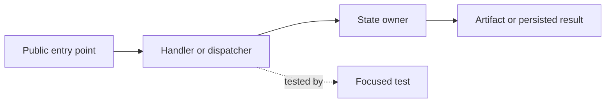

# Codebase Wiki Builder

Use this skill to build a project memory for a real codebase. The wiki should help both humans and future agents answer: "where is this implemented?", "what adjacent files matter?", "which imports and call chains explain it?", "what owns this state?", "what tests prove it?", and "what should be refreshed when the code changes?"

This is not a generic documentation polish skill. Start from the current checkout, explore the repo like a knowledge graph, and write pages that preserve codebase understanding.

## Operating Model

Every codebase wiki has three layers:

- Source truth: source code, tests, configs, migrations, schemas, generated artifacts, logs, benchmark outputs, and existing docs. Read these first; do not mutate source truth unless the user requested code changes.
- Wiki layer: maintained concept pages, module pages, workflow traces, ownership maps, diagnostics, glossary entries, and synthesis pages. The agent owns edits here.
- Support layer: index, change log, page conventions, navigation/search assets, CSS/templates, and validation scripts that keep the wiki coherent.

Before editing, classify each touched file as source truth, wiki layer, or support layer. If the user only asked for wiki work, avoid changing runtime code.
When the work touches HTML presentation, shared styles, local TOCs, navigation,
search, or readability polish, load `references/ui-optimization.md` before
editing support-layer assets.

## Workflow

### 1. Orient The Repository

Use when entering a repo or doc area for the first time.

1. Check visible worktree state for relevant docs/code without reverting anything.
2. Locate wiki roots, source roots, tests, configs, generated docs/assets, runtime artifacts, and build/run entry points.
3. Read the wiki index or landing page first. If absent, infer taxonomy from file names, headings, and package boundaries.
4. Build a working map:
   - main packages/modules;
   - public APIs, CLIs, daemons, workers, plugins, routes, jobs, or services;
   - storage/state owners;
   - important config/env surfaces;
   - test suites and runtime artifact locations;
   - generated docs/search/navigation assets.

Useful commands:

```bash
rg --files | sed -n '1,160p'
rg -n "class |def |async def |interface |type |register|router|handler|entry|main\\(" <source-roots>
rg -n "pytest|describe\\(|it\\(|test_|fixture|scenario|benchmark" <test-roots>
rg -n "architecture|overview|workflow|diagnostic|wiki|index" docs README* .agents
```

### 2. Choose The Agent Shape

Use at most three role types. Bundle multiple capabilities into each role; do not create one worker per lens.

Roles:

1. Coordinator/reducer: owns scope, seeds, file ownership, graph schema, merge decisions, conflict handling, and final validation. Keep this role single. Prompt file: `agents/coordinator_reducer.md`.
2. Graph explorer: read-only. Explores code, adjacent files, imports, call paths, tests, configs, docs, and runtime artifacts. This role may run multiple instances in parallel when seeds or repo areas are disjoint. Prompt file: `agents/graph_explorer.md`.
3. Wiki builder: write-capable. Writes or rewrites wiki pages from the reduced graph. This role may run multiple instances only when each owns a non-overlapping file set. Prompt file: `agents/wiki_builder.md`.

Parallelism rules:

- Safe: multiple graph explorers reading different modules, workflows, symbols, or test areas.
- Safe: multiple wiki builders writing different HTML/Markdown pages with explicit file ownership.
- Unsafe: multiple writers touching the same page, index, search index, sidebar, stylesheet, log, or shared template.
- Serial: shared assets and final link/search/index/log updates should be owned by the coordinator/reducer unless explicitly partitioned.
- Required: every parallel output must return structured graph or write evidence; prose-only scout reports are not enough.

Use sequential execution for small pages. Use parallel exploration for broad codebase maps or when independent modules/workflows need source tracing. Use parallel writing only after the coordinator assigns disjoint target files.

When launching a subagent or preparing a role-specific prompt, load the matching prompt file from `agents/`. Do not invent new role prompts unless the existing three roles cannot express the work.

### 3. Explore Like A Knowledge Graph

Use this loop before writing or updating a codebase wiki page.

The graph explorer bundles several lenses internally, then returns one graph shard. Multiple graph explorers may run in parallel, but each explorer still uses all relevant lenses for its assigned seed or area.

Explorer lenses:

- Neighborhood lens: sibling files, package exports, local schemas, adjacent docs.
- Import lens: inbound imports, outbound imports, registration tables, dependency injection, route/plugin/task catalogs.
- Call-path lens: entry points, definitions, callers, callees, lifecycle steps.
- Test lens: mirrored tests, fixtures, scenarios, benchmarks, expected artifacts.
- Runtime lens: config/env keys, persistence paths, logs, traces, generated reports, background jobs.
- Delta lens: per-section `last-reviewed-commit` metadata and `git diff` from that baseline to `HEAD` for the section's evidence paths.
- Staleness lens: existing wiki claims, old paths, renamed symbols, missing links, stale terminology.

Workflow:

1. Pick a seed: user question, page title, symbol, error, route, op name, config key, test name, or artifact field.
2. Assign a scope: one module, workflow, symbol family, route/op family, test family, or doc group.
3. Run the lenses in one coordinated pass. The goal is a coherent graph shard, not independent summaries.
4. Expand immediate code neighbors:
   - same directory siblings;
   - package `__init__` or barrel exports;
   - protocols/interfaces/base classes;
   - schema/model files;
   - tests in mirrored paths;
   - docs already mentioning the seed.
5. Expand imports and call chains:
   - inbound imports: files importing this module/symbol;
   - outbound imports: modules this file depends on;
   - callers and callees for key functions/classes;
   - registration tables, dependency injection, route maps, plugin catalogs, or task registries.
6. Expand runtime context:
   - config/env keys;
   - persistence/storage paths;
   - background jobs, queues, daemons, subprocesses, or network boundaries;
   - logs, traces, benchmark outputs, or scenario artifacts.
7. For existing wiki sections, read their recorded baseline commit and evidence paths, then sample source changes with `git diff <last-reviewed-commit>..HEAD -- <evidence-paths>` before deciding whether a quick delta refresh is enough.
8. Stop when the graph explains ownership, workflow, tests, and failure modes. Do not crawl the whole repo unless the user asked for a broad map.

Useful commands:

```bash
rg -n "<seed-symbol-or-string>" <source-roots> <test-roots> docs
rg -n "from .*<module>|import .*<module>|<symbol>\\(" <source-roots> <test-roots>
find <source-dir> -maxdepth 2 -type f | sort
```

When available, use LSP/symbol tools for definitions, references, implementations, incoming calls, and outgoing calls. Treat `rg` as the broad map and symbol tools as precise edge verification.

Record graph edges in this vocabulary:

- `imports`: module A depends on module B.
- `exports`: module A exposes symbol B.
- `calls`: function A invokes function B.
- `registers`: module A adds handler/op/plugin/route B.
- `owns-state`: module A owns cache, DB row, file, lock, lease, handle, or lifecycle B.
- `reads-config`: module A consumes env/config key B.
- `emits-artifact`: code path A writes log/trace/report B.
- `tested-by`: behavior A is covered by test/scenario B.
- `documented-by`: source/wiki page A explains behavior B.

Merged graph output shape:

```yaml
seed:
  kind: symbol|file|workflow|error|config|artifact|doc
  value: ...
scope:
  roots: [...]
  stop_reason: ownership|workflow|tests|failure_modes|user_scope
nodes:
  - kind: file|symbol|module|test|config|artifact|doc
    id: ...
    role: entrypoint|neighbor|owner|adapter|test|artifact|doc
edges:
  - type: imports|exports|calls|registers|owns-state|reads-config|emits-artifact|tested-by|documented-by
    from: ...
    to: ...
evidence:
  - path: ...
    symbol: ...
    why_it_matters: ...
section_baselines:
  - page: ...
    section_id: ...
    last_reviewed_commit: ...
    evidence_paths: [...]
    delta_summary: ...
open_questions:
  - ...
```

Coordinator merge rules:

- Merge graph shards by canonical file path, symbol name, route/op name, test name, config key, and artifact path.
- Preserve conflicts instead of smoothing them over. A stale doc claim and a current code path should become an explicit `stale-claim` note.
- Promote repeated nodes into canonical wiki pages only when they are reusable concepts, boundaries, or workflows.
- Choose one main workflow path for the page, then keep secondary paths as related flows or diagnostics.

Wiki builder output shape for each assigned file:

```yaml
target_file: ...
owned_files: [...]
source_graph_nodes: [...]
sections_changed: [...]
section_baselines_updated:
  - section_id: ...
    last_reviewed_commit: ...
    evidence_paths: [...]
links_changed: [...]
validation:
  commands: [...]
  result: pass|warning|fail
open_questions:
  - ...
```

### 4. Trace Source Truth

Use before writing any technical claim.

1. Find the public entry point: API, CLI, tool, route, daemon op, job, plugin, command, config, or generated artifact.
2. Trace inward through handlers, services, state managers, adapters, persistence, and tests.
3. Record exact evidence:
   - file path and symbol name;
   - function/class responsibility;
   - adjacent files that complete the picture;
   - import/call/registration relationship;
   - tests or runtime artifacts that cover it;
   - known failure modes or diagnostics.
4. If a claim cannot be grounded in current code, mark it as an open question instead of writing it as fact.

For behavior claims, inspect tests and run the narrowest useful verification when appropriate.

### 5. Choose Page Types

Pick page types by how future agents will search.

- Overview page: repo-level map, major subsystems, common entry points, and where to go next.
- Module page: one package/component, public surface, adjacent files, imports, dependencies, owned state, and tests.
- Workflow page: one end-to-end path through time, with ordered steps and state transitions.
- Ownership page: which module owns a concept, resource, cache, schema, config, lifecycle, or artifact.
- Knowledge graph page: nodes/edges for a subsystem when relationships matter more than prose.
- Diagnostics page: symptoms, likely layer, inspection commands, and code/test anchors.
- Project memory page: durable decisions, invariants, refresh triggers, and open questions.
- Source note: compact summary of one raw artifact when it should not become a reusable page.

Do not create a page for every file. Create pages for reusable concepts, boundaries, workflows, and graph hubs.

### 6. Write Pages For Humans And Agents

Each page should be user-facing first and LLM-understandable throughout. Use this shape:

1. Brief: two to five sentences explaining what this page helps with and the current verdict.
2. Map or diagram: Mermaid, existing HTML diagram components, or a concise text graph showing modules and edges.
3. Workflow summary: ordered user-friendly steps through the system.
4. Technical dive analysis: source-backed details for agents and engineers.
5. Evidence ledger: key files, symbols, tests, configs, and artifacts.
6. Section freshness metadata: for each major section, record the git commit reviewed and the evidence paths used for future delta comparison.
7. Maintenance memory: what makes this page stale, refresh commands, and open questions.
8. Related pages: parent, child, adjacent module, workflow, diagnostics, and tests.

The technical dive should be structured, not a code dump:

- Entry point.
- Adjacent files.
- Import and registration chain.
- Call path.
- State and lifecycle ownership.
- Config and artifact surfaces.
- Tests and verification.
- Failure modes.

A good codebase wiki page should answer:

- What owns this behavior?
- What code path runs first?
- What files are adjacent and why do they matter?
- What imports, registrations, or call chains connect the pieces?
- What state is read, written, cached, emitted, or published?
- What is intentionally not owned here?
- What breaks when this page goes stale?
- Which tests or artifacts should be checked after changes?

Use diagrams, cards, and ordered sequences for workflows. Use tables only for compact comparisons. If a table contains long paragraphs or file paths, turn the reader-facing part into cards/sequences and keep evidence in a compact list or details block.

For module wikis that have sibling modules, hold the detail bar consistent across modules. If one module page explains workflows with diagrams, the adjacent module pages should also include source-backed workflow diagrams for their major lifecycle paths instead of only prose summaries or tables.

### 7. Maintain Section Freshness Metadata

Each maintained wiki section with technical claims should keep a machine-readable source baseline so future runs can do quick delta comparison before re-exploring the whole graph.

- Record the source-truth commit reviewed for that section as `last-reviewed-commit`.
- Record the relevant source, test, config, doc, and artifact paths as `evidence-paths`.
- Update the baseline whenever the section's claims are refreshed against current source truth.
- Use the commit returned by `git rev-parse HEAD` at the time of source review unless the wiki update has already been committed and the project convention prefers that commit.
- If the working tree contains uncommitted source changes that affect the section, mark the baseline as `HEAD-plus-worktree` or add an open question instead of pretending the commit contains those changes.

For HTML, prefer attributes on the section container:

```html
<section id="request-lifecycle"
  data-last-reviewed-commit="abc1234"
  data-evidence-paths="backend/src/sandbox/host/daemon_client.py tests/sandbox/test_daemon_client.py">
```

For Markdown, place a compact comment directly after the heading:

```markdown
## Request Lifecycle
<!-- wiki-section: request-lifecycle; last-reviewed-commit: abc1234; evidence-paths: backend/src/sandbox/host/daemon_client.py, tests/sandbox/test_daemon_client.py -->
```

Future quick-refresh command pattern:

```bash
git diff <last-reviewed-commit>..HEAD -- <evidence-paths>
git log --oneline <last-reviewed-commit>..HEAD -- <evidence-paths>
```

For every static HTML wiki page, add or update a tail maintenance component before the page footer/navigation. The component should summarize the page-local baseline commit and the Git command shape future agents should run. If every section on the page shares one commit, show that commit once; if sections differ, list the unique commits or mark the page as mixed. Keep this component user-visible, compact, and near the end of the page so maintainers can see the local baseline without inspecting every section attribute.

Recommended HTML shape:

```html
<div class="page-baseline" data-page-baseline-commit="abc1234">
  <strong>Maintenance baseline</strong>
  <span>Section metadata reviewed at <code>abc1234</code>.</span>
  <code>git diff abc1234..HEAD -- &lt;section evidence paths&gt;</code>
</div>
```

Update the tail component whenever section `last-reviewed-commit` metadata changes. The component is a reference to the page's local section baselines; section-level `data-evidence-paths` remain the precise path source for delta checks.

### 8. Promote Workflow Diagrams

Prefer a diagram whenever a page crosses more than one module or lifecycle boundary.

Use Mermaid when the target format supports it:



For static HTML without Mermaid support, use the repo's existing diagram/card components or a compact text graph:

```text
Public entry point
  calls -> handler
  registers -> operation table
  owns-state -> cache/lease/handle
  tested-by -> focused test
```

Every diagram should correspond to evidence in the technical dive. Do not add decorative diagrams.

For static HTML module pages, prefer the shared stylesheet's existing diagram/card classes such as `diagram`, `flow-row`, `node`, `sequence`, `edge-list`, `summary`, `evidence-grid`, and `page-baseline`. Do not add inline `style` attributes or page-local `<style>` blocks unless the shared stylesheet cannot express the layout; if a new reusable pattern is needed, add it once to the shared `assets/styles.css`.

### 9. Link The Wiki

Use links to encode the codebase graph.

1. Link from overview pages to module/workflow/diagnostic pages.
2. Link module pages to workflows they participate in.
3. Link workflow pages back to owner modules, adjacent files, and tests.
4. Link diagnostics to the exact workflow or owner page where the failure should be fixed.
5. Update index/search/navigation whenever page titles, IDs, or page relationships change.

For HTML output, use normal links with descriptive labels. Do not render Obsidian-only `[[...]]` syntax. For Markdown output, use the repo's existing link style.

### 10. Answer And File Back

Use when the user asks a codebase question that produces reusable knowledge.

1. Search the wiki first.
2. Verify against current source truth before answering if the claim could drift.
3. Answer the user with concise code references.
4. If the answer is durable, update or create the relevant wiki page.
5. Update index, backlinks, and log so future agents do not rediscover the same path.

This is the project-memory loop: repo investigations should leave better navigation behind.

### 11. Publish Or Polish

HTML and Markdown are presentation layers, not the core skill.

Before changing HTML presentation or shared CSS, read
`references/ui-optimization.md` and apply its accessibility, readability,
token, and multi-module consistency rules. Treat CSS/templates/navigation/search
as support-layer files and keep shared assets serially owned by the
coordinator/reducer.

For multi-module HTML wikis, prefer one neutral root such as `docs/architecture/` with one shared `assets/` directory and module subdirectories such as `sandbox/`, `tools/`, `engine/`, or `task-center/`. The frontend navigation should have three layers: a global architecture/module layer, the active module's page list, and the active page's local section TOC. Keep module pages in their module folder, keep shared CSS/JS/search assets at the root asset layer, and make the active module/page discoverable through stable metadata such as `data-module`, `data-page`, and `data-root`.

Cross-module wiki links are allowed and expected when they describe real architecture edges. Do not strip or rewrite a link just because it crosses from one module folder to another; instead, make the relative path explicit and ensure the global search/sidebar can surface the target module.

For static HTML pages, include a local table of contents, related pages, stable anchors, readable cards/sequences, and responsive CSS. Every HTML page that has section anchors should have exactly one local `page-toc` component near the top of the page's primary section, immediately under the page heading and before the opening overview/summary block. The TOC should list the page's local section anchors, and the active page's same section links should also appear in the sidebar navigation. The local TOC should use the shared compact style; avoid page-specific full-width multi-column TOC grids that stretch sparse entries across the article. Do not make one page use a bespoke TOC style while sibling pages use another pattern. Example:

```html
<nav class="page-toc" aria-labelledby="page-toc-heading">
  <h3 id="page-toc-heading">Contents</h3>
  <ol>
    <li><a href="#request-lifecycle"><span>6.3</span> Request Lifecycle</a></li>
  </ol>
</nav>
```

Keep related-page shortcuts in the page's normal `wiki-links` component, not inside the TOC. Place those related links below the overview/summary block, and do not include same-page section anchors that duplicate the local `page-toc`. This keeps every page's contents component visually consistent and machine-checkable. If the sidebar is script-generated, make it consume the shared `page-toc` links instead of separately parsing heading IDs.

Defensive layout rules for codebase docs:

- Follow `references/ui-optimization.md` when adjusting shared CSS or polishing
  page readability.
- Reuse shared CSS components across sibling modules; avoid page-specific CSS and inline styles.
- Use `minmax(0, 1fr)` for flexible grid columns.
- Put `min-width: 0` on grid/flex children.
- Use `overflow-wrap: anywhere` on links, cells, code, file refs, symbols, and sequence text.
- Keep prose around 65-78 characters per line.
- Stack long evidence refs inside table cells.
- Convert dense four-column evidence tables into cards or sequences plus a compact evidence block.
- Include a compact tail maintenance component for HTML pages with section baselines. It should display the page-local baseline commit and a `git diff <commit>..HEAD -- <section evidence paths>` command shape.
- Include exactly one `page-toc` component for every HTML page with local section anchors, using the shared TOC style across all pages, and mirror those local section links in the active page sidebar.
- For merged module wikis, validate root-relative movement, shared asset references, global search entries with module labels, old-location redirects if URLs moved, and cross-module links.

### 12. Lint The Codebase Wiki

Run a maintenance pass before handoff or after larger restructuring.

Check for:

- claims without current code/test evidence;
- missing, stale, or non-parseable section `last-reviewed-commit` metadata;
- missing or stale HTML tail maintenance components for page-local baseline commits;
- missing, duplicate, or page-specific local TOC components on HTML pages with section anchors;
- active-page sidebar links that fail to mirror local TOC links;
- stale paths, renamed symbols, deleted tests, or old env vars;
- broken local links and missing anchors;
- duplicate page titles or duplicate IDs;
- orphan pages with no inbound links;
- overloaded pages that should be split by module/workflow;
- repeated concepts with no canonical page;
- contradictions between wiki pages and current source;
- index, search, sidebar, and log drift;
- rendered markdown/Obsidian syntax in HTML;
- layout hazards from long paths, symbols, or test names.

## Minimal Artifacts

For a codebase wiki, maintain these files or equivalents:

- index: subsystem catalog with one-line summaries and links.
- log: append-only wiki maintenance timeline with date, source area, graph edges explored, pages changed, and verification.
- conventions: page types, evidence format, source citation policy, graph edge vocabulary, and validation commands.
- section baselines: per-section `last-reviewed-commit` plus evidence paths, stored inline with the page so future runs can diff source truth quickly.
- navigation/search support: sidebar, backlinks, search index, or generated TOC depending on format.

Avoid extra meta-docs unless they directly improve future codebase navigation.

## Validation

Run validation that matches the output format and touched surface.

For static HTML wiki pages:

```bash
python3 .agents/skills/codebase-wiki-builder/scripts/check_html_wiki.py <changed-html-pages>
git diff --check -- <changed-html-css-js-files>
rg -n "\\[\\[|\\]\\]" <changed-html-pages>
```

For Markdown or mixed docs:

```bash
rg -n "\\bTODO\\b|broken link|stale|contradict|TBD" <wiki-root>
rg -n "\\[.*\\]\\([^)]*\\)" <wiki-root>
```

For code evidence drift, sample referenced paths and symbols:

```bash
rg -n "<symbol-or-op-name>" <source-roots> <test-roots> <wiki-root>
```

For graph quality, verify every major page has at least one entry point, one adjacent file/module, one edge type, and one evidence source.

For section freshness, verify changed sections have a valid baseline commit and evidence paths. If a section is explicitly marked `HEAD-plus-worktree`, report that caveat and the uncommitted paths instead of running `git cat-file` on it:

```bash
git cat-file -e <last-reviewed-commit>^{commit}
git diff <last-reviewed-commit>..HEAD -- <evidence-paths>
```

For HTML tail maintenance components, verify that every page with section baselines has a `page-baseline` component and that its displayed baseline commit matches the unique section commit when the page is not mixed.

For HTML table-of-contents components, verify that every page with section anchors has exactly one `page-toc`, that it links only to anchors present in that same file, that all pages use the same shared component shape, and that the sidebar displays the active page's same local TOC links.

When browser inspection is blocked for local files, report that constraint and list the static checks run.

## Done Criteria

A codebase wiki update is done when:

- the reader can enter from the index or related page;
- the brief is user-friendly and the technical dive is precise enough for future agents;
- new or changed claims are grounded in current source truth;
- new or changed sections record `last-reviewed-commit` and evidence paths for future delta refreshes, or explicitly mark `HEAD-plus-worktree` when uncommitted source truth was included;
- HTML pages with section baselines include a tail maintenance component showing the page-local baseline commit and Git delta command shape;
- HTML pages with local section anchors include exactly one shared-style local TOC and expose those section links in the active page sidebar;
- major code paths include adjacent files, import/call/registration edges, and file/symbol/test evidence;
- workflow diagrams match the evidence ledger;
- links connect overview, module, workflow, diagnostics, tests, and project memory;
- index/search/navigation/log are updated when applicable;
- obsolete syntax, stale paths, and stale labels are gone;
- validation is run and any remaining warnings are explained.
