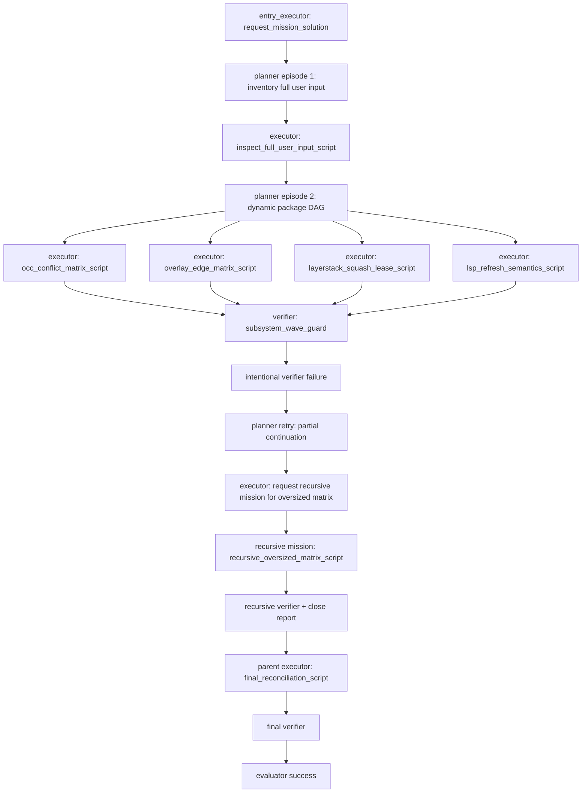

# Full-stack adversarial agent-tool-script live E2E testing plan

**Date:** 2026-05-10
**Scope:** Add one sophisticated live scenario that drives TaskCenter,
public tool calls, sandbox mutations, OCC, overlay capture, layer-stack
snapshots, LSP refresh, recursive missions, and audit persistence through
mocked agent tool scripts. The scenario should run on the existing
SWE-EVO live-test framework under `backend/src/benchmarks/sweevo/live_test/`.

---

## 1. Contract

This scenario is not a pytest-side sandbox integration test. It is an
agent-workflow test. The harness may start the run and assert the outcome, but
all meaningful work must be performed by launched agents using real tools.

### Non-negotiable invariant

Every sandbox mutation and every workflow transition under test must be driven
by an agent tool script.

Allowed in pytest:

- Select the SWE-EVO instance.
- Create or reuse the Daytona sandbox fixture.
- Start `run_scenario(...)`.
- Assert the final TaskCenter graph, audit tree, sandbox state, metrics, and
  message logs.
- Read final evidence for verification only.

Forbidden in pytest:

- Seeding scenario files directly.
- Calling `sandbox.api.write_file`, `sandbox.api.edit_file`,
  `sandbox.api.shell`, or plugin APIs to perform scenario work.
- Mutating layer-stack or OCC state directly.
- Calling `lsp.*` outside the agent tool execution path.
- Treating a direct fixture setup mutation as scenario coverage.

Coverage rule:

```text
If a mutation cannot be traced in message.jsonl as an agent tool_use/tool_result,
it does not count as coverage.
```

Expected execution path:

```text
pytest
  -> run_scenario(...)
    -> start_task_center_entry_run(...)
      -> MockSquadRunner(agent role)
        -> Scenario.executor_actions(...)
          -> PreparedToolScriptEngine.run(...)
            -> execute_tool_once(...)
              -> real tool:
                   write_file
                   edit_file
                   read_file
                   shell
                   lsp.hover
                   lsp.diagnostics
                   lsp.find_definitions
                   lsp.find_references
                   lsp.query_symbols
              -> sandbox runtime / OCC / overlay / layer-stack / LSP plugin
```

The agents are mocked only in decision-making. The tool calls, sandbox
mutations, TaskCenter lifecycle, OCC commits, overlay captures, and LSP session
refreshes are real.

---

## 2. Existing anchors

The plan extends these current surfaces rather than creating a parallel
harness:

| Area | Current anchor |
| --- | --- |
| SWE-EVO live scenario runner | `backend/src/benchmarks/sweevo/live_test/runner.py` |
| Scenario protocol | `backend/src/benchmarks/sweevo/live_test/scenarios/base.py` |
| Dynamic full-user-input scenario | `backend/src/benchmarks/sweevo/live_test/scenarios/full_case_user_input.py` |
| Prepared tool scripts | `backend/src/benchmarks/sweevo/live_test/squad/tool_scripts.py` |
| Mocked agent execution seam | `backend/src/benchmarks/sweevo/live_test/squad/runner.py` |
| Existing live test assertion style | `backend/src/benchmarks/sweevo/live_test/tests/test_full_case_user_input.py` |
| LSP live scenario model | `backend/src/benchmarks/lsp_live_test/scenarios.py` |
| Public sandbox live matrices | `backend/tests/live_e2e_test/sandbox/layer_stack_overlay_occ/` |

Keep the default SWE-EVO fixture contract:

```python
select_sweevo_instance(
    instance_id=os.getenv("EOS_SWEEVO_INSTANCE", "dask__dask_2023.3.2_2023.4.0")
)
```

The user input source of truth remains the exact prompt string already produced
by the runner:

```text
prompt_text = user_prompt if provided else build_sweevo_user_prompt(instance, repo_dir=repo_dir)
start_task_center_entry_run(prompt=prompt_text, ...)
```

Do not reconstruct, enrich, or reparse CSV data outside that already-rendered
prompt. If `<pr_description>` appears, it is because the current prompt builder
already put it there.

---

## 3. Target files

Add these files:

```text
backend/src/benchmarks/sweevo/live_test/scenarios/full_stack_adversarial.py
backend/src/benchmarks/sweevo/live_test/squad/full_stack_tool_scripts.py
backend/src/benchmarks/sweevo/live_test/tests/test_full_stack_adversarial.py
```

Modify these files narrowly:

```text
backend/src/benchmarks/sweevo/live_test/scenarios/__init__.py
backend/src/benchmarks/sweevo/live_test/squad/runner.py
backend/src/benchmarks/sweevo/live_test/squad/tool_scripts.py
backend/src/benchmarks/sweevo/live_test/audit/events.py
```

Expected new scenario name:

```text
full_stack_adversarial
```

Expected metrics artifact:

```text
.omc/results/full-stack-adversarial-<run_id>.jsonl
```

---

## 4. Workflow

The scenario should be a single umbrella run with independent metric cells and
clear subsystem attribution.



TaskCenter shape:

```text
mission(root)
  episode(1): inventory and requirement/package extraction
  episode(2): subsystem execution wave
    attempt(1): verifier fails intentionally
    attempt(2): continuation plan requests recursive mission and reconciles
  mission(recursive): oversized adversarial matrix
  episode(3): final full plan, final verifier, evaluator
```

The exact number of executor tasks should be dynamic, based on the rendered
user input package plan. The structural requirements are fixed:

- At least four independent subsystem executor tasks.
- At least one verifier depending on multiple executor tasks.
- At least one forced verifier failure.
- At least one planner retry or partial continuation after that failure.
- At least one recursive mission requested by an executor task.
- Parent final verification occurs only after recursive mission completion.

---

## 5. Scenario behavior

### 5.1 `FullStackAdversarial`

`FullStackAdversarial` should subclass `ScenarioBase`.

Required state:

```python
class FullStackAdversarial(ScenarioBase):
    name = "full_stack_adversarial"

    _user_input_plan: UserInputPlan | None
    _forced_failure_seen: bool
    _recursive_package_id: str | None
    _matrix_cells: list[FullStackCell]
```

The scenario should expose:

- `requirement_ledger`: parsed from the rendered prompt.
- `package_plan`: dynamic packages derived from rendered user input.
- `matrix_plan`: generated subsystem cells that tool scripts execute.

Planner responses:

1. Episode 1, attempt 1:
   - Full plan with `inspect_user_input`.
   - Evaluation criteria: rendered prompt captured, package graph generated,
     workspace proof produced through tools.
2. Episode 2, attempt 1:
   - Partial plan with subsystem executors:
     `occ_matrix`, `overlay_matrix`, `layerstack_matrix`, `lsp_matrix`.
   - One verifier task depends on all subsystem executors.
3. Episode 2, retry attempt:
   - Partial continuation with:
     `request_recursive_matrix`, `final_reconciliation`, `recursive_return_guard`.
4. Recursive mission:
   - Partial plan for oversized matrix cells.
   - Recursive verifier.
   - Recursive close report.
5. Final episode:
   - Full plan with final verifier and evaluator.

Executor action routing:

```text
ACTION inspect_full_user_input
ACTION occ_conflict_matrix
ACTION overlay_edge_matrix
ACTION layerstack_squash_lease
ACTION lsp_refresh_semantics
ACTION request_recursive_matrix package=<id>
ACTION recursive_oversized_matrix
ACTION final_reconciliation
```

Verifier behavior:

- `subsystem_wave_guard` fails the first time, even if tool scripts succeeded.
- The failure body must reference missing retry-only evidence.
- Retry context must appear in subsequent planner prompt inspections.
- `recursive_return_guard` passes only after recursive mission close.
- `final_release_guard` passes only after final reconciliation reads all
  evidence artifacts through tools.

Evaluator behavior:

- Submit success only after:
  - Final verifier passed.
  - TaskCenter graph is done.
  - Required metrics summary row exists.
  - All matrix cells passed.

---

## 6. Agent tool scripts

Use `PreparedToolScriptEngine.run(...)` as the only path for scenario work.
Every script must:

- Emit assistant text announcing each step.
- Call real tools through `_call_tool(...)`.
- Record a compact artifact under `.ephemeralos/sweevo-mock/full_stack/`.
- Read its own artifact back through `read_file`.
- Emit metric rows through a tool-visible artifact path.
- Return a `ToolScriptResult` with artifact paths.

### 6.1 `inspect_full_user_input_script`

Purpose:

- Prove the scenario is using the full rendered user input.
- Persist the requirement ledger and package DAG.
- Establish workspace proof under `/testbed`.

Required tool steps:

| Step | Tool | Purpose |
| --- | --- | --- |
| `mkdir-evidence-root` | `shell` | Create `.ephemeralos/sweevo-mock/full_stack/` |
| `assert-workspace` | `shell` | Prove `/testbed/.git` exists |
| `write-requirement-ledger` | `write_file` | Persist parsed requirements |
| `write-package-plan` | `write_file` | Persist dynamic DAG packages |
| `read-ledger` | `read_file` | Verify ledger through public read path |
| `read-package-plan` | `read_file` | Verify DAG through public read path |
| `write-conflict-probe` | `write_file` | Seed expected edit conflict |
| `missing-anchor-conflict` | `edit_file` | Expected error: typed conflict |

Assertions:

- `requirement_count > 100` for the default Dask fixture.
- `package_count >= 4`.
- Missing-anchor edit is an expected tool error, not an internal error.
- The tool error is present in agent `message.jsonl`.

### 6.2 `occ_conflict_matrix_script`

Purpose:

- Stress OCC conflict handling, direct/gated routing, public tool correctness,
  and retry behavior.

Required cells:

| Cell | Tools | Expected outcome |
| --- | --- | --- |
| `same_path_concurrent_write` | `write_file` x2 | One commit, one conflict |
| `disjoint_concurrent_writes` | `write_file` xN, `read_file` | All files visible |
| `same_file_disjoint_edits` | `edit_file` x2 | Both edits visible after retry if needed |
| `same_file_overlap_edits` | `edit_file` x2 | One winner, one conflict |
| `shell_stale_conflict` | `shell`, `write_file`, `read_file` | Public write wins stale shell |
| `nonzero_shell_commits_side_effect` | `shell`, `read_file` | Failed shell reports an error and publishes tracked side effects |
| `tracked_and_ignored_mixed` | `shell`, `read_file` | Gated tracked state correct, ignored direct route isolated |
| `delete_vs_write` | `shell`, `write_file`, `read_file` | Deterministic conflict or final state proof |

Important rule:

- For filesystem-overlap attribution probes, use raw provider/process evidence
  only as an assertion aid when needed. Scenario mutations still happen through
  agent tool scripts.

Required artifact:

```text
.ephemeralos/sweevo-mock/full_stack/occ-matrix.json
```

### 6.3 `overlay_edge_matrix_script`

Purpose:

- Exercise overlay capture forms and edge paths through the `shell` tool.

Required cells:

| Cell | Workload | Expected outcome |
| --- | --- | --- |
| `new_files` | Create tracked files | Files visible through `read_file` |
| `modify_files` | Modify existing files | New content visible |
| `delete_files` | Delete tracked files | Public read returns absent |
| `mixed_kinds` | New + modify + delete | All changes match expected state |
| `deep_paths` | Deep nested paths | No path truncation |
| `special_chars` | Spaces, brackets, quotes-safe names | Public read works |
| `long_filename` | Max safe filename length | Commit succeeds or typed path error |
| `symlink_inside` | Symlink points inside workspace | Gated capture rejection is explicit and recorded |
| `symlink_escape` | Symlink points outside workspace | Escape is rejected and not committed |
| `whiteout_collision` | Delete and recreate path family | Merged view deterministic |
| `outside_workspace_write` | Write outside `/testbed` | Not committed to layer stack |
| `noop_shell` | No filesystem change | No layer created or no committed changes |

Required artifact:

```text
.ephemeralos/sweevo-mock/full_stack/overlay-matrix.json
```

### 6.4 `layerstack_squash_lease_script`

Purpose:

- Prove that layer-stack manifests, leases, squash, GC, and merged views remain
  coherent under a deep mutation sequence.

Required steps:

1. Read initial workspace binding through a tool-visible shell/API probe.
2. Perform enough public `write_file` and `edit_file` calls to increase
   manifest depth.
3. Hold at least one old snapshot-visible path as evidence.
4. Trigger natural auto-squash through normal mutation volume.
5. Read layer metrics through the public daemon/status surface if available.
6. Verify merged content through:
   - `read_file`
   - `shell cat`
   - final reconciliation artifact

Required assertions:

- Manifest version increases monotonically.
- Current merged view has latest writes.
- Squash reduces depth or emits the expected squash event.
- Leased/pinned state does not lose readable evidence.
- GC does not remove layers still pinned by active leases.

Required artifact:

```text
.ephemeralos/sweevo-mock/full_stack/layerstack-matrix.json
```

### 6.5 `lsp_refresh_semantics_script`

Purpose:

- Prove Pyright sees the latest layer-stack snapshot through the plugin
  tool path after public write/edit mutations.

Required tool set:

- `lsp.hover`
- `lsp.find_definitions`
- `lsp.find_references`
- `lsp.query_symbols`
- `lsp.diagnostics`

Required cells:

| Cell | Tool sequence | Expected outcome |
| --- | --- | --- |
| `initial_symbols` | write package, hover, definitions, symbols | Initial package resolved |
| `diagnostic_present` | diagnostics | Undefined symbol reported |
| `diagnostic_fixed` | edit file, diagnostics | No stale diagnostic remains |
| `signature_refresh` | hover, edit signature, hover | New signature visible |
| `cross_file_reference_refresh` | edit imported function, references | References remain correct |
| `config_refresh` | write `pyrightconfig.json`, diagnostics | Config-aware analysis visible |
| `opened_file_deleted` | open file, delete/rename, diagnostics | Close/reopen behavior safe |

Performance assertions:

- Cold first LSP call is reported but not used as a warm-regression failure.
- Manifest-change warm calls should usually stay under `2s`.
- Known no-diagnostics polling tail is reported separately.
- Any Pyright restart after ordinary edit must be visible in metrics or logs.

Required artifact:

```text
.ephemeralos/sweevo-mock/full_stack/lsp-matrix.json
```

### 6.6 `recursive_oversized_matrix_script`

Purpose:

- Run the largest or riskiest package inside a recursive mission, proving that
  complex subtasks can delegate and close independently.

Required behavior:

- Parent executor calls `request_mission_solution`.
- Recursive planner creates at least two executor tasks and one verifier.
- Recursive executors run real tool scripts, not synthetic summaries.
- Recursive verifier writes a close artifact.
- Parent final reconciliation reads the recursive close artifact.

Required artifact:

```text
.ephemeralos/sweevo-mock/recursive/full-stack-close-report.json
```

### 6.7 `final_reconciliation_script`

Purpose:

- Read all subsystem artifacts through public tools and write a final summary
  only after verifying every required cell.

Inputs:

```text
occ-matrix.json
overlay-matrix.json
layerstack-matrix.json
lsp-matrix.json
recursive/full-stack-close-report.json
```

Outputs:

```text
.ephemeralos/sweevo-mock/full_stack/final-reconciliation.json
.omc/results/full-stack-adversarial-<run_id>.jsonl
```

Required summary fields:

```json
{
  "scenario": "full_stack_adversarial",
  "passed_cells": 0,
  "failed_cells": 0,
  "conflicts_detected": 0,
  "expected_tool_errors": 0,
  "unexpected_tool_errors": 0,
  "recursive_missions": 0,
  "lsp_warm_p95_ms": 0,
  "manifest_start": 0,
  "manifest_end": 0
}
```

---

## 7. Metrics schema

Every matrix cell emits one data row:

```json
{
  "schema": "full_stack_adversarial.cell.v1",
  "run_id": "20260510T000000Z",
  "scenario": "full_stack_adversarial",
  "cell": "same_path_concurrent_write",
  "subsystem": "occ",
  "tool_names": ["write_file", "write_file", "read_file"],
  "agent_task_id": "task-id",
  "agent_run_id": "agent-run-id",
  "passed": true,
  "expected_error": false,
  "failure_reason": null,
  "wall_ms": 123.456,
  "manifest_before": 10,
  "manifest_after": 11,
  "route": "gated",
  "correctness": {
    "read_matches_expected": true
  },
  "timings": {
    "occ.commit.total_s": 0.0,
    "occ.commit.publish_layer_s": 0.0,
    "command_exec.capture_upperdir_s": 0.0
  }
}
```

The final row summarizes the run:

```json
{
  "schema": "full_stack_adversarial.summary.v1",
  "run_id": "20260510T000000Z",
  "scenario": "full_stack_adversarial",
  "total_cells": 32,
  "passed_cells": 32,
  "failed_cells": 0,
  "failed_cell_ids": [],
  "expected_tool_errors": 4,
  "unexpected_tool_errors": 0,
  "conflicts_detected": 3,
  "recursive_missions": 1,
  "task_center_status": "done",
  "artifact": ".omc/results/full-stack-adversarial-20260510T000000Z.jsonl"
}
```

Rules:

- Write rows incrementally with append + flush + fsync semantics.
- Rewrite a canonical artifact at the end with one summary row.
- Keep machine-readable metric output even when pytest later fails.
- Include failure reasons per cell, not only one final exception.

---

## 8. Audit and observability requirements

The live test must assert all of the following:

### Message logs

- `message.jsonl` exists for entry executor, planners, executors, verifiers,
  evaluator, and recursive mission agents.
- Every scenario mutation has a corresponding `tool_use` and `tool_result`.
- Expected tool errors are present and marked as errors.
- No direct pytest mutation is needed to explain final workspace state.

### TaskCenter graph

- Run status is `done`.
- At least one planner full plan.
- At least one planner partial plan.
- At least one failed verifier attempt.
- Later planner prompt includes failed-attempt context.
- At least one verifier has more than one dependency.
- At least one recursive mission exists.
- Recursive mission completes before parent final guard.
- Every task exits through exactly one terminal submission path.

### Sandbox monitor events

Require these event types when available:

```text
SANDBOX_LAYER_STACK_LEASE_ACQUIRED
SANDBOX_LAYER_STACK_LAYER_CREATED
SANDBOX_LAYER_STACK_LAYERS_SQUASHED
SANDBOX_OVERLAY_EXECUTED
SANDBOX_OCC_CHANGESET_RECEIVED
SANDBOX_OCC_CHANGES_COMMITTED
SANDBOX_CONFLICT_DETECTED
```

If a monitor event is missing because the runtime does not currently emit it,
the test should fail with a precise message. Do not silently weaken the
scenario.

### Final sandbox state

The final pytest assertions may read state for verification:

- `read_file` checks for all expected committed artifacts.
- `shell` checks for `/testbed` and `.git` identity.
- Daemon workspace binding check proves workspace root is `/testbed`.
- LSP final artifact proves latest semantic state.

These reads are verification only. They are not setup or mutation.

---

## 9. Edge-case coverage map

| Subsystem | Edge cases |
| --- | --- |
| OCC | Same path race, disjoint writes, disjoint edits, overlapping edits, stale shell, delete/write race, missing anchor, nonzero shell, direct/gated mixed route |
| Overlay | New/modify/delete/mixed, whiteout collision, deep paths, long names, special chars, symlink inside, symlink escape, outside-workspace writes, no-op shell |
| Layer stack | Manifest monotonicity, merged view, lease pinning, squash, GC safety, base binding, old snapshot evidence |
| LSP | All five tools, signature refresh, diagnostic fix, config refresh, opened document deletion, cross-file references, stale diagnostics filtering |
| Tool calls | Success, expected error, unexpected error fail-fast, metrics per call, audit message persistence |
| TaskCenter | Dynamic DAG, retry after verifier failure, partial continuation, recursive mission, multi-dependency verifier, evaluator close |

---

## 10. Implementation phases

### Phase 1 - Scenario skeleton

Deliver:

- `FullStackAdversarial` scenario with no sandbox mutations beyond existing
  `inspect_full_user_input_script`.
- Registered scenario import.
- Live pytest that starts and completes with a minimal final artifact.

Verification:

```sh
uv run pytest -q backend/src/benchmarks/sweevo/live_test/tests/test_full_stack_adversarial.py --collect-only
uv run ruff check backend/src/benchmarks/sweevo/live_test
```

### Phase 2 - Agent tool-script expansion

Deliver:

- `full_stack_tool_scripts.py`.
- Runner dispatch for all new `ACTION ...` values.
- No direct sandbox mutations in pytest.
- Message-log assertions for `tool_use` / `tool_result`.

Verification:

```sh
uv run pytest -q backend/tests/unit_test/test_benchmarks/test_sweevo_mock_agent_execution.py
uv run pytest -q backend/src/benchmarks/sweevo/live_test/tests/test_full_stack_adversarial.py --collect-only
```

### Phase 3 - OCC and overlay matrices

Deliver:

- `occ_conflict_matrix_script`.
- `overlay_edge_matrix_script`.
- Expected conflict/error handling.
- Per-cell JSONL metrics.

Verification:

```sh
uv run pytest -s -q backend/src/benchmarks/sweevo/live_test/tests/test_full_stack_adversarial.py
```

### Phase 4 - Layer-stack and LSP matrices

Deliver:

- `layerstack_squash_lease_script`.
- `lsp_refresh_semantics_script`.
- Warm LSP timing rows and semantic-refresh assertions.
- Squash/lease metric rows.

Verification:

```sh
uv run pytest -q backend/tests/unit_test/test_plugins/test_lsp_session_refresh.py
uv run pytest -s -q backend/src/benchmarks/sweevo/live_test/tests/test_full_stack_adversarial.py
```

### Phase 5 - Recursive mission and final reconciliation

Deliver:

- Recursive oversized matrix.
- Parent final reconciliation.
- Final verifier and evaluator success.
- Summary row with `failed_cells == 0`.

Verification:

```sh
uv run pytest -s -q backend/src/benchmarks/sweevo/live_test/tests/test_full_stack_adversarial.py
```

### Phase 6 - Report and hardening

Deliver:

- A short implementation report from the JSONL artifact.
- Stable failure messages for each subsystem boundary.
- Optional tier integration entry if the scenario is stable enough for the
  progressive live tiers.

Verification:

```sh
uv run ruff check backend/src/benchmarks/sweevo/live_test backend/src/benchmarks/lsp_live_test
uv run pytest -q backend/tests/unit_test/test_benchmarks
uv run pytest -q backend/tests/unit_test/test_plugins/test_lsp_session_refresh.py
uv run pytest -s -q backend/src/benchmarks/sweevo/live_test/tests/test_full_stack_adversarial.py
```

---

## 11. Acceptance gates

The scenario is complete only when all gates pass:

1. The live run status is `done`.
2. Final metrics summary has `failed_cells == 0`.
3. At least one expected conflict is observed.
4. At least one expected tool error is observed.
5. No unexpected tool error occurs.
6. All scenario mutations appear in agent message logs.
7. TaskCenter graph includes full plan, partial continuation, verifier failure,
   recursive mission, final verifier, and evaluator success.
8. Public read state and shell state agree for committed evidence.
9. LSP tools observe latest layer-stack state after public edits.
10. Layer-stack manifest version increases across accepted mutations.
11. Squash/lease behavior is either observed or the test fails with an explicit
    missing-observability error.
12. The final pytest body performs verification only, not setup mutation.

---

## 12. Failure triage

Classify failures by boundary:

| Failure symptom | Likely boundary |
| --- | --- |
| Missing `tool_use` for a mutation | Scenario or runner bypassed agent scripts |
| Tool result says internal error for missing anchor | Public edit conflict contract regression |
| Public read disagrees with shell cat | Layer-stack merged view or workspace binding |
| Stale LSP hover/diagnostics after edit | Pyright session refresh or projection retarget |
| Direct route commits tracked path incorrectly | OCC route classifier or gitignore oracle |
| No recursive close before parent guard | TaskCenter recursive mission ordering |
| Verifier failure does not influence retry prompt | Context engine failed-attempt recipe |
| Expected squash event absent | Layer-stack metrics/monitoring gap or squash threshold not reached |
| Nonzero shell side effects are not reported/readable | Public shell side-effect policy regression |

Do not collapse these into one broad "sandbox failed" result. The point of the
scenario is to identify the exact boundary that regressed.

---

## 13. Recommended first implementation slice

The first code slice should be deliberately small:

1. Add `FullStackAdversarial` with the workflow graph and action names.
2. Add `inspect_full_user_input_script` and `final_reconciliation_script`.
3. Add test assertions that prove no scenario mutation happened outside agent
   message logs.
4. Land OCC and overlay matrices after the skeleton is stable.
5. Land layer-stack and LSP matrices last, because they depend on the deepest
   runtime observability and timing behavior.

This keeps the core invariant testable before adding the high-volume edge
matrix.
