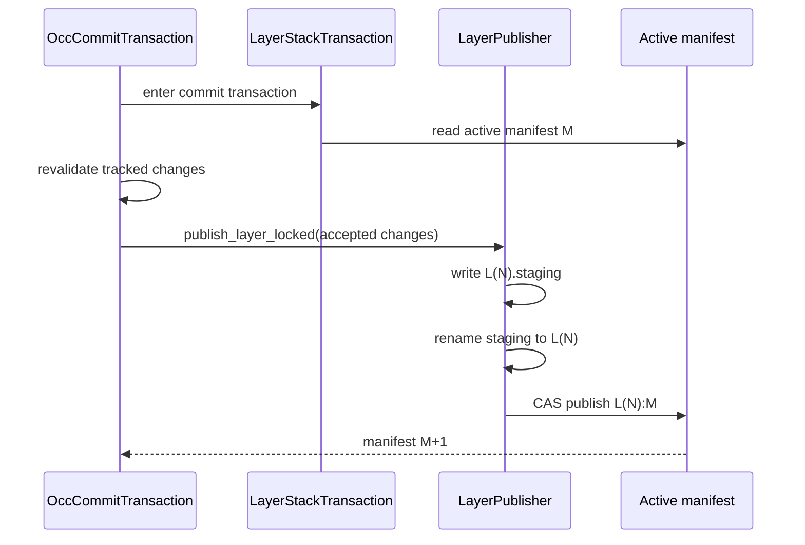
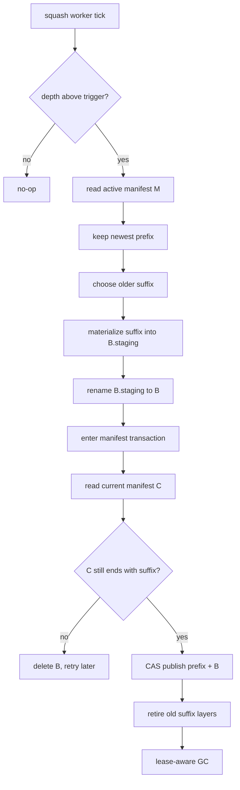

# Algorithm - Layer Publish And Squash

## Purpose

Define how accepted changes become an immutable layer and how old immutable
layers are compacted into checkpoint layers without breaking leased requests.
This algorithm is owned by `sandbox/layer_stack/`.

## Owner Modules

```text
sandbox/layer_stack/stack_manager.py
sandbox/layer_stack/publisher.py
sandbox/layer_stack/squash.py
sandbox/layer_stack/merged_view.py
sandbox/layer_stack/lease_registry.py
sandbox/layer_stack/manifest.py
```

No OCC policy lives here.

## Normal Layer Publish

Input:

```text
active manifest M
accepted LayerChange list from OccCommitTransaction
```

Output:

```text
new manifest M+1 with one new immutable layer at the front
```

Algorithm:

```text
publish_layer_locked(changes):
  assert layer-stack transaction lock is held
  if changes is empty:
    return active_manifest

  active = read_active_manifest()
  layer_id = next_layer_id(active.version)
  staging = create_dir(layer_id + ".staging")

  for change in changes:
    write change into staging using overlay semantics:
      write file bytes
      create whiteout for delete
      create opaque marker for opaque dir
      create symlink for symlink change

  fsync staging contents where available
  rename staging -> layer_id
  new_manifest = Manifest(version=active.version + 1,
                          layers=(layer_id, *active.layers))
  cas_publish_manifest(expected=active.version, new_manifest)
  return new_manifest
```

Crash behavior:

```text
crash before staging rename:
  orphan *.staging dir, not referenced by manifest, fsck removes

crash after layer rename before manifest CAS:
  orphan layer dir, not referenced by manifest, fsck removes

crash after manifest CAS:
  committed layer is visible from active manifest
```

## Publish Workflow



## Squash Trigger

Squash is a maintenance algorithm. It does not call OCC and does not reclassify
paths. It uses `merged_view` semantics to materialize old layers.

Suggested constants:

```text
SQUASH_TRIGGER = 80
SQUASH_TARGET = 40
EMERGENCY_DEPTH = 95
MAX_DEPTH = 100
```

Policy:

```text
if depth < SQUASH_TRIGGER:
  do nothing
elif depth < EMERGENCY_DEPTH:
  schedule background squash
elif depth >= EMERGENCY_DEPTH:
  foreground squash or backpressure commits until depth is reduced
```

## Squash Algorithm

```text
squash_once():
  base = read_active_manifest()
  if len(base.layers) < SQUASH_TRIGGER:
    return no-op

  keep_count = SQUASH_TARGET - 1
  live_prefix = base.layers[:keep_count]
  suffix = base.layers[keep_count:]

  checkpoint_staging = create_checkpoint_staging_dir()
  materialize_suffix_oldest_to_newest(
    suffix=suffix,
    dest=checkpoint_staging,
  )
  checkpoint = rename_checkpoint_staging()

  async with layer_stack.commit_transaction() as tx:
    current = tx.snapshot()
    if not current.layers.endswith(suffix):
      delete checkpoint
      return retry_later

    new_manifest = Manifest(
      version=current.version + 1,
      layers=(*current.layers[:len(current.layers) - len(suffix)], checkpoint),
    )
    tx.cas_publish_manifest(new_manifest)
    mark suffix layers retired
    schedule gc
```

The suffix check is required. If normal commits advance the active manifest
while the checkpoint is being built, the old suffix may no longer be the active
suffix. In that case the checkpoint is discarded.

## Leased Snapshot Readability

Squash is allowed to replace old layers in the active manifest, but it is not
allowed to make an active lease unreadable.

```text
request A leases M0 = [L060 ... L000]
squash publishes active M1 = [L099 ... L061 B100]
request A later finishes shell execution
OCC infers base_hash from M0, still reading L060 ... L000
```

The checkpoint layer B100 is equivalent for the active manifest, but it is not a
replacement for request A's leased manifest identity. Base-hash inference must
read the layer refs in the leased manifest. If one of those layer dirs is
missing, OCC fails closed through the layer-stack read path; it must not read
from B100 or from the current active manifest as a fallback.

## Squash Workflow



Example:

```text
before:
  L099 L098 ... L061 | L060 ... L000

keep:
  L099 ... L061

checkpoint:
  L060 ... L000 -> B100

after:
  L099 L098 ... L061 B100
```

## GC Rules

```text
collect_garbage():
  referenced = active_manifest.layers
  leased = lease_registry.all_pinned_layers()

  for layer in all_layer_dirs:
    if layer is staging and older than cleanup threshold:
      delete
    elif layer not in referenced and layer not in leased:
      delete
    else:
      keep
```

Do not delete:

1. any layer in the active manifest,
2. any layer pinned by an active lease,
3. any staging dir younger than the cleanup threshold.

Pinned layers are exact layer refs from leased manifests, not logical content
equivalence. A checkpoint that contains the same merged bytes does not permit
deleting the old layers until all leases that reference them are released.

## Tests

```text
test_publish_empty_changes_is_noop
test_publish_layer_writes_staging_then_manifest
test_publish_crash_before_rename_fsck_removes_staging
test_publish_crash_before_manifest_cas_fsck_removes_orphan_layer
test_squash_replaces_old_suffix_with_checkpoint
test_squash_discards_checkpoint_if_suffix_changed
test_squash_does_not_delete_leased_retired_layers
test_squash_preserves_layers_needed_for_base_hash_inference
test_gc_keeps_exact_leased_layer_refs_even_when_checkpoint_exists
test_gc_deletes_retired_unleased_layers
test_emergency_depth_blocks_or_foregrounds_squash
```

## Non-Goals

- No gitignore evaluation.
- No OCC conflict checking. This module only preserves storage needed for OCC
  base-hash inference from leased snapshots.
- No shell mode policy.
- No cross-request coalescing in the first implementation.
