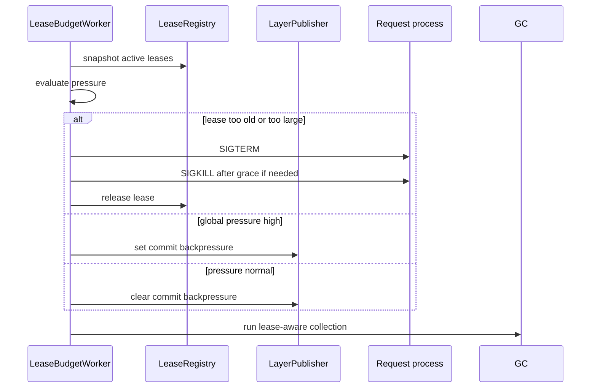

# Algorithm - Lease Budget And GC

## Purpose

Prevent long-running requests from pinning too many old layers forever, while
preserving the rule that leased layers are never physically deleted. This
algorithm is owned by `sandbox/layer_stack/`.

Leased layers are kept because they are the source of truth for request
snapshot reads and OCC `base_hash` inference. A newer active manifest or squash
checkpoint must not replace the exact layer refs held by a live lease.

## Owner Modules

```text
sandbox/layer_stack/lease_registry.py
sandbox/layer_stack/lease_budget.py
sandbox/layer_stack/stack_manager.py
sandbox/layer_stack/squash.py
sandbox/layer_stack/publisher.py
```

## Inputs

Lease budget evaluation consumes a read-only snapshot:

```python
@dataclass(frozen=True)
class LeaseSnapshot:
    lease_id: str
    owner_id: str
    manifest_version: int
    acquired_at: float
    pinned_layers: tuple[LayerRef, ...]
    pinned_bytes: int
    owner_pid: int | None
```

`pinned_layers` are exact layer refs from the leased manifest. They are not
deduplicated by merged content and are not replaceable by a squash checkpoint
until the lease is released.

Configuration:

```text
MAX_LEASE_AGE
MAX_PINNED_LAYER_BYTES_PER_SESSION
MAX_PINNED_OLD_MANIFESTS
MAX_TOTAL_PINNED_BYTES_GLOBAL
SIGTERM_GRACE_SECONDS
```

## Decision Types

```text
allow:
  no action

warn:
  emit telemetry only

kill_lease:
  terminate the owning request process, then release the lease

backpressure_commits:
  temporarily block new layer publishes until pressure drops

evict_session:
  hard-release all leases for an owner/session after process termination
```

## Evaluation Algorithm

```text
evaluate(leases, active_manifest, config):
  decisions = []
  now = clock()

  total_pinned_bytes = sum(unique pinned retired layer bytes)
  pinned_old_manifest_count = count distinct manifest versions older than active

  for lease in leases:
    age = now - lease.acquired_at
    if age > MAX_LEASE_AGE:
      decisions.append(kill_lease(lease, reason="lease_age"))

    if lease.pinned_bytes > MAX_PINNED_LAYER_BYTES_PER_SESSION:
      decisions.append(kill_lease(lease, reason="session_pinned_bytes"))

  if pinned_old_manifest_count > MAX_PINNED_OLD_MANIFESTS:
    decisions.append(backpressure_commits(reason="old_manifest_count"))

  if total_pinned_bytes > MAX_TOTAL_PINNED_BYTES_GLOBAL:
    decisions.append(backpressure_commits(reason="global_pinned_bytes"))

  return decisions or [allow]
```

## Enforcement Algorithm

```text
enforce(decisions):
  for decision in decisions:
    if decision.kind == "kill_lease":
      send SIGTERM to owner_pid if present
      wait SIGTERM_GRACE_SECONDS
      send SIGKILL if still alive
      release_lease(decision.lease_id)

    if decision.kind == "backpressure_commits":
      set commit_blocked flag
      notify waiters when pressure drops

    if decision.kind == "evict_session":
      terminate all owner processes
      release all owner leases
```

`LayerPublisher.publish_layer` checks the commit backpressure flag before it
writes staging data. Backpressure must have a timeout and must produce a clear
runtime error if the system cannot make progress.

## Workflow



## GC Algorithm

GC is lease-aware and manifest-aware.

```text
collect_garbage():
  active_layers = active_manifest.layers
  pinned_layers = lease_registry.all_pinned_layers()
  retired_layers = metadata.retired_layers

  for layer in layer_dir_list:
    if layer in active_layers:
      keep
    elif layer in pinned_layers:
      keep
    elif layer is retired or unreferenced:
      delete

  for staging_dir in staging_dir_list:
    if older than STAGING_CLEANUP_AGE:
      delete
```

If a layer referenced by an active lease is missing, GC cannot repair it by
pointing the lease at the active manifest or a checkpoint. The system must
report a fail-closed storage invariant violation so OCC does not compute
`base_hash` from the wrong bytes.

## Interaction With Squash

Squash can publish a new checkpoint while requests lease old layers. The
retired suffix is marked retired, but deletion waits for lease release.

```text
squash publishes L099..L061 B100
old suffix L060..L000 marked retired
request A still leases L060..L000
GC keeps L060..L000
request A releases
GC deletes L060..L000
```

While request A is running, OCC prepare for request A reads base bytes from
L060..L000 even though the active manifest now points at B100. B100 exists for
new active reads; it is not a substitute for request A's leased manifest.

## Interaction With Normal Commits

Normal commits may be blocked only at the publish boundary:

```text
allowed to continue:
  shell execution
  capture
  changeset prepare

possibly blocked:
  LayerPublisher.publish_layer
```

This preserves concurrency while preventing unbounded layer growth.

## Tests

```text
test_lease_budget_allows_normal_pressure
test_lease_budget_kills_lease_over_age_limit
test_lease_budget_kills_session_over_pinned_byte_limit
test_lease_budget_backpressures_on_old_manifest_count
test_lease_budget_backpressures_on_global_pinned_bytes
test_backpressure_blocks_publish_not_prepare
test_force_killed_process_releases_lease
test_gc_keeps_active_manifest_layers
test_gc_keeps_leased_retired_layers
test_gc_keeps_leased_layers_needed_for_base_hash_inference
test_missing_leased_layer_is_reported_as_invariant_failure
test_gc_deletes_unleased_retired_layers
test_gc_deletes_stale_staging_dirs
```

## Non-Goals

- No OCC conflict policy.
- No gitignore evaluation.
- No read-set tracking for hidden dependencies.
- No deletion of leased layers.
- No fallback from leased snapshot reads to active manifest content.
