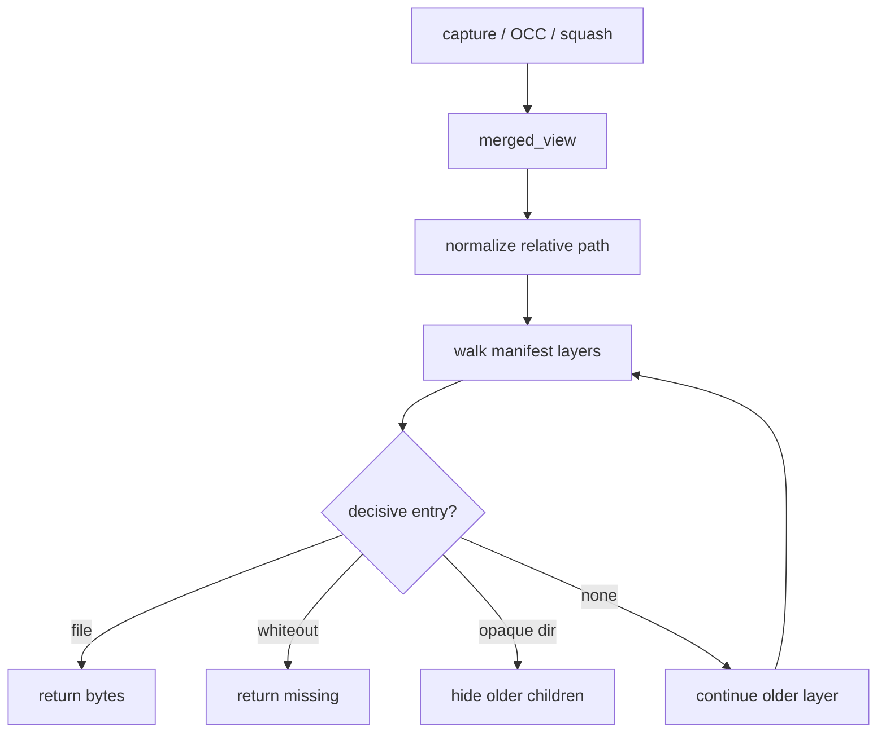

# Algorithm - Merged View

## Purpose

Resolve paths through a manifest layer list with overlay semantics. This is the
shared read algorithm for capture base bytes, OCC active reads, squash
materialization, and session materialization.

## Owner Modules

```text
sandbox/layer_stack/merged_view.py
sandbox/layer_stack/manifest.py
```

This module is side-effect-free except for explicit materialization. It does
not import `overlay`, `occ`, or `git`.

## Layer Order

Manifests store layers newest first:

```text
Manifest.layers = [LK, L(K-1), ..., L0]
```

Reads walk newest to oldest and stop at the first decisive entry:

```text
regular file hit -> return bytes, exists=True
symlink hit      -> return symlink metadata, exists=True
whiteout hit     -> return None, exists=False
opaque dir hit   -> hide older children below that directory
no hit           -> return None, exists=False
```

## Read Bytes Algorithm

```text
read_bytes(path, manifest):
  rel = normalize(path)
  reject absolute paths and parent traversal

  for layer in manifest.layers:
    if has_whiteout(layer, rel):
      return (None, False)

    if has_file(layer, rel):
      return (read file bytes, True)

    if has_symlink(layer, rel):
      return (encoded symlink marker or error by caller contract, True)

  return (None, False)
```

For text callers:

```text
read_text(path, manifest):
  bytes, exists = read_bytes(path, manifest)
  if not exists:
    return ("", False)
  decode bytes as utf-8 or raise according to caller policy
```

## Directory Listing Algorithm

Directory listing must respect both whiteouts and opaque directories.

```text
list_dir(path, manifest):
  rel = normalize(path)
  names = ordered map
  hidden = set

  for layer in manifest.layers newest to oldest:
    if has_whiteout(layer, rel):
      return []

    if has_opaque_marker(layer, rel):
      collect direct children from this layer only
      apply whiteouts from this layer
      return names

    for child in direct_children(layer, rel):
      if child is whiteout:
        hidden.add(whiteout_target(child))
        remove child from names
        continue
      if child.name not in hidden and child.name not in names:
        names[child.name] = child metadata

  return sorted names
```

## Materialize Algorithm

Materialization writes a full merged tree to a destination directory. It is
used by squash and optional session collapse.

```text
materialize(dest, manifest):
  create empty dest
  for layer in manifest.layers oldest to newest:
    apply_layer(dest, layer)
```

```text
apply_layer(dest, layer):
  for entry in walk(layer):
    if entry is whiteout:
      delete target from dest
    elif entry is opaque directory marker:
      clear existing dest directory children
    elif entry is directory:
      mkdir
    elif entry is regular file:
      write file bytes
    elif entry is symlink:
      recreate symlink
```

Oldest-to-newest materialization is equivalent to newest-to-oldest point reads
because each later layer overwrites or hides older entries.

## Hash Read Policy

`merged_view` does not decide OCC policy, but it must support two distinct read
contexts:

```text
base_hash read:
  manifest = request's leased snapshot manifest
  caller   = OCC prepare

current_hash read:
  manifest = active manifest read inside OccCommitTransaction
  caller   = OCC commit transaction
```

The active manifest must not be used to infer `base_hash` for a request that
started from an older snapshot. If a layer referenced by the leased manifest is
missing on disk, the read is a storage invariant failure. That is different
from an ordinary absent path, and callers must fail closed rather than falling
back to active content.

## Workflow



## Required Callers

```text
overlay capture:
  may read base bytes from the request snapshot manifest for diffing

OCC prepare:
  infer tracked base_hash values from the request's leased snapshot manifest

OCC commit transaction:
  read current bytes from the active manifest inside the transaction

squash worker:
  materialize selected old suffix into a checkpoint layer

session materialization:
  collapse the active manifest to a single tree at session end if required
```

## Tests

```text
test_read_newest_file_wins
test_whiteout_hides_older_file
test_absent_path_returns_missing
test_opaque_dir_hides_older_children
test_list_dir_merges_children_across_layers
test_list_dir_respects_whiteouts
test_materialize_matches_point_reads
test_materialize_preserves_symlinks
test_path_normalization_rejects_absolute_and_parent_traversal
test_base_hash_read_uses_leased_snapshot_manifest
test_missing_layer_for_leased_manifest_is_storage_error
```

## Non-Goals

- No OCC conflict decisions.
- No gitignore decisions.
- No layer publish.
- No lease mutation.
