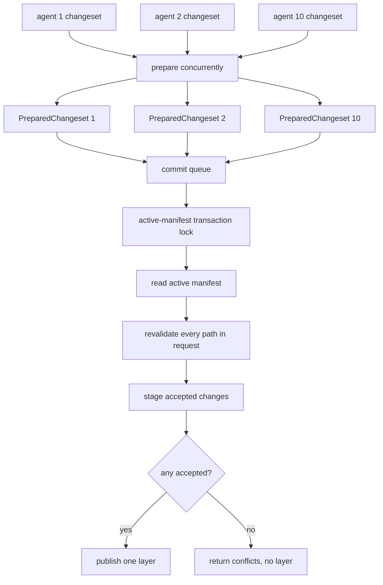

# Algorithm - OCC Commit Transaction

## Purpose

Allow concurrent OCC preparation while making final active-manifest
revalidation and layer publish atomic. This is the correction for the race
where two independent requests both validate against manifest M and publish
overlapping tracked writes without seeing each other.

## Owner Modules

```text
sandbox/occ/client.py
sandbox/occ/runtime_ops.py
sandbox/occ/service.py
sandbox/occ/changeset/prepared.py
sandbox/occ/routing/router.py
sandbox/occ/routing/gitignore.py
sandbox/occ/merge/transaction.py
sandbox/occ/merge/tracked.py
sandbox/occ/merge/direct.py
sandbox/occ/merge/hashing.py
sandbox/layer_stack/changes.py
sandbox/layer_stack/merged_view.py
sandbox/layer_stack/stack_manager.py
sandbox/layer_stack/publisher.py
```

`occ` accepts typed `Change` objects. It does not know "overlay capture" as an
operation.

## Public Entry Paths

Write/edit API:

```text
sandbox/api/write.py or sandbox/api/edit.py
-> occ.client.OCCClient.apply_changeset
-> occ.runtime_ops.apply_changeset
-> occ.service.OccService.apply_changeset
```

Shell runtime:

```text
runtime.overlay_shell.capture_to_changeset
-> occ.client.OCCClient.apply_changeset
-> occ.service.OccService.apply_changeset
```

Both paths enter through `OCCClient` and converge on the same typed changeset
service.

## Design Rule

```text
OCC may prepare concurrently.
Only OccCommitTransaction may publish accepted mutations.
OccCommitTransaction must revalidate tracked changes against the active
manifest while holding the layer-stack transaction lock.
```

This is not a global serial OCC. It is a short global serial commit
transaction over the single active manifest head.

## Hash Policy

`base_hash` is always derived from the request's leased snapshot manifest. It
is never derived from the active manifest.

```text
base_hash      = hash(path content in leased snapshot)
current_hash   = hash(path content in active manifest during commit transaction)
accept tracked = current_hash == base_hash
```

Overlay capture does not need to compute every base hash itself. A shell
capture may carry changed paths and final upperdir bytes, but the prepared
changeset must also carry the leased snapshot identity. OCC preparation can
infer `base_hash` by reading the changed path from that leased snapshot.

The active manifest is read only inside `OccCommitTransaction`. If the active
manifest has advanced since the request snapshot, that difference is handled
as normal OCC revalidation.

Squash does not change this rule. If a long-running request leased manifest M0
and squash later replaced M0's old layers in the active manifest, OCC still
infers the request's base hashes from the leased M0. Missing leased snapshot
data is a layer-stack invariant violation and must fail closed; it must never
fall back to active content.

## Algorithm

```text
OccService.apply_changeset(changes, snapshot=None):
  prepared = ChangeRouter.prepare(changes, snapshot=snapshot)
  return OccCommitTransaction.revalidate_and_publish(prepared)
```

```text
OccCommitTransaction.revalidate_and_publish(prepared):
  async with layer_stack.commit_transaction() as tx:
    active = tx.snapshot()
    results = []
    accepted = {}

    for path_group in prepared.path_groups_in_request_order():
      path_results, path_change = revalidate_path_group(
        path_group,
        active_manifest=active,
        staged_changes=accepted,
        tx=tx,
      )
      results.extend(path_results)
      if path_change is not None:
        accepted[path_group.path] = path_change

    if accepted:
      tx.publish_layer(accepted.values())

    return ChangesetResult(files=tuple(results))
```

## Workflow With 10 Concurrent Agents



## Revalidation Rules

Tracked/gated paths:

```text
WriteChange with base_hash:
  active content hash must equal base_hash
  else ABORTED_VERSION

Create-only WriteChange:
  active path must not exist
  else ABORTED_VERSION

DeleteChange:
  active content hash must equal base_hash
  else ABORTED_VERSION

EditChange:
  rerun anchors against active content plus any staged same-request change
  if exactly one match per edit, accept updated content
  if missing or ambiguous, ABORTED_OVERLAP
```

Shell-captured tracked writes always use the `WriteChange with base_hash` rule.
They are strict full-file CAS writes, not mergeable edits. This deliberately
rejects a long-running shell command's full-file rewrite when another request
changed the same tracked file after the shell request took its snapshot.

```text
t0:
  shell request leases M0
  M0:a.py hash = H0

t1:
  another request publishes L1 changing a.py
  active:a.py hash = H1

t2:
  shell finishes
  OCC prepares WriteChange(a.py, base_hash=H0, final_content=...)

t3:
  commit transaction reads active:a.py
  H1 != H0 -> ABORTED_VERSION
```

Explicit API edit changes remain mergeable through `EditChange`. If later edits
still have unique anchors after earlier layers publish, they can merge. If an
earlier layer removes or duplicates the anchor, the later edit aborts with
`ABORTED_OVERLAP`.

Direct/gitignored paths:

```text
direct path:
  no OCC conflict check
  last writer wins by commit queue order
  accepted into this request's staged layer
```

`.git` writes:

```text
drop silently, matching current orchestrator behavior
```

External paths:

```text
reject or route by the existing explicit policy; do not let them bypass the
layer stack with raw host writes.
```

## Batch Semantics

Each request is one changeset. Generic write/edit changesets default to
per-file results and partial success.

```text
request A:
  edit a.py
  edit b.py
  write c.py

request B commits first:
  changes a.py

request A transaction:
  a.py -> conflict or anchor merge against active manifest
  b.py -> accepted
  c.py -> accepted

publish:
  one layer with accepted b.py and c.py
  a.py result reports aborted if it could not merge
```

If a generic caller requires all-or-nothing behavior, use an explicit
`atomic=True` changeset option.

Shell captures are stricter for tracked files. If any shell-captured tracked
file conflicts at publish time, the shell request publishes no layer.
Direct/gitignored changes captured by the same shell request are held until
this tracked-file decision is known.

```text
shell request A:
  edit tracked a.py through command output
  write tracked b.py
  write gitignored dist/out.js

request B commits first:
  changed a.py

when A reaches the commit transaction:
  a.py -> active hash differs from A's snapshot hash

publish:
  no layer
  a.py reports ABORTED_VERSION
  b.py and dist/out.js are not published by this shell request
```

## Same-Request Ordering

Changes within one request are applied in request order per path. If the same
request edits the same path twice, the second operation sees the first
operation's staged content before publish.

```text
active foo.py = A
request:
  edit foo.py A -> B
  edit foo.py B -> C

transaction:
  first edit reads active A and stages B
  second edit reads staged B and stages C
publish:
  layer contains C
```

## Layer Stack Helpers Used By OCC

OCC reads workspace content through `LayerStackTransaction` or
`layer_stack.merged_view`; it does not need a separate OCC-owned
`manifest_reader.py`.

```text
LayerStackTransaction.read_text(path)
LayerStackTransaction.read_bytes(path)
LayerStackTransaction.exists(path)
```

Accepted storage deltas use `layer_stack.changes`. OCC builds them only after
policy revalidation succeeds.

```text
LayerDelta.write(path, bytes)
LayerDelta.delete(path)
LayerDelta.to_layer_changes()
```

## Layer Publish Boundary

`LayerStackManager` is policy-blind. It does not know which paths are direct,
gated, aborted, or gitignored. OCC passes only accepted `LayerChange` values
to the layer-stack transaction.

```text
OCC owns:
  accepted / aborted / failed results
  gitignore routing
  base hash inference from leased snapshots
  active hash comparison during commit transaction
  anchor application

layer_stack owns:
  manifest transaction lock
  staging dir
  layer rename
  manifest CAS publish
```

## Tests

```text
test_concurrent_same_tracked_file_stale_hash_aborts
test_concurrent_same_tracked_file_independent_anchors_merge_in_order
test_concurrent_same_tracked_file_missing_anchor_aborts_overlap
test_concurrent_disjoint_tracked_files_publish_one_layer_per_request
test_gitignored_same_file_last_writer_wins_by_commit_order
test_batch_partial_success_publishes_only_accepted_paths
test_same_request_same_path_operations_see_staged_content
test_commit_transaction_is_the_only_layer_publish_path_from_occ
test_base_hash_is_inferred_from_leased_snapshot_not_active_manifest
test_shell_tracked_conflict_rejects_whole_shell_layer
test_shell_gitignored_outputs_are_held_until_tracked_conflicts_pass
test_missing_leased_snapshot_data_fails_closed
test_squash_preserves_leased_snapshot_base_hash_reads
```

## Non-Goals

- No global lock around shell execution.
- No global lock around upperdir capture.
- No global lock around changeset decoding or prepare.
- No overlay-specific OCC service method.
