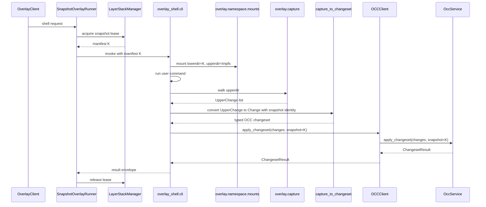

# Algorithm - Overlay Shell Runtime

## Purpose

Run a shell command against a frozen snapshot manifest, capture its upperdir
changes, convert them into typed OCC changes, and call the generic OCC service.
This algorithm is owned by `runtime/overlay_shell/` and `overlay/`.

## Owner Modules

```text
sandbox/overlay/client.py
sandbox/overlay/runner/snapshot_overlay_runner.py
sandbox/overlay/runner/runtime_invoker.py
sandbox/overlay/namespace/mounts.py
sandbox/overlay/namespace/command.py
sandbox/overlay/capture/upperdir.py
sandbox/overlay/capture/changes.py
sandbox/runtime/overlay_shell/cli.py
sandbox/runtime/overlay_shell/capture_to_changeset.py
sandbox/runtime/overlay_shell/result_envelope.py
sandbox/runtime/overlay_shell/pipeline.py
```

`overlay` is git-unaware and OCC-unaware. `runtime/overlay_shell` is the bridge
that imports both overlay and OCC.

## Inputs And Outputs

Input:

```text
command argv / shell text
workspace_root
Lease(manifest K)
stdin / env / timeout
```

Output:

```text
RuntimeResultEnvelope:
  exit_code
  stdout/stderr references
  ChangesetResult projection
  snapshot_version
  active_manifest_version_after_apply
  staleness warnings
```

## Algorithm

```text
SnapshotOverlayRunner.run_with_snapshot(request):
  lease = layer_stack.acquire_snapshot_lease(owner_id=request.id)
  try:
    manifest_path = write_manifest_to_run_dir(lease.manifest)
    envelope = runtime_invoker.invoke_overlay_shell(manifest_path, request)
    return project_result(envelope)
  finally:
    layer_stack.release_lease(lease.lease_id)
```

Inside `runtime/overlay_shell/cli.py`:

```text
main(args):
  manifest = read_manifest(args.manifest_path)
  mounted = overlay.namespace.mounts.mount_snapshot(
    manifest=manifest,
    session_root=args.session_root,
    run_dir=args.run_dir,
  )
  exit_code = overlay.namespace.command.run_user_command(
    cwd=mounted.workspace_root,
    command=args.command,
  )
  upper_changes = overlay.capture.upperdir.capture_changes(
    upperdir=mounted.upperdir,
    snapshot_manifest=manifest,
    session_root=args.session_root,
  )
  changes = runtime.overlay_shell.capture_to_changeset.convert(
    upper_changes,
    snapshot=manifest,
    source="shell",
  )
  result = occ.client.OCCClient.apply_changeset(
    changes,
    snapshot=manifest,
    gitignore_root=mounted.merged_view,
  )
  write_result_envelope(exit_code, result)
```

## Workflow



## Empty Upperdir Fast Path

```text
if upper_changes is empty:
  do not call layer publisher
  return ChangesetResult(files=())
  release lease
```

Calling `OCCClient.apply_changeset(())` is acceptable if it returns without
publishing. The important invariant is that empty capture never creates a new
layer.

## Hash And Capture Rules

1. Capture may read base bytes from the leased snapshot manifest for diffing,
   never from the active manifest.
2. Capture emits upper changes with final bytes and path metadata. It does not
   decide tracked conflicts.
3. `capture_to_changeset` attaches the leased snapshot identity to the typed
   changeset so OCC can infer `base_hash` after command completion.
4. Shell-captured tracked writes are full-file CAS writes in OCC. They are not
   anchor-merge edits.
5. If any shell-captured tracked file conflicts in the OCC transaction, no
   layer is published for the shell request, including direct/gitignored
   outputs from the same command.
6. Capture does not call OCC.
7. Capture does not publish layers.
8. Capture must preserve whiteout, opaque directory, symlink, binary, write,
   edit, and delete semantics.

## Gitignore Rule

`git check-ignore` runs only through OCC's `GitignoreOracle`. For shell
requests it must run against the mounted merged view, because that view is the
snapshot. `overlay` itself must not shell out to git.

## Tests

```text
test_overlay_shell_acquires_and_releases_lease
test_empty_upperdir_publishes_no_layer
test_shell_changeset_carries_leased_snapshot_identity
test_shell_base_hash_is_inferred_from_leased_snapshot
test_shell_tracked_conflict_publishes_no_layer
test_shell_direct_outputs_wait_for_tracked_validation
test_capture_does_not_import_occ_or_git
test_capture_to_changeset_is_the_only_overlay_to_occ_adapter
test_gitignore_for_shell_uses_mounted_snapshot_view
test_pipeline_projects_existing_result_without_reapplying_occ
```

## Non-Goals

- No OCC-specific API named `apply_overlay_capture`.
- No caller-declared shell modes.
- No strict-stale rejection.
- No cross-request coalescing in the first implementation.
