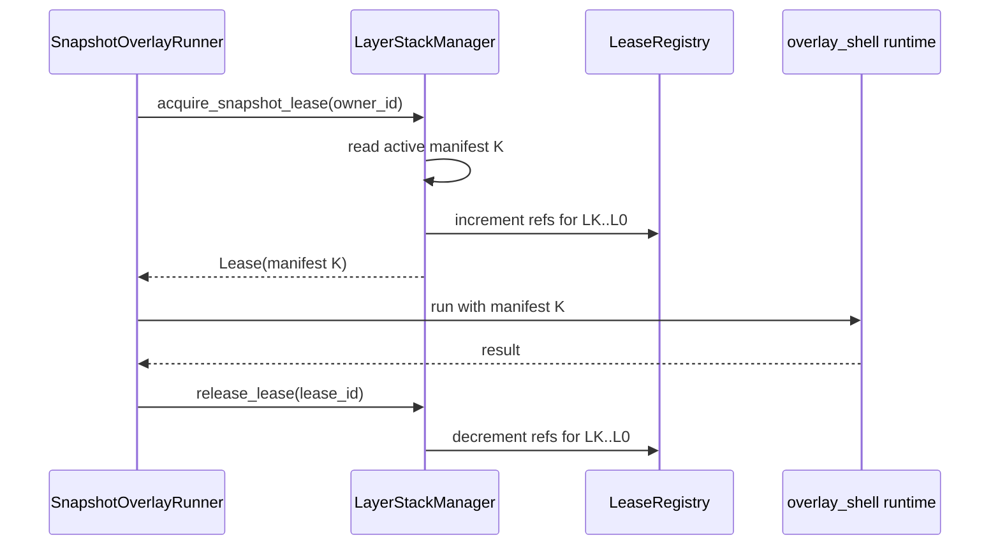

# Algorithm - Snapshot And Lease

## Purpose

Create a frozen manifest for one request, lease every layer in that manifest,
and release those pins after the request finishes. This algorithm is owned by
`sandbox/layer_stack/`.

## Owner Modules

```text
sandbox/layer_stack/manifest.py
sandbox/layer_stack/stack_manager.py
sandbox/layer_stack/lease_registry.py
sandbox/layer_stack/merged_view.py
sandbox/layer_stack/runtime_ops.py
```

No module here imports `overlay`, `occ`, or `git`.

There is no generic `wire.py`. Manifest and lease serialization helpers live
with the data objects in `manifest.py`; runtime dispatch shaping lives in
`runtime_ops.py`.

## Data Objects

```python
@dataclass(frozen=True)
class Manifest:
    version: int
    layers: tuple[LayerRef, ...]  # newest first


@dataclass(frozen=True)
class Lease:
    lease_id: str
    manifest: Manifest
    owner_id: str
    acquired_at: float
```

## Snapshot Identity Invariant

The manifest returned at lease acquire time is the one object used for:

1. the overlay `lowerdir` list,
2. base bytes during upperdir capture or diffing,
3. base-hash inference during OCC preparation.

The active manifest can advance while the request is running. That must not
change the request's mounted lowerdir list or the source used for tracked
`base_hash` values.

OCC `base_hash` values are derived from this leased manifest, not from the
active manifest. Overlay capture may report changed paths and final upperdir
bytes without precomputing every hash, but the typed changeset must retain this
snapshot identity so OCC can read base bytes from the leased manifest after the
command finishes.

## Algorithm

```text
acquire_snapshot_lease(workspace_id, owner_id):
  active = read_active_manifest()
  lease_id = new id
  for layer in active.layers:
    lease_registry.increment(layer, lease_id, owner_id)
  record Lease(lease_id, active, owner_id, now)
  return Lease
```

```text
release_lease(lease_id):
  lease = lease_registry.pop(lease_id)
  if missing:
    return idempotent success
  for layer in lease.manifest.layers:
    lease_registry.decrement(layer, lease_id)
  schedule gc tick
```

## Workflow



## Concurrent Lease Behavior

Multiple requests may lease the same layer. Refcounts are per layer, not per
manifest.

```text
request A leases [L5 L4 L3 L2 L1 L0]
request B leases [L5 L4 L3 L2 L1 L0]
request C leases [L7 L6 L5 L4 L3 L2 L1 L0]

L5 refcount = 3
L7 refcount = 1
```

Squash may remove `L5` from the active manifest, but physical deletion waits
until `L5` refcount reaches zero.

This matters for long-running requests. If request A leases manifest M0 and a
squash later publishes checkpoint B into the active manifest, request A still
uses M0 for base-hash inference. GC must keep M0's layer dirs readable until
request A releases its lease.

## Failure Rules

| Failure | Required behavior |
|---|---|
| Request crashes after acquire | Runtime owner must release in `finally`; lease budget can force-release stale leases. |
| Release called twice | Idempotent success. |
| Layer retired while leased | Active manifest can move on; physical layer dir must remain. |
| Leased layer dir is missing during base-hash inference | Fail closed as a layer-stack invariant violation; never fall back to active manifest content. |
| Manifest serialization fails before runtime starts | Release lease and return runtime setup failure. |
| Runtime starts but exits before capture | Release lease; no layer is published. |

## Tests

```text
test_acquire_increments_all_manifest_layers
test_release_decrements_all_manifest_layers
test_release_is_idempotent
test_multiple_requests_share_layer_refcounts
test_retired_leased_layer_is_not_deleted
test_base_hash_inference_reads_the_leased_manifest
test_missing_leased_layer_fails_closed
test_runtime_setup_failure_releases_lease
```

## Non-Goals

- No OCC policy.
- No gitignore evaluation.
- No direct writes to workspace files.
- No squash planning; squash only consumes lease state.
