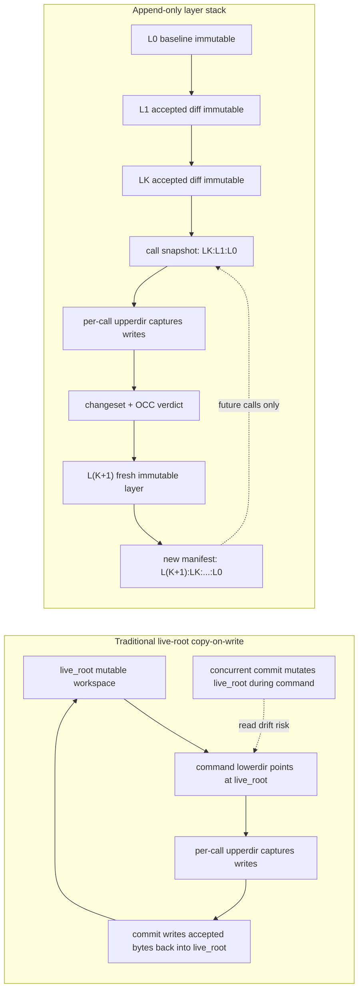
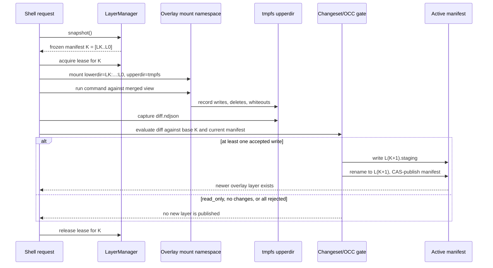
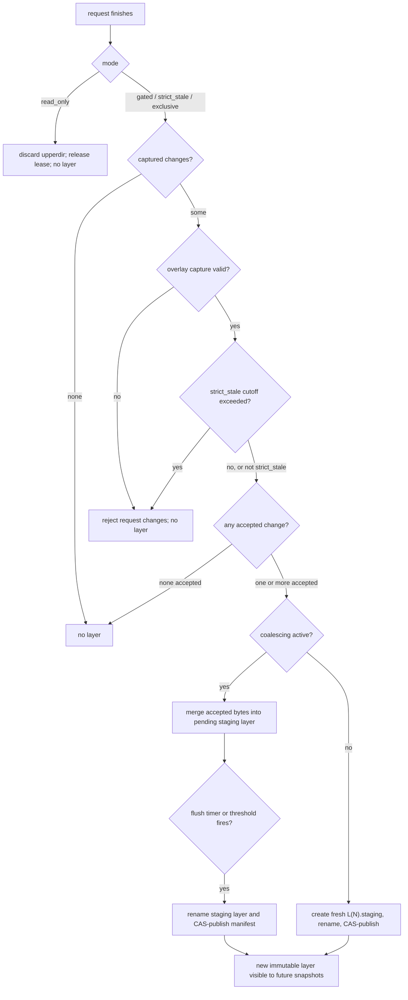
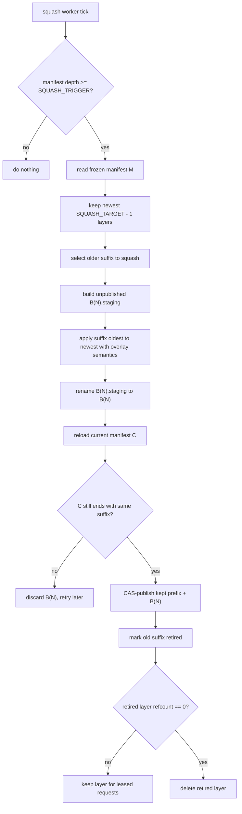
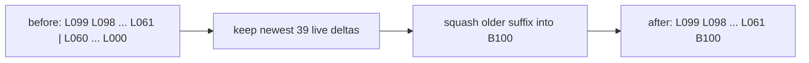

# Per-Call Snapshot Layer Stack Demonstration Diagrams

These diagrams are a draft companion to
`per-call-snapshot-layer-stack.md`. They keep the plan's contract intact:
commands read from a frozen manifest, captured upperdir writes are evaluated by
the changeset/OCC path, accepted writes append a fresh layer, and squash rewrites
only old immutable suffixes.

## 1. Stacked Overlay Concept vs Traditional COW



The key difference is where accepted writes land. Traditional COW merges back
into the mutable live root. The append-only design never mutates existing layers;
it publishes a new layer that only future snapshots can see.

## 2. Lowerdir + Upperdir Command Lifecycle



`lowerdir` is frozen because the kernel pins the lowerdir list at mount time.
`upperdir` is only the command's private mutation buffer. A newer overlay layer
is created only after accepted changes are materialized into a fresh layer and
the manifest swap succeeds.

## 3. Conditions to Create a New Overlay Layer



`exclusive` changes the concurrency rule, not the layer rule: it blocks
concurrent commits while the request runs, then still publishes a layer only if
there are accepted changes.

## 4. Overlay Squash Algorithm



Example shape:



## 5. Long Polling Requests, Leases, and Squash

```mermaid
sequenceDiagram
  participant Req as Long polling request
  participant LM as LayerManager
  participant Active as Active manifest
  participant Squash as Squash worker
  participant GC as GC

  Req->>LM: snapshot M = [LK..L0]
  Req->>LM: acquire lease for every layer in M
  LM-->>Req: mounted view stays frozen at M
  Active->>Active: newer commits append L(K+1)..L(N)
  Note over Squash: selects suffix by position only;<br/>lease state is not consulted
  Squash->>Active: build checkpoint for old suffix
  Squash->>Active: publish active manifest with B checkpoint
  Squash->>GC: retire replaced old layers
  Note over Req: request still reads from its leased lowerdir list M
  GC-->>GC: skip retired layers pinned by request lease

  alt lease budget exceeded
    LM->>Req: terminate request, discard upperdir
    Req->>LM: release lease
  else request completes normally
    Req->>LM: release lease
  end

  GC->>GC: delete retired layers once unpinned
```

Squash is allowed to publish a newer checkpoint while a long request is still
running. The safety rule is that active-manifest replacement and physical
deletion are separate: replacement can happen immediately, deletion waits until
all leases on the old layers are released.
