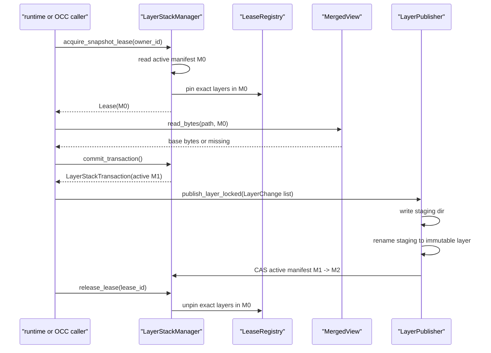

# Phase 01 - Layer Stack Foundation

## 1. Task Specification

Build the durable append-only workspace state under `backend/src/sandbox/layer_stack/`.
This phase creates the storage vocabulary used by every later phase: manifests,
layer refs, layer changes, merged reads, leases, and policy-blind layer publish.

Implementation scope:

```text
create sandbox/layer_stack/
implement manifest and layer change objects
implement newest-first merged reads
implement acquire/release lease registry
implement layer-stack transaction shell
implement policy-blind publisher
add focused layer_stack tests
```

Out of scope:

```text
no overlay mount code
no OCC conflict decisions
no gitignore evaluation
no shell result projection
no squash pressure policy
```

Exit condition:

```text
layer_stack can read the active manifest, lease a snapshot, read paths through
that snapshot, publish accepted LayerChange values under a transaction, and
release exact layer refs safely.
```

## 2. Main Data Objects

```python
@dataclass(frozen=True)
class LayerRef:
    layer_id: str
    path: str


@dataclass(frozen=True)
class Manifest:
    version: int
    layers: tuple[LayerRef, ...]  # newest first


@dataclass(frozen=True)
class LayerChange:
    path: str
    kind: Literal["write", "delete", "symlink", "opaque_dir"]
    content_hash: str | None
    source_path: str | None


@dataclass(frozen=True)
class LayerDelta:
    changes: tuple[LayerChange, ...]


@dataclass(frozen=True)
class Lease:
    lease_id: str
    manifest: Manifest
    owner_id: str
    acquired_at: float
```

Primary runtime objects:

```text
LayerStackManager       # public storage facade
LayerStackTransaction   # active-manifest transaction context
LayerPublisher          # writes immutable layers and CAS-publishes manifests
LeaseRegistry           # exact layer-ref pins
MergedView              # manifest read/list/materialize logic
```

## 3. File/Folder Structure Change

Create:

```text
backend/src/sandbox/
+-- layer_stack/
    +-- __init__.py
    +-- manifest.py
    +-- changes.py
    +-- stack_manager.py
    +-- lease_registry.py
    +-- merged_view.py
    +-- publisher.py
```

Initial tests:

```text
backend/tests/sandbox/layer_stack/
+-- test_manifest.py
+-- test_merged_view.py
+-- test_snapshot_lease.py
+-- test_publisher.py
```

Do not create:

```text
sandbox/overlay/layer_manager.py
sandbox/layer_stack/wire.py
```

The prototype evidence was ported into the `sandbox/layer_stack/` shape. The
old `stack_overlay/` package is not part of the production tree.

## 4. Workflow Demonstration



Important invariant:

```text
The leased Manifest object is stable even when the active manifest advances.
Later OCC phases infer base_hash from this leased manifest, not from active.
```

## 5. Naming Conventions And Rationale

| Name | Rationale |
|---|---|
| `layer_stack` | Names the durable append-only stack, not one layer and not overlay execution. |
| `manifest.py` | Keeps `Manifest`, `LayerRef`, and serialization beside the data contract. |
| `changes.py` | Names storage-level layer deltas, separate from OCC policy changesets. |
| `stack_manager.py` | Public facade for snapshot, lease, transaction, and storage operations. |
| `merged_view.py` | Names read/list/materialize semantics through a manifest layer list. |
| `publisher.py` | Names immutable layer creation and manifest CAS publish. |
| `lease_registry.py` | Makes exact layer-ref pinning visible. |
