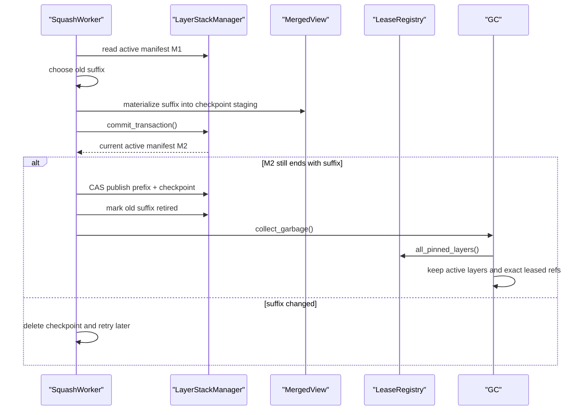

# Phase 05 - Squash, Lease Budget, And GC

## 1. Task Specification

Add maintenance algorithms that keep the layer stack bounded without breaking
leased snapshots. Squash may replace old active-manifest suffixes with
checkpoint layers, but GC must keep exact leased layer refs readable until
their leases are released.

Implementation scope:

```text
implement layer_stack.squash
implement lease_budget pressure evaluation
implement lease-aware and manifest-aware GC
implement staging/orphan fsck cleanup
connect publisher backpressure at publish boundary only
add tests for leased snapshot readability after squash
```

Out of scope:

```text
no OCC conflict policy
no gitignore evaluation
no global lock around shell execution or OCC prepare
no replacing live leases with checkpoint layers
```

Exit condition:

```text
The system can reduce active manifest depth while preserving base-hash
inference for long-running requests that still lease old layers.
```

## 2. Main Data Objects

```python
@dataclass(frozen=True)
class SquashPlan:
    active_version: int
    live_prefix: tuple[LayerRef, ...]
    suffix_to_checkpoint: tuple[LayerRef, ...]


@dataclass(frozen=True)
class LeaseSnapshot:
    lease_id: str
    owner_id: str
    manifest_version: int
    pinned_layers: tuple[LayerRef, ...]
    pinned_bytes: int
    acquired_at: float


@dataclass(frozen=True)
class BudgetDecision:
    kind: Literal["allow", "warn", "kill_lease", "backpressure_commits", "evict_session"]
    reason: str
    lease_id: str | None
```

Maintenance objects:

```text
SquashWorker       # plans and builds checkpoint layers
LeaseBudgetWorker  # evaluates old leases and global pressure
GCMarkSet          # active + leased + young staging dirs
FsckResult         # orphan staging/layer cleanup report
```

## 3. File/Folder Structure Change

Extend:

```text
backend/src/sandbox/
+-- layer_stack/
    +-- squash.py
    +-- lease_budget.py
    +-- stack_manager.py       # expose gc/fsck maintenance entrypoints
    +-- publisher.py           # check commit backpressure before staging
    +-- lease_registry.py      # expose exact pinned layer refs
```

Initial tests:

```text
backend/tests/sandbox/layer_stack/
+-- test_squash.py
+-- test_lease_budget.py
+-- test_gc.py
+-- test_fsck.py
```

Do not create a separate storage module under `overlay/`; maintenance belongs
to `layer_stack`.

## 4. Workflow Demonstration



Long-running request rule:

```text
t0: request A leases M0 = [L060 ... L000]
t1: squash publishes active M1 = [L099 ... L061 B100]
t2: request A finishes shell execution
t3: OCC prepare for A infers base_hash from L060 ... L000

GC may delete L060 ... L000 only after request A releases the lease.
```

Backpressure rule:

```text
allowed during pressure:
  shell execution
  upperdir capture
  OCC changeset prepare

possibly blocked:
  LayerPublisher.publish_layer_locked
```

## 5. Naming Conventions And Rationale

| Name | Rationale |
|---|---|
| `squash.py` | Names depth-control compaction without implying OCC policy. |
| `lease_budget.py` | Names pressure decisions around long-running leases. |
| `SquashPlan` | Separates planning from checkpoint construction and manifest CAS. |
| `LeaseSnapshot` | Immutable view of current lease pressure. |
| `BudgetDecision` | Makes allow/warn/kill/backpressure choices explicit. |
| `GCMarkSet` | Names exact keep/delete inputs: active, leased, young staging. |
| `checkpoint` | Names a materialized equivalent for the active manifest only, not a replacement for live leased layers. |
| `retired layer` | Layer removed from active manifest but still kept until unleased. |
