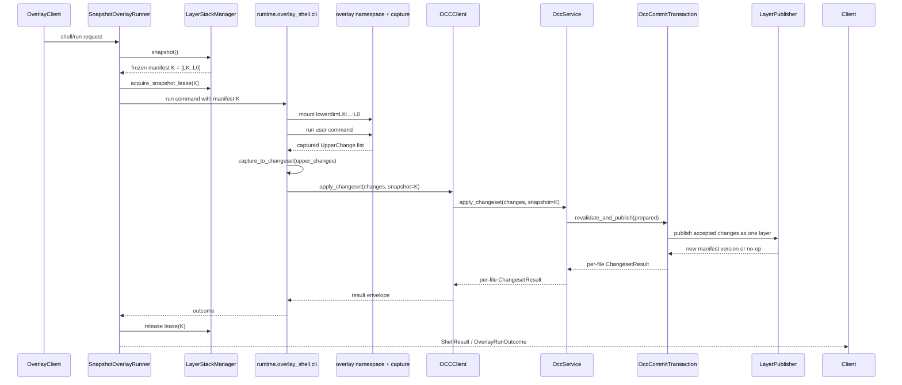
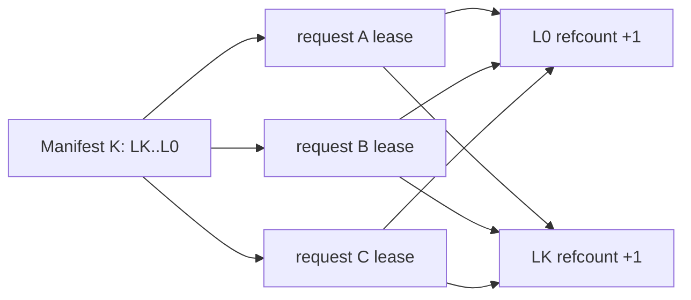
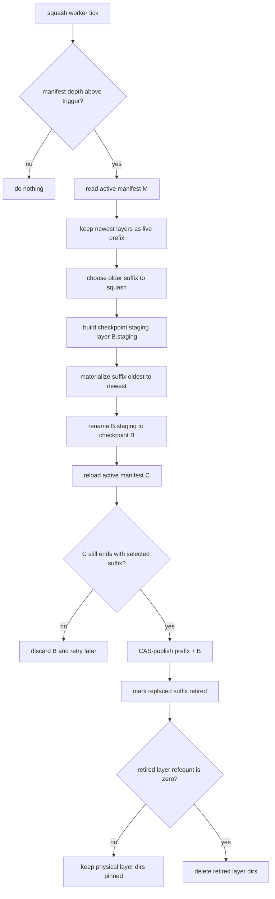
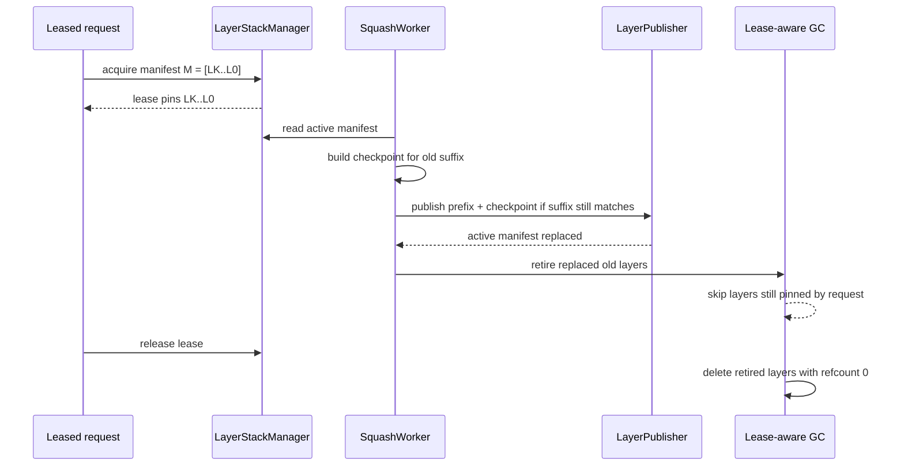
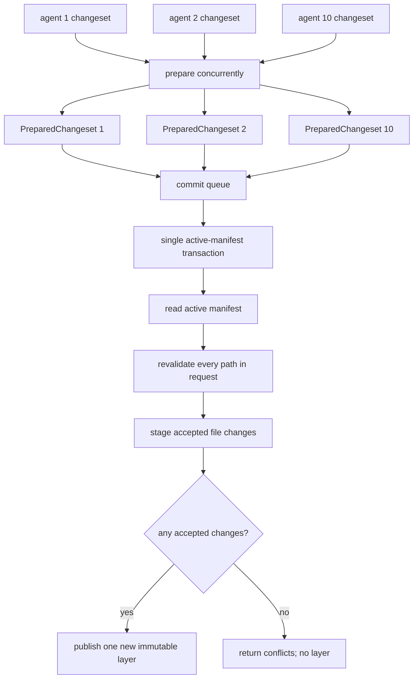

# Per-Call Snapshot Layer Stack - Simplified Implementation

## Status

- **Type:** simplified replacement implementation document.
- **Related docs:** `.omc/plans/per-call-snapshot-layer-stack.md`,
  `.omc/plans/per-call-snapshot-layer-stack-implementation.md`,
  `.omc/plans/per-call-snapshot-layer-stack-diagrams.md`.
- **Prototype source:** `stack_overlay/` is evidence and test material only.
  Production code must not import it.
- **Core correction:** OCC may prepare changes concurrently, but final
  validation and layer publish must be atomic against the active manifest.

This document replaces the ambiguous "overlay owns everything" shape with a
layout where the workflow is visible from the module names.

---

## Design Shape

```text
layer_stack = append-only workspace state
overlay     = per-call filesystem view and upperdir capture
occ         = mutation policy, conflicts, and publish transaction
runtime     = sequencer that connects overlay, OCC, and layer_stack
```

`stack_overlay/` remains outside the production dependency graph. We port and
rewrite the relevant ideas into production paths; we do not import the
prototype.

```text
stack_overlay/models.py        -> sandbox/layer_stack/manifest.py
stack_overlay/layer_manager.py -> sandbox/layer_stack/stack_manager.py
stack_overlay/mounts.py        -> sandbox/overlay/namespace/mounts.py
stack_overlay/occ.py           -> not used; production OCC stays in sandbox/occ
```

---

## Target Folder Structure

```text
backend/src/sandbox/
+-- layer_stack/
|   +-- __init__.py
|   +-- manifest.py              # Manifest, LayerRef, LayerChange
|   +-- changes.py               # LayerDelta and layer-level change helpers
|   +-- stack_manager.py         # public stack API: snapshot/acquire/release
|   +-- lease_registry.py        # refcounts, pinned layers, lease ownership
|   +-- merged_view.py           # read/list/materialize a manifest view
|   +-- publisher.py             # atomic staging dir -> layer -> manifest CAS
|   +-- squash.py                # depth control and checkpoint layers
|   +-- lease_budget.py          # pressure decisions for long leases
|   +-- runtime_ops.py           # layer.snapshot/acquire/release/materialize
|
+-- overlay/
|   +-- __init__.py
|   +-- client.py                # public OverlayClient.run/shell surface
|   +-- handlers/
|   |   +-- run.py
|   |   +-- shell.py
|   +-- runner/
|   |   +-- snapshot_overlay_runner.py
|   |   +-- runtime_invoker.py
|   |   +-- runtime_bundle.py
|   +-- namespace/
|   |   +-- mounts.py            # mount snapshot manifest as lowerdir
|   |   +-- command.py           # run user command in merged view
|   +-- capture/
|   |   +-- upperdir.py          # walk upperdir and produce UpperChange
|   |   +-- changes.py           # UpperChange types
|
+-- occ/
|   +-- __init__.py
|   +-- client.py                # host-side write/edit/apply client
|   +-- service.py               # generic typed changeset applier
|   +-- runtime_ops.py           # occ.apply_changeset dispatch op
|   +-- changeset/
|   |   +-- builders.py          # API/overlay adapters -> Change objects
|   |   +-- prepared.py          # PreparedChangeset and path groups
|   |   +-- types.py
|   +-- routing/
|   |   +-- router.py            # route changes to tracked/direct/drop paths
|   |   +-- gitignore.py         # gitignore checks against selected view
|   +-- merge/
|   |   +-- transaction.py       # revalidate + publish under layer lock
|   |   +-- tracked.py           # base-hash and anchor revalidation
|   |   +-- direct.py            # gitignored/direct last-writer-wins
|   |   +-- hashing.py           # content hash helpers
|
+-- runtime/
    +-- overlay_shell/
        +-- __init__.py
        +-- cli.py               # mount -> command -> capture -> OCC service
        +-- capture_to_changeset.py
        +-- result_envelope.py
        +-- pipeline.py          # host-side ShellResult projection
```

### Dependency Rule

```text
runtime/overlay_shell -> overlay + occ + layer_stack
overlay               -> layer_stack only
occ                   -> layer_stack only
layer_stack           -> no overlay, no occ, no git
```

`occ` never has a module named `apply_overlay_capture`. Overlay capture is
adapted to typed OCC changes in `runtime/overlay_shell/capture_to_changeset.py`.

### Dropped Files

Do not add generic `wire.py` modules to the new target packages. They obscure
the workflow and usually become dumping grounds for transport details.

Do not keep `overlay/capture/ndjson.py` as a primary contract. The runtime
holds captured changes in process, converts them through
`runtime/overlay_shell/capture_to_changeset.py`, and writes the final command
result through `runtime/overlay_shell/result_envelope.py`. If a debug dump is
needed later, make it an optional diagnostic helper, not the main data path.

Serialization belongs next to the boundary that needs it:

```text
manifest.py                         # manifest/lease to_dict/from_dict
runtime/overlay_shell/result_envelope.py
occ/client.py                       # host client request/response shaping
occ/runtime_ops.py                  # runtime dispatch request/response shaping
layer_stack/runtime_ops.py          # layer.* dispatch request/response shaping
```

If a package later grows a large, reusable codec, name it after the object it
serializes, for example `manifest_codec.py`; do not reintroduce a generic
`wire.py`.

---

## Naming Conventions

| Old / ambiguous name | New name | Reason |
|---|---|---|
| `LayerManager` | `LayerStackManager` | Names the object being managed. |
| `commit` | `publish_layer` / `publish_accepted_changes` | Makes layer creation explicit. |
| `OverlayCaptureEngine` | `SnapshotOverlayRunner` | Describes the full per-call flow. |
| `intent.py` | `changeset/prepared.py` | Names the object after the prepared changeset, not a vague intention. |
| `CommitIntent` | `PreparedChangeset` | It is the prepared input to the commit transaction. |
| `PathChangeGroup` | `PreparedPathGroup` | It is a grouped set of changes for one path. |
| `ContentManager(layers=...)` | `layer_stack.merged_view` + `layer_stack.changes` | Storage reads and layer deltas belong to `layer_stack`. |
| `orchestrator.py` | `routing/router.py` | Groups routing policy without claiming to orchestrate the whole runtime. |
| `commit_transaction.py` | `merge/transaction.py` | The transaction is part of the merge/publish policy. |
| `gated/` | `merge/tracked.py` | Names the policy condition: tracked paths use OCC checks. |
| `direct/` | `merge/direct.py` | Names the last-writer-wins direct path. |
| `apply_overlay_capture` under `occ` | `capture_to_changeset` under `runtime/overlay_shell` | OCC should not know overlay. |
| `shell_pipeline` | `overlay_shell.pipeline` | Keeps shell projection out of generic runtime. |
| `stacked_layer` | `layer_stack` | Names the durable stack, not one layer. |
| `wire.py` | object-local codec or boundary-local shaping | Avoids generic transport buckets. |

---

## Public Entry Points

### Write/Edit API Path

```text
sandbox/api/write.py or sandbox/api/edit.py
-> occ.client.OCCClient.apply_changeset
-> occ.runtime_ops.apply_changeset
-> occ.service.OccService.apply_changeset
-> occ.routing.router.ChangeRouter
-> occ.merge.transaction.OccCommitTransaction.revalidate_and_publish
-> layer_stack.publisher.LayerPublisher.publish_layer
```

### Shell/Run Path

```text
overlay.client.OverlayClient.shell
-> overlay.runner.SnapshotOverlayRunner.run_with_snapshot
-> layer_stack.LayerStackManager.acquire_snapshot_lease
-> runtime.overlay_shell.cli
-> overlay.namespace.mounts.mount_snapshot
-> overlay.namespace.command.run_user_command
-> overlay.capture.upperdir.capture_changes
-> runtime.overlay_shell.capture_to_changeset
-> occ.client.OCCClient.apply_changeset
-> occ.service.OccService.apply_changeset
-> occ.merge.transaction.OccCommitTransaction.revalidate_and_publish
-> layer_stack.publisher.LayerPublisher.publish_layer
-> runtime.overlay_shell.pipeline.project_shell_result
```

---

## Core Workflow



The snapshot manifest is used for:

1. the overlay mount lowerdir list,
2. base bytes for changed paths during OCC preparation,
3. base hashes in the prepared changeset sent to the commit transaction.

Overlay capture may report only changed paths plus final upperdir bytes. Shell
changes sent to OCC must carry the leased snapshot identity. OCC can infer
`base_hash` by reading the changed path from that leased snapshot manifest. The
base hash must always come from the request snapshot, even if it is computed
after a long-running command finishes.

The active manifest is read only by the OCC commit transaction.

---

## Layer Lease Model

A layer can be leased by multiple concurrent requests. Each request leases the
manifest it mounted, so shared old layers naturally have refcounts greater than
one.



Squash may replace old layers in the active manifest, but physical deletion
waits until every lease on those layers is released.

OCC base-hash inference must use the leased snapshot manifest even if that
snapshot has since been squashed out of the active manifest. Squash can retire
layers from the active view, but a leased manifest remains a readable snapshot
until the lease is released.

---

## Layer Stack Squash Algorithm

Squash is owned entirely by `layer_stack/squash.py`. It is a storage
maintenance operation, not an OCC policy operation. It rewrites old immutable
layers into a checkpoint layer while preserving the active manifest semantics.



Example:

```text
before:
  L099 L098 ... L061 | L060 ... L000

squash:
  keep newest live prefix: L099 ... L061
  materialize older suffix: L060 ... L000 -> B100

after:
  L099 L098 ... L061 B100
```

Important rules:

1. Squash never changes the content of already-published layers.
2. Squash publishes a new manifest; requests that leased the old manifest keep
   reading their leased layer list.
3. Squash can replace old layers in the active manifest while old requests are
   still running.
4. Garbage collection deletes retired layers only after lease refcounts reach
   zero.
5. Squash does not call OCC and does not inspect gitignore policy. It uses
   `layer_stack.merged_view` semantics only.
6. OCC reads base bytes from the leased manifest, not from the squashed active
   manifest. If the leased manifest cannot be read because squash or GC removed
   required layer data, that is a layer-stack invariant violation and OCC must
   fail closed instead of falling back to active content.

Example with a long-running shell request:

```text
t0:
  active M0 = L3 + L2 + L1
  Rlong leases M0

t1:
  new commits publish L4 and L5
  active M2 = L5 + L4 + L3 + L2 + L1

t2:
  squash replaces L3 + L2 + L1 in the active manifest:
  active M3 = L5 + L4 + B1

  Rlong still reads:
  leased M0 = L3 + L2 + L1

t3:
  Rlong finishes
  OCC infers base_hash from leased M0
  publish revalidates against active M3
```

The publish step must use the same active-manifest transaction primitive as
normal layer publish. If normal commits advance the active manifest while the
squash worker is building `B`, the suffix check fails and the checkpoint is
discarded instead of rewriting the wrong manifest.



---

## Concurrent OCC Commit Design

OCC preparation is concurrent. Final validation and publish are serialized by
the layer-stack commit transaction.



The transaction lock covers only:

```text
read active manifest
revalidate prepared changes
write staging layer
CAS-publish manifest
```

It does not cover:

```text
shell execution
upperdir capture
change decoding
gitignore checks against the snapshot view
preparing changesets
```

### Three-Request Timeline and Performance Shape

The publish gate is global and serial per workspace/layer stack, but only for
the short validation/publish phase. Request work remains parallel.

```text
t0:
  active = M0
  R1, R2, R3 all snapshot and lease M0

t1:
  R1 prepares I1 from M0
  R2 prepares I2 from M0
  R3 prepares I3 from M0

t2:
  Tx R1 locks active M0
  revalidate I1 against M0
  publish L1
  active = M1 = L1 + M0

t3:
  Tx R2 locks active M1
  revalidate I2 against M1
  publish L2
  active = M2 = L2 + L1 + M0

t4:
  Tx R3 locks active M2
  revalidate I3 against M2
  publish L3 or return conflicts
  active = M3 = L3 + L2 + L1 + M0
```

For ten concurrent requests:

```text
wall time ~= max(request run/capture/prepare time)
          + sum(commit transaction time for queued requests)

commit transaction time ~= revalidate changed paths in the request
                         + stage accepted files
                         + CAS-publish manifest
```

The commit transaction must revalidate only paths in the prepared changeset. It
must not scan the whole repository.

### Batch Semantics

Each request is one changeset. Generic write/edit changesets default to per-file
results and partial success.

```text
Request A:
  edit a.py
  edit b.py
  write c.py

Request B commits first:
  changed a.py

When A reaches the commit transaction:
  a.py -> revalidate against active manifest -> conflict or merge
  b.py -> still clean -> accepted
  c.py -> still clean -> accepted

Publish:
  one new layer containing accepted b.py + c.py
  result reports a.py as aborted if it could not merge
```

If a generic caller needs all-or-nothing behavior, use an explicit
`atomic=True` changeset option.

Shell captures are stricter for tracked files. A tracked file changed by shell
capture is treated as a full-file checked write, even when the command only made
a small edit. If any shell-captured tracked file conflicts at publish time, the
shell request publishes no layer. Direct/gitignored changes captured by the same
shell request are held until this tracked-file decision is known.

```text
Shell request A:
  edit tracked a.py through command output
  write tracked b.py
  write gitignored dist/out.js

Request B commits first:
  changed a.py

When A reaches the commit transaction:
  a.py -> active hash differs from A's snapshot hash

Publish:
  no layer
  a.py reports ABORTED_VERSION
  b.py and dist/out.js are not published by this shell request
```

---

## Revalidation Rules

Tracked/gated paths are checked inside
`OccCommitTransaction.revalidate_and_publish` while holding the layer-stack
transaction lock.

```text
WriteChange with base_hash:
  active hash must still equal base_hash
  otherwise ABORTED_VERSION

Create-only WriteChange:
  active path must still not exist
  otherwise ABORTED_VERSION

DeleteChange:
  active hash must still equal base_hash
  otherwise ABORTED_VERSION

EditChange:
  rerun anchors against active content
  if unique, apply to active content and accept
  if missing or ambiguous, ABORTED_OVERLAP
```

Shell-captured tracked writes use the `WriteChange with base_hash` rule. They do
not become mergeable `EditChange` values during publish. This deliberately
rejects a long-running shell command's small full-file rewrite if another
request edited the same tracked file while the command was running.

```text
t0:
  Rlong leases M0
  M0:a.py hash = H0

t1:
  another request publishes L1 changing a.py
  active:a.py hash = H1

t2:
  Rlong finishes
  OCC prepares shell WriteChange(a.py, base_hash=H0, final_content=...)

t3:
  publish reads active:a.py from latest manifest
  H1 != H0 -> ABORTED_VERSION
```

Overlapping same-file edits from ten agents do not automatically reject. If
later edits still have unique anchors after earlier layers publish, they can
merge. If an earlier layer removes or duplicates the anchor, the later edit
aborts. This merge behavior is for explicit edit changes, not shell-captured
full-file rewrites.

Direct/gitignored paths are intentionally last-writer-wins by commit queue
order when they are not part of a shell request rejected by tracked-file
conflicts:

```text
gitignored/direct/binary/symlink/opaque dir
-> no OCC conflict check
-> accepted into the request's staged layer if the request is publishable
```

---

## Transaction Interface Sketch

```python
class OccService:
    async def apply_changeset(
        self,
        changes: Sequence[Change],
        *,
        snapshot: Manifest | None = None,
    ) -> ChangesetResult:
        prepared = self._router.prepare(changes, snapshot=snapshot)
        return await self._transaction.revalidate_and_publish(prepared)


class OccCommitTransaction:
    async def revalidate_and_publish(
        self,
        prepared: PreparedChangeset,
    ) -> ChangesetResult:
        async with self._layer_stack.commit_transaction() as tx:
            active = tx.snapshot()
            results, accepted = self._revalidate(prepared, active)
            if prepared.rejects_request_on_conflict and has_conflict(results):
                accepted = ()
            if accepted:
                tx.publish_layer(accepted)
            return ChangesetResult(files=tuple(results))
```

`LayerStackManager` remains policy-blind. It exposes transaction primitives;
OCC decides what accepted, aborted, direct, and gated mean.

```python
class LayerStackManager:
    async def snapshot(self) -> Manifest: ...
    async def acquire_snapshot_lease(self, manifest: Manifest) -> Lease: ...
    async def release_lease(self, lease_id: str) -> None: ...
    async def commit_transaction(self) -> LayerStackTransaction: ...


class LayerStackTransaction:
    def snapshot(self) -> Manifest: ...
    def read_bytes(self, manifest: Manifest, path: str) -> tuple[bytes | None, bool]: ...
    def publish_layer(self, changes: Sequence[LayerChange]) -> Manifest: ...
```

---

## Implementation Steps

1. Create empty target packages:
   `layer_stack/`, `overlay/namespace/`, `overlay/capture/`,
   `runtime/overlay_shell/`, and the new OCC files. Do not create generic
   `wire.py` modules.
2. Port/rewrite manifest and layer-stack tests from `stack_overlay/` into
   `backend/tests/sandbox/layer_stack/`.
3. Implement `LayerStackManager`, `LeaseRegistry`, `MergedView`, and
   `LayerPublisher` without importing `overlay`, `occ`, or `git`.
4. Rewrite overlay namespace mount/capture code to consume a `Manifest`, not
   a live-root bind lowerdir.
5. Add `layer_stack.changes.LayerDelta`, use `LayerStackTransaction` reads,
   and add `OccCommitTransaction`.
6. Keep `occ/client.py` as the public write/edit/apply host client.
7. Route shell capture through `runtime/overlay_shell/capture_to_changeset.py`
   before calling `OCCClient.apply_changeset`; `OCCClient` delegates to
   `OccService` internally. Shell changes must be tagged as shell capture and
   carry the leased snapshot identity for OCC base-hash inference.
8. Make `runtime/overlay_shell/pipeline.py` a projector from result envelope to
   `ShellResult`; it must not call OCC a second time.
9. Delete old live-root guard and bind-lowerdir helpers after the layer stack
   path is complete.

---

## Verification Rules

No production imports from the prototype:

```bash
rg "stack_overlay" backend/src
```

Expected: no matches.

Boundary checks:

```bash
rg "git|check-ignore" backend/src/sandbox/layer_stack backend/src/sandbox/overlay
```

Expected: no policy-level git usage in `layer_stack` or `overlay`.

OCC owns mutation policy:

```bash
rg "ABORTED_VERSION|ABORTED_OVERLAP|DirectMerge|GitignoreOracle" backend/src/sandbox/occ
```

Expected: conflict and gitignore policy stays under `occ`.

Concurrent publish tests:

```text
10 concurrent changesets, same tracked file:
  first clean write commits
  stale hash write aborts ABORTED_VERSION
  anchor edits merge only if anchors remain unique

10 concurrent changesets, disjoint tracked files:
  each publishes cleanly, one layer per request with accepted changes

10 concurrent changesets, same gitignored file:
  all direct commits succeed; final content follows commit queue order

batch request with mixed conflicts:
  accepted paths publish in one layer
  conflicted paths return per-file aborted statuses

shell request with one tracked conflict:
  shell-captured tracked rewrite conflicts with active hash
  publish no layer for the shell request
  direct/gitignored files from the same shell request are not published

shell request with long-running command:
  base_hash is read from the leased snapshot after command completion
  concurrent active edit changes the latest active hash
  shell-captured tracked rewrite aborts ABORTED_VERSION
```

Snapshot identity tests:

```text
base_hash is computed from the request snapshot manifest or inferred from the
leased snapshot during OCC preparation
base_hash is not recomputed from the active manifest at capture time
OCC revalidates against the active manifest only inside the commit transaction
squash can replace old layers in the active manifest while a leased snapshot
continues to provide the original base bytes
missing leased snapshot data fails closed and never falls back to active content
```

---

## Durable Invariants

1. `layer_stack` is the only owner of manifests, layer dirs, leases, squash,
   and physical publish.
2. `overlay` is git-unaware and OCC-unaware. It mounts a snapshot and captures
   upperdir changes.
3. `runtime/overlay_shell` is the only module that sequences overlay capture
   into OCC changes.
4. `occ` applies typed changesets only. It does not know "overlay capture" as
   an operation.
5. `occ/client.py` remains the host-side entrypoint for write/edit/apply
   requests.
6. OCC preparation can run concurrently, but `OccCommitTransaction` must
   revalidate tracked changes against the active manifest while holding the
   layer-stack transaction lock.
7. A request publishes at most one layer for its accepted changes.
8. Conflicted paths do not publish; accepted paths in generic write/edit
   changesets may still publish unless the caller explicitly requests
   all-or-nothing semantics.
9. Shell-captured tracked file changes are strict full-file CAS writes. They do
   not merge at publish time, and any tracked conflict rejects the whole shell
   request layer.
10. Gitignored/direct changes are not OCC-guarded, but shell-captured
    gitignored/direct changes must not publish when the same shell request is
    rejected by a tracked-file conflict.
11. Squash must preserve leased snapshot readability until lease release. OCC
    base-hash inference reads from the leased snapshot, even when the active
    manifest now points at a squash checkpoint.
