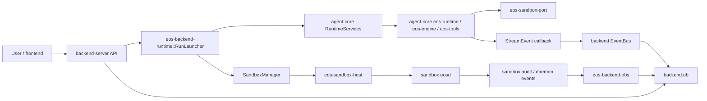

# backend-server Design Spec

Status: draft

Scope: `backend-server` is the Rust composition root that exposes convenient
user-facing APIs, owns sandbox lifecycle, and wires sandbox services into
`agent-core` without making `agent-core` depend on sandbox implementation crates.

## Merge Notes

This file is a merge of the current history, not a replacement of the newer
structure work:

| Source | Treatment |
|---|---|
| `c5abf9f85` | Kept as the resulting file/folder structure baseline. |
| Current working-tree update | Kept the config ownership section and config annotations. |
| `backend-server/SPEC-REVIEW.md` findings | Folded into required contracts, build order, and acceptance criteria. |
| Pre-`9acb086ca` `SPEC.md` | Not restored because it is a legacy `integration-test` module spec, not a backend-server spec. |

## Goals

1. `backend-server` bridges sandbox and `agent-core`, and exposes convenient API
   endpoints to users.
2. Sandbox implementation code is removed from `agent-core`; the surviving
   `agent-core` dependency is the port crate, `eos-sandbox-port`.
3. `sandbox/` remains independent of both `backend-server` and `agent-core`.
4. `backend-server` owns sandbox setup, binding, reference counting, teardown,
   and destruction policy. It injects sandbox services into `agent-core` to
   handle user requests.
5. Naming conventions and API names are consistent before the API becomes
   user-facing.
6. Rust behavior boundaries use composition plus trait-defined ports, not class
   inheritance or abstract-base-style layers.
7. SOLID and SRP are enforced through explicit crate ownership and narrow
   runtime boundaries.
8. V1 avoids unnecessary round trips, dependencies, fields, crates, and trait
   seams unless they carry a real boundary.

## Architecture Decisions

| Decision | Contract |
|---|---|
| Backend is the composition root | It owns axum, backend config, backend DB, sandbox lifecycle, runtime launch, event streaming, and observability persistence. |
| Agent-core is port-only for sandbox access | `eos-runtime`, `eos-engine`, and `eos-tools` compile against `eos-sandbox-port`, not Docker, daemon bootstrap, or backend crates. |
| Sandbox host implementation moves out of agent-core | `eos-sandbox-host` lives under `backend-server/crates/` and owns Docker provider, daemon client, bootstrap artifact, provisioning, lifecycle, and registry. |
| Obs normalization is backend-owned | `eos-backend-obs` owns collector normalization, runner gates, sink, ingestor, and stats; there is no long-lived standalone collector crate. This keeps the `eos-protocol` edge in the backend obs crate and out of `agent-core`. |
| Sandbox remains independent | `sandbox/crates/*` does not depend on `backend-server` or `agent-core`; it only owns daemon/runtime/protocol implementation. |
| Backend state is separate from agent-core state | `backend.db` stores backend lifecycle, event-log, audit cursor, and stats rows. Agent-core DB remains the writer for request/task/workflow state. |
| Backend crates stay split for v1 | The current multi-crate structure is kept because it matches real ownership boundaries: types, config, store, runtime, obs, API, and main. |



## Config Ownership

Sandbox config should not be missing. The better split is decentralized config:
backend-server owns only backend deployment and sandbox lifecycle/provisioning
defaults, while agent-core and sandbox keep their own runtime schemas.

`backend-server/config/backend.yml` plus gitignored `local.yml` should
deserialize to a backend-owned `ServerConfig`:

```rust
pub struct ServerConfig {
    pub bind: SocketAddr,
    pub backend_db_path: PathBuf,
    pub agent_core: AgentCoreConfigSource,
    pub sandbox: SandboxConfig,
    pub obs: ObsConfig,
}

pub struct AgentCoreConfigSource {
    pub config_dir: PathBuf,        // deterministic, no CLI/env profile picker
    pub database_url: String,       // backend supplies deployable DB path
}

pub struct SandboxConfig {
    pub default_snapshot: Option<String>,
    pub max_owned_sandboxes: usize,
    pub destroy_on_finish: bool,
    pub startup_timeout_ms: u64,
}
```

Ownership rules:

| Concern | Owner | Backend action |
|---|---|---|
| HTTP bind, backend.db, event/obs persistence | backend-server | Deserialize and validate through `eos-backend-config`. |
| agent-core config source and database placement | backend-server composition root | Pass `AgentCoreConfigSource` into `RuntimeServicesBuilder` through a deterministic `config_source(...)` / `config_document(...)` seam, plus `.database_url(...)`. |
| `ProvidersConfig` and `WorkflowConfig` | agent-core `eos-config` | Do not embed in backend config; `eos-runtime` loads and validates them from `agent_core.config_dir/prd.yml < local.yml`. |
| Fresh sandbox defaults and cleanup policy | backend-server | Keep these in `SandboxConfig` and pass them to `SandboxManager` / `RequestSandboxProvisioner`. |
| Sandbox daemon/runtime policy | sandbox `eos-config` | Keep daemon, runner, command-session, and isolated-workspace sections in `sandbox/config/prd.yml`; backend setup may upload that sandbox-owned document but must not duplicate its schema. |

This avoids shifting provider/workflow semantics into backend-server while still
making backend-server the explicit owner of sandbox lifecycle.

## API Contract

Use plural resource names and conventional path segments. Do not use
`/api/user-request={id}` style paths.

| Method | Path | Purpose |
|---|---|---|
| `POST` | `/api/user-requests` | Accept a prompt and start an agent-core run. Returns `202 { request_id }`. |
| `GET` | `/api/user-requests` | List backend run records with status and pagination. |
| `GET` | `/api/user-requests/{request_id}` | Return joined backend lifecycle plus agent-core request outcome. |
| `DELETE` | `/api/user-requests/{request_id}` | Request cancellation; backend records `cancelled` as a backend-local status. |
| `GET` | `/api/user-requests/{request_id}/events` | Replay persisted milestone events from `event_log`. |
| `GET` | `/api/user-requests/{request_id}/stream` | SSE or WebSocket stream with replay from `last_seq`. |
| `GET` | `/api/user-requests/{request_id}/tasks` | Return the request task tree from agent-core state. |
| `GET` | `/api/tasks/{task_id}` | Return task detail and related agent run data. |
| `GET` | `/api/tasks/{task_id}/transcript` | Return model/tool transcript for a task. |
| `GET` | `/api/stats/performance` | Return normalized timing and resource summaries. |
| `GET` | `/api/stats/correctness` | Return correctness summaries derived from persisted outcomes and obs events. |
| `GET` | `/api/stats/agent-runs` | Return per-agent-run stats. |
| `GET` | `/api/stats/events` | Return normalized events, including sandbox audit events when enabled. |
| `GET` | `/api/sandboxes` | List backend-owned sandboxes and lifecycle state. |
| `GET` | `/api/sandboxes/{sandbox_id}` | Return a sanitized `SandboxView`. Never expose daemon host, port, internal port, or auth token. |
| `DELETE` | `/api/sandboxes/{sandbox_id}` | Destroy a backend-owned sandbox only when no active or retained run references it. |

`POST /api/user-requests` v1 request shape:

```json
{
  "prompt": "Fix the failing test",
  "sandbox_args": {
    "sandbox_id": "optional-existing-sandbox"
  },
  "client_meta": {
    "label": "optional user label"
  }
}
```

V1 supports only `sandbox_args.sandbox_id`. Per-request `image`, `snapshot`,
`project_dir`, provider, workflow, or tool-config overrides are deferred unless
the port trait, runtime input, precedence rules, and tests are added in the same
phase. Default project/snapshot behavior comes from `SandboxConfig`.

Sandbox responses are sanitized DTOs. Public API DTOs must not reuse
`DaemonTcpEndpoint` or any provider DTO that contains daemon connection
material:

```rust
pub struct SandboxView {
    pub sandbox_id: SandboxId,
    pub state: SandboxState,
    pub owner_request_id: Option<RequestId>,
    pub active_request_ids: Vec<RequestId>,
    pub ref_count: u32,
    pub created_at: DateTime<Utc>,
    pub last_used_at: DateTime<Utc>,
    pub destroy_on_finish: bool,
}
```

`DaemonTcpEndpoint` contains an auth token and stays internal to
`eos-sandbox-host` / backend runtime code. It must not cross the HTTP API.
The following fields are denied from all non-admin sandbox responses:
`host`, `port`, `internal_port`, `endpoint`, `auth_token`, and raw daemon
environment variables. If an admin-only diagnostics endpoint is later added, it
must use a separate DTO and auth policy.

## Core Contracts

### Sandbox Gateway

The port crate exposes the single injected sandbox handle:

```rust
pub trait SandboxGateway: Send + Sync + std::fmt::Debug {
    fn transport(&self) -> Arc<dyn SandboxTransport>;
    fn provisioner(&self) -> Arc<dyn RequestProvisioner>;
}
```

Ownership rules:

| Item | Crate | Reason |
|---|---|---|
| `SandboxGateway` | `agent-core/crates/eos-sandbox-port` | Agent-core consumes the port and must not import backend/runtime host crates. |
| `SandboxTransport` | `agent-core/crates/eos-sandbox-port` | Tool execution needs a daemon-agnostic transport surface. |
| `RequestProvisioner` | `agent-core/crates/eos-sandbox-port` | Runtime bootstrap needs a sandbox binding contract without Docker details. |
| `SandboxManager` | `backend-server/crates/eos-backend-runtime` | Backend-owned stateful lifecycle/refcount manager; implements `SandboxGateway`. |
| `DaemonClient`, `DockerProviderAdapter`, `SandboxLifecycle` | `backend-server/crates/eos-sandbox-host` | Concrete Docker/daemon/provisioning implementation. |

`RuntimeServicesBuilder` must accept a production `sandbox_gateway(...)` or
equivalent production-visible provisioner injection. A `#[cfg(test)] pub(crate)`
provisioner setter is not enough for backend composition.

The single-handle shape avoids injecting unrelated transport and provisioner
instances that might not share one registry. Because the repo uses Rust 1.85,
do not rely on trait-object upcasting. Use methods like `transport()` and
`provisioner()` to return the narrower trait objects.

### Run State

Backend run state is backend-owned:

```rust
pub enum BackendRunStatus {
    Accepted,
    Running,
    Done,
    Failed,
    Cancelled,
}

pub struct RunMeta {
    pub request_id: RequestId,
    pub status: BackendRunStatus,
    pub label: Option<String>,
    pub client_meta: serde_json::Value,
    pub created_at: DateTime<Utc>,
    pub finished_at: Option<DateTime<Utc>>,
    pub cancel_reason: Option<String>,
}
```

Agent-core `RequestStatus` stays agent-core-owned. If agent-core only exposes
`running`, `done`, and `failed`, backend `cancelled` remains a backend API
lifecycle state and must not be forced into agent-core state.

`run_meta` is not redundant with agent-core request state. It prevents
GET-after-202 races and keeps backend lifecycle writes out of `agent-core.db`.

API status resolution is explicit:

| Backend `RunMeta.status` | Agent-core `RequestStatus` | API status |
|---|---|---|
| `Cancelled` | any | `cancelled` |
| `Failed` | any | `failed` |
| `Done` | any | `done` |
| `Running` or `Accepted` | `Failed` | `failed`, and backend updates `finished_at` plus `status = Failed`. |
| `Running` or `Accepted` | `Done` | `done`, and backend updates `finished_at` plus `status = Done`. |
| `Running` | `Running` or missing | `running` |
| `Accepted` | missing | `accepted` |

Cancellation never writes a synthetic `cancelled` value into agent-core
`RequestStatus`. Backend records `cancel_reason`, asks the runtime/reaper to
abort work, and leaves any later agent-core terminal row as supporting detail.

### Event Stream

`agent-core` currently emits `StreamEvent` through a synchronous borrowing
callback. Backend must not do SQLite I/O inline from that callback.

Required event flow:

1. `eos-runtime` emits a `StreamEvent`.
2. Backend callback classifies milestone events.
3. Callback creates an owned `EventRecord`, reserves a monotonic backend `seq`,
   and `try_send`s it into a bounded channel. The callback performs no async I/O
   and holds no async lock.
4. An async drainer persists `EventRecord` to `event_log`.
5. V1 uses persist-before-broadcast: only records durably written to
   `event_log` are broadcast to SSE/WebSocket subscribers.
6. Reconnect first replays `event_log` rows with `seq > last_seq`, records the
   replay high-water mark, then joins the live broadcast. If a client connects
   during the handoff, the server replays any rows persisted up to the
   high-water mark before consuming live messages, so persisted milestone events
   cannot fall between replay and live subscribe.

Overflow policy is explicit. The event queue is bounded. If `try_send` fails,
the callback increments a per-request dropped-event counter and enqueues or
publishes a lightweight `event_stream_gap` marker through a non-async fallback.
Milestone loss must be visible in `/api/user-requests/{request_id}/events` and
the live stream; it must not be silent.

### Observability And Correlation

`AuditSink::publish(&AuditEvent)` is synchronous. A backend implementation must
enqueue an owned envelope into a bounded channel; an async worker persists to
`obs_event`. It must not direct-write async SQLite from `publish`.

`PersistingSink::publish` behavior:

| Condition | Required behavior |
|---|---|
| Queue accepts envelope | Return `Ok(())`; drainer persists asynchronously. |
| Queue is full | Return `AuditError` immediately and increment a dropped-audit counter. Engine hot paths may log the error but must not block on SQLite. |
| Drainer write fails | Retry according to bounded retry policy, then persist a loss marker or increment durable loss counters. |
| Shutdown | Drain accepted envelopes before closing, bounded by backend shutdown timeout. |

The audit queue stores owned payloads only. It must not keep references to the
borrowed `AuditEvent` passed to `publish`.

Keep model-facing and daemon-facing identities distinct:

```rust
pub struct SandboxCallCorrelation {
    pub request_id: RequestId,
    pub task_id: TaskId,
    pub agent_run_id: AgentRunId,
    pub tool_use_id: String,
    pub sandbox_invocation_id: SandboxInvocationId,
    pub caller_id: CallerId,
    pub sandbox_id: SandboxId,
}
```

`tool_use_id` is the model/tool-call identifier. `sandbox_invocation_id` is the
daemon/sandbox-call identifier. Do not reuse one as the other.

The bridge is persisted before or atomically with each sandbox tool call:

```sql
CREATE TABLE sandbox_call_correlation (
  request_id TEXT NOT NULL,
  task_id TEXT NOT NULL,
  agent_run_id TEXT NOT NULL,
  tool_use_id TEXT NOT NULL,
  sandbox_invocation_id TEXT NOT NULL,
  caller_id TEXT NOT NULL,
  sandbox_id TEXT NOT NULL,
  created_at TEXT NOT NULL,
  PRIMARY KEY (sandbox_id, caller_id, sandbox_invocation_id)
);
```

Correlation rules:

1. Engine dispatch stamps model metadata with `tool_use_id`.
2. Sandbox tool execution mints a separate `sandbox_invocation_id` and sends it
   to daemon payloads as daemon call metadata.
3. Before the daemon request is sent, backend/agent-core records
   `sandbox_call_correlation`.
4. Daemon audit events may carry only `caller_id` plus invocation metadata. The
   backend ingestor joins those events through
   `(sandbox_id, caller_id, sandbox_invocation_id)`.
5. If no bridge row exists, persist the audit event with
   `sandbox_invocation_id` and null model-facing ids, mark it `unmatched`, and
   never copy `sandbox_invocation_id` into `tool_use_id`.

Sandbox audit pull state includes boot identity:

```rust
pub struct AuditCursor {
    pub sandbox_id: SandboxId,
    pub last_seq: i64,
    pub boot_epoch_id: i64,
    pub lost_before_seq: Option<i64>,
    pub dropped_count: u64,
    pub updated_at: DateTime<Utc>,
}
```

On `boot_epoch_id` change, reset the cursor or mark loss before trusting daemon
sequence numbers. A sequence regression alone does not reliably identify daemon
restarts.

The ingestor must read `boot_epoch_id` from the daemon audit snapshot before
advancing `last_seq`. If the epoch differs from the stored cursor, it records
loss for the prior epoch, resets `last_seq` for the new epoch, and then pulls
from the new daemon sequence space. It must not rely on
`pull(after_seq)` returning older rows to detect a reboot, because the daemon
filters by `seq > after_seq` and may echo the requested cursor when no rows
match.

Audit pull is optional for the first backend API milestone only if
`/api/stats/events` explicitly excludes sandbox-internal events. If sandbox
audit events are part of v1 stats, `SandboxAuditPoller`, `audit_cursor`, loss
accounting, and the daemon audit wire ops are v1 requirements.

### State Reader

`RuntimeServices::state_reader()` is required in v1, not optional or
recommended. It returns only crate-owned store handles, not a raw
`sqlx::SqlitePool`. Backend must not open a read pool against the agent-core DB
or depend on its table layout directly.

Required agent-core store additions:

```rust
pub trait RequestStore {
    async fn list(&self, filter: RequestListFilter, page: Page)
        -> Result<PageResult<RequestRow>, StoreError>;
}

pub trait TaskStore {
    async fn list_for_request(&self, request_id: RequestId)
        -> Result<Vec<TaskRow>, StoreError>;
}

pub trait AgentRunStore {
    async fn get_for_task(&self, task_id: TaskId)
        -> Result<Option<AgentRunRow>, StoreError>;
}
```

Backend API reads through these store traits. It must not couple directly to the
agent-core SQL schema.

## Database Shape

`backend.db` owns backend lifecycle and observability tables:

```sql
CREATE TABLE run_meta (
  request_id TEXT PRIMARY KEY,
  status TEXT NOT NULL,
  label TEXT,
  client_meta_json TEXT NOT NULL DEFAULT '{}',
  created_at TEXT NOT NULL,
  finished_at TEXT,
  cancel_reason TEXT
);

CREATE TABLE event_log (
  request_id TEXT NOT NULL,
  seq INTEGER NOT NULL,
  kind TEXT NOT NULL,
  payload_json TEXT NOT NULL,
  created_at TEXT NOT NULL,
  PRIMARY KEY (request_id, seq)
);

CREATE TABLE obs_event (
  id INTEGER PRIMARY KEY AUTOINCREMENT,
  request_id TEXT,
  task_id TEXT,
  agent_run_id TEXT,
  tool_use_id TEXT,
  sandbox_invocation_id TEXT,
  sandbox_id TEXT,
  source TEXT NOT NULL,
  kind TEXT NOT NULL,
  payload_json TEXT NOT NULL,
  created_at TEXT NOT NULL
);

CREATE TABLE sandbox_call_correlation (
  request_id TEXT NOT NULL,
  task_id TEXT NOT NULL,
  agent_run_id TEXT NOT NULL,
  tool_use_id TEXT NOT NULL,
  sandbox_invocation_id TEXT NOT NULL,
  caller_id TEXT NOT NULL,
  sandbox_id TEXT NOT NULL,
  created_at TEXT NOT NULL,
  PRIMARY KEY (sandbox_id, caller_id, sandbox_invocation_id)
);

CREATE TABLE audit_cursor (
  sandbox_id TEXT PRIMARY KEY,
  last_seq INTEGER NOT NULL,
  boot_epoch_id INTEGER NOT NULL,
  lost_before_seq INTEGER,
  dropped_count INTEGER NOT NULL DEFAULT 0,
  updated_at TEXT NOT NULL
);
```

## Backend Test Layout

All backend-server crate test files live under each crate's `tests/` directory,
not under `src/`.
In this checkout, the required absolute prefix is
`/Users/yifanxu/machine_learning/LoVC/EphemeralOS/backend-server/crates/<crate>/tests/`.

Rules:

| Test artifact | Required location |
|---|---|
| Integration tests | `backend-server/crates/<crate>/tests/*.rs` or `backend-server/crates/<crate>/tests/<suite>/mod.rs` |
| Unit-style tests that need private module access | `backend-server/crates/<crate>/tests/<module>/mod.rs`, referenced from the production module with a narrow `#[path = "../tests/<module>/mod.rs"]` or `#[path = "../../tests/<module>/mod.rs"]` attribute as needed |
| Test support, fakes, mocks, fixtures, seams, harnesses, and sample configs | `backend-server/crates/<crate>/tests/support/`, `tests/fixtures/`, or a suite-local folder under `tests/` |
| Generated or captured test artifacts | A crate-local ignored temp/output folder, never `src/` |

Disallowed backend paths:

- `backend-server/crates/*/src/tests.rs`
- `backend-server/crates/*/src/**/tests/`
- `backend-server/crates/*/src/**/fixtures/`
- `backend-server/crates/*/src/**/mocks/`
- `backend-server/crates/*/src/**/fakes/`
- `backend-server/crates/*/src/**/support/`

Production `src/` files may contain only production code and, when private
access is unavoidable, a tiny `#[cfg(test)]` module declaration that points to a
file under the crate `tests/` tree. Do not put the test body or test-only helper
types in `src/`.

## Resulting File/Folder Structure

```text
EphemeralOS/
|-- agent-core/
|   |-- Cargo.toml
|   |-- config/
|   |   |-- prd.yml                    # agent-core-owned providers/workflow baseline
|   |   `-- local.yml                  # gitignored secrets/local override
|   `-- crates/
|       |-- eos-sandbox-port/
|       |   |-- Cargo.toml
|       |   `-- src/
|       |       |-- gateway.rs
|       |       |-- lib.rs
|       |       |-- provision.rs
|       |       |-- tool_api.rs
|       |       `-- transport.rs
|       |-- eos-runtime/
|       |   |-- Cargo.toml
|       |   `-- src/
|       |       |-- abort_cleanup.rs
|       |       |-- entry.rs
|       |       |-- lib.rs
|       |       |-- request_input.rs
|       |       |-- root_agent.rs
|       |       `-- runtime_services/
|       |           |-- builder.rs
|       |           |-- mod.rs
|       |           `-- sandbox.rs
|       |-- eos-state/
|       |   `-- src/
|       |       `-- store.rs
|       `-- eos-db/
|           `-- src/
|               `-- repositories/
|
|-- sandbox/
|   |-- Cargo.toml
|   |-- config/
|   |   `-- prd.yml                    # sandbox-owned daemon/runtime baseline
|   `-- crates/
|       |-- eos-daemon/
|       |-- eos-protocol/
|       `-- eosd/
|
`-- backend-server/
    |-- Cargo.toml
    |-- README.md
    |-- SPEC.md
    |-- config/
    |   |-- backend.yml                # ServerConfig: includes SandboxConfig
    |   `-- local.yml                  # gitignored backend deployment override
    `-- crates/
        |-- eos-sandbox-host/
        |   |-- Cargo.toml
        |   |-- src/
        |   |   |-- bootstrap_artifact.rs
        |   |   |-- config.rs
        |   |   |-- docker.rs
        |   |   |-- lib.rs
        |   |   |-- lifecycle.rs
        |   |   |-- provider.rs
        |   |   |-- provisioning.rs
        |   |   `-- registry.rs
        |   `-- tests/
        |       `-- daemon_client/
        |           `-- mod.rs
        |
        |-- eos-backend-types/
        |   |-- Cargo.toml
        |   |-- src/
        |   |   |-- audit.rs
        |   |   |-- error.rs
        |   |   |-- events.rs
        |   |   |-- lib.rs
        |   |   |-- pagination.rs
        |   |   |-- requests.rs
        |   |   |-- sandboxes.rs
        |   |   `-- stats.rs
        |   `-- tests/
        |       `-- dto_contract.rs
        |
        |-- eos-backend-config/
        |   |-- Cargo.toml
        |   |-- src/
        |   |   |-- lib.rs
        |   |   |-- loader.rs
        |   |   |-- obs.rs
        |   |   |-- sandbox.rs          # backend-owned SandboxConfig
        |   |   `-- server.rs           # ServerConfig; no ProvidersConfig/WorkflowConfig
        |   `-- tests/
        |       `-- load_config.rs
        |
        |-- eos-backend-store/
        |   |-- Cargo.toml
        |   |-- migrations/
        |   |   `-- 0001_initial.sql
        |   |-- src/
        |   |   |-- audit_cursor.rs
        |   |   |-- db.rs
        |   |   |-- event_log.rs
        |   |   |-- lib.rs
        |   |   |-- obs.rs
        |   |   `-- run_meta.rs
        |   `-- tests/
        |       `-- store.rs
        |
        |-- eos-backend-runtime/
        |   |-- Cargo.toml
        |   |-- src/
        |   |   |-- event_bus.rs
        |   |   |-- host.rs
        |   |   |-- launcher.rs
        |   |   |-- lib.rs
        |   |   |-- reaper.rs
        |   |   |-- registry.rs
        |   |   |-- sandbox_manager.rs
        |   |   `-- state_reader.rs
        |   `-- tests/
        |       |-- launcher.rs
        |       `-- sandbox_manager.rs
        |
        |-- eos-backend-obs/
        |   |-- Cargo.toml
        |   |-- src/
        |   |   |-- gates.rs
        |   |   |-- ingestor.rs
        |   |   |-- lib.rs
        |   |   |-- normalization.rs
        |   |   |-- sink.rs
        |   |   `-- stats.rs
        |   `-- tests/
        |       |-- gates/
        |       |   `-- mod.rs
        |       |-- normalization/
        |       |   `-- mod.rs
        |       `-- obs.rs
        |
        |-- eos-backend-api/
        |   |-- Cargo.toml
        |   |-- src/
        |   |   |-- error.rs
        |   |   |-- handlers/
        |   |   |   |-- mod.rs
        |   |   |   |-- sandboxes.rs
        |   |   |   |-- stats.rs
        |   |   |   |-- stream.rs
        |   |   |   |-- tasks.rs
        |   |   |   `-- user_requests.rs
        |   |   |-- lib.rs
        |   |   |-- openapi.rs
        |   |   |-- router.rs
        |   |   `-- stream/
        |   |       |-- mod.rs
        |   |       |-- sse.rs
        |   |       `-- ws.rs
        |   `-- tests/
        |       |-- api_contract.rs
        |       `-- stream.rs
        |
        `-- eos-backend-main/
            |-- Cargo.toml
            |-- src/
            |   |-- app.rs
            |   `-- main.rs
            `-- tests/
                `-- live_e2e.rs
```

## Required Build Order

| Phase | Work | Verification |
|---|---|---|
| 0 | Relocate `eos-sandbox-host`, add `eos-sandbox-port`, merge obs normalization/gates into `eos-backend-obs`, and remove sandbox implementation deps from `agent-core`. | `cd agent-core && cargo check -p eos-runtime --all-targets`; dependency scan for `eos-sandbox-host` and `eos-protocol` in agent-core crates. |
| 1 | Add production-visible `SandboxGateway` / provisioner injection and `RuntimeServices::state_reader()`. | Compile agent-core runtime and store crates with targeted tests. |
| 2 | Implement backend config and store crates, including migrations for `run_meta`, `event_log`, `obs_event`, `sandbox_call_correlation`, and `audit_cursor`. | `cargo test -p eos-backend-config`; `cargo test -p eos-backend-store`. |
| 3 | Implement `SandboxManager` lifecycle, refcounting, sanitized listing, and delete guards. | `cargo test -p eos-backend-runtime sandbox_manager`. |
| 4 | Implement `RunLauncher`, cancellation/reaper behavior, and EventBus drainer. | `cargo test -p eos-backend-runtime launcher event_bus`. |
| 5 | Implement `PersistingSink`, audit ingestor, correlation bridge lookup, boot-epoch cursor handling, and stats queries. | `cargo test -p eos-backend-obs`; focused store tests. |
| 6 | Implement axum routes, SSE/WS replay, and OpenAPI shape. | `cargo test -p eos-backend-api`; API contract tests. |
| 7 | Run live backend-to-agent-core-to-sandbox smoke. | Docker-backed live E2E with `EOS_LIVE_E2E_IMAGE=sweevo-dask__dask-10042:latest`. |

## Acceptance Criteria

| ID | Criteria |
|---|---|
| AC1 | Backend can accept a user request, create or bind a sandbox, launch `agent-core`, stream milestone events, and persist backend lifecycle state. |
| AC2 | `agent-core` has no dependency on backend crates, Docker provider crates, or daemon bootstrap implementation; it depends on `eos-sandbox-port` for sandbox contracts. |
| AC3 | `sandbox/` builds independently and has no dependency on `agent-core` or `backend-server`. |
| AC4 | `/api/sandboxes/*` never exposes daemon endpoint, port, or auth token. |
| AC5 | Event persistence is async-drained from the synchronous callback; no async SQLite writes happen inline in `EventCallback`, and persisted events are replay-safe through persist-before-broadcast plus high-water replay handoff. |
| AC6 | `AuditSink` persistence is async-drained from a bounded queue; no async SQLite writes happen inline in `publish`, and full queues return `AuditError` instead of blocking engine hot paths. |
| AC7 | Stats and audit rows keep `tool_use_id` and `sandbox_invocation_id` separate, with daemon audit joined through `sandbox_call_correlation` rather than id reuse. |
| AC8 | Audit cursor handles daemon restart through `boot_epoch_id`, not sequence regression alone. |
| AC9 | Backend reads agent-core state through store traits exposed by `RuntimeServices::state_reader()`, not raw SQL pool access. |
| AC10 | V1 request API only supports `sandbox_id` as a per-request sandbox override unless the port/input/preference changes are implemented and tested. |
| AC11 | Config ownership stays decentralized: backend config owns backend deployment and sandbox lifecycle defaults, agent-core owns provider/workflow config, and sandbox owns daemon/runtime config. |
| AC12 | The current multi-crate backend structure stays unless implementation proves a crate has no independent ownership boundary. |
| AC13 | Every backend-server crate keeps tests, fixtures, fakes, mocks, support modules, and harnesses under `backend-server/crates/<crate>/tests/`, not under `src/`. |
