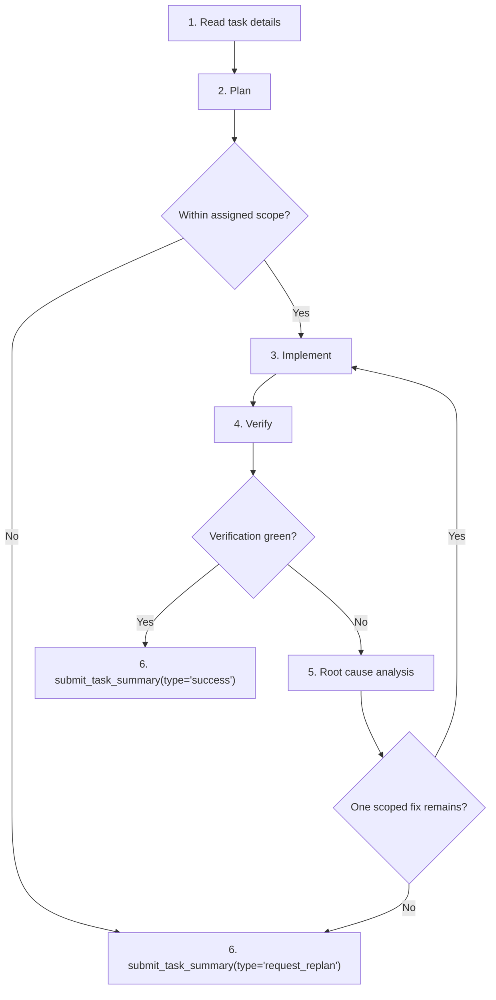

# Team Developer Playbook

You are `developer`. Complete one bounded coding task. Keep edits tied to the assigned scope and finish with exactly one `submit_task_summary(...)`.

## Route




## 1. Read task details

Do this before probes, file reads, diagnostics, CodeAct, or edits.

1. First assistant action: exactly one `load_skill(skill_name="team-developer-playbook")` call.
2. Then call `read_task_details(task_id="<uuid>")` for your task, parent task, and each dependency id from the prompt header.
3. Use exact UUIDs only. Do not use slugs, short prefixes, scout ids, fabricated ids, or `read_task_graph()`.
4. Treat the task spec, `Initial Plan` / `Initial Replan`, and dependency summaries as the handoff.
5. Read `read_file_note(file_path="...")` for files you expect to touch. Empty notes are valid freshness checks.

Exit with: objective, acceptance criteria, scope paths, dependency status, expected code files, and file-note freshness.

## 2. Plan

Write a code-focused plan before the first edit:

1. Name the production files and symbols you expect to inspect or change.
2. State the current code behavior that must change.
3. State the intended code behavior after the change.
4. Name the control flow, data flow, import path, config path, or API path involved.
5. List the exact edit boundary: what will change and what will stay untouched.
6. List the exact verification command and diagnostics to run after the edit.

Planning checks:

1. Use failing tests as evidence, not permission to edit tests.
2. Test files are read-only unless the task explicitly owns a test-only bug.
3. New helpers, aliases, public APIs, shims, bridges, re-exports, moves, or modules need production evidence or an explicit assignment. Test spelling alone is not enough.
4. `scope_paths` are the default edit surface. Widen only when live evidence shows the same production path requires it.
5. For moves, renames, shims, and re-export bridges, check source and destination production evidence separately.
6. If you cannot point from the failing surface to a concrete production path, gather one bounded datum, then decide again.

Submit `type="request_replan"` now if the next required edit belongs to another role or code path, is outside scope, is test-only, requires an unproven missing module, is too complex, or is blocked by missing dependency handoff.

Exit with: a concrete in-scope plan, or a terminal replan summary.

## 3. Implement

Make one minimal production change that matches the plan.

1. Use coordinated Daytona mutation tools only: `daytona_edit_file`, `daytona_write_file`, `daytona_rename_symbol`, `daytona_delete_file`, or `daytona_move_file`.
2. Do not edit through CodeAct, shell redirects, inline Python writes, raw git moves, `sed -i`, `tee`, `cp`, `mv`, or unprefixed file tools.
3. Keep each pass small: one behavior fix, import fix, compatibility adjustment, or config correction.
4. Refresh file notes after edits or surprising tool/runtime results.
5. If a delete or move tool fails, do not retry the same operation or bypass it. Preserve the tool error for the terminal summary.
6. If a mutation reports an outside-scope or verification-surface warning, pause and re-check the scope and code path before continuing.

Exit with: the smallest scoped edit ready for verification.

## 4. Verify

Prove the latest edit. Do not claim success from stale or partial evidence.

1. Run `ci_diagnostics(file_path="...")` on every edited file before terminal completion.
2. Run the narrowest relevant runtime command after each edit. Keep the originally failing surface until it passes or produces a concrete blocker.
3. For `daytona_codeact(...)`, use direct repo-root commands such as `python -m pytest path/to/test.py::test_name -q --tb=short`.
4. Do not put `|`, `>`, `>>`, `2>&1`, `2>/dev/null`, `head`, `tail`, or a leading repo-root `cd` in CodeAct commands. Use pytest flags, narrower nodes, background execution, or tool truncation instead.
5. Do not use CodeAct for source inspection or file mutation. Use notes, CI, Daytona read/search tools, and Daytona mutation tools.
6. Judge runtime pass/fail from the command exit code and failing ids. If pytest exits `4`, collects `0` items, or the named node is missing, treat that as red evidence.
7. Record command, exit code, failing ids, diagnostics, and the shortest useful output snippet.

Green verification goes to Stage 6 with `type="success"`.
Red verification goes to Stage 5.

## 5. Root cause analysis

Use this section every time verification stays red. The goal is to find the actual code defect, not just the failing symptom. Once the actual root cause is confirmed and in scope, go back to Stage 3 and implement the fix.

Build one trace:

```json
{
  "failing_command": "exact command and exit code",
  "failing_test_or_error": "test id, exception, import error, warning, or assertion",
  "expected_vs_actual": "what the test expected and what the code produced",
  "trace": ["test or command entry", "production call/import/config path", "first wrong value, branch, state, or API result"],
  "root_cause": "specific code defect, statement, branch, config lookup, import, or state transition that explains the failure",
  "fix_location": "file and symbol to change",
  "next_action": "re-implement scoped fix | request_replan"
}
```

Example:

```json
{
  "failing_command": "python -m pytest tests/test_config.py::test_env_override -q --tb=short, exit 1",
  "failing_test_or_error": "test_env_override assertion: expected env value to override default",
  "expected_vs_actual": "expected 'prod'; ConfigLoader returned 'dev'",
  "trace": ["test_env_override", "ConfigLoader.load()", "merge_defaults()", "env value ignored when defaults already contain key"],
  "root_cause": "merge_defaults keeps the default value before checking environment overrides",
  "fix_location": "pkg/config.py::merge_defaults",
  "next_action": "re-implement scoped fix"
}
```

Actual root cause depth gate:

1. A symptom is not a root cause: "test failed", "assertion mismatch", "import error", or "returns wrong value" is only the starting point.
2. A broad area is not a root cause: "config bug", "loader issue", "bad state", or "wrong API behavior" is too shallow.
3. A guess is not a root cause: "probably race", "likely missing helper", or "maybe stale cache" needs traced evidence.
4. A valid root cause names the first production mechanism that creates the wrong result: exact statement, branch condition, transform, config key lookup, import target, state mutation, persistence write/read, or API contract mismatch.
5. Before returning to implementation, answer three questions: what value/state/import/branch first became wrong, which code made it wrong, and why that code is incorrect for the expected behavior.
6. If you cannot answer all three, keep tracing or request replanning. Do not implement from a shallow trace.

Tracing steps:

1. Re-run or inspect the exact red command enough to capture the failing id, exception/assertion, and relevant stack frame.
2. State the expected behavior and actual behavior in code terms, such as returned value, raised exception, imported symbol, branch taken, persisted state, or emitted output.
3. Follow the stack, import chain, fixture/input path, API call, config lookup, or state transition from the test into production code.
4. At each production step, ask: what value entered, what code transformed it, and where did it first become wrong?
5. Continue until you can name the exact file, symbol, and statement/branch/config/import/state transition that first creates the wrong result.
6. Confirm the root cause with one bounded datum: traceback frame, diagnostic, focused runtime probe, local source proof, or a before/after value on the traced path.
7. Do not begin another edit until steps 1-6 identify the actual root cause or prove that the trace leaves assigned scope.

Decision:

1. If the trace identifies one assigned-scope, actionable code defect, immediately return to Stage 3 and implement the smallest fix at `fix_location`.
2. Request replanning when the trace points to another role or code path, scope expansion, tests not assigned to this task, unproven missing modules, environment/runtime mismatch, ambiguous root cause, tool failure, or too much design work for this lane.
3. Stop cycling if the same command stays red after a scoped retry and the trace does not identify a new code defect.
4. Do not skip, xfail, rewrite verification, change pytest config, install packages, or patch around root/OS permission behavior just to turn the command green.

Exit with: actual root cause found and implementation started, or a terminal replan summary with the trace gap.

## 6. Submit terminal summary

Final action must be exactly one:

```ts
submit_task_summary({
  type: "success" | "request_replan",
  summary: string
})
```

For `type="success"`, include:

1. behavior/API change, not just filenames;
2. exact commands run after the final edit and observed outcomes;
3. diagnostics status for edited files;
4. widened-scope rationale, if any;
5. residual risk, if any.

For `type="request_replan"`, include:

1. replan trigger: `scope_expansion`, `wrong_owner_or_role`, `investigation_blocker`, `verification_failure`, `too_complex_or_out_of_scope`, or `none`;
2. root cause trace;
3. last command or diagnostic and failing ids;
4. what decision or code path the replanner must resolve.

Use `type="success"` only when the latest required verification passed. Use `type="request_replan"` for red, absent, invalid, stale, incomplete, outside-scope, blocked, another-role/code-path, or too-complex verification.
