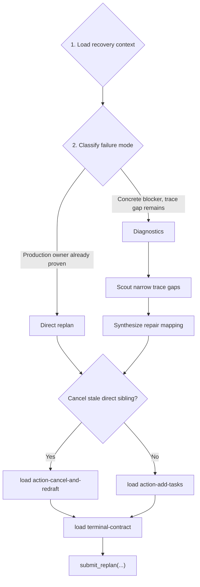

# Team Replanner Playbook

Read the following sections to produce a corrective task DAG from the failed task's evidence, then finish with exactly one `submit_replan(...)` call.

Replanner-created tasks are limited to `developer` repair lanes and `validator` verification lanes. Do not create `team_planner`, `root_planner`, `team_replanner`, `scout`, or other agent roles in `new_tasks`; the replanner owns recovery synthesis itself.

## Workflow



Every branch must load the matching action reference and then `terminal-contract` before drafting the payload. Do not skip those loads because the failure seems obvious.

## Reference Map

Loadable references used at specific stages below via `load_skill_reference(skill_name="team-replanner-playbook", reference_name="...")`:

- `terminal-contract`: schema, payload examples, and final checklist. Load in Stage 4 before drafting the payload.
- `action-add-tasks`: add corrective children with `cancel_ids=[]`. Load in Stage 3 when no sibling needs cancellation.
- `action-cancel-and-redraft`: cancel stale direct siblings and add replacements. Load in Stage 3 when a stale non-terminal direct sibling must be cancelled.

## 1. Load Recovery Context

Read live Task Center evidence before diagnosis or planning:

1. `read_task_details(task_id=<your task id>)`
2. `read_task_details(task_id=<parent task id>)`
3. `read_task_details(task_id=<failed task id>)`
4. `read_task_details(task_id=<dep id>)` for every declared dependency
5. `read_task_graph()` to inspect same-parent siblings and rewired dependents
6. `read_task_details(task_id=<sibling id>)` only for siblings you may preserve, cancel, depend on, or avoid

Wait for all required `read_task_details` results before calling `read_task_graph()`. Do not batch `read_task_graph()` with any required task-detail read. Skip any read whose id equals one you already fetched (common case: the replanner's parent is the failed task). Use only exact UUIDs from the assigned replanning header. Do not substitute planner slugs, short ids, background ids, or graph-only guesses.

Extract from the failed task: final summary, failure reason, root cause trace, failing command, exit code, snippet, trace path, production mechanism, and candidate fix location. Keep verified facts separate from unresolved gaps.

## 2. Classify Failure Mode

Choose one:

| Mode | Use When | Next Step |
| --- | --- | --- |
| `scope_expansion` | The failed task proved the repair belongs to a different live production code path outside its assigned scope. | Direct replan |
| `wrong_owner_or_role` | The failed task proved a different production owner or agent role owns the repair. | Direct replan |
| `unresolved_blocker` | A concrete blocker remains and can be stated as a production trace gap. | Diagnostics |

Budget exhaustion, tool-call exhaustion, or unfinished implementation inside the failed task's assigned scope is not `scope_expansion`. If the existing evidence already names the in-scope production mechanisms and repair locations, classify it as `unresolved_blocker` with `Diagnostics decision: trivial_direct_replan` and split corrective work by concrete production mechanism.

Direct replan evidence must name both:

- the live production fix location
- the production mechanism that first caused the wrong behavior, such as a branch condition, transform, config lookup, import target, state mutation, persistence write/read, or API contract mismatch

When the failed summary proposes a concrete rule or one-line fix, check it against every observed value in the same failing assertion before calling it `trivial_direct_replan`. For merge/config/dispatch/state bugs, make a compact value table: input path/state, observed value, expected value, and the proposed rule. If the proposed rule would break any listed value or contradicts the failed summary, treat the repair rule as unresolved: use `Diagnostics decision: deep_diagnostics` or create a diagnostic developer to derive the correct rule instead of copying the handoff into a repair task.

Benchmark tests are evidence, not repair scope. Never create a corrective task that owns `*/tests/*`, `test_*.py`, benchmark harness files, pytest configuration, or a skip/xfail/rewrite of verification. A root/OS/environment mismatch in a benchmark test must be reported as `unresolved_blocker` evidence or mapped to a production behavior seam; it is never a license to edit or skip the test.

A failed task's "test design issue" label does not drop a named fail-to-pass variant. Map every named variant to production repair evidence, or carry it forward as `unresolved_blocker` diagnostics until a production seam is found. Do not place that variant only in residual risk, non-repair prose, or a validator that lacks an upstream repair.

Generated interpreter caches are not corrective work. Do not accept "stale `__pycache__`/`.pyc` cannot be deleted" as the production root cause unless the failed task proved a fresh process is loading stale bytecode from a named import path. Otherwise treat refused cache cleanup as tooling noise, preserve it as residual risk if useful, and replan around the remaining production mechanism or trace gap.

Diagnostics require a trace-gap triplet: one failing test id or cluster, one suspected production path, and one named symbol or seam. Vague difficulty is not enough.

Do not classify a failure as "no production fix" just because one attempted mechanism cannot satisfy the expected behavior. First check adjacent production extension points on the same path, such as sibling hooks, fallback lookups, adapter boundaries, wrapper objects, dispatch registrations, compatibility shims, or API options. If they are ruled out, preserve those ruled-out mechanisms in the evidence and create the narrowest corrective or diagnostic task that can test the remaining production seam.

Documentation-only recovery is not a corrective replan. Do not create a developer whose goal is to merely document a non-fixable or environmental issue, and do not create a validator whose acceptance criteria is to accept a known nonzero fail-to-pass command as "closed." A named fail-to-pass failure must be assigned to a production repair task, or to a diagnostic developer that tests a concrete production seam and reports the next repair decision.

Never treat another function, line range, test id, or checklist item inside the same owner file as scope expansion. If the fix target remains under any failed-task `scope_paths` entry, classify it as `unresolved_blocker` and use `Diagnostics decision: trivial_direct_replan` when the repair location is known.

State one exact line before acting: `Classification: <scope_expansion|wrong_owner_or_role|unresolved_blocker>`. For `unresolved_blocker`, also state `Diagnostics decision: trivial_direct_replan` when file notes and CI already name every failing seam, or `Diagnostics decision: deep_diagnostics` when any seam is still unresolved.

## 3. Act

### Direct replan

Use this path for `scope_expansion`, `wrong_owner_or_role`, or `unresolved_blocker` with `Diagnostics decision: trivial_direct_replan`, when evidence already names every production mechanism and repair location.

- Preserve downstream validators/dependents already rewired to this replanner.
- Leave live sibling scopes alone unless you cancel a stale direct sibling.
- The failed/original `request_replan` task can appear as a same-parent sibling in `read_task_graph()`; it is never stale sibling work and must stay out of `cancel_ids`.
- If your draft `cancel_ids` contains the failed task id from the prompt, discard that cancellation before submitting. Switch to `cancel_ids=[]` unless another stale non-terminal direct sibling remains. A validation rejection of `cancel_ids` means the payload is not submitted; remove the rejected id and retry with the same corrective children.
- Do not create a verification-only child for red acceptance evidence when the owning repair belongs to a preserved live sibling or downstream validator.
- Drop same-scope continuation candidates only when they lack a root-cause trace. For `unresolved_blocker` with `Diagnostics decision: trivial_direct_replan`, same-scope corrective tasks are valid when each task is tied to a named production mechanism and repair location.
- Drop candidates whose only evidence is a benchmark test path, test import, or test-derived helper.
- Drop candidates that edit, skip, xfail, rewrite, or reconfigure tests to make verification green.
- Drop candidates that only document, acknowledge, or validate a red fail-to-pass variant as non-fixable, environmental, or residual risk without testing a production seam.
- Drop candidates that merely copy a failed task's proposed code change when a value table shows that rule cannot produce every expected value in the same failing assertion.
- Before submitting, account for every named failing variant from the failed summary in a visible coverage check. Each variant must map to one of: a new repair/diagnostic task, or a preserved live repair owner whose task details or terminal summary explicitly names that variant's production seam. A broad downstream validator is not repair ownership by itself; use it only after an actual repair task covers the variant.
- Do not submit an empty or no-op replan. If no corrective child is justified yet, look deeper into the issues and come back with a concrete corrective task.
- If `cancel_ids=[]`, load `action-add-tasks` before drafting:

  ```text
  load_skill_reference(skill_name="team-replanner-playbook", reference_name="action-add-tasks")
  ```

- If you must cancel a stale non-terminal direct sibling, load `action-cancel-and-redraft` instead:

  ```text
  load_skill_reference(skill_name="team-replanner-playbook", reference_name="action-cancel-and-redraft")
  ```

### Diagnostics

Use this path for `unresolved_blocker` with `Diagnostics decision: deep_diagnostics`.

1. Read file notes for production paths already named by the trace. If a note already contains root-cause-grade evidence, skip scouting that path.
2. Enumerate distinct trace-gap triplets in visible reasoning before any scout call: one failing test id or cluster, one suspected production path, and one named symbol or seam. Drop gaps that cannot be stated this way.
3. Launch one scout per remaining triplet: `run_subagent(agent_name="scout", input={"target_paths": ["<one production path>"], "context": "Diagnostic for <triplet>; confirm or rule out <seam>; post evidence via submit_file_note."})`.
4. Queue the whole scout wave before checking progress or waiting.
5. Wait for terminal envelopes, then read `read_file_note(...)` for every exact scout target path.
6. Synthesize the repair mapping yourself, including partial findings and disproved hypotheses.
7. After synthesis, load the action reference that matches your mapping (same decision as Direct replan):

   ```text
   load_skill_reference(skill_name="team-replanner-playbook", reference_name="action-add-tasks")
   ```

   Or, if a stale non-terminal direct sibling must be cancelled:

   ```text
   load_skill_reference(skill_name="team-replanner-playbook", reference_name="action-cancel-and-redraft")
   ```

Scout only live production files or directories. Never scout benchmark tests, `*/tests/*`, `test_*.py`, unconfirmed test-derived paths, missing test-derived paths, or broad/vague boundaries. Keep failing tests in scout `context`, not `target_paths`.

Do not load action references while scouts are running. Do not delegate synthesis to a child `team_planner`. Always produce at least one corrective task; partial scout findings still require a best-effort repair mapping.

## 4. Submit

Before drafting the payload, load `terminal-contract`:

```text
load_skill_reference(skill_name="team-replanner-playbook", reference_name="terminal-contract")
```

Then self-check:

- Top-level keys are only required `new_tasks` and required `cancel_ids`; include `cancel_ids=[]` when no sibling should be cancelled.
- New task keys are only `id`, `description`, `name`, `spec`, `deps`, and `scope_paths`.
- New tasks omit `parent_id`; the runtime makes them direct children of this replanner.
- `cancel_ids` contains only stale non-terminal direct siblings.
- The failed task id, original `request_replan` task, this replanner id, terminal tasks, and descendants are never cancelled. Compare every `cancel_ids` entry against the failed task id from the prompt before calling `submit_replan`.
- Specs use `1. Goal:`, `2. Task Details:`, `3. Acceptance Criteria:` with body text on the same line.
- Every new task `name` is exactly `developer` or `validator`.
- `scope_paths` are repo-relative production paths, not `/testbed/...` paths or verification-only tests.
- No `new_tasks[*].scope_paths` entry may match `*/tests/*`, `test_*.py`, benchmark harness files, or pytest/config verification files unless the original user request explicitly asked to repair tests rather than production behavior.
- The final assistant action is exactly one `submit_replan(...)` call.
