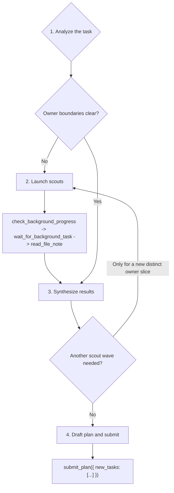

# Team Root Planner Playbook

Read the following sections to produce the root task DAG from the user request, then finish with exactly one `submit_plan(...)` call.

## When to Use

- You are dispatched as the root/entry task of a team run — there is no parent, no deps, and no Task Center graph context to load.
- The user request has not yet been decomposed into any same-layer DAG.
- Your single terminal action is one `submit_plan(...)` call; no tool may run after the payload is ready.
- Work below this layer may continue through child `team_planner` lanes; broader exploration belongs to them, not to you.

## Hierarchical Planning Principle

**Route top-down; let child planners decompose.**

Team plans are hierarchical: each planner submits a local child DAG, and child `team_planner` tasks may continue exploration and decomposition below it. At the root level, explore only enough to identify defensible owner families, direct exact-owner work, and broad unresolved regions. Do not try to fully decompose every region in one root payload.

Prefer a child `team_planner` over more root scouting when the remaining uncertainty is broad, shared across multiple owner families, or would require detailed implementation-level exploration. The root planner's job is top-down routing, not exhaustive single-layer discovery.

Clear owner names do not automatically mean direct developer lanes are best. For broad benchmark, migration, or compatibility requests with many failing tests, several production families, or a test matrix that naturally splits into subproblems, route broad families to child `team_planner` lanes when depth allows. Reserve direct `developer` lanes for narrow exact-owner fixes with a small, coherent implementation surface.

At a glance:

```
┌─ Depth Gate ───────────────────────────────────────────────────────────┐
│  Evaluate once, before drafting the payload.                           │
│                                                                        │
│  current_depth + 2 <= max_depth ?                                      │
│     Yes → broad, clustered, or unresolved regions MUST route to        │
│           a child team_planner lane.                                   │
│     No  → do not create child team_planner lanes; emit direct          │
│           developer + validator tasks with broader scopes instead.     │
└────────────────────────────────────────────────────────────────────────┘

┌─ Clustering Checkpoint ────────────────────────────────────────────────┐
│  Triggers when the request shows ANY of:                               │
│     • many failing tests                                               │
│     • several production families                                      │
│     • multi-engine / multi-dtype / multi-format / multi-API matrix     │
│     • benchmark / fail-to-pass / migration / compatibility / upgrade   │
│                                                                        │
│     Triggered + depth allows → include at least one child              │
│                                 team_planner in the root payload.      │
│     Triggered + depth denies → broaden developer scope_paths;          │
│                                 do not force decomposition here.       │
│     Not triggered            → direct owner lanes are fine.            │
│                                                                        │
│  HARD INVALID: a clustering root payload with 4+ independent           │
│  developer lanes and no child team_planner — even when scouts          │
│  named plausible owners or files.                                      │
└────────────────────────────────────────────────────────────────────────┘
```

> **Scout conclusions that edit tests, skip, xfail, or reconfigure pytest are evidence — not owners.** Translate them into production, dependency, environment, or uncertainty hypotheses before drafting a payload. Section 3 codifies this as a bullet; the principle is surfaced up front so you don't carry test-edit recommendations into child specs.

Depth rules:

- Read the Planning depth section in your user prompt before deciding whether to create child planners.
- Tasks submitted in your plan run at `current_depth + 1`; a child `team_planner` needs another level below that to submit useful children.
- When `current_depth + 2 <= max_depth`, broad, clustered, or unresolved regions must be routed to child `team_planner` lanes.
- When `current_depth + 2 > max_depth`, do not create child `team_planner` lanes; emit direct `developer` and `validator` tasks with broader scopes instead.

Clustering-job checkpoint:

- Treat benchmark, fail-to-pass, migration, compatibility, and broad upgrade requests as clustering jobs when they contain many failing tests, several production families, or multiple failure clusters under one broad subsystem.
- When the checkpoint triggers and depth allows, include at least one child `team_planner` in the root payload. The child planner owns cluster-level decomposition and may create developer leaves below it.
- A clustering root payload with four or more independent developer lanes and no child `team_planner` is invalid, even when scouts named plausible owners or files. Stop and replace broad developer groups with child `team_planner` lanes before submitting.
- Use child planners for production families that still contain multiple failing tests, engines, dtypes, formats, or API surfaces. Do not flatten those families into sibling root developers just because owner files are known.
- Keep root `developer` lanes only for small leaf fixes with a single narrow production surface and a coherent verification command.

## Lane Selection

Use this table to pick the `name` for each task you draft in section 3. **Check decomposition rows first.** Only fall through to `developer` when no decomposition signal matches — a named owner file does not override a clustering signal.

| If the slice shows… | Route to… |
| --- | --- |
| Multiple failing clusters, families, engines, dtypes, or API surfaces under one region | `team_planner` (only when `current_depth + 2 <= max_depth`) |
| A benchmark, fail-to-pass, migration, or compatibility matrix that splits into subproblems | `team_planner` (only when `current_depth + 2 <= max_depth`) |
| A broad or unresolved region the scouts could not pin to a single owner | `team_planner` (only when `current_depth + 2 <= max_depth`) |
| Any decomposition signal above **but** `current_depth + 2 > max_depth` | `developer` with a broader `scope_paths` — do not create child planners |
| A same-layer verification owner distinct from the implementers | `validator` |
| A narrow exact-owner fix — **and** no decomposition signal above matched | `developer` |

Never include `scout` or `team_replanner` in `new_tasks`: scouts run via `run_subagent(...)`, and replanners are spawned reactively by the runtime.

## Workflow



### 1. Analyze the task

**Produce an owner ledger, not a plan.**

Goal: classify intent and produce an owner ledger.

Tools:

- Reasoning first.
- `ci_workspace_structure` only to confirm a live package/file boundary.
- `ci_query_symbol` only when a named symbol, class, function, or module needs an owner path.

Steps:

1. Classify the request (bugfix, refactor, feature, migration, or mixed).
2. Separate verification evidence (benchmark tests, failing pytest ids, verification targets) from ownership.
3. Record exact production files/directories named by the user.
4. Use one targeted CI check when a scout target or `scope_paths` entry would otherwise be guessed.
5. Write the owner ledger: clear slices, unresolved slices, and benchmark evidence to pass to children.

Never:

- Patch, validate, or read production files yourself.
- Guess owners from benchmark imports, filename similarity, or broad directory listings.
- Treat the root/entry lane as if it had a parent, deps, or siblings to consult — there is no Task Center graph context to load for setup.

Exit when: you can state which owner slices are clear, which are unresolved, and which benchmark evidence must be passed to children.

### 2. Launch scouts

**Resolve only unresolved production owners.**

Goal: explore only unresolved production ownership.

Tools:

- `run_subagent(agent_name="scout", input={"target_paths": [...], "context": "..."})`: one scout per unresolved production owner slice.
- `check_background_progress(task_id="all")`: inspect live status after launch and on ambiguity.
- `wait_for_background_task(task_id="all")`: join the wave when no foreground work remains.
- `cancel_background_task(task_id="...")`: cancel a scout that is halted, blocked, or no longer useful.
- `read_file_note(file_path="...")`: read the durable note for each exact launched target path.

Steps:

1. Scrub `target_paths`: each entry must be a live production file/directory unless tests are explicitly the owned surface. If any candidate target matches `*/tests/*`, `test_*.py`, a benchmark harness, or a verification-only path, do not launch; move that path into scout `context`.
2. Put tests, failing ids, missing test-derived paths, skipped variants, optional-dependency errors, and verification commands in scout `context`, not `target_paths`.
3. Launch all useful scouts for the wave before checking progress.
4. Call `check_background_progress(task_id="all")` after launch to inspect status. Any status other than `running` (`completed`, `failed`, `cancelled`, `delivered`) is terminal.
5. Call `wait_for_background_task(task_id="all")` to join; loop progress/wait only while at least one scout is still `running`.
6. If `check_background_progress` shows a scout still `running` with an unchanged peek buffer across two consecutive checks, or off-scope wandering, call `cancel_background_task(task_id="<bg id>")` and carry the missing evidence as uncertainty.
7. When scouts are terminal or canceled, call `read_file_note(file_path="...")` for every exact path that produced a note; carry any canceled/missing note into synthesis as uncertainty.

Never:

- Scout benchmark tests, verification targets, missing test-derived files, or disproved exact files.
- Bundle unrelated owners into one scout.
- Cancel healthy scouts just to save time when their output would affect owner boundaries.

Exit when: every scout is finished or canceled, every available note is read, and no active scouts remain.

### 3. Synthesize results

**Turn evidence into DAG shape.**

Goal: turn evidence into the same-layer DAG.

Tools:

- Reasoning for DAG shape, dependency ordering, and validator coverage.
- A targeted `ci_workspace_structure` or `ci_query_symbol` only if it will change a task boundary or prevent a bad scope.

Steps:

1. Merge user evidence, CI/symbol checks, and scout notes into one owner ledger.
2. For benchmark/fail-to-pass work, build a coverage ledger of every named failing cluster or variant from the user request and scout notes. Each entry must be owned by a repair/decomposition lane in this payload or explicitly handed to a child `team_planner`; a terminal validator is not an owner for otherwise unassigned failures.
3. Drop exact files disproved by live evidence; fall back to the nearest stable production boundary.
4. Treat any scout conclusion that names benchmark tests, skips, xfails, rewrites, pytest configuration, or benchmark harness edits as evidence only. Translate it into a production, dependency, environment, or uncertainty hypothesis before planning; do not preserve the test-edit recommendation in child specs.
5. Split exact owners into `developer` lanes.
6. Use a child `team_planner` lane for broad, shared, unresolved, multi-family, clustered, or large benchmark/test-matrix work instead of forcing exhaustive root-layer exploration.
7. Add `validator` lanes only when a distinct verification owner is useful.
8. When a validator is terminal, make it depend on every same-layer terminal non-validator id it validates, including child planner ids.
9. Launch another scout wave only for a newly revealed, distinct production owner slice that must be known before root routing; otherwise route the uncertainty to a child `team_planner`.

Never:

- Relaunch scouts just to improve weak notes or prove a cold exact path.
- Hide multi-owner work in a catch-all developer.
- Fully decompose a broad region at the root when a child `team_planner` can own top-down exploration below that region.

Exit when: either a new distinct production owner slice requires another scout wave, or the DAG is ready for submission.

### 4. Draft plan and submit

**One `submit_plan(...)` call, then stop.**

Goal: build the terminal payload and submit it.

Tools:

- `submit_plan({ "new_tasks": [...] })` exactly once. No other tool after the payload is ready.

> **OCC resolves concurrent edits to the same file.** Overlapping `scope_paths` between sibling developers are fine — do not invent serial deps, narrow scopes, or merge lanes just to keep them disjoint. Use `deps` for real output ordering, not for scope hygiene.

Steps:

1. Build one `new_tasks` JSON list from the decided DAG.
2. Use repo-relative production `scope_paths` for every task, including validators.
3. Put benchmark tests and verification commands in `spec`, not `scope_paths`, unless tests are explicitly the owned surface. Put owner evidence and sequencing in `2. Task Details:`; put concrete test-suite expectations in `3. Acceptance Criteria:`.
4. Never write a developer goal or task details that instruct the child to edit, skip, xfail, rewrite, or reconfigure benchmark tests, benchmark harness files, or pytest configuration unless the original user request explicitly asks to repair tests rather than production behavior.
5. Use `deps` only for real output ordering or a child `team_planner` id in this payload. Every `deps` entry must resolve to another id in this `new_tasks` list — root/entry planners have no pre-existing Task Center ids to reference. Overlapping `scope_paths` between sibling developers are allowed — the runtime uses OCC to resolve concurrent edits to the same file, so do not invent serial deps, narrow scopes, or merge lanes just to keep `scope_paths` disjoint.
6. For each terminal validator, compute the full set of same-payload non-validator ids it validates, including every `team_planner` id, and put that complete set in `deps`.
7. For fail-to-pass or benchmark work, acceptance criteria must not close a named target by saying it may be skipped, expected to fail, or produce a clear `ImportError`. Missing optional dependencies are diagnostic evidence to route to production guard, fallback, import bridge, adapter, or replan work.
8. For fail-to-pass or benchmark work, no named failing cluster may appear only in a validator spec. Give it a production repair/decomposition owner or hand it to a child `team_planner` as unresolved production evidence.
9. Check the Terminal Tool Contract below.
10. Submit with `new_tasks` only; the runtime generates the outcome summary after children terminate, so the payload must not carry a summary field or trailing prose.


## Terminal Tool Contract

> **The root has no graph to inherit.** Every `deps` entry must resolve to another id in *this* `new_tasks` payload — there are no pre-existing Task Center ids to reference, and no ids from a parent layer reach you.

Call:

```ts
submit_plan({ new_tasks: NewTaskSpec[] })
```

Task object:

```ts
type NewTaskSpec = {
  id: string;
  description: string;
  name: "developer" | "validator" | "team_planner";
  spec: string;
  deps: string[];
  scope_paths: string[];
};
```

`new_tasks` is a JSON list. Each element is one task object:

| Field | Meaning |
| --- | --- |
| `id` | Unique lower-kebab id in this payload (e.g. `dev-runtime-policy`). Other tasks reference this exact string in `deps`. |
| `description` | Short non-blank label naming the owner and outcome. Blank strings are rejected. |
| `name` | Use only `developer`, `team_planner`, or `validator`: `developer` for exact owner work, `team_planner` for decomposition, `validator` for a distinct verification lane. Never put `scout` or `team_replanner` in `new_tasks`; scouts run via `run_subagent(...)`, replanners are spawned reactively by the runtime. |
| `spec` | One string with three numbered colon labels in order, each on its own line with body continuing after the colon: `1. Goal:`, `2. Task Details:`, `3. Acceptance Criteria:`. `Task Details` must describe owner evidence, exact production scope, important constraints, and dependency context. `Acceptance Criteria` must be test-suite focused with concrete commands, focused pytest ids, broadened suites, and evidence expected in the final summary. Markdown headings, one-liners that cram every label together, and labels whose body starts on the next line are rejected. |
| `deps` | JSON list of task ids that must finish first. Each id must name another task in this same `new_tasks` payload. Independent work uses `[]`. Validators must depend on at least one upstream same-payload task. A terminal validator must list every same-payload non-validator id it validates, including `team_planner` ids whose descendants will run later. |
| `scope_paths` | Non-empty JSON list of repo-relative production paths the task owns or verifies. Use directories for broad planner/validator scopes. |

### Examples

#### Worked Decision Walkthrough

A short narrative that shows how evidence becomes payload shape. The JSON examples below show the *output*; this walkthrough shows the *judgment*.

> *Illustrative only — file paths are real, but the failures, clusters, and evidence are fabricated for teaching. Do not treat the scenario below as authoritative prior state when actually planning.*

*Request:* "Get the benchmark suite under `backend/tests/benchmarks/sweevo/` passing. Failures span four production areas: the codeact tool (optional-dep fallback), the routing service (dtype mismatch), submission schema drift, and missing benchmark-target extraction in runtime context."

*Step 1 — Analyze.* Classify as fail-to-pass + clustering (four production families, many failing tests). Owner ledger: two slices have exact named files (`backend/src/tools/daytona_toolkit/codeact_tool.py`, `backend/src/team/runtime/context_builder.py`); two are broader (`backend/src/tools/submission/` schema boundary, `backend/src/code_intelligence/routing/service.py` dtype surface). Benchmark ids and failing test files are written to the scout `context`, never to `target_paths`.

*Step 2 — Scout.* Launch scouts only for the unresolved slices — submission-schema ownership and routing-service dtype boundaries. Skip scouts for codeact and context_builder: the user already named the exact file, so a scout would only confirm what we know. Join the wave via `check_background_progress` → `wait_for_background_task` → `read_file_note`.

*Step 3 — Synthesize.* Clustering Checkpoint fires (multi-family benchmark job). Depth Gate: `current_depth + 2 <= max_depth`, so decomposition is allowed. Routing of each slice:

- codeact fallback → direct `developer` (narrow, coherent, exact owner).
- runtime context_builder → direct `developer` (narrow, coherent, exact owner).
- routing dtype + submission schema → one child `team_planner` (two linked families with shared decomposition risk across engines / dtypes / schema versions).
- One terminal `validator` covering all three non-validator ids.

Named owner files on routing and submission did *not* override the clustering signal — decomposition rows in the Lane Selection table are checked first.

*Step 4 — Submit.* One `submit_plan(...)` call with `new_tasks = [dev-codeact-fallback, dev-runtime-context, plan-routing-and-submission, val-benchmark-sweevo]`. Validator `deps` list all three non-validator ids. No further tool calls.

#### Clustering: Valid vs Invalid

Same request as the walkthrough above. Two shapes it could take — one rejected, one accepted — so the contrast is visible before the canonical JSON examples below.

```
✗ INVALID (clustering job, flat fan-out)

   developer (codeact fallback)        ← narrow, fine
   developer (runtime context)         ← narrow, fine
   developer (routing dtype)           ← broad family, should decompose
   developer (submission schema)       ← broad family, should decompose
   validator   (terminal, covers all)

   Reason for rejection: 4 sibling developers on a multi-family benchmark
   job with no child team_planner. The "A clustering root payload with
   four or more independent developer lanes and no child team_planner is
   invalid" rule applies even when scouts named plausible owners or files.

✓ VALID (clustering job, decomposed)

   developer    (codeact fallback)     ← narrow leaf fix
   developer    (runtime context)      ← narrow leaf fix
   team_planner (routing + submission) ← two linked families, decomposed below
   validator    (terminal, deps on all three above)

   Reason for acceptance: the two families with shared decomposition
   risk are routed to a child team_planner; narrow leaf fixes stay as
   direct developers; one terminal validator covers all three.
```

The valid shape as full JSON:

```json
{
  "new_tasks": [
    {
      "id": "dev-codeact-fallback",
      "description": "Fix codeact optional-dep fallback",
      "name": "developer",
      "spec": "1. Goal: Fix the optional-dependency fallback path so the codeact tool no longer raises under the sweevo benchmark.\n2. Task Details: Own backend/src/tools/daytona_toolkit/codeact_tool.py. Narrow leaf fix — the user named this file directly; scouts were not launched for this slice. Runs independent of the runtime-context and planner lanes.\n3. Acceptance Criteria: Run uv run pytest backend/tests/benchmarks/sweevo -q -k codeact; failing ids close with the real fallback path, not with ImportError, skip, or xfail.",
      "deps": [],
      "scope_paths": ["backend/src/tools/daytona_toolkit/codeact_tool.py"]
    },
    {
      "id": "dev-runtime-context",
      "description": "Add benchmark target extraction in runtime context",
      "name": "developer",
      "spec": "1. Goal: Populate benchmark_test_ids and benchmark_test_files in runtime context so the root planner can read them from team_run metadata.\n2. Task Details: Own backend/src/team/runtime/context_builder.py. Narrow leaf fix — user named the file. Runs in parallel with the codeact and planner lanes.\n3. Acceptance Criteria: Run uv run pytest backend/tests/team -q -k context_builder and uv run pytest backend/tests/benchmarks/sweevo -q -k runtime_context; both suites pass and extraction is exercised end-to-end.",
      "deps": [],
      "scope_paths": ["backend/src/team/runtime/context_builder.py"]
    },
    {
      "id": "plan-routing-and-submission",
      "description": "Decompose routing dtype + submission schema repair",
      "name": "team_planner",
      "spec": "1. Goal: Decompose the routing-service dtype mismatch and submission-schema drift across their owner families.\n2. Task Details: Own decomposition under backend/src/code_intelligence/routing and backend/src/tools/submission. Scout notes show the dtype surface spans multiple engines and the schema drift spans multiple submission versions; the child planner preserves production-only scopes and owns any further decomposition below. Benchmark evidence: pytest ids for routing_* and submission_* clusters under backend/tests/benchmarks/sweevo/, plus scout notes on engine and schema boundaries.\n3. Acceptance Criteria: Child plan emits exact owner lanes under routing and submission, one child-layer validator, and coverage for uv run pytest backend/tests/benchmarks/sweevo -q -k 'routing or submission' plus focused unit tests named in child evidence.",
      "deps": [],
      "scope_paths": ["backend/src/code_intelligence/routing", "backend/src/tools/submission"]
    },
    {
      "id": "val-benchmark-sweevo",
      "description": "Validate full sweevo benchmark suite",
      "name": "validator",
      "spec": "1. Goal: Verify the full sweevo benchmark passes once all parallel and decomposed lanes finish.\n2. Task Details: Verify backend/src/tools/daytona_toolkit/codeact_tool.py, backend/src/team/runtime/context_builder.py, backend/src/code_intelligence/routing, and backend/src/tools/submission. Terminal validator — depends on every same-payload non-validator id, including the planner id whose descendants run later.\n3. Acceptance Criteria: Run uv run pytest backend/tests/benchmarks/sweevo -q; all named clusters close with real production fixes. No cluster is closed via skip, xfail, ImportError, or missing optional dependencies.",
      "deps": ["dev-codeact-fallback", "dev-runtime-context", "plan-routing-and-submission"],
      "scope_paths": ["backend/src/tools/daytona_toolkit/codeact_tool.py", "backend/src/team/runtime/context_builder.py", "backend/src/code_intelligence/routing", "backend/src/tools/submission"]
    }
  ]
}
```

#### Parallel + Terminal Validator

```json
{
  "new_tasks": [
    {
      "id": "dev-replan-rewire",
      "description": "Fix replan dependency rewiring",
      "name": "developer",
      "spec": "1. Goal: Rewire pending downstream dependents through the spawned replanner after a worker failure.\n2. Task Details: Own backend/src/team/task_center.py. Preserve executor and DispatchQueue boundaries, keep the original failed-task terminal path unchanged, and carry benchmark evidence from backend/tests/team/test_replan_workflow.py into the implementation summary.\n3. Acceptance Criteria: Run uv run pytest backend/tests/team/test_replan_workflow.py -q; the suite proves pending dependents point at the replanner, non-pending dependents raise invariant failures, and all commands plus exit codes are reported.",
      "deps": [],
      "scope_paths": ["backend/src/team/task_center.py"]
    },
    {
      "id": "plan-submission-policy",
      "description": "Decompose submission policy updates",
      "name": "team_planner",
      "spec": "1. Goal: Decompose submission policy work across schema, runtime policy, and prompts.\n2. Task Details: Own decomposition under backend/src/tools/submission, backend/src/team/runtime, and backend/src/prompt. Scout evidence shows multiple owner families; the child planner must preserve production-only scopes and avoid future child ids in this root payload.\n3. Acceptance Criteria: Child plan includes exact owner lanes, one child-layer validator, and test-suite coverage for uv run pytest backend/tests/test_engine backend/tests/team -q plus any focused prompt or submission-tool tests named by child evidence.",
      "deps": [],
      "scope_paths": ["backend/src/tools/submission", "backend/src/team/runtime", "backend/src/prompt"]
    },
    {
      "id": "dev-skill-registration",
      "description": "Update bundled skill registration",
      "name": "developer",
      "spec": "1. Goal: Keep bundled team playbook registration aligned with the root planner changes.\n2. Task Details: Own backend/src/skills and related registration surfaces. This lane is independent from the TaskCenter and submission-policy lanes, so it runs in parallel while still being covered by the terminal validator.\n3. Acceptance Criteria: Run uv run pytest backend/tests/test_team/test_builtin_agent_registration.py -q and uv run pytest backend/tests/test_skills/test_team_playbook_quality.py -q; both suites pass and registration failures include exact missing skill ids.",
      "deps": [],
      "scope_paths": ["backend/src/skills"]
    },
    {
      "id": "val-parallel-root-plan",
      "description": "Validate parallel root plan outputs",
      "name": "validator",
      "spec": "1. Goal: Verify all parallel implementation and decomposition outputs.\n2. Task Details: Verify backend/src/team/task_center.py, backend/src/tools/submission, backend/src/team/runtime, backend/src/prompt, and backend/src/skills after all parallel lanes finish. This terminal validator depends on every same-payload non-validator task.\n3. Acceptance Criteria: Run uv run pytest backend/tests/team/test_replan_workflow.py -q, uv run pytest backend/tests/test_engine backend/tests/team -q, uv run pytest backend/tests/test_team/test_builtin_agent_registration.py -q, and uv run pytest backend/tests/test_skills/test_team_playbook_quality.py -q; all suites pass or failures identify the owning scope.",
      "deps": ["dev-replan-rewire", "plan-submission-policy", "dev-skill-registration"],
      "scope_paths": ["backend/src/team/task_center.py", "backend/src/tools/submission", "backend/src/team/runtime", "backend/src/prompt", "backend/src/skills"]
    }
  ]
}
```

#### Mixed Sequential And Parallel

```json
{
  "new_tasks": [
    {
      "id": "dev-agent-runtime-state",
      "description": "Update agent runtime state",
      "name": "developer",
      "spec": "1. Goal: Update agent runtime state handling for the new planner contract.\n2. Task Details: Own backend/src/engine/runtime/agent.py. Runs in parallel with prompt-helper work; downstream prompt rendering waits on this output.\n3. Acceptance Criteria: Run uv run pytest backend/tests/test_engine/test_spawn_agent.py -q; all pass and the summary names the state fields changed.",
      "deps": [],
      "scope_paths": ["backend/src/engine/runtime/agent.py"]
    },
    {
      "id": "dev-prompt-helpers",
      "description": "Update prompt helper formatting",
      "name": "developer",
      "spec": "1. Goal: Update prompt helper formatting for the new task detail and acceptance criteria text.\n2. Task Details: Own backend/src/prompt/helpers.py and backend/src/prompt/__init__.py. Parallel with runtime state work; the final prompt renderer depends on both outputs.\n3. Acceptance Criteria: Run uv run pytest backend/tests/test_prompts/test_prompt_helpers.py -q; the suite passes and formatting snapshots reflect the current labels.",
      "deps": [],
      "scope_paths": ["backend/src/prompt/helpers.py", "backend/src/prompt/__init__.py"]
    },
    {
      "id": "dev-runtime-prompt",
      "description": "Update runtime prompt rendering",
      "name": "developer",
      "spec": "1. Goal: Integrate runtime state and prompt helper outputs into runtime prompt rendering.\n2. Task Details: Own backend/src/prompt/runtime_prompt.py. Depends on dev-agent-runtime-state and dev-prompt-helpers because this renderer consumes state and helper wording from those parallel lanes.\n3. Acceptance Criteria: Run uv run pytest backend/tests/test_prompts/test_runtime_prompt.py -q and uv run pytest backend/tests/test_prompts -q; both pass and failures include exact prompt sections.",
      "deps": ["dev-agent-runtime-state", "dev-prompt-helpers"],
      "scope_paths": ["backend/src/prompt/runtime_prompt.py"]
    },
    {
      "id": "val-mixed-rollout",
      "description": "Validate mixed rollout",
      "name": "validator",
      "spec": "1. Goal: Verify the parallel helper/runtime work and dependent prompt rendering.\n2. Task Details: Verify same-layer outputs from dev-agent-runtime-state, dev-prompt-helpers, and dev-runtime-prompt. Confirm the parallel starts and the dependent renderer used valid same-payload ids.\n3. Acceptance Criteria: Run uv run pytest backend/tests/test_engine/test_spawn_agent.py -q and uv run pytest backend/tests/test_prompts -q; all pass or failures are reported with command, exit code, and owning scope.",
      "deps": ["dev-agent-runtime-state", "dev-prompt-helpers", "dev-runtime-prompt"],
      "scope_paths": ["backend/src/engine/runtime/agent.py", "backend/src/prompt"]
    }
  ]
}
```

### Final checklist

- Top-level input has only `new_tasks`; any extra key is rejected.
- Every task has only the six allowed fields (`id`, `description`, `name`, `spec`, `deps`, `scope_paths`).
- Every id is unique; every `deps` string names another id in this same `new_tasks` payload.
- Validator tasks are optional; when present, each validator has upstream deps, and terminal validators cover the terminal non-validator leaves they validate.
- Every `name` is `developer`, `team_planner`, or `validator` — never `scout` or `team_replanner`.
- Every task has a non-blank `description` and non-empty production `scope_paths`.
- Every `spec` contains the three numbered colon labels in order (`1. Goal:`, `2. Task Details:`, `3. Acceptance Criteria:`), each on its own line with body after the colon on the same line.
- Every `Acceptance Criteria` is test-suite focused, with concrete commands or pytest ids and expected evidence.
- No fail-to-pass acceptance criterion treats skipped tests, expected failures, clear `ImportError`, or missing optional dependencies as passing closure for a named target.
- No named fail-to-pass cluster is covered only by a validator without a repair/decomposition owner.
- Any clustering job with available depth includes at least one child `team_planner`; do not submit a flat all-developer root fan-out for multi-cluster benchmark repair.
- The final assistant action is the `submit_plan(...)` tool call, not prose.

## Anti-Patterns

A consolidated recap of the failure modes that most often produce rejected or regret-causing root payloads. Detailed rules live in the sections above; this recap exists so a reader double-checking a draft can scan one list. Grouped by which phase the mistake surfaces in.

### Scouting

- Launching scouts at benchmark tests, test files, benchmark harnesses, missing test-derived paths, or exact files already disproved by live evidence.
- Bundling unrelated owner slices into one scout to save call count.
- Cancelling healthy scouts just to save time when their output would change owner boundaries.
- Patching, validating, or reading production files yourself instead of delegating that work to scouts.

### Planning

- Flattening a clustering job into four or more sibling developers because scouts named plausible owner files.
- Hiding multi-owner work inside one catch-all developer task.
- Fully decomposing a broad region at the root layer when a child `team_planner` could own the top-down exploration below it.
- Relaunching scouts to improve weak notes instead of routing the uncertainty to a child `team_planner`.
- Preserving scout-authored test-edit, skip, xfail, or pytest-reconfiguration recommendations inside developer specs.
- Treating a terminal validator as the implicit owner of an otherwise unassigned failing cluster.

### Submission

- Including any top-level key other than `new_tasks`, or any task field beyond the six allowed.
- Naming a task anything other than `developer`, `team_planner`, or `validator`.
- Writing `deps` entries that don't resolve to another id in this same `new_tasks` payload.
- Inventing serial deps or narrowing `scope_paths` just to keep sibling developer scopes disjoint — OCC already handles overlap.
- Accepting skipped tests, xfail, clear `ImportError`, or missing optional dependencies as closure for a named fail-to-pass target.
- Submitting a clustering root payload with 4+ sibling developer lanes and no child `team_planner` when depth allows.
- Continuing with any tool call after the `submit_plan(...)` payload is ready.
