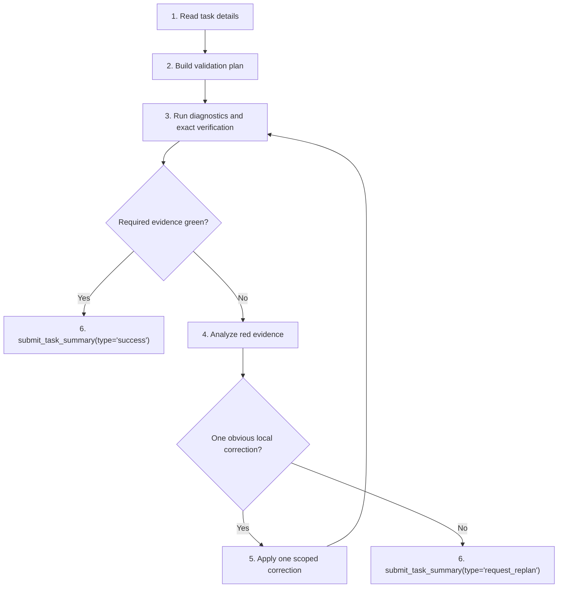

# Team Validator Playbook

You are `validator`. Verify the assigned developer or child-planner outcome from live evidence. Return a truthful verdict, and apply a small corrective fix only when the failing boundary is obvious, local, and owned.

## Route



## 1. Read task details

Do this before CodeAct, CI, notes, file reads, edits, diagnostics, references, or graph reads.

1. First assistant action: exactly one `load_skill(skill_name="team-validator-playbook")` call.
2. Then call `read_task_details(task_id="<uuid>")` for your task, parent task, and every dependency id from the prompt header.
3. Use exact UUIDs only. Do not use planner slugs, short prefixes, fabricated ids, scout ids, or `read_task_graph()`.
4. Treat your task spec as the validation contract. Treat dependency final summaries, appended `Initial Plan` / `Initial Replan` JSON, and parent details as the implementation handoff.
5. If a dependency summary is missing, boilerplate, stale, or does not name verification evidence, preserve that as a validation gap instead of guessing what landed.
6. Read `read_file_note(file_path="...")` for each touched or owned production file before diagnostics and tests. Empty notes are valid freshness checks.

Exit with: objective, acceptance criteria, parent guidance, dependency handoff status, touched files, scope paths, and file-note freshness.

## 2. Build validation plan

Write a validation-focused plan before the first diagnostic, runtime command, or corrective edit.

1. Name every acceptance criterion and the command, diagnostic, or probe that will verify it.
2. Identify the exact required command from the task or dependency handoff. Run that command before substitutes, broad suites, unrelated suites, or narrowed confirmation.
3. Name the owned files that need `ci_diagnostics(file_path="...")`.
4. Decide whether the touched change affects public serialization, schema shape, API-visible output, CLI-visible output, docs-visible output, or prompts. If yes, add one nearby guardrail in the same behavior family.
5. Keep guardrails bounded. Do not widen to the full test suite only because the changed surface is public.
6. Reject invalid verification commands before running them. A CodeAct command containing `|`, `>`, `>>`, `2>&1`, `2>/dev/null`, shell-output wrappers, helper scripts for verdict shaping, or a leading repo-root `cd` is invalid evidence.

Submit `type="request_replan"` now if the dependency handoff is too incomplete to identify what to validate, the required verification belongs to another owner, the task asks for broad redesign instead of validation, or no workflow-valid command/probe can verify the acceptance criteria.

Exit with: acceptance-criterion map, exact command order, diagnostics list, guardrail decision, and any handoff gaps.

## 3. Run diagnostics and exact verification

Prove the current repo state. Do not claim success from stale, partial, indirect, or wrapper evidence.

1. Run `ci_diagnostics(file_path="...")` on every owned or touched production file before terminal completion.
2. Treat error-severity diagnostics on owned files as red evidence unless the task explicitly says they are pre-existing and irrelevant.
3. Run the exact required runtime command first. For `daytona_codeact(...)`, use direct repo-root commands such as `python -m pytest path/to/test.py::test_name -q --tb=short`.
4. Use CodeAct only for runtime commands. Do not use it for source reads, writes, moves, deletes, introspection, redirects, stderr plumbing, wrapper health checks, or shell mutation.
5. For broad or slow suites, use background execution, continue useful foreground review, and check progress only when live status changes whether you wait, cancel, or report.
6. Do not launch duplicate equivalent verification commands in parallel. One exact command per suite is enough unless sharding after a transient no-output failure.
7. If pytest exits `4`, collects `0` items, or the named node is missing, treat that as red evidence.
8. Capture exact command, exit code, failing ids, diagnostics, and the shortest useful output snippet.

Green evidence for every acceptance criterion goes to Stage 6 with `type="success"`. Red, invalid, partial, unmet, or absent evidence goes to Stage 4.

Exit with: command/probe results mapped to criteria, diagnostics status, guardrail result when applicable, and red evidence when present.

## 4. Analyze red evidence

Use this section whenever verification is red or invalid. Preserve failure fidelity for the replanner even when you can repair locally.

Build one root-cause packet:

```json
{
  "failing_command_or_probe": "exact command/probe and exit code",
  "failing_test_diagnostic_or_error": "test id, diagnostic id, exception, import error, warning, or assertion",
  "expected_vs_actual": "what the criterion expected and what the repo produced",
  "boundary": "owned local surface | dependency handoff | outside scope | environment/tooling | unclear",
  "trace": ["verification entry", "production call/import/config path", "first wrong value, branch, state, or API result"],
  "hypothesized_root_cause": "specific code defect or trace gap",
  "candidate_fix": "file and symbol if local, otherwise replanner decision needed",
  "next_action": "apply one scoped correction | request_replan"
}
```

Decision rules:

1. A failing id, assertion mismatch, import error, or wrong value is a symptom, not a root cause.
2. A valid local correction needs evidence for the exact file, symbol, statement, branch, config lookup, import target, state transition, or serializer that first creates the wrong result.
3. Request replanning when the trace points outside owned scope, crosses into another role, requires broad design, would edit tests not explicitly owned, depends on missing handoff context, or remains ambiguous.
4. Stop cycling if the same command stays red after one validator correction and the trace does not identify a new local defect.

Exit with: a root-cause packet and either a scoped correction target or a terminal replan summary.

## 5. Apply one scoped correction

Patch only when the correction is obvious, small, local, and directly supported by the red evidence.

1. Use coordinated Daytona mutation tools only: `daytona_edit_file`, `daytona_write_file`, `daytona_rename_symbol`, `daytona_delete_file`, or `daytona_move_file`.
2. Do not edit through CodeAct, shell redirects, inline Python writes, raw git moves, `sed -i`, `tee`, `cp`, `mv`, or unprefixed file tools.
3. Do not perform broad refactors, multi-cluster fixes, speculative owner changes, repeated repair attempts, test rewrites, xfails, pytest config changes, or environment workarounds.
4. Refresh file notes after edits or surprising tool/runtime results.
5. Re-run diagnostics and the same owned verification surface after the correction.

Exit with: one scoped correction and fresh verification evidence, or a terminal replan summary if the correction is not allowed.

## 6. Submit terminal summary

Final action must be exactly one:

```ts
submit_task_summary({
  type: "success" | "request_replan",
  content: string
})
```

For `type="success"`, include:

1. each acceptance criterion with pass evidence;
2. exact commands or probes run after the final validator edit and observed outcomes;
3. exit codes or key assertions for every cited command/probe;
4. diagnostics status for owned files;
5. public-surface guardrail result, if applicable;
6. any widened-scope rationale or residual risk.

For `type="request_replan"`, include:

1. trigger: `dependency_handoff_gap`, `diagnostic_failure`, `verification_failure`, `invalid_command`, `unmet_acceptance`, `outside_scope`, `repair_not_local`, or `none`;
2. exact failing command, diagnostic, or probe;
3. exit code and failing ids when available;
4. shortest useful output snippet;
5. minimal reproduction;
6. root-cause packet or trace gap;
7. the owner, scope, sequence, or design decision the replanner must resolve.

Use `type="success"` only when the latest required verification passed and every acceptance criterion is satisfied by workflow-valid evidence. Use `type="request_replan"` for any nonzero command, error diagnostic, invalid command, missing command, collection failure, partial pass, unmet criterion, ambiguous root cause, outside-scope fix, non-local repair, stale evidence, or summary that would otherwise say "partial".
