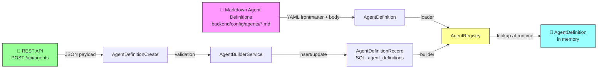
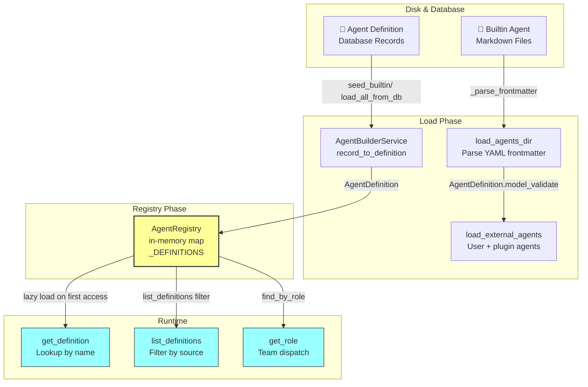
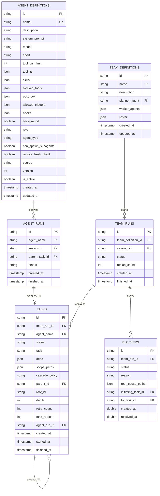
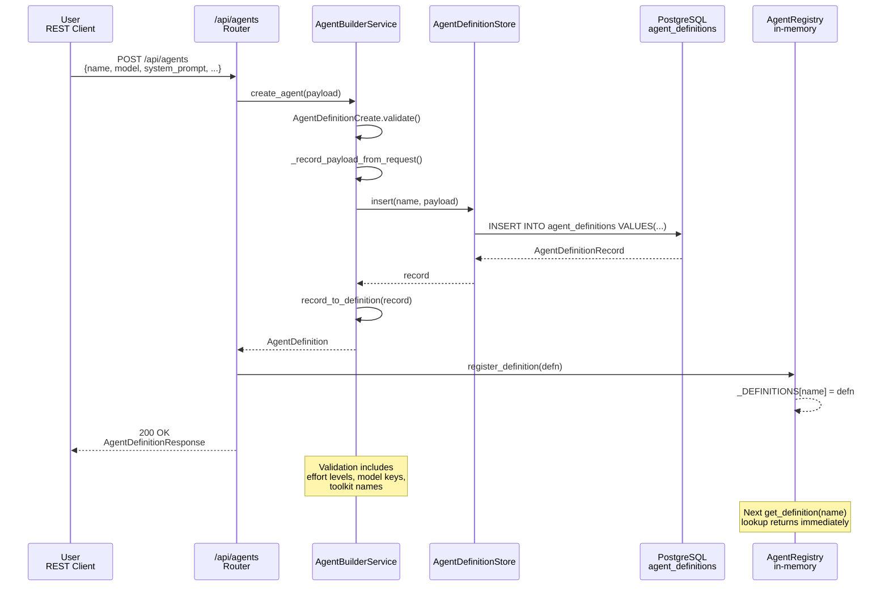
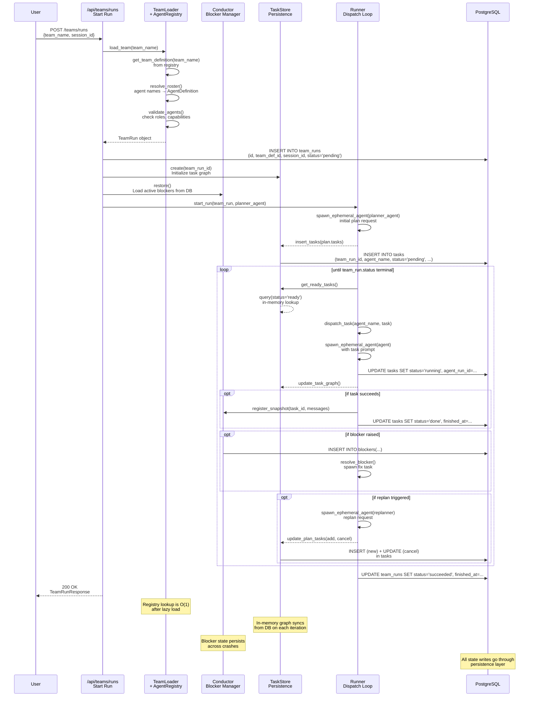

# Agents, Teams, and Customization

## Overview

EphemeralOS agents are customizable runtime units defined through Markdown files or API endpoints. Teams orchestrate multiple agents in coordinated workflows with persistent task queues and blocker mechanics. This document describes the customization surface, loading pipeline, persistence model, and team run lifecycle.

---

## 1. Customization Surface

Agents are customized via two complementary paths: **Markdown frontmatter** (for builtin agents and disk-based definitions) and **REST API** (for user-created agents stored in the database).



### Markdown Format

Agent definitions are written as Markdown files with YAML frontmatter:

```
---
name: developer
description: "Team-mode developer: reads, writes, and edits code."
role: developer
model: inherit
tool_call_limit: 100
toolkits: ["sandbox_operations", "code_intelligence"]
blocked_tools: ["ci_read_file"]
posthook: ["post_note", "request_replan"]
allowed_triggers: ["tc_note"]
---
# System Prompt (body of the file)
Execute one bounded coding task...
```

**Frontmatter fields:**
- `name`, `description` (required)
- `system_prompt` (optional; overridden by body text)
- `model`, `effort`, `tool_call_limit`
- `toolkits`, `skills`, `posthook`, `blocked_tools`
- `allowed_triggers`, `background`, `role`, `agent_type` (agent | subagent)
- `source` (builtin | user | plugin), capability flags

### REST API Surface

**Create custom agent:**
```
POST /api/agents
{
  "name": "my-researcher",
  "description": "...",
  "model": "claude-opus",
  "system_prompt": "...",
  "toolkits": ["search", "note_taking"],
  "blocked_tools": [],
  "effort": "high",
  "tool_call_limit": 50
}
```

**Update agent:**
```
PATCH /api/agents/{name}
{
  "system_prompt": "...",
  "toolkits": ["new_toolkit"]
}
```

**List & get:**
```
GET /api/agents?source=user
GET /api/agents/{name}
```

---

## 2. Loader → Registry → Runtime Flow

Three distinct layers orchestrate the transition from disk/database to runtime execution:



**Key components:**

- **`AgentLoader`** (`backend/src/agents/loader.py`): Parses Markdown frontmatter via `_parse_frontmatter()`, calls `load_agents_dir()` to scan disk, calls `load_external_agents()` to gather user/plugin definitions.

- **`AgentRegistry`** (`backend/src/agents/registry.py`): Single in-memory `_DEFINITIONS` dict holding all registered `AgentDefinition` objects. Lazily loads external agents on first `get_definition()` or `list_definitions()` call. Provides lookup functions: `get_definition(name)`, `find_by_role(role)`, `has_role(agent_name, role)`.

- **`AgentBuilderService`** (`backend/src/agents/builder/service.py`): Converts database `AgentDefinitionRecord` ↔ runtime `AgentDefinition` via `record_to_definition()`. Seeds builtin definitions into DB via `seed_builtin()`.

---

## 3. Persistence Model

### Entity-Relationship Diagram



**Key tables:**

- **`agent_definitions`** (durable): User-created agents, seeded builtin definitions. Tracks `source` (user | builtin | plugin), `version`, `is_active`.

- **`team_definitions`** (durable): Team rosters mapping roles to agent names. `planner_agent` is the entry point; `worker_agents` list eligible task executors. Mirrors legacy `roster` JSON for backward compatibility.

- **`team_runs`** (durable): Team execution instances. Tracks `team_definition_id`, `session_id`, `status` (pending | running | succeeded | failed), replan count.

- **`tasks`** (partitioned by `team_run_id`): Task queue for a single team run. Fields: `status` (pending | ready | running | expanded | done | failed), `agent_name` (assigned worker), `deps` (task IDs), `parent_id` (parent task for expansion), `depth`, `retry_count`, `agent_run_id` (link to agent execution).

- **`blockers`** (durable): Active/resolved blockers during team runs. `initiating_task_id` is the task that declared the blocker; `fix_task_id` is the task spawned to resolve it.

- **`agent_runs`** (durable): Every individual agent invocation (ephemeral or team). Links task to agent execution via `parent_task_id`.

### Ephemeral vs. Durable State

| Layer | Ephemeral | Durable |
|-------|-----------|---------|
| **Agent Definition** | In-memory registry (`_DEFINITIONS` dict) | Database table `agent_definitions` |
| **Team Definition** | In-memory registry | Database table `team_definitions` |
| **Run Execution** | Conductor state, task graph snapshot | `team_runs`, `tasks`, `blockers`, `agent_runs` rows |
| **Briefing/Notes** | Task Center in-memory cache | Note records in `team_runs` (persisted asynchronously) |

---

## 4. Creating a Custom Agent via API

Sequence showing the builder service integrating user input with database persistence:



**Steps:**

1. **API** receives `AgentDefinitionCreate` payload.
2. **Validation** checks effort levels, model keys, toolkit names.
3. **Builder** converts payload → `_record_payload_from_request()`.
4. **Store** inserts `AgentDefinitionRecord` into DB.
5. **Builder** converts record back → `AgentDefinition` via `record_to_definition()`.
6. **Registry** stores `AgentDefinition` in `_DEFINITIONS` map.
7. **Response** sent to user; registry is now hot for lookups.

---

## 5. Team Run Lifecycle Wiring

Sequence showing a team run from start through task dispatch to completion, integrating loader, registry, conductor, and persistence:



**Key interactions:**

- **Loader** resolves team roster by looking up each agent in `AgentRegistry`.
- **AgentRegistry** is lazily populated from disk (Markdown) and DB on first access.
- **TaskStore** maintains in-memory task graph synced from DB via `refresh_graph()`.
- **Conductor** persists active blockers; can restore on restart.
- **Runner** dispatches tasks via `spawn_ephemeral_agent()`, updating DB after each step.
- **AgentRunTracker** creates/finishes agent run records for every agent execution.

---

## 6. Agent Configuration Summary

**Customization knobs per agent:**

| Field | Impact | Example |
|-------|--------|---------|
| `system_prompt` | Core behavioral instruction | Markdown body or API field |
| `model` | LLM selection; "inherit" uses default | "claude-opus-4", "inherit" |
| `effort` | Heuristic budget; low/medium/high | High = larger tool_call_limit |
| `tool_call_limit` | Max tool calls before agent stops | 50, 100, unlimited (None) |
| `toolkits` | Allowed tool groups (sandbox, code_intelligence, search) | ["sandbox_operations", "code_intelligence"] |
| `blocked_tools` | Tool names to remove after assembly | ["ci_read_file"] |
| `skills` | Skill playbooks to inject | ["team-developer-playbook"] |
| `posthook` | Tools agent must call after submission | ["post_note"] |
| `role` | Team dispatch label (planner, developer, reviewer) | "developer" |
| `agent_type` | agent \| subagent (capability flag) | "agent" |
| `can_spawn_subagents` | Whether agent can spawn background work | true (default) |
| `background` | Run without awaiting completion | false (default) |
| `initial_prompt` | First-turn user message override | "Start by reading..." |
| `allowed_triggers` | External trigger types (tc_note) | ["tc_note"] |

---

## 7. Team Configuration Summary

**Customization via Markdown:**

```yaml
---
name: my_team
description: "Coordinated coding team"
entry_planner: team_planner
roster:
  planner: [team_planner]
  developer: [developer]
  reviewer: [validator, scout]
  resolver: [resolver]
---
This team coordinates...
```

**Core fields:**

- `name`: Team identifier
- `entry_planner`: Agent name that receives the initial goal
- `roster`: Mapping of role → list of agent names. Replanner/resolver can be dynamically selected by role.

---

## 8. Key Types & Classes

### Agents Module

- **`AgentDefinition`** (`types.py`): Full runtime agent config (Pydantic model).
- **`AgentDefinitionRecord`** (`db/model.py`): SQLAlchemy ORM row (durable).
- **`AgentBuilderService`** (`builder/service.py`): Converts records ↔ definitions.
- **`AgentDefinitionStore`** (`db/store.py`): CRUD on `agent_definitions` table.
- **`AgentLoader`** (`loader.py`): Parses Markdown, loads from disk.
- **`AgentRegistry`** (`registry.py`): In-memory lookup map.
- **`AgentRunTracker`** (`run_tracker.py`): Wraps agent execution lifecycle.

### Teams Module

- **`TeamDefinition`** (`models.py`): Roster + entry planner.
- **`TeamDefinitionRecord`** (`persistence/model.py`): SQLAlchemy ORM row.
- **`TeamLoader`** (`loader.py`): Parses Markdown, loads team definitions.
- **`TeamRegistry`** (`registry.py`): In-memory lookup.
- **`Task`** / **`TaskSpec`** (`models.py`): Execution units and plan items.
- **`TaskStore`** (`persistence/task_store.py`): SQL persistence for task queue.
- **`Conductor`** (`runtime/conductor.py`): Blocker assessment and resolution.
- **`TeamRun`** (`runtime/team_run.py`): Orchestrates a single team execution.

---

## 9. Configuration Directories

Builtin agent and team definitions live in:

```
backend/config/agents/
  ├── developer.md
  ├── validator.md
  ├── team_planner.md
  ├── team_replanner.md
  ├── resolver.md
  └── scout.md

backend/config/teams/
  ├── default_team.md
  └── ...
```

User-created agents are:
- **Defined via API** → stored in `agent_definitions` table
- **Loaded at startup** via `AgentLoader.load_external_agents()` → stored in `AgentRegistry`

---

## Summary

**Customization** flows through Markdown frontmatter (builtin) and REST API (user-created) into a unified database. **Loading** parses disk files and DB records into `AgentDefinition` objects, which populate the in-memory `AgentRegistry`. **Runtime** lookups are O(1) after lazy initialization. **Teams** compose agents by role and use a persistent task queue backed by PostgreSQL. **Persistence** separates ephemeral state (in-memory graphs) from durable state (DB tables), enabling crash recovery via `Conductor.restore()` and `TaskStore.refresh_graph()`.

