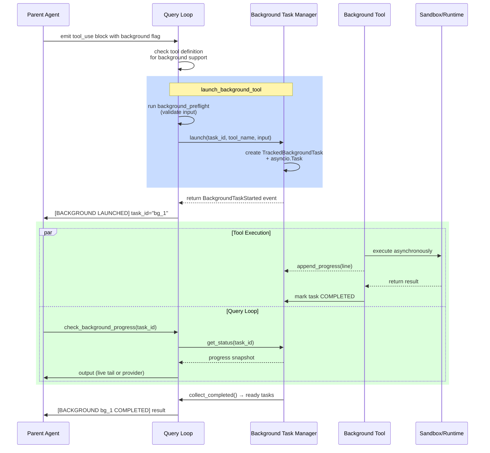
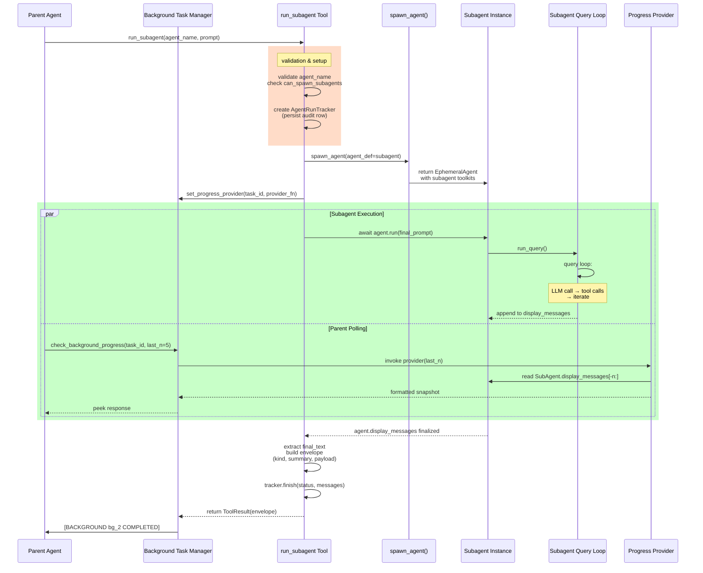

# Background Tasks and Subagents

EphemeralOS provides two complementary patterns for concurrent work: **background tasks** fire-and-forget tools that run asynchronously alongside the query loop, and **subagents** which are full independent agents spawned as background tasks.

## Background Task Dispatch

### How It Works

When an agent calls a tool marked with `background="always"`, the engine dispatches it asynchronously instead of blocking the query loop. The parent agent receives a task_id immediately and can continue work while the task runs in the background.



### Key Components

**`BackgroundTaskManager`** (background_tasks.py)
- Tracks all background tasks by task_id (e.g. `bg_1`, `bg_2`)
- Owns the `asyncio.Task` for each background tool execution
- Lifecycle states: RUNNING → {COMPLETED, FAILED, CANCELLED} → DELIVERED
- Provides live progress snapshots via `progress_provider` callback or `progress_lines` buffer
- No automatic cleanup — the agent (via LLM reasoning) decides when to wait/cancel

**`launch_background_tool()`** (background_dispatch.py)
- Validates tool supports `background` mode (checks tool definition)
- Runs optional `background_preflight()` hook (e.g. input validation)
- Wraps the tool execution in a coroutine with progress callbacks
- Dispatches via `asyncio.create_task()` (not `await`)

**`TrackedBackgroundTask`** (background_tasks.py)
- Holds the asyncio task, tool metadata, progress buffer, and status
- `progress_lines`: append-only buffer for streaming tools
- `progress_provider`: pull callback for structured progress (e.g. subagent message list)
- `task_type`: discriminator ("agent" for tools, "subagent" for run_subagent)
- `run_id`: optional back-reference to persisted audit record

### Agent Interaction Flow

1. **Launch**: Agent calls background-enabled tool → receives task_id immediately
2. **Poll**: Agent calls `check_background_progress(task_id)` to peek at live output
3. **Join**: Agent calls `wait_for_background_task(task_id)` to block until completion
4. **Cancel**: Agent calls `cancel_background_task(task_id, reason)` to stop stale work
5. **Auto-deliver**: Engine calls `collect_completed()` each query turn to yield finished tasks back to the agent as a system message

---

## Subagent as a Tool

### Architecture

`run_subagent` is a special background tool that spawns a **full nested agent** with its own:
- Query loop and message history
- Tool registry
- LLM API client (dedicated pool to avoid contention)
- System prompt and capabilities

Unlike ephemeral agents (one-shot snapshots), subagents have a complete task loop—they can reason, call tools, and iterate until they submit or timeout.



### Subagent Lifecycle

1. **Validation**: Check agent_name is dispatchable and user has permission
2. **Audit Record**: Create `AgentRunRecord` (FK parent run) BEFORE spawn (so failures are auditable)
3. **Spawn**: Call `spawn_agent(agent_def=subagent)` to create fresh agent with:
   - NO background management toolkit (subagents cannot spawn their own background tasks)
   - Dedicated fresh API client (no connection pool contention)
   - Subagent system prompt and restricted toolkits
4. **Progress Provider**: Register a pull callback on BackgroundTaskManager so parent can peek at live messages
5. **Run**: Drain `agent.run(prompt)` in an async loop; catches `CancelledError` for early-stop salvage
6. **Envelope**: Format submission as `{kind, summary, run_id, artifact_ref, payload}`:
   - `kind="plan"` if submitted a Plan object
   - `kind="brief"` if SubmittedSummary with target_paths artifact
   - `kind="summary"` otherwise
   - `kind="raw"` if no submission (fallback to final text)
7. **Audit Finish**: Persist final messages and status to agent_run_store
8. **Return**: Envelope JSON (not full message history) to parent

### Key Differences from Ephemeral Agents

| Aspect | Ephemeral Agent | Subagent | Background Task |
|--------|-----------------|----------|-----------------|
| **Lifecycle** | One-shot snapshot, frozen after run | Full task loop; iterates until submit or timeout | Fire-and-forget tool call |
| **Spawning** | Top-level entry (via /api/run or relay) | Spawned by `run_subagent` tool (nested) | Called by agent; no nested spawning |
| **Message History** | Appended only during run; accessible only after | Live display_messages list; readable during execution | Not applicable (tool output only) |
| **Progress Access** | None (awaited to completion) | Via `check_background_progress` + progress_provider callback | Via `check_background_progress` + progress_lines buffer |
| **Background Toolkit** | Registered (has background management tools) | NOT registered (subagents cannot spawn subagents) | N/A |
| **API Client** | Session's shared client pool | Fresh dedicated client (no contention) | Inherits parent's execution context |
| **Cancellation** | No (ephemeral runs block until done) | Via early-stop mode: `CancelledError` → salvage partial result | Via kill_callback + `TaskStatus.CANCELLED` |
| **Audit Trail** | Row in agent_run_store (user-visible) | Row in agent_run_store with parent_run_id + parent_task_id (hidden from user list) | No dedicated row (embedded in background task) |
| **Result Format** | Full ConversationMessage array | Typed envelope JSON (summary + payload) | Tool-specific ToolResult |

---

## Nested Execution Model

### The Three Layers

```
[User Request]
       ↓
[Parent Agent (EphemeralAgent)]
       ├─ Query Loop → tool calls
       ├─ Background Task 1: ordinary_tool (asyncio task)
       ├─ Background Task 2 (subagent):
       │       └─ Subagent Instance (EphemeralAgent)
       │              ├─ Query Loop → tool calls
       │              ├─ Tool 1: read file
       │              ├─ Tool 2: analysis
       │              └─ Final submission
       └─ (Parent continues query loop during all this)
```

### Control Flow for Subagents

1. **Parent decision**: LLM emits `run_subagent(agent_name="scout", ...)` block
2. **Dispatch**: `launch_background_tool()` wraps it and calls `asyncio.create_task()`
3. **Immediate return**: Parent gets task_id and system message `[BACKGROUND LAUNCHED] task_id="bg_2"`
4. **Execution**: Subagent runs its own query loop asynchronously
   - Subagent calls tools, iterates, eventually submits or exits
   - Each subagent iteration appends to its own display_messages list
5. **Parent polling** (optional): Parent calls `check_background_progress(task_id="bg_2")` which calls the progress_provider callback:
   - Provider reads the subagent's live display_messages
   - Returns formatted snapshot of last N messages (clamped to PEEK_MESSAGE_MAX=10)
6. **Parent blocking** (optional): Parent calls `wait_for_background_task(task_id="bg_2")`
   - Query loop blocks on `asyncio.wait()` until subagent completes
   - Returns final envelope with submission and run_id
7. **Auto-delivery**: Engine's query loop calls `collect_completed()` each turn
   - Finds subagent task with status=COMPLETED
   - Appends system message with BackgroundTaskCompleted event
   - Agent sees `[BACKGROUND bg_2 COMPLETED]` and the result

### Cancellation & Early Stop

**Ordinary background tool**: Marked as CANCELLED immediately; kill_callback attempts process termination

**Subagent**: Uses early-stop mode:
- Parent calls `cancel_background_task(task_id, reason)`
- Manager sets `stop_mode="early_stop"` (not CANCELLED yet)
- Manager calls `asyncio.Task.cancel()` on the subagent's run task
- Subagent catches `CancelledError` in run loop:
  - Calls `_clear_current_task_cancellation()` to salvage cleanup
  - Finalizes messages, extracts final_text
  - Submits partial result (not an error)
  - Tracks `completion_mode="early_stopped"` and `cancel_reason`
- Final envelope includes `completion_mode`, `cancel_reason`, and last available messages

---

## System Integration Points

### Background Dispatch Entry Points

**`launch_and_collect_bg_events()`** (background_dispatch.py)
- Called by the query loop (engine/core/query.py) for each tool_use block with `background` flag set
- Routes to `launch_background_tool()`
- Collects completed events via `collect_completed()`

**Tool Definition Attributes**
- `background="always"`: Always dispatch as background (e.g. run_subagent)
- `background="optional"`: Available for background via input flag
- `background="forbidden"` (default): Never background
- `task_type="subagent"`: Discriminator for monitoring/UI

### Progress & Status APIs

**`BackgroundTaskManager.get_status(task_id)`**
- Returns JSON-safe dict: task_id, status, elapsed_seconds, output, run_id, task_type, etc.
- For running tasks: returns live progress via provider or progress_lines
- For completed tasks: returns final result.output

**`BackgroundTaskManager.set_progress_provider(task_id, callable)`**
- Registers a pull callback that returns a fresh progress snapshot on demand
- Used by run_subagent to expose subagent.display_messages[-n:]
- Manager calls it synchronously during get_status() calls

**`BackgroundTaskManager.append_progress(task_id, line)`**
- Push callback for streaming tools (alternative to progress_provider)
- Tools call this via `context.metadata.on_progress_line()`

---

## References

- `/backend/src/engine/runtime/background_dispatch.py`: Dispatch plumbing
- `/backend/src/engine/runtime/background_tasks.py`: BackgroundTaskManager lifecycle
- `/backend/src/tools/subagent/run_subagent_tool.py`: Subagent spawning & execution
- `/backend/src/engine/runtime/agent.py`: spawn_agent() and EphemeralAgent
- `/backend/src/engine/core/query.py`: Query loop integration (calls launch_and_collect_bg_events)
