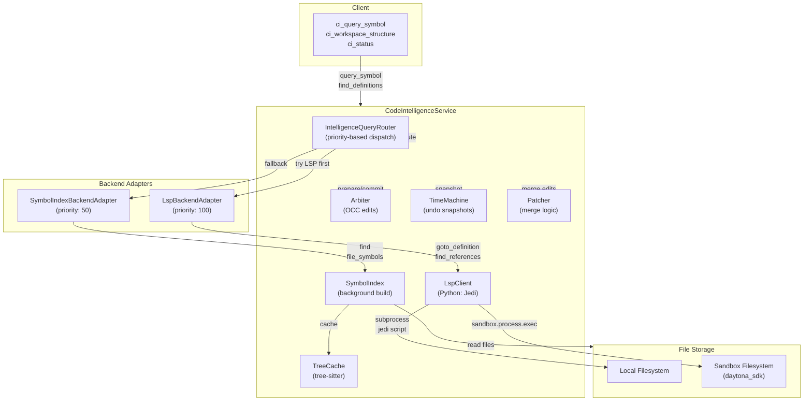
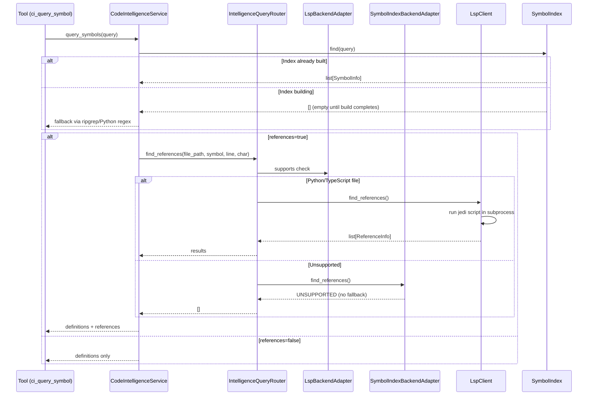
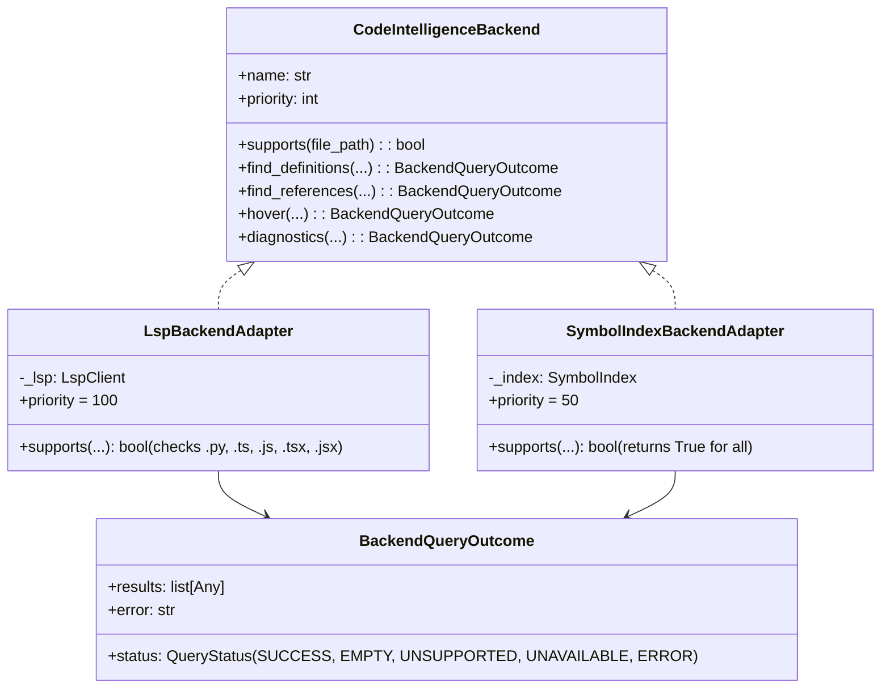
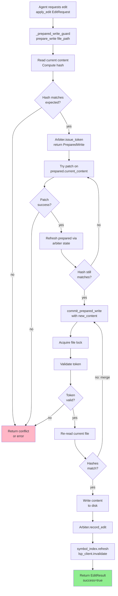
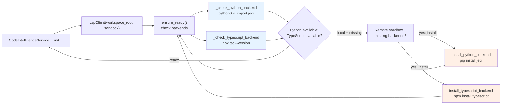

# Code Intelligence

The Code Intelligence subsystem orchestrates multi-backend semantic and structural code querying across local and sandbox workspaces. It unifies LSP-driven queries (Jedi for Python, language servers for TypeScript) with fast symbol indexing, edit coordination, and file change tracking.

## Architecture Overview



## Components

### RoutingService (CodeIntelligenceService)

Singleton per sandbox. Orchestrates all code intelligence operations: symbol queries, references, diagnostics, edits, and telemetry.

**Key Methods:**
- `find_definitions(file_path, symbol, line, character)` → `list[SymbolInfo]`
- `find_references(file_path, symbol, line, character)` → `list[ReferenceInfo]`
- `hover(file_path, line, character)` → `HoverResult | None`
- `diagnostics(file_path)` → `list[Diagnostic]`
- `query_symbols(query)` → `list[SymbolInfo]` (symbol index only)
- `apply_edit(request)` → `EditResult` (OCC-coordinated)
- `apply_write(request)` → `EditResult`
- `prepare_write(file_path)` → `PreparedWrite | EditResult`
- `commit_prepared_write(prepared, content)` → `EditResult`

**Initialization:**
- Symbol index builds asynchronously at first `ensure_initialized()` call
- LSP backends (Python/TypeScript) probed on demand; installed if missing

### Symbol Indexing (SymbolIndex)

Background daemon thread indexes Python files via AST, non-Python files via tree-sitter or regex fallback.

**Key Operations:**
- `ensure_built(wait=True, timeout=30.0)` → triggers background build
- `refresh(file_path, content)` → re-index single file after edit
- `find(query)` → search all indexed symbols by name
- `file_symbols(file_path)` → symbols in a specific file

**Data Flow:**
1. Collects indexable files from workspace root (local or sandbox)
2. For remote sandboxes: batch-downloads files via `sandbox.fs.download_files()` (fast) or individual fallback
3. Extracts symbols in parallel batches (SYMBOL_INDEX_BATCH_SIZE = 50)
4. Stores in thread-safe `_symbols: dict[str, _FileSymbols]`
5. Generation counter incremented on each batch commit

**Symbol Extraction:**
- **Python:** AST parser → walk recursively for functions, classes, assignments
- **Non-Python:** tree-sitter parse tree when available, else regex fallback patterns

### LSP Integration (LspClient)

Subprocess-based language server queries (Python via Jedi, TypeScript stub).

**Key Methods:**
- `goto_definition(file_path, line, character)` → `list[SymbolInfo]`
- `find_references(file_path, line, character)` → `list[ReferenceInfo]`
- `hover(file_path, line, character)` → `HoverResult | None`
- `diagnostics(file_path)` → `list[Diagnostic]`
- `ensure_ready(install_missing=False)` → `dict[str, bool]` (languages available)

**Python Backend (Jedi):**
- Runs Python script in subprocess (local) or sandbox (`sandbox.process.exec()`)
- Script calls `jedi.Script.goto()`, `get_references()`, `help()`
- Results parsed from JSON stdout
- Column resolution: advances from 0 to actual symbol name position on def/class lines

**Caching:**
- LRU cache with TTL (LSP_CACHE_TTL = 60 seconds, LSP_CACHE_MAX_ENTRIES = 200)
- Cache key: `def:{file_path}:{line}:{character}` etc.
- Invalidated on file edits via `invalidate(file_path)`

**Telemetry:**
- Tracks queries, cache hits, errors, successes per client instance

### Query Routing (IntelligenceQueryRouter)

Priority-based fallback dispatch across backends.

**Routing Logic:**
```
For each query (find_definitions, find_references, hover, diagnostics):
  1. Try backends in descending priority order
  2. Check if backend supports the file type
  3. Execute query; return if status == SUCCESS
  4. If status in {EMPTY, UNSUPPORTED, UNAVAILABLE, ERROR}, try next backend
  5. Return empty results if all backends fail
```

**Backend Priorities:**
- **LspBackendAdapter:** priority 100 (semantic queries preferred)
- **SymbolIndexBackendAdapter:** priority 50 (structural fallback)

### Edit Coordination (Arbiter)

Optimistic concurrency control (OCC) for file edits via write reservation tokens.

**Workflow:**
1. `prepare_write()` → captures file snapshot, issues token, returns `PreparedWrite`
2. Agent modifies content
3. `commit_prepared_write()` → validates token, re-reads file, merges if non-overlapping
4. On success: records edit in arbiter ledger, invalidates LSP/symbol index caches
5. On conflict: returns conflict reason (version_mismatch, overlapping_range, stale_reservation)

**Key Classes:**
- `PreparedWrite` → reservation snapshot (file_path, token_id, current_content, current_hash)
- `EditResult` → commit outcome (success, conflict, message, snapshot_id)

### File Content Management (ContentManager)

Abstraction layer for local and sandbox file I/O.

**Methods:**
- `read(file_path, allow_missing=False)` → `tuple[content, existed]`
- `write(file_path, content)` → writes via local FS or `sandbox.fs.upload_file()`
- `bind_sandbox(sandbox)` → updates sandbox handle for recycled services

### Tree Cache

Caches tree-sitter parse trees for reuse in symbol extraction and editing.

**Key Operations:**
- `get_tree(file_path, content=None)` → `TreeEntry | None`
- Limits: TREE_CACHE_MAX_FILES = 500, TREE_CACHE_MAX_FILE_SIZE = 1 MB

### Undo (TimeMachine)

Maintains file snapshots for undo.

**Methods:**
- `save(file_path, content)` → stores snapshot
- `rollback(file_path)` → `Snapshot | None`, restores previous version
- `clear()` → discards all snapshots

### Merge Logic (Patcher, merge.py)

Attempts to merge concurrent edits when file changes between prepare and commit.

**Conflict Detection:**
- If `current_hash != prepared.current_hash` and file existed at prepare time:
  1. Detect edit window (line_start, line_end) from diff
  2. Merge if edits don't overlap
  3. Return conflict if overlapping or edit window detection fails

## Symbol Indexing Workflow



## LSP Query Sequence

```mermaid
sequenceDiagram
    participant Client as ci_query_symbol Tool
    participant Service as CodeIntelligenceService
    participant Cache as LspClient (cache)
    participant Jedi as Python/Jedi

    Client->>Service: find_definitions(file_path, symbol, line, char)
    Service->>Service: _resolve_symbol_column()
    Service->>Service: find_definitions() via router
    Service->>Cache: Check cache (key = def:file:line:char)
    alt Cache hit
        Cache-->>Service: cached results
    else Cache miss
        Cache->>Jedi: import jedi; s=Script(); s.goto(line, column)
        Jedi-->>Cache: JSON [{"name": ..., "path": ..., "line": ..., "type": ...}]
        Cache->>Cache: parse JSON, build SymbolInfo list
        Cache->>Cache: store in LRU cache (TTL 60s)
        Cache-->>Service: results
    end
    Service->>Service: return results
    Service-->>Client: definitions
```

## Backend Adapter Protocol



## Edit Coordination Workflow



## LSP Server Lifecycle



## Types and Data Structures

**SymbolInfo** – resolved symbol location
- `name: str` – full name (e.g., "MyClass.method")
- `kind: SymbolKind` – function, class, method, variable, module, interface, property, constant, unknown
- `file_path: str` – absolute file path
- `line: int` – 1-indexed line number
- `end_line: int | None` – optional end line for block symbols
- `character: int` – 0-indexed column
- `signature: str` – function/method signature snippet
- `docstring: str` – extracted documentation
- `container: str` – enclosing class/module name

**ReferenceInfo** – a reference to a symbol
- `file_path: str`
- `line: int` – 1-indexed
- `character: int` – 0-indexed
- `text: str` – matched line text

**HoverResult** – hover information at position
- `content: str` – docstring or signature
- `language: str` – source language
- `symbol: SymbolInfo | None` – resolved symbol info

**Diagnostic** – error/warning at position
- `file_path: str`
- `line: int`, `character: int`, `end_line`, `end_character`
- `severity: DiagnosticSeverity` – error, warning, information, hint
- `message: str`, `source: str`, `code: str`

**PreparedWrite** – edit reservation snapshot
- `file_path: str`
- `token_id: str` – arbiter reservation token
- `current_content: str` – file content at prepare time
- `current_hash: str` – 16-char SHA256 digest
- `agent_id: str` – editing agent identifier
- `existed: bool` – whether file existed at prepare time
- `line_start`, `line_end`, `operation_type` – optional edit window hints

**EditResult** – edit operation outcome
- `success: bool`
- `file_path: str`
- `message: str` – human-readable status
- `conflict: bool` – version conflict detected
- `conflict_reason: str` – version_mismatch, overlapping_range, stale_reservation, lock_timeout
- `snapshot_id: str` – arbiter generation on success

## Tool Surface (ci_query_symbol)

The unified tool for code intelligence queries.

```
ci_query_symbol(query, kind="", references=false) → ToolResult

Args:
  query (str): symbol name or partial name to search for
  kind (str): optional filter (function, class, method, variable)
  references (bool): if true, trace all callers/import sites via LSP

Returns (JSON):
  {
    "definitions": [
      {
        "name": "symbol_name",
        "kind": "function|class|method|variable|...",
        "file": "path/to/file.py",
        "line": 42,
        "signature": "def foo(x, y):"
      },
      ...
    ],
    "references": [  # only if references=true
      {
        "file": "path/to/caller.py",
        "line": 100,
        "text": "result = foo(a, b)"
      },
      ...
    ],
    "total_references": 25,  # only if references=true
    "confidence": "full|unavailable"  # "full" if LSP succeeded, else "unavailable"
  }
```

**Routing Logic:**
1. Try `SymbolIndex.find(query)` first (fast, no position needed)
2. If empty, fall back to `ripgrep` regex search (local) or remote sandbox search
3. If `references=true`:
   - Try LSP `find_references()` on top 5 definitions (sorted by production priority)
   - If LSP unavailable, return definitions only with `confidence: unavailable`

**Common Patterns:**
- Find where a symbol is defined: `ci_query_symbol("MyClass", references=false)`
- Trace all callers before editing: `ci_query_symbol("my_function", references=true)`
- Narrow by kind: `ci_query_symbol("init", kind="method")`

## Fallback Strategies

**Symbol Index Cold Start:**
When the symbol index hasn't finished building, tools fall back to:
1. Local ripgrep (if available and workspace is local)
2. Remote ripgrep on sandbox via `sandbox.process.exec()`
3. Python regex fallback (no dependencies)

**LSP Fallback:**
When LSP is unavailable or fails on a query:
- `find_definitions`: fall back to symbol index
- `find_references`: no fallback (semantic-only); return empty
- `hover`: fall back to symbol index (line-based match)
- `diagnostics`: no fallback; return empty

**Multi-Workspace Support:**
- Each `CodeIntelligenceService` is per-sandbox singleton
- Service registry (`get_code_intelligence`) handles per-workspace instances
- Sandbox rebinding on service reuse: `_rebind_service_sandbox()`

## Telemetry (CITelemetry)

Runtime metrics aggregated from service components:
- `symbol_index_size: int` – total indexed symbols
- `symbol_index_generation: int` – index version counter
- `indexed_files: int` – files in symbol index
- `lsp_connected: bool` – at least one language backend ready
- `lsp_query_count: int` – total LSP queries
- `lsp_cache_hits: int` – cache hits in LspClient
- `arbiter_active_edits: int` – concurrent edit reservations
- `total_edits: int` – edits recorded in arbiter ledger

Accessible via `service.status()` → dict or `service.get_telemetry()` → CITelemetry.

