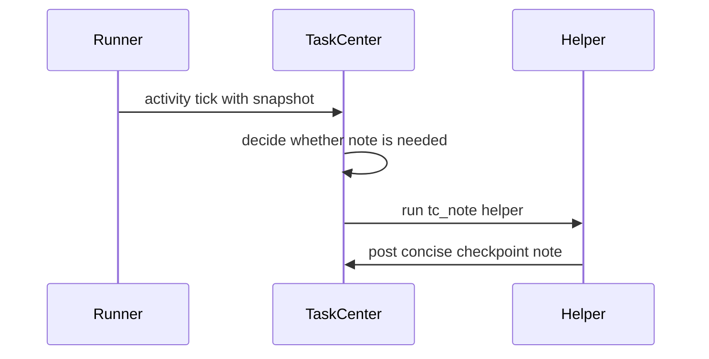

# Ephemeral Agents

An ephemeral agent is a short-lived helper run that produces one constrained artifact from a frozen conversation snapshot. It does not mutate the task graph directly.

## Current Use

TaskCenter uses ephemeral agents for `tc_note` checkpointing. When a running task has enough activity without a recent note, TaskCenter can ask a helper to summarize progress from the latest snapshot.

## Properties

- Uses a narrow system prompt and constrained tool surface.
- Produces a task-center note or no-op result.
- Does not interrupt the primary agent.
- Does not pause, cancel, or resume tasks.
- Leaves all graph mutations to TaskCenter and terminal submission handling.

## Flow

