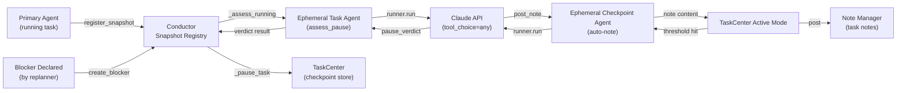
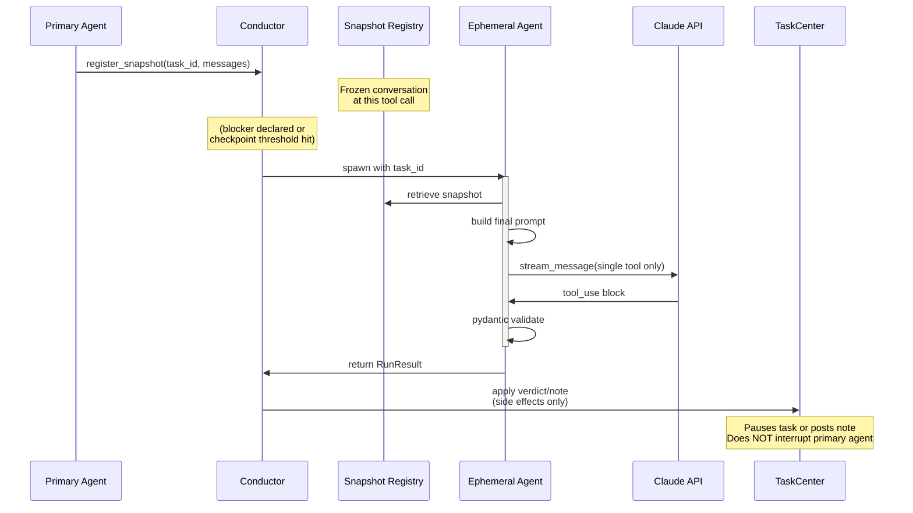

# Ephemeral Agent

An ephemeral agent is a short-lived LLM agent spawned mid-run to produce a single structured artifact without interrupting the primary task agent. It operates on a frozen conversation snapshot, uses a constrained set of tools, and writes no state — only generating outputs that TaskCenter or Conductor apply as side effects.

## What is an Ephemeral Agent

Ephemeral agents solve a critical problem: agents must surface progress and blockers without pausing to await synchronous LLM calls. The solution is to fork a shadow agent that reads the primary agent's conversation history and produces assessments or notes in parallel.

Key properties:
- **Short-lived:** Spawned on demand, runs one tool call, then dies.
- **Non-interfering:** Does not read or write primary agent state — only consumes frozen snapshots.
- **Tool-constrained:** Single tool only (pause_verdict or post_note), guaranteed to call it via `runner.run()`.
- **Snapshot-based:** Inherits the primary task's conversation history at spawn time; immune to concurrent edits.

## High-Level Architecture



## Lifecycle and Snapshot Mechanism

Ephemeral agents operate on snapshots registered during primary agent execution:



**Snapshot registration:** After each successful tool execution, the primary agent's executor calls `conductor.register_snapshot(task_id, display_messages)`. The snapshot is immutable; the agent continues running.

**Snapshot lifetime:** A snapshot remains valid until the task completes or is paused. If a blocker is declared while a task is running, its most recent snapshot is used for pause assessment. If no snapshot exists, assessment falls back to auto-pause.

## Constrained Tool Loop: runner.run()

The `runner.run()` function implements a guaranteed tool-call loop:

```mermaid
stateDiagram-v2
    [*] --> BuildRequest: Initialize<br/>tool_choice based<br/>on tool count
    
    BuildRequest --> StreamCall: Build API request<br/>with frozen messages<br/>+ final prompt
    
    StreamCall --> ParseResponse: Stream API response<br/>collect tool_use events
    
    ParseResponse --> CheckToolUse{Tool use<br/>block present?}
    
    CheckToolUse -->|No| Retry: Log warning
    
    CheckToolUse -->|Yes| ValidateTool{Tool name<br/>recognized?}
    
    ValidateTool -->|No| ToolError: Add tool_result<br/>error to conversation
    
    ValidateTool -->|Yes| ValidatePydantic{Input passes<br/>Pydantic<br/>validation?}
    
    ValidatePydantic -->|No| ValidationError: Add validation<br/>error to conversation
    
    ValidatePydantic -->|Yes| Success: Return RunResult<br/>with validated input
    
    Retry --> TurnCheck{Turns < max_turns?}
    ToolError --> TurnCheck
    ValidationError --> TurnCheck
    
    TurnCheck -->|Yes| StreamCall
    TurnCheck -->|No| Exhausted: Raise RuntimeError<br/>exhausted max_turns
    
    Success --> [*]
    Exhausted --> [*]
```

**Key properties:**
- With single tool: `tool_choice={"type": "tool", "name": "..."}` for exactness.
- With multiple tools: `tool_choice={"type": "any"}` to allow LLM choice.
- Retries on: invalid tool name, validation failure, API errors.
- Max turns: Default 10; raises RuntimeError if exhausted without valid call.
- **No side effects during retry:** Tool is only executed when validation succeeds and `execute_tools=True`.

## Use Cases

### Pause Assessment (Blocker Impact)

**Trigger:** Replanner declares a blocker (e.g., "shared service is down").

**Flow:**
1. Conductor calls `assess_pause(task_id, messages, broken_files, problem)` for each RUNNING sibling.
2. Ephemeral agent receives frozen conversation and prompt: "Does your task depend on these broken files?"
3. LLM calls `pause_verdict` with answer ("YES" or "NO") and reason.
4. Conductor collects verdicts, pauses all YES tasks, stores checkpoint as rehydration data.

**Outcome:** Running tasks are paused without interruption; the primary agent continues until its current tool call finishes, then finds itself paused on next dispatch.

### Checkpoint Auto-Notes (Active Mode)

**Trigger:** TaskCenter detects edit or turn threshold.

**Edit checkpoint:** 5 file edits since last note → "What files were edited and why?"

**Turn checkpoint:** 10 turns since last hook → "What is the status, findings, and blockers?"

**Flow:**
1. TaskCenter calls `run_checkpoint_note(task_id, messages, PROMPT_TEMPLATE)`.
2. Ephemeral agent reads conversation and generates a progress note.
3. LLM calls `post_note` with the note content.
4. TaskCenter posts the note under the task's ID (attributed as "agent_name (auto)").
5. Activity tracker resets counters; replanner sees note via `read_sibling_notes()`.

**Outcome:** Silent agents are guaranteed to surface findings; replanner can detect shared failures early.

### Post-Run Extraction

**Trigger:** Task agent completes; executor runs post-run tool phase.

**Flow:**
1. Executor calls `runner.run(tools=[submit_plan, post_note, request_replan], execute_tools=True)`.
2. Ephemeral runner validates and executes the tool call (unlike pause/checkpoint agents).
3. Side effects are applied: plan inserted, note posted, replan request queued.

**Outcome:** Executor enforces that post-run artifacts are submitted before task status transitions.

## Non-Interference Guarantee

Ephemeral agents are architected to never block or mutate primary agent state:

- **Snapshot isolation:** Conversation snapshot is read-only; concurrent primary edits are not seen.
- **No state writes:** Ephemeral agent produces output only; TaskCenter/Conductor apply it as side effects.
- **Async spawning:** Pause assessment is `asyncio.gather(*[_assess_one(r) for r in running])` — all assessments run in parallel, not sequentially.
- **Graceful degradation:** If no api_client available, auto-pause without LLM call; if runner exhausts turns, log and skip rather than crash.

The primary agent's query loop is never interrupted. When the primary agent yields or completes a tool call, Conductor has already registered the latest snapshot, making it safe for ephemeral agents to spawn and assess in the background.

## Comparison: Ephemeral vs Primary Agent

| Aspect | Primary Agent | Ephemeral Agent |
|--------|---------------|-----------------|
| **Lifetime** | Entire task run (hours/days) | Single tool call (seconds) |
| **Tools** | Full toolkit (edit, execute, etc.) | Constrained set (1 tool) |
| **State** | Mutable conversation + plan state | Read-only snapshot |
| **Spawning** | Once per task dispatch | On-demand (blocker, checkpoint, post-run) |
| **Interruption** | Can be paused/cancelled mid-run | Never interrupts primary |
| **Validation** | Interactive retry (agent sees errors) | Automatic retry (runner retries) |
| **Output** | Modifies task state + emits notes | Produces artifact only (side effects applied by caller) |
| **Failure mode** | Task failed, triggers replan | Log warning, graceful degradation |
| **System prompt** | Role-aware (developer, replanner, etc.) | Generic (checkpoint reporter, blocker assessor) |

## Implementation References

- **Runner:** `external_trigger/runner.py` — Core `run()` loop with `tool_choice="any"`, Pydantic validation, max_turns retry.
- **Pause assessment:** `external_trigger/pause_assessment.py` — `assess_pause()` spawns ephemeral agent for blocker impact.
- **Checkpoint notes:** `external_trigger/tc_note.py` — `run_checkpoint_note()` spawns ephemeral agent for progress note.
- **Tools:** `tools/external_trigger/pause_verdict.py` — Single-tool constraint; `tools/context/toolkit.py` → `PostNoteTool` (external_trigger type).
- **Conductor snapshot registry:** `team/runtime/conductor.py` → `register_snapshot()`, `_assess_running()`.
- **TaskCenter active mode:** `team/task_center.py` → `check()` method (threshold detection and spawn).
- **System prompts:** `external_trigger/tc_note.py` → `EDIT_CHECKPOINT_PROMPT`, `TURN_CHECKPOINT_PROMPT`.
