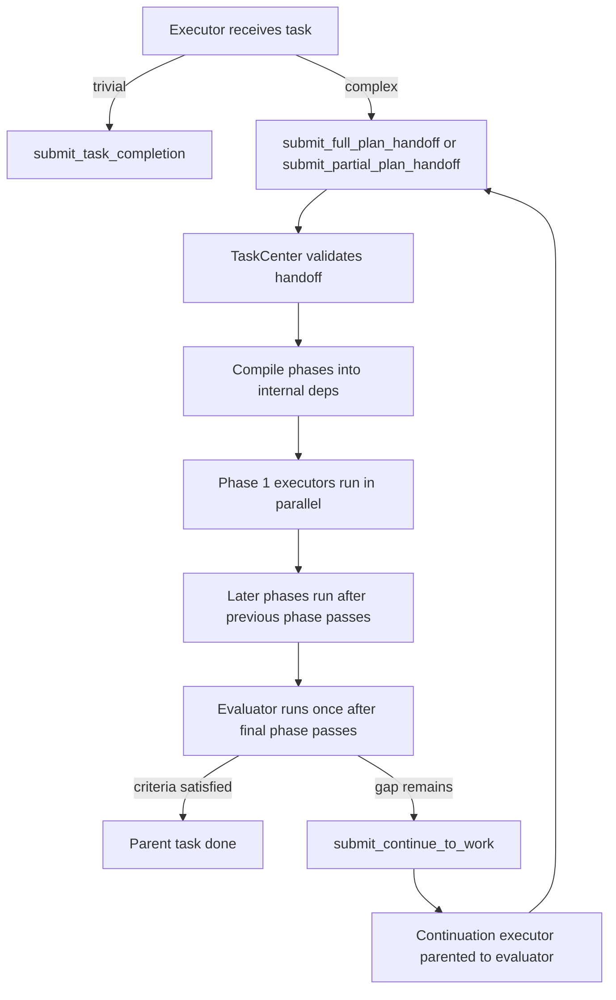
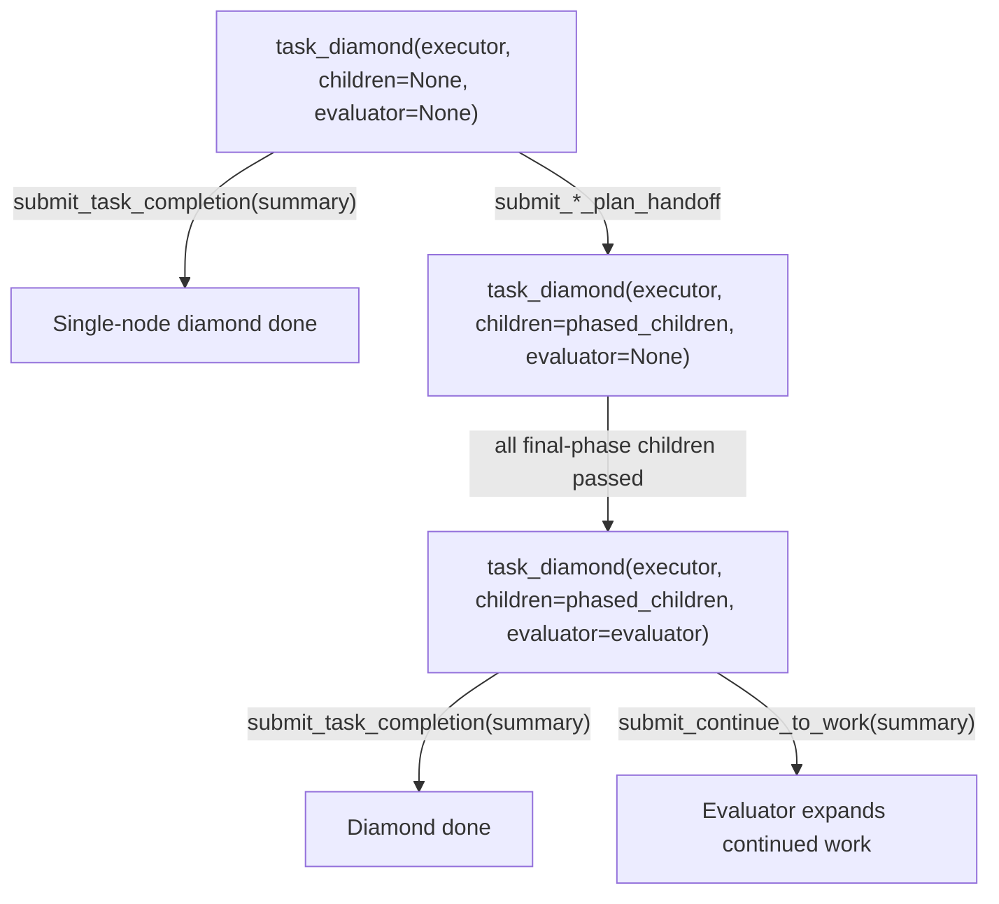
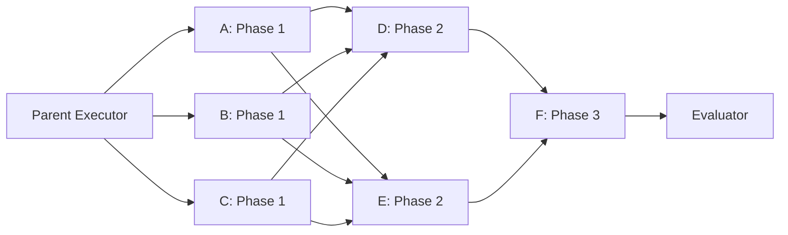
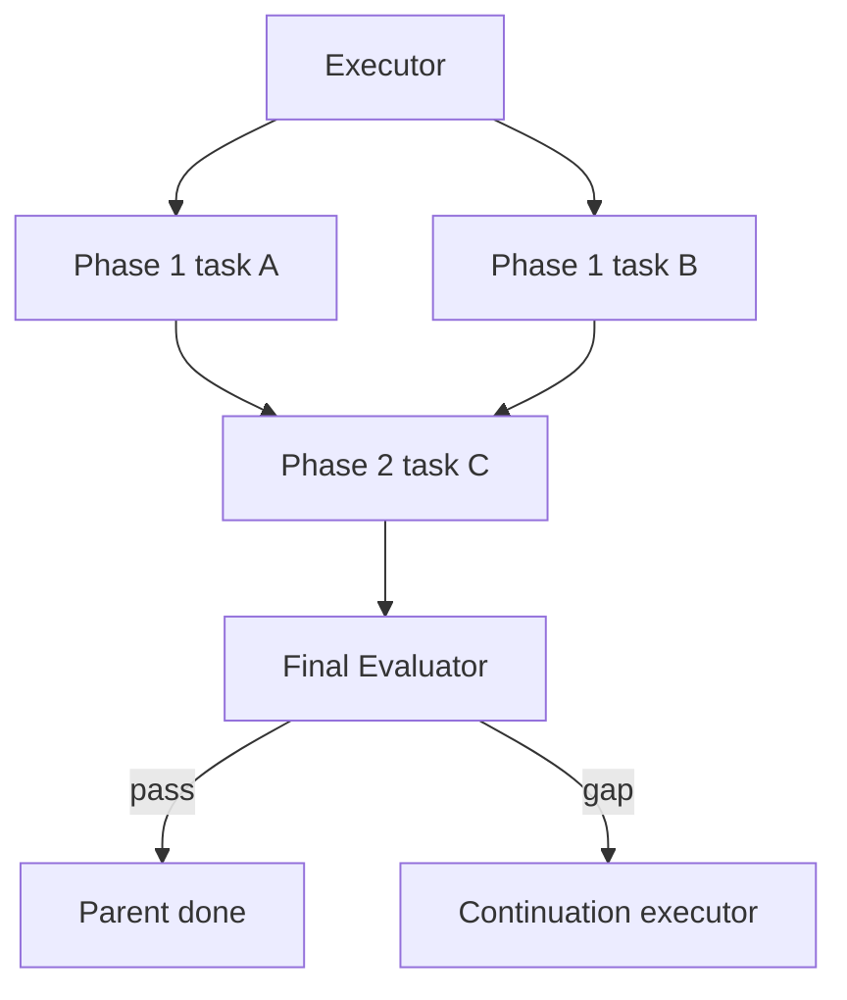
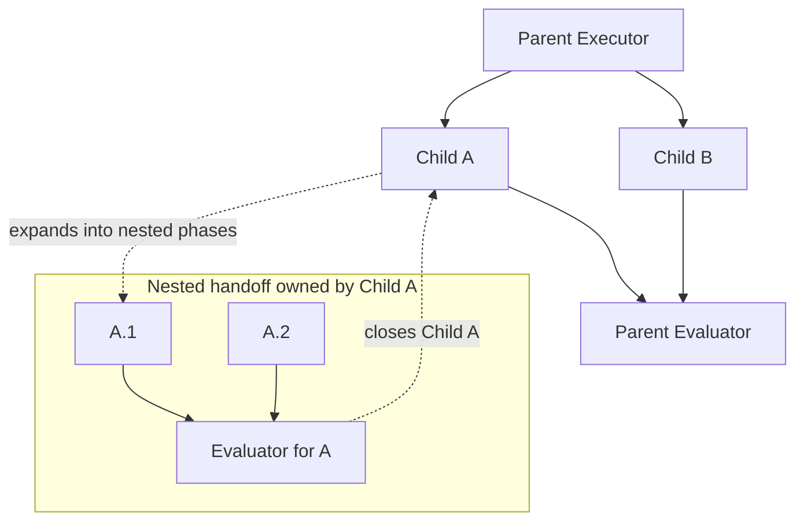
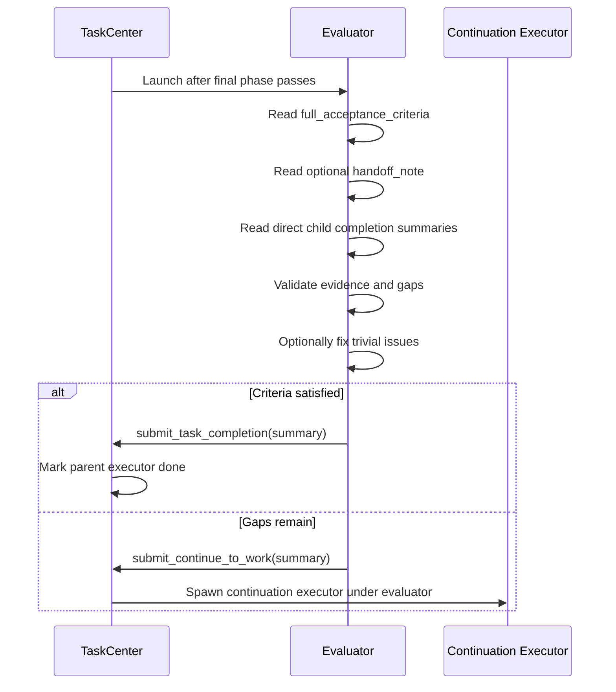
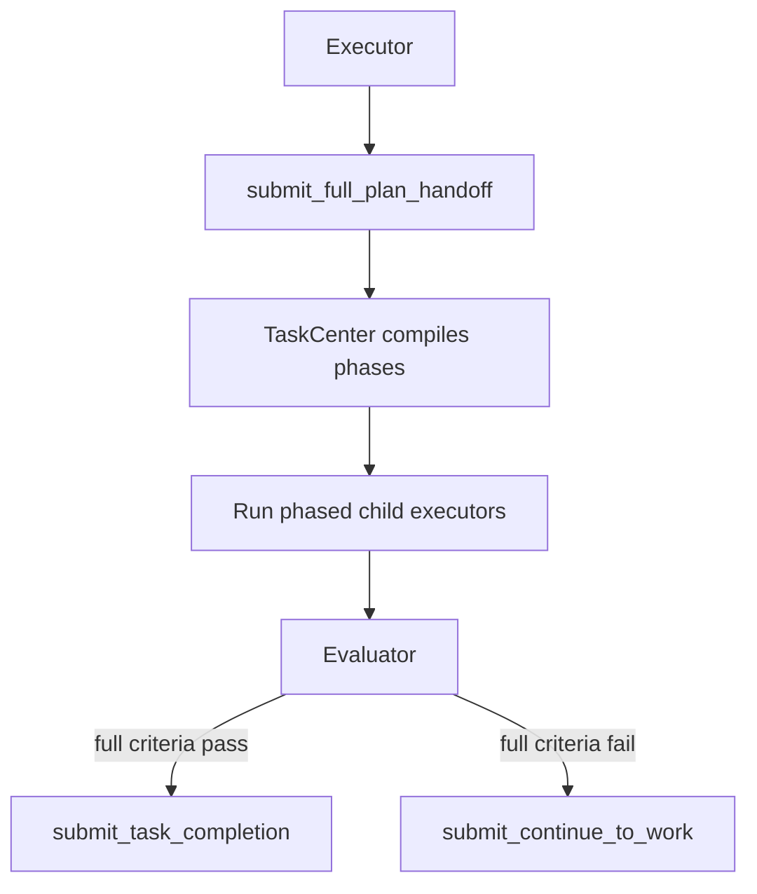
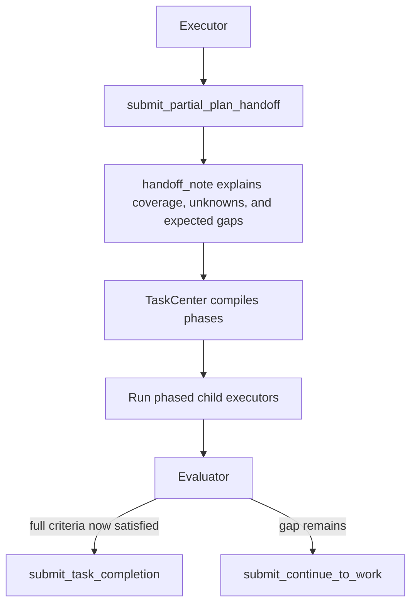
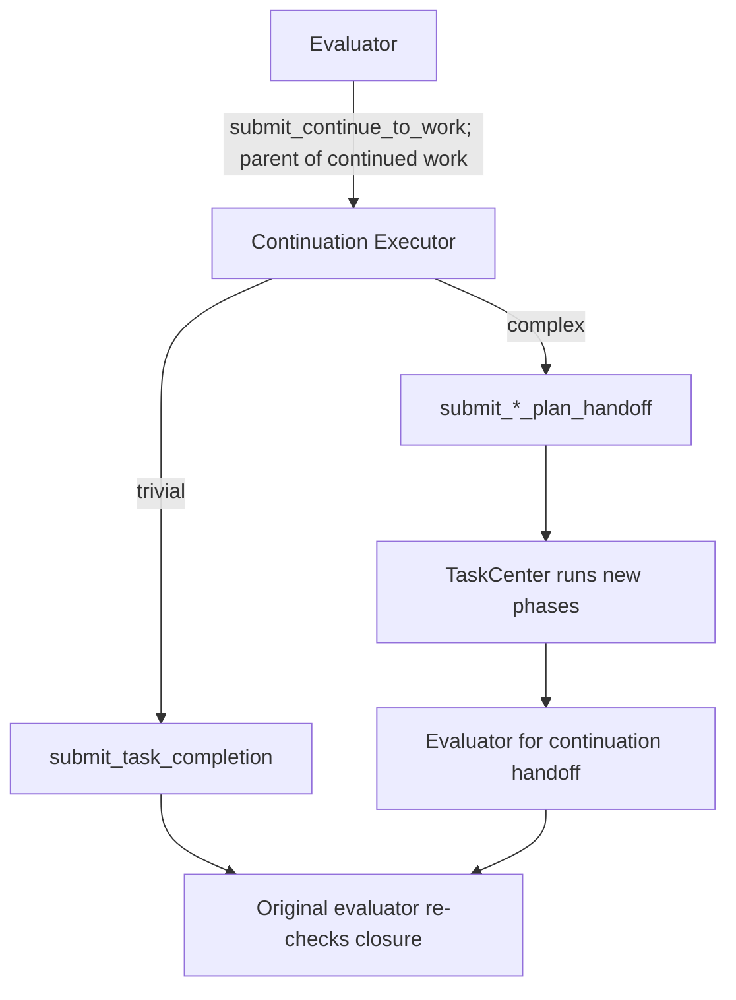

# Phased Executor-Evaluator Tree

**Status:** Draft / brainstorm  
**Last updated:** 2026-04-25

This proposal handles large or complex tasks by combining recursive task
decomposition with a simple phased graph model. It keeps enough ordering power
for real work while avoiding arbitrary agent-authored DAGs.

The current direction is:

- No advisor or evaluator per phase.
- One final evaluator per handoff.
- Agents submit phases, not raw dependencies.
- TaskCenter compiles phases into an internal DAG.
- A task starts when every dependency it declares (explicit `needs`, or the implicit "all of previous phase" default) has passed.
- Recursive child handoffs are opaque to their parent.
- Scouts are intentionally out of scope for the first implementation phase.

## Pattern Name

**Phased Executor-Evaluator Tree**

Each executor owns a task. If the task is trivial, the executor completes it
directly. If the task is complex, the executor submits phased child work. After
the final phase passes, TaskCenter launches one evaluator to decide whether the
parent task is complete or needs more work.



## Roles

### Executor

The executor is the only role that performs or decomposes work.

It can:

- Complete trivial work directly.
- Submit a full phased handoff for complex work it believes covers the full
  acceptance criteria.
- Submit a partial phased handoff for complex work where useful progress can
  be planned, but later work depends on what the phases reveal.
- Recursively hand off from any child task.

### Evaluator

Use **evaluator** instead of **advisor**. Advisor sounds optional or
consultative; evaluator has flow authority. It validates evidence, compares
results against acceptance criteria, and decides whether the parent task can be
claimed complete.

The evaluator:

- Runs once per handoff, after the final phase passes.
- Reads the full acceptance criteria.
- Reads the optional handoff note.
- Reads direct child completion summaries.
- Validates whether the parent task can be claimed complete.
- May run validation work directly.
- May fix trivial issues when it can do so safely.
- Decides what should happen next.
- Submits either `submit_task_completion` or the evaluator-only
  `submit_continue_to_work`.

Detailed behavioral instructions for executors, evaluators, and handoff-note
conventions should live in the corresponding skill prompts. This architecture
document defines the runtime shape and tool contract, not the full agent
playbook text.

## Tool Surface

Executors have three terminal paths.

```python
submit_task_completion(
    summary,
)
```

```python
submit_full_plan_handoff(
    phases,
    task_specs,
    full_acceptance_criteria,
)
```

```python
submit_partial_plan_handoff(
    phases,
    task_specs,
    full_acceptance_criteria,
    handoff_note,
)
```

`handoff_note` is required for partial handoff. Since this version does not
include `partial_acceptance_criteria`, the handoff note must explain what the
phased plan covers, what remains uncertain, and why the partial plan is still
useful.

Evaluators have two terminal paths. `submit_continue_to_work` is a separate
tool available only to evaluators.

```python
submit_task_completion(
    summary,
)
```

```python
submit_continue_to_work(
    summary,
)
```

Both `submit_task_completion` and `submit_continue_to_work` intentionally take
only `summary`. Validation notes, evidence references, gap analysis, and next
steps should be written into the summary text according to the role skill.

## Task Object Model

Model every task as a diamond shell:

```python
task_diamond(
    executor,
    children=None,
    evaluator=None,
)
```

The rationale is that a single node is also a diamond. A trivial task is simply
a diamond with no `children` and no `evaluator`: the executor runs and calls
`submit_task_completion(summary)`.

Children are injected only when the executor submits
`submit_full_plan_handoff(...)` or `submit_partial_plan_handoff(...)`.
TaskCenter validates the handoff, compiles the submitted phases into child
dependencies, and stores the result in `children`.

The evaluator is injected only after `children` exists and every child in the
final phase has passed. Until then, the diamond is not ready for closure
evaluation.



This keeps task creation uniform:

1. Create every task as a `task_diamond` shell.
2. Add `children` only through executor handoff.
3. Add `evaluator` only when those children have passed.
4. Close the diamond through either executor direct completion or evaluator
   completion after expansion.

## Phase Model

Agents submit ordered phases. A phase is a list of task entries. Each entry is
an object with an `id` and an optional `needs` list. Task details live in
`task_specs`.

```python
task_specs = {
    "explore_runtime": {
        "title": "Explore runtime coordination",
        "spec": "Map how the current task graph and submission flow work.",
    },
    "inspect_tools": {
        "title": "Inspect terminal tools",
        "spec": "Find the current submission tool contracts and constraints.",
    },
    "draft_design": {
        "title": "Draft phased evaluator design",
        "spec": "Use prior findings to produce the final proposed workflow.",
    },
}

phases = [
    [
        {"id": "A"},
        {"id": "B"},
        {"id": "C"},
    ],
    [
        {"id": "D", "needs": ["A"]},
        {"id": "E", "needs": ["B"]},
    ],
    [{"id": "F"}],   # implicit: needs all of phase 2
]
```

A task entry's `needs` list contains task IDs from **any strictly earlier
phase**, not only the immediately preceding one. If `needs` is omitted, the
entry implicitly depends on every task in the immediately preceding phase.
This preserves the simple default ("the next phase waits for the previous
phase") while allowing fine-grained pipelining when an agent can express it.

Skip-back edges (for example, a phase-3 task depending directly on a phase-1
task) are allowed. The phase number is a parallelism hint, not a chain index;
forcing every edge to land on the immediately previous phase would push agents
to invent fake intermediate dependencies, which makes the graph less honest.

Entries must always be objects of the form `{"id": ...}` or
`{"id": ..., "needs": [...]}`. Bare strings are rejected. `needs` must contain
distinct task IDs and may not include the entry's own `id`.

Compile rules:

1. Phase 1 tasks run in parallel when the handoff is accepted. Entries in
   phase 1 must not declare `needs`.
2. For phase `N >= 2`:
   - If an entry omits `needs`, it depends on every task in phase `N - 1`.
   - If an entry declares `needs`, every referenced ID must exist in some
     phase `M < N`. Forward and same-phase references are rejected.
3. Tasks inside the same phase must be independent of each other. `needs` may
   not point at siblings in the same phase.
4. The evaluator depends on every task in the final phase.
5. Agents cannot author `needs` edges that cross siblings or skip forward.
   Edges always point backward across phase boundaries.
6. TaskCenter compiles `phases` and `needs` into the internal dependency graph
   and runs cycle and dangling-reference checks before accepting the handoff.
7. A task launches as soon as every ID in its (explicit or implicit) `needs`
   list has passed. It does not wait for unrelated tasks in earlier phases.

Here, **passes** means the dependency tasks reached successful task
completion. A failed, cancelled, continued, expanded, or still-running task
does not release tasks that depend on it.

Phase boundaries remain meaningful even with `needs`. They define the default
dependency (omitted `needs` means "previous phase") and the evaluator's release
condition (every task in the final phase passed). They are no longer global
barriers: a phase-`N` task with a narrow `needs` list can start while other
phase-`N - 1` tasks are still running, as long as its own dependencies have
passed.



## No Evaluator Per Phase

The default is one final evaluator per handoff.

Do not create an evaluator at every phase boundary. Phase boundaries are
usually mechanical sequencing points, not judgment points. Adding mandatory
evaluators per phase increases cost, latency, and reasoning fragmentation.

The evaluator should run after the final phase passes and validate the whole
handoff against the full acceptance criteria.



## Recursive Handoff

Any child executor may call a handoff function. From the parent's perspective,
that child remains a single incomplete node until its own closure path
completes.

The parent evaluator waits on direct child nodes only. It may inspect child
completion summaries and run its own validation, but it should not wire itself
directly to every nested descendant.



Core invariant:

```text
A recursively expanded child is opaque to its parent.
The parent waits for the child node to close.
The child node closes only through direct completion or its own evaluator.
```

## Evaluator Workflow

The evaluator is the closure gate for the handoff. It is not limited to passive
review: it can validate, fix trivial issues, and decide the next step.

It runs after all final-phase children have passed.



Evaluator decisions:

| Condition | Evaluator action | Runtime result |
|---|---|---|
| Criteria satisfied | `submit_task_completion` | Parent executor node becomes `done`; completion bubbles upward. |
| Criteria not satisfied | `submit_continue_to_work` | TaskCenter expands the evaluator as the parent of continuation work. |
| Evidence insufficient | `submit_continue_to_work` | Continuation work gathers or produces missing evidence. |
| Trivial issue found | Fix directly, then submit one terminal evaluator action | The evaluator avoids unnecessary continuation when the fix is safe and local. |

## Full Handoff Workflow

Use `submit_full_plan_handoff` when the executor believes the phases cover the
complete task.



Full handoff evaluator logic:

```text
validate child outputs against full_acceptance_criteria
if satisfied:
    submit_task_completion(summary)
else:
    submit_continue_to_work(summary)
```

## Partial Handoff Workflow

Use `submit_partial_plan_handoff` when the executor can plan useful work now,
but cannot honestly claim that the phases cover the full acceptance criteria.



Partial handoff evaluator logic:

```text
read handoff_note
validate child outputs against full_acceptance_criteria
if full criteria are satisfied:
    submit_task_completion(summary)
else:
    submit_continue_to_work(summary)
```

The handoff note content should be described in the relevant skill. At minimum,
the skill should make the note cover:

- What this phased plan is expected to cover.
- What remains unknown.
- Which parts of the full acceptance criteria may remain unsatisfied.
- What evidence the evaluator should inspect before deciding.
- Suggested continuation direction if the expected gap remains.

## Continuation Workflow

Continuation is evaluator-driven through the evaluator-only
`submit_continue_to_work(summary)` tool. If the evaluator finds a gap, TaskCenter
expands the evaluator node and makes the evaluator the parent of the continued
work. The original executor remains waiting on evaluator closure.



Continuation work is structurally under the evaluator, not under the original
executor. This makes the evaluator responsible for the next step it requested
while preserving the original executor as the task owner being closed.

## TaskCenter Responsibilities

TaskCenter owns graph correctness.

It should:

- Validate that every phase entry is an object with an `id` field; reject
  bare strings.
- Validate that every phase entry's `id` is a key in `task_specs`.
- Reject duplicate task IDs across phases.
- Reject empty phases.
- Reject empty task specs.
- Reject raw agent-authored dependencies inside task specs (only `needs` on
  phase entries is allowed).
- Reject `needs` entries on phase 1.
- Reject `needs` references that point to the same phase or a later phase.
  References to any strictly earlier phase are allowed.
- Reject `needs` references to unknown task IDs.
- Reject `needs` lists that contain duplicates or the entry's own `id`.
- Reject cycles or dangling references in the compiled dependency graph.
- Compile phases and `needs` into internal dependency edges, applying the
  implicit "all of previous phase" default when `needs` is omitted.
- Insert exactly one final evaluator per handoff.
- Launch each task as soon as its dependencies have passed. Tasks within a
  phase do not wait on unrelated siblings of earlier phases.
- Launch the evaluator only after every final-phase task has passed.
- Treat recursively expanded children as incomplete until their own closure
  path completes.
- Expand evaluator nodes when they submit `submit_continue_to_work(summary)`,
  making the evaluator the parent of continued work.

## Recommended Invariants

1. Every complex handoff has exactly one final evaluator.
2. There is no evaluator per phase by default.
3. Tasks inside a phase are independent of each other; `needs` cannot point
   at same-phase siblings.
4. A task starts only after every ID in its `needs` list has passed. When
   `needs` is omitted, the default is every task in the previous phase.
5. `needs` references must point to strictly earlier phases. Forward edges,
   same-phase edges, and skip-forward edges are rejected at compile time.
6. `full_acceptance_criteria` is immutable for the handoff.
7. `submit_partial_plan_handoff` requires `handoff_note`.
8. Agents submit `phases` (with optional `needs`) and `task_specs`. They
   cannot author dependency edges anywhere except as `needs` on a phase entry.
9. A recursively expanded child is opaque to its parent.
10. Parent completion bubbles from the final successful closure path.
11. `submit_continue_to_work(summary)` is evaluator-only.
12. Evaluator continuation expands the evaluator node; the evaluator becomes
    the parent of continued work.
13. Runtime policy may enforce limits later, but this design does not define a
    default budget.

## Comparison With Current EphemeralOS

| Dimension | Current team runtime | Phased executor-evaluator tree |
|---|---|---|
| Planning | Planner emits a DAG up front; replanner repairs failures. | Any executor can recursively submit phased child work. |
| Recovery | Failure spawns replanner and rewires dependents. | Evaluator expands into continued work when criteria are not met. |
| Graph authoring | Planner/replanner can express richer DAG dependencies. | Agents express phases; TaskCenter compiles simple dependencies. |
| Validation | Validator/replanner behavior depends on configured lanes and failure path. | A final evaluator is automatic for every complex handoff. |
| Complexity control | More expressive, but more topology risk. | Less expressive, but easier to reason about and debug. |

This pattern is less expressive than arbitrary DAG planning, but the restriction
is intentional. It optimizes for recursive exploration, local closure, and
runtime predictability.

## Open Questions

- What internal status should represent an evaluator that has expanded into
  continued work?
- How should TaskCenter roll up completion when continued work under an
  evaluator succeeds?
- How should the skill define handoff-note structure for partial handoffs?
