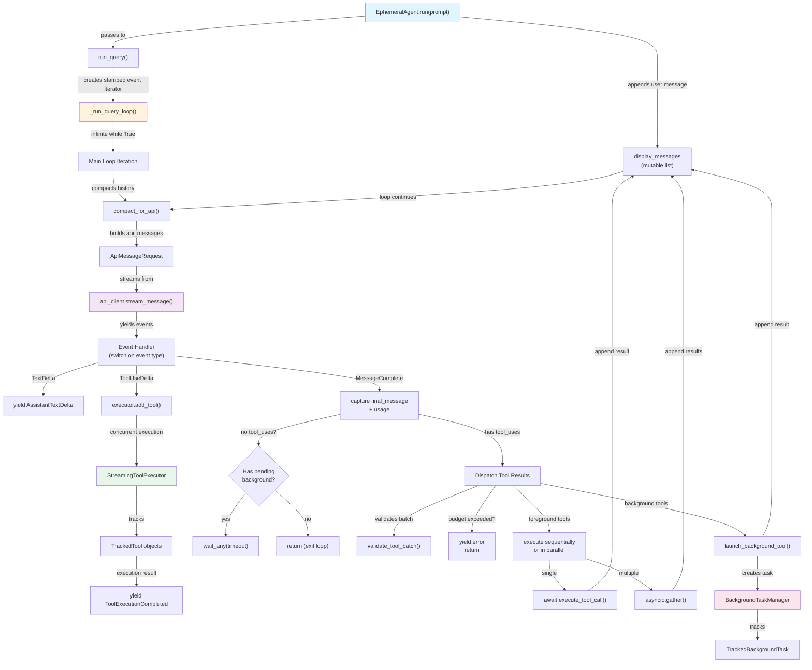
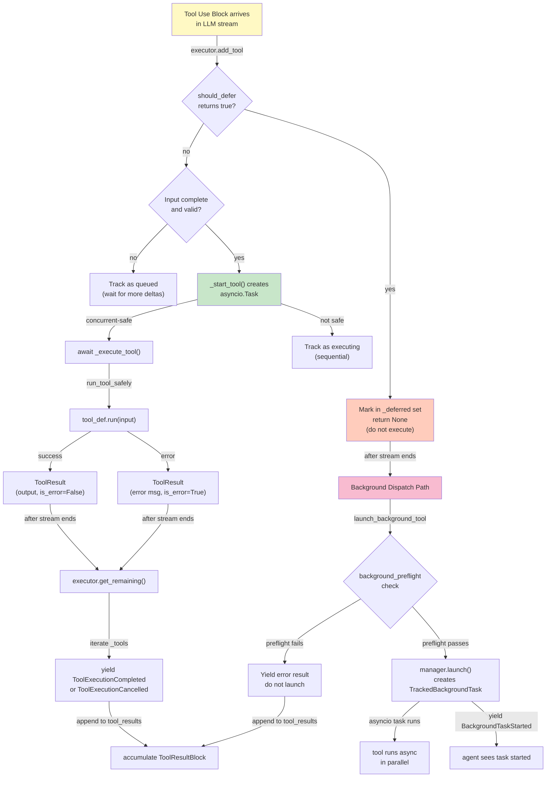
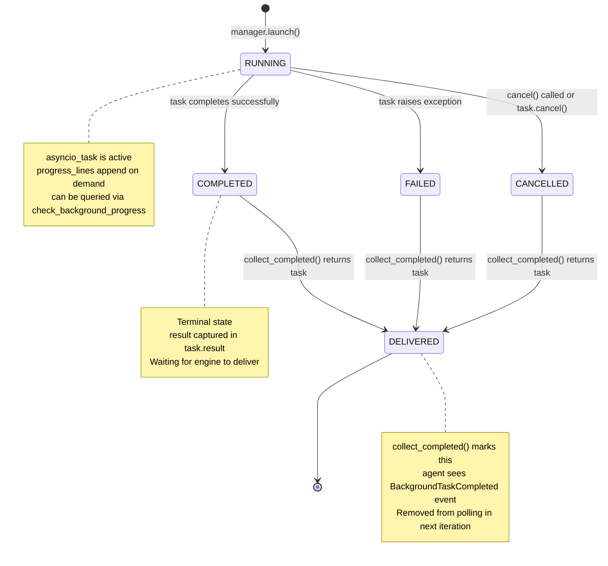
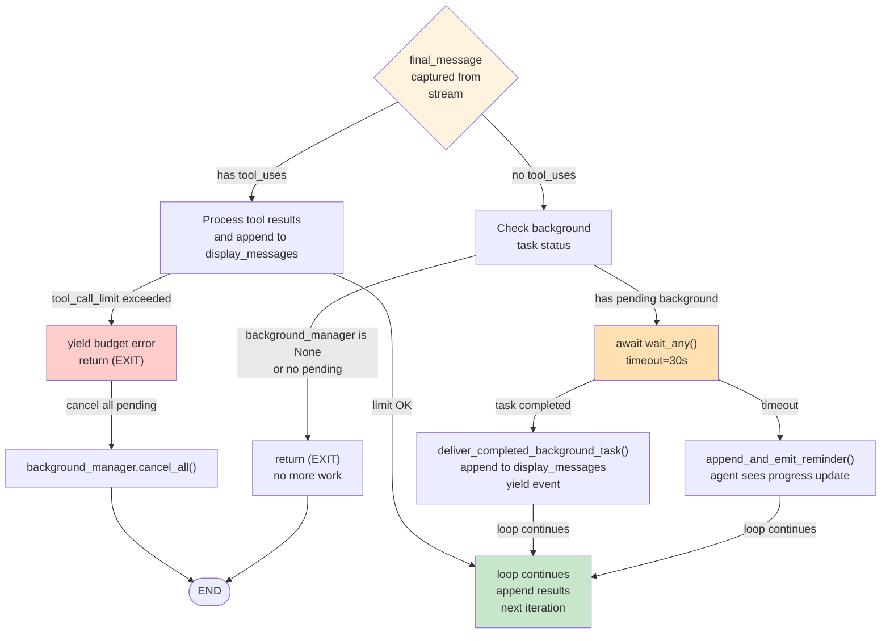
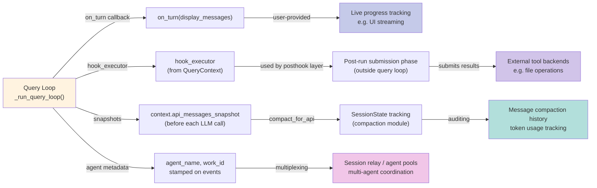
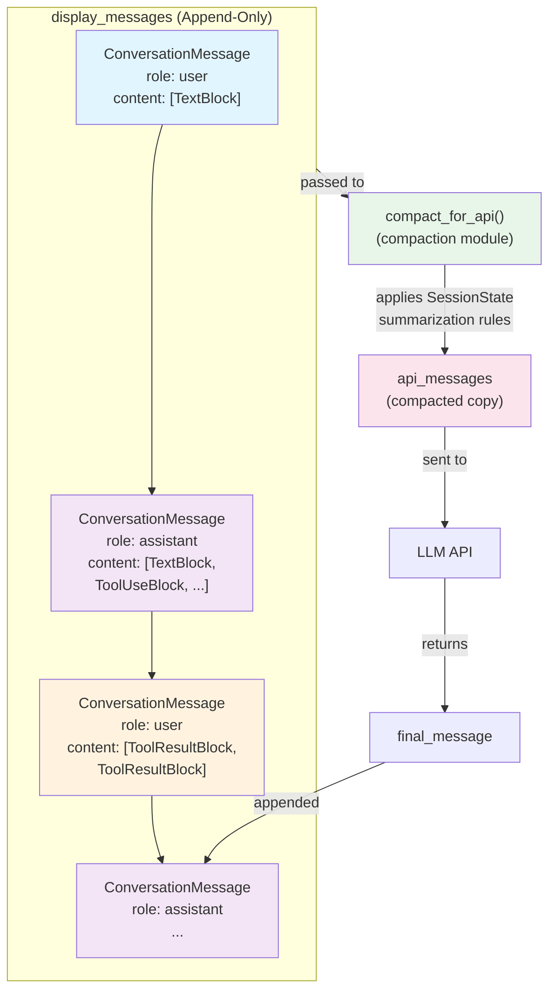
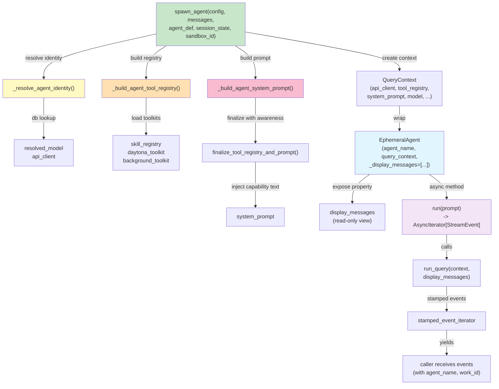

# Query Engine

The core loop that streams LLM responses, executes tools mid-stream, manages background tasks, and compacts conversation history for API submissions.

## Overall Architecture

The query engine consists of three layers: the `EphemeralAgent` runtime wrapper, the `QueryContext` configuration container, and the `_run_query_loop` state machine that drives message cycles. Each cycle streams from the LLM, executes tools (either immediately or deferred to background), collects results, and feeds them back into the next turn until the agent has no more tool calls.



## Message and Tool Result Flow

Each turn produces a sequence of `StreamEvent` objects flowing from the LLM stream through execution, collection, and finally into `display_messages` for the next cycle. Tools yield intermediate progress, completion, or cancellation events that structure the conversation state.

```mermaid
sequenceDiagram
    participant Loop as Query Loop
    participant LLM as API Stream
    participant Executor as StreamingToolExecutor
    participant ToolExec as Tool Execution
    participant Msg as display_messages
    
    Loop->>LLM: stream_message(ApiMessageRequest)
    LLM-->>Loop: ApiTextDeltaEvent / ApiThinkingDeltaEvent
    Loop->>Executor: add_tool(ApiToolUseDeltaEvent)
    Executor->>ToolExec: _start_tool() [async]
    ToolExec-->>Loop: ToolExecutionProgress (optional)
    Loop->>Executor: get_progress()
    Executor-->>Loop: [ToolExecutionProgress, ...]
    
    LLM-->>Loop: ApiMessageCompleteEvent
    Loop->>Loop: await executor.get_remaining()
    Executor-->>Loop: [ToolExecutionCompleted | ToolExecutionCancelled, ...]
    
    Loop->>Msg: append ConversationMessage(role=assistant)
    Loop->>Msg: append ConversationMessage(role=user, content=[ToolResultBlock, ...])
    
    activate Msg
    Msg->>Msg: grows with tool results
    deactivate Msg
    
    Loop->>LLM: compact_for_api(display_messages)
    LLM-->>Loop: [api_messages...]
    Note over Loop: Next iteration uses compacted history
```

## Tool Execution Dispatch

When the LLM sends tool calls, the loop must decide: execute immediately in the foreground, defer to background, or reject due to batch validation or budget. The `StreamingToolExecutor` handles mid-stream tool starts; deferred tools bypass it and go through the background path.



## Background Task Lifecycle

Background tools launch async tasks tracked by `BackgroundTaskManager`. Tasks can run concurrently with the next LLM turn. The loop polls via `collect_completed()` at the start of each iteration to deliver finished tasks back to the agent.



## Loop Termination and Exit Conditions

The query loop exits when: (1) the LLM sends no tool calls and no background tasks are pending, (2) the tool call budget is exhausted, or (3) a fatal error occurs. Background tasks waiting to complete can extend the loop past a no-tool turn.



## Integration Points: Hooks, External Triggers, and Snapshots

The query loop integrates with external systems via `QueryContext` fields: `hook_executor` for post-run submissions, `on_turn` callbacks for live progress, and `api_messages_snapshot` for compaction state inspection.



## Conversation State and Streaming

The `display_messages` list is the source of truth for conversation history. Each `ConversationMessage` contains a role (assistant or user) and content blocks: text, tool uses (from LLM), or tool results (execution feedback). Streaming compaction happens before each API call to manage token budgets.



## Agent Runtime Wrapper

The `EphemeralAgent` is spawned per request by `spawn_agent()`, wrapping the query loop with agent-specific config: model, toolkits, system prompt, and budget. It owns the mutable `display_messages` list and exposes a read-only `display_messages` property to callers.


