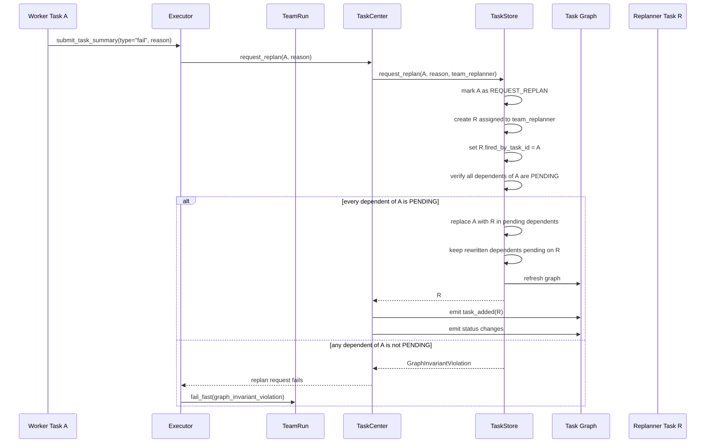
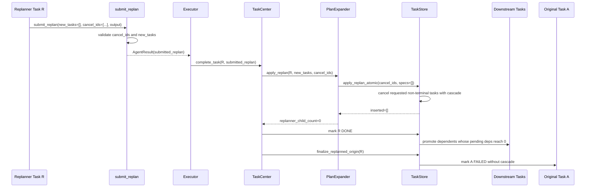
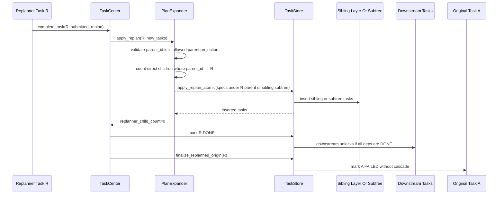
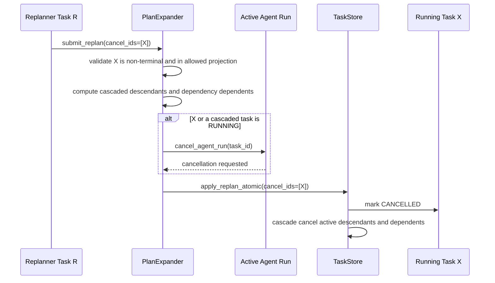
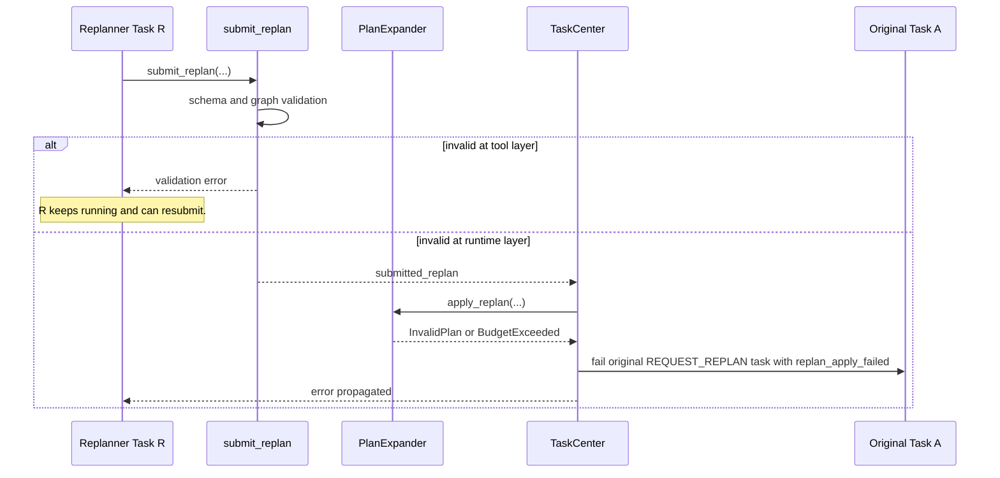
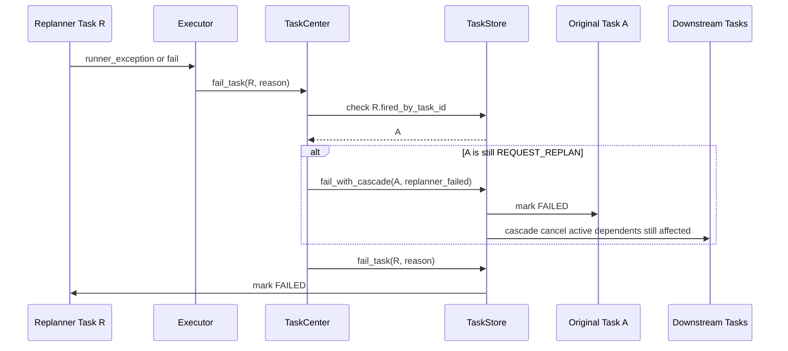

# Replan Workflow Sequence Diagrams

This document shows the task replanning lifecycle for the main runtime scenarios.
The current `submit_replan` payload is:

- `new_tasks`
- `cancel_ids`
- `output`

`team_replanner` is a normal expandable task. When original task `A` fails, `A`
moves to `REQUEST_REPLAN`, replanner task `R` is created, and pending task
graph nodes that depended on `A` are rewired to depend on `R`. Any dependent
of `A` with a non-pending status is a graph invariant violation.

The scheduler invariant is strict: a task can be `READY` or `RUNNING` only when
all dependencies are `DONE`.

## Detached children and promotion

An `EXPANDED` parent's children fall into two sets:

- **Detached**: `FAILED`, `CANCELLED`. Ignored for promotion — treated as
  resolved but not successful.
- **Non-detached / live**: `PENDING`, `READY`, `RUNNING`, `EXPANDED`,
  `REQUEST_REPLAN`, `DONE`.

Promotion rule: the parent transitions out of `EXPANDED` when every
non-detached child is `DONE`.

- If at least one child is `DONE`: parent → `DONE`.
- If every child is detached (no `DONE`): parent → `FAILED` with reason
  `all_children_detached`, and itself enters the detached set of *its* parent
  — propagates up naturally.

This means cancel-cascades and replanner budget failures no longer wedge
ancestor chains: detached children simply fall out of the counting set.

Promotion fires on `DONE`, `FAILED`, and `CANCELLED` child transitions, plus
a sweep after `apply_replan` to catch bulk cascade cancels.

## 1. Failure Creates A Replanner



The executor routes failure through `TaskCenter.request_replan` because the
executor only interprets the agent's terminal submission. TaskCenter owns the
task lifecycle boundary: replan budget checks, replanner selection, event
emission, and the atomic TaskStore mutation that creates `R` and rewires
pending dependents. A graph invariant violation is fatal; the executor fails
the team run immediately.

### 1a. Replan Budget Exhausted

`TaskCenter.request_replan` calls `require_replan_capacity()` before creating
`R`. If the budget is exhausted, `BudgetExceeded` propagates to the executor,
which **fails `A`** with reason `replan_budget_exhausted: {exc}`. `A` moves
into the detached set of its parent, so promotion proceeds naturally: the
parent either promotes past `A` on its other children's DONE, or itself goes
FAILED if `A` was the last non-detached child. The team run is not terminated
— failure propagates through the detach/promotion chain instead.

## 2. Replanner Submits No Direct Children



## 3. Replanner Creates Direct Children

```mermaid
sequenceDiagram
    participant R as Replanner Task R
    participant TC as TaskCenter
    participant PE as PlanExpander
    participant TS as TaskStore
    participant C as Children Of R
    participant D as Downstream Tasks
    participant A as Original Task A

    R->>TC: complete_task(R, submitted_replan with child tasks)
    TC->>PE: apply_replan(R, new_tasks)
    PE->>TS: apply_replan_atomic(specs include parent_id=R)

    TS->>TS: insert child tasks under R
    TS-->>PE: inserted children
    PE-->>TC: replanner_child_count > 0

    TC->>TS: mark R EXPANDED
    Note over D,A: D still waits on R. A stays REQUEST_REPLAN.

    C->>TC: child completes DONE
    TC->>TS: mark child DONE
    TS->>TS: maybe_promote_expanded_parent(child)

    alt every non-detached child of R is DONE (≥1 DONE)
        TS->>R: mark R DONE
        TS->>D: promote downstream dependents
        TC->>TS: finalize_replanned_origin(R)
        TS->>A: mark A FAILED without cascade
    else every child is detached (0 DONE, all FAILED/CANCELLED)
        TS->>R: mark R FAILED (all_children_detached)
        Note over D,A: R joins parent's detached set; propagates up.
    else some child still live
        TS->>R: keep R EXPANDED
    end
```

With the detached-set promotion rule, `CANCELLED` and `FAILED` children do
*not* wedge `R` — they are detached and ignored. `R` goes DONE when every
non-detached child is DONE, or FAILED if all children are detached. A failed
direct child still does not trigger a cascading replan (`fail_task` only
cascades cancels to its descendants and doesn't call `request_replan`), but
the failure propagates upward via the detach/promotion chain rather than
wedging state. Recovery at a higher level still requires an ancestor
replanner.

## 4. Replanner Adds Sibling Or Subtree Tasks Only



Sibling-layer or sibling-subtree additions do not make `R` `EXPANDED`. Only
direct children of `R` do.

### Allowed parent projection

A replanner may specify `parent_id` in `new_tasks` only within the following
projection (validated by both the `submit_replan` tool and `PlanExpander`):

- `R` itself (creates direct children — triggers EXPANDED; see §3).
- `R.parent` (`target_parent_id` — the parent of the original failed task
  `A`). Produces siblings of `A`/`R`.
- Any non-terminal descendant of `target_parent_id` (allows inserting into an
  existing sibling subtree).

Parents outside this projection — arbitrary ancestors above `R.parent`, other
branches of the tree, or terminal tasks — are rejected. This bounds the blast
radius of a single replan to the subtree rooted at `R.parent`.

## 5. Replanner Cancels A Running Task



Active runner cancellation is requested before the task is marked cancelled in
storage.

## 6. Invalid Replan Submission



Tool-layer validation is recoverable inside the replanner turn. Runtime apply
failure fails the original request_replan task so it cannot remain stuck.

Note that on the runtime-layer branch, `R` itself is **not** marked FAILED —
only `A` is failed via `fail_with_cascade` with reason
`replan_apply_failed: {exc}`. `R` keeps its current state (RUNNING or
EXPANDED) and the exception propagates back to the agent, which may resubmit.
The executor is responsible for terminating `R` if the error is unrecoverable.

### Idempotency

`apply_replan_atomic` is **not** idempotent:

- `cancel_ids` filters by non-terminal status, so re-cancelling an already
  CANCELLED task is a no-op.
- New task inserts use `add_all` without upsert, so retrying with the same
  task IDs raises a database integrity error.

Callers must ensure at-most-once delivery of `apply_replan` from executor to
TaskCenter. A crash between `apply_replan_atomic` commit and the executor's
acknowledgement cannot be safely retried with the same spec set.

## 7. Replanner Fails



A successful replanner finalizes `A` without cascade. A failed replanner fails
the recovery path.
