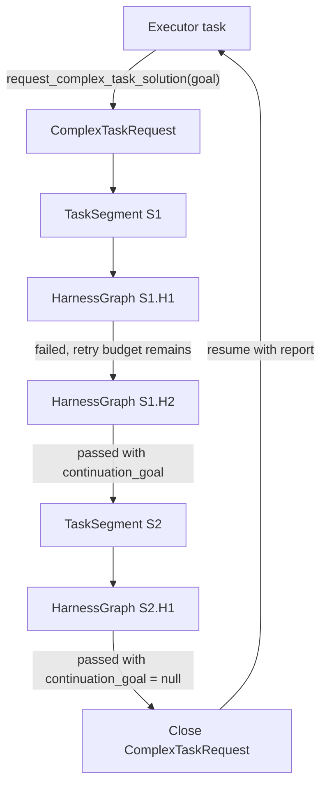
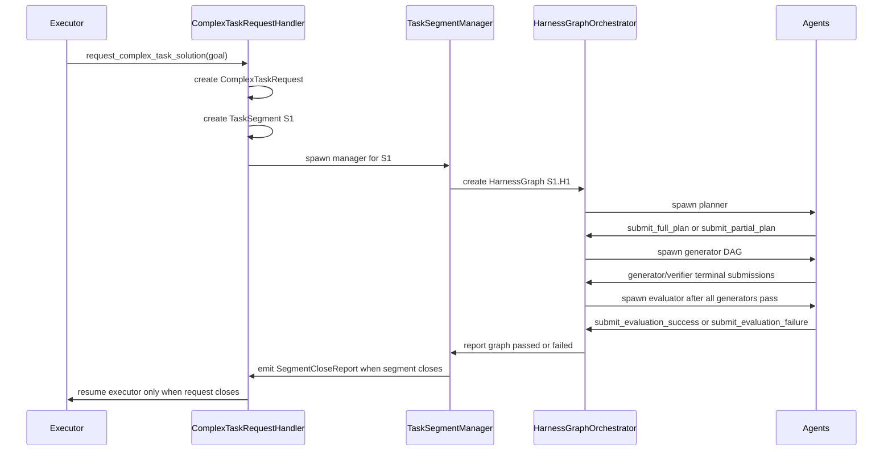
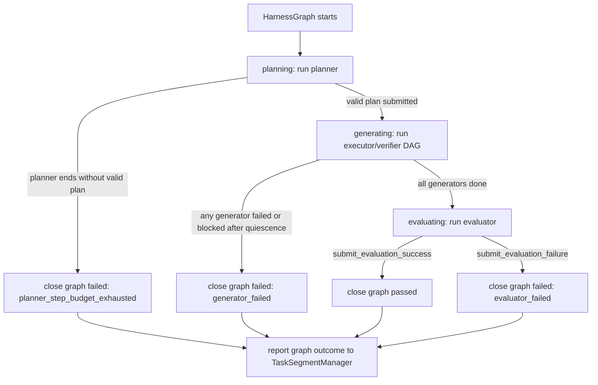
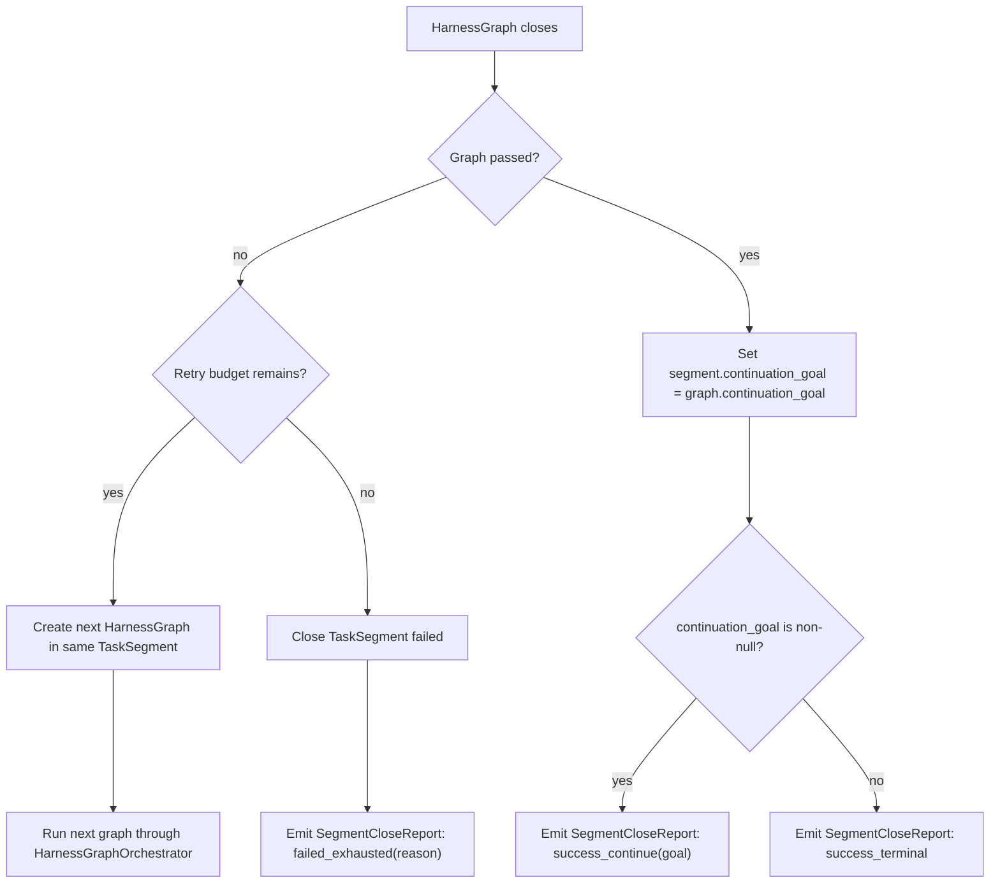
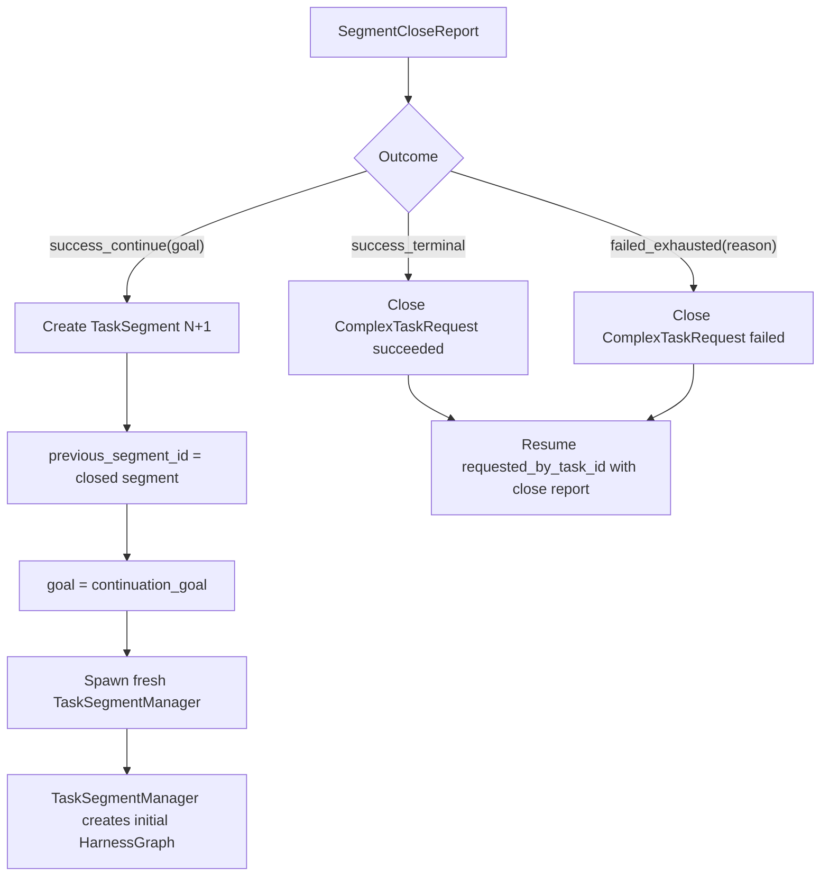
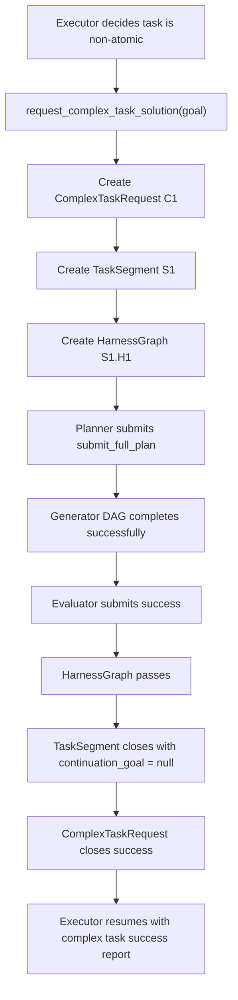
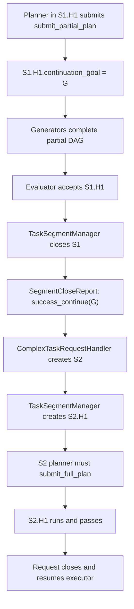
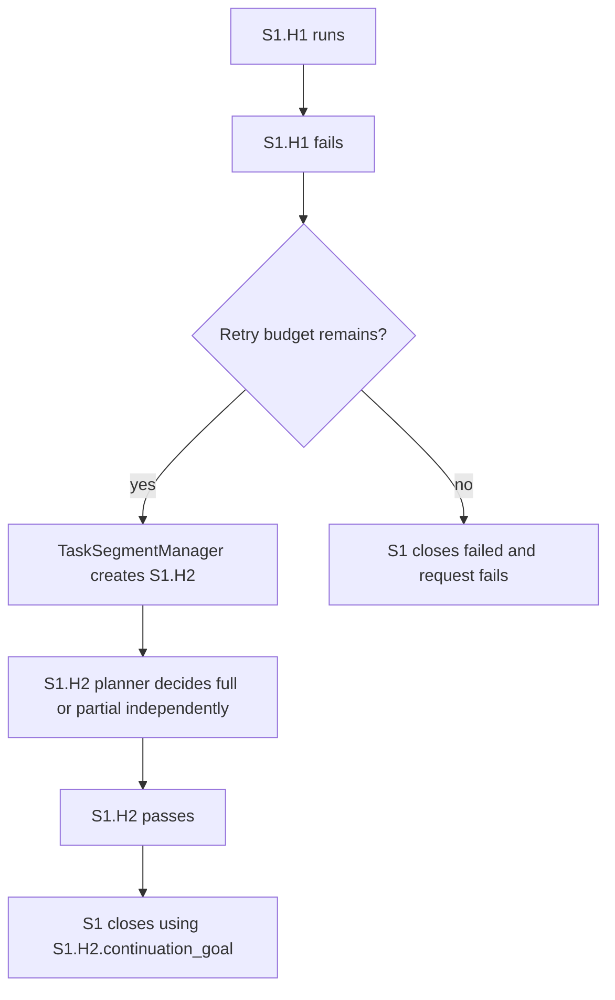
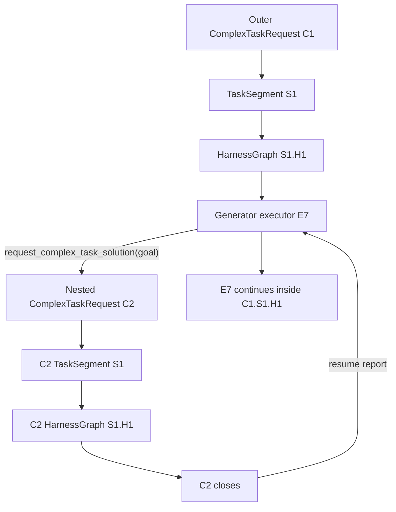

# Complex Task Segmentation and Harness Graph Workflow

This document summarizes how a complex executor task is segmented, routed
through the harness graph runtime, and returned to the requesting executor.

The migration separates three concepts that were previously overloaded:

- `ComplexTaskRequest`: the delegated complex goal requested by an executor.
- `TaskSegment`: one vertical continuation slice of that complex goal.
- `HarnessGraph`: one concrete planner-produced graph execution inside one
  segment.

## Mental model

Complex task progression has three axes:

| Axis | Entity | Trigger | Meaning |
| ---- | ------ | ------- | ------- |
| Request origin | `ComplexTaskRequest` | Executor calls `request_complex_task_solution(goal)` | A new delegated complex goal starts, and the requesting executor pauses. |
| Vertical continuation | `TaskSegment` | Prior segment passes with non-null `continuation_goal` | The same complex request moves to its next sequential slice. |
| Horizontal retry | `HarnessGraph` | A graph fails and segment retry budget remains | The same segment receives a fresh planner-produced graph. |

The key rule is:

- A new `TaskSegment` means accepted vertical continuation.
- A new `HarnessGraph` inside the same segment means retry after failure.
- The paused executor resumes only when the whole `ComplexTaskRequest` closes.

## Layer responsibilities

| Layer | Owns | Does not own |
| ----- | ---- | ------------ |
| `ComplexTaskRequestHandler` | Request creation and close, executor pause/resume, initial segment creation, continuation segment creation, final close report to `requested_by_task_id`. | Per-segment retry policy or graph execution. |
| `TaskSegmentManager` | One segment's retry budget, next harness graph creation after failed graphs, segment close, `SegmentCloseReport`. | Request creation, continuation segment creation, or planner/generator/evaluator execution. |
| `HarnessGraphOrchestrator` | One `planner -> generator DAG -> evaluator` execution and graph pass/fail outcome. | Retry, continuation, or request close. |
| Agent roles | Planner, generator executor, verifier, and evaluator terminal submissions inside a graph. | Structural lifecycle decisions. |
| Context engine | Role-specific launch context, durable summaries, and detailed close-report payloads. | Lifecycle policy or source-of-truth state transitions. |

## End-to-end flow

## Harness graph lifecycle

`HarnessGraphOrchestrator` owns exactly one graph run. It does not inspect
retry budget and does not create sibling graphs.

Generator failure waits for quiescence: failed generators block dependents,
independent siblings may finish, and the graph closes only after all generator
nodes are terminal.

## Segment decision flow

`TaskSegmentManager` reacts to the closed graph. It is the only layer that can
spend segment retry budget.

A passed graph always closes its segment. There is no retry after a passing
graph; graph quality is enforced by the evaluator.

## Request decision flow

`ComplexTaskRequestHandler` reacts only to `SegmentCloseReport`.

Continuation does not return to the requesting executor. It keeps the same
complex request open and creates another segment. The requesting executor sees
one final report for the whole complex request.

## Happy path

## Partial continuation path

The segment inherits `continuation_goal` only from the passing graph that
closed it. Failed graphs in the same segment do not propagate their
`continuation_goal` to later graphs.

## Retry-then-pass path

Retry history is horizontal inside the segment. The next planner receives the
failure landscape as context, but lifecycle state does not inherit the prior
failed graph's `continuation_goal`.

## Recursive complex task request

Any generator executor can request its own complex task before it edits. That
creates a new request, not a child segment in the outer request.

Only the executor that requested the nested complex task pauses. The nested
request has its own segment chain and retry history.

## Tool and role boundaries

| Role | Scope | Main terminals |
| ---- | ----- | -------------- |
| Planner | One `HarnessGraph` | `submit_full_plan`, `submit_partial_plan` |
| Generator executor | One graph DAG node | `submit_execution_success`, `submit_execution_failure`, `request_complex_task_solution` |
| Generator verifier | One graph DAG node | `submit_verification_success`, `submit_verification_failure` |
| Evaluator | Sink for one graph | `submit_evaluation_success`, `submit_evaluation_failure` |

Important gates:

- `submit_partial_plan` is blocked if the current request already has a prior
  segment with non-null `continuation_goal`.
- malformed planner DAG submissions fail inline without marking the graph
  failed.
- `request_complex_task_solution` is blocked after the executor has edited.
- evaluator spawn is blocked until every generator in the current graph is
  `DONE`.
- next graph creation is blocked once the segment retry budget is exhausted.

## Context engine boundary

The context engine composes structured context packets and summaries for each
role, but lifecycle decisions read structural state:

- planner context includes request goal, segment goal, prior segment summaries,
  and retry failure landscape when applicable;
- generator context includes the planned task spec and dependency summaries;
- evaluator context includes the graph task specification, evaluation criteria,
  and completed generator/verifier summaries;
- request resume context includes the final complex task summary and close
  report for `requested_by_task_id`.

Generated summaries are evidence. They do not decide whether to retry, create
the next segment, or close the request.
