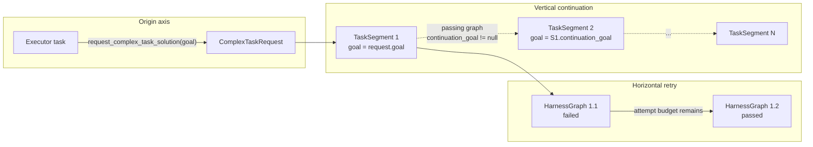
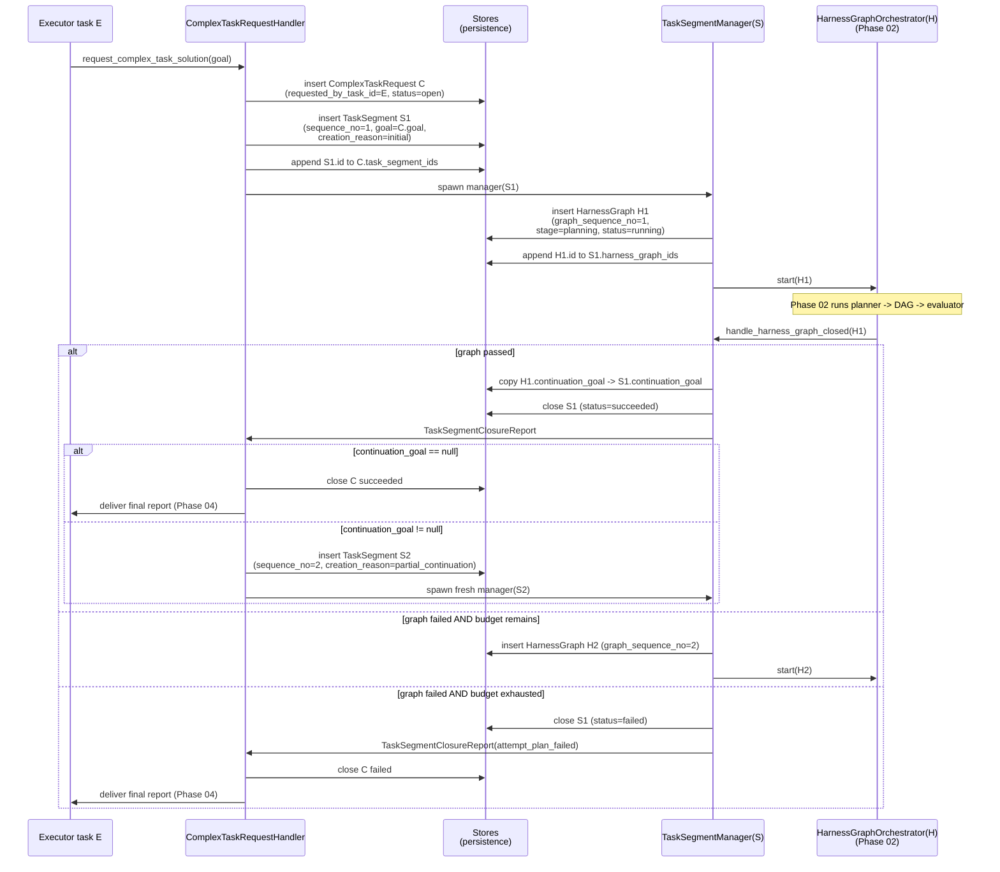
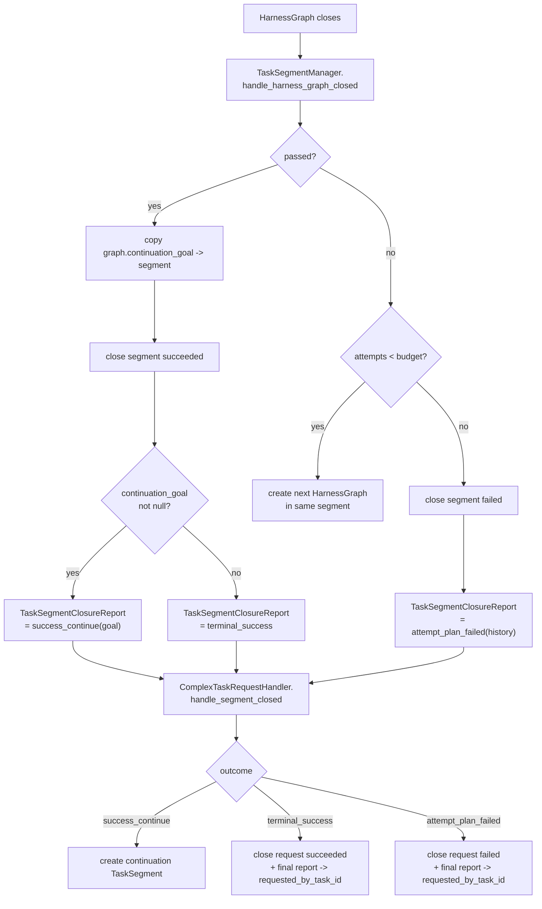

# Phase 01 - Implementation Plan

Companion to [`phase-01-graph-and-attempt-model.md`](./phase-01-graph-and-attempt-model.md).
This document is the actionable build plan: folder layout, files, classes,
function signatures, migration steps, test plan, and build waves.

It does not redefine the durable model; it implements it.

---

## 1. Scope

Phase 01 ships durable state and skeletal lifecycle services. It does **not**
change execution behavior — Phase 02 wires the orchestrator to the new model.

Deliverables:

1. New persistence records: `ComplexTaskRequestRecord`, `TaskSegmentRecord`,
   `HarnessGraphRecord` (replacing the legacy `TaskCenterHarnessGraphRecord`).
2. Three new stores returning **frozen dataclass DTOs** (not raw rows, not
   plain dicts) — an evolution of `model_store.py`'s "always serialize" stance.
3. Domain DTOs and enums under `task_center/domain/`.
4. Skeletal lifecycle services nested by entity:
   `task_center/complex_task_request/segment/harness_graph/`.
5. `TaskSegmentClosureReport` contract from `TaskSegmentManager` to
   `ComplexTaskRequestHandler`.
6. Schema migration via `db/engine.py` auto-migrate hooks.
7. Tests covering Phase 01 exit criteria.

Not in scope (deferred to later phases):

- Wiring `HarnessGraphOrchestrator` to actually run planner/generator/evaluator
  (Phase 02).
- Tool-gate enforcement on `submit_full_plan` / `submit_partial_plan` /
  `request_complex_task_solution` (Phase 03).
- Full final-report delivery to `requested_by_task_id` (Phase 04).
- Context-engine summary IDs in `attempted_plan_history` entries (Phase 06).

---

## 2. Coherence verification

Phase 01 spec is coherent with Phase 00 target architecture and the workflow
overview. The cross-document map:

| Concept | Phase 00 | Workflow overview | Phase 01 | Verdict |
| --- | --- | --- | --- | --- |
| Three-axis split (`ComplexTaskRequest` / `TaskSegment` / `HarnessGraph`) | Defined | Restated | Persistence + DTOs created | OK |
| Ownership `Handler -> Manager -> Orchestrator` | Runtime layers | Layer responsibilities | Creators of records | OK |
| `requested_by_task_id` is the parent link | Stated | Stated | Field defined as authoritative parent | OK |
| Ordered `task_segment_ids`, `harness_graph_ids` | Implied | Implied | Made authoritative; `get_attempt_count` derived from list | OK |
| `continuation_goal` from passing graph only | Stated | Stated | Invariant: never inherited from prior failed graphs | OK |
| `TaskSegmentClosureReport` outcomes | Defined | Restated | Identical shape; outcome union with three variants | OK |
| Retry stays inside same segment | Stated | Stated as horizontal axis | Manager invariant | OK |
| Recursive `request_complex_task_solution` is not a child segment | Stated | Diagrammed | Encoded by `requested_by_task_id` only | OK |
| No `ROOT` creation reason | Stated | Implicit | Removed from creation-reason table | OK |
| Per-graph evidence belongs to context engine | Stated | Stated | Phase 01 stores only structural state | OK |
| Phase scope = persistence + typed state | — | — | "Should not change execution until Phase 02" | OK |

Two seams worth being explicit about in this plan:

1. `TaskSegmentClosureReport.attempted_plan_history[].harness_graph_summary_id`
   is produced by the context engine (Phase 06). Phase 01 lays out the field
   but populates it as `None`. The harness layer only stores `harness_graph_id`
   plus the structural state.
2. Phase 01 does not yet wire the
   `HarnessGraphOrchestrator -> TaskSegmentManager -> ComplexTaskRequestHandler`
   callbacks. Phase 01 ships the `handle_*_closed` methods as testable units
   that Phase 02 will call.

---

## 3. Workflow diagrams

### 3a. Three axes of progression



### 3b. Lifecycle handoffs (Phase 01 records the durable state at each arrow)



### 3c. State machines per entity

```text
ComplexTaskRequest:    open ──┬─► succeeded
                              ├─► failed
                              └─► cancelled

TaskSegment:           open ──┬─► succeeded
                              ├─► failed
                              └─► cancelled

HarnessGraph stage:    planning ─► generating ─► evaluating ─► closed
                          │            │
                          └────────────┴──► closed (failed early)

HarnessGraph status:   running ──┬─► passed
                                 └─► failed
                                       (fail_reason ∈ {
                                         planner_failed,
                                         generator_failed,
                                         evaluator_failed
                                       })
```

### 3d. Closure report routing



---

## 4. Folder layout

The runtime is organized along two axes:

- **Stateless plumbing** (DTOs + enums) is hoisted to a flat `domain/` folder.
- **Stateful lifecycle services** (handler / manager / orchestrator) are
  nested by entity ownership so the file tree mirrors Phase 00's diagram.

Persistence stays flat under `db/` because SQLAlchemy's `Base.metadata`
discovery and `db/engine.py` auto-migration expect it there.

```text
backend/src/task_center/
├── __init__.py
├── exceptions.py                         # GraphInvariantViolation
├── domain/                               # frozen DTOs + enums
│   ├── __init__.py
│   ├── complex_task_request.py           # ComplexTaskRequest, ComplexTaskRequestStatus,
│   │                                     #   ComplexTaskCloseReport (small, lives inline)
│   ├── task_segment.py                   # TaskSegment, TaskSegmentStatus,
│   │                                     #   TaskSegmentCreationReason
│   ├── harness_graph.py                  # HarnessGraph, HarnessGraphStage,
│   │                                     #   HarnessGraphStatus, HarnessGraphFailReason
│   └── segment_closure_report.py         # TaskSegmentClosureReport, ClosureOutcome union,
│                                         #   AttemptedPlanEntry
│
├── complex_task_request/                 # owns: request lifecycle
│   ├── __init__.py                       # public surface re-exports
│   ├── handler.py                        # ComplexTaskRequestHandler
│   ├── invariants.py                     # request-level invariants
│   ├── config.py                         # HarnessLifecycleConfig
│   ├── segment_manager_registry.py       # one TaskSegmentManager per open segment
│   │
│   └── segment/                          # owns: segment lifecycle
│       ├── __init__.py
│       ├── manager.py                    # TaskSegmentManager
│       ├── invariants.py                 # segment-level invariants
│       ├── attempt_count.py              # public get_attempt_count helper
│       │
│       └── harness_graph/                # owns: graph lifecycle
│           ├── __init__.py
│           ├── orchestrator.py           # HarnessGraphOrchestrator (skeleton)
│           └── invariants.py             # graph-level invariants
│
└── harness_agents/                       # EXISTING; unchanged in Phase 01
    └── executor/
```

Persistence:

```text
backend/src/db/
├── models/
│   ├── task_center.py                    # EDIT: keep request/run/task records;
│   │                                     #       remove TaskCenterHarnessGraphRecord
│   ├── complex_task_request.py           # NEW
│   ├── task_segment.py                   # NEW
│   └── harness_graph.py                  # NEW (replaces legacy schema)
├── stores/
│   ├── __init__.py                       # EDIT: register new stores
│   ├── task_center_store.py              # EDIT: drop harness-graph methods
│   ├── complex_task_request_store.py     # NEW
│   ├── task_segment_store.py             # NEW
│   └── harness_graph_store.py            # NEW
└── engine.py                             # EDIT: extend _DROPPED_COLUMNS,
                                          #       add legacy table drop hook
```

Tests mirror source:

```text
backend/tests/task_center/
├── domain/
│   ├── test_complex_task_request_dto.py
│   ├── test_task_segment_dto.py
│   ├── test_harness_graph_dto.py
│   └── test_segment_closure_report.py
├── persistence/
│   ├── test_complex_task_request_store.py
│   ├── test_task_segment_store.py
│   └── test_harness_graph_store.py
└── lifecycle/
    ├── test_complex_task_request_handler.py
    ├── test_task_segment_manager.py
    ├── test_attempt_count.py
    └── test_invariants.py
```

---

## 5. Files & functions

### 5a. Persistence — SQLAlchemy records

**`backend/src/db/models/complex_task_request.py`**

```python
class ComplexTaskRequestRecord(Base):
    __tablename__ = "complex_task_requests"

    id: Mapped[str] = mapped_column(String(36), primary_key=True)
    task_center_run_id: Mapped[str] = mapped_column(
        String(36),
        ForeignKey("task_center_runs.id", ondelete="CASCADE"),
        index=True,
    )
    requested_by_task_id: Mapped[str] = mapped_column(String(96), index=True)
    goal: Mapped[str] = mapped_column(Text)
    status: Mapped[str] = mapped_column(String(16))                 # open/succeeded/failed/cancelled
    task_segment_ids: Mapped[list[str]] = mapped_column(JSON, default=list)
    final_outcome: Mapped[dict | None] = mapped_column(JSON, nullable=True)
    created_at: Mapped[datetime] = mapped_column(DateTime(timezone=True),
                                                 default=lambda: datetime.now(UTC))
    updated_at: Mapped[datetime] = mapped_column(DateTime(timezone=True),
                                                 default=lambda: datetime.now(UTC),
                                                 onupdate=lambda: datetime.now(UTC))
    closed_at: Mapped[datetime | None] = mapped_column(DateTime(timezone=True),
                                                       nullable=True)
```

**`backend/src/db/models/task_segment.py`**

```python
class TaskSegmentRecord(Base):
    __tablename__ = "task_segments"

    id: Mapped[str] = mapped_column(String(36), primary_key=True)
    complex_task_request_id: Mapped[str] = mapped_column(
        String(36),
        ForeignKey("complex_task_requests.id", ondelete="CASCADE"),
        index=True,
    )
    sequence_no: Mapped[int] = mapped_column(Integer)
    creation_reason: Mapped[str] = mapped_column(String(32))    # initial / partial_continuation
    goal: Mapped[str] = mapped_column(Text)
    attempt_budget: Mapped[int] = mapped_column(Integer)
    status: Mapped[str] = mapped_column(String(16))
    harness_graph_ids: Mapped[list[str]] = mapped_column(JSON, default=list)
    continuation_goal: Mapped[str | None] = mapped_column(Text, nullable=True)
    created_at: Mapped[datetime] = mapped_column(DateTime(timezone=True),
                                                 default=lambda: datetime.now(UTC))
    updated_at: Mapped[datetime] = mapped_column(DateTime(timezone=True),
                                                 default=lambda: datetime.now(UTC),
                                                 onupdate=lambda: datetime.now(UTC))
    closed_at: Mapped[datetime | None] = mapped_column(DateTime(timezone=True),
                                                       nullable=True)

    __table_args__ = (
        UniqueConstraint("complex_task_request_id", "sequence_no",
                         name="uq_task_segment_request_sequence"),
    )
```

**`backend/src/db/models/harness_graph.py`** (replaces legacy `TaskCenterHarnessGraphRecord`)

```python
class HarnessGraphRecord(Base):
    __tablename__ = "harness_graphs"

    id: Mapped[str] = mapped_column(String(36), primary_key=True)
    task_segment_id: Mapped[str] = mapped_column(
        String(36),
        ForeignKey("task_segments.id", ondelete="CASCADE"),
        index=True,
    )
    graph_sequence_no: Mapped[int] = mapped_column(Integer)
    stage: Mapped[str] = mapped_column(String(16))                  # planning/generating/evaluating/closed
    status: Mapped[str] = mapped_column(String(16))                 # running/passed/failed
    planner_task_id: Mapped[str | None] = mapped_column(String(96), nullable=True)
    task_specification: Mapped[str | None] = mapped_column(Text, nullable=True)
    evaluation_criteria: Mapped[list[str]] = mapped_column(JSON, default=list)
    generator_task_ids: Mapped[list[str]] = mapped_column(JSON, default=list)
    evaluator_task_id: Mapped[str | None] = mapped_column(String(96), nullable=True)
    continuation_goal: Mapped[str | None] = mapped_column(Text, nullable=True)
    fail_reason: Mapped[str | None] = mapped_column(String(48), nullable=True)
    created_at: Mapped[datetime] = mapped_column(DateTime(timezone=True),
                                                 default=lambda: datetime.now(UTC))
    updated_at: Mapped[datetime] = mapped_column(DateTime(timezone=True),
                                                 default=lambda: datetime.now(UTC),
                                                 onupdate=lambda: datetime.now(UTC))
    closed_at: Mapped[datetime | None] = mapped_column(DateTime(timezone=True),
                                                       nullable=True)

    __table_args__ = (
        UniqueConstraint("task_segment_id", "graph_sequence_no",
                         name="uq_harness_graph_segment_sequence"),
    )
```

### 5b. Persistence — stores (return frozen DTOs)

**`backend/src/db/stores/complex_task_request_store.py`** — `ComplexTaskRequestStore(SyncStoreMixin)`

```python
class ComplexTaskRequestStore(SyncStoreMixin):
    """CRUD for ComplexTaskRequest. Returns frozen ComplexTaskRequest DTOs."""

    def insert(self, *,
               task_center_run_id: str,
               requested_by_task_id: str,
               goal: str) -> ComplexTaskRequest: ...

    def get(self, request_id: str) -> ComplexTaskRequest | None: ...

    def append_segment_id(self, request_id: str,
                          segment_id: str) -> ComplexTaskRequest: ...

    def set_status(self, request_id: str, *,
                   status: ComplexTaskRequestStatus,
                   final_outcome: dict | None,
                   closed_at: datetime | None = None) -> ComplexTaskRequest: ...

    def list_for_executor_task(self,
                               requested_by_task_id: str
                               ) -> list[ComplexTaskRequest]: ...

    # Internal: row -> DTO conversion
    def _to_dto(self, record: ComplexTaskRequestRecord) -> ComplexTaskRequest: ...
```

**`backend/src/db/stores/task_segment_store.py`** — `TaskSegmentStore(SyncStoreMixin)`

```python
class TaskSegmentStore(SyncStoreMixin):
    def insert(self, *,
               complex_task_request_id: str,
               sequence_no: int,
               creation_reason: TaskSegmentCreationReason,
               goal: str,
               attempt_budget: int) -> TaskSegment: ...

    def get(self, segment_id: str) -> TaskSegment | None: ...

    def append_graph_id(self, segment_id: str,
                        graph_id: str) -> TaskSegment: ...

    def set_continuation_goal(self, segment_id: str,
                              continuation_goal: str | None) -> TaskSegment: ...

    def set_status(self, segment_id: str, *,
                   status: TaskSegmentStatus,
                   closed_at: datetime | None = None) -> TaskSegment: ...

    def list_for_request(self,
                         complex_task_request_id: str) -> list[TaskSegment]:
        """Ordered by sequence_no ascending."""

    def get_by_sequence(self, *,
                        complex_task_request_id: str,
                        sequence_no: int) -> TaskSegment | None: ...

    def _to_dto(self, record: TaskSegmentRecord) -> TaskSegment: ...
```

**`backend/src/db/stores/harness_graph_store.py`** — `HarnessGraphStore(SyncStoreMixin)`

```python
class HarnessGraphStore(SyncStoreMixin):
    def insert(self, *,
               task_segment_id: str,
               graph_sequence_no: int) -> HarnessGraph: ...

    def get(self, graph_id: str) -> HarnessGraph | None: ...

    def set_planner_task_id(self, graph_id: str,
                            planner_task_id: str) -> HarnessGraph: ...

    def set_plan_contract(self, graph_id: str, *,
                          task_specification: str,
                          evaluation_criteria: list[str],
                          continuation_goal: str | None) -> HarnessGraph: ...

    def set_generator_task_ids(self, graph_id: str,
                               task_ids: list[str]) -> HarnessGraph: ...

    def set_evaluator_task_id(self, graph_id: str,
                              evaluator_task_id: str) -> HarnessGraph: ...

    def set_stage(self, graph_id: str,
                  stage: HarnessGraphStage) -> HarnessGraph: ...

    def close(self, graph_id: str, *,
              status: HarnessGraphStatus,
              fail_reason: HarnessGraphFailReason | None,
              closed_at: datetime | None = None) -> HarnessGraph: ...

    def list_for_segment(self, task_segment_id: str) -> list[HarnessGraph]:
        """Ordered by graph_sequence_no ascending."""

    def get_by_sequence(self, *,
                        task_segment_id: str,
                        graph_sequence_no: int) -> HarnessGraph | None: ...

    def _to_dto(self, record: HarnessGraphRecord) -> HarnessGraph: ...
```

### 5c. Domain DTOs

**`backend/src/task_center/domain/complex_task_request.py`**

```python
class ComplexTaskRequestStatus(StrEnum):
    OPEN       = "open"
    SUCCEEDED  = "succeeded"
    FAILED     = "failed"
    CANCELLED  = "cancelled"


@dataclass(frozen=True, slots=True)
class ComplexTaskRequest:
    id: str
    task_center_run_id: str
    requested_by_task_id: str
    goal: str
    status: ComplexTaskRequestStatus
    task_segment_ids: tuple[str, ...]
    final_outcome: dict | None
    created_at: datetime
    updated_at: datetime
    closed_at: datetime | None

    @property
    def is_open(self) -> bool: ...
    @property
    def latest_segment_id(self) -> str | None: ...
    def with_appended_segment(self, segment_id: str) -> "ComplexTaskRequest": ...


@dataclass(frozen=True, slots=True)
class ComplexTaskCloseReport:
    """Final report attached to requested_by_task_id when the request closes.

    Lives here (not in a separate file) because the shape is small and
    request-local. Phase 04 wires the actual delivery.
    """
    complex_task_request_id: str
    requested_by_task_id: str
    outcome: Literal["success", "failed"]
    final_segment_id: str
    final_harness_graph_id: str
```

**`backend/src/task_center/domain/task_segment.py`**

```python
class TaskSegmentStatus(StrEnum):
    OPEN       = "open"
    SUCCEEDED  = "succeeded"
    FAILED     = "failed"
    CANCELLED  = "cancelled"


class TaskSegmentCreationReason(StrEnum):
    INITIAL               = "initial"
    PARTIAL_CONTINUATION  = "partial_continuation"


@dataclass(frozen=True, slots=True)
class TaskSegment:
    id: str
    complex_task_request_id: str
    sequence_no: int
    creation_reason: TaskSegmentCreationReason
    goal: str
    attempt_budget: int
    status: TaskSegmentStatus
    harness_graph_ids: tuple[str, ...]
    continuation_goal: str | None
    created_at: datetime
    updated_at: datetime
    closed_at: datetime | None

    @property
    def is_open(self) -> bool: ...
    @property
    def attempt_count(self) -> int:
        return len(self.harness_graph_ids)
    @property
    def has_budget_remaining(self) -> bool:
        return self.attempt_count < self.attempt_budget
    @property
    def latest_graph_id(self) -> str | None: ...
```

**`backend/src/task_center/domain/harness_graph.py`**

```python
class HarnessGraphStage(StrEnum):
    PLANNING    = "planning"
    GENERATING  = "generating"
    EVALUATING  = "evaluating"
    CLOSED      = "closed"


class HarnessGraphStatus(StrEnum):
    RUNNING  = "running"
    PASSED   = "passed"
    FAILED   = "failed"


class HarnessGraphFailReason(StrEnum):
    PLANNER_FAILED = "planner_failed"
    GENERATOR_FAILED              = "generator_failed"
    EVALUATOR_FAILED              = "evaluator_failed"


@dataclass(frozen=True, slots=True)
class HarnessGraph:
    id: str
    task_segment_id: str
    graph_sequence_no: int
    stage: HarnessGraphStage
    status: HarnessGraphStatus
    planner_task_id: str | None
    task_specification: str | None
    evaluation_criteria: tuple[str, ...]
    generator_task_ids: tuple[str, ...]
    evaluator_task_id: str | None
    continuation_goal: str | None
    fail_reason: HarnessGraphFailReason | None
    created_at: datetime
    updated_at: datetime
    closed_at: datetime | None

    @property
    def is_closed(self) -> bool: ...
    @property
    def has_partial_continuation(self) -> bool:
        return self.continuation_goal is not None
```

**`backend/src/task_center/domain/segment_closure_report.py`**

```python
@dataclass(frozen=True, slots=True)
class AttemptedPlanEntry:
    harness_graph_id: str
    graph_sequence_no: int
    task_specification: str | None
    evaluation_criteria: tuple[str, ...]
    fail_reason: HarnessGraphFailReason | None
    harness_graph_summary_id: str | None      # Phase 06 fills this
    failure_landscape: dict | None            # Phase 06 fills this


# Discriminated union via Literal "kind" field.
@dataclass(frozen=True, slots=True)
class TerminalSuccess:
    kind: Literal["terminal_success"] = "terminal_success"


@dataclass(frozen=True, slots=True)
class SuccessContinue:
    goal: str
    kind: Literal["success_continue"] = "success_continue"


@dataclass(frozen=True, slots=True)
class AttemptPlanFailed:
    failure_summary: str
    attempted_plan_history: tuple[AttemptedPlanEntry, ...]
    kind: Literal["attempt_plan_failed"] = "attempt_plan_failed"


ClosureOutcome = TerminalSuccess | SuccessContinue | AttemptPlanFailed


@dataclass(frozen=True, slots=True)
class TaskSegmentClosureReport:
    task_segment_id: str
    final_harness_graph_id: str
    outcome: ClosureOutcome
```

### 5d. Lifecycle services

**`backend/src/task_center/exceptions.py`**

```python
class GraphInvariantViolation(Exception):
    """Raised when a harness lifecycle invariant is violated.

    Matches the existing 'GraphInvariantViolation' convention used elsewhere
    in the codebase for hard, non-tolerable harness state breaches.
    """
```

**`backend/src/task_center/complex_task_request/config.py`**

```python
@dataclass(frozen=True, slots=True)
class HarnessLifecycleConfig:
    default_attempt_budget: int = 2
```

**`backend/src/task_center/complex_task_request/segment/attempt_count.py`**

```python
def get_attempt_count(task_segment: TaskSegment) -> int:
    """Public helper. Derives attempt count from harness_graph_ids.

    Phase 01 spec exit criterion: 'Expose a public get_attempt_count helper
    that returns the count derived from harness_graph_ids rather than storing
    a separate counter.'
    """
    return len(task_segment.harness_graph_ids)
```

**`backend/src/task_center/complex_task_request/segment/manager.py`** — `TaskSegmentManager`

The only creator of `HarnessGraph` records inside its owned segment, and the
sole emitter of `TaskSegmentClosureReport`.

```python
class TaskSegmentManager:
    def __init__(self, *,
                 task_segment_id: str,
                 segment_store: TaskSegmentStore,
                 graph_store: HarnessGraphStore,
                 on_segment_closed: Callable[[TaskSegmentClosureReport], None],
                 # Phase 02 wires the orchestrator factory; Phase 01 keeps it Optional.
                 orchestrator_factory: (Callable[[HarnessGraph],
                                                "HarnessGraphOrchestrator"]
                                        | None) = None):
        ...

    # ---- public API ----

    def create_initial_harness_graph(self) -> HarnessGraph:
        """Create graph_sequence_no=1 for the owned segment, append to
        harness_graph_ids. Phase 01 stops here; Phase 02 will start the
        orchestrator."""

    def create_next_harness_graph(self, *,
                                  previous_harness_graph_id: str
                                  ) -> HarnessGraph:
        """Called by Phase 02 after a failed graph if budget remains."""

    def handle_harness_graph_closed(self, harness_graph_id: str) -> None:
        """Entry point for the closed-graph callback. Routes to one of:
            _close_segment_passed(graph)
            _retry_or_close_failed(graph)
        """

    def get_attempt_count(self) -> int:
        return get_attempt_count(self._current_segment_snapshot())

    # ---- internal ----

    def _current_segment_snapshot(self) -> TaskSegment: ...

    def _close_segment_passed(self, graph: HarnessGraph) -> None:
        """Copy graph.continuation_goal -> segment.continuation_goal,
        close segment succeeded, emit terminal_success or success_continue."""

    def _retry_or_close_failed(self, graph: HarnessGraph) -> None:
        """If budget remains -> create_next_harness_graph; else close segment
        failed and emit attempt_plan_failed."""

    def _emit_terminal_success(self, graph: HarnessGraph) -> None: ...
    def _emit_success_continue(self, graph: HarnessGraph) -> None: ...
    def _emit_attempt_plan_failed(self, last_graph: HarnessGraph) -> None: ...

    def _build_attempted_plan_history(self) -> tuple[AttemptedPlanEntry, ...]:
        """Read all graphs in this segment, map to AttemptedPlanEntry list,
        ordered by graph_sequence_no. harness_graph_summary_id and
        failure_landscape are filled with None (Phase 06 fills them)."""
```

**`backend/src/task_center/complex_task_request/segment_manager_registry.py`**

```python
class SegmentManagerRegistry:
    """Process-local registry: one TaskSegmentManager per open TaskSegment."""

    def __init__(self) -> None:
        self._by_segment_id: dict[str, TaskSegmentManager] = {}

    def register(self, manager: TaskSegmentManager) -> None: ...
    def get(self, task_segment_id: str) -> TaskSegmentManager | None: ...
    def deregister(self, task_segment_id: str) -> None: ...
    def assert_unique_for_segment(self, task_segment_id: str) -> None:
        """Raise GraphInvariantViolation if a manager is already registered
        for this segment."""
```

**`backend/src/task_center/complex_task_request/handler.py`** — `ComplexTaskRequestHandler`

The only creator of `ComplexTaskRequest` and `TaskSegment` records, and the
spawner of `TaskSegmentManager` instances.

```python
class ComplexTaskRequestHandler:
    def __init__(self, *,
                 request_store: ComplexTaskRequestStore,
                 segment_store: TaskSegmentStore,
                 graph_store: HarnessGraphStore,
                 manager_registry: SegmentManagerRegistry,
                 config: HarnessLifecycleConfig,
                 # Phase 04 wires this. Phase 01 keeps it Optional.
                 deliver_close_report: (Callable[[ComplexTaskCloseReport], None]
                                        | None) = None):
        ...

    # ---- public API ----

    def create_complex_task_request(self, *,
                                    task_center_run_id: str,
                                    requested_by_task_id: str,
                                    goal: str) -> ComplexTaskRequest:
        """Create the request from request_complex_task_solution.
        status=open, empty task_segment_ids."""

    def create_initial_segment(self, *,
                               complex_task_request_id: str
                               ) -> TaskSegment:
        """Create segment 1 with goal=request.goal,
        creation_reason=initial,
        attempt_budget=config.default_attempt_budget.
        Append to request.task_segment_ids.
        Spawn TaskSegmentManager(S1) and register it."""

    def create_continuation_segment(self, *,
                                    previous_segment: TaskSegment
                                    ) -> TaskSegment:
        """Pre: previous_segment.status==SUCCEEDED and
        previous_segment.continuation_goal is not None.
        Create segment N+1 with sequence_no=previous+1,
        goal=previous_segment.continuation_goal,
        creation_reason=partial_continuation.
        Append to request.task_segment_ids.
        Spawn fresh TaskSegmentManager(SN+1)."""

    def handle_segment_closed(self,
                              report: TaskSegmentClosureReport) -> None:
        """Route by outcome:
          SuccessContinue(goal) -> create_continuation_segment
          TerminalSuccess        -> close_complex_task_request(succeeded)
          AttemptPlanFailed(...) -> close_complex_task_request(failed)
        Always deregister the closing segment's manager."""

    def close_complex_task_request(self, *,
                                   complex_task_request_id: str,
                                   succeeded: bool,
                                   final_segment_id: str,
                                   final_harness_graph_id: str
                                   ) -> ComplexTaskRequest:
        """Persist final_outcome, set status, set closed_at,
        and call deliver_close_report (Phase 04 wires the callback)."""

    # ---- internal ----

    def _spawn_segment_manager(self, segment: TaskSegment) -> TaskSegmentManager: ...
    def _build_close_report(self, *,
                            request: ComplexTaskRequest,
                            outcome: ClosureOutcome,
                            final_segment_id: str,
                            final_harness_graph_id: str
                            ) -> ComplexTaskCloseReport: ...
```

**`backend/src/task_center/complex_task_request/segment/harness_graph/orchestrator.py`** — `HarnessGraphOrchestrator` (skeleton; Phase 02 fills in)

```python
class HarnessGraphOrchestrator:
    """One-graph-run orchestrator. Phase 01 ships the contract surface only;
    Phase 02 implements planner / generator / evaluator wiring."""

    def __init__(self, *,
                 harness_graph: HarnessGraph,
                 graph_store: HarnessGraphStore,
                 # Wired to TaskSegmentManager.handle_harness_graph_closed.
                 on_graph_closed: Callable[[str], None]):
        ...

    def start(self) -> None:
        raise NotImplementedError("Phase 02")

    def handle_planner_terminal(self, plan_submission: object) -> None:
        raise NotImplementedError("Phase 02")

    def handle_generator_terminal(self, *,
                                  task_id: str,
                                  status: str) -> None:
        raise NotImplementedError("Phase 02")

    def handle_evaluator_terminal(self, terminal: object) -> None:
        raise NotImplementedError("Phase 02")

    def close(self, *,
              status: HarnessGraphStatus,
              fail_reason: HarnessGraphFailReason | None,
              continuation_goal: str | None) -> None:
        raise NotImplementedError("Phase 02")
```

**Invariants modules** (all raise `GraphInvariantViolation`):

`backend/src/task_center/complex_task_request/invariants.py`

```python
def assert_request_open(request: ComplexTaskRequest) -> None
def assert_segment_can_be_appended(request: ComplexTaskRequest,
                                   new_segment: TaskSegment) -> None
def assert_segment_sequence_contiguous(request: ComplexTaskRequest,
                                       new_sequence_no: int) -> None
def assert_continuation_segment_predecessor(previous: TaskSegment) -> None
    # previous.status == SUCCEEDED and previous.continuation_goal is not None
def assert_no_root_creation_reason(creation_reason: str) -> None
def assert_segment_id_unique_in_list(request: ComplexTaskRequest,
                                     segment_id: str) -> None
```

`backend/src/task_center/complex_task_request/segment/invariants.py`

```python
def assert_segment_open(segment: TaskSegment) -> None
def assert_segment_open_for_graph_creation(segment: TaskSegment) -> None
def assert_segment_has_budget(segment: TaskSegment) -> None
def assert_passing_graph_closes_segment(graph: HarnessGraph) -> None
def assert_continuation_goal_only_from_passing_graph(
        graph: HarnessGraph, segment: TaskSegment) -> None
def assert_graph_belongs_to_segment(graph: HarnessGraph,
                                    segment: TaskSegment) -> None
```

`backend/src/task_center/complex_task_request/segment/harness_graph/invariants.py`

```python
def assert_graph_running(graph: HarnessGraph) -> None
def assert_graph_sequence_contiguous(segment: TaskSegment,
                                     new_sequence_no: int) -> None
def assert_evaluator_only_after_quiescence(...) -> None  # Phase 02 detail
def assert_fail_reason_present_on_failure(graph: HarnessGraph) -> None
```

### 5e. Files edited (not created)

| File | Edit |
| --- | --- |
| `db/models/task_center.py` | Drop `TaskCenterHarnessGraphRecord`. Drop `harness_graphs` relationship from `TaskCenterRunRecord`. Keep `task_center_harness_graph_id` column on `TaskCenterTaskRecord` (semantics now point at `harness_graphs.id`; column type unchanged). |
| `db/models/__init__.py` | Re-export new records. |
| `db/stores/task_center_store.py` | Remove `upsert_harness_graph`, `list_harness_graphs_for_run`, `_serialize_harness_graph`. |
| `db/stores/__init__.py` | Add `ComplexTaskRequestStore`, `TaskSegmentStore`, `HarnessGraphStore` to `_EXPORTS`. |
| `db/engine.py` | Add `task_center_harness_graph` to a new `_LEGACY_TABLES_TO_DROP` set; add a small `_drop_legacy_tables()` helper invoked once after `Base.metadata.create_all()`. See section 6. |

### 5f. Files deferred (touched in later phases)

| File | Phase | Note |
| --- | --- | --- |
| `tools/submission/main_agent/planner/submit_full_plan.py` | Phase 03 | Currently `NotImplementedError` stub. Phase 03 wires it through the active `HarnessGraph`'s planner-task ID; Phase 01 leaves it untouched. |
| `tools/submission/main_agent/planner/submit_partial_plan.py` | Phase 03 | Same. |
| Any tool gate enforcement | Phase 03 | |
| Final-report delivery to `requested_by_task_id` | Phase 04 | `ComplexTaskRequestHandler.deliver_close_report` callback stays `None` in Phase 01. |
| `harness_graph_summary_id` / `failure_landscape` population | Phase 06 | Phase 01 leaves them `None`. |

---

## 6. Database migration plan

The codebase does not use Alembic. Schema changes are applied automatically by
`db/engine.py:initialize_db`, which:

1. Imports `db.models` to populate `Base.metadata`.
2. Calls `Base.metadata.create_all(_engine)` — creates new tables, never drops.
3. Calls `_rename_columns(_engine)` using `_RENAMED_COLUMNS` registry.
4. Calls `_add_missing_columns(_engine)` using `_DROPPED_COLUMNS` registry.

Phase 01 needs three things from this layer:

### 6a. Three new tables

`Base.metadata.create_all` creates them automatically once the new model files
are imported in `db/models/__init__.py`. No manual SQL.

- `complex_task_requests`
- `task_segments`
- `harness_graphs`

### 6b. Drop the legacy `task_center_harness_graph` table

`create_all` will not drop it. Add a small helper in `db/engine.py`:

```python
_LEGACY_TABLES_TO_DROP: set[str] = {
    "task_center_harness_graph",
}

def _drop_legacy_tables(engine: Engine) -> None:
    insp = inspect(engine)
    for name in _LEGACY_TABLES_TO_DROP:
        if insp.has_table(name):
            logger.info("Dropping legacy table %s", name)
            with engine.begin() as conn:
                conn.execute(text(f'DROP TABLE IF EXISTS "{name}"'))
```

Invoke it in `initialize_db` *after* `_add_missing_columns`:

```python
Base.metadata.create_all(_engine)
_rename_columns(_engine)
_add_missing_columns(_engine)
_drop_legacy_tables(_engine)        # NEW
```

Order matters: drop the legacy table only after auto-migrations have a chance
to operate on currently-modeled tables.

### 6c. `task_center_tasks.task_center_harness_graph_id` semantics

The column already exists (`String(96), nullable=True`) and has no FK
constraint on the model side. Phase 01 keeps the column shape; only the
semantic referent changes (it now points at `harness_graphs.id` instead of
`task_center_harness_graph.id`). No migration step is needed.

If we wanted to add a real FK to `harness_graphs.id`, that would require a
table rebuild on SQLite. **Recommend deferring** the FK addition to a later
phase or skipping it entirely — the existing codebase pattern uses lots of
loose string FKs.

### 6d. Verification

After migration, the database should have:

| Table | State |
| --- | --- |
| `task_center_requests` | unchanged |
| `task_center_runs` | unchanged |
| `task_center_tasks` | unchanged (column `task_center_harness_graph_id` retained) |
| `agent_runs` | unchanged |
| `task_center_harness_graph` | **dropped** |
| `complex_task_requests` | **created** |
| `task_segments` | **created** |
| `harness_graphs` | **created** |

---

## 7. Class summary

| Layer | Class | New / Edited | Single responsibility |
| --- | --- | --- | --- |
| Persistence | `ComplexTaskRequestRecord` | NEW | SQLA row for `complex_task_requests` |
| Persistence | `TaskSegmentRecord` | NEW | SQLA row for `task_segments` |
| Persistence | `HarnessGraphRecord` | NEW (replaces legacy) | SQLA row for `harness_graphs` |
| Stores | `ComplexTaskRequestStore` | NEW | CRUD; returns `ComplexTaskRequest` DTOs |
| Stores | `TaskSegmentStore` | NEW | CRUD; returns `TaskSegment` DTOs |
| Stores | `HarnessGraphStore` | NEW | CRUD; returns `HarnessGraph` DTOs |
| Stores | `TaskCenterStore` | EDIT | Request/run/task only; harness-graph methods removed |
| Domain | `ComplexTaskRequest` | NEW | frozen DTO |
| Domain | `TaskSegment` | NEW | frozen DTO |
| Domain | `HarnessGraph` | NEW | frozen DTO |
| Domain | `AttemptedPlanEntry` | NEW | frozen DTO |
| Domain | `TerminalSuccess` / `SuccessContinue` / `AttemptPlanFailed` | NEW | discriminated union |
| Domain | `TaskSegmentClosureReport` | NEW | segment -> handler signal DTO |
| Domain | `ComplexTaskCloseReport` | NEW | handler -> executor signal DTO |
| Domain | `ComplexTaskRequestStatus` / `TaskSegmentStatus` / `TaskSegmentCreationReason` / `HarnessGraphStage` / `HarnessGraphStatus` / `HarnessGraphFailReason` | NEW | enums |
| Lifecycle | `HarnessLifecycleConfig` | NEW | runtime config (default attempt budget) |
| Lifecycle | `ComplexTaskRequestHandler` | NEW | request boundary; only creator of request + segment |
| Lifecycle | `TaskSegmentManager` | NEW | per-segment retry; only creator of harness graph in its segment; only emitter of `TaskSegmentClosureReport` |
| Lifecycle | `HarnessGraphOrchestrator` | NEW (skeleton) | one graph run; behavior in Phase 02 |
| Lifecycle | `SegmentManagerRegistry` | NEW | one-manager-per-open-segment |
| Exception | `GraphInvariantViolation` | NEW | hard invariant breach |

---

## 8. Test plan

Tests are organized in three layers and target Phase 01 exit criteria
specifically. All tests use an in-memory SQLite via the existing
`SyncStoreMixin` initialize pattern.

### 8a. Domain layer (no DB required)

| File | Tests |
| --- | --- |
| `test_complex_task_request_dto.py` | `with_appended_segment` is immutable; `latest_segment_id` returns last id; `is_open` matches status |
| `test_task_segment_dto.py` | `attempt_count == len(harness_graph_ids)`; `has_budget_remaining` flips at boundary; `latest_graph_id` returns last id |
| `test_harness_graph_dto.py` | `has_partial_continuation` matches `continuation_goal`; `is_closed` matches stage |
| `test_segment_closure_report.py` | Each outcome variant constructs; `kind` discriminator parses; `attempted_plan_history` ordered by `graph_sequence_no` |

### 8b. Persistence layer

For each of the three new stores:

| Test | Purpose |
| --- | --- |
| `test_<store>_insert_returns_dto` | Store returns frozen DTOs, not rows or dicts |
| `test_<store>_get_round_trip` | Persisted DTO equals inserted DTO |
| `test_<store>_list_ordering` | `list_for_*` returns ordered by sequence number |
| `test_<store>_append_id_atomic` | Appending to JSON list does not race within one session |
| `test_<store>_status_transition` | `set_status` updates DTO snapshot |

### 8c. Lifecycle layer

These tests directly mirror Phase 01 spec exit criteria:

| Test | Phase 01 exit criterion |
| --- | --- |
| `test_create_complex_task_request_links_executor` | "request_complex_task_solution creating a request linked to requested_by_task_id" |
| `test_request_records_segments_in_task_segment_ids` | "each request records created segments in task_segment_ids" |
| `test_task_segment_ids_holds_multiple_segments` | "task_segment_ids can hold multiple TaskSegment ids for one request" |
| `test_continuation_segment_inherits_continuation_goal` | "continuation creating TaskSegment N+1 with goal set from the previous segment's continuation_goal" |
| `test_retry_creates_graph_in_same_segment` | "TaskSegmentManager retry creates another HarnessGraph in the same segment, not a new segment or request" |
| `test_initial_segment_creates_graph_sequence_1` | "create segment 1 with harness graph sequence 1" |
| `test_passing_graph_closes_segment_and_does_not_retry` | Spec rule: "A passing harness graph always closes the owned segment" |
| `test_passing_graph_with_null_continuation_emits_terminal_success` | Closure-report routing |
| `test_passing_graph_with_continuation_emits_success_continue` | Closure-report routing |
| `test_failed_graph_with_budget_creates_next_graph` | Budget remaining branch |
| `test_failed_graph_without_budget_emits_attempt_plan_failed` | Budget exhausted branch |
| `test_attempted_plan_history_ordered_by_graph_sequence` | Phase 00/01 spec on history payload |
| `test_segment_id_unique_in_request_list` | Spec invariant |
| `test_no_root_creation_reason_accepted` | Spec rule |
| `test_get_attempt_count_derived_from_list` | Spec rule on derived counter |
| `test_segment_manager_registry_enforces_uniqueness` | Spec rule: "Exactly one TaskSegmentManager instance is active per open segment" |
| `test_continuation_segment_only_from_succeeded_predecessor_with_goal` | Spec invariant |

### 8d. Invariant tests

A small dedicated module verifies each invariant raises
`GraphInvariantViolation` on the violating input and is silent on valid input.

---

## 9. Build order (waves)

Each wave is independently committable. Tests in each wave verify that wave's
contracts before the next wave begins.

### Wave 1 — Persistence foundation

1. Create `db/models/complex_task_request.py`, `task_segment.py`, `harness_graph.py`.
2. Edit `db/models/task_center.py` to remove `TaskCenterHarnessGraphRecord` and the `harness_graphs` relationship on `TaskCenterRunRecord`.
3. Edit `db/models/__init__.py` to re-export new records.
4. Add `_LEGACY_TABLES_TO_DROP` and `_drop_legacy_tables` to `db/engine.py`; wire into `initialize_db`.
5. Verify migration locally: existing DB drops legacy table, creates new ones.

### Wave 2 — Stores returning DTOs

1. Create `task_center/domain/` DTOs and enums (4 files).
2. Create `task_center/exceptions.py` with `GraphInvariantViolation`.
3. Create three new stores in `db/stores/` with `_to_dto` helpers.
4. Edit `db/stores/__init__.py` to register new stores; remove obsolete methods from `task_center_store.py`.
5. Run persistence-layer tests (8b).

### Wave 3 — Lifecycle skeleton

1. Create `task_center/complex_task_request/` package (handler, config, registry, invariants).
2. Create `task_center/complex_task_request/segment/` package (manager, attempt_count, invariants).
3. Create `task_center/complex_task_request/segment/harness_graph/` package (orchestrator skeleton, invariants).
4. Run domain (8a) + lifecycle (8c) + invariant (8d) tests.

### Wave 4 — Integration smoke

1. End-to-end test: simulate a complex-task request through to terminal success
   and through to attempt-plan-failed, *without* the orchestrator (Phase 02
   feature). Substitute a stub orchestrator that closes the graph synchronously
   with passed/failed outcomes.
2. Confirm Phase 01 exit criteria (section 10) are met.

---

## 10. Phase 01 exit criteria mapping

| Phase 01 exit criterion | Verified by |
| --- | --- |
| Runtime can create and load a `ComplexTaskRequest` | `test_create_complex_task_request_links_executor` + persistence round-trip |
| Runtime can create segment 1 with harness graph sequence 1 | `test_initial_segment_creates_graph_sequence_1` |
| Tests cover `request_complex_task_solution` creating a request linked to `requested_by_task_id` | `test_create_complex_task_request_links_executor` |
| Tests prove each request records created segments in `task_segment_ids` | `test_request_records_segments_in_task_segment_ids` |
| Tests prove `task_segment_ids` can hold multiple `TaskSegment` ids for one request | `test_task_segment_ids_holds_multiple_segments` |
| Tests cover continuation creating `TaskSegment` N+1 with `goal` set from the previous segment's `continuation_goal` | `test_continuation_segment_inherits_continuation_goal` |
| Tests prove `TaskSegmentManager` retry creates another `HarnessGraph` in the same segment, not a new segment or request | `test_retry_creates_graph_in_same_segment` |

---

## 11. Risks & open questions

### 11a. Migration risk: existing legacy data in `task_center_harness_graph`

Dropping the legacy table is destructive. Mitigations:

- Phase 01 is pre-cutover (cutover is Phase 05). Live executions on the new
  schema are not yet possible, so legacy rows are not load-bearing.
- The helper logs the drop. Confirm in dev environments before merging.
- If any environment needs the legacy data preserved for forensic reasons,
  rename the table (`__task_center_harness_graph_legacy`) instead of dropping;
  keeps the data without conflicting with the new `harness_graphs` table.

### 11b. Stores returning DTOs is a new convention

The existing codebase mixes "return SQLA records" and "return dicts" patterns.
Phase 01 introduces typed frozen DTOs in stores. Risks:

- New consumers may not realize they get DTOs and try to mutate them.
  Mitigation: `frozen=True, slots=True`. Mutation raises `FrozenInstanceError`.
- If we ever add a non-lifecycle consumer (e.g., a UI list endpoint), it could
  bypass invariants enforced in lifecycle services. Mitigation: revisit and
  introduce a Repository wrapper layer if a second consumer appears.

### 11c. `task_center_tasks.task_center_harness_graph_id` has no real FK

Decision: keep it that way for Phase 01. Adding a real FK on SQLite requires
a table rebuild via `_rebuild_sqlite_table`, which is risky for an existing
production schema. The codebase pattern already uses many loose string FKs.

### 11d. Default `attempt_budget`

Not specified by any Phase 0x doc. Phase 01 sets `default_attempt_budget = 2`
in `HarnessLifecycleConfig`. Budget can be overridden per-request via
configuration injection later (Phase 02 or Phase 04 may surface a knob).

### 11e. `harness_graph_summary_id` / `failure_landscape` are `None` until Phase 06

`AttemptedPlanEntry` carries these fields but Phase 01 populates them as
`None`. The Phase 06 context engine fills them. Tests should assert the
fields exist and are `None`, not absent.

### 11f. Phase 01 does not deliver the close report

`ComplexTaskRequestHandler.deliver_close_report` callback stays `None` in
Phase 01. The handler still persists `final_outcome` and sets request status,
so the close report is *constructible* — Phase 04 wires the actual delivery
to `requested_by_task_id`.

---

## 12. References

- [Phase 00 - Target Architecture](./phase-00-target-architecture.md)
- [Phase 01 - Graph and Attempt Model](./phase-01-graph-and-attempt-model.md) (the spec this plan implements)
- [Phase 02 - Harness Graph Orchestrator Lifecycle](./phase-02-harness-graph-orchestrator-lifecycle.md) (consumer of Phase 01 contracts)
- [Phase 04 - Complex Task Spawning](./phase-04-complex-task-spawning.md)
- [Complex Task Workflow Overview](./complex-task-workflow-overview.md)
- `backend/src/db/engine.py` — auto-migration mechanism used by this plan
- `backend/src/db/stores/model_store.py` — closest existing precedent for store-returns-DTO style
