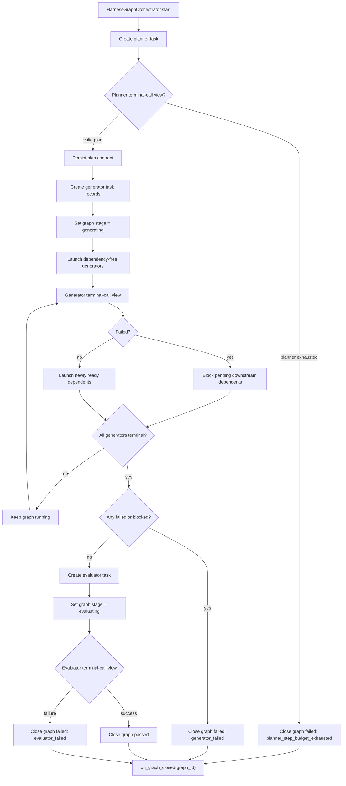
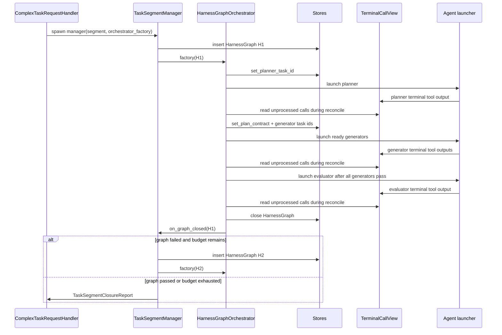
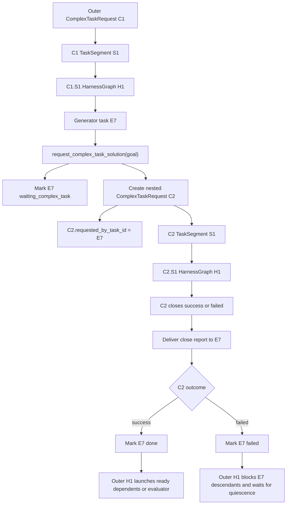

# Phase 02 - Implementation Plan

Companion to
[`phase-02-harness-graph-orchestrator-lifecycle.md`](./phase-02-harness-graph-orchestrator-lifecycle.md).
This document is the actionable build plan: workflow, folder layout, files,
classes, function signatures, test plan, and build waves.

It does not redefine the three-axis model from Phase 00/01. It fills the
single-`HarnessGraph` execution behavior left skeletal by Phase 01.

---

## 1. Scope

Phase 02 moves one harness graph execution into `HarnessGraphOrchestrator`:

```text
planner -> generator DAG -> evaluator -> graph close callback
```

Deliverables:

1. `HarnessGraphOrchestrator` implementation for planning, generating,
   evaluating, and graph close.
2. Process-local lookup/routing for active orchestrators by `HarnessGraph.id`.
3. A small typed terminal-call read model used by tests now and written by
   terminal tools in Phase 03.
4. Task record helpers for planner, generator, and evaluator task
   lifecycle under the current `HarnessGraph`.
5. Generator DAG scheduling: root launch, dependent launch after dependencies
   pass, failure blocking, and quiescence detection.
6. Recursive complex-task handoff state for generator tasks: the outer
   generator task can wait on a nested `ComplexTaskRequest` and later resume
   from that request's close report.
7. `TaskSegmentManager` wiring so newly created graphs start their orchestrator
   when an orchestrator factory is configured.
8. `ComplexTaskRequestHandler` wiring so every spawned segment manager receives
   that orchestrator factory.
9. Focused tests covering all Phase 02 exit criteria.

Not in scope:

- Public tool hard gates for `submit_full_plan`, `submit_partial_plan`,
  `request_complex_task_solution`, resolver limits, and after-edit blocking
  (Phase 03).
- Creation of the nested `ComplexTaskRequest` and durable final report delivery
  to `requested_by_task_id` beyond the existing
  `ComplexTaskRequestHandler.deliver_close_report` seam (Phase 04). Phase 02
  only defines how the outer graph task waits and resumes once that seam is
  invoked.
- End-to-end cutover from any old task-center runtime path (Phase 05).
- Context-engine launch packets, durable graph summaries, and
  `failure_landscape` payload population (Phase 06).

Phase 02 may create the terminal-call view and reconciliation protocol that
Phase 03 terminal tools write to after validation, but the Phase 03 tool
modules remain the public enforcement layer. Terminal tools own tool schemas,
role gates, user-facing errors, and agent-run termination. The orchestrator
owns only graph state transitions and follow-up scheduling.

---

## 2. Coherence verification

The Phase 02 lifecycle is coherent with the Phase 00 target architecture, the
workflow overview, the Phase 01 durable model, and the Phase 01 implementation
report.

| Concept | Source docs | Phase 02 implementation stance | Verdict |
| --- | --- | --- | --- |
| `HarnessGraphOrchestrator` owns exactly one graph execution | Phase 00, workflow overview, Phase 02 | Orchestrator never creates requests, segments, sibling graphs, or continuation segments | OK |
| Retry is segment-level | Phase 00/01/02 | Orchestrator closes the graph and calls `on_graph_closed`; `TaskSegmentManager` decides retry | OK |
| Planner success creates generator DAG | Phase 02/03 | Orchestrator consumes a typed, already accepted plan and persists generator task ids | OK |
| Malformed plan rejection is inline | Phase 02/03 | Phase 02 includes minimal structural assertions needed to schedule; Phase 03 owns public tool validation and prehook UX | OK |
| Generator failure waits for quiescence | Phase 02 | Orchestrator blocks dependents, lets independent running generators finish, and closes only when all generator tasks are terminal | OK |
| Evaluator starts only after every generator passes | Phase 01/02/03 | Orchestrator uses task status checks before creating evaluator | OK |
| Evaluator failure closes immediately | Phase 02 | No extra wait point exists because generator quiescence already happened | OK |
| Continuation goal belongs to the graph that submitted it | Phase 01/02 | Orchestrator stores `continuation_goal` during planner success and never copies it across failed graphs | OK |
| Recursive complex task is a new request, not a child segment | Phase 00/04 | Outer generator task enters `waiting_complex_task`; nested request owns its own segments/graphs; close report resumes the outer generator task | OK |
| `TaskSegmentManager` factory seam exists | Phase 01 report | Phase 02 wires the factory from handler -> manager -> graph start | OK |
| Context evidence belongs to Phase 06 | Phase 01/06 | Phase 02 records structural task summaries only; context summaries remain `None` | OK |

Two seams need explicit handling:

1. The Phase 01 orchestrator constructor has mandatory arguments
   `(harness_graph, graph_store, on_graph_closed)`. Phase 02 should preserve
   that mandatory surface and add optional keyword-only runtime dependencies
   behind a small `HarnessGraphRuntime` object. Existing Phase 01 tests stay
   valid because they do not call orchestrator behavior.
2. `TaskCenterTaskRecord.task_center_harness_graph_id` already exists and now
   semantically points at `harness_graphs.id`. Phase 02 should reuse that column
   for planner/generator/evaluator task lookup rather than adding another FK.

---

## 3. Workflow diagrams

### 3a. One graph execution



### 3b. Manager and orchestrator handoff



### 3c. Generator DAG quiescence

```text
Generator task statuses:

pending -> running -> done
pending -> running -> failed
pending -> blocked

When task T fails:
  - pending descendants whose dependency chain includes T become blocked.
  - already running independent tasks continue.
  - already running dependents should not exist if dependency scheduling is
    correct; if observed, raise GraphInvariantViolation.
  - graph outcome is decided only after all generators are done, failed, or
    blocked.

If all generator tasks are done:
  spawn evaluator.

If any generator task is failed or blocked after quiescence:
  close graph failed with generator_failed.
```

### 3d. Terminal-call view reconciliation

```text
agent terminal tool or runtime close-report delivery
  |
  | validates input, applies role/tool gates, terminates agent run
  v
persisted TerminalToolCallView
  |
  | graph_id is recorded from task.task_center_harness_graph_id
  v
HarnessGraphOrchestrator.reconcile()
  |
  +-- mutate task state from new terminal-call rows
  +-- close graph if graph-level outcome is now known
  `-- dispatch newly ready task rows
```

The registry is process-local. Durable state remains in the stores. If an
orchestrator is missing from memory but the graph is still running, the runtime
can rebuild it from `HarnessGraphStore.get(graph_id)` and call `reconcile()`.

The key boundary is:

- Terminal tools decide whether a tool call is allowed and persist the
  normalized terminal-call view.
- `HarnessGraphOrchestrator` decides how that view mutates graph task state and
  which task should dispatch next.
- `TaskSegmentManager` still decides retry after the graph closes.

### 3e. Recursive complex-task handoff

`request_complex_task_solution` is not a generator success or failure terminal.
It is a handoff from one generator task to a new complex-task request.
The outer graph stays in `generating` while the nested request runs.



Nested request shape:

```text
C1
`-- S1
    `-- H1
        `-- E7
            `-- request_complex_task_solution(goal)
                |
                v
                C2
                `-- S1
                    |-- H1
                    |   `-- failed? retry inside C2.S1 if budget remains
                    `-- H2
                        `-- passed with continuation_goal?
                            |
                            v
                            C2.S2
                            `-- H1
```

Rules:

- `C2` is not a `TaskSegment` of `C1`.
- `C2.requested_by_task_id` is the outer generator task id, e.g. `E7`.
- `C2` owns its own segment chain, attempt budgets, and harness graph retries.
- The outer graph does not launch dependents of `E7` while `E7` is
  `waiting_complex_task`.
- When `C2` closes successfully, the close report becomes `E7`'s success
  summary and the outer graph resumes normal generator scheduling.
- When `C2` closes failed, `E7` is treated as a failed generator task; pending
  descendants are blocked and the outer graph waits for generator quiescence
  before closing with `generator_failed`.

---

## 4. Folder layout

Phase 02 keeps the Phase 01 package shape and adds focused files under the
existing harness-graph lifecycle package.

```text
backend/src/task_center/
|-- domain/
|   |-- harness_graph.py                    # EDIT: optional convenience helpers
|   `-- harness_task.py                     # NEW: task role/status + terminal-call view
|
`-- complex_task_request/
    |-- handler.py                          # EDIT: accept/pass orchestrator_factory
    `-- segment/
        |-- manager.py                      # EDIT: start orchestrators after graph create
        `-- harness_graph/
            |-- __init__.py                 # EDIT: re-export new Phase 02 helpers
            |-- invariants.py               # EDIT: stage/reconciliation invariants
            |-- orchestrator.py             # EDIT: Phase 02 state machine
            |-- orchestrator_registry.py    # NEW: process-local graph -> orchestrator map
            |-- runtime.py                  # NEW: runtime deps + launcher protocol
            |-- terminal_call_view.py       # NEW: normalized terminal-call read model
            |-- task_graph.py               # NEW: DAG/status helper functions
            |-- task_ids.py                 # NEW: stable planner/generator/evaluator ids
            `-- reconciler.py               # DISCUSS: optional extraction for reconcile loop
```

Persistence and task helpers:

```text
backend/src/db/stores/
`-- task_center_store.py                    # EDIT: get/list/set task status helpers
```

Tests:

```text
backend/tests/task_center/
|-- lifecycle/
|   |-- test_harness_graph_orchestrator.py
|   |-- test_harness_graph_generator_quiescence.py
|   |-- test_harness_graph_terminal_call_view.py
|   |-- test_harness_graph_orchestrator_registry.py
|   `-- test_integration_phase02.py
`-- persistence/
    `-- test_task_center_task_helpers.py
```

Deferred public tool modules remain in place as stubs until Phase 03:

```text
backend/src/tools/submission/main_agent/
|-- planner/submit_full_plan.py
|-- planner/submit_partial_plan.py
|-- generator/executor/submit_execution_success.py
|-- generator/executor/submit_execution_failure.py
|-- generator/executor/submit_request_plan.py
|-- generator/verifier/submit_verification_success.py
|-- generator/verifier/submit_verification_failure.py
`-- evaluator/submit_evaluation_success.py
```

---

## 5. Files and functions

### 5a. Domain task roles and terminal-call view

**`backend/src/task_center/domain/harness_task.py`** - new

```python
from dataclasses import dataclass
from datetime import datetime
from enum import StrEnum


class HarnessTaskRole(StrEnum):
    PLANNER = "planner"
    GENERATOR = "generator"
    EVALUATOR = "evaluator"


class HarnessTaskStatus(StrEnum):
    PENDING = "pending"
    RUNNING = "running"
    WAITING_COMPLEX_TASK = "waiting_complex_task"
    DONE = "done"
    FAILED = "failed"
    BLOCKED = "blocked"


TERMINAL_GENERATOR_STATUSES: frozenset[HarnessTaskStatus] = frozenset(
    {
        HarnessTaskStatus.DONE,
        HarnessTaskStatus.FAILED,
        HarnessTaskStatus.BLOCKED,
    }
)


@dataclass(frozen=True, slots=True)
class PlannedGeneratorTask:
    """One generator DAG node after planner submission normalization."""

    local_id: str
    agent_name: str
    deps: tuple[str, ...]
    task_spec: str


@dataclass(frozen=True, slots=True)
class TerminalToolCallView:
    """Validated, persisted view of a terminal tool call.

    Terminal tools own Pydantic input parsing, role gates, user-facing errors,
    and agent-run termination. The orchestrator reads this normalized view only
    to decide how task state should mutate and what should dispatch next.
    """

    terminal_call_id: str
    harness_graph_id: str
    task_id: str
    tool_name: str
    payload: dict
    is_success: bool
    summary: str
    created_at: datetime
```

Notes:

- `HarnessTaskRole` is structural and intentionally has no executor/verifier
  split. Executor and verifier are generator agent profiles, represented by
  `PlannedGeneratorTask.agent_name` and launch metadata.
- Phase 03 public terminal tools validate their own inputs and persist or emit
  `TerminalToolCallView`.
- Phase 02 tests can construct `TerminalToolCallView` directly to discuss and
  verify state-transition policy without coupling tests to tool classes.
- Planner exhaustion does not need a fake terminal type. It is a runtime
  observation that the planner agent run ended without a valid planner terminal
  call in the terminal-call view.
- `WAITING_COMPLEX_TASK` is intentionally not in
  `TERMINAL_GENERATOR_STATUSES`; the outer graph remains in `generating` until
  the nested request close report marks the waiting generator task `done` or
  `failed`.

### 5b. Stable task ids

**`backend/src/task_center/complex_task_request/segment/harness_graph/task_ids.py`** - new

```python
def planner_task_id(harness_graph_id: str) -> str:
    return f"{harness_graph_id}:planner"


def generator_task_id(harness_graph_id: str, local_task_id: str) -> str:
    return f"{harness_graph_id}:gen:{local_task_id}"


def evaluator_task_id(harness_graph_id: str) -> str:
    return f"{harness_graph_id}:evaluator"


def local_generator_task_id(
    *, harness_graph_id: str, persisted_task_id: str
) -> str:
    """Return the planner-local id from a persisted generator task id."""
```

These ids fit the existing `TaskCenterTaskRecord.id: String(96)` as long as
planner local ids stay modest. If a future planner can emit long ids, add a
short hash suffix and keep the mapping in the task summary.

### 5c. Runtime dependency container

**`backend/src/task_center/complex_task_request/segment/harness_graph/runtime.py`** - new

```python
from collections.abc import Callable
from dataclasses import dataclass
from typing import Protocol

from db.stores.complex_task_request_store import ComplexTaskRequestStore
from db.stores.harness_graph_store import HarnessGraphStore
from db.stores.task_center_store import TaskCenterStore
from db.stores.task_segment_store import TaskSegmentStore
from task_center.domain.harness_graph import HarnessGraph
from task_center.domain.harness_task import HarnessTaskRole


@dataclass(frozen=True, slots=True)
class HarnessAgentLaunch:
    task_id: str
    task_center_run_id: str
    harness_graph_id: str
    role: HarnessTaskRole
    agent_name: str
    task_input: str
    needs: tuple[str, ...]


class HarnessAgentLauncher(Protocol):
    """Launches one harness agent task.

    Production implementation owns how to call EphemeralAgent/background
    runtime. Tests use a fake that records launches and later writes
    terminal-call rows consumed by `reconcile()`.
    """

    def launch(self, launch: HarnessAgentLaunch) -> None: ...


@dataclass(frozen=True, slots=True)
class HarnessGraphRuntime:
    request_store: ComplexTaskRequestStore
    segment_store: TaskSegmentStore
    graph_store: HarnessGraphStore
    task_store: TaskCenterStore
    agent_launcher: HarnessAgentLauncher
    orchestrator_registry: "HarnessGraphOrchestratorRegistry"
    id_factory: Callable[[], str] | None = None

    def task_center_run_id_for_graph(self, graph: HarnessGraph) -> str: ...
```

`task_center_run_id_for_graph` walks:

```text
HarnessGraph.task_segment_id
  -> TaskSegment.complex_task_request_id
  -> ComplexTaskRequest.task_center_run_id
```

The orchestrator stays in-process and ephemeral. `HarnessGraphRuntime` is only
a dependency bundle, not durable state.

### 5d. TaskCenterStore helper methods

**`backend/src/db/stores/task_center_store.py`** - edit

Add methods without changing existing serialized task shape:

```python
def get_task(self, task_id: str) -> dict | None: ...


def list_tasks_for_harness_graph(
    self, harness_graph_id: str
) -> list[dict]:
    """Ordered by created_at ascending."""


def list_generator_tasks_for_harness_graph(
    self, harness_graph_id: str
) -> list[dict]:
    """Return generator tasks only."""


def set_task_status(
    self,
    task_id: str,
    *,
    status: str,
    summary: dict | None = None,
) -> dict:
    """Update status and optionally append one summary dict."""


def append_task_summary(self, task_id: str, summary: dict) -> dict: ...
```

`upsert_task(...)` remains the creation helper. New helpers should keep the
store's current dict-returning convention rather than introducing task DTOs in
Phase 02.

### 5e. Generator DAG helpers

**`backend/src/task_center/complex_task_request/segment/harness_graph/task_graph.py`** - new

```python
from task_center.domain.harness_task import (
    HarnessTaskStatus,
    PlannedGeneratorTask,
)


def assert_generator_plan_acyclic(
    tasks: tuple[PlannedGeneratorTask, ...]
) -> None: ...


def assert_generator_deps_exist(
    tasks: tuple[PlannedGeneratorTask, ...]
) -> None: ...


def ordered_generator_tasks(
    tasks: tuple[PlannedGeneratorTask, ...]
) -> tuple[PlannedGeneratorTask, ...]:
    """Topological order, stable by planner order where possible."""


def dependency_task_ids(
    *,
    harness_graph_id: str,
    local_deps: tuple[str, ...],
) -> tuple[str, ...]: ...


def generator_status_map(
    task_records: list[dict],
) -> dict[str, HarnessTaskStatus]: ...


def ready_pending_generator_ids(task_records: list[dict]) -> tuple[str, ...]:
    """Pending generator tasks whose dependency task ids are all done."""


def blocked_descendant_ids(
    *,
    failed_task_id: str,
    task_records: list[dict],
) -> tuple[str, ...]:
    """Pending descendants that can never run because failed_task_id failed."""


def all_generators_quiescent(task_records: list[dict]) -> bool: ...


def all_generators_done(task_records: list[dict]) -> bool: ...


def any_generator_failed_or_blocked(task_records: list[dict]) -> bool: ...
```

Only pending descendants should be blocked. A running task that depends on the
failed task indicates a scheduler bug and should raise `GraphInvariantViolation`.

### 5f. Orchestrator registry

**`backend/src/task_center/complex_task_request/segment/harness_graph/orchestrator_registry.py`** - new

```python
from task_center.exceptions import GraphInvariantViolation


class HarnessGraphOrchestratorRegistry:
    """Process-local registry for active graph orchestrators."""

    def __init__(self) -> None:
        self._by_graph_id: dict[str, HarnessGraphOrchestrator] = {}

    def register(self, orchestrator: HarnessGraphOrchestrator) -> None:
        """Raise GraphInvariantViolation if a different orchestrator is active."""

    def get(self, harness_graph_id: str) -> HarnessGraphOrchestrator | None: ...

    def deregister(self, harness_graph_id: str) -> None: ...

    def get_or_raise(self, harness_graph_id: str) -> HarnessGraphOrchestrator: ...
```

If restart recovery is needed before Phase 05 cutover, add a separate
`HarnessGraphOrchestratorProvider` that rebuilds from durable state. Do not put
store/factory concerns into this registry.

### 5g. Terminal-call view and open design discussion

The orchestrator should not expose one public method per terminal tool or per
terminal outcome. That would make terminal tool semantics leak into graph
orchestration and would invite tool handlers to call graph internals directly.

Instead, introduce a terminal-call view that terminal tools write and the
orchestrator reads during reconciliation.

Open design question: should the terminal-call view be a new persisted table, a
field on `TaskCenterTaskRecord.summaries`, or an in-memory event queue backed by
the existing agent-run transcript?

| Option | Shape | Pros | Risks |
| --- | --- | --- | --- |
| Persisted `task_terminal_calls` table | one row per accepted terminal tool call | durable, idempotent, replayable after restart | new migration and store |
| `TaskCenterTaskRecord.summaries` entry | append normalized terminal-call summary to existing task row | no schema change | harder to distinguish unprocessed calls from ordinary summaries |
| In-memory event queue | terminal tool handler enqueues a normalized call | simplest runtime path | not restart-safe and harder to test against persistence |

Preferred direction for Phase 02 planning: define `TerminalToolCallView` and a
reader protocol first, then decide the backing store during implementation.

```python
from typing import Protocol


class TerminalToolCallReader(Protocol):
    """Read normalized terminal calls for one HarnessGraph."""

    def list_unprocessed_for_graph(
        self, harness_graph_id: str
    ) -> tuple[TerminalToolCallView, ...]: ...

    def mark_processed(self, terminal_call_id: str) -> None: ...
```

Terminal tool responsibilities:

- Parse and validate public tool input.
- Enforce role/tool gates.
- Return user-facing tool errors on malformed calls.
- Persist or enqueue one normalized `TerminalToolCallView` on accepted calls.
- End the agent run when the terminal call succeeds.
- Trigger or schedule `HarnessGraphOrchestrator.reconcile()` for the owning
  graph.

Orchestrator responsibilities:

- Read the terminal-call view for its `HarnessGraph`.
- Mutate task state from accepted terminal calls and close reports.
- Dispatch newly ready planner/generator/evaluator tasks.
- Close the current `HarnessGraph` when graph-level outcome is known.

This keeps the terminal tool layer as the public contract and the orchestrator
as the state-transition and dispatch policy owner.

The discussion to open before implementation is not whether each terminal tool
should call a matching orchestrator method. It should not. The discussion is
which terminal-call backing store gives the reconcile loop enough durability
and idempotency while keeping Phase 02 small.

Recommended first design:

1. Terminal tools persist accepted calls as append-only facts with
   `terminal_call_id`, `harness_graph_id`, `task_id`, `tool_name`, `payload`,
   `created_at`, and `processed_at`.
2. `HarnessGraphOrchestrator.reconcile()` reads unprocessed facts for its graph
   and calls one internal `_reconcile_*` method based on current task role and
   tool name.
3. The orchestrator mutates only task and graph state it owns, then marks the
   fact processed after the mutation succeeds.
4. Dispatch is computed from persisted task state after reconciliation, so a
   retry of `reconcile()` is safe.

### 5h. Orchestrator implementation

**`backend/src/task_center/complex_task_request/segment/harness_graph/orchestrator.py`** - edit

Preserve existing mandatory constructor arguments and add one optional runtime:

```python
class HarnessGraphOrchestrator:
    def __init__(
        self,
        *,
        harness_graph: HarnessGraph,
        graph_store: HarnessGraphStore,
        on_graph_closed: Callable[[str], None],
        runtime: HarnessGraphRuntime | None = None,
    ) -> None: ...
```

External entry points:

```python
def start(self) -> None:
    """Bootstrap the graph by creating and dispatching the planner task."""


def reconcile(self) -> None:
    """Read terminal-call/close-report views, mutate tasks, and dispatch work."""
```

Internal state and dispatch primitives:

```python
def _mutate_task_state(
    self, *, task_id: str, status: HarnessTaskStatus, summary: dict | None = None
) -> None:
    """Persist one task-state mutation owned by this graph."""


def _dispatch_ready_tasks(self) -> None:
    """Launch runnable tasks after state has been reconciled."""
```

`reconcile()` is a coordination loop over those two primitives. It should be
the only outside entry point for terminal-call facts; terminal tools do not
call `_mutate_task_state()` or `_dispatch_ready_tasks()` directly.

Internal methods:

```python
def _require_runtime(self) -> HarnessGraphRuntime: ...

def _fresh_graph(self) -> HarnessGraph: ...

def _assert_stage(self, expected: HarnessGraphStage) -> HarnessGraph: ...

def _start_planner(self) -> None: ...

def _read_unprocessed_terminal_calls(self) -> tuple[TerminalToolCallView, ...]: ...

def _reconcile_terminal_call(self, call: TerminalToolCallView) -> None: ...

def _reconcile_planner_call(self, call: TerminalToolCallView) -> None: ...

def _reconcile_generator_call(self, call: TerminalToolCallView) -> None: ...

def _reconcile_evaluator_call(self, call: TerminalToolCallView) -> None: ...

def _reconcile_nested_close_report(self, report: ComplexTaskCloseReport) -> None: ...

def _persist_generator_tasks(
    self, tasks: tuple[PlannedGeneratorTask, ...]
) -> tuple[str, ...]: ...

def _launch_ready_generators(self) -> None: ...

def _pause_generator_for_complex_task(
    self, *, task_id: str, complex_task_request_id: str
) -> None: ...

def _block_failed_generator_descendants(self, failed_task_id: str) -> None: ...

def _resume_generator_from_complex_task_close(
    self, *, close_report: ComplexTaskCloseReport
) -> None: ...

def _maybe_finish_generating(self) -> None: ...

def _start_evaluator(self) -> None: ...

def _state_summary(self, *, kind: str, summary: str) -> dict: ...

def _close_graph(
    self,
    *,
    status: HarnessGraphStatus,
    fail_reason: HarnessGraphFailReason | None,
) -> None: ...
```

Important behavior:

- `start()` requires graph status `running` and stage `planning`.
- `start()` persists the planner task id before launch.
- `reconcile()` is the only public entry point for reacting to terminal tool
  calls and nested close reports.
- Planner terminal-call success persists `task_specification`,
  `evaluation_criteria`, and
  `continuation_goal` before generator tasks launch.
- Generator tasks are persisted with `task_center_harness_graph_id = graph.id`.
- Only dependency-free generator tasks are launched immediately.
- A generator success terminal-call view marks that task `done`, then launches
  newly ready pending generator tasks.
- A generator complex-task handoff terminal-call view marks that generator task
  `waiting_complex_task` and does not launch its dependents.
- A nested complex-task close report resumes only the generator task named by
  `requested_by_task_id`; success maps to `done`, failure maps to `failed`.
- A generator failure terminal-call view marks that task `failed`, blocks
  pending descendants, and waits for quiescence.
- Evaluator is created only when all generator task records are `done`.
- `_close_graph()` calls `graph_store.close(...)` exactly once and then calls
  `on_graph_closed(graph_id)`.
- `_close_graph(status=FAILED, fail_reason=None)` is a hard invariant
  violation.
- `_close_graph(status=PASSED, fail_reason=...)` is a hard invariant violation.

### 5i. Stage and reconciliation invariants

**`backend/src/task_center/complex_task_request/segment/harness_graph/invariants.py`** - edit

Add:

```python
def assert_graph_stage(
    graph: HarnessGraph, expected: HarnessGraphStage
) -> None: ...


def assert_graph_not_closed(graph: HarnessGraph) -> None: ...


def assert_valid_graph_close(
    *,
    status: HarnessGraphStatus,
    fail_reason: HarnessGraphFailReason | None,
) -> None: ...


def assert_task_belongs_to_graph(task: dict, graph: HarnessGraph) -> None: ...


def assert_generator_task_for_reconcile(task: dict, graph: HarnessGraph) -> None: ...


def assert_evaluator_task_for_reconcile(task: dict, graph: HarnessGraph) -> None: ...
```

All raise `GraphInvariantViolation`.

### 5j. TaskSegmentManager wiring

**`backend/src/task_center/complex_task_request/segment/manager.py`** - edit

Add:

```python
def _start_orchestrator_if_configured(self, graph: HarnessGraph) -> None:
    if self._orchestrator_factory is None:
        return
    orchestrator = self._orchestrator_factory(graph)
    orchestrator.start()
```

Then call it from `_create_graph(...)` after the graph id is appended to the
segment:

```python
graph = self._graph_store.insert(...)
self._segment_store.append_graph_id(segment.id, graph.id)
self._start_orchestrator_if_configured(graph)
return graph
```

Phase 01 tests that construct managers without a factory continue to create
graphs without starting an orchestrator.

### 5k. ComplexTaskRequestHandler wiring

**`backend/src/task_center/complex_task_request/handler.py`** - edit

Add an optional constructor parameter:

```python
def __init__(
    self,
    *,
    request_store: ComplexTaskRequestStore,
    segment_store: TaskSegmentStore,
    graph_store: HarnessGraphStore,
    manager_registry: SegmentManagerRegistry,
    config: HarnessLifecycleConfig,
    deliver_close_report: CloseReportSink | None = None,
    orchestrator_factory: OrchestratorFactory | None = None,
) -> None: ...
```

Store it and pass it to each `TaskSegmentManager` in `_spawn_segment_manager`:

```python
manager = TaskSegmentManager(
    task_segment_id=segment.id,
    segment_store=self._segment_store,
    graph_store=self._graph_store,
    on_segment_closed=self.handle_segment_closed,
    orchestrator_factory=self._orchestrator_factory,
)
```

This keeps request/segment ownership unchanged while letting Phase 02 activate
the existing Phase 01 factory seam.

### 5l. Production orchestrator factory

Add a small composition helper near the lifecycle package boundary. Either
placement is acceptable; prefer keeping it in the graph package unless a later
phase needs a broader service factory.

**Option A:**

```text
backend/src/task_center/complex_task_request/segment/harness_graph/factory.py
```

```python
def make_harness_graph_orchestrator_factory(
    *,
    runtime: HarnessGraphRuntime,
    on_graph_closed_for_segment: Callable[[str], None],
) -> Callable[[HarnessGraph], HarnessGraphOrchestrator]:
    def factory(graph: HarnessGraph) -> HarnessGraphOrchestrator:
        orchestrator = HarnessGraphOrchestrator(
            harness_graph=graph,
            graph_store=runtime.graph_store,
            on_graph_closed=on_graph_closed_for_segment,
            runtime=runtime,
        )
        runtime.orchestrator_registry.register(orchestrator)
        return orchestrator

    return factory
```

**Option B:**

Keep factory creation inside `TaskSegmentManager._start_orchestrator_if_configured`
and make the passed factory responsible for registry registration.

Prefer Option B for Phase 02: it keeps `TaskSegmentManager` ignorant of the
registry.

---

## 6. Planner and task creation details

### 6a. Planner task

`start()` creates one planner task:

```python
task_store.upsert_task(
    task_id=planner_task_id(graph.id),
    task_center_run_id=runtime.task_center_run_id_for_graph(graph),
    role=HarnessTaskRole.PLANNER.value,
    task_input=segment.goal,
    status=HarnessTaskStatus.RUNNING.value,
    summaries=[],
    needs=[],
    task_center_harness_graph_id=graph.id,
    spawn_reason="harness_graph_planner",
)
graph_store.set_planner_task_id(graph.id, task_id)
agent_launcher.launch(...)
```

Task input can be minimal in Phase 02. Phase 06 replaces this with rich context
packets.

### 6b. Generator tasks

Planner success creates all generator task records up front:

```python
task_store.upsert_task(
    task_id=generator_task_id(graph.id, local_id),
    task_center_run_id=task_center_run_id,
    role=HarnessTaskRole.GENERATOR.value,
    task_input=task.task_spec,
    status=HarnessTaskStatus.PENDING.value,
    summaries=[],
    needs=list(dependency_task_ids(...)),
    task_center_harness_graph_id=graph.id,
    spawn_reason="harness_graph_generator",
)
```

The persisted task role is always `generator`. The concrete generator profile
(`executor`, `verifier`, or future generator agent names) stays in planner task
metadata and `HarnessAgentLaunch.agent_name`; it is not a `HarnessTaskRole`.

Then:

- Persist `graph_store.set_generator_task_ids(graph.id, all_generator_ids)`.
- Persist `graph_store.set_stage(graph.id, HarnessGraphStage.GENERATING)`.
- Launch pending tasks whose `needs` are empty, marking each launched task
  `running`.

### 6c. Generator terminal-call reconciliation

On success:

1. Assert graph is `generating`.
2. Assert task belongs to graph and has `role = "generator"`.
3. Mark task `done`, append state summary.
4. Launch newly ready pending generators.
5. If all generators are done, start evaluator.

On failure:

1. Assert graph is `generating`.
2. Mark task `failed`, append state summary.
3. Block pending descendants with summary `{ "blocked_by": task_id }`.
4. If all generators are terminal, close graph failed with
   `generator_failed`.

On complex-task handoff:

1. Assert graph is `generating`.
2. Assert task belongs to graph, has `role = "generator"`, and is currently
   `running`.
3. Mark task `waiting_complex_task`, append a summary with the nested
   `complex_task_request_id`.
4. Do not launch dependents.
5. Do not count the task as terminal for quiescence.

On nested complex-task close report:

1. Load the waiting task from `report.requested_by_task_id`.
2. Assert the task belongs to this graph and is `waiting_complex_task`.
3. If `report.outcome == "success"`, mark the task `done`, append the close
   report summary, then launch newly ready pending generators.
4. If `report.outcome == "failed"`, mark the task `failed`, append the close
   report summary, block pending descendants, and wait for generator
   quiescence.

The nested request's internal retries and continuation segments are invisible
to the outer graph. The outer graph only observes the final close report for
the generator task that requested it. The terminal tool gate, not the
orchestrator, decides which generator agent profiles may call
`request_complex_task_solution`.

### 6d. Evaluator task

When all generators are done:

```python
task_store.upsert_task(
    task_id=evaluator_task_id(graph.id),
    task_center_run_id=task_center_run_id,
    role=HarnessTaskRole.EVALUATOR.value,
    task_input=evaluator_prompt_from_graph_contract(graph),
    status=HarnessTaskStatus.RUNNING.value,
    summaries=[],
    needs=list(graph.generator_task_ids),
    task_center_harness_graph_id=graph.id,
    spawn_reason="harness_graph_evaluator",
)
graph_store.set_evaluator_task_id(graph.id, task_id)
graph_store.set_stage(graph.id, HarnessGraphStage.EVALUATING)
agent_launcher.launch(...)
```

`evaluator_prompt_from_graph_contract` should use `graph.task_specification`
and `graph.evaluation_criteria`. Phase 06 can replace it with context-engine
packets.

### 6e. Graph close

Close paths:

| Path | Status | Fail reason | Wait point |
| --- | --- | --- | --- |
| Planner exhausted | `failed` | `planner_step_budget_exhausted` | immediate |
| Generator failed/blocked after quiescence | `failed` | `generator_failed` | all generators terminal |
| Evaluator failure | `failed` | `evaluator_failed` | immediate |
| Evaluator success | `passed` | `None` | immediate |

`close(...)` should:

1. Re-read graph from the store.
2. Assert it is still running and not closed.
3. Assert close status/fail-reason pairing is valid.
4. Persist `graph_store.close(...)`.
5. Deregister from `HarnessGraphOrchestratorRegistry` if runtime exists.
6. Call `on_graph_closed(graph.id)`.

The orchestrator must not call `TaskSegmentManager.create_next_harness_graph`
or inspect segment attempt budget.

---

## 7. Class summary

| Layer | Class/function | New / edited | Responsibility |
| --- | --- | --- | --- |
| Domain | `HarnessTaskRole` | NEW | Stable role names for persisted task rows |
| Domain | `HarnessTaskStatus` | NEW | Pending/running/waiting/done/failed/blocked lifecycle |
| Domain | `PlannedGeneratorTask` | NEW | One normalized planner DAG node |
| Domain | `TerminalToolCallView` | NEW | Normalized accepted terminal tool call read model |
| Runtime | `TerminalToolCallReader` | DISCUSS | Backing-store-independent read/mark-processed protocol |
| Persistence | `TaskCenterStore.get_task` | EDIT | Load one persisted task dict |
| Persistence | `TaskCenterStore.list_tasks_for_harness_graph` | EDIT | Graph-scoped task lookup |
| Persistence | `TaskCenterStore.set_task_status` | EDIT | Status update plus optional summary append |
| Runtime | `HarnessAgentLaunch` | NEW | One launch request to the agent runtime |
| Runtime | `HarnessAgentLauncher` | NEW | Testable launch protocol |
| Runtime | `HarnessGraphRuntime` | NEW | Dependency bundle for orchestrator behavior |
| Lifecycle | `HarnessGraphOrchestratorRegistry` | NEW | Process-local graph -> orchestrator lookup |
| Lifecycle | `HarnessGraphOrchestrator.reconcile` | EDIT | Read terminal-call view, mutate task state, dispatch ready work |
| Lifecycle | `HarnessGraphOrchestrator._mutate_task_state` | EDIT | Persist graph-owned task status transitions |
| Lifecycle | `HarnessGraphOrchestrator._dispatch_ready_tasks` | EDIT | Launch planner/generator/evaluator tasks from current graph state |
| Lifecycle | `TaskSegmentManager._start_orchestrator_if_configured` | EDIT | Start graph orchestrator after graph creation |
| Lifecycle | `ComplexTaskRequestHandler.__init__` | EDIT | Accept/pass orchestrator factory |

---

## 8. Test plan

All tests should use in-memory SQLite and fake agent launchers. No provider API
keys or live agent runs are needed in Phase 02.

### 8a. Persistence helpers

| Test | Purpose |
| --- | --- |
| `test_get_task_returns_serialized_task` | `TaskCenterStore.get_task` shape matches list serialization |
| `test_list_tasks_for_harness_graph_filters_by_graph_id` | Lookup uses `task_center_harness_graph_id` |
| `test_set_task_status_updates_status_and_appends_summary` | Lifecycle summaries persist |
| `test_list_generator_tasks_excludes_planner_and_evaluator` | Quiescence sees only generator-role nodes |

### 8b. Registry and terminal-call view

| Test | Purpose |
| --- | --- |
| `test_registry_enforces_one_orchestrator_per_graph` | Duplicate active orchestrator is invariant violation |
| `test_registry_deregister_allows_replacement` | Closed graph cleanup works |
| `test_terminal_call_view_lists_unprocessed_calls_for_graph` | Orchestrator can read accepted terminal calls for one graph |
| `test_terminal_call_view_marks_calls_processed_idempotently` | Reconciliation can be retried safely |
| `test_terminal_call_view_resolves_nested_close_report_by_requested_task_id` | Nested request close report can resume waiting generator task |
| `test_terminal_call_view_rejects_task_without_graph_id` | Hard invariant for malformed task rows |

### 8c. Orchestrator unit tests

| Test | Phase 02 behavior |
| --- | --- |
| `test_start_creates_planner_task_and_sets_graph_planner_id` | Start path |
| `test_reconcile_planner_plan_persists_contract_and_generator_ids` | Planner terminal-call view success |
| `test_reconcile_planner_exhaustion_closes_graph_failed` | `planner_step_budget_exhausted` |
| `test_generator_roots_launch_after_plan` | DAG root scheduling |
| `test_reconcile_generator_success_launches_newly_ready_dependents` | Dependency scheduling |
| `test_reconcile_generator_complex_task_handoff_marks_task_waiting` | Recursive request handoff |
| `test_reconcile_nested_complex_task_success_marks_generator_done` | Nested close report success path |
| `test_reconcile_nested_complex_task_failure_marks_generator_failed` | Nested close report failure path |
| `test_waiting_complex_task_prevents_generator_quiescence` | Outer graph remains generating while nested request runs |
| `test_reconcile_generator_failure_blocks_pending_descendants` | Failure propagation |
| `test_generator_failure_waits_for_independent_running_tasks` | Quiescence wait |
| `test_generator_failure_closes_after_quiescence` | `generator_failed` close |
| `test_all_generators_done_spawns_evaluator` | Evaluator spawn gate |
| `test_reconcile_evaluator_success_closes_graph_passed` | Passed close |
| `test_reconcile_evaluator_failure_closes_graph_failed` | `evaluator_failed` close |
| `test_close_graph_calls_on_graph_closed_once` | Callback contract |
| `test_orchestrator_never_creates_retry_graph` | Retry remains manager-owned |

### 8d. Manager/handler integration

| Test | Purpose |
| --- | --- |
| `test_manager_starts_orchestrator_when_factory_present` | Factory seam activates |
| `test_manager_without_factory_preserves_phase01_behavior` | Backward compatibility |
| `test_failed_graph_with_budget_starts_next_graph_orchestrator` | Retry graph start |
| `test_handler_passes_orchestrator_factory_to_spawned_manager` | Handler wiring |
| `test_full_plan_execution_success_closes_request_success` | Phase 02 success smoke |
| `test_generator_failure_retry_then_evaluator_success` | Orchestrator -> manager retry -> next orchestrator |

### 8e. Invariant tests

Add focused invariant tests for:

- Planner terminal-call view reconciled outside `planning`.
- Generator terminal-call view reconciled outside `generating`.
- Evaluator terminal-call view reconciled outside `evaluating`.
- Failed graph close without fail reason.
- Passed graph close with fail reason.
- Running generator that depends on a failed generator.
- Waiting complex-task generator counted as terminal.
- Evaluator spawn before all generator tasks are `done`.

---

## 9. Build order (waves)

Each wave is independently testable.

### Wave 1 - Terminal-call view and task helpers

1. Add `task_center/domain/harness_task.py`.
2. Add `task_ids.py`.
3. Add `TaskCenterStore` task helper methods.
4. Add persistence tests for task helpers.

### Wave 2 - DAG helpers

1. Add `task_graph.py`.
2. Add structural plan assertions and topological ordering.
3. Add ready/quiescent/blocked helper tests.

### Wave 3 - Runtime seams

1. Add `runtime.py` with `HarnessGraphRuntime`,
   `HarnessAgentLaunch`, and `HarnessAgentLauncher`.
2. Add `orchestrator_registry.py`.
3. Add `terminal_call_view.py` read-model DTO/protocol.
4. Decide whether the first implementation uses a table, task summaries, or an
   in-memory queue as the backing terminal-call view.
5. Add registry and terminal-call view tests with fake orchestrators.

### Wave 4 - Orchestrator state machine

1. Implement `HarnessGraphOrchestrator.start`.
2. Implement `HarnessGraphOrchestrator.reconcile`.
3. Implement planner success and planner exhaustion reconciliation.
4. Implement generator terminal-call reconciliation, dependency scheduling, and
   quiescence close.
5. Implement generator complex-task waiting and nested close-report resume.
6. Implement evaluator spawn and evaluator terminal-call reconciliation.
7. Implement `_close_graph`.
8. Run orchestrator unit tests.

### Wave 5 - Handler/manager wiring

1. Thread `orchestrator_factory` through `ComplexTaskRequestHandler`.
2. Start orchestrators from `TaskSegmentManager._create_graph` when configured.
3. Ensure failed graph retry starts the next graph orchestrator.
4. Run manager/handler integration tests.

### Wave 6 - Integration smoke

1. Build a fake launcher that records launches and writes terminal-call rows
   consumed by `HarnessGraphOrchestrator.reconcile`.
2. Test successful full-plan graph execution through request success.
3. Test generator failure quiescence and retry into a passing graph.
4. Test nested complex-task close report resuming an outer generator task.
5. Confirm all Phase 02 exit criteria below.

Recommended commands:

```bash
uv run pytest backend/tests/task_center/persistence/test_task_center_task_helpers.py -q
uv run pytest backend/tests/task_center/lifecycle/test_harness_graph_orchestrator.py -q
uv run pytest backend/tests/task_center/lifecycle/test_harness_graph_generator_quiescence.py -q
uv run pytest backend/tests/task_center/lifecycle/test_harness_graph_terminal_call_view.py -q
uv run pytest backend/tests/task_center/lifecycle/test_integration_phase02.py -q
uv run pytest backend/tests/task_center/ -q
uv run ruff check backend/src/task_center backend/src/db/stores/task_center_store.py backend/tests/task_center
```

---

## 10. Phase 02 exit criteria mapping

| Phase 02 exit criterion | Verified by |
| --- | --- |
| A harness graph can complete full-plan execution successfully | `test_full_plan_execution_success_closes_request_success` |
| Generator failure waits for quiescence before graph failure is reported | `test_generator_failure_waits_for_independent_running_tasks` |
| Failed generator blocks pending dependents | `test_generator_failure_blocks_pending_descendants` |
| Evaluator failure closes the harness graph immediately | `test_evaluator_failure_closes_graph_failed` |
| Planner exhaustion closes the graph with `planner_step_budget_exhausted` | `test_planner_exhaustion_closes_graph_failed` |
| No retry path is implemented inside `HarnessGraphOrchestrator` | `test_orchestrator_never_creates_retry_graph` |
| Retry remains delegated to `TaskSegmentManager` | `test_failed_graph_with_budget_starts_next_graph_orchestrator` |
| Orchestrator close reports to `TaskSegmentManager` via callback | `test_close_graph_calls_on_graph_closed_once` |
| Terminal-call view reconciliation resolves current graph work | `test_terminal_call_view_lists_unprocessed_calls_for_graph` |
| Recursive complex-task handoff keeps the outer graph open until nested close | `test_waiting_complex_task_prevents_generator_quiescence` |
| Nested close report success resumes the requesting generator task | `test_nested_complex_task_success_resumes_generator_as_done` |
| Nested close report failure fails the requesting generator task and blocks descendants | `test_nested_complex_task_failure_resumes_generator_as_failed` |

---

## 11. Risks and open questions

### 11a. Constructor surface vs runtime dependencies

Phase 01 fixed the mandatory orchestrator constructor. Phase 02 needs task
store, segment/request stores, launcher, and registry. Keep the mandatory
surface and add optional `runtime` so Phase 01 tests and stub code remain
valid.

### 11b. Agent launching can be async later

The `HarnessAgentLauncher.launch(...)` protocol is synchronous in Phase 02.
That is intentional: the launcher can enqueue or schedule async work internally,
while the orchestrator remains a deterministic state machine for tests.

### 11c. Task ids use graph id prefixes

Persisted task ids like `{graph_id}:gen:{local_id}` are easy to inspect and
avoid cross-graph collisions. The risk is length. If planner-local ids become
long, hash the local id and store the original local id in the task summary.

### 11d. Plan validation boundary

Phase 03 owns public tool validation and user-facing error messages. Phase 02
still needs hard structural checks before scheduling: no duplicate local ids,
no dangling deps, and no cycles. These raise `GraphInvariantViolation` in tests
or return tool errors once Phase 03 wraps them.

### 11e. Restart recovery

The registry is process-local. If a process restarts mid-graph, durable graph
and task rows remain but the orchestrator object is gone. Full recovery can be
handled during Phase 05 cutover. Phase 02 should keep the registry simple and
avoid pretending to provide durable orchestration recovery.

### 11f. Continuation segment creation already exists

Phase 01 implemented continuation segment creation in
`ComplexTaskRequestHandler`. Phase 02 should not remove it. The "final report
delivery" part of continuation/request closure remains Phase 04.

### 11g. `submit_request_plan` naming

Current generator-side prompt/tool stubs use `submit_request_plan`; migration
docs refer to `request_complex_task_solution`. Phase 02 should not resolve
this public naming mismatch. Record it for Phase 03/04 tool-surface work and
keep orchestrator internals independent of the public tool name.

### 11h. Waiting status must not look terminal

`waiting_complex_task` is a graph-local pause, not a generator terminal. If it
is accidentally treated as terminal, the outer graph can spawn an evaluator
before the nested request returns. Keep `TERMINAL_GENERATOR_STATUSES` limited
to `done`, `failed`, and `blocked`, and add explicit quiescence tests for a
waiting generator.

---

## 12. References

- [Task Center Harness Migration - Phase Index](../task-center-harness-migration.md)
- [Complex Task Segmentation and Harness Graph Workflow](./complex-task-workflow-overview.md)
- [Phase 00 - Target Architecture](./phase-00-target-architecture.md)
- [Phase 01 - Complex Task Request and Harness Graph Model](./phase-01-graph-and-attempt-model.md)
- [Phase 01 - Implementation Plan](./phase-01-implementation-plan.md)
- [Phase 01 - Implementation Report](./phase-01-implementation-report.md)
- [Phase 02 - Harness Graph Orchestrator Lifecycle](./phase-02-harness-graph-orchestrator-lifecycle.md)
- [Phase 03 - Agent Roles and Tool Gates](./phase-03-agent-roles-and-tool-gates.md)
