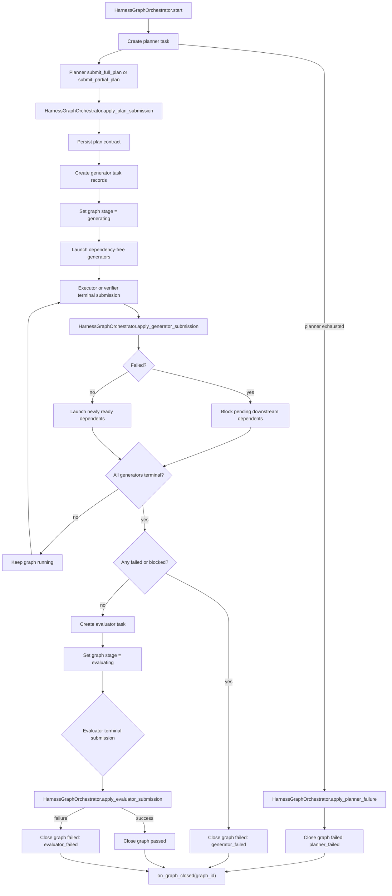
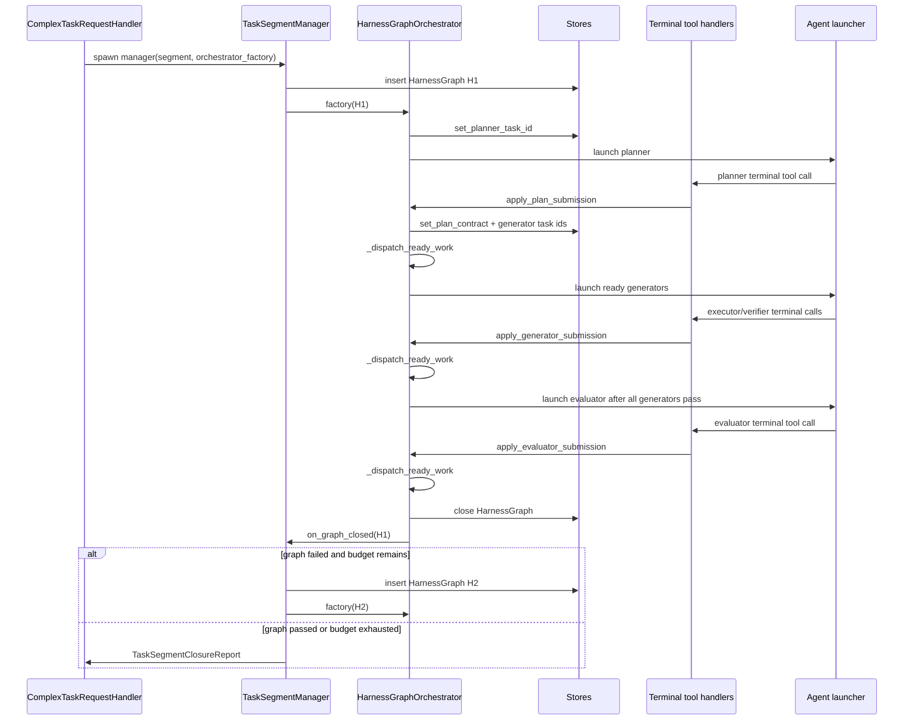
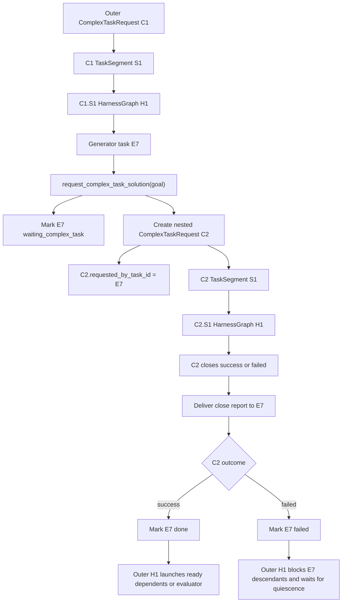

# Phase 02 - Implementation Plan

Companion to
[`phase-02-harness-graph-orchestrator-lifecycle.md`](./phase-02-harness-graph-orchestrator-lifecycle.md).
This document is the actionable build plan: workflow, folder layout, files,
classes, function signatures, test plan, and build waves.

It does not redefine the three-axis model from Phase 00/01. It fills the
single-`HarnessGraph` execution behavior left skeletal by Phase 01.

---

## 1. Scope

Phase 02 moves one harness graph execution into `HarnessGraphOrchestrator`:

```text
planner -> generator DAG -> evaluator -> graph close callback
```

Deliverables:

1. `HarnessGraphOrchestrator` implementation for planning, generating,
   evaluating, and graph close.
2. Process-local lookup/routing for active orchestrators by `HarnessGraph.id`.
3. Public `HarnessGraphOrchestrator.apply_*` methods called directly by
   terminal tool handlers after public validation succeeds.
4. Private mutation helpers and private dispatch helpers inside
   `HarnessGraphOrchestrator`.
5. Typed submission DTOs for planner, executor, verifier, and evaluator
   mutation calls.
6. Task record helpers for planner, generator, and evaluator task
   lifecycle under the current `HarnessGraph`.
7. Generator DAG scheduling: root launch, dependent launch after dependencies
   pass, failure blocking, and quiescence detection.
8. Recursive complex-task handoff observation: when an outer generator task
   sits in `waiting_complex_task`, the orchestrator treats it as non-terminal
   during quiescence checks so the outer graph stays in `generating`. The
   transition into `waiting_complex_task` and the resume path
   (`apply_nested_close_report`) are owned by Phase 04.
9. `TaskSegmentManager` wiring so newly created graphs start their orchestrator
   when an orchestrator factory is configured.
10. `ComplexTaskRequestHandler` wiring so every spawned segment manager receives
   that orchestrator factory.
11. Focused tests covering all Phase 02 exit criteria.

Not in scope:

- Public tool hard gates for `submit_full_plan`, `submit_partial_plan`,
  `request_complex_task_solution`, resolver limits, and after-edit blocking
  (Phase 03).
- Generator `submit_request_plan` handling. Phase 02 must not add this legacy
  request-plan surface to `HarnessGraphOrchestrator`; `request_complex_task_solution`
  is the canonical migration name, and Phase 03/04 should either reject the legacy
  stub or alias it before orchestration.
- Creation of the nested `ComplexTaskRequest`, the
  `apply_nested_close_report` resume entry on `HarnessGraphOrchestrator`, and
  durable final report delivery to `requested_by_task_id` (all Phase 04).
  Phase 02 only ensures the orchestrator observes `waiting_complex_task` as
  non-terminal during generator quiescence.
- End-to-end cutover from any old task-center runtime path (Phase 05).
- Context-engine launch packets, durable graph summaries, and
  `failure_landscape` payload population (Phase 06).

Phase 02 defines the direct call protocol that Phase 03 terminal tools use
after validation. Phase 03 tool modules remain the public enforcement layer:
terminal tools own schemas, role gates, user-facing errors, and agent-run
termination. After a terminal call is accepted, the tool handler calls the
matching `HarnessGraphOrchestrator.apply_*` method. The orchestrator owns graph
state transitions and follow-up scheduling.

---

## 2. Coherence verification

The Phase 02 lifecycle is coherent with the Phase 00 target architecture, the
workflow overview, the Phase 01 durable model, and the Phase 01 implementation
report.

| Concept | Source docs | Phase 02 implementation stance | Verdict |
| --- | --- | --- | --- |
| `HarnessGraphOrchestrator` owns exactly one graph execution | Phase 00, workflow overview, Phase 02 | Orchestrator never creates requests, segments, sibling graphs, or continuation segments | OK |
| Retry is segment-level | Phase 00/01/02 | Orchestrator closes the graph and calls `on_graph_closed`; `TaskSegmentManager` decides retry | OK |
| Planner success creates generator DAG | Phase 02/03 | Terminal tool handlers call `HarnessGraphOrchestrator.apply_plan_submission` with a typed, already accepted plan; mutation then persists generator task ids | OK |
| Full and partial planner submissions share one state path | Phase 02/03 | `apply_plan_submission` receives `kind = full | partial`; partial only adds `continuation_goal` | OK |
| Malformed plan rejection is inline | Phase 02/03 | Phase 02 includes minimal structural assertions needed to schedule; Phase 03 owns public tool validation and prehook UX | OK |
| Generator failure waits for quiescence | Phase 02 | Orchestrator blocks dependents, lets independent running generators finish, and closes only when all generator tasks are terminal | OK |
| Executor and verifier are generator outcomes | Phase 00/02/03 | Separate public tools normalize into one `apply_generator_submission` entry; role-specific detail travels in summaries/payloads | OK |
| Legacy request-plan is not a task outcome | Phase 00/02/04 | `submit_request_plan` never enters mutation handling; canonical request handoff is `request_complex_task_solution` and is handled by request-boundary code | OK |
| Evaluator starts only after every generator passes | Phase 01/02/03 | Orchestrator uses task status checks before creating evaluator | OK |
| Evaluator failure closes immediately | Phase 02 | No extra wait point exists because generator quiescence already happened | OK |
| Continuation goal belongs to the graph that submitted it | Phase 01/02 | Orchestrator stores `continuation_goal` during planner success and never copies it across failed graphs | OK |
| Recursive complex task is a new request, not a child segment | Phase 00/04 | Outer generator task enters `waiting_complex_task` via the Phase 04 spawn handler; Phase 02 keeps that status non-terminal in quiescence so the outer graph stays open until the Phase 04 resume entry fires | OK |
| `TaskSegmentManager` factory seam exists | Phase 01 report | Phase 02 wires the factory from handler -> manager -> graph start | OK |
| Context evidence belongs to Phase 06 | Phase 01/06 | Phase 02 records structural task summaries only; context summaries remain `None` | OK |

Two seams need explicit handling:

1. The Phase 01 orchestrator constructor has mandatory arguments
   `(harness_graph, graph_store, on_graph_closed)`. Phase 02 should preserve
   that mandatory surface and add optional keyword-only runtime dependencies
   behind a small `HarnessGraphRuntime` object. Existing Phase 01 tests stay
   valid because they do not call orchestrator behavior.
2. `TaskCenterTaskRecord.task_center_harness_graph_id` already exists and now
   semantically points at `harness_graphs.id`. Phase 02 should reuse that column
   for planner/generator/evaluator task lookup rather than adding another FK.

---

## 3. Workflow diagrams

### 3a. One graph execution



### 3b. Manager and orchestrator handoff



### 3c. Generator DAG quiescence

```text
Generator task statuses:

pending -> running -> done
pending -> running -> failed
pending -> blocked

When task T fails:
  - pending descendants whose dependency chain includes T become blocked.
  - already running independent tasks continue.
  - already running dependents should not exist if dependency scheduling is
    correct; if observed, raise GraphInvariantViolation.
  - graph outcome is decided only after all generators are done, failed, or
    blocked.

If all generator tasks are done:
  spawn evaluator.

If any generator task is failed or blocked after quiescence:
  close graph failed with generator_failed.
```

### 3d. Direct terminal mutation flow

```text
agent terminal tool or runtime close-report delivery
  |
  | validates input, applies role/tool gates, terminates agent run
  v
HarnessGraphOrchestrator.apply_*
  |
  | mutates graph-owned task or graph state
  v
HarnessGraphOrchestrator._dispatch_ready_work()
  |
  +-- launch newly ready task rows
  +-- close graph if graph-level outcome is now known
  `-- notify TaskSegmentManager on graph close
```

The registry is process-local. Durable state remains in the stores. Terminal
tool handlers resolve the active graph from the current task's
`task_center_harness_graph_id`, fetch the registered orchestrator, and call its
public `apply_*` method. If an orchestrator is missing from memory for a running
graph, Phase 02 treats that as an invariant/tool-routing error. Durable
orchestrator rebuild after process restart is a Phase 05 cutover concern, not a
registry feature.

The key boundary is:

- Terminal tools decide whether a tool call is allowed, normalize their public
  input into typed submission DTOs, and call `HarnessGraphOrchestrator.apply_*`.
- `HarnessGraphOrchestrator.apply_*` methods mutate graph-owned task and graph
  state.
- `HarnessGraphOrchestrator._dispatch_ready_work()` decides which task should
  dispatch next or whether the graph should close.
- `TaskSegmentManager` still decides retry after the graph closes.

### 3e. Recursive complex-task handoff

`request_complex_task_solution` is not a generator success or failure terminal.
It is a handoff from one generator task to a new complex-task request.
The outer graph stays in `generating` while the nested request runs.



Nested request shape:

```text
C1
`-- S1
    `-- H1
        `-- E7
            `-- request_complex_task_solution(goal)
                |
                v
                C2
                `-- S1
                    |-- H1
                    |   `-- failed? retry inside C2.S1 if budget remains
                    `-- H2
                        `-- passed with continuation_goal?
                            |
                            v
                            C2.S2
                            `-- H1
```

Rules:

- `C2` is not a `TaskSegment` of `C1`.
- `C2.requested_by_task_id` is the outer generator task id, e.g. `E7`.
- `C2` owns its own segment chain, attempt budgets, and harness graph retries.
- The outer graph does not launch dependents of `E7` while `E7` is
  `waiting_complex_task`.
- When `C2` closes successfully, the close report becomes `E7`'s success
  summary and the outer graph resumes normal generator scheduling.
- When `C2` closes failed, `E7` is treated as a failed generator task; pending
  descendants are blocked and the outer graph waits for generator quiescence
  before closing with `generator_failed`.

---

## 4. Folder layout

Phase 02 keeps the post-restructure peer-subpackage shape from Phase 01 and
adds focused files under the existing `harness_graph/` lifecycle package.

```text
backend/src/task_center/
|-- complex_task/
|   `-- handler.py                          # EDIT: accept/pass orchestrator_factory
|-- segment/
|   `-- manager.py                          # EDIT: start orchestrators after graph create
`-- harness_graph/
    |-- __init__.py                         # EDIT: re-export new Phase 02 helpers
    |-- graph.py                            # EDIT: optional convenience helpers (Phase 01 DTO)
    |-- task.py                             # NEW: task role/status + submission DTOs
    |-- validation.py                       # EDIT: stage/submission invariants
    |-- orchestrator.py                     # EDIT: Phase 02 state machine
    |-- orchestrator_registry.py            # NEW: process-local graph -> orchestrator map
    |-- runtime.py                          # NEW: runtime deps + launcher protocol
    |-- task_graph.py                       # NEW: DAG/status helper functions
    |-- task_ids.py                         # NEW: stable planner/generator/evaluator ids
    `-- factory.py                          # NEW: production orchestrator factory
```

Persistence and task helpers:

```text
backend/src/db/stores/
`-- task_center_store.py                    # EDIT: get/list/set task status helpers
```

Tests:

```text
backend/tests/task_center/
|-- lifecycle/
|   |-- test_harness_graph_orchestrator.py
|   |-- test_harness_graph_generator_quiescence.py
|   |-- test_harness_graph_orchestrator_registry.py
|   `-- test_integration_phase02.py
`-- persistence/
    `-- test_task_center_task_helpers.py
```

Deferred public tool modules remain in place as stubs until Phase 03:

```text
backend/src/tools/submission/main_agent/
|-- planner/submit_full_plan.py
|-- planner/submit_partial_plan.py
|-- generator/executor/submit_execution_success.py
|-- generator/executor/submit_execution_failure.py
|-- generator/executor/submit_request_plan.py   # legacy stub; Phase 03 should reject or alias
|-- generator/verifier/submit_verification_success.py
|-- generator/verifier/submit_verification_failure.py
|-- evaluator/submit_evaluation_success.py
`-- evaluator/submit_evaluation_failure.py
```

---

## 5. Files and functions

### 5a. Domain task roles and submission DTOs

**`backend/src/task_center/harness_graph/task.py`** - new

```python
from dataclasses import dataclass
from enum import StrEnum
from typing import Literal


class HarnessTaskRole(StrEnum):
    PLANNER = "planner"
    GENERATOR = "generator"
    EVALUATOR = "evaluator"


class HarnessTaskStatus(StrEnum):
    PENDING = "pending"
    RUNNING = "running"
    WAITING_COMPLEX_TASK = "waiting_complex_task"
    DONE = "done"
    FAILED = "failed"
    BLOCKED = "blocked"


TERMINAL_GENERATOR_STATUSES: frozenset[HarnessTaskStatus] = frozenset(
    {
        HarnessTaskStatus.DONE,
        HarnessTaskStatus.FAILED,
        HarnessTaskStatus.BLOCKED,
    }
)


@dataclass(frozen=True, slots=True)
class PlannedGeneratorTask:
    """One generator DAG node after planner submission normalization."""

    local_id: str
    agent_name: str
    deps: tuple[str, ...]
    task_spec: str


@dataclass(frozen=True, slots=True)
class PlannerSubmission:
    """Validated planner submission from submit_full_plan or submit_partial_plan."""

    graph_id: str
    planner_task_id: str
    kind: Literal["full", "partial"]
    task_specification: str
    evaluation_criteria: tuple[str, ...]
    tasks: tuple[PlannedGeneratorTask, ...]
    continuation_goal: str | None
    summary: str


@dataclass(frozen=True, slots=True)
class PlannerFailureSubmission:
    """Synthesized by the runtime when a planner agent run ends without a
    valid submit_*_plan call. The planner has no agent-facing failure tool
    in Phase 02; this DTO exists so the orchestrator close-path surface
    stays uniform across all four failure modes.
    """

    graph_id: str
    planner_task_id: str
    fail_reason: Literal["run_exhausted"]
    summary: str


@dataclass(frozen=True, slots=True)
class GeneratorSubmission:
    """Validated executor or verifier terminal outcome for one generator task."""

    graph_id: str
    task_id: str
    outcome: Literal["success", "failure"]
    summary: str
    payload: dict


@dataclass(frozen=True, slots=True)
class EvaluatorSubmission:
    """Validated evaluator terminal outcome for one harness graph."""

    graph_id: str
    task_id: str
    outcome: Literal["success", "failure"]
    summary: str
    payload: dict
```

Notes:

- `HarnessTaskRole` is structural and intentionally has no executor/verifier
  split. Executor and verifier are generator agent profiles, represented by
  `PlannedGeneratorTask.agent_name` and launch metadata.
- Phase 03 public terminal tools validate their own inputs and then call
  `HarnessGraphOrchestrator.apply_*` with `PlannerSubmission`,
  `GeneratorSubmission`, or `EvaluatorSubmission`.
- `PlannerFailureSubmission` has no Phase 03 tool counterpart. The runtime
  constructs it directly when it observes that a planner agent run ended
  without a valid `submit_*_plan` call. The DTO exists to keep all four
  close paths on a uniform `apply_*` surface, not to support a planner
  failure tool.
- Phase 02 tests can construct any of these DTOs directly to verify
  state-transition policy without coupling tests to tool classes.
- `WAITING_COMPLEX_TASK` is intentionally not in
  `TERMINAL_GENERATOR_STATUSES`; the outer graph remains in `generating` until
  the nested request close report marks the waiting generator task `done` or
  `failed`.

### 5b. Stable task ids

**`backend/src/task_center/harness_graph/task_ids.py`** - new

```python
def planner_task_id(harness_graph_id: str) -> str:
    return f"{harness_graph_id}:planner"


def generator_task_id(harness_graph_id: str, local_task_id: str) -> str:
    return f"{harness_graph_id}:gen:{local_task_id}"


def evaluator_task_id(harness_graph_id: str) -> str:
    return f"{harness_graph_id}:evaluator"
```

These ids fit the existing `TaskCenterTaskRecord.id: String(96)` as long as
planner local ids stay modest. If a future planner can emit long ids, add a
short hash suffix and keep the mapping in the task summary.

### 5c. Runtime dependency container

**`backend/src/task_center/harness_graph/runtime.py`** - new

```python
from collections.abc import Callable
from dataclasses import dataclass
from typing import Protocol

from db.stores.complex_task_request_store import ComplexTaskRequestStore
from db.stores.task_center_store import TaskCenterStore
from db.stores.task_segment_store import TaskSegmentStore
from task_center.harness_graph.graph import HarnessGraph
from task_center.harness_graph.task import HarnessTaskRole


@dataclass(frozen=True, slots=True)
class HarnessAgentLaunch:
    task_id: str
    task_center_run_id: str
    harness_graph_id: str
    role: HarnessTaskRole
    agent_name: str
    task_input: str
    needs: tuple[str, ...]


class HarnessAgentLauncher(Protocol):
    """Launches one harness agent task.

    Production implementation owns how to call EphemeralAgent/background
    runtime. Tests use a fake that records launches and later calls
    HarnessGraphOrchestrator.apply_* with validated submission DTOs.
    """

    def launch(self, launch: HarnessAgentLaunch) -> None: ...


@dataclass(frozen=True, slots=True)
class HarnessGraphRuntime:
    request_store: ComplexTaskRequestStore
    segment_store: TaskSegmentStore
    task_store: TaskCenterStore
    agent_launcher: HarnessAgentLauncher
    orchestrator_registry: "HarnessGraphOrchestratorRegistry"

    def task_center_run_id_for_graph(self, graph: HarnessGraph) -> str: ...
```

`task_center_run_id_for_graph` walks:

```text
HarnessGraph.task_segment_id
  -> TaskSegment.complex_task_request_id
  -> ComplexTaskRequest.task_center_run_id
```

The orchestrator stays in-process and ephemeral. `HarnessGraphRuntime` is only
a dependency bundle, not durable state. `HarnessGraphStore` remains a mandatory
constructor dependency on `HarnessGraphOrchestrator`; do not also store it on
`HarnessGraphRuntime`.

### 5d. TaskCenterStore helper methods

**`backend/src/db/stores/task_center_store.py`** - edit

Add methods without changing existing serialized task shape:

```python
def get_task(self, task_id: str) -> dict | None: ...


def list_tasks_for_harness_graph(
    self, harness_graph_id: str
) -> list[dict]:
    """Ordered by created_at ascending."""


def list_generator_tasks_for_harness_graph(
    self, harness_graph_id: str
) -> list[dict]:
    """Return generator tasks only."""


def set_task_status(
    self,
    task_id: str,
    *,
    status: str,
    summary: dict | None = None,
) -> dict:
    """Update status and optionally append one summary dict.

    Pass `summary=None` to update status only; pass a dict to append one
    summary entry as part of the same write. There is no separate
    `append_task_summary` helper — appending without a status change is rare
    enough in Phase 02 that callers can pass the existing status.
    """
```

`upsert_task(...)` remains the creation helper. New helpers should keep the
store's current dict-returning convention rather than introducing task DTOs in
Phase 02.

### 5e. Generator DAG helpers

**`backend/src/task_center/harness_graph/task_graph.py`** - new

```python
from task_center.harness_graph.task import (
    HarnessTaskStatus,
    PlannedGeneratorTask,
)


def assert_generator_deps_exist(
    tasks: tuple[PlannedGeneratorTask, ...]
) -> None: ...


def ordered_generator_tasks(
    tasks: tuple[PlannedGeneratorTask, ...]
) -> tuple[PlannedGeneratorTask, ...]:
    """Topological order, stable by planner order where possible."""


def dependency_task_ids(
    *,
    harness_graph_id: str,
    local_deps: tuple[str, ...],
) -> tuple[str, ...]: ...


def generator_status_map(
    task_records: list[dict],
) -> dict[str, HarnessTaskStatus]: ...


def ready_pending_generator_ids(task_records: list[dict]) -> tuple[str, ...]:
    """Pending generator tasks whose dependency task ids are all done."""


def blocked_descendant_ids(
    *,
    failed_task_id: str,
    task_records: list[dict],
) -> tuple[str, ...]:
    """Pending descendants that can never run because failed_task_id failed."""


def all_generators_quiescent(task_records: list[dict]) -> bool: ...


def all_generators_done(task_records: list[dict]) -> bool: ...


def any_generator_failed_or_blocked(task_records: list[dict]) -> bool: ...
```

Only pending descendants should be blocked. A running task that depends on the
failed task indicates a scheduler bug and should raise `GraphInvariantViolation`.

### 5f. Orchestrator registry

**`backend/src/task_center/harness_graph/orchestrator_registry.py`** - new

```python
from task_center.exceptions import GraphInvariantViolation


class HarnessGraphOrchestratorRegistry:
    """Process-local registry for active graph orchestrators."""

    def __init__(self) -> None:
        self._by_graph_id: dict[str, HarnessGraphOrchestrator] = {}

    def register(self, orchestrator: HarnessGraphOrchestrator) -> None:
        """Raise GraphInvariantViolation if a different orchestrator is active."""

    def get(self, harness_graph_id: str) -> HarnessGraphOrchestrator | None: ...

    def deregister(self, harness_graph_id: str) -> None: ...

    def get_or_raise(self, harness_graph_id: str) -> HarnessGraphOrchestrator: ...
```

The registry is intentionally only a process-local map. Do not put store,
factory, or durable rebuild concerns into it; restart recovery belongs to the
Phase 05 cutover work.

### 5g. Orchestrator public entries and private helper groups

Terminal tools should not call graph-store methods directly and should not write
an intermediate event/read model. After public validation succeeds, they call
one `HarnessGraphOrchestrator.apply_*` entry with a typed submission DTO.

Terminal tool responsibilities:

- Parse and validate public tool input.
- Enforce role/tool gates.
- Return user-facing tool errors on malformed calls.
- Resolve the active `HarnessGraphOrchestrator` from the current task's
  `task_center_harness_graph_id`.
- Call the matching `HarnessGraphOrchestrator.apply_*` method.
- End the agent run when the terminal call succeeds.

`HarnessGraphOrchestrator` public entry responsibilities:

- Persist graph-owned task and graph state for accepted submissions.
- Keep `submit_full_plan` and `submit_partial_plan` on one
  `apply_plan_submission(...)` entry.
- Keep executor and verifier outcomes on one `apply_generator_submission(...)`
  entry; the role tag travels in the `GeneratorSubmission` payload/summary.
- Never accept legacy generator `submit_request_plan`.
- Call `_dispatch_ready_work()` after a successful mutation.

Private dispatch helper responsibilities:

- Read persisted graph/task state after mutations.
- Launch newly ready generator/evaluator tasks.
- Block pending generator descendants after generator failure.
- Hold generator-failure escalation until all non-blocked generator work is
  terminal.
- Close the graph through `_close_graph(...)` and call
  `on_graph_closed(graph_id)` when the graph outcome is known.

This keeps terminal tools as the public contract while avoiding extra lifecycle
classes in Phase 02. The orchestrator is the graph-scoped owner; the split is
kept as method groups instead of separate objects.

**`backend/src/task_center/harness_graph/orchestrator.py`** - edit

```python
class HarnessGraphOrchestrator:
    def start(self) -> None: ...

    def apply_plan_submission(self, submission: PlannerSubmission) -> None: ...

    def apply_planner_failure(
        self, submission: PlannerFailureSubmission
    ) -> None: ...

    def apply_generator_submission(
        self, submission: GeneratorSubmission
    ) -> None: ...

    def apply_evaluator_submission(
        self, submission: EvaluatorSubmission
    ) -> None: ...

    # `apply_nested_close_report(report)` ships in Phase 04 alongside the
    # `request_complex_task_solution` spawn handler.

    # mutation helpers
    def _persist_plan_contract(self, submission: PlannerSubmission) -> None: ...
    def _persist_generator_tasks(
        self, tasks: tuple[PlannedGeneratorTask, ...]
    ) -> tuple[str, ...]: ...
    def _mark_generator(self, submission: GeneratorSubmission) -> None: ...
    def _mark_evaluator(self, submission: EvaluatorSubmission) -> None: ...
    def _block_failed_generator_descendants(self, failed_task_id: str) -> None: ...

    # dispatch helper (single entry; reads task state and decides
    # launch-newly-ready vs spawn-evaluator vs close-graph)
    def _dispatch_ready_work(self) -> None: ...

    def _close_graph(
        self,
        *,
        status: HarnessGraphStatus,
        fail_reason: HarnessGraphFailReason | None,
    ) -> None: ...
```

### 5h. Orchestrator implementation

**`backend/src/task_center/harness_graph/orchestrator.py`** - edit

The orchestrator is one graph-scoped state machine. It exposes only bootstrap,
planner-exhaustion, and accepted-submission entries; all launch and close
policy stays in private helper methods.

Preserve existing mandatory constructor arguments and add one optional
runtime:

```python
class HarnessGraphOrchestrator:
    def __init__(
        self,
        *,
        harness_graph: HarnessGraph,
        graph_store: HarnessGraphStore,
        on_graph_closed: Callable[[str], None],
        runtime: HarnessGraphRuntime | None = None,
    ) -> None: ...
```

External entry points:

```python
def start(self) -> None:
    """Create the planner task row, persist planner_task_id, mark RUNNING,
    launch the planner agent, and call _dispatch_ready_work() once.

    Requires graph status RUNNING and stage PLANNING.
    """


def apply_planner_failure(self, submission: PlannerFailureSubmission) -> None:
    """Runtime-synthesized failure submission. The planner has no
    agent-facing failure tool; the runtime calls this when a planner agent
    run ends without a valid submit_*_plan call.

    Asserts stage = planning, appends submission.summary to the planner
    task row, marks the task FAILED, and delegates to
    _close_graph(status=FAILED,
    fail_reason=PLANNER_FAILED).
    """
```

Terminal tool handlers call `apply_*` methods after validation. Phase 04
adds `apply_nested_close_report(report)` for nested-request resume.

Internal helpers (kept on the façade only because they are graph-scoped
plumbing, not policy):

```python
def _require_runtime(self) -> HarnessGraphRuntime: ...

def _fresh_graph(self) -> HarnessGraph: ...

def _assert_stage(self, expected: HarnessGraphStage) -> HarnessGraph: ...

def _on_graph_closed_with_deregister(self, graph_id: str) -> None:
    """Wraps the user callback so the orchestrator deregisters from
    HarnessGraphOrchestratorRegistry before notifying the segment."""
```

Private helper groups:

| Helper group | Responsibility |
| ------------ | -------------- |
| mutation helpers | persist generator task rows, block pending descendants, append role-specific summaries |
| dispatch helpers | launch dependency-free generators, spawn evaluator after quiescence, close graph and call `on_graph_closed` |

Important behavior:

- `start()` requires graph status `running` and stage `planning`. It
  persists the planner task id and marks the planner task `running` before
  the launcher returns.
- `apply_planner_failure(submission)` is the only orchestrator-level escape
  valve for the planner. The planner has no agent-facing failure terminal,
  so the runtime synthesizes the submission when it observes a planner run
  ending without a valid `submit_*_plan` call.
- Terminal tool handlers call `HarnessGraphOrchestrator.apply_*` directly after
  validation. They do not call orchestrator-private methods.
- `apply_plan_submission` persists `task_specification`, `evaluation_criteria`,
  and `continuation_goal` before generator tasks launch.
- Generator tasks are persisted with `task_center_harness_graph_id = graph.id`.
- Only dependency-free generator tasks are launched immediately.
- A generator success submission marks that task `done`, then
  `_dispatch_ready_work` launches newly ready pending generator tasks.
- A generator failure submission marks that task `failed`, blocks pending
  descendants, and `_dispatch_ready_work` then waits for quiescence.
- The Phase 04 spawn handler — not the orchestrator — transitions the
  outer generator task to `waiting_complex_task` when
  `request_complex_task_solution` is accepted. The orchestrator only
  observes `waiting_complex_task` as a non-terminal generator status during
  quiescence checks. The matching resume entry
  (`apply_nested_close_report`) ships in Phase 04.
- Evaluator is spawned by `_dispatch_ready_work` only when every generator
  task record is `done`.
- `_close_graph(...)` calls `graph_store.close(...)` exactly once and then
  calls `on_graph_closed(graph_id)`.
- `_close_graph(status=FAILED, fail_reason=None)` is a hard invariant
  violation.
- `_close_graph(status=PASSED, fail_reason=...)` is a hard invariant
  violation.

### 5i. Stage and submission invariants

**`backend/src/task_center/harness_graph/validation.py`** - edit

Add:

```python
def assert_graph_stage(
    graph: HarnessGraph, expected: HarnessGraphStage
) -> None: ...


def assert_graph_not_closed(graph: HarnessGraph) -> None: ...


def assert_valid_graph_close(
    *,
    status: HarnessGraphStatus,
    fail_reason: HarnessGraphFailReason | None,
) -> None: ...


def assert_task_belongs_to_graph(task: dict, graph: HarnessGraph) -> None: ...


def assert_generator_task_for_submission(task: dict, graph: HarnessGraph) -> None: ...


def assert_evaluator_task_for_submission(task: dict, graph: HarnessGraph) -> None: ...
```

All raise `GraphInvariantViolation`.

### 5j. TaskSegmentManager wiring

**`backend/src/task_center/segment/manager.py`** - edit

Tighten the factory callback contract so a shared factory can be passed through
the request handler while each segment manager still supplies its own closed-graph
callback:

```python
GraphClosedCallback = Callable[[str], None]
OrchestratorFactory = Callable[
    [HarnessGraph, GraphClosedCallback], "HarnessGraphOrchestrator"
]
```

Add:

```python
def _start_orchestrator_if_configured(self, graph: HarnessGraph) -> None:
    if self._orchestrator_factory is None:
        return
    orchestrator = self._orchestrator_factory(
        graph, self.handle_harness_graph_closed
    )
    orchestrator.start()
```

Then call it from `_create_graph(...)` after the graph id is appended to the
segment:

```python
graph = self._graph_store.insert(...)
self._segment_store.append_graph_id(segment.id, graph.id)
self._start_orchestrator_if_configured(graph)
return graph
```

Phase 01 tests that construct managers without a factory continue to create
graphs without starting an orchestrator.

### 5k. ComplexTaskRequestHandler wiring

**`backend/src/task_center/complex_task/handler.py`** - edit

Add an optional constructor parameter:

```python
def __init__(
    self,
    *,
    request_store: ComplexTaskRequestStore,
    segment_store: TaskSegmentStore,
    graph_store: HarnessGraphStore,
    manager_registry: SegmentManagerRegistry,
    config: HarnessLifecycleConfig,
    deliver_close_report: CloseReportSink | None = None,
    orchestrator_factory: OrchestratorFactory | None = None,
) -> None: ...
```

Store it and pass it to each `TaskSegmentManager` in `_spawn_segment_manager`:

```python
manager = TaskSegmentManager(
    task_segment_id=segment.id,
    segment_store=self._segment_store,
    graph_store=self._graph_store,
    on_segment_closed=self.handle_segment_closed,
    orchestrator_factory=self._orchestrator_factory,
)
```

This keeps request/segment ownership unchanged while letting Phase 02 activate
the existing Phase 01 factory seam.

### 5l. Production orchestrator factory

Add a small composition helper near the lifecycle package boundary:

```text
backend/src/task_center/harness_graph/factory.py
```

```python
def make_harness_graph_orchestrator_factory(
    *,
    graph_store: HarnessGraphStore,
    runtime: HarnessGraphRuntime,
) -> OrchestratorFactory:
    def factory(
        graph: HarnessGraph,
        on_graph_closed: Callable[[str], None],
    ) -> HarnessGraphOrchestrator:
        orchestrator = HarnessGraphOrchestrator(
            harness_graph=graph,
            graph_store=graph_store,
            on_graph_closed=on_graph_closed,
            runtime=runtime,
        )
        runtime.orchestrator_registry.register(orchestrator)
        return orchestrator

    return factory
```

The passed factory is responsible for registry registration. `TaskSegmentManager`
only knows how to start the returned orchestrator and remains ignorant of the
registry and runtime dependency bundle.

---

## 6. Planner and task creation details

### 6a. Planner task

`start()` creates one planner task:

```python
task_store.upsert_task(
    task_id=planner_task_id(graph.id),
    task_center_run_id=runtime.task_center_run_id_for_graph(graph),
    role=HarnessTaskRole.PLANNER.value,
    task_input=segment.goal,
    status=HarnessTaskStatus.RUNNING.value,
    summaries=[],
    needs=[],
    task_center_harness_graph_id=graph.id,
    spawn_reason="harness_graph_planner",
)
graph_store.set_planner_task_id(graph.id, task_id)
agent_launcher.launch(...)
```

Task input can be minimal in Phase 02. Phase 06 replaces this with rich context
packets.

### 6b. Generator tasks

Planner success creates all generator task records up front:

```python
task_store.upsert_task(
    task_id=generator_task_id(graph.id, local_id),
    task_center_run_id=task_center_run_id,
    role=HarnessTaskRole.GENERATOR.value,
    task_input=task.task_spec,
    status=HarnessTaskStatus.PENDING.value,
    summaries=[],
    needs=list(dependency_task_ids(...)),
    task_center_harness_graph_id=graph.id,
    spawn_reason="harness_graph_generator",
)
```

The persisted task role is always `generator`. The concrete generator profile
(`executor`, `verifier`, or future generator agent names) stays in planner task
metadata and `HarnessAgentLaunch.agent_name`; it is not a `HarnessTaskRole`.

Then:

- Persist `graph_store.set_generator_task_ids(graph.id, all_generator_ids)`.
- Persist `graph_store.set_stage(graph.id, HarnessGraphStage.GENERATING)`.
- Launch pending tasks whose `needs` are empty, marking each launched task
  `running`.

### 6c. Generator submission handling

`HarnessGraphOrchestrator.apply_generator_submission` handles both executor
and verifier outcomes. The DTO is the same `GeneratorSubmission` regardless of
which terminal tool routed it; the Phase 03 tool handler stamps the role into
`payload`/`summary` before dispatching.

On success (`outcome = "success"`):

1. Assert graph is `generating`.
2. Assert task belongs to graph and has `role = "generator"`.
3. Mark task `done`, append state summary.
4. Call `_dispatch_ready_work()`. Dispatch launches newly ready pending
   generators; if all generators are done, dispatch spawns the evaluator.

On failure (`outcome = "failure"`):

1. Assert graph is `generating`.
2. Mark task `failed`, append state summary.
3. Block pending descendants with summary `{ "blocked_by": task_id }`.
4. Call `_dispatch_ready_work()`. Dispatch keeps
   independent running generators alive; once all are terminal it closes
   the graph failed with `generator_failed`.

### 6c.1. Complex-task handoff is not a generator submission

`request_complex_task_solution` is **not** a `GeneratorSubmission`. The
orchestrator must not accept it. The Phase 04 spawn handler owns this
flow:

1. Generator executor calls `request_complex_task_solution(goal)`.
2. Phase 04 spawn handler validates the call, creates the nested
   `ComplexTaskRequest` with `requested_by_task_id` set to the outer
   generator task id, and writes the outer generator task row directly
   via `task_store.set_task_status(task_id, status=WAITING_COMPLEX_TASK,
   summary={...})`.
3. The Phase 04 handler ends the outer generator agent run.

The outer `HarnessGraphOrchestrator` is not in the loop for steps 1-3. It
observes the outer task as `waiting_complex_task` on the next
`_dispatch_ready_work()` call and treats it as non-terminal: dependents are
not launched, evaluator is not spawned, the graph stays in `generating`.

Phase 02's only job here is to keep `waiting_complex_task` non-terminal in
quiescence checks so the outer graph stays in `generating` (no evaluator
spawn, no premature `generator_failed` close). The resume entry
(`apply_nested_close_report`) and its wiring through
`ComplexTaskRequestHandler.deliver_close_report` ship in Phase 04. The
terminal tool gate (Phase 03), not the orchestrator, decides which generator
agent profiles may call `request_complex_task_solution`.

### 6d. Evaluator task

When all generators are done:

```python
task_store.upsert_task(
    task_id=evaluator_task_id(graph.id),
    task_center_run_id=task_center_run_id,
    role=HarnessTaskRole.EVALUATOR.value,
    task_input=evaluator_prompt_from_graph_contract(graph),
    status=HarnessTaskStatus.RUNNING.value,
    summaries=[],
    needs=list(graph.generator_task_ids),
    task_center_harness_graph_id=graph.id,
    spawn_reason="harness_graph_evaluator",
)
graph_store.set_evaluator_task_id(graph.id, task_id)
graph_store.set_stage(graph.id, HarnessGraphStage.EVALUATING)
agent_launcher.launch(...)
```

`evaluator_prompt_from_graph_contract` should use `graph.task_specification`
and `graph.evaluation_criteria`. Phase 06 can replace it with context-engine
packets.

### 6e. Evaluator submission handling

On success:

1. Assert graph is `evaluating`.
2. Assert task belongs to graph and has `role = "evaluator"`.
3. Mark evaluator task `done` and append the evaluator summary.
4. `_dispatch_ready_work()` closes the graph passed.

On failure:

1. Assert graph is `evaluating`.
2. Assert task belongs to graph and has `role = "evaluator"`.
3. Mark evaluator task `failed` and append the evaluator summary.
4. `_dispatch_ready_work()` closes the graph failed with `evaluator_failed`.

Evaluator failure does not wait for other work. The evaluator only exists after
all generator work is already quiescent.

### 6f. Graph close

Close paths and triggers:

| Path | Status | Fail reason | Trigger | Wait point |
| --- | --- | --- | --- | --- |
| Planner exhausted | `failed` | `planner_failed` | runtime synthesizes `PlannerFailureSubmission`; calls `HarnessGraphOrchestrator.apply_planner_failure(submission)` -> `_close_graph(...)` | immediate |
| Generator failed/blocked after quiescence | `failed` | `generator_failed` | `_dispatch_ready_work()` after every generator is terminal | all generators terminal |
| Evaluator failure | `failed` | `evaluator_failed` | `_dispatch_ready_work()` after `apply_evaluator_submission` writes failed | immediate |
| Evaluator success | `passed` | `None` | `_dispatch_ready_work()` after `apply_evaluator_submission` writes done | immediate |

`HarnessGraphOrchestrator._close_graph(status, fail_reason)` is the single
close helper. It must:

1. Re-read the graph from the store.
2. Assert it is still running and not closed.
3. Assert close status/fail-reason pairing is valid (use
   `assert_valid_graph_close`).
4. Persist `graph_store.close(graph_id, status=status, fail_reason=fail_reason, closed_at=now)`.
5. Deregister from `HarnessGraphOrchestratorRegistry`.
6. Call `on_graph_closed(graph_id)` so `TaskSegmentManager` reacts.

No other orchestrator method should call `graph_store.close(...)` directly.
The orchestrator must not call
`TaskSegmentManager.create_next_harness_graph` or inspect segment attempt
budget.

---

## 7. Class summary

| Layer | Class/function | New / edited | Responsibility |
| --- | --- | --- | --- |
| Domain | `HarnessTaskRole` | NEW | Stable role names for persisted task rows |
| Domain | `HarnessTaskStatus` | NEW | Pending/running/waiting/done/failed/blocked lifecycle |
| Domain | `PlannedGeneratorTask` | NEW | One normalized planner DAG node |
| Domain | `PlannerSubmission` | NEW | Unified planner success DTO for full and partial plans |
| Domain | `PlannerFailureSubmission` | NEW | Runtime-synthesized planner failure DTO (no agent-facing tool) |
| Domain | `GeneratorSubmission` | NEW | Executor/verifier success or failure DTO |
| Domain | `EvaluatorSubmission` | NEW | Evaluator success or failure DTO |
| Persistence | `TaskCenterStore.get_task` | EDIT | Load one persisted task dict |
| Persistence | `TaskCenterStore.list_tasks_for_harness_graph` | EDIT | Graph-scoped task lookup |
| Persistence | `TaskCenterStore.set_task_status` | EDIT | Status update plus optional summary append |
| Runtime | `HarnessAgentLaunch` | NEW | One launch request to the agent runtime |
| Runtime | `HarnessAgentLauncher` | NEW | Testable launch protocol |
| Runtime | `HarnessGraphRuntime` | NEW | Dependency bundle for orchestrator behavior |
| Lifecycle | `HarnessGraphOrchestratorRegistry` | NEW | Process-local graph -> orchestrator lookup |
| Lifecycle | `HarnessGraphOrchestrator.start` | EDIT | Bootstrap planner |
| Lifecycle | `HarnessGraphOrchestrator.apply_*` | EDIT | Direct submission mutation surface (`apply_plan_submission`, `apply_planner_failure`, `apply_generator_submission`, `apply_evaluator_submission`). `apply_planner_failure` is called by the runtime; the others by terminal tool handlers. `apply_nested_close_report` ships in Phase 04. |
| Lifecycle | `HarnessGraphOrchestrator._dispatch_ready_work` | EDIT | Launchability, generator quiescence, evaluator spawn |
| Lifecycle | `HarnessGraphOrchestrator._close_graph` | EDIT | Single close site that calls `graph_store.close(...)` and `on_graph_closed` |
| Lifecycle | `HarnessGraphOrchestrator.apply_planner_failure` | NEW | Runtime-synthesized planner failure entry; marks planner task `failed` and delegates to `_close_graph(planner_failed)` |
| Lifecycle | `TaskSegmentManager._start_orchestrator_if_configured` | EDIT | Start graph orchestrator after graph creation |
| Lifecycle | `ComplexTaskRequestHandler.__init__` | EDIT | Accept/pass orchestrator factory |

---

## 8. Test plan

All tests should use in-memory SQLite and fake agent launchers. No provider API
keys or live agent runs are needed in Phase 02.

### 8a. Persistence helpers

| Test | Purpose |
| --- | --- |
| `test_get_task_returns_serialized_task` | `TaskCenterStore.get_task` shape matches list serialization |
| `test_list_tasks_for_harness_graph_filters_by_graph_id` | Lookup uses `task_center_harness_graph_id` |
| `test_set_task_status_updates_status_and_appends_summary` | Lifecycle summaries persist |
| `test_list_generator_tasks_excludes_planner_and_evaluator` | Quiescence sees only generator-role nodes |

### 8b. Registry and direct apply surface

| Test | Purpose |
| --- | --- |
| `test_registry_enforces_one_orchestrator_per_graph` | Duplicate active orchestrator is invariant violation |
| `test_registry_deregister_allows_replacement` | Closed graph cleanup works |
| `test_orchestrator_applies_full_plan_submission` | Full plan and generator task creation share the direct apply path |
| `test_orchestrator_applies_partial_plan_submission` | Partial plan stores the continuation goal through the same plan entry |
| `test_orchestrator_rejects_submit_request_plan` | Legacy request-plan calls never mutate graph task state |

### 8c. Orchestrator unit tests

| Test | Phase 02 behavior |
| --- | --- |
| `test_start_creates_planner_task_and_sets_graph_planner_id` | Start path |
| `test_apply_plan_submission_persists_contract_and_generator_ids` | Planner submission success |
| `test_apply_planner_failure_marks_task_and_closes_graph` | Runtime-synthesized `PlannerFailureSubmission` flows through `apply_planner_failure`, marks the planner task `failed` with the runtime summary, then closes the graph with `planner_failed` |
| `test_planner_exhaustion_closes_graph_failed` | End-to-end planner exhaustion close path through the runtime callback |
| `test_generator_roots_launch_after_plan` | DAG root scheduling |
| `test_apply_generator_success_launches_newly_ready_dependents` | Dependency scheduling |
| `test_waiting_complex_task_prevents_generator_quiescence` | Outer graph stays in `generating` while a generator task is `waiting_complex_task` (Phase 04 owns the transition; Phase 02 only verifies the quiescence observation) |
| `test_apply_generator_failure_blocks_pending_descendants` | Failure propagation |
| `test_generator_failure_waits_for_independent_running_tasks` | Quiescence wait |
| `test_generator_failure_closes_after_quiescence` | `generator_failed` close |
| `test_all_generators_done_spawns_evaluator` | Evaluator spawn gate |
| `test_apply_evaluator_success_closes_graph_passed` | Passed close |
| `test_apply_evaluator_failure_closes_graph_failed` | `evaluator_failed` close |
| `test_close_graph_calls_on_graph_closed_once` | Callback contract |
| `test_orchestrator_never_creates_retry_graph` | Retry remains manager-owned |

### 8d. Manager/handler integration

| Test | Purpose |
| --- | --- |
| `test_manager_starts_orchestrator_when_factory_present` | Factory seam activates |
| `test_manager_without_factory_preserves_phase01_behavior` | Backward compatibility |
| `test_failed_graph_with_budget_starts_next_graph_orchestrator` | Retry graph start |
| `test_handler_passes_orchestrator_factory_to_spawned_manager` | Handler wiring |
| `test_full_plan_execution_success_closes_request_success` | Phase 02 success smoke |
| `test_generator_failure_retry_then_evaluator_success` | Orchestrator -> manager retry -> next orchestrator |

### 8e. Invariant tests

Add focused invariant tests for:

- Planner submission applied outside `planning`.
- Generator submission applied outside `generating`.
- Evaluator submission applied outside `evaluating`.
- Failed graph close without fail reason.
- Passed graph close with fail reason.
- Running generator that depends on a failed generator.
- Waiting complex-task generator counted as terminal.
- Evaluator spawn before all generator tasks are `done`.

---

## 9. Build order (waves)

Each wave is independently testable.

### Wave 1 - Submission DTOs and task helpers

1. Add `task_center/harness_graph/task.py`.
2. Add `task_ids.py`.
3. Add `TaskCenterStore` task helper methods.
4. Add persistence tests for task helpers.

### Wave 2 - DAG helpers

1. Add `task_graph.py`.
2. Add structural plan assertions and topological ordering.
3. Add ready/quiescent/blocked helper tests.

### Wave 3 - Runtime seams

1. Add `runtime.py` with `HarnessGraphRuntime`,
   `HarnessAgentLaunch`, and `HarnessAgentLauncher`.
2. Add `orchestrator_registry.py`.
3. Add registry tests with fake orchestrators.

### Wave 4 - Orchestrator state machine

1. Implement `_dispatch_ready_work()` and `_close_graph()` first; every
   subsequent step calls into them.
2. Implement `HarnessGraphOrchestrator.start`.
3. Implement `HarnessGraphOrchestrator.apply_plan_submission`.
4. Implement `HarnessGraphOrchestrator.apply_planner_failure` (runtime
   exhaustion path; marks planner task `failed` then closes the graph).
5. Implement generator submission handling, dependency scheduling, and
   quiescence close.
6. Implement `waiting_complex_task` observation in quiescence checks
   (resume entry is Phase 04).
7. Implement evaluator spawn and evaluator submission handling.
8. Run orchestrator unit tests.

### Wave 5 - Handler/manager wiring

1. Thread `orchestrator_factory` through `ComplexTaskRequestHandler`.
2. Start orchestrators from `TaskSegmentManager._create_graph` when configured.
3. Ensure failed graph retry starts the next graph orchestrator.
4. Run manager/handler integration tests.

### Wave 6 - Integration smoke

1. Build a fake launcher that records launches and calls
   `HarnessGraphOrchestrator.apply_*` with validated submission DTOs.
2. Test successful full-plan graph execution through request success.
3. Test generator failure quiescence and retry into a passing graph.
4. Confirm all Phase 02 exit criteria below.

Recommended commands:

```bash
uv run pytest backend/tests/task_center/persistence/test_task_center_task_helpers.py -q
uv run pytest backend/tests/task_center/lifecycle/test_harness_graph_orchestrator.py -q
uv run pytest backend/tests/task_center/lifecycle/test_harness_graph_generator_quiescence.py -q
uv run pytest backend/tests/task_center/lifecycle/test_integration_phase02.py -q
uv run pytest backend/tests/task_center/ -q
uv run ruff check backend/src/task_center backend/src/db/stores/task_center_store.py backend/tests/task_center
```

---

## 10. Phase 02 exit criteria mapping

| Phase 02 exit criterion | Verified by |
| --- | --- |
| A harness graph can complete full-plan execution successfully | `test_full_plan_execution_success_closes_request_success` |
| Generator failure waits for quiescence before graph failure is reported | `test_generator_failure_waits_for_independent_running_tasks` |
| Failed generator blocks pending dependents | `test_generator_failure_blocks_pending_descendants` |
| Evaluator failure closes the harness graph immediately | `test_evaluator_failure_closes_graph_failed` |
| Planner exhaustion closes the graph with `planner_failed` | `test_planner_exhaustion_closes_graph_failed` |
| No retry path is implemented inside `HarnessGraphOrchestrator` | `test_orchestrator_never_creates_retry_graph` |
| Retry remains delegated to `TaskSegmentManager` | `test_failed_graph_with_budget_starts_next_graph_orchestrator` |
| Orchestrator close reports to `TaskSegmentManager` via callback | `test_close_graph_calls_on_graph_closed_once` |
| Terminal tools call the direct apply surface after validation | `test_orchestrator_applies_full_plan_submission` |
| `submit_full_plan` and `submit_partial_plan` share one plan apply entry | `test_orchestrator_applies_partial_plan_submission` |
| Executor and verifier outcomes share one `apply_generator_submission` entry | `test_apply_generator_success_launches_newly_ready_dependents` |
| Legacy generator `submit_request_plan` is not handled by orchestration | `test_orchestrator_rejects_submit_request_plan` |
| `waiting_complex_task` keeps the outer graph in `generating` and out of evaluator spawn | `test_waiting_complex_task_prevents_generator_quiescence` |

---

## 11. Risks and open questions

### 11a. Constructor surface vs runtime dependencies

Phase 01 fixed the mandatory orchestrator constructor. Phase 02 needs task
store, segment/request stores, launcher, and registry. Keep the mandatory
surface and add optional `runtime` so Phase 01 tests and stub code remain
valid.

### 11b. Agent launching can be async later

The `HarnessAgentLauncher.launch(...)` protocol is synchronous in Phase 02.
That is intentional: the launcher can enqueue or schedule async work internally,
while the orchestrator remains a deterministic state machine for tests.

### 11c. Task ids use graph id prefixes

Persisted task ids like `{graph_id}:gen:{local_id}` are easy to inspect and
avoid cross-graph collisions. The risk is length. If planner-local ids become
long, hash the local id and store the original local id in the task summary.

### 11d. Plan validation boundary

Phase 03 owns public tool validation and user-facing error messages. Phase 02
still needs hard structural checks before scheduling: no duplicate local ids,
no dangling deps, and no cycles. These raise `GraphInvariantViolation` in tests
or return tool errors once Phase 03 wraps them.

### 11e. Restart recovery

The registry is process-local. If a process restarts mid-graph, durable graph
and task rows remain but the orchestrator object is gone. Full recovery can be
handled during Phase 05 cutover. Phase 02 should keep the registry simple and
avoid pretending to provide durable orchestration recovery.

### 11f. Continuation segment creation already exists

Phase 01 implemented continuation segment creation in
`ComplexTaskRequestHandler`. Phase 02 should not remove it. The "final report
delivery" part of continuation/request closure remains Phase 04.

### 11g. Legacy `submit_request_plan` naming

Current generator-side prompt/tool stubs use `submit_request_plan`; migration
docs use the canonical `request_complex_task_solution` name. Phase 02 should
not resolve this public naming mismatch. Phase 03/04 should either reject the
legacy stub or alias it before orchestration, while keeping orchestrator
internals independent of the public tool name.

### 11h. Waiting status must not look terminal

`waiting_complex_task` is a graph-local pause, not a generator terminal. If it
is accidentally treated as terminal, the outer graph can spawn an evaluator
before the nested request returns. Keep `TERMINAL_GENERATOR_STATUSES` limited
to `done`, `failed`, and `blocked`, and add explicit quiescence tests for a
waiting generator.

### 11i. `HarnessGraphFailReason.PLANNER_FAILED`

Phase 02 uses `HarnessGraphFailReason.PLANNER_FAILED` (literal value
`planner_failed`) for planner runs that end without a valid `submit_*_plan`
call. The name avoids the misleading "step budget" framing because Phase 02
does not count planner steps.

No persisted production rows with the old literal are expected from Phase 01.
If such rows are later found in a deployed environment, handle that backfill as
a separate migration rather than folding it into orchestrator behavior.

---

## 12. References

- [Task Center Harness Migration - Phase Index](../task-center-harness-migration.md)
- [Complex Task Segmentation and Harness Graph Workflow](./complex-task-workflow-overview.md)
- [Phase 00 - Target Architecture](./phase-00-target-architecture.md)
- [Phase 01 - Complex Task Request and Harness Graph Model](./phase-01-graph-and-attempt-model.md)
- [Phase 01 - Implementation Plan](./phase-01-implementation-plan.md)
- [Phase 01 - Implementation Report](./phase-01-implementation-report.md)
- [Phase 02 - Harness Graph Orchestrator Lifecycle](./phase-02-harness-graph-orchestrator-lifecycle.md)
- [Phase 03 - Agent Roles and Tool Gates](./phase-03-agent-roles-and-tool-gates.md)
