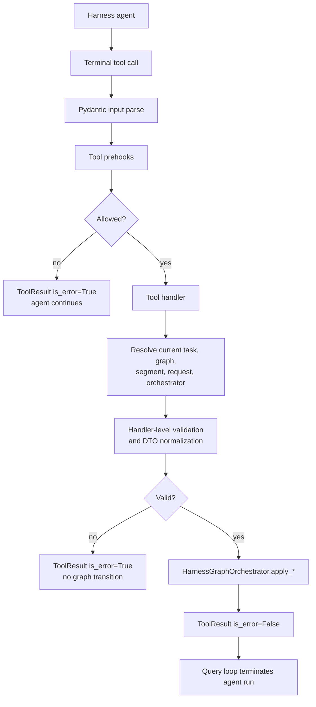
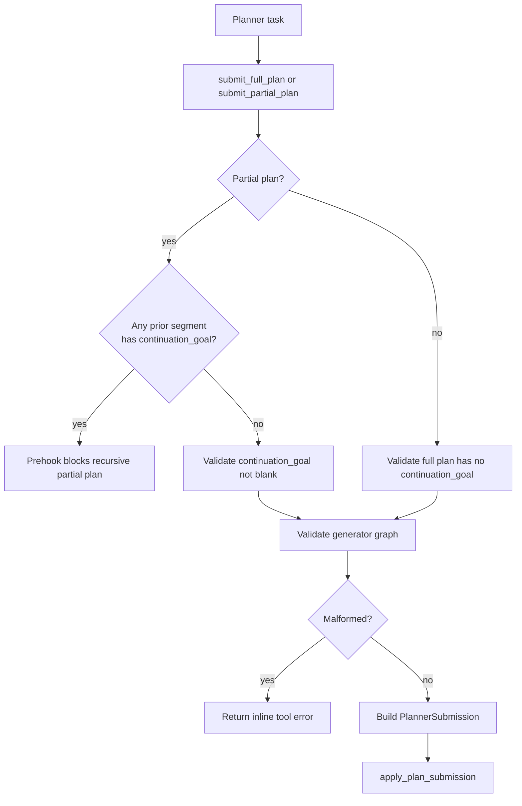
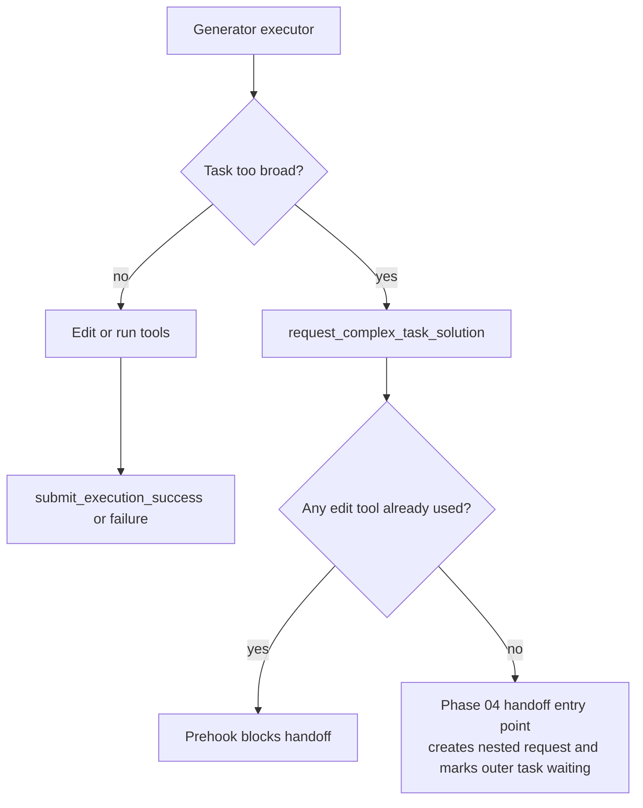

# Phase 03 - Implementation Plan

Companion to
[`phase-03-agent-roles-and-tool-gates.md`](./phase-03-agent-roles-and-tool-gates.md).
This document is the actionable build plan: workflow, folder layout, files,
classes, function signatures, gate behavior, test plan, and build waves.

It does not redefine the durable request / segment / graph model from Phase 01
or the single-graph orchestration behavior from Phase 02. It implements the
public terminal-tool layer that validates agent submissions, enforces role and
state gates, and routes accepted submissions into `HarnessGraphOrchestrator`.

---

## 1. Scope

Phase 03 ports agent role semantics and terminal-tool gates onto the
`ComplexTaskRequest` / `TaskSegment` / `HarnessGraph` state model.

Deliverables:

1. Registered terminal tools for planner, generator executor, generator
   verifier, and evaluator roles.
2. Canonical public executor handoff tool name:
   `request_complex_task_solution`.
3. Public Pydantic schemas for `submit_full_plan`,
   `submit_partial_plan`, generator success/failure, verifier
   success/failure, evaluator success/failure, and the complex-task handoff.
4. Shared submission-context resolution from the current task row to the active
   `HarnessGraphOrchestrator`.
5. Planner submission normalization into `PlannerSubmission`, including exact
   `task_specs` coverage and generator DAG validation.
6. Generator and evaluator terminal normalization into `GeneratorSubmission`
   and `EvaluatorSubmission`.
7. Hard prehooks for:
   - recursive partial-plan blocking,
   - `request_complex_task_solution` after-edit blocking,
   - resolver-limit success blocking,
   - role / graph / task ownership checks.
8. Soft notification rules aligned with the hard gates.
9. Agent prompt/tool-surface updates so executor uses
   `request_complex_task_solution` instead of `submit_request_plan`.
10. Focused tests covering inline handler rejection, prehook enforcement,
    terminal routing, soft reminders, and registration.

Not in scope:

- Creating and resuming nested complex-task requests after
  `request_complex_task_solution` succeeds. Phase 04 owns the handoff body,
  close-report delivery, and `waiting_complex_task` resume path.
- Durable restart recovery for missing in-process orchestrators. Phase 05 owns
  cutover and recovery semantics.
- Context-engine summaries, resolver-summary persistence, and detailed failure
  landscapes. Phase 06 owns rich evidence packets.
- Reintroducing legacy `submit_request_plan`, `submit_task_plan`,
  `declare_blocker`, `DeclareBlockerTool`, or conductor flows.

Phase 03 terminal tool failures are inline tool errors. They must not mark a
`HarnessGraph` failed and must not terminate the agent run. A successful
terminal call returns `ToolResult(is_error=False)` from a tool with
`is_terminal_tool=True`, causing the agent run to stop through the existing
query-loop terminal path.

---

## 2. Coherence verification

| Concept | Source docs | Phase 03 implementation stance | Verdict |
| --- | --- | --- | --- |
| Tool handlers read Phase 01 state | Phase 01, Phase 03 | Submission context resolves current task -> graph -> segment -> request via stores | OK |
| Terminal tools call Phase 02 direct apply surface | Phase 02, Phase 03 | Accepted handlers call `apply_plan_submission`, `apply_generator_submission`, or `apply_evaluator_submission` | OK |
| Full and partial plans share one orchestrator path | Phase 02, Phase 03 | Public handlers differ only in continuation validation and `kind` value | OK |
| Malformed planner DAG rejection is inline | Phase 02, Phase 03 | Tool handler returns `ToolResult(is_error=True)` before calling the orchestrator | OK |
| Recursive partial plan gate reads request lineage | Phase 01, Phase 03 | Prehook walks `ComplexTaskRequest.task_segment_ids` and segment `continuation_goal` | OK |
| `request_complex_task_solution` is a handoff, not failure | Phase 00, Phase 02, Phase 04 | Phase 03 exposes the canonical tool and gates it; Phase 04 fills request creation/resume behavior | OK |
| After-edit gate reads message history | Phase 03 | Prehook scans `conversation_messages` for edit tool use before allowing handoff | OK |
| Resolver success limits read message history | Phase 03, Phase 05 | Prehook blocks verifier/evaluator success at five unresolved resolver calls | OK |
| Evaluator spawn remains orchestrator-owned | Phase 02, Phase 03 | No public evaluator-spawn tool exists; Phase 03 only guards evaluator terminal submissions | OK |
| Attempt-budget gate remains segment-manager-owned | Phase 01, Phase 02, Phase 03 | Tool layer does not spend or inspect retry budget except for soft context where already exposed | OK |
| Failure terminals are never resolver-blocked | Phase 03 | Resolver-limit hooks attach only to success terminals | OK |

Two seams need explicit handling:

1. Terminal tools need current task and graph runtime metadata. Add typed
   `ExecutionMetadata` fields for harness task id, run id, graph id, and the
   `HarnessGraphRuntime` dependency bundle. The production harness launcher
   supplies those fields when spawning planner/generator/evaluator agents.
2. `request_complex_task_solution` has a Phase 03 public contract but a Phase 04
   body. In Phase 03, implement the tool name, schemas, registration, and gates;
   keep the actual handoff body behind a small injectable handler so Phase 04 can
   replace the placeholder without changing the public tool surface.

---

## 3. Workflow diagrams

### 3a. Terminal submission flow



### 3b. Planner submission routing



### 3c. Generator executor handoff gate



### 3d. Resolver limit gates

```text
verifier/evaluator turn begins
  |
  +-- soft rule sees unresolved resolver count = 4
  |     -> inject reminder: one unresolved resolver call remains before success is blocked
  |
  v
agent calls success terminal
  |
  +-- prehook counts unresolved resolver calls in conversation history
        |
        +-- count < 5 -> allow success handler
        |
        +-- count >= 5 -> block success; agent must submit failure
```

Failure terminals are intentionally outside this resolver gate:

```text
submit_verification_failure
submit_evaluation_failure
```

These remain available regardless of resolver count.

### 3e. Soft reminder flow

```text
top of model turn
  |
  v
notification rules inspect QueryContext + conversation_messages
  |
  +-- first edit already happened
  |     -> remind executor that request_complex_task_solution is disabled
  |
  +-- resolver unresolved count = 4
  |     -> warn verifier/evaluator before success is blocked
  |
  +-- request already used partial continuation
        -> remind planner to use submit_full_plan only
```

The soft layer never mutates tool registration or the system prompt. It emits
ordinary `<system-reminder>` transcript messages through the existing
notification-rule mechanism.

---

## 4. Folder layout

Phase 03 keeps terminal tools under the existing
`tools/submission/main_agent/` role tree and adds shared implementation helpers
at the `tools/submission/` package boundary.

```text
backend/src/tools/submission/
|-- __init__.py                              # EDIT: export make_submission_tools
|-- factory.py                               # NEW: register all TaskCenter submission tools
|-- context.py                               # NEW: resolve current task/request/segment/graph
|-- history.py                               # NEW: conversation history inspection helpers
|-- plan_validation.py                       # NEW: planner graph validation + normalization
|-- prehooks.py                              # NEW: hard gate hook classes
|-- reminders.py                             # NEW: notification-rule factories
|-- results.py                               # NEW: small success/error ToolResult helpers
|
|-- main_agent/
|   |-- planner/
|   |   |-- __init__.py                      # EDIT: export planner tools
|   |   |-- submit_full_plan.py              # EDIT: implement terminal tool
|   |   `-- submit_partial_plan.py           # EDIT: implement terminal tool
|   |
|   |-- generator/
|   |   |-- executor/
|   |   |   |-- __init__.py                  # EDIT: export executor tools
|   |   |   |-- request_complex_task_solution.py  # NEW: canonical handoff tool
|   |   |   |-- submit_execution_success.py  # EDIT: implement terminal tool
|   |   |   |-- submit_execution_failure.py  # EDIT: implement terminal tool
|   |   |   `-- submit_request_plan.py       # EDIT: legacy rejection or thin alias
|   |   |
|   |   `-- verifier/
|   |       |-- __init__.py                  # EDIT: export verifier tools
|   |       |-- submit_verification_success.py
|   |       `-- submit_verification_failure.py
|   |
|   `-- evaluator/
|       |-- __init__.py                      # EDIT: export evaluator tools
|       |-- submit_evaluation_success.py
|       `-- submit_evaluation_failure.py
```

Runtime metadata and registration:

```text
backend/src/tools/core/
|-- factory.py                               # EDIT: register make_submission_tools()
`-- runtime.py                               # EDIT: add typed harness metadata fields

backend/src/task_center/harness_graph/
`-- runtime.py                               # EDIT later if production launcher needs helper
```

Agent definitions:

```text
backend/src/agents/main_agent/
|-- planner/agent.md                         # EDIT: keep full/partial contract wording aligned
|-- generator/executor/agent.md              # EDIT: replace submit_request_plan
|-- generator/verifier/agent.md              # EDIT: resolver-limit wording if needed
`-- evaluator/agent.md                       # EDIT: resolver-limit wording if needed
```

Tests:

```text
backend/tests/test_tools/
|-- test_submission_tool_registration.py
|-- test_submission_plan_validation.py
|-- test_submission_tool_gates.py
|-- test_submission_terminal_routing.py
`-- test_submission_soft_reminders.py

backend/tests/task_center/lifecycle/
`-- test_phase03_submission_integration.py
```

---

## 5. Files and functions

### 5a. Runtime metadata

**`backend/src/tools/core/runtime.py`** - edit

Add typed fields used by more than one terminal tool and prehook:

```python
@dataclass
class ExecutionMetadata:
    # existing fields...

    task_center_run_id: str | None = None
    task_center_task_id: str | None = None
    task_center_harness_graph_id: str | None = None
    harness_graph_runtime: Any | None = None
```

Add the names to `_TYPED_FIELDS`.

The production harness agent launcher should set these values when it spawns a
planner, generator, or evaluator:

```python
ExecutionMetadata(
    task_center_run_id=launch.task_center_run_id,
    task_center_task_id=launch.task_id,
    task_center_harness_graph_id=launch.harness_graph_id,
    harness_graph_runtime=runtime,
)
```

Tests may inject the same metadata directly into `ToolExecutionContextService`.

### 5b. Submission context resolution

**`backend/src/tools/submission/context.py`** - new

```python
from dataclasses import dataclass
from typing import Literal

from task_center.complex_task.request import ComplexTaskRequest
from task_center.harness_graph.graph import HarnessGraph
from task_center.harness_graph.orchestrator import HarnessGraphOrchestrator
from task_center.harness_graph.runtime import HarnessGraphRuntime
from task_center.segment.segment import TaskSegment
from task_center.task import HarnessTaskRole
from tools.core.context import ToolExecutionContextService
from tools.core.results import ToolResult


SubmissionRole = Literal["planner", "generator", "evaluator"]


@dataclass(frozen=True, slots=True)
class HarnessSubmissionContext:
    runtime: HarnessGraphRuntime
    task: dict
    request: ComplexTaskRequest
    segment: TaskSegment
    graph: HarnessGraph
    orchestrator: HarnessGraphOrchestrator


def require_harness_runtime(
    context: ToolExecutionContextService,
) -> HarnessGraphRuntime: ...


def require_current_task_id(context: ToolExecutionContextService) -> str: ...


def resolve_harness_submission_context(
    context: ToolExecutionContextService,
    *,
    expected_role: HarnessTaskRole,
) -> HarnessSubmissionContext | ToolResult: ...


def ensure_task_matches_graph(
    task: dict,
    *,
    graph_id: str,
    expected_role: HarnessTaskRole,
) -> ToolResult | None: ...


def active_conversation_messages(context: ToolExecutionContextService) -> list: ...
```

Resolution flow:

```text
context.task_center_task_id
  -> TaskCenterStore.get_task(task_id)
  -> task["task_center_harness_graph_id"]
  -> HarnessGraphStore.get(graph_id)
  -> TaskSegmentStore.get(graph.task_segment_id)
  -> ComplexTaskRequestStore.get(segment.complex_task_request_id)
  -> HarnessGraphRuntime.orchestrator_registry.get_or_raise(graph_id)
```

If any required value is missing, return a user-facing `ToolResult` with
`is_error=True`; reserve `GraphInvariantViolation` for impossible internal
states inside lifecycle classes.

### 5c. Conversation history helpers

**`backend/src/tools/submission/history.py`** - new

```python
from dataclasses import dataclass
from typing import Any

from message.messages import ConversationMessage, ToolResultBlock, ToolUseBlock


EDIT_TOOL_NAMES: frozenset[str] = frozenset(
    {"write_file", "edit_file", "delete_file", "move_file", "shell"}
)
RESOLVER_REQUEST_TOOL = "ask_resolver"


@dataclass(frozen=True, slots=True)
class ToolCallRecord:
    tool_use_id: str
    name: str
    input: dict[str, Any]
    result: ToolResultBlock | None


def iter_tool_call_records(
    messages: list[ConversationMessage],
) -> tuple[ToolCallRecord, ...]: ...


def has_tool_call(
    messages: list[ConversationMessage],
    names: frozenset[str],
) -> bool: ...


def has_edit_tool_call(messages: list[ConversationMessage]) -> bool: ...


def unresolved_resolver_call_count(
    messages: list[ConversationMessage],
) -> int: ...


def _resolver_result_is_unresolved(result: ToolResultBlock | None) -> bool: ...
```

`unresolved_resolver_call_count` should prefer structured metadata from
`ask_resolver` results, for example `result.metadata["resolver"]["resolved"]`.
Until the resolver helper is implemented, fall back to parsing JSON output with
a top-level `resolved: false`. A missing resolver result should count as
unresolved for conservative gating.

The edit gate should treat mutating edit tools as edits. `shell` is included
because it can mutate the workspace. If this proves too broad, split it later
with shell command classification in the Daytona prehook package.

### 5d. Planner public schemas and validation

**`backend/src/tools/submission/plan_validation.py`** - new

```python
from dataclasses import dataclass
from typing import Literal

from pydantic import BaseModel, ConfigDict, Field

from task_center.task import PlannedGeneratorTask, PlannerSubmission
from tools.submission.context import HarnessSubmissionContext
from tools.core.results import ToolResult


class PlanTaskInput(BaseModel):
    model_config = ConfigDict(extra="forbid")

    id: str = Field(..., min_length=1)
    agent_name: str = Field(..., min_length=1)
    deps: list[str] = Field(default_factory=list)


class BasePlanInput(BaseModel):
    task_specification: str = Field(..., min_length=1)
    evaluation_criteria: list[str] = Field(..., min_length=1)
    tasks: list[PlanTaskInput] = Field(..., min_length=1)
    task_specs: dict[str, str] = Field(..., min_length=1)


class SubmitFullPlanInput(BasePlanInput):
    pass


class SubmitPartialPlanInput(BasePlanInput):
    continuation_goal: str = Field(..., min_length=1)


@dataclass(frozen=True, slots=True)
class NormalizedPlannerPlan:
    task_specification: str
    evaluation_criteria: tuple[str, ...]
    tasks: tuple[PlannedGeneratorTask, ...]
    continuation_goal: str | None


def normalize_planner_plan(
    tool_input: BasePlanInput,
    *,
    kind: Literal["full", "partial"],
) -> NormalizedPlannerPlan | ToolResult: ...


def validate_task_ids_unique(tasks: list[PlanTaskInput]) -> ToolResult | None: ...


def validate_task_specs_exact(
    tasks: list[PlanTaskInput],
    task_specs: dict[str, str],
) -> ToolResult | None: ...


def validate_known_generator_agents(
    tasks: list[PlanTaskInput],
) -> ToolResult | None: ...


def validate_generator_graph_shape(
    tasks: tuple[PlannedGeneratorTask, ...],
) -> ToolResult | None: ...


def build_planner_submission(
    submission_context: HarnessSubmissionContext,
    normalized: NormalizedPlannerPlan,
    *,
    kind: Literal["full", "partial"],
) -> PlannerSubmission: ...


def render_plan_summary(normalized: NormalizedPlannerPlan) -> str: ...
```

Validation rules:

- `tasks[*]` must contain exactly `id`, `agent_name`, and `deps`; Pydantic
  `extra="forbid"` enforces this.
- Task ids are nonblank and unique.
- `task_specs.keys()` exactly equals task ids: no missing specs and no extra
  specs.
- Every `task_specs` value is nonblank.
- `agent_name` resolves to a registered generator-capable agent definition.
  Initial allowed names should be `executor` and `verifier`, or any registered
  agent with role `executor` or `verifier`.
- Dependencies reference known task ids.
- Dependencies are acyclic. Reuse
  `task_center.harness_graph.task_graph.ordered_generator_tasks(...)` for the
  final check and convert `GraphInvariantViolation` into a `ToolResult` error.
- `submit_partial_plan` requires nonblank `continuation_goal`.
- `submit_full_plan` never sets a continuation goal.

### 5e. Hard gate prehooks

**`backend/src/tools/submission/prehooks.py`** - new

```python
from dataclasses import dataclass
from typing import Any

from pydantic import BaseModel

from task_center.task import HarnessTaskRole
from tools.core.context import ToolExecutionContextService
from tools.core.hooks import HookResult


@dataclass(frozen=True, slots=True)
class HarnessRoleGate:
    target_tool: str
    expected_role: HarnessTaskRole

    async def run(
        self,
        tool_input: BaseModel,
        context: ToolExecutionContextService,
    ) -> HookResult[Any]: ...


@dataclass(frozen=True, slots=True)
class RecursivePartialPlanGate:
    target_tool: str = "submit_partial_plan"

    async def run(
        self,
        tool_input: BaseModel,
        context: ToolExecutionContextService,
    ) -> HookResult[Any]: ...


@dataclass(frozen=True, slots=True)
class RequestComplexTaskBeforeEditGate:
    target_tool: str = "request_complex_task_solution"

    async def run(
        self,
        tool_input: BaseModel,
        context: ToolExecutionContextService,
    ) -> HookResult[Any]: ...


@dataclass(frozen=True, slots=True)
class ResolverSuccessLimitGate:
    target_tool: str
    limit: int = 5

    async def run(
        self,
        tool_input: BaseModel,
        context: ToolExecutionContextService,
    ) -> HookResult[Any]: ...
```

Gate behavior:

| Gate | Attached tools | Block condition |
| --- | --- | --- |
| `HarnessRoleGate` | all Phase 03 terminals | Current persisted task role does not match expected role, graph id does not match current task, or no active orchestrator exists |
| `RecursivePartialPlanGate` | `submit_partial_plan` | Any segment listed before the current segment in the current request has non-null `continuation_goal` |
| `RequestComplexTaskBeforeEditGate` | `request_complex_task_solution` | Current conversation history contains an edit tool call |
| `ResolverSuccessLimitGate` | `submit_verification_success`, `submit_evaluation_success` | `unresolved_resolver_call_count(messages) >= 5` |

Failure terminals deliberately do not receive `ResolverSuccessLimitGate`.

The prehooks should return short, direct reasons that tell the agent which
terminal path remains valid. Example:

```text
submit_partial_plan is disabled for this request because a prior segment already
used partial continuation. Submit a full plan for the current segment.
```

### 5f. Soft reminder rules

**`backend/src/tools/submission/reminders.py`** - new

```python
from notification.rules import NotificationRule


def make_recursive_partial_plan_reminder() -> NotificationRule: ...


def make_request_after_edit_reminder() -> NotificationRule: ...


def make_resolver_limit_reminder(*, warning_at: int = 4) -> NotificationRule: ...


def make_harness_gate_reminders() -> list[NotificationRule]: ...
```

Reminder triggers mirror hard gates but fire before the next provider request:

- Prior segment has a `continuation_goal`: remind planner that only
  `submit_full_plan` is valid.
- First edit has occurred in an executor run: remind executor that
  `request_complex_task_solution` is disabled and it must finish via execution
  success or failure.
- Resolver unresolved count reaches four: warn verifier/evaluator that success
  will be blocked after one more unresolved resolver call.

These rules should read the same helper functions as prehooks. They should use
`QueryContext.tool_metadata` for current harness metadata and
`conversation_messages` passed as the rule's message argument.

If the current static agent loader cannot express `NotificationRule` instances
from `agent.md`, attach these rules in the harness launcher by copying the
loaded `AgentDefinition` and appending `make_harness_gate_reminders()` before
calling `run_ephemeral_agent`.

### 5g. Terminal result helpers

**`backend/src/tools/submission/results.py`** - new

```python
from tools.core.results import ToolResult


def submission_error(reason: str, *, metadata: dict | None = None) -> ToolResult:
    return ToolResult(output=reason, is_error=True, metadata=metadata or {})


def submission_accepted(
    message: str,
    *,
    metadata: dict | None = None,
) -> ToolResult:
    return ToolResult(output=message, is_error=False, metadata=metadata or {})
```

Keep successful outputs plain text because the tools use `TextToolOutput`.
Include machine-readable metadata for tests and future UI:

```python
{
    "submission_kind": "planner_full" | "planner_partial" | ...,
    "task_center_task_id": "...",
    "harness_graph_id": "...",
}
```

### 5h. Planner terminal tools

**`backend/src/tools/submission/main_agent/planner/submit_full_plan.py`** - edit

```python
@tool(
    name="submit_full_plan",
    description="Submit a complete harness graph plan for the current segment.",
    input_model=SubmitFullPlanInput,
    output_model=TextToolOutput,
    is_terminal_tool=True,
    pre_hooks=(
        HarnessRoleGate("submit_full_plan", HarnessTaskRole.PLANNER),
    ),
)
async def submit_full_plan(
    task_specification: str,
    evaluation_criteria: list[str],
    tasks: list[PlanTaskInput],
    task_specs: dict[str, str],
    *,
    context: ToolExecutionContextService,
) -> ToolResult: ...
```

Handler flow:

1. Resolve `HarnessSubmissionContext` with expected role `PLANNER`.
2. Confirm current task id equals `graph.planner_task_id`.
3. Normalize and validate the plan with `kind="full"`.
4. Build `PlannerSubmission`.
5. Call `submission_context.orchestrator.apply_plan_submission(submission)`.
6. Return accepted `ToolResult`.

**`backend/src/tools/submission/main_agent/planner/submit_partial_plan.py`** - edit

```python
@tool(
    name="submit_partial_plan",
    description="Submit a bounded harness graph plan with a continuation goal.",
    input_model=SubmitPartialPlanInput,
    output_model=TextToolOutput,
    is_terminal_tool=True,
    pre_hooks=(
        HarnessRoleGate("submit_partial_plan", HarnessTaskRole.PLANNER),
        RecursivePartialPlanGate(),
    ),
)
async def submit_partial_plan(
    task_specification: str,
    evaluation_criteria: list[str],
    tasks: list[PlanTaskInput],
    task_specs: dict[str, str],
    continuation_goal: str,
    *,
    context: ToolExecutionContextService,
) -> ToolResult: ...
```

Handler flow matches `submit_full_plan` but passes `kind="partial"` and stamps
the nonblank `continuation_goal` into `PlannerSubmission`.

### 5i. Generator executor tools

**`backend/src/tools/submission/main_agent/generator/executor/submit_execution_success.py`** - edit

```python
class SubmitExecutionSuccessInput(BaseModel):
    summary: str = Field(..., min_length=1)
    artifacts: list[str] = Field(default_factory=list)


@tool(
    name="submit_execution_success",
    description="Submit successful completion of the current generator task.",
    input_model=SubmitExecutionSuccessInput,
    output_model=TextToolOutput,
    is_terminal_tool=True,
    pre_hooks=(
        HarnessRoleGate("submit_execution_success", HarnessTaskRole.GENERATOR),
    ),
)
async def submit_execution_success(
    summary: str,
    artifacts: list[str],
    *,
    context: ToolExecutionContextService,
) -> ToolResult: ...
```

Build:

```python
GeneratorSubmission(
    graph_id=submission_context.graph.id,
    task_id=submission_context.task["id"],
    outcome="success",
    summary=summary,
    payload={"generator_role": "executor", "artifacts": artifacts},
)
```

**`backend/src/tools/submission/main_agent/generator/executor/submit_execution_failure.py`** - edit

```python
class SubmitExecutionFailureInput(BaseModel):
    summary: str = Field(..., min_length=1)
    reason: str = Field(..., min_length=1)
    details: list[str] = Field(default_factory=list)
```

Build `GeneratorSubmission(outcome="failure", payload={"generator_role":
"executor", "reason": reason, "details": details})`.

**`backend/src/tools/submission/main_agent/generator/executor/request_complex_task_solution.py`** - new

```python
class RequestComplexTaskSolutionInput(BaseModel):
    goal: str = Field(..., min_length=1)


@tool(
    name="request_complex_task_solution",
    description=(
        "Request a nested complex-task solution for the current generator task. "
        "This must be called before making edits."
    ),
    input_model=RequestComplexTaskSolutionInput,
    output_model=TextToolOutput,
    is_terminal_tool=True,
    pre_hooks=(
        HarnessRoleGate("request_complex_task_solution", HarnessTaskRole.GENERATOR),
        RequestComplexTaskBeforeEditGate(),
    ),
)
async def request_complex_task_solution(
    goal: str,
    *,
    context: ToolExecutionContextService,
) -> ToolResult: ...
```

Phase 03 implementation options:

- Preferred: call an injected `complex_task_handoff_handler` from metadata if
  present. Phase 04 supplies this handler.
- Until Phase 04 lands: return an explicit `ToolResult(is_error=True)` saying
  the handoff body is not wired. The gates and registration can still be tested
  without pretending nested requests work.

Do not route this through `HarnessGraphOrchestrator.apply_generator_submission`.
It is not a generator success or failure outcome.

**`submit_request_plan.py`** - edit

Make the legacy tool a rejection or thin alias. The safer Phase 03 stance is
rejection:

```python
@tool(
    name="submit_request_plan",
    description="Deprecated. Use request_complex_task_solution.",
    input_model=DeprecatedSubmitRequestPlanInput,
    output_model=TextToolOutput,
)
async def submit_request_plan(...) -> ToolResult:
    return ToolResult(
        output="submit_request_plan is obsolete. Use request_complex_task_solution.",
        is_error=True,
    )
```

Do not list it in the executor agent terminals after Phase 03.

### 5j. Generator verifier tools

**`backend/src/tools/submission/main_agent/generator/verifier/submit_verification_success.py`** - edit

```python
class SubmitVerificationSuccessInput(BaseModel):
    summary: str = Field(..., min_length=1)
    checks: list[str] = Field(default_factory=list)


@tool(
    name="submit_verification_success",
    description="Submit successful verification of the current generator task.",
    input_model=SubmitVerificationSuccessInput,
    output_model=TextToolOutput,
    is_terminal_tool=True,
    pre_hooks=(
        HarnessRoleGate("submit_verification_success", HarnessTaskRole.GENERATOR),
        ResolverSuccessLimitGate("submit_verification_success"),
    ),
)
async def submit_verification_success(...) -> ToolResult: ...
```

Build `GeneratorSubmission(outcome="success", payload={"generator_role":
"verifier", "checks": checks})`.

**`submit_verification_failure.py`** - edit

```python
class SubmitVerificationFailureInput(BaseModel):
    summary: str = Field(..., min_length=1)
    unresolved_issues: list[str] = Field(default_factory=list)
```

Attach only `HarnessRoleGate`. Build
`GeneratorSubmission(outcome="failure", payload={"generator_role": "verifier",
"unresolved_issues": unresolved_issues})`.

### 5k. Evaluator tools

**`backend/src/tools/submission/main_agent/evaluator/submit_evaluation_success.py`** - edit

```python
class SubmitEvaluationSuccessInput(BaseModel):
    summary: str = Field(..., min_length=1)
    passed_criteria: list[str] = Field(default_factory=list)


@tool(
    name="submit_evaluation_success",
    description="Submit graph-level evaluation success.",
    input_model=SubmitEvaluationSuccessInput,
    output_model=TextToolOutput,
    is_terminal_tool=True,
    pre_hooks=(
        HarnessRoleGate("submit_evaluation_success", HarnessTaskRole.EVALUATOR),
        ResolverSuccessLimitGate("submit_evaluation_success"),
    ),
)
async def submit_evaluation_success(...) -> ToolResult: ...
```

Build `EvaluatorSubmission(outcome="success", payload={"passed_criteria":
passed_criteria})`.

**`submit_evaluation_failure.py`** - edit

```python
class SubmitEvaluationFailureInput(BaseModel):
    summary: str = Field(..., min_length=1)
    failed_criteria: list[str] = Field(default_factory=list)
```

Attach only `HarnessRoleGate`. Build
`EvaluatorSubmission(outcome="failure", payload={"failed_criteria":
failed_criteria})`.

### 5l. Submission tool factory and registration

**`backend/src/tools/submission/factory.py`** - new

```python
from tools.core.base import BaseTool
from tools.submission.main_agent.evaluator import (
    submit_evaluation_failure,
    submit_evaluation_success,
)
from tools.submission.main_agent.generator.executor import (
    request_complex_task_solution,
    submit_execution_failure,
    submit_execution_success,
    submit_request_plan,
)
from tools.submission.main_agent.generator.verifier import (
    submit_verification_failure,
    submit_verification_success,
)
from tools.submission.main_agent.planner import (
    submit_full_plan,
    submit_partial_plan,
)


def make_submission_tools() -> list[BaseTool]:
    return [
        submit_full_plan,
        submit_partial_plan,
        request_complex_task_solution,
        submit_execution_success,
        submit_execution_failure,
        submit_verification_success,
        submit_verification_failure,
        submit_evaluation_success,
        submit_evaluation_failure,
        submit_request_plan,
    ]
```

**`backend/src/tools/submission/__init__.py`** - edit

```python
from tools.submission.factory import make_submission_tools

__all__ = ["make_submission_tools"]
```

**`backend/src/tools/core/factory.py`** - edit

```python
def _register_builtins() -> None:
    from tools.submission import make_submission_tools
    # existing imports...

    _register_many(make_daytona_tools())
    _register_many(make_code_intelligence_tools())
    _register_many(make_submission_tools())
    register_tool_factory("run_subagent", make_subagent_tool_from_context)
```

Registering all submission tools globally is safe because agent definitions
still filter their tool surface to `allowed_tools | terminals`.

### 5m. Agent definitions

**`backend/src/agents/main_agent/generator/executor/agent.md`** - edit

Change:

```yaml
terminals:
  - submit_request_plan
  - submit_execution_success
  - submit_execution_failure
```

to:

```yaml
terminals:
  - request_complex_task_solution
  - submit_execution_success
  - submit_execution_failure
```

Update body text:

```md
If the task is too broad or needs a nested plan, call
`request_complex_task_solution` before making edits. After editing begins,
finish through execution success or execution failure.
```

Planner, verifier, and evaluator prompts should only receive small wording
updates if needed to mirror the hard gates:

- Planner: `submit_partial_plan` may be disabled after a previous segment used
  partial continuation.
- Verifier/evaluator: after too many unresolved resolver calls, success is
  blocked and the correct path is failure.

---

## 6. Gate details

### 6a. Recursive partial-plan gate

Algorithm:

```python
def request_has_prior_partial_continuation(
    request: ComplexTaskRequest,
    current_segment: TaskSegment,
    segment_store: TaskSegmentStore,
) -> bool:
    for segment_id in request.task_segment_ids:
        if segment_id == current_segment.id:
            return False
        segment = segment_store.get(segment_id)
        if segment is not None and segment.continuation_goal is not None:
            return True
    return False
```

The gate should consider only segments before the current segment in the
request order. A current open segment's `continuation_goal` should normally be
null; if it is already non-null, that is an invariant problem elsewhere.

### 6b. Planner graph validation

The handler validates public user input before state mutation:

| Invalid shape | Result |
| --- | --- |
| Duplicate task id | `ToolResult(is_error=True, output="Plan contains duplicate task id ...")` |
| Unknown agent name | `ToolResult(is_error=True, output="Unknown generator agent ...")` |
| Missing task spec | `ToolResult(is_error=True, output="Missing task_specs for ...")` |
| Extra task spec | `ToolResult(is_error=True, output="task_specs contains unknown ids ...")` |
| Blank task spec | `ToolResult(is_error=True, output="Task spec for ... is blank")` |
| Dangling dependency | `ToolResult(is_error=True, output="Task ... depends on unknown task ...")` |
| Dependency cycle | `ToolResult(is_error=True, output="Plan contains a dependency cycle")` |
| Blank partial continuation goal | Pydantic error before handler |

None of these errors should call `HarnessGraphOrchestrator.apply_plan_submission`.

### 6c. After-edit gate

The gate scans `conversation_messages` for tool uses whose name is in
`EDIT_TOOL_NAMES`. If found, it blocks `request_complex_task_solution`.

This gate is intentionally about the current executor agent run, not durable
workspace state. A prior graph or sibling task may have edited; that does not
disable this executor's ability to hand off before its own first edit.

### 6d. Resolver success gate

The gate applies only to success terminals:

```text
submit_verification_success
submit_evaluation_success
```

If unresolved resolver count is four, the soft reminder warns. If count is five
or more, the success terminal is blocked. The agent can still:

```text
submit_verification_failure
submit_evaluation_failure
```

### 6e. Role and ownership gate

`HarnessRoleGate` should verify:

- `harness_graph_runtime` exists in metadata.
- `task_center_task_id` exists in metadata.
- `TaskCenterStore.get_task(task_id)` returns a row.
- task row `role` matches the expected structural role:
  `planner`, `generator`, or `evaluator`.
- task row `task_center_harness_graph_id` matches
  `task_center_harness_graph_id` metadata when metadata provides it.
- active graph is not closed.
- active orchestrator exists in the process-local registry.

More specific task-id checks remain in handlers:

- planner handler checks `task_id == graph.planner_task_id`,
- evaluator handler checks `task_id == graph.evaluator_task_id`,
- generator handlers rely on `assert_generator_task_for_submission` inside the
  orchestrator after context resolution.

---

## 7. Class summary

| Layer | Class/function | New / edited | Responsibility |
| --- | --- | --- | --- |
| Runtime | `ExecutionMetadata.task_center_run_id` | EDIT | Current TaskCenter run id for harness agents |
| Runtime | `ExecutionMetadata.task_center_task_id` | EDIT | Current planner/generator/evaluator task id |
| Runtime | `ExecutionMetadata.task_center_harness_graph_id` | EDIT | Current graph id for terminal routing |
| Runtime | `ExecutionMetadata.harness_graph_runtime` | EDIT | Store + registry dependency bundle for tools |
| Tool factory | `make_submission_tools` | NEW | Registers all TaskCenter submission tools |
| Submission context | `HarnessSubmissionContext` | NEW | Current task, request, segment, graph, orchestrator |
| Submission context | `resolve_harness_submission_context` | NEW | Common store walk and active orchestrator lookup |
| History | `iter_tool_call_records` | NEW | Pair tool uses and results from conversation history |
| History | `has_edit_tool_call` | NEW | After-edit gate input |
| History | `unresolved_resolver_call_count` | NEW | Resolver success gate input |
| Plan validation | `PlanTaskInput` | NEW | Public planner DAG node schema |
| Plan validation | `SubmitFullPlanInput` | NEW | Public full-plan schema |
| Plan validation | `SubmitPartialPlanInput` | NEW | Public partial-plan schema |
| Plan validation | `normalize_planner_plan` | NEW | Public input -> planned generator task DTOs |
| Plan validation | `build_planner_submission` | NEW | Normalized plan -> `PlannerSubmission` |
| Hooks | `HarnessRoleGate` | NEW | Common role, graph, and orchestrator existence gate |
| Hooks | `RecursivePartialPlanGate` | NEW | Blocks recursive partial continuation |
| Hooks | `RequestComplexTaskBeforeEditGate` | NEW | Blocks complex-task handoff after edits |
| Hooks | `ResolverSuccessLimitGate` | NEW | Blocks success terminals at resolver limit |
| Reminders | `make_harness_gate_reminders` | NEW | Soft reminder rules matching hard gates |
| Planner tools | `submit_full_plan` | EDIT | Validate and call `apply_plan_submission(kind="full")` |
| Planner tools | `submit_partial_plan` | EDIT | Validate and call `apply_plan_submission(kind="partial")` |
| Executor tools | `request_complex_task_solution` | NEW | Canonical handoff surface; body completed in Phase 04 |
| Executor tools | `submit_execution_success` / `submit_execution_failure` | EDIT | Normalize executor outcome into `GeneratorSubmission` |
| Verifier tools | `submit_verification_success` / `submit_verification_failure` | EDIT | Normalize verifier outcome into `GeneratorSubmission` |
| Evaluator tools | `submit_evaluation_success` / `submit_evaluation_failure` | EDIT | Normalize evaluator outcome into `EvaluatorSubmission` |
| Agent defs | executor `agent.md` | EDIT | Replace `submit_request_plan` with `request_complex_task_solution` |

---

## 8. Test plan

### 8a. Registration and schema tests

| Test | Purpose |
| --- | --- |
| `test_submission_tools_registered` | `has_tool(...)` is true for every Phase 03 public terminal |
| `test_submission_tools_are_terminal_except_legacy_request_plan` | New terminal tools set `is_terminal_tool=True`; legacy rejection is non-terminal or absent from agent defs |
| `test_plan_task_input_rejects_extra_keys` | Planner nodes contain exactly `id`, `agent_name`, `deps` |
| `test_executor_agent_uses_request_complex_task_solution` | Executor agent definition no longer lists `submit_request_plan` |

### 8b. Planner validation tests

| Test | Purpose |
| --- | --- |
| `test_full_plan_routes_to_apply_plan_submission` | Valid full plan builds `PlannerSubmission(kind="full")` |
| `test_partial_plan_routes_to_apply_plan_submission` | Valid partial plan includes `continuation_goal` |
| `test_plan_rejects_duplicate_task_ids` | Inline error, no orchestrator call |
| `test_plan_rejects_unknown_agent_name` | Inline error, no orchestrator call |
| `test_plan_rejects_missing_task_spec` | Exact coverage check |
| `test_plan_rejects_extra_task_spec` | Exact coverage check |
| `test_plan_rejects_dangling_dependency` | Dependency validity |
| `test_plan_rejects_dependency_cycle` | DAG acyclicity |
| `test_partial_plan_rejects_blank_continuation_goal` | Pydantic or normalization error |

### 8c. Hard gate tests

| Test | Purpose |
| --- | --- |
| `test_recursive_partial_plan_gate_blocks_after_prior_continuation` | Walks request segment ids and blocks partial plan |
| `test_recursive_partial_plan_gate_allows_initial_segment` | No false positive before a prior continuation |
| `test_request_complex_task_solution_blocks_after_edit` | Edit history disables handoff |
| `test_request_complex_task_solution_allows_before_edit` | No edit history allows gate to pass |
| `test_resolver_success_gate_warn_boundary_not_blocking` | Count 4 does not block hard prehook |
| `test_resolver_success_gate_blocks_at_limit` | Count 5 blocks success |
| `test_resolver_success_gate_does_not_block_failure_terminal` | Failure terminal remains available |
| `test_role_gate_blocks_wrong_task_role` | Planner cannot call generator/evaluator terminal, etc. |
| `test_role_gate_blocks_missing_orchestrator` | Missing process-local orchestrator is a tool error |

### 8d. Terminal routing tests

| Test | Purpose |
| --- | --- |
| `test_submit_execution_success_calls_apply_generator_submission` | Executor success normalized correctly |
| `test_submit_execution_failure_calls_apply_generator_submission` | Executor failure normalized correctly |
| `test_submit_verification_success_calls_apply_generator_submission` | Verifier success normalized with resolver gate |
| `test_submit_verification_failure_calls_apply_generator_submission` | Verifier failure is ungated by resolver limit |
| `test_submit_evaluation_success_calls_apply_evaluator_submission` | Evaluator success normalized correctly |
| `test_submit_evaluation_failure_calls_apply_evaluator_submission` | Evaluator failure normalized correctly |
| `test_tool_error_does_not_terminate_agent_run` | Error result from terminal tool is not stamped as terminal |
| `test_tool_success_terminates_agent_run` | Successful terminal result receives `does_terminate=True` |

### 8e. Soft reminder tests

| Test | Purpose |
| --- | --- |
| `test_recursive_partial_plan_reminder_fires` | Prior continuation emits planner reminder |
| `test_after_edit_reminder_fires_once` | First edit emits executor handoff-disabled reminder |
| `test_resolver_limit_reminder_fires_at_four` | Warning emitted before success is blocked |
| `test_hard_and_soft_gates_share_history_helpers` | Regression guard against drift |

### 8f. Integration tests

Use the existing Phase 02 fake launcher/orchestrator setup:

| Test | Purpose |
| --- | --- |
| `test_phase03_full_plan_through_evaluator_success` | Tool calls drive graph to request success |
| `test_phase03_generator_failure_routes_to_retry` | Generator failure terminal lets segment manager retry |
| `test_phase03_malformed_plan_does_not_close_graph` | Inline rejection keeps graph in planning |
| `test_phase03_recursive_partial_plan_blocks_second_segment_partial` | Continuation planner must use full plan |

Recommended commands:

```bash
uv run pytest backend/tests/test_tools/test_submission_tool_registration.py -q
uv run pytest backend/tests/test_tools/test_submission_plan_validation.py -q
uv run pytest backend/tests/test_tools/test_submission_tool_gates.py -q
uv run pytest backend/tests/test_tools/test_submission_terminal_routing.py -q
uv run pytest backend/tests/test_tools/test_submission_soft_reminders.py -q
uv run pytest backend/tests/task_center/lifecycle/test_phase03_submission_integration.py -q
uv run ruff check backend/src/tools/submission backend/src/tools/core backend/src/agents/main_agent backend/tests/test_tools backend/tests/task_center
uv run mypy --config-file backend/mypy.ini backend/src/task_center backend/src/agents
```

---

## 9. Build order (waves)

Each wave is independently committable. Keep tests focused per wave before
moving to the next one.

### Wave 1 - Runtime metadata and registration

1. Add harness fields to `ExecutionMetadata`.
2. Add `tools/submission/factory.py` and register submission tools in
   `tools/core/factory.py`.
3. Replace terminal stubs with decorated no-op/rejection tools where needed so
   schemas and terminal flags are visible.
4. Add registration/schema tests.

### Wave 2 - Shared context and history helpers

1. Create `tools/submission/context.py`.
2. Create `tools/submission/history.py`.
3. Add tests for current task -> graph -> request resolution.
4. Add tests for edit detection and resolver unresolved-count parsing.

### Wave 3 - Planner plan validation

1. Create `tools/submission/plan_validation.py`.
2. Implement exact task spec coverage, known agent checks, and DAG validation.
3. Implement `submit_full_plan` and `submit_partial_plan` handlers.
4. Add planner validation and routing tests.

### Wave 4 - Generator and evaluator terminal handlers

1. Implement executor success/failure terminals.
2. Implement verifier success/failure terminals.
3. Implement evaluator success/failure terminals.
4. Add direct routing tests for `GeneratorSubmission` and
   `EvaluatorSubmission`.

### Wave 5 - Hard gates

1. Implement `HarnessRoleGate`.
2. Implement `RecursivePartialPlanGate`.
3. Implement `RequestComplexTaskBeforeEditGate`.
4. Implement `ResolverSuccessLimitGate`.
5. Attach gates to the relevant tools.
6. Add prehook enforcement tests.

### Wave 6 - Soft reminders and agent prompt updates

1. Implement `tools/submission/reminders.py`.
2. Wire reminders into harness agent launches or copied agent definitions.
3. Update executor `agent.md` from `submit_request_plan` to
   `request_complex_task_solution`.
4. Add reminder tests and agent-definition tests.

### Wave 7 - Integration smoke

1. Use fake launcher + active orchestrator registry to run a valid full-plan
   graph through terminal tools.
2. Verify malformed plan rejection leaves the graph in planning.
3. Verify generator/evaluator failure terminals still route graph failures to
   `TaskSegmentManager`.
4. Run all Phase 03 test commands.

---

## 10. Phase 03 exit criteria mapping

| Phase 03 exit criterion | Verified by |
| --- | --- |
| Every terminal or orchestration request is accepted or rejected from the new state model | `test_role_gate_blocks_wrong_task_role`, terminal routing tests |
| Recursive partial plan is blocked across `TaskSegment` continuation lineage | `test_recursive_partial_plan_gate_blocks_after_prior_continuation` |
| `request_complex_task_solution` is blocked after executor edits | `test_request_complex_task_solution_blocks_after_edit` |
| Resolver unresolved-count gates force failure at the limit | `test_resolver_success_gate_blocks_at_limit` and failure-terminal test |
| Malformed plans fail inline without marking the harness graph failed | planner validation tests and integration smoke |
| Accepted planner submissions persist graph contract through orchestrator | full/partial planner routing tests |
| Accepted generator and evaluator terminals use Phase 02 apply surface | generator/evaluator routing tests |
| Soft reminders match hard prehook behavior | soft reminder tests |
| Executor public contract uses `request_complex_task_solution` | agent-definition registration test |

---

## 11. Risks and open questions

### 11a. Production launcher metadata

The terminal tools require `task_center_task_id`, graph id, and
`harness_graph_runtime` in `ExecutionMetadata`. Tests can inject these values,
but production correctness depends on the harness launcher setting them for
each spawned planner, generator, and evaluator run.

Mitigation: make `HarnessRoleGate` fail loudly with a user-facing tool error
when metadata is missing, and add a launcher-focused integration test once the
production launcher exists.

### 11b. Resolver result shape is not implemented yet

`ask_resolver` is currently a stub. Phase 03 can implement count parsing against
the intended metadata shape and a JSON fallback, but final resolver semantics
may shift when helper-agent execution is implemented.

Mitigation: keep resolver history parsing in one file and cover it with tests
using both metadata and JSON-output fixtures.

### 11c. `shell` as an edit tool may be conservative

The after-edit gate treats any `shell` call as an edit because shell can mutate
the workspace. This may block legitimate before-edit diagnostics executed via
shell.

Mitigation: start conservative. If this hurts real workflows, reuse Daytona
shell prehook command classification to distinguish read-only shell commands.

### 11d. Legacy `submit_request_plan`

Current executor prompt/tool stubs still mention `submit_request_plan`. Phase
03 should move the public agent contract to `request_complex_task_solution`.

Mitigation: leave a rejection tool or alias in place for compatibility, but do
not list it in the executor agent's terminal set.

### 11e. Handler-level validation vs orchestrator invariants

Planner handler validation returns user-facing `ToolResult` errors. The
orchestrator still raises `GraphInvariantViolation` for impossible internal
states. Avoid duplicating all orchestrator checks in the tool layer.

Mitigation: validate public input shape in `plan_validation.py`; let
orchestrator assertions protect persisted state and stage correctness.

### 11f. Soft reminders can drift from hard gates

The soft layer is advisory. If it reimplements logic separately, it can drift.

Mitigation: both reminders and prehooks must call the same helpers in
`context.py` and `history.py`; add tests that compare representative hard and
soft conditions.

### 11g. `request_complex_task_solution` body is Phase 04

The Phase 03 tool can expose the public name and gates before the nested
request handoff works. A successful terminal handoff should not be faked.

Mitigation: inject the Phase 04 handoff handler through metadata. Until that is
present, return an explicit non-terminal error from the handler after gates
pass.

---

## 12. References

- [Task Center Harness Migration - Phase Index](../task-center-harness-migration.md)
- [Complex Task Segmentation and Harness Graph Workflow](./complex-task-workflow-overview.md)
- [Phase 01 - Complex Task Request and Harness Graph Model](./phase-01-graph-and-attempt-model.md)
- [Phase 01 - Implementation Plan](./phase-01-implementation-plan.md)
- [Phase 02 - Harness Graph Orchestrator Lifecycle](./phase-02-harness-graph-orchestrator-lifecycle.md)
- [Phase 02 - Implementation Plan](./phase-02-implementation-plan.md)
- [Phase 03 - Agent Roles and Tool Gates](./phase-03-agent-roles-and-tool-gates.md)
- [Phase 04 - Complex Task Spawning and Handoff](./phase-04-complex-task-spawning-and-handoff.md)
