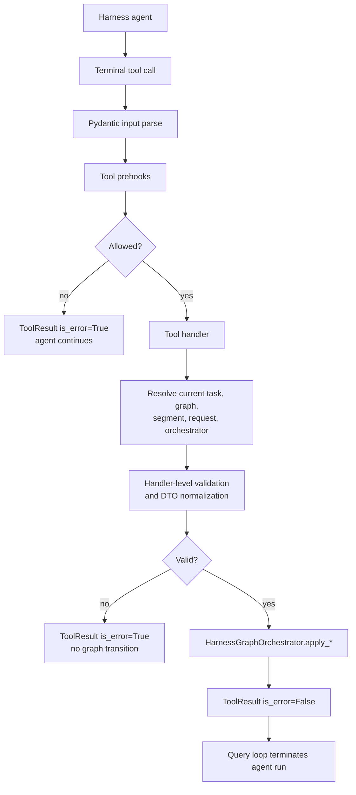
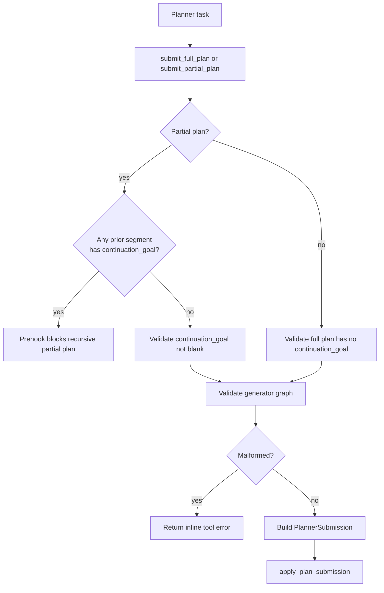
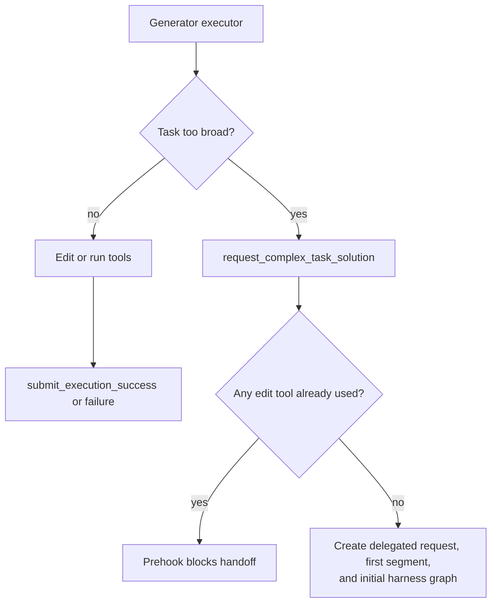
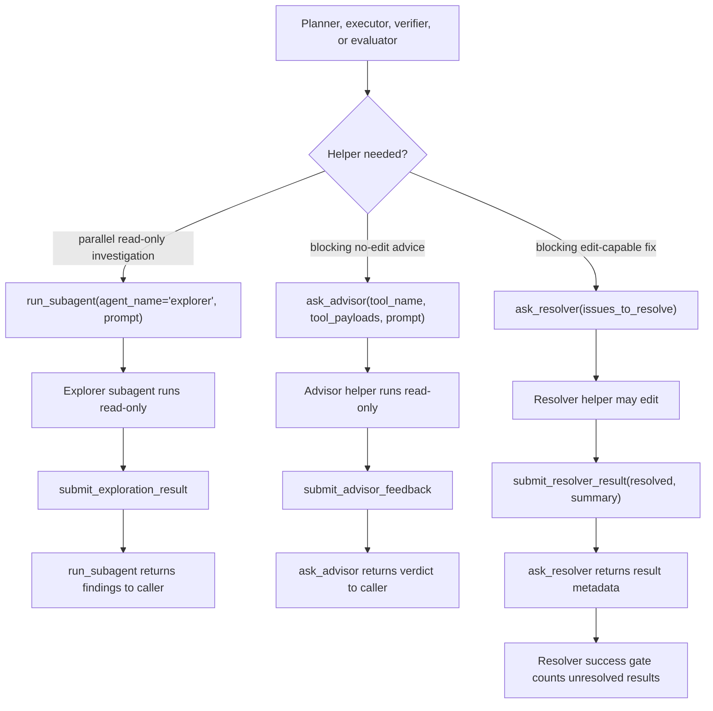
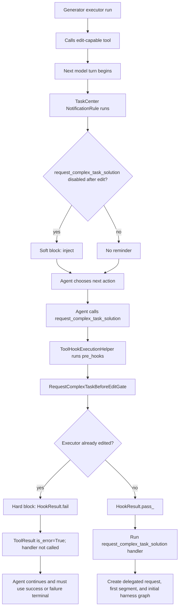

# Phase 03 - Implementation Plan

Companion to
[`phase-03-agent-roles-and-tool-gates.md`](./phase-03-agent-roles-and-tool-gates.md).
This document is the actionable build plan: workflow, folder layout, files,
classes, function signatures, gate behavior, test plan, and build waves.

It does not redefine the durable request / segment / graph model from Phase 01
or the single-graph orchestration behavior from Phase 02. It implements the
public terminal-tool layer that validates agent submissions, enforces role and
state gates, and routes accepted submissions into `HarnessGraphOrchestrator`.

---

## 1. Scope

Phase 03 ports agent role semantics and terminal-tool gates onto the
`ComplexTaskRequest` / `TaskSegment` / `HarnessGraph` state model.

Deliverables:

1. Registered terminal tools for planner, generator executor, generator
   verifier, evaluator, helper-agent, and explorer subagent roles.
2. Canonical public executor handoff tool name:
   `request_complex_task_solution`.
3. Public Pydantic schemas for `submit_full_plan`,
   `submit_partial_plan`, generator success/failure, verifier
   success/failure, evaluator success/failure, helper request/response tools,
   explorer findings, and the complex-task handoff.
4. Blocking helper tools for `ask_advisor` and `ask_resolver`, plus helper
   terminals `submit_advisor_feedback` and `submit_resolver_result`.
5. Explorer subagent terminal `submit_exploration_result` so `run_subagent`
   can return read-only findings through the existing terminal-result channel.
6. Per-tool and per-hook state resolution from the current task row to the
   active `HarnessGraphOrchestrator`.
7. Planner submission normalization into `PlannerSubmission`, including exact
   `task_specs` coverage and generator DAG validation.
8. Generator and evaluator terminal normalization into `GeneratorSubmission`
   and `EvaluatorSubmission`.
9. Hard gates implemented as ordinary `ToolPreHook` instances attached through
   `BaseTool.pre_hooks` and executed by the existing
   `ToolHookExecutionHelper` for:
   - recursive partial-plan blocking,
   - `request_complex_task_solution` after-edit blocking,
   - resolver-limit success blocking,
   - role / graph / task ownership checks.
10. Soft notification rules implemented beside the TaskCenter submission tools
    and dispatched through the existing `notification.rules` system-reminder
    path, aligned with the hard gates.
11. Canonical executor handoff name implemented as
   `request_complex_task_solution`, wired through the TaskCenter request /
   segment lifecycle runtime.
12. Focused tests covering inline handler rejection, prehook enforcement,
    terminal routing, helper/subagent result delivery, soft reminders, and
    registration.

Not in scope:

- Building rich helper-agent context packets. Phase 03 can pass caller-supplied
  prompts and payloads; Phase 06 can replace those with context-engine packets.
- Durable restart recovery for missing in-process orchestrators. Phase 05 owns
  cutover and recovery semantics.
- Context-engine summaries, resolver-summary persistence, and detailed failure
  landscapes. Phase 06 owns rich evidence packets.
- Reintroducing legacy `submit_request_plan`, `submit_task_plan`,
  `declare_blocker`, `DeclareBlockerTool`, or conductor flows.

Phase 03 terminal tool failures are inline tool errors. They must not mark a
`HarnessGraph` failed and must not terminate the agent run. A successful
terminal call returns `ToolResult(is_error=False)` from a tool with
`is_terminal_tool=True`, causing the agent run to stop through the existing
query-loop terminal path.

---

## 2. Coherence verification

| Concept | Source docs | Phase 03 implementation stance | Verdict |
| --- | --- | --- | --- |
| Tool handlers read Phase 01 state | Phase 01, Phase 03 | Each handler or hook resolves current task -> graph -> segment -> request via stores as needed | OK |
| Terminal tools call Phase 02 direct apply surface | Phase 02, Phase 03 | Accepted handlers call `apply_plan_submission`, `apply_generator_submission`, or `apply_evaluator_submission` | OK |
| Full and partial plans share one orchestrator path | Phase 02, Phase 03 | Public handlers differ only in continuation validation and `kind` value | OK |
| Malformed planner DAG rejection is inline | Phase 02, Phase 03 | Tool handler returns `ToolResult(is_error=True)` before calling the orchestrator | OK |
| Recursive partial plan gate reads request lineage | Phase 01, Phase 03 | Prehook walks `ComplexTaskRequest.task_segment_ids` and segment `continuation_goal` | OK |
| `request_complex_task_solution` is a handoff, not failure | Phase 00, Phase 02, Phase 04 | Phase 03 exposes the canonical tool and gates it; Phase 04 fills request creation/resume behavior | OK |
| After-edit gate reads message history | Phase 03 | Notification rules inspect the live `messages` argument passed by `dispatch_rules`; prehooks read the per-call `ExecutionMetadata.conversation_messages` copy before allowing handoff | OK |
| Resolver success limits read message history | Phase 03, Phase 05 | The existing query-loop message flow lets prehooks block verifier/evaluator success at five unresolved resolver calls without adding a second transcript owner | OK |
| Evaluator spawn remains orchestrator-owned | Phase 02, Phase 03 | No public evaluator-spawn tool exists; Phase 03 only guards evaluator terminal submissions | OK |
| Attempt-budget gate remains segment-manager-owned | Phase 01, Phase 02, Phase 03 | Tool layer does not spend or inspect retry budget except for soft context where already exposed | OK |
| Failure terminals are never resolver-blocked | Phase 03 | Resolver-limit hooks attach only to success terminals | OK |
| Helper agents are not TaskCenter graph nodes | Phase 03 | `ask_advisor`, `ask_resolver`, and `run_subagent` create helper/subagent runs whose terminal output returns to the caller, not graph lifecycle tasks | OK |
| Resolver count gate has a concrete source | Phase 03, Phase 05 | `ask_resolver` result metadata records whether a resolver call remains unresolved | OK |
| Hard gates reuse existing prehook execution | Existing tool core, Phase 03 | TaskCenter-specific gate classes implement `ToolPreHook`, return `HookResult`, and are attached on each decorated tool; `ToolHookExecutionHelper` remains the only runner | OK |
| Soft gates reuse existing system reminders | Existing notification package, Phase 03 | TaskCenter reminder factories live beside submission tools, produce `NotificationRule` objects, and emit through `SystemNotificationService` via `notification.rules.dispatch_rules` | OK |

Two seams need explicit handling:

1. Terminal tools need current task identity and graph runtime dependencies.
   Add `QueryContext.task_center_task_id` plus matching
   `ExecutionMetadata.task_center_task_id`. The production harness launcher
   supplies that value when spawning planner/generator/evaluator agents. Graph
   id is derived from the persisted task row, not trusted as a second required
   metadata field.
2. `request_complex_task_solution` needs process-local graph runtime
   dependencies. The tool resolves the current `HarnessGraphRuntime`, creates
   the delegated request and first segment through `ComplexTaskRequestHandler`,
   marks the requesting executor task `waiting_complex_task`, and creates the
   delegated segment's initial `HarnessGraph`.
3. Helper-agent tools are blocking helper runs rather than TaskCenter graph
   nodes. They should use `run_ephemeral_agent(...)` and return the helper's
   terminal `ToolResult` to the caller. They should not call
   `HarnessGraphOrchestrator.apply_*` and should not mutate graph state.

---

## 3. Workflow diagrams

### 3a. Terminal submission flow



### 3b. Planner submission routing



### 3c. Generator executor handoff gate



### 3d. Resolver limit gates

```text
verifier/evaluator turn begins
  |
  +-- soft rule sees unresolved resolver count = 4
  |     -> inject reminder: one unresolved resolver call remains before success is blocked
  |
  v
agent calls success terminal
  |
  +-- prehook counts unresolved resolver calls in conversation history
        |
        +-- count < 5 -> allow success handler
        |
        +-- count >= 5 -> block success; agent must submit failure
```

Failure terminals are intentionally outside this resolver gate:

```text
submit_verification_failure
submit_evaluation_failure
```

These remain available regardless of resolver count.

### 3e. Helper-agent and explorer flows



Helper and explorer runs are not `HarnessGraph` DAG nodes. They are scoped to
the calling agent run and return through their own terminal tools. The caller
then decides whether to submit a normal graph terminal.

### 3f. Soft reminder flow

```text
top of model turn
  |
  v
notification rules inspect the live messages list passed by dispatch_rules
  |
  +-- first edit already happened
  |     -> remind executor that request_complex_task_solution is disabled
  |
  +-- resolver unresolved count = 4
  |     -> warn verifier/evaluator before success is blocked
  |
  +-- request already used partial continuation
        -> remind planner to use submit_full_plan only
```

The soft layer never mutates tool registration or the system prompt. It emits
ordinary `<system-reminder>` transcript messages through the existing
notification-rule mechanism.

### 3g. Per-tool soft and hard block example

`request_complex_task_solution` is a per-tool gate. It is available only while
the generator executor has not edited the workspace. The soft reminder and hard
prehook each infer the same condition from injected run history:

```python
executor_has_edited(messages)
```

Soft block:

1. The executor calls an edit-capable tool such as `edit_file`, `write_file`,
   `delete_file`, `move_file`, or `shell`.
2. On the next model turn, the TaskCenter reminder rule for
   `request_complex_task_solution` inspects its `messages` argument.
3. If its local state inference says the executor has edited, it injects a
   `<system-reminder>` telling the executor that
   `request_complex_task_solution` is disabled and the valid terminal choices
   are now `submit_execution_success` or `submit_execution_failure`.
4. The agent may still ignore this reminder; no tool execution is blocked by
   the soft layer.

Hard block:

1. The agent calls `request_complex_task_solution`.
2. `ToolHookExecutionHelper` runs that tool's `pre_hooks`.
3. `RequestComplexTaskBeforeEditGate` infers the same condition from the
   per-call `ExecutionMetadata.conversation_messages` copy.
4. If the predicate is true, the prehook returns `HookResult.fail(...)`.
5. `ToolHookExecutionHelper` converts the failed prehook into
   `ToolResult(is_error=True)`, does not call the tool handler, and the agent
   run continues.



Tool registration shape:

```python
@tool(
    name="request_complex_task_solution",
    input_model=RequestComplexTaskSolutionInput,
    output_model=TextToolOutput,
    pre_hooks=(RequestComplexTaskBeforeEditGate(),),
)
async def request_complex_task_solution(...):
    ...
```

The corresponding notification rule is declared in the executor `agent.md` via
`notification_triggers: [request_complex_task_after_edit]` and resolved when
launching the executor agent. Its implementation lives in
`tools/submission/notification_triggers/request_complex_task_after_edit.py`. It
is not attached to the tool object; the hard prehook is attached on the tool.

---

## 4. Folder layout

Phase 03 keeps terminal tools under the existing
`tools/submission/main_agent/` role tree and adds shared implementation helpers
at the `tools/submission/` package boundary. It must not add a second hook or
reminder framework: hard gates use `tools.core.hooks` and the existing tool
hook runner; soft reminders are TaskCenter-specific `NotificationRule`
factories that live beside the submission tools and run through
`notification.rules.dispatch_rules`.

```text
backend/src/tools/submission/
|-- __init__.py                              # EDIT: export make_submission_tools
|-- context.py                               # NEW: resolve task -> graph -> segment -> request -> orchestrator
|-- factory.py                               # NEW: register all TaskCenter submission tools
|
|-- hooks/
|   |-- __init__.py                          # NEW: export hard gate hooks
|   |-- harness_role_gate.py                 # NEW: role / graph / orchestrator ownership gate
|   |-- recursive_partial_plan_gate.py       # NEW: submit_partial_plan lineage gate
|   |-- request_complex_task_before_edit_gate.py  # NEW: executor handoff after-edit gate
|   |-- resolver_success_limit_gate.py       # NEW: verifier/evaluator success limit gate
|   |-- helper_request_gate.py               # NEW: helper request caller role gate
|   `-- helper_role_gate.py                  # NEW: helper/subagent terminal role gate
|
|-- notification_triggers/
|   |-- __init__.py                          # NEW: export soft trigger factories
|   |-- recursive_partial_plan.py            # NEW: planner partial-plan reminder trigger
|   |-- request_complex_task_after_edit.py   # NEW: executor handoff-disabled reminder trigger
|   `-- resolver_limit.py                    # NEW: verifier/evaluator resolver-limit reminder trigger
|
|-- main_agent/
|   |-- planner/
|   |   |-- __init__.py                      # EDIT: export planner tools
|   |   |-- submit_full_plan.py              # EDIT: implement terminal tool
|   |   `-- submit_partial_plan.py           # EDIT: implement terminal tool
|   |
|   |-- generator/
|   |   |-- executor/
|   |   |   |-- __init__.py                  # EDIT: export executor tools
|   |   |   |-- request_complex_task_solution.py  # NEW: canonical handoff tool
|   |   |   |-- submit_execution_success.py  # EDIT: implement terminal tool
|   |   |   `-- submit_execution_failure.py  # EDIT: implement terminal tool
|   |   |
|   |   `-- verifier/
|   |       |-- __init__.py                  # EDIT: export verifier tools
|   |       |-- submit_verification_success.py
|   |       `-- submit_verification_failure.py
|   |
|   `-- evaluator/
|       |-- __init__.py                      # EDIT: export evaluator tools
|       |-- submit_evaluation_success.py
|       `-- submit_evaluation_failure.py
|
|-- helper_agent/
|   |-- __init__.py                          # EDIT: export helper tools
|   |-- advisor/
|   |   |-- __init__.py                      # EDIT: export advisor tools
|   |   |-- ask_advisor.py                   # EDIT: blocking no-edit helper request
|   |   `-- submit_advisor_feedback.py       # EDIT: advisor terminal
|   |
|   `-- resolver/
|       |-- __init__.py                      # EDIT: export resolver tools
|       |-- ask_resolver.py                  # EDIT: blocking edit-capable helper request
|       `-- submit_resolver_result.py        # EDIT: resolver terminal
|
`-- subagent/
    |-- __init__.py                          # EDIT: export subagent terminal tools
    `-- explorer/
        |-- __init__.py                      # EDIT: export explorer terminal
        `-- submit_exploration_result.py     # EDIT: explorer subagent terminal
```

Runtime metadata and registration:

```text
backend/src/engine/core/
`-- query.py                                 # EDIT: add task_center_task_id

backend/src/tools/core/
|-- factory.py                               # EDIT: register make_submission_tools()
`-- runtime.py                               # EDIT: add typed harness metadata fields

backend/src/task_center/harness_graph/
`-- runtime.py                               # EDIT: expose graph_store for submission context resolution
```

Agent definitions:

```text
backend/src/agents/main_agent/
|-- planner/agent.md                         # EDIT: keep full/partial contract wording aligned
|-- generator/executor/agent.md              # EDIT: use request_complex_task_solution
|-- generator/verifier/agent.md              # EDIT: resolver-limit wording if needed
`-- evaluator/agent.md                       # EDIT: resolver-limit wording if needed

backend/src/agents/helper_agent/
|-- advisor/agent.md                          # EDIT: submit_advisor_feedback schema wording
`-- resolver/agent.md                         # EDIT: submit_resolver_result schema wording

backend/src/agents/subagent/
`-- explorer/agent.md                         # EDIT: submit_exploration_result schema wording
```

Tests:

```text
backend/tests/test_tools/
|-- test_submission_tool_registration.py
|-- test_submission_planner_tools.py
|-- test_submission_tool_gates.py
|-- test_submission_terminal_routing.py
|-- test_submission_helper_tools.py
`-- test_submission_soft_reminders.py

backend/tests/task_center/lifecycle/
`-- test_phase03_submission_integration.py
```

### 4a. Draft tool, hook, and trigger inventory

Hard hooks are attached per tool through `pre_hooks=(...)`. Soft triggers are
`NotificationRule` factories assembled into the launched agent definition; they
are not attached to tool objects. Each hook and trigger file may infer its own
state from the live message list supplied by the existing query-loop plumbing
plus any TaskCenter stores available through injected harness metadata.

| Public tool | Role / caller | Kind | Hard hook files | Soft trigger files |
| --- | --- | --- | --- | --- |
| `submit_full_plan` | planner | terminal | `hooks/harness_role_gate.py` | none |
| `submit_partial_plan` | planner | terminal | `hooks/harness_role_gate.py`, `hooks/recursive_partial_plan_gate.py` | `notification_triggers/recursive_partial_plan.py` |
| `request_complex_task_solution` | generator executor | orchestration handoff | `hooks/harness_role_gate.py`, `hooks/request_complex_task_before_edit_gate.py` | `notification_triggers/request_complex_task_after_edit.py` |
| `submit_execution_success` | generator executor | terminal | `hooks/harness_role_gate.py` | none |
| `submit_execution_failure` | generator executor | terminal | `hooks/harness_role_gate.py` | none |
| `submit_verification_success` | generator verifier | terminal | `hooks/harness_role_gate.py`, `hooks/resolver_success_limit_gate.py` | `notification_triggers/resolver_limit.py` |
| `submit_verification_failure` | generator verifier | terminal | `hooks/harness_role_gate.py` | none |
| `submit_evaluation_success` | evaluator | terminal | `hooks/harness_role_gate.py`, `hooks/resolver_success_limit_gate.py` | `notification_triggers/resolver_limit.py` |
| `submit_evaluation_failure` | evaluator | terminal | `hooks/harness_role_gate.py` | none |
| `ask_advisor` | planner, executor, verifier, evaluator | blocking helper request | `hooks/helper_request_gate.py` | none |
| `ask_resolver` | verifier, evaluator | blocking helper request | `hooks/helper_request_gate.py` | none |
| `submit_advisor_feedback` | advisor helper | helper terminal | `hooks/helper_role_gate.py` | none |
| `submit_resolver_result` | resolver helper | helper terminal | `hooks/helper_role_gate.py` | none |
| `submit_exploration_result` | explorer subagent | subagent terminal | `hooks/helper_role_gate.py` | none |

Soft trigger inventory:

| Trigger file | Fires for | State inference | Reminder |
| --- | --- | --- | --- |
| `notification_triggers/recursive_partial_plan.py` | planner | Resolve request/segment from `QueryContext.tool_metadata`; inspect prior segment `continuation_goal` values | `submit_partial_plan` is disabled; use `submit_full_plan` |
| `notification_triggers/request_complex_task_after_edit.py` | generator executor | Scan the notification rule's `messages` argument for edit-capable tool calls | `request_complex_task_solution` is disabled after the first edit |
| `notification_triggers/resolver_limit.py` | verifier and evaluator | Scan the notification rule's `messages` argument for unresolved `ask_resolver` results | One unresolved resolver call remains before success is blocked |

---

## 5. Files and functions

### 5a. Runtime metadata and query history

**`backend/src/engine/core/query.py`** - edit task identity only

Add the current TaskCenter task id to `QueryContext`:

```python
@dataclass
class QueryContext:
    # existing fields...

    task_center_task_id: str = ""
```

`run_ephemeral_agent(task_id=...)` should set this field after spawning the
agent:

```python
if task_id:
    agent.query_context.task_center_task_id = task_id
```

The field is TaskCenter-specific, but keeping it on `QueryContext` gives the
tool-dispatch path one stable run-level source to copy into each tool context.
Plain chat runs and subagent/helper runs can leave it blank.

**`backend/src/tools/core/runtime.py`** - edit

Add typed fields used by more than one terminal tool and prehook:

```python
@dataclass
class ExecutionMetadata:
    # existing fields...

    task_center_run_id: str | None = None
    task_center_task_id: str | None = None
    task_center_harness_graph_id: str | None = None  # optional consistency check
    harness_graph_runtime: Any | None = None
    conversation_messages: list[Any] = field(default_factory=list)
```

Add the names to `_TYPED_FIELDS`.

`task_center_task_id` is the authoritative injected identity for submission
tools. `task_center_harness_graph_id` is optional metadata for diagnostics or a
consistency assertion; handlers derive graph id from the persisted task row.
`conversation_messages` is only a per-call view for hooks and tools. It is not
a second transcript owner.

The production harness agent launcher should set these values when it spawns a
planner, generator, or evaluator:

```python
ExecutionMetadata(
    task_center_run_id=launch.task_center_run_id,
    task_center_task_id=launch.task_id,
    task_center_harness_graph_id=launch.harness_graph_id,  # optional check
    harness_graph_runtime=runtime,
)
```

Tests may inject the same metadata directly into `ToolExecutionContextService`.

`execute_tool_call_streaming(...)` and `_build_stream_executor(...)` should copy
`QueryContext.task_center_task_id` into the per-call metadata whenever it is
set:

```python
if context.task_center_task_id:
    metadata.task_center_task_id = context.task_center_task_id
```

**`backend/src/engine/core/query.py`** - no transcript ownership change

Do not add `QueryContext.conversation_messages`. The query loop already owns
the mutable `messages` list and passes that same live list to the two consumers
Phase 03 needs:

- `notification.rules.dispatch_rules(...)` receives `messages` directly, so
  soft reminder rules should inspect their `messages` parameter.
- Tool dispatch passes `conversation_messages=messages` into
  `execute_tool_call_streaming(...)`, and streaming execution builds its
  `ToolExecutionContextService` with
  `ExecutionMetadata.conversation_messages`.

Phase 03 may make `ExecutionMetadata.conversation_messages` a typed field for
discoverability, but it must remain a derived per-call view copied from the
existing query-loop `messages` list.

**`backend/src/task_center/harness_graph/runtime.py`** - edit

Expose `HarnessGraphStore` on the runtime dependency bundle so submission tools
can resolve the current graph without reaching into private orchestrator state:

```python
@dataclass(frozen=True, slots=True)
class HarnessGraphRuntime:
    request_store: ComplexTaskRequestStore
    segment_store: TaskSegmentStore
    graph_store: HarnessGraphStore
    task_store: TaskCenterStore
    agent_launcher: HarnessAgentLauncher
    orchestrator_registry: HarnessGraphOrchestratorRegistry
```

### 5b. Submission context resolver and planner validation

Add one small shared resolver for durable submission context. This is the only
cross-cutting helper Phase 03 should add for state resolution; message-history
parsing and planner validation remain local to their owning rule/tool files.

**`backend/src/tools/submission/context.py`** - new

```python
@dataclass(frozen=True, slots=True)
class HarnessSubmissionContext:
    task_center_task_id: str
    task: dict[str, Any]
    graph: HarnessGraph
    segment: TaskSegment
    request: ComplexTaskRequest
    runtime: HarnessGraphRuntime
    orchestrator: HarnessGraphOrchestrator


def resolve_harness_submission_context(
    context: ToolExecutionContextService,
) -> HarnessSubmissionContext: ...
```

Resolver flow:

1. Read `harness_graph_runtime` and `task_center_task_id` from
   `ToolExecutionContextService`.
2. Load the task with `runtime.task_store.get_task(task_center_task_id)`.
3. Derive `graph_id` from `task["task_center_harness_graph_id"]`.
4. If optional metadata contains `task_center_harness_graph_id`, assert it
   matches the task row.
5. Load the graph with `runtime.graph_store.get(graph_id)`.
6. Load the segment with `runtime.segment_store.get(graph.task_segment_id)`.
7. Load the request with
   `runtime.request_store.get(segment.complex_task_request_id)`.
8. Load the active orchestrator with
   `runtime.orchestrator_registry.get_or_raise(graph_id)`.

Missing metadata or records should return a user-facing tool error through the
caller, not crash the agent run. The resolver should raise a narrow local
exception that handlers and hooks convert into `HookResult.fail(...)` or
`ToolResult(is_error=True)`.

Graph id is still used internally for orchestrator lookup and submission DTOs,
but it is derived from the task row. The task id is the required injected
identity.

Phase 03 keeps planner schemas plus normalization beside the planner tool files.

State-resolution ownership:

- Planner, generator, and evaluator terminal handlers resolve current task,
  graph, segment, request, and orchestrator through
  `resolve_harness_submission_context(...)`.
- `hooks/harness_role_gate.py` performs its own role / graph / orchestrator
  ownership check by calling the same resolver before a tool handler runs.
- `hooks/recursive_partial_plan_gate.py` and
  `notification_triggers/recursive_partial_plan.py` each resolve the current
  request and segment through the resolver / `QueryContext.tool_metadata` and
  inspect prior segment `continuation_goal` values.
- `hooks/request_complex_task_before_edit_gate.py` and
  `notification_triggers/request_complex_task_after_edit.py` each scan
  their live message-history input for edit-capable tool calls.
- `hooks/resolver_success_limit_gate.py` and
  `notification_triggers/resolver_limit.py` each scan
  their live message-history input for unresolved `ask_resolver` results.

Message-history inference should live inside the rule files. If multiple files
need identical low-level parsing, keep the helper private to one rule package or
duplicate the small parser until an actual abstraction pressure appears.

Planner schema and validation ownership:

- `PlanTaskInput` and common planner input fields live in the planner package
  next to `submit_full_plan.py` and `submit_partial_plan.py`, either duplicated
  locally or factored into `main_agent/planner/_schemas.py`.
- `SubmitFullPlanInput` lives with `submit_full_plan.py`.
- `SubmitPartialPlanInput` lives with `submit_partial_plan.py`.
- Planner normalization and public DAG validation run in the planner tool
  handlers before calling `HarnessGraphOrchestrator.apply_plan_submission`.

Planner validation rules:

- `tasks[*]` must contain exactly `id`, `agent_name`, and `deps`; Pydantic
  `extra="forbid"` enforces this.
- Task ids are nonblank and unique.
- `task_specs.keys()` exactly equals task ids: no missing specs and no extra
  specs.
- Every `task_specs` value is nonblank.
- `agent_name` resolves to a registered generator-capable agent definition.
  Initial allowed names should be `executor` and `verifier`, or any registered
  agent with role `executor` or `verifier`.
- Dependencies reference known task ids.
- Dependencies are acyclic. Reuse
  `task_center.harness_graph.task_graph.ordered_generator_tasks(...)` for the
  final check and convert `GraphInvariantViolation` into a `ToolResult` error.
- `submit_partial_plan` requires nonblank `continuation_goal`.
- `submit_full_plan` never sets a continuation goal.

### 5e. Hard gate prehooks

Hard gates are one file per rule under `tools/submission/hooks/`. These are
TaskCenter-specific hook implementations, not a new hook system. Each class
implements the existing `ToolPreHook` contract from `tools.core.hooks`, returns
`HookResult`, declares `target_tool`, and is attached to the relevant decorated
tool through `pre_hooks=(...)`. The existing `ToolHookExecutionHelper` remains
responsible for target validation, sequential execution, hook-failure metadata,
and notification-service plumbing.

```python
from dataclasses import dataclass
from typing import Any

from pydantic import BaseModel

from task_center.task import HarnessTaskRole
from tools.core.context import ToolExecutionContextService
from tools.core.hooks import HookResult


# backend/src/tools/submission/hooks/harness_role_gate.py
@dataclass(frozen=True, slots=True)
class HarnessRoleGate:
    target_tool: str
    expected_role: HarnessTaskRole

    async def run(
        self,
        tool_input: BaseModel,
        context: ToolExecutionContextService,
    ) -> HookResult[Any]: ...


# backend/src/tools/submission/hooks/recursive_partial_plan_gate.py
@dataclass(frozen=True, slots=True)
class RecursivePartialPlanGate:
    target_tool: str = "submit_partial_plan"

    async def run(
        self,
        tool_input: BaseModel,
        context: ToolExecutionContextService,
    ) -> HookResult[Any]: ...


# backend/src/tools/submission/hooks/request_complex_task_before_edit_gate.py
@dataclass(frozen=True, slots=True)
class RequestComplexTaskBeforeEditGate:
    target_tool: str = "request_complex_task_solution"

    async def run(
        self,
        tool_input: BaseModel,
        context: ToolExecutionContextService,
    ) -> HookResult[Any]: ...


# backend/src/tools/submission/hooks/resolver_success_limit_gate.py
@dataclass(frozen=True, slots=True)
class ResolverSuccessLimitGate:
    target_tool: str
    limit: int = 5

    async def run(
        self,
        tool_input: BaseModel,
        context: ToolExecutionContextService,
    ) -> HookResult[Any]: ...


# backend/src/tools/submission/hooks/helper_request_gate.py
@dataclass(frozen=True, slots=True)
class HelperRequestGate:
    target_tool: str
    allowed_caller_roles: frozenset[str]

    async def run(
        self,
        tool_input: BaseModel,
        context: ToolExecutionContextService,
    ) -> HookResult[Any]: ...


# backend/src/tools/submission/hooks/helper_role_gate.py
@dataclass(frozen=True, slots=True)
class HelperRoleGate:
    target_tool: str
    expected_role: str
    expected_agent_type: str | None = None

    async def run(
        self,
        tool_input: BaseModel,
        context: ToolExecutionContextService,
    ) -> HookResult[Any]: ...
```

Gate behavior:

| Gate | Attached tools | Block condition |
| --- | --- | --- |
| `HarnessRoleGate` | all Phase 03 terminals | Current persisted task role does not match expected role, derived graph context is unavailable, optional graph metadata conflicts with the task row, or no active orchestrator exists |
| `RecursivePartialPlanGate` | `submit_partial_plan` | Any segment listed before the current segment in the current request has non-null `continuation_goal` |
| `RequestComplexTaskBeforeEditGate` | `request_complex_task_solution` | Per-call `ExecutionMetadata.conversation_messages` contains an edit tool call |
| `ResolverSuccessLimitGate` | `submit_verification_success`, `submit_evaluation_success` | Rule-local scan of per-call `ExecutionMetadata.conversation_messages` finds at least five unresolved resolver calls |
| `HelperRequestGate` | `ask_advisor`, `ask_resolver` | Caller profile role is not one of the roles allowed to invoke that helper request |
| `HelperRoleGate` | helper/subagent terminals | Helper run metadata does not match the expected helper role or agent type |

Failure terminals deliberately do not receive `ResolverSuccessLimitGate`.

Each hook file owns its own state inference. For message-history rules, read
`ExecutionMetadata.conversation_messages` from the tool context and parse tool
use/result records inside the hook file.

The prehooks should return short, direct reasons that tell the agent which
terminal path remains valid. Example:

```text
submit_partial_plan is disabled for this request because a prior segment already
used partial continuation. Submit a full plan for the current segment.
```

### 5f. Soft reminder rules

Soft triggers are one file per rule under
`tools/submission/notification_triggers/`. Harness reminders are TaskCenter
submission policy, so their factories live beside the submission tools. They
still use the existing notification runtime: each factory returns a
`NotificationRule`, and `notification.rules.dispatch_rules` emits through
`SystemNotificationService`. Do not put TaskCenter-specific reminders in
`notification/library/`.

```python
from notification.rules import NotificationRule


# backend/src/tools/submission/notification_triggers/recursive_partial_plan.py
def make_recursive_partial_plan_reminder() -> NotificationRule: ...


# backend/src/tools/submission/notification_triggers/request_complex_task_after_edit.py
def make_request_after_edit_reminder() -> NotificationRule: ...


# backend/src/tools/submission/notification_triggers/resolver_limit.py
def make_resolver_limit_reminder(*, warning_at: int = 4) -> NotificationRule: ...


# backend/src/tools/submission/notification_triggers/__init__.py
def resolve_harness_notification_triggers(
    trigger_ids: list[str],
) -> list[NotificationRule]: ...
```

Reminder triggers mirror hard gates but fire before the next provider request:

- Prior segment has a `continuation_goal`: remind planner that only
  `submit_full_plan` is valid.
- First edit has occurred in an executor run: remind executor that
  `request_complex_task_solution` is disabled and it must finish via execution
  success or failure.
- Resolver unresolved count reaches four: warn verifier/evaluator that success
  will be blocked after one more unresolved resolver call.

Each trigger file owns its own state inference. It should use
`QueryContext.tool_metadata` for current harness metadata and its
`messages` argument for run history. Message-history triggers parse records
inside the trigger file and decide whether to emit.

Register soft triggers declaratively in `agent.md` as stable string ids. Do not
try to serialize `NotificationRule` callables in YAML. Add a string field to
`AgentDefinition`:

```python
notification_triggers: list[str] = Field(default_factory=list)
```

The harness launcher resolves these ids into `NotificationRule` instances before
calling `run_ephemeral_agent` by copying the loaded `AgentDefinition` and
appending the resolved rules to `notification_rules`. Unknown trigger ids should
fail at harness launch time with a clear configuration error.

```python
agent_def = base_agent_def.model_copy(
    update={
        "notification_rules": [
            *base_agent_def.notification_rules,
            *resolve_harness_notification_triggers(
                base_agent_def.notification_triggers
            ),
        ]
    }
)
```

Trigger ids are owned by `tools/submission/notification_triggers/`, not
`notification/library/`, because these reminders are TaskCenter submission
policy.

### 5g. Tool result shape

Do not add a shared `tools/submission/results.py` helper. Submission tools
return `ToolResult(...)` directly. Keep successful outputs plain text because
the tools use `TextToolOutput`, and include machine-readable metadata for tests
and future UI:

```python
ToolResult(
    output="Accepted planner submission.",
    is_error=False,
    metadata={
        "submission_kind": "planner_full",
        "task_center_task_id": "...",
        "harness_graph_id": "...",
    },
)
```

If a single tool file has repeated metadata construction, keep that helper
private to the tool file or role package.

### 5h. Planner terminal tools

**`backend/src/tools/submission/main_agent/planner/submit_full_plan.py`** - edit

```python
@tool(
    name="submit_full_plan",
    description="Submit a complete harness graph plan for the current segment.",
    input_model=SubmitFullPlanInput,
    output_model=TextToolOutput,
    is_terminal_tool=True,
    pre_hooks=(
        HarnessRoleGate("submit_full_plan", HarnessTaskRole.PLANNER),
    ),
)
async def submit_full_plan(
    task_specification: str,
    evaluation_criteria: list[str],
    tasks: list[PlanTaskInput],
    task_specs: dict[str, str],
    *,
    context: ToolExecutionContextService,
) -> ToolResult: ...
```

Handler flow:

1. Resolve current planner task, graph, segment, request, and orchestrator from
   `ToolExecutionContextService` metadata plus stores.
2. Confirm current task id equals `graph.planner_task_id`.
3. Normalize and validate the plan with `kind="full"` inside this handler or a
   private planner-local helper.
4. Build `PlannerSubmission`.
5. Call `orchestrator.apply_plan_submission(submission)`.
6. Return accepted `ToolResult`.

**`backend/src/tools/submission/main_agent/planner/submit_partial_plan.py`** - edit

```python
@tool(
    name="submit_partial_plan",
    description="Submit a bounded harness graph plan with a continuation goal.",
    input_model=SubmitPartialPlanInput,
    output_model=TextToolOutput,
    is_terminal_tool=True,
    pre_hooks=(
        HarnessRoleGate("submit_partial_plan", HarnessTaskRole.PLANNER),
        RecursivePartialPlanGate(),
    ),
)
async def submit_partial_plan(
    task_specification: str,
    evaluation_criteria: list[str],
    tasks: list[PlanTaskInput],
    task_specs: dict[str, str],
    continuation_goal: str,
    *,
    context: ToolExecutionContextService,
) -> ToolResult: ...
```

Handler flow matches `submit_full_plan` but passes `kind="partial"` and stamps
the nonblank `continuation_goal` into `PlannerSubmission`.

### 5i. Generator executor tools

**`backend/src/tools/submission/main_agent/generator/executor/submit_execution_success.py`** - edit

```python
class SubmitExecutionSuccessInput(BaseModel):
    summary: str = Field(..., min_length=1)
    artifacts: list[str] = Field(default_factory=list)


@tool(
    name="submit_execution_success",
    description="Submit successful completion of the current generator task.",
    input_model=SubmitExecutionSuccessInput,
    output_model=TextToolOutput,
    is_terminal_tool=True,
    pre_hooks=(
        HarnessRoleGate("submit_execution_success", HarnessTaskRole.GENERATOR),
    ),
)
async def submit_execution_success(
    summary: str,
    artifacts: list[str],
    *,
    context: ToolExecutionContextService,
) -> ToolResult: ...
```

Build:

```python
GeneratorSubmission(
    graph_id=graph.id,
    task_id=task["id"],
    outcome="success",
    summary=summary,
    payload={"generator_role": "executor", "artifacts": artifacts},
)
```

**`backend/src/tools/submission/main_agent/generator/executor/submit_execution_failure.py`** - edit

```python
class SubmitExecutionFailureInput(BaseModel):
    summary: str = Field(..., min_length=1)
    reason: str = Field(..., min_length=1)
    details: list[str] = Field(default_factory=list)
```

Build `GeneratorSubmission(outcome="failure", payload={"generator_role":
"executor", "reason": reason, "details": details})`.

**`backend/src/tools/submission/main_agent/generator/request_complex_task_solution.py`** - new

```python
class RequestComplexTaskSolutionInput(BaseModel):
    goal: str = Field(..., min_length=1)


@tool(
    name="request_complex_task_solution",
    description=(
        "Request a delegated complex-task solution for the current generator task. "
        "This must be called before making edits."
    ),
    input_model=RequestComplexTaskSolutionInput,
    output_model=TextToolOutput,
    is_terminal_tool=True,
    pre_hooks=(
        HarnessRoleGate("request_complex_task_solution", HarnessTaskRole.GENERATOR),
        RequestComplexTaskBeforeEditGate(),
    ),
)
async def request_complex_task_solution(
    goal: str,
    *,
    context: ToolExecutionContextService,
) -> ToolResult: ...
```

Phase 03 runtime path:

- Resolve `HarnessGraphRuntime.manager_registry`, build a
  `ComplexTaskRequestHandler`, create the delegated `ComplexTaskRequest`, create
  its initial `TaskSegment`, mark the requesting executor task
  `waiting_complex_task`, and create the initial `HarnessGraph`.

Do not route this through `HarnessGraphOrchestrator.apply_generator_submission`.
It is not a generator success or failure outcome.

Remove the legacy `submit_request_plan` tool surface. Phase 03 registers
`request_complex_task_solution` as the canonical handoff name and wires the
default executor handoff path through TaskCenter request/segment lifecycle
services.

Do not list `submit_request_plan` in the executor agent terminals after
Phase 03.

### 5j. Generator verifier tools

**`backend/src/tools/submission/main_agent/generator/verifier/submit_verification_success.py`** - edit

```python
class SubmitVerificationSuccessInput(BaseModel):
    summary: str = Field(..., min_length=1)
    checks: list[str] = Field(default_factory=list)


@tool(
    name="submit_verification_success",
    description="Submit successful verification of the current generator task.",
    input_model=SubmitVerificationSuccessInput,
    output_model=TextToolOutput,
    is_terminal_tool=True,
    pre_hooks=(
        HarnessRoleGate("submit_verification_success", HarnessTaskRole.GENERATOR),
        ResolverSuccessLimitGate("submit_verification_success"),
    ),
)
async def submit_verification_success(...) -> ToolResult: ...
```

Build `GeneratorSubmission(outcome="success", payload={"generator_role":
"verifier", "checks": checks})`.

**`submit_verification_failure.py`** - edit

```python
class SubmitVerificationFailureInput(BaseModel):
    summary: str = Field(..., min_length=1)
    unresolved_issues: list[str] = Field(default_factory=list)
```

Attach only `HarnessRoleGate`. Build
`GeneratorSubmission(outcome="failure", payload={"generator_role": "verifier",
"unresolved_issues": unresolved_issues})`.

### 5k. Evaluator tools

**`backend/src/tools/submission/main_agent/evaluator/submit_evaluation_success.py`** - edit

```python
class SubmitEvaluationSuccessInput(BaseModel):
    summary: str = Field(..., min_length=1)
    passed_criteria: list[str] = Field(default_factory=list)


@tool(
    name="submit_evaluation_success",
    description="Submit graph-level evaluation success.",
    input_model=SubmitEvaluationSuccessInput,
    output_model=TextToolOutput,
    is_terminal_tool=True,
    pre_hooks=(
        HarnessRoleGate("submit_evaluation_success", HarnessTaskRole.EVALUATOR),
        ResolverSuccessLimitGate("submit_evaluation_success"),
    ),
)
async def submit_evaluation_success(...) -> ToolResult: ...
```

Build `EvaluatorSubmission(outcome="success", payload={"passed_criteria":
passed_criteria})`.

**`submit_evaluation_failure.py`** - edit

```python
class SubmitEvaluationFailureInput(BaseModel):
    summary: str = Field(..., min_length=1)
    failed_criteria: list[str] = Field(default_factory=list)
```

Attach only `HarnessRoleGate`. Build
`EvaluatorSubmission(outcome="failure", payload={"failed_criteria":
failed_criteria})`.

### 5l. Helper-agent tools

Helper-agent tools are not graph terminals. The request tools are blocking
ordinary tools used by main agents; the helper submission tools are terminal
tools used inside helper-agent runs.

**`backend/src/tools/submission/helper_agent/advisor/ask_advisor.py`** - edit

```python
class AskAdvisorInput(BaseModel):
    tool_name: str = Field(..., min_length=1)
    tool_payloads: list[dict[str, object]] = Field(default_factory=list)
    prompt: str = Field(..., min_length=1)


@tool(
    name="ask_advisor",
    description=(
        "Ask the advisor helper for blocking read-only advice before a "
        "terminal submission or decision."
    ),
    input_model=AskAdvisorInput,
    output_model=TextToolOutput,
)
async def ask_advisor(
    tool_name: str,
    tool_payloads: list[dict[str, object]],
    prompt: str,
    *,
    context: ToolExecutionContextService,
) -> ToolResult: ...
```

Handler behavior:

1. Resolve the `advisor` agent definition.
2. Build a prompt containing `tool_name`, `tool_payloads`, and `prompt`.
3. Call `run_ephemeral_agent(...)` with `persist_agent_run=False` and the
   same sandbox/runtime metadata needed for read-only tools.
4. Require the helper to finish via `submit_advisor_feedback`.
5. Return the advisor terminal output to the caller.

**`backend/src/tools/submission/helper_agent/advisor/submit_advisor_feedback.py`** - edit

```python
class SubmitAdvisorFeedbackInput(BaseModel):
    verdict: Literal["approve", "revise", "reject"]
    summary: str = Field(..., min_length=1)
    risks: list[str] = Field(default_factory=list)


@tool(
    name="submit_advisor_feedback",
    description="Submit advisor helper feedback.",
    input_model=SubmitAdvisorFeedbackInput,
    output_model=TextToolOutput,
    is_terminal_tool=True,
)
async def submit_advisor_feedback(...) -> ToolResult: ...
```

Successful metadata should include:

```python
{
    "helper_role": "advisor",
    "verdict": verdict,
    "risks": risks,
}
```

**`backend/src/tools/submission/helper_agent/resolver/ask_resolver.py`** - edit

```python
class AskResolverInput(BaseModel):
    issues_to_resolve: list[str] = Field(..., min_length=1)
    issue_context: str = Field(default="")


@tool(
    name="ask_resolver",
    description=(
        "Ask the resolver helper to address unresolved verifier or evaluator "
        "issues. The resolver may edit files."
    ),
    input_model=AskResolverInput,
    output_model=TextToolOutput,
)
async def ask_resolver(
    issues_to_resolve: list[str],
    issue_context: str,
    *,
    context: ToolExecutionContextService,
) -> ToolResult: ...
```

Handler behavior:

1. Resolve the `resolver` agent definition.
2. Build a prompt containing the issues and caller context.
3. Call `run_ephemeral_agent(...)` with the same sandbox/runtime metadata so
   edit-capable tools work.
4. Require the helper to finish via `submit_resolver_result`.
5. Return resolver terminal output and preserve resolver metadata. The
   resolver-limit gate reads this metadata from conversation history.

**`backend/src/tools/submission/helper_agent/resolver/submit_resolver_result.py`** - edit

```python
class SubmitResolverResultInput(BaseModel):
    resolved: bool
    summary: str = Field(..., min_length=1)
    changed_files: list[str] = Field(default_factory=list)
    remaining_issues: list[str] = Field(default_factory=list)


@tool(
    name="submit_resolver_result",
    description="Submit resolver helper outcome.",
    input_model=SubmitResolverResultInput,
    output_model=TextToolOutput,
    is_terminal_tool=True,
)
async def submit_resolver_result(...) -> ToolResult: ...
```

Successful metadata should include:

```python
{
    "helper_role": "resolver",
    "resolver": {
        "resolved": resolved,
        "remaining_issues": remaining_issues,
    },
    "changed_files": changed_files,
}
```

`unresolved_resolver_call_count(...)` counts `ask_resolver` tool results where
this metadata is missing or where `resolved` is false.

### 5m. Explorer subagent terminal

`run_subagent` already launches registered subagents and returns the terminal
result from the subagent. Phase 03 must implement the explorer subagent's
terminal so the read-only helper path can complete.

**`backend/src/tools/submission/subagent/explorer/submit_exploration_result.py`** - edit

```python
class SubmitExplorationResultInput(BaseModel):
    summary: str = Field(..., min_length=1)
    findings: list[str] = Field(default_factory=list)
    references: list[str] = Field(default_factory=list)


@tool(
    name="submit_exploration_result",
    description="Submit read-only explorer subagent findings.",
    input_model=SubmitExplorationResultInput,
    output_model=TextToolOutput,
    is_terminal_tool=True,
)
async def submit_exploration_result(...) -> ToolResult: ...
```

Successful metadata should include:

```python
{
    "subagent_role": "explorer",
    "findings": findings,
    "references": references,
}
```

Do not attach `HarnessRoleGate`; explorer runs are not TaskCenter graph tasks.
The existing `run_subagent` wrapper already enforces subagent dispatchability
and prevents subagents from spawning further subagents.

### 5n. Submission tool factory and registration

**`backend/src/tools/submission/factory.py`** - new

```python
from tools.core.base import BaseTool
from tools.submission.helper_agent.advisor import (
    ask_advisor,
    submit_advisor_feedback,
)
from tools.submission.helper_agent.resolver import (
    ask_resolver,
    submit_resolver_result,
)
from tools.submission.main_agent.evaluator import (
    submit_evaluation_failure,
    submit_evaluation_success,
)
from tools.submission.main_agent.generator.executor import (
    request_complex_task_solution,
    submit_execution_failure,
    submit_execution_success,
)
from tools.submission.main_agent.generator.verifier import (
    submit_verification_failure,
    submit_verification_success,
)
from tools.submission.main_agent.planner import (
    submit_full_plan,
    submit_partial_plan,
)
from tools.submission.subagent.explorer import submit_exploration_result


def make_submission_tools() -> list[BaseTool]:
    return [
        submit_full_plan,
        submit_partial_plan,
        request_complex_task_solution,
        submit_execution_success,
        submit_execution_failure,
        submit_verification_success,
        submit_verification_failure,
        submit_evaluation_success,
        submit_evaluation_failure,
        ask_advisor,
        submit_advisor_feedback,
        ask_resolver,
        submit_resolver_result,
        submit_exploration_result,
    ]
```

**`backend/src/tools/submission/__init__.py`** - edit

```python
from tools.submission.factory import make_submission_tools

__all__ = ["make_submission_tools"]
```

**`backend/src/tools/core/factory.py`** - edit

```python
def _register_builtins() -> None:
    from tools.submission import make_submission_tools
    # existing imports...

    _register_many(make_daytona_tools())
    _register_many(make_code_intelligence_tools())
    _register_many(make_submission_tools())
    register_tool_factory("run_subagent", make_subagent_tool_from_context)
```

Registering all submission tools globally is safe because agent definitions
still filter their tool surface to `allowed_tools | terminals`.

### 5o. Agent definitions

**`backend/src/agents/main_agent/generator/executor/agent.md`** - edit

```yaml
terminals:
  - request_complex_task_solution
  - submit_execution_success
  - submit_execution_failure
notification_triggers:
  - request_complex_task_after_edit
```

Update body text:

```md
If the task is too broad or needs a delegated plan, call
`request_complex_task_solution` before making edits. After editing begins,
finish through execution success or execution failure.
```

Planner, verifier, and evaluator prompts should only receive small wording
updates if needed to mirror the hard gates:

- Planner: `submit_partial_plan` may be disabled after a previous segment used
  partial continuation.
- Verifier/evaluator: after too many unresolved resolver calls, success is
  blocked and the correct path is failure.

Helper and subagent definitions should keep their current terminals, but their
tool descriptions and prompt text should match the concrete schemas:

- `backend/src/agents/helper_agent/advisor/agent.md` terminates through
  `submit_advisor_feedback`.
- `backend/src/agents/helper_agent/resolver/agent.md` terminates through
  `submit_resolver_result`.
- `backend/src/agents/subagent/explorer/agent.md` terminates through
  `submit_exploration_result`.

Add role-specific `notification_triggers` frontmatter:

```yaml
# backend/src/agents/main_agent/planner/agent.md
notification_triggers:
  - recursive_partial_plan

# backend/src/agents/main_agent/generator/verifier/agent.md
notification_triggers:
  - resolver_limit

# backend/src/agents/main_agent/evaluator/agent.md
notification_triggers:
  - resolver_limit
```

Do not register `resolver_limit` on executor, because executor is not equipped
with `ask_resolver`.

---

## 6. Gate details

### 6a. Recursive partial-plan gate

Algorithm:

```python
def request_has_prior_partial_continuation(
    request: ComplexTaskRequest,
    current_segment: TaskSegment,
    segment_store: TaskSegmentStore,
) -> bool:
    for segment_id in request.task_segment_ids:
        if segment_id == current_segment.id:
            return False
        segment = segment_store.get(segment_id)
        if segment is not None and segment.continuation_goal is not None:
            return True
    return False
```

The gate should consider only segments before the current segment in the
request order. A current open segment's `continuation_goal` should normally be
null; if it is already non-null, that is an invariant problem elsewhere.

### 6b. Planner graph validation

The handler validates public user input before state mutation:

| Invalid shape | Result |
| --- | --- |
| Duplicate task id | `ToolResult(is_error=True, output="Plan contains duplicate task id ...")` |
| Unknown agent name | `ToolResult(is_error=True, output="Unknown generator agent ...")` |
| Missing task spec | `ToolResult(is_error=True, output="Missing task_specs for ...")` |
| Extra task spec | `ToolResult(is_error=True, output="task_specs contains unknown ids ...")` |
| Blank task spec | `ToolResult(is_error=True, output="Task spec for ... is blank")` |
| Dangling dependency | `ToolResult(is_error=True, output="Task ... depends on unknown task ...")` |
| Dependency cycle | `ToolResult(is_error=True, output="Plan contains a dependency cycle")` |
| Blank partial continuation goal | Pydantic error before handler |

None of these errors should call `HarnessGraphOrchestrator.apply_plan_submission`.

### 6c. After-edit gate

The gate scans `ExecutionMetadata.conversation_messages` for tool uses whose
name is in `EDIT_TOOL_NAMES`. If found, it blocks
`request_complex_task_solution`.

This gate is intentionally about the current executor agent run, not durable
workspace state. A prior graph or sibling task may have edited; that does not
disable this executor's ability to hand off before its own first edit.

### 6d. Resolver success gate

The gate applies only to success terminals:

```text
submit_verification_success
submit_evaluation_success
```

If unresolved resolver count is four, the soft reminder warns. If count is five
or more, the success terminal is blocked. The agent can still:

```text
submit_verification_failure
submit_evaluation_failure
```

### 6e. Role and ownership gate

`HarnessRoleGate` should verify:

- `harness_graph_runtime` exists in metadata.
- `task_center_task_id` exists in metadata.
- `TaskCenterStore.get_task(task_id)` returns a row.
- task row `role` matches the expected structural role:
  `planner`, `generator`, or `evaluator`.
- graph id is derived from the task row's `task_center_harness_graph_id`.
- optional metadata `task_center_harness_graph_id`, when present, matches the
  derived graph id.
- active graph is not closed.
- active orchestrator exists in the process-local registry.

More specific task-id checks remain in handlers:

- planner handler checks `task_id == graph.planner_task_id`,
- evaluator handler checks `task_id == graph.evaluator_task_id`,
- generator handlers rely on `assert_generator_task_for_submission` inside the
  orchestrator after context resolution.

### 6f. Helper and subagent gates

Helper request tools and helper terminals should not use `HarnessRoleGate`
unless they are being invoked from a normal graph task and need graph ownership
metadata. Advisor, resolver, and explorer runs are not graph task rows, so their
default gates are scoped to helper contracts and agent profile metadata:

- `ask_advisor` must only dispatch the registered `advisor` helper and should
  pass no edit-capable tools to that helper. `HelperRequestGate` checks
  `ExecutionMetadata.role` and allows `planner`, `executor`, `verifier`, and
  `evaluator` callers.
- `submit_advisor_feedback` requires `role == "advisor"` metadata when present.
- `ask_resolver` should only be available to verifier/evaluator callers and
  should dispatch the registered `resolver` helper with edit-capable tools.
  `HelperRequestGate` enforces the `verifier` / `evaluator` profile-role set.
- `submit_resolver_result` requires `role == "resolver"` metadata when present.
- `submit_exploration_result` requires `agent_type == "subagent"` and
  `role == "explorer"` metadata when present.

Use small helper prehooks rather than the graph role gate:

```python
@dataclass(frozen=True, slots=True)
class HelperRequestGate:
    target_tool: str
    allowed_caller_roles: frozenset[str]

    async def run(...) -> HookResult[Any]: ...


@dataclass(frozen=True, slots=True)
class HelperRoleGate:
    target_tool: str
    expected_role: str
    expected_agent_type: str | None = None

    async def run(...) -> HookResult[Any]: ...
```

---

## 7. Class summary

| Layer | Class/function | New / edited | Responsibility |
| --- | --- | --- | --- |
| Runtime | `QueryContext.task_center_task_id` | EDIT | Run-level TaskCenter task identity copied into tool metadata |
| Runtime | `ExecutionMetadata.task_center_run_id` | EDIT | Current TaskCenter run id for harness agents |
| Runtime | `ExecutionMetadata.task_center_task_id` | EDIT | Current planner/generator/evaluator task id |
| Runtime | `ExecutionMetadata.task_center_harness_graph_id` | EDIT | Optional consistency check against graph id derived from the task row |
| Runtime | `ExecutionMetadata.harness_graph_runtime` | EDIT | Store + registry dependency bundle for tools |
| Runtime | `ExecutionMetadata.conversation_messages` | EDIT | Per-call view copied from the query-loop `messages` list into tool context |
| Runtime | `HarnessGraphRuntime.graph_store` | EDIT | Graph lookup for submission-context resolution |
| Submission context | `HarnessSubmissionContext` / `resolve_harness_submission_context` | NEW | Shared task id -> graph -> segment -> request -> orchestrator resolver |
| Agent defs | `AgentDefinition.notification_triggers` | EDIT | Declarative `agent.md` trigger ids resolved by harness launch code |
| Tool factory | `make_submission_tools` | NEW | Registers all TaskCenter submission tools |
| Planner tool schemas | `PlanTaskInput`, `SubmitFullPlanInput`, `SubmitPartialPlanInput` | NEW | Public planner schemas colocated with planner tools |
| Planner tool handlers | planner-local normalization helpers | NEW | Public input -> `PlannerSubmission` before orchestrator apply |
| Hook file | `hooks/harness_role_gate.py` | NEW | Common role, graph, and orchestrator existence gate |
| Hook file | `hooks/recursive_partial_plan_gate.py` | NEW | Blocks recursive partial continuation |
| Hook file | `hooks/request_complex_task_before_edit_gate.py` | NEW | Blocks complex-task handoff after edits |
| Hook file | `hooks/resolver_success_limit_gate.py` | NEW | Blocks success terminals at resolver limit |
| Hook file | `hooks/helper_request_gate.py` | NEW | Guards advisor/resolver request tools by caller role |
| Hook file | `hooks/helper_role_gate.py` | NEW | Guards helper/subagent terminals by helper role metadata |
| Notification trigger | `notification_triggers/recursive_partial_plan.py` | NEW | Planner reminder when partial continuation is no longer allowed |
| Notification trigger | `notification_triggers/request_complex_task_after_edit.py` | NEW | Executor reminder after first edit disables handoff |
| Notification trigger | `notification_triggers/resolver_limit.py` | NEW | Verifier/evaluator warning before resolver success block |
| Notification trigger | `notification_triggers/__init__.py` | NEW | Exports `resolve_harness_notification_triggers()` |
| Planner tools | `submit_full_plan` | EDIT | Validate and call `apply_plan_submission(kind="full")` |
| Planner tools | `submit_partial_plan` | EDIT | Validate and call `apply_plan_submission(kind="partial")` |
| Executor tools | `request_complex_task_solution` | NEW | Canonical handoff surface wired through TaskCenter request/segment lifecycle services |
| Executor tools | `submit_execution_success` / `submit_execution_failure` | EDIT | Normalize executor outcome into `GeneratorSubmission` |
| Verifier tools | `submit_verification_success` / `submit_verification_failure` | EDIT | Normalize verifier outcome into `GeneratorSubmission` |
| Evaluator tools | `submit_evaluation_success` / `submit_evaluation_failure` | EDIT | Normalize evaluator outcome into `EvaluatorSubmission` |
| Advisor tools | `ask_advisor` | EDIT | Blocking read-only helper request |
| Advisor tools | `submit_advisor_feedback` | EDIT | Advisor terminal result |
| Resolver tools | `ask_resolver` | EDIT | Blocking edit-capable helper request |
| Resolver tools | `submit_resolver_result` | EDIT | Resolver terminal result consumed by resolver-count gates |
| Explorer tools | `submit_exploration_result` | EDIT | Explorer subagent terminal returned by `run_subagent` |
| Agent defs | planner/executor/verifier/evaluator `agent.md` | EDIT | Register role-specific soft trigger ids and use the canonical executor handoff terminal |
| Agent defs | helper/subagent `agent.md` files | EDIT | Align terminal schema wording |

---

## 8. Test plan

### 8a. Registration and schema tests

| Test | Purpose |
| --- | --- |
| `test_submission_tools_registered` | `has_tool(...)` is true for every Phase 03 public terminal |
| `test_submission_tools_are_terminal_except_legacy_request_plan` | New terminal tools set `is_terminal_tool=True`; legacy rejection is non-terminal or absent from agent defs |
| `test_helper_request_tools_are_non_terminal` | `ask_advisor` and `ask_resolver` do not terminate the caller run |
| `test_helper_and_explorer_terminals_are_terminal` | Advisor, resolver, and explorer submission tools terminate their own helper runs |
| `test_plan_task_input_rejects_extra_keys` | Planner nodes contain exactly `id`, `agent_name`, `deps` |
| `test_executor_handoff_surface_uses_canonical_tool` | Executor agent definition lists `request_complex_task_solution` and does not list legacy `submit_request_plan` |

### 8b. Planner validation tests

| Test | Purpose |
| --- | --- |
| `test_full_plan_routes_to_apply_plan_submission` | Valid full plan builds `PlannerSubmission(kind="full")` |
| `test_partial_plan_routes_to_apply_plan_submission` | Valid partial plan includes `continuation_goal` |
| `test_plan_rejects_duplicate_task_ids` | Inline error, no orchestrator call |
| `test_plan_rejects_unknown_agent_name` | Inline error, no orchestrator call |
| `test_plan_rejects_missing_task_spec` | Exact coverage check |
| `test_plan_rejects_extra_task_spec` | Exact coverage check |
| `test_plan_rejects_dangling_dependency` | Dependency validity |
| `test_plan_rejects_dependency_cycle` | DAG acyclicity |
| `test_partial_plan_rejects_blank_continuation_goal` | Pydantic or normalization error |

### 8c. Hard gate tests

| Test | Purpose |
| --- | --- |
| `test_recursive_partial_plan_gate_blocks_after_prior_continuation` | Walks request segment ids and blocks partial plan |
| `test_recursive_partial_plan_gate_allows_initial_segment` | No false positive before a prior continuation |
| `test_request_complex_task_solution_blocks_after_edit` | Edit history disables handoff |
| `test_request_complex_task_solution_allows_before_edit` | No edit history allows gate to pass |
| `test_resolver_success_gate_warn_boundary_not_blocking` | Count 4 does not block hard prehook |
| `test_resolver_success_gate_blocks_at_limit` | Count 5 blocks success |
| `test_resolver_success_gate_does_not_block_failure_terminal` | Failure terminal remains available |
| `test_role_gate_blocks_wrong_task_role` | Planner cannot call generator/evaluator terminal, etc. |
| `test_role_gate_blocks_missing_orchestrator` | Missing process-local orchestrator is a tool error |

### 8d. Terminal routing tests

| Test | Purpose |
| --- | --- |
| `test_submit_execution_success_calls_apply_generator_submission` | Executor success normalized correctly |
| `test_submit_execution_failure_calls_apply_generator_submission` | Executor failure normalized correctly |
| `test_submit_verification_success_calls_apply_generator_submission` | Verifier success normalized with resolver gate |
| `test_submit_verification_failure_calls_apply_generator_submission` | Verifier failure is ungated by resolver limit |
| `test_submit_evaluation_success_calls_apply_evaluator_submission` | Evaluator success normalized correctly |
| `test_submit_evaluation_failure_calls_apply_evaluator_submission` | Evaluator failure normalized correctly |
| `test_tool_error_does_not_terminate_agent_run` | Error result from terminal tool is not stamped as terminal |
| `test_tool_success_terminates_agent_run` | Successful terminal result receives `does_terminate=True` |

### 8e. Helper and subagent tests

| Test | Purpose |
| --- | --- |
| `test_ask_advisor_runs_advisor_and_returns_terminal_feedback` | Blocking advisor request returns `submit_advisor_feedback` output |
| `test_submit_advisor_feedback_metadata_contains_verdict` | Advisor terminal result is machine-readable |
| `test_ask_resolver_runs_resolver_and_returns_terminal_result` | Blocking resolver request returns `submit_resolver_result` output |
| `test_submit_resolver_result_metadata_drives_unresolved_count` | Resolver metadata feeds resolver-limit gate |
| `test_submit_exploration_result_returns_subagent_findings` | Explorer terminal result flows through `run_subagent` |
| `test_helper_role_gate_blocks_wrong_helper_terminal_role` | Advisor cannot submit resolver result, etc. |

### 8f. Soft reminder tests

| Test | Purpose |
| --- | --- |
| `test_recursive_partial_plan_reminder_fires` | Prior continuation emits planner reminder |
| `test_after_edit_reminder_fires_once` | First edit emits executor handoff-disabled reminder |
| `test_resolver_limit_reminder_fires_at_four` | Warning emitted before success is blocked |
| `test_hard_and_soft_gates_match_conditions` | Regression guard against drift |

### 8g. Integration tests

Use the existing Phase 02 fake launcher/orchestrator setup:

| Test | Purpose |
| --- | --- |
| `test_phase03_full_plan_through_evaluator_success` | Tool calls drive graph to request success |
| `test_phase03_generator_failure_routes_to_retry` | Generator failure terminal lets segment manager retry |
| `test_phase03_malformed_plan_does_not_close_graph` | Inline rejection keeps graph in planning |
| `test_phase03_recursive_partial_plan_blocks_second_segment_partial` | Continuation planner must use full plan |

Recommended commands:

```bash
uv run pytest backend/tests/test_tools/test_submission_tool_registration.py -q
uv run pytest backend/tests/test_tools/test_submission_planner_tools.py -q
uv run pytest backend/tests/test_tools/test_submission_tool_gates.py -q
uv run pytest backend/tests/test_tools/test_submission_terminal_routing.py -q
uv run pytest backend/tests/test_tools/test_submission_helper_tools.py -q
uv run pytest backend/tests/test_tools/test_submission_soft_reminders.py -q
uv run pytest backend/tests/task_center/lifecycle/test_phase03_submission_integration.py -q
uv run ruff check backend/src/tools/submission backend/src/tools/core backend/src/agents/main_agent backend/tests/test_tools backend/tests/task_center
uv run mypy --config-file backend/mypy.ini backend/src/task_center backend/src/agents
```

---

## 9. Build order (waves)

Each wave is independently committable. Keep tests focused per wave before
moving to the next one.

### Wave 1 - Runtime metadata, fail-closed gates, and registration

1. Add `QueryContext.task_center_task_id` and harness fields to
   `ExecutionMetadata`.
2. Copy `run_ephemeral_agent(task_id=...)` into both `QueryContext` and
   per-call tool metadata.
3. Add `HarnessGraphRuntime.graph_store`.
4. Add `tools/submission/context.py` with
   `resolve_harness_submission_context(...)`.
5. Add a fail-closed `HarnessRoleGate` skeleton and attach it before any
   terminal handler calls `HarnessGraphOrchestrator.apply_*`.
6. Add `tools/submission/factory.py` and register submission tools in
   `tools/core/factory.py`.
7. Replace terminal stubs with decorated no-op/rejection tools where needed so
   schemas and terminal flags are visible.
8. Add registration/schema tests.

### Wave 2 - Existing history plumbing and rule-local reads

1. Keep the existing query-loop `messages` list as the transcript owner and
   type `ExecutionMetadata.conversation_messages` as the per-call tool-context
   view.
2. Add tests for current task -> graph -> segment -> request -> orchestrator
   resolution in submission-context tests.
3. Add tests for edit detection and resolver unresolved-count parsing in the
   hook and notification-trigger tests.

### Wave 3 - Planner plan validation

1. Implement exact task spec coverage, known agent checks, and DAG validation
   beside the planner tool handlers.
2. Implement `submit_full_plan` and `submit_partial_plan` handlers.
3. Add planner validation and routing tests.

### Wave 4 - Generator, evaluator, helper, and subagent handlers

1. Implement executor success/failure terminals.
2. Implement verifier success/failure terminals.
3. Implement evaluator success/failure terminals.
4. Implement `ask_advisor` and `submit_advisor_feedback`.
5. Implement `ask_resolver` and `submit_resolver_result`.
6. Implement `submit_exploration_result`.
7. Add direct routing tests for `GeneratorSubmission` and
   `EvaluatorSubmission`.
8. Add helper/subagent terminal-result tests.

### Wave 5 - Hard gates

1. Complete `hooks/harness_role_gate.py` using
   `resolve_harness_submission_context(...)`.
2. Implement `hooks/recursive_partial_plan_gate.py`.
3. Implement `hooks/request_complex_task_before_edit_gate.py`.
4. Implement `hooks/resolver_success_limit_gate.py`.
5. Implement `hooks/helper_request_gate.py` using agent profile metadata
   (`agent_name`, `role`, `agent_type`) rather than `HarnessTaskRole`.
6. Implement `hooks/helper_role_gate.py`.
7. Attach gates to the relevant tools.
8. Add prehook enforcement tests.

### Wave 6 - Soft reminders and agent prompt updates

1. Implement `notification_triggers/recursive_partial_plan.py`.
2. Implement `notification_triggers/request_complex_task_after_edit.py`.
3. Implement `notification_triggers/resolver_limit.py`.
4. Add `AgentDefinition.notification_triggers` and loader/frontmatter coverage.
5. Export a resolver from `notification_triggers/__init__.py` that maps
   `agent.md` trigger ids to `NotificationRule` factories.
6. Wire the harness launcher to resolve `agent_def.notification_triggers` into
   copied agent definitions before `run_ephemeral_agent`.
7. Keep executor `agent.md` on the canonical `request_complex_task_solution`
   contract, backed by the default runtime handoff path.
8. Register role-specific trigger ids in planner, executor, verifier, and
   evaluator `agent.md`.
9. Update helper/subagent prompt schema wording where needed.
10. Add reminder tests and agent-definition tests.

### Wave 7 - Integration smoke

1. Use fake launcher + active orchestrator registry to run a valid full-plan
   graph through terminal tools.
2. Verify malformed plan rejection leaves the graph in planning.
3. Verify generator/evaluator failure terminals still route graph failures to
   `TaskSegmentManager`.
4. Run all Phase 03 test commands.

---

## 10. Phase 03 exit criteria mapping

| Phase 03 exit criterion | Verified by |
| --- | --- |
| Every terminal or orchestration request is accepted or rejected from the new state model | `test_role_gate_blocks_wrong_task_role`, terminal routing tests |
| Recursive partial plan is blocked across `TaskSegment` continuation lineage | `test_recursive_partial_plan_gate_blocks_after_prior_continuation` |
| `request_complex_task_solution` is blocked after executor edits | `test_request_complex_task_solution_blocks_after_edit` |
| Resolver unresolved-count gates force failure at the limit | `test_resolver_success_gate_blocks_at_limit` and failure-terminal test |
| Malformed plans fail inline without marking the harness graph failed | planner validation tests and integration smoke |
| Accepted planner submissions persist graph contract through orchestrator | full/partial planner routing tests |
| Accepted generator and evaluator terminals use Phase 02 apply surface | generator/evaluator routing tests |
| Helper-agent request tools return helper terminal results without graph mutation | helper tool tests |
| Explorer subagent terminal result is returned through `run_subagent` | explorer terminal test |
| Soft reminders match hard prehook behavior | soft reminder tests |
| Executor public contract uses `request_complex_task_solution` | agent-definition registration test |

---

## 11. Risks and open questions

### 11a. Production launcher metadata

The terminal tools require `task_center_task_id` and `harness_graph_runtime` in
`ExecutionMetadata`, and `QueryContext.task_center_task_id` for run-level
identity. Tests can inject these values, but production correctness depends on
the harness launcher setting them for each spawned planner, generator, and
evaluator run.

Graph id is derived from `TaskCenterStore.get_task(task_center_task_id)`. If
metadata also carries `task_center_harness_graph_id`, it is only a consistency
check.

Mitigation: make `HarnessRoleGate` fail loudly with a user-facing tool error
when metadata is missing, and add a launcher-focused integration test once the
production launcher exists.

### 11b. Resolver result shape is not implemented yet

`ask_resolver` is currently a stub. Phase 03 can implement count parsing against
the intended metadata shape and a JSON fallback, but final resolver semantics
may shift when helper-agent execution is implemented.

Mitigation: cover resolver count inference in both the hard gate and soft
trigger tests using metadata and JSON-output fixtures.

### 11c. `shell` as an edit tool may be conservative

The after-edit gate treats any `shell` call as an edit because shell can mutate
the workspace. This may block legitimate before-edit diagnostics executed via
shell.

Mitigation: start conservative. If this hurts real workflows, extract or reuse
Daytona shell prehook command classification to distinguish read-only shell
commands instead of adding another parser.

### 11d. Legacy `submit_request_plan` guard

Legacy executor prompt/tool stubs previously mentioned `submit_request_plan`.
Phase 03 moves the public agent contract to `request_complex_task_solution` and
removes the legacy tool surface entirely.

Mitigation: keep tests that assert executor agent definitions do not list
`submit_request_plan`, and keep the canonical handoff body wired through
TaskCenter request/segment lifecycle services.

### 11e. Handler-level validation vs orchestrator invariants

Planner handler validation returns user-facing `ToolResult` errors. The
orchestrator still raises `GraphInvariantViolation` for impossible internal
states. Avoid duplicating all orchestrator checks in the tool layer.

Mitigation: validate public input shape in planner-local schemas and handlers;
let orchestrator assertions protect persisted state and stage correctness.

### 11f. Soft reminders can drift from hard gates

The soft layer is advisory. If it reimplements logic separately, it can drift.

Mitigation: matching hook and notification-trigger files should use the same
injected runtime fields and keep rule-specific inference local to that pair of
files. Add tests that compare representative hard and soft conditions.

### 11g. `request_complex_task_solution` runtime dependencies

`request_complex_task_solution` needs more than graph stores: it also needs the
process-local `SegmentManagerRegistry` and an orchestrator factory so the delegated
request's first segment can start its initial `HarnessGraph`.

Mitigation: fail closed when `HarnessGraphRuntime.manager_registry` is missing.
When it is present, build the handoff through `ComplexTaskRequestHandler` and
route the final close report back through
`HarnessGraphOrchestrator.apply_complex_task_close_report`.

### 11h. Helper runs are blocking but not graph tasks

Advisor, resolver, and explorer terminal results return to their caller, while
planner/generator/evaluator terminals mutate graph state. Mixing these paths
would make helper output accidentally close or fail a `HarnessGraph`.

Mitigation: keep helper tool implementations in `tools/submission/helper_agent`
and `tools/submission/subagent`, avoid `HarnessRoleGate` on helper terminals,
and test that helper request tools do not call `HarnessGraphOrchestrator`.

---

## 12. References

- [Task Center Harness Migration - Phase Index](../task-center-harness-migration.md)
- [Complex Task Segmentation and Harness Graph Workflow](./complex-task-workflow-overview.md)
- [Phase 01 - Complex Task Request and Harness Graph Model](./phase-01-graph-and-attempt-model.md)
- [Phase 01 - Implementation Plan](./phase-01-implementation-plan.md)
- [Phase 02 - Harness Graph Orchestrator Lifecycle](./phase-02-harness-graph-orchestrator-lifecycle.md)
- [Phase 02 - Implementation Plan](./phase-02-implementation-plan.md)
- [Phase 03 - Agent Roles and Tool Gates](./phase-03-agent-roles-and-tool-gates.md)
- [Phase 04 - Complex Task Spawning](./phase-04-complex-task-spawning.md)
