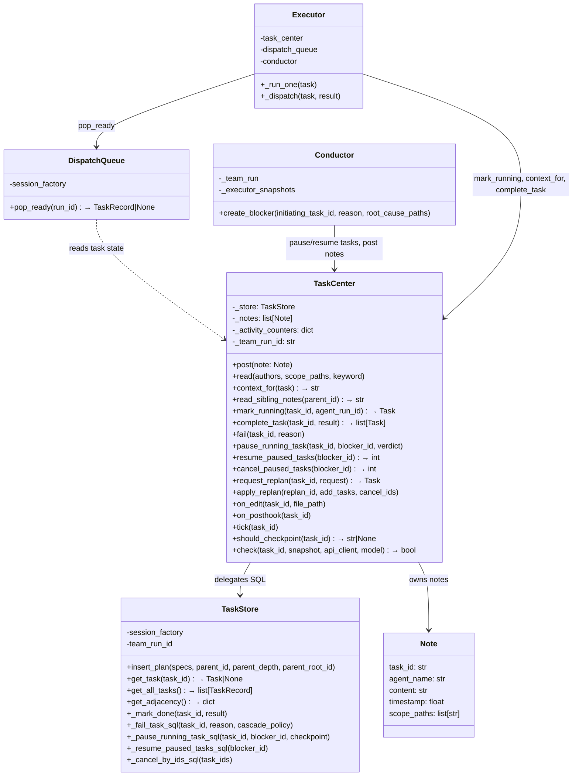
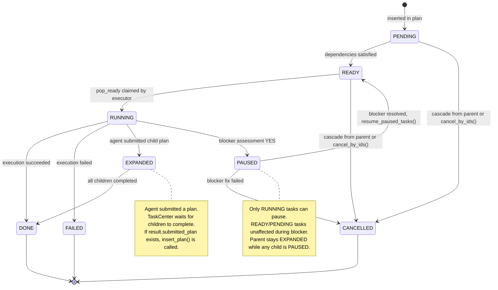
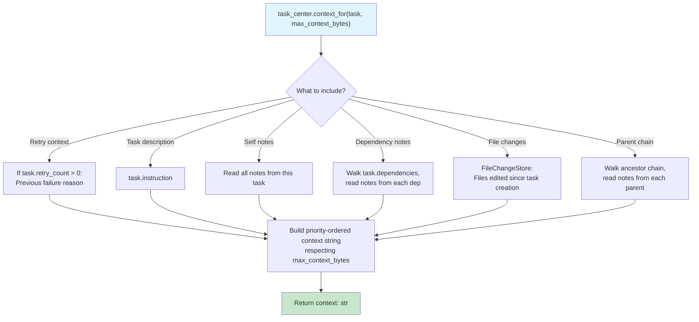
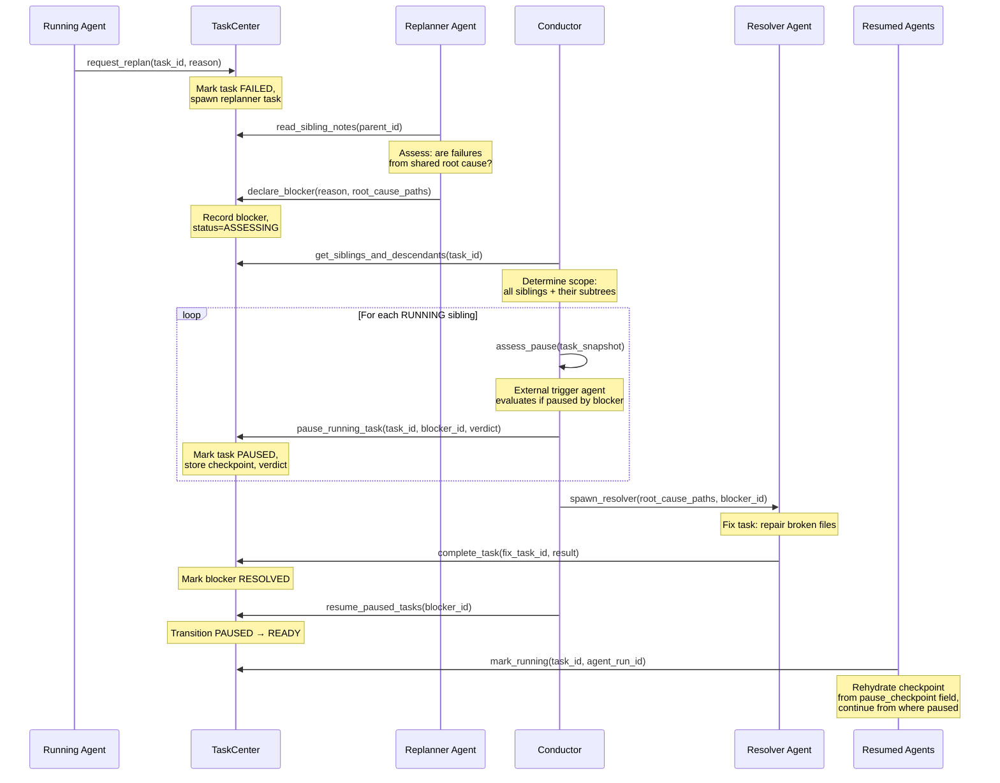
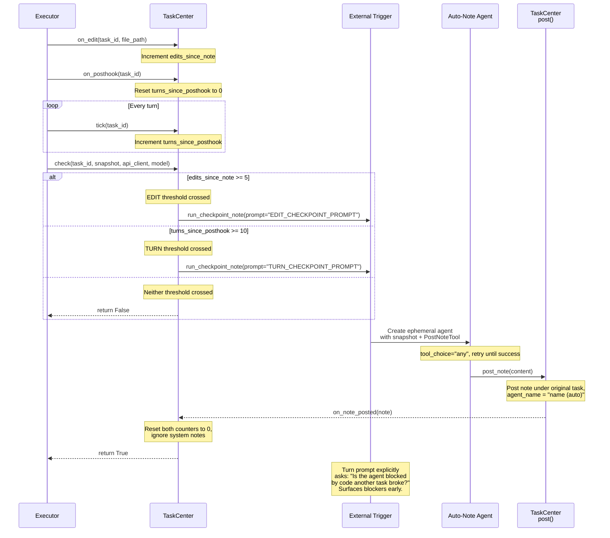
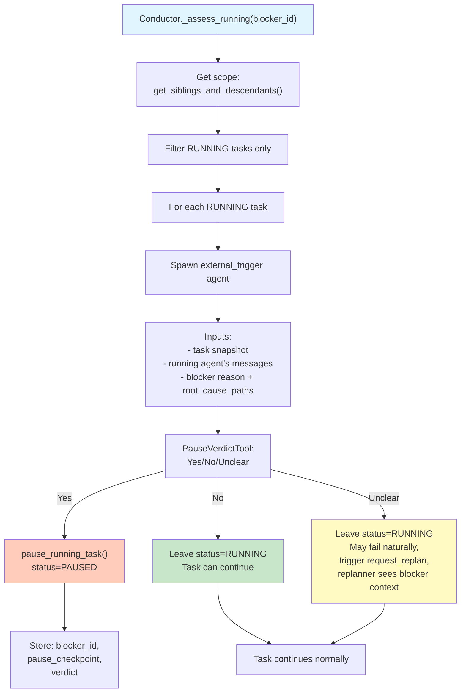

# Task Center

> **Note:** This document consolidates the TaskCenter redesign. For detailed architecture rationale, see:
> - [Task Center + DAG Unification](../design/task-center-dag-unification.md)
> - [Dynamic Replanning Blocker Protocol](../design/dynamic-replanning-blocker-protocol.md)
> - [Task Center Active Mode](../design/task-center-active-mode.md)
> - [Task Center Redesign Summary](../design/task-center-redesign-summary.md)

---

## Role & Ownership

TaskCenter is the single owner of task lifecycle: task records, dependencies, status transitions, plan insertion, cascade operations, notes (in-memory), context building, blocker coordination, and auto-note generation. It absorbs the former Dispatcher and DispatcherStore. Consumers call one unified API instead of bridging three components.

DispatchQueue is a thin extraction (~60 lines): atomic task claiming via `pop_ready()` with SQL `FOR UPDATE SKIP LOCKED`. TaskCenter calls `mark_running()` after the queue returns a task.

---

## Class Relationship Diagram

---

## Task Lifecycle States

---

## Context Building for Agents

---

## Blocker Protocol Lifecycle

The blocker protocol detects when a systemic failure affects multiple siblings and coordinates a single fix before resuming.

---

## Active Mode Auto-Note Generation

Active mode spawns external-trigger agents to post notes on behalf of silent agents, ensuring blockers are surfaced early.

---

## Blocker Assessment — Determining Pause Verdicts

---

## DispatchQueue Separation

DispatchQueue is extracted for SQL atomicity only. It has one method:

- `pop_ready(run_id)` — atomic claim of the next READY task using `FOR UPDATE SKIP LOCKED`

TaskCenter handles everything else: `mark_running()`, status transitions, plan insertion, cascade operations, notes, context, blocker coordination.

**No dispatch guard:** Tasks pop freely during active blockers. Tasks that hit the broken dependency fail naturally and trigger `request_replan()`. The replanner reads sibling notes (including auto-notes) and sees the existing blocker context, enabling informed recovery decisions.

---

## Summary of Key Methods

**Task Lifecycle:**
- `mark_running(task_id, agent_run_id)` — Transition RUNNING, charge budget
- `complete_task(task_id, result)` — Mark DONE, decrement pending_dep_count, promote parent, handle plan expansion
- `fail(task_id, reason)` — Mark FAILED, cascade cancel dependents
- `retry_task(task_id, request)` — Reset to READY if retries remaining, else FAILED
- `request_replan(task_id, request)` — Mark FAILED, spawn replanner task
- `apply_replan(replan_id, add_tasks, cancel_ids)` — Validate, cancel, and insert new tasks

**Blocker Protocol:**
- `pause_running_task(task_id, blocker_id, checkpoint, verdict)` — Transition PAUSED
- `resume_paused_tasks(blocker_id)` — Bulk transition PAUSED → READY
- `cancel_paused_tasks(blocker_id)` — Cancel all PAUSED tasks (on fix failure)

**Context & Notes:**
- `context_for(task, max_context_bytes)` — Build context string from deps, notes, file changes, parent chain
- `read_sibling_notes(parent_id, keyword, scope_paths)` — Resolve subtree, return notes
- `post(note)` — Append note, trigger activity counter reset

**Active Mode:**
- `on_edit(task_id, file_path)` — Track edit activity
- `on_posthook(task_id)` — Reset turn counter
- `tick(task_id)` — Increment turn counter
- `should_checkpoint(task_id)` — Check thresholds, return "edit" or "turn" or None
- `check(task_id, snapshot, api_client, model)` — Spawn external-trigger agent if thresholds crossed

---

## Files Involved

**Core:**
- `backend/src/team/task_center.py` — Unified TaskCenter
- `backend/src/team/runtime/dispatch_queue.py` — Thin queue extraction
- `backend/src/team/persistence/task_store.py` — SQL persistence delegation
- `backend/src/team/models.py` — Task/Plan/Blocker data classes

**Supporting:**
- `backend/src/team/note_manager.py` — Note storage and querying
- `backend/src/team/activity_tracker.py` — Edit/turn counter tracking
- `backend/src/team/checkpoint_manager.py` — Pause checkpoint rehydration
- `backend/src/team/runtime/conductor.py` — Blocker execution
- `backend/src/team/runtime/executor.py` — Task dispatch loop

**Date:** 2026-04-14
