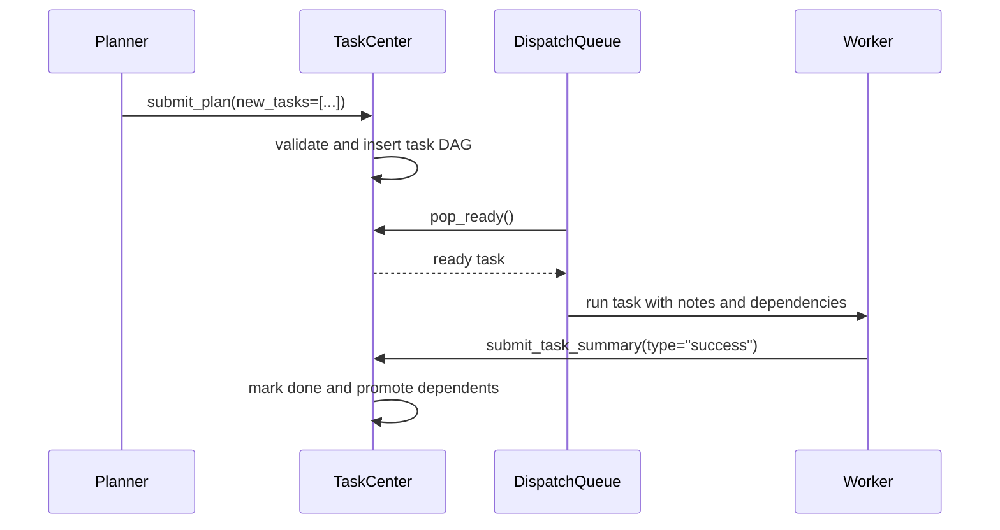

# Team Coordination

EphemeralOS team coordination separates work execution from failure recovery across two core roles: **worker agents** complete assigned tasks, and **replanners** turn failed work into corrective task graph changes.

## Plan And Dispatch

## Failure Recovery

When a task enters `request_replan`, pending dependent tasks are rewired from the failed task to the replanner task, so they remain gated until the replanner is `DONE`. Any dependent of the failed task with a non-pending status is a graph invariant violation, because a task that still depends on an unfinished or failed dependency cannot already be ready, running, expanded, `request_replan`, or terminal. The executor reaches this path by calling `TaskCenter.request_replan`; TaskCenter owns the lifecycle mutation and persistence transaction.

Graph invariant violations fail the team run immediately. Across dispatch,
recovery, and checkpoint restore, scheduler-owned work states (`ready`,
`running`, `expanded`, `request_replan`, and `done`) are valid only when all
dependencies are `done`; failed or cancelled dependencies are not satisfied.
For the broader run-failure taxonomy, see
[`team-failure-conditions.md`](team-failure-conditions.md).

The replanner is the recovery gate for downstream work. Corrective work goes into `new_tasks`, and every new task is inserted as a direct child of the replanner. `cancel_ids` may target only the replanner's direct siblings, and their subtrees cancel by cascade. New replan tasks may depend on local new tasks or schedulable existing tasks that do not already depend on the replanner/original failure pair. If the replanner has no new child tasks after `submit_replan`, it becomes `DONE` immediately; otherwise it becomes `EXPANDED` and reaches `DONE` only after all direct children succeed.

## Status Model

Task statuses are:

- `pending`
- `ready`
- `running`
- `expanded`
- `request_replan`
- `done`
- `failed`
- `cancelled`

Terminal statuses are `done`, `failed`, and `cancelled`.

## Design Principles

- Worker agents do not change the graph directly; they submit success or failure summaries.
- Replanners are the only agents that mutate the recovery graph through `submit_replan`.
- Planner and replanner `new_tasks` items carry `description` as a required short, planner-authored label; full instructions belong in `spec`.
- Ready tasks dispatch as soon as dependencies are satisfied.
- Scope freshness checks protect terminal submissions from stale context.
- Every team task exits through a terminal submission tool: `submit_plan`, `submit_replan`, or `submit_task_summary`.
