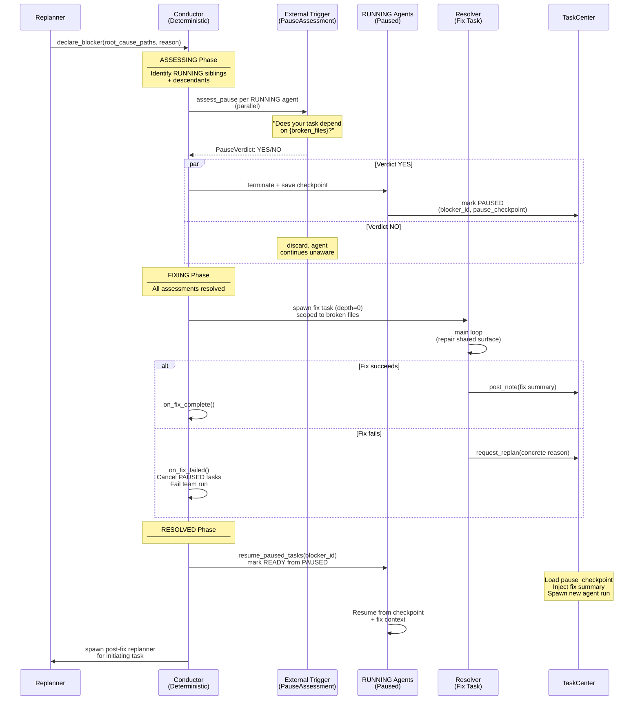
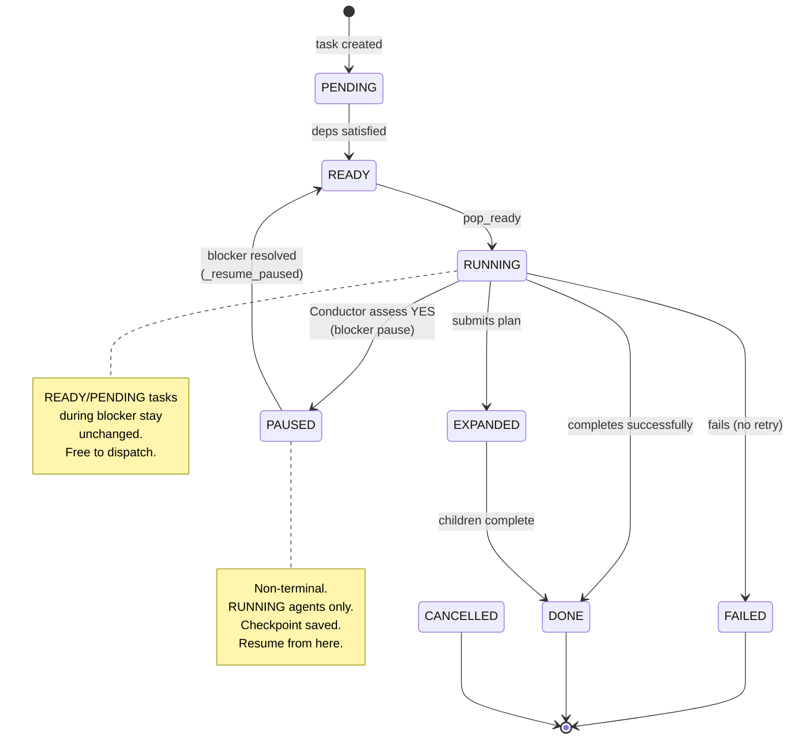
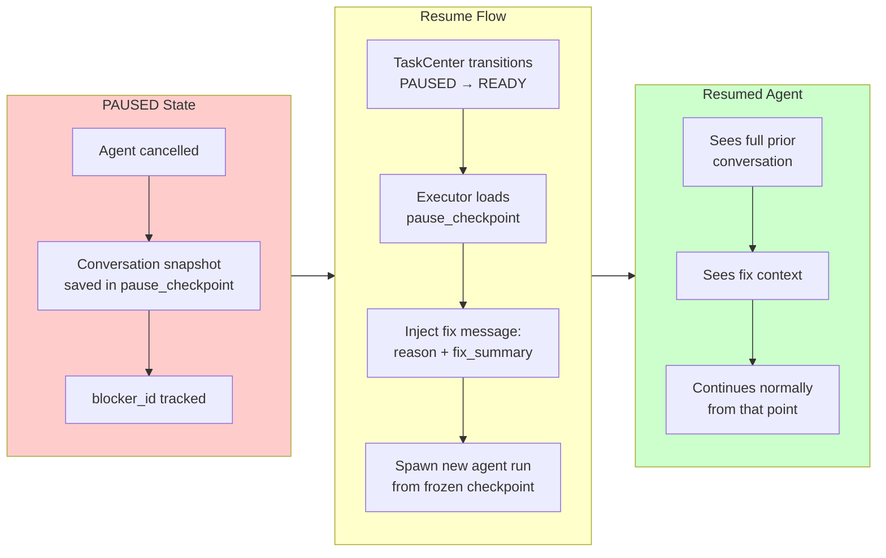

# Team Coordination

EphemeralOS team coordination separates work execution, failure recovery, and blocker mechanics across three strict roles: **Developer** (reports failure), **Replanner** (LLM-driven decision), and **Conductor** (deterministic mechanics). This document illustrates the complete workflow using Mermaid diagrams.

---

## Three Roles with Strict Separation

```mermaid
graph TB
    subgraph Developer["👨‍💼 Developer (Work Agent)"]
        D1["Executes task"]
        D2["Posts notes to TaskCenter"]
        D3["Calls request_replan on failure"]
        D1 --> D2
        D2 --> D3
        D3 -.->|"No blocker awareness"| D3
    end

    subgraph Replanner["🧠 Replanner (LLM Agent)"]
        R1["Reads failure context"]
        R2["Analyzes sibling notes"]
        R3["Assesses plan health"]
        R4["Decides: 3 actions only"]
        R1 --> R2
        R2 --> R3
        R3 --> R4
    end

    subgraph Conductor["⚙️ Conductor (Deterministic)"]
        C1["Executes blocker mechanics"]
        C2["Spawns external triggers"]
        C3["Manages pause/resume"]
        C4["Spawns resolver task"]
        C1 --> C2
        C2 --> C3
        C3 --> C4
        C4 -.->|"Zero LLM calls"| C4
    end

    D3 -->|request_replan| R1
    R4 -->|declare_blocker| C1
    C3 -->|resume| TaskCenter["TaskCenter<br/>Unified Task Lifecycle"]

    style Developer fill:#e3f2fd
    style Replanner fill:#f3e5f5
    style Conductor fill:#fff3e0
    style TaskCenter fill:#e8f5e9

---

## Plan & Dispatch

```mermaid
sequenceDiagram
    participant Planner as Planner<br/>(LLM Agent)
    participant TaskCenter as TaskCenter<br/>(Unified Log)
    participant DispatchQueue as DispatchQueue<br/>(Pop Ready)
    participant Developer as Developer<br/>(Work Agent)

    Planner->>TaskCenter: submit_plan(tasks=[...])
    Note over TaskCenter: Validate & insert<br/>TaskSpecs into DAG
    TaskCenter-->>Planner: plan submitted

    Note over DispatchQueue: Ready queue monitors<br/>dependencies

    Developer->>DispatchQueue: pop_ready()
    DispatchQueue-->>Developer: Task
    Developer->>TaskCenter: context_for(task)<br/>deps + parent + notes
    TaskCenter-->>Developer: prioritized context

    Developer->>Developer: query.py loop<br/>(work, tools, posts notes)
    Note over Developer: reads code, edits files<br/>posts progress notes

    Developer->>Developer: _run_post_run()<br/>(posthook phase)
    Developer->>TaskCenter: submit_summary | submit_plan<br/>| request_retry | request_replan
    TaskCenter-->>Developer: submission confirmed

---

## Replan on Failure: Three Decision Branches

When a Developer calls `request_replan()`, the Replanner reads failure context and sibling notes, then decides one of three actions:

```mermaid
sequenceDiagram
    participant Developer as Failed Developer
    participant TaskCenter as TaskCenter<br/>(Notes & Context)
    participant Replanner as Replanner<br/>(LLM)
    participant Conductor as Conductor<br/>(Mechanics)

    Developer->>TaskCenter: request_replan(reason, suggestion)
    Note over TaskCenter: Mark task FAILED<br/>Spawn Replanner

    Replanner->>TaskCenter: context_for(replanner_task)<br/>read sibling notes, plan health
    TaskCenter-->>Replanner: failure reason + siblings<br/>+ completed notes

    Replanner->>Replanner: Assess failure pattern<br/>3 scenarios

    alt Branch 1: add_tasks
        Note over Replanner: "Plan has a gap.<br/>Missing work or<br/>retry needed."
        Replanner->>TaskCenter: submit_replan(add_tasks=[...])
        Note over TaskCenter: Insert new tasks<br/>Siblings untouched
    else Branch 2: declare_blocker
        Note over Replanner: "Shared dependency broken.<br/>Multiple siblings will fail<br/>same way."
        Replanner->>Conductor: declare_blocker(paths, reason)
        Note over Conductor: Pause RUNNING siblings<br/>Spawn resolver<br/>Resume after fix
    else Branch 3: cancel_and_redraft
        Note over Replanner: "Plan fundamentally wrong.<br/>Restart from scratch."
        Replanner->>TaskCenter: submit_replan(cancel_ids=[...],<br/>add_tasks=[new plan])
        Note over TaskCenter: Cancel all siblings<br/>Insert new plan
    end

    TaskCenter-->>Replanner: replan confirmed
```

---

## Blocker Lifecycle: Pause → Fix → Resume

When the Replanner declares a blocker, the Conductor mechanically executes the pause/fix/resume sequence:



---

## Task Status Transitions with Blocker



---

## Resume & Rehydration

When a PAUSED task transitions back to READY, the Executor resumes from the saved checkpoint with additional context about the fix:



---

## Key Design Principles

**Strict Role Separation**
- Developer knows nothing about blockers; only calls `request_replan()` on failure.
- Replanner makes all failure recovery decisions; has 3 actions only: `add_tasks`, `declare_blocker`, `cancel_and_redraft`.
- Conductor executes mechanics deterministically; zero LLM calls, fully testable.

**No Dispatch Guard**
- Tasks dispatch freely during active blockers.
- READY/PENDING tasks are never touched by the blocker protocol.
- Non-RUNNING tasks continue normally; if they hit the broken dependency, they fail and trigger their own `request_replan()`.

**Parallel Safety**
- Only RUNNING agents are assessed for pause.
- Multiple blockers with overlapping paths merge into one.
- Assessment scope is structural (siblings + descendants), not file-path based.

**Checkpoint-Based Resume**
- Paused task's full conversation snapshot is preserved.
- Fix summary injected as context, not as a tool call.
- Resumed agent picks up where it left off with full prior context.

**Guaranteed Submission**
- Every task exits via the post-run phase (`_run_post_run`), which always completes.
- Tools: `SubmitPlanTool`, `RequestReplanTool`, `DeclareBlockerTool`, `PauseVerdictTool`.
- PosthookTools manage the posthook phase exclusively.

