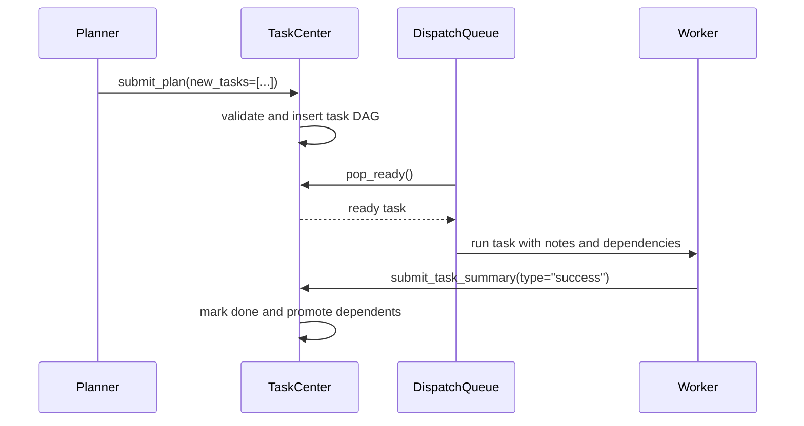
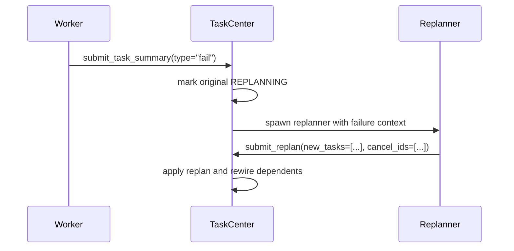

# Team Coordination

EphemeralOS team coordination separates work execution from failure recovery across two core roles: **worker agents** complete assigned tasks, and **replanners** turn failed work into corrective task graph changes.

## Plan And Dispatch

## Failure Recovery

When a task enters `REPLANNING`, dependent work stays pending. The replanner can add corrective tasks with explicit `parent_id` placement, cancel stale siblings with cascade handling, and provide an `expected_projection` assertion when parent-bounded graph shape matters. If the replanner produces replacement tasks, dependents are rewired from the original failed task to the new task ids. If the replanner fails or produces no replacement work, the original task fails with cascade handling.

## Status Model

Task statuses are:

- `pending`
- `ready`
- `running`
- `expanded`
- `replanning`
- `done`
- `failed`
- `cancelled`

Terminal statuses are `done`, `failed`, and `cancelled`.

## Design Principles

- Worker agents do not change the graph directly; they submit success or failure summaries.
- Replanners are the only agents that mutate the recovery graph through `submit_replan`.
- Ready tasks dispatch as soon as dependencies are satisfied.
- Scope freshness checks protect terminal submissions from stale context.
- Every team task exits through a terminal submission tool: `submit_plan`, `submit_replan`, or `submit_task_summary`.
