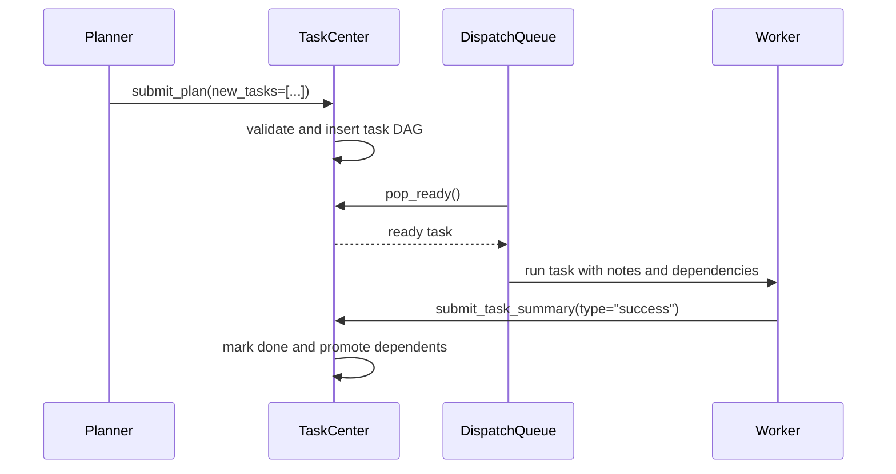
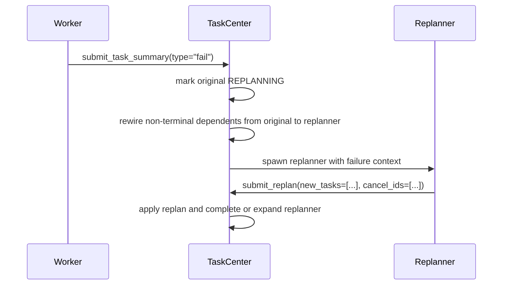

# Team Coordination

EphemeralOS team coordination separates work execution from failure recovery across two core roles: **worker agents** complete assigned tasks, and **replanners** turn failed work into corrective task graph changes.

## Plan And Dispatch

## Failure Recovery

When a task enters `REPLANNING`, non-terminal dependent tasks are rewired from the failed task to the replanner task, so they remain gated until the replanner is `DONE`. The replanner can add corrective tasks with explicit `parent_id` placement under itself, at its sibling layer, or inside surviving sibling subtrees. It can cancel stale not-completed tasks in its allowed parent projection with cascade handling. If the replanner has no direct child tasks after `submit_replan`, it becomes `DONE` immediately. If it creates direct child tasks, it becomes `EXPANDED` and later becomes `DONE` only after all direct children succeed.

## Status Model

Task statuses are:

- `pending`
- `ready`
- `running`
- `expanded`
- `replanning`
- `done`
- `failed`
- `cancelled`

Terminal statuses are `done`, `failed`, and `cancelled`.

## Design Principles

- Worker agents do not change the graph directly; they submit success or failure summaries.
- Replanners are the only agents that mutate the recovery graph through `submit_replan`.
- Ready tasks dispatch as soon as dependencies are satisfied.
- Scope freshness checks protect terminal submissions from stale context.
- Every team task exits through a terminal submission tool: `submit_plan`, `submit_replan`, or `submit_task_summary`.
