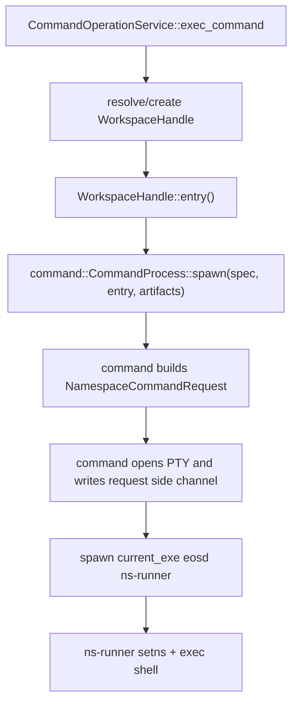

# Phase 2 Milestone 6.8 Minimal Command Launch Spec

Date: 2026-06-19
Parent plan: `phase_2_command_service_IMPLEMENTATION_PLAN.md`
Related specs:
- `phase_2_milestone_6_5_exec_command_boundary_SPEC.md`
- `phase_2_milestone_6_6_workspace_profile_symmetry_SPEC.md`
- `phase_3_workspace_session_remount_structure_SPEC.md`
- `../caller_owned_workspace_lifecycle_PROPOSAL.md`

## Summary

Milestone 6.8 removes the workspace-command request detour from command start.
The command service should start a command in a resolved workspace through one
minimal launch handoff:

```text
operation_service::command
  resolves or creates the workspace handle
  asks the handle for a validated workspace entry
  asks the command crate to spawn a command with that entry

command
  builds the namespace-runner command request
  opens the PTY
  spawns `eosd ns-runner`
  owns stdin, transcript, cancellation, timeout, and final process result

workspace
  creates, remounts, captures, destroys, and exposes validated workspace entries
  does not own user command execution or command request construction
```

The target workflow is:



## Motivation

The current command start path has an unnecessary semantic round trip:

```text
CommandOperationService::exec_command
  -> WorkspaceHandle::command_request(WorkspaceCommandRequest)
  -> workspace builds NamespaceCommandRequest
  -> command treats the request as opaque serde_json::Value
  -> command writes command-request.json and spawns ns-runner
```

That makes `workspace` responsible for command-shaped data:

- command id;
- caller id;
- command string;
- cwd;
- timeout.

Those are execution concerns. The workspace crate should only provide the
validated facts needed to enter a prepared workspace: root, overlay paths,
namespace FDs, cgroup path, and related workspace entry data.

## Goals

- Remove `WorkspaceCommandRequest`.
- Remove `WorkspaceHandle::command_request(...)`.
- Remove `CommandProcessSpawn::command_request: serde_json::Value`.
- Keep `CommandOperationService::exec_command` as the owner of command lifecycle
  orchestration.
- Keep `workspace` focused on setup, remount, capture, destroy, and validated
  workspace entry data.
- Keep `command` as the low-level process, PTY, transcript, stdin, cancellation,
  timeout, and runner-request-construction owner.
- Keep `namespace-process` as the child-side holder/setns/shell execution
  implementation.
- Preserve the existing `eosd ns-runner` process boundary.
- Preserve the existing request side channel unless this milestone explicitly
  proves a smaller replacement.

## Non-Goals

- No daemon dispatch migration.
- No removal of `eosd ns-runner`.
- No removal of PTY-based command IO.
- No change to command finalization, capture, publish, or one-shot/session
  cleanup policy.
- No change to workspace setup, DNS setup, overlay mount, overlay remount, or
  remount probe behavior.
- No change to `read_lines`, transcript row projection, stdout/stderr row
  semantics, or retained transcript behavior.
- No new public workspace execution API such as `workspace.run_command`.
- No new workspace lifecycle mode, publish mode, or command remount opt-in.
- No attempt to replace `command-request.json` with `--request-fd` unless the
  implementation is otherwise complete and tests remain focused.

## Target Ownership

| Concern | Owner | Must not own |
| --- | --- | --- |
| Workspace create/destroy/capture/remount | `workspace` crate and workspace service | command id, command string, command lifecycle |
| Workspace entry validation | `workspace` crate | shell argv construction, PTY, transcript |
| Command lifecycle orchestration | `operation_service::command` | namespace FD extraction details, PTY mechanics |
| Runner request construction for user commands | `command` crate | workspace session registry, capture/publish policy |
| PTY/process/transcript/stdin/cancel/timeout | `command` crate | workspace setup or publish policy |
| Child-side namespace entry and shell exec | `namespace-process` via `eosd ns-runner` | caller-facing command service policy |
| Setup/remount/DNS ns-runner helper requests | `workspace` crate | user command execution |

Workspace may still build namespace-runner requests for workspace-owned
setup/remount/DNS operations. This milestone only moves user command launch
request construction out of workspace.

## Target API Shape

### Workspace Entry

Replace the command-shaped workspace request with a workspace entry:

```rust
impl WorkspaceHandle {
    pub fn entry(&self) -> Result<WorkspaceEntry, WorkspaceEntryError>;
}
```

The exact type name may differ, but it must be command-neutral. A reasonable
shape is:

```rust
pub struct WorkspaceEntry {
    pub workspace_root: PathBuf,
    pub layer_paths: Vec<PathBuf>,
    pub upperdir: PathBuf,
    pub workdir: PathBuf,
    pub ns_fds: WorkspaceEntryFds,
    pub cgroup_path: Option<PathBuf>,
}

pub struct WorkspaceEntryFds {
    pub user: i32,
    pub mnt: i32,
    pub pid: i32,
    pub net: Option<i32>,
}
```

Rules:

- The returned type must not contain `command_id`, `caller_id`, `command`,
  `cwd`, `timeout_seconds`, or operation trace data.
- Missing user, mount, or pid namespace FDs are workspace entry errors.
- Missing net FD is valid for host-compatible workspaces and invalid for
  isolated workspaces.
- The workspace root, layer paths, upperdir, workdir, namespace FDs, and cgroup
  path must come from the canonical resolved workspace handle.
- The method must not spawn a process, write an artifact, or construct a
  namespace-runner command request.

### Command Launch

Change command launch from "opaque request value plus paths" to "command spec
plus workspace entry plus artifacts":

```rust
pub struct CommandProcessSpec {
    pub id: String,
    pub caller_id: String,
    pub command: String,
    pub cwd: Option<PathBuf>,
    pub timeout_seconds: Option<f64>,
}

pub struct CommandProcessSpawn<'a> {
    pub workspace_entry: WorkspaceEntry,
    pub request_path: PathBuf,
    pub output_path: PathBuf,
    pub final_path: PathBuf,
    pub transcript_path: PathBuf,
    pub transcript_timestamp_timezone: &'a str,
    pub output_drain_grace_ms: u64,
}
```

Rules:

- `CommandProcess::spawn` builds the namespace-runner command request from
  `CommandProcessSpec` and `WorkspaceEntry`.
- `CommandProcess::spawn` or a private helper in the command crate serializes
  the request for the existing request side channel.
- `pty.rs` remains responsible for opening the PTY, connecting child stdin,
  stdout, and stderr to the PTY slave, starting the output reader, and spawning
  `eosd ns-runner`.
- The command crate must keep command request construction policy-free: no
  workspace create/destroy/capture/publish/remount decisions.

### Protocol Type Placement

There are two acceptable implementations.

Preferred long-term option:

```text
crates/daemon/namespace-runner-protocol
  NamespaceCommandRequest
  WorkspaceRoot
  NsFds
  Fd
  RunResult
```

Then:

- `command` depends on `namespace-runner-protocol`;
- `namespace-process` depends on `namespace-runner-protocol`;
- `workspace` depends on `namespace-runner-protocol` for setup/remount/DNS
  helper requests and FD DTOs;
- `operation_service` does not import `NamespaceCommandRequest`.

Acceptable narrow option:

- keep `NamespaceCommandRequest` in `namespace-process::runner::protocol`;
- allow the command crate to depend on that protocol module only;
- do not import `namespace_process::runner::run`, holder internals, setns
  internals, or workspace setup helpers into `command`.

If the narrow option is chosen, leave a follow-up note in the implementation
record explaining whether a protocol-only crate is still desired.

## Minimal Command Start Workflow

The target `exec_command` implementation should read conceptually like this:

```rust
fn exec_resolved_command(
    &self,
    input: ExecCommandInput,
    mode: ExecCommandMode,
    context: CommandCallContext,
) -> Result<CommandYield, CommandServiceError> {
    let handler = resolve_or_create_workspace(mode)?;
    let command_id = self.process_store().allocate_command_id();
    let entry = handler.handle.entry()?;
    let command_dir = self.config().scratch_root.join(&command_id.0);
    let artifacts = PreparedCommandArtifacts::new(command_dir);

    let process = self.launch_driver().spawn(
        CommandProcessSpec {
            id: command_id.0.clone(),
            caller_id: context.caller_id.0.clone(),
            command: input.cmd.clone(),
            cwd: input.cwd.clone(),
            timeout_seconds: input.timeout_seconds,
        },
        CommandProcessSpawn {
            workspace_entry: entry,
            request_path: artifacts.request_path,
            output_path: artifacts.output_path,
            final_path: artifacts.final_path,
            transcript_path: artifacts.transcript_path,
            transcript_timestamp_timezone: &self.config().transcript_timestamp_timezone,
            output_drain_grace_ms: self.config().output_drain_grace_ms,
        },
    )?;

    register_active_command(process)?;
    self.initial_exec_yield(command_id, input.yield_time_ms)
}
```

The exact helper names can differ. The important constraint is that
`exec_command` does not construct `WorkspaceCommandRequest`,
`NamespaceCommandRequest`, or a `serde_json::Value` command request.

## Expected Files To Change

- `crates/daemon/workspace/src/model.rs`
- `crates/daemon/workspace/src/lib.rs`
- `crates/daemon/workspace/tests/unit/model.rs`
- `crates/daemon/command/src/process.rs`
- `crates/daemon/command/src/pty.rs`
- `crates/daemon/command/tests/unit/process.rs`
- `crates/daemon/command/tests/unit/pty.rs`
- `crates/daemon/operation_service/src/command/service/impls/exec_command.rs`
- `crates/daemon/operation_service/src/command/launch.rs`
- `crates/daemon/operation_service/tests/support/mod.rs`
- `crates/daemon/operation_service/tests/command_exec.rs`
- `crates/daemon/operation_service/tests/command_remount.rs`
- `crates/daemon/operation_service/tests/workspace_remount.rs`
- `crates/daemon/operation_service/tests/command_transcript_rows.rs`
- `crates/daemon/namespace-process/src/runner/protocol.rs`
- `crates/daemon/namespace-process/src/runner/mod.rs`
- `crates/daemon/namespace-process/src/runner/setns.rs`
- `crates/daemon/namespace-process/src/runner/shell_exec/request.rs`
- `crates/daemon/eosd/src/runner.rs`
- `crates/daemon/workspace/src/namespace/setns_runner.rs`
- `crates/daemon/workspace/src/isolated_setup/dns.rs`
- `Cargo.toml`
- `docs/daemon/workspace_migration/phase-operation_service_workspace_session/phase_2_implementation_record.md`

If the narrow protocol-placement option is chosen, the namespace-protocol crate
files are not added and the namespace-process protocol file remains in place.

## Migration Steps

1. Update the implementation record.
   - Add a `Milestone 6.8: Minimal Command Launch` section.
   - State which protocol type placement option was chosen.

2. Add command-neutral workspace entry data.
   - Add `WorkspaceEntry` and `WorkspaceEntryFds` or equivalent.
   - Add `WorkspaceHandle::entry()`.
   - Move the existing holder FD completeness checks behind this method.
   - Keep debug output redacted for raw FDs and storage paths where current code
     already redacts them.

3. Remove command-shaped workspace APIs.
   - Delete `WorkspaceCommandRequest`.
   - Delete `WorkspaceHandle::command_request(...)`.
   - Delete `WorkspaceLaunchContext::command_request(...)`.
   - Remove workspace model tests that assert command JSON shape.
   - Add workspace model tests that assert workspace-entry validation only.

4. Move user command request construction to the command crate.
   - Extend `CommandProcessSpec` with `cwd`.
   - Replace `CommandProcessSpawn::command_request` with workspace entry data.
   - Add a private command-crate helper that builds `NamespaceCommandRequest`.
   - Keep command request serialization and request artifact errors reported as
     command artifact write errors.
   - Keep existing PTY start-ack behavior and process group behavior.

5. Simplify operation-service command start.
   - Remove the `WorkspaceCommandRequest` import.
   - Replace `handler.handle.command_request(...)` with
     `handler.handle.entry()?`.
   - Keep artifact path allocation in operation service.
   - Pass command spec, workspace entry, and artifact paths to the launch driver.
   - Preserve one-shot cleanup rollback if workspace entry validation or
     process spawn fails.
   - Preserve session remount-pending admission semantics.

6. Update test fakes and assertions.
   - Fake launch drivers should observe command spec plus workspace entry, not a
     prebuilt request value.
   - Operation-service tests should verify command start passes canonical
     workspace entry data and artifact paths.
   - Command-crate tests should verify the exact namespace-runner request shape.
   - Workspace-crate tests should no longer know command id, cwd, or command
     string.

7. Keep workspace-owned setup/remount helper requests intact.
   - `workspace::namespace::setns_runner` may continue to build requests for
     `--mount-overlay` and `--remount-overlay`.
   - `workspace::isolated_setup::dns` may continue to build requests for
     `--configure-dns`.
   - Do not route user command launch through those helper APIs.

## Acceptance Criteria

- `WorkspaceCommandRequest` no longer exists.
- `WorkspaceHandle::command_request` no longer exists.
- `WorkspaceLaunchContext::command_request` no longer exists.
- `CommandProcessSpawn` no longer contains `command_request: serde_json::Value`.
- `operation_service::command` does not import `NamespaceCommandRequest`.
- `operation_service::command::exec_command` does not serialize runner request
  JSON.
- The command crate has focused tests for namespace-runner request construction.
- The workspace crate has focused tests for workspace-entry validation.
- Existing command stdin, transcript, poll, cancel, timeout, finalization, and
  retained transcript behavior are unchanged.
- Workspace setup/remount/DNS helper behavior is unchanged.
- One-shot command cleanup on launch failure remains exact-once.
- Session command start still rejects while remount is pending.

Useful static checks:

```bash
rg -n "WorkspaceCommandRequest|\\.command_request\\(" crates/daemon/workspace/src crates/daemon/operation_service/src/command
rg -n "NamespaceCommandRequest" crates/daemon/operation_service/src/command
rg -n "command_request: serde_json::Value|command_request: Value" crates/daemon/command/src
rg -n "fn command_request|pub fn command_request" crates/daemon/workspace/src
```

Expected result: no matches, except unrelated helper names explicitly reviewed
and recorded in the implementation record.

## Verification

Run focused tests first:

```bash
CARGO_TARGET_DIR=/tmp/eos-minimal-command-launch-target cargo test -p workspace model
CARGO_TARGET_DIR=/tmp/eos-minimal-command-launch-target cargo test -p command
CARGO_TARGET_DIR=/tmp/eos-minimal-command-launch-target cargo test -p operation_service command_exec
CARGO_TARGET_DIR=/tmp/eos-minimal-command-launch-target cargo test -p operation_service command_remount
CARGO_TARGET_DIR=/tmp/eos-minimal-command-launch-target cargo test -p operation_service workspace_remount
```

If a protocol crate is added:

```bash
CARGO_TARGET_DIR=/tmp/eos-minimal-command-launch-target cargo test -p namespace-runner-protocol
CARGO_TARGET_DIR=/tmp/eos-minimal-command-launch-target cargo test -p namespace-process runner
```

Always finish with:

```bash
cargo fmt --check
git diff --check
```

If local platform limits prevent Linux namespace or PTY coverage, record that
limit in the implementation record and include the strongest available compile
or unit-test proof.

## Risks And Guardrails

- Risk: adding a broad command-to-workspace dependency recreates policy coupling.
  Guardrail: depend only on a data-only workspace entry type or a protocol-only
  crate, never on `WorkspaceService`, workspace session stores, or lifecycle
  services.
- Risk: moving request construction changes runner JSON shape.
  Guardrail: add command-crate request-shape tests before deleting the old
  workspace JSON assertions.
- Risk: setup/remount helper requests are accidentally changed.
  Guardrail: keep setup/remount/DNS request builders in workspace and test them
  separately from user command launch.
- Risk: PTY stdin conflicts with request delivery.
  Guardrail: keep the existing request side channel; do not send the runner
  request over child stdin because stdin is the user command PTY stream.
- Risk: operation-service rollback changes while simplifying launch.
  Guardrail: keep existing command start failure tests for one-shot cleanup and
  session non-destroy behavior.

## Deferred Follow-Ups

- Replace `command-request.json` with an inherited `--request-fd` side channel
  only after this boundary cleanup lands.
- Split `namespace-runner-protocol` if the narrow implementation initially keeps
  protocol DTOs under `namespace-process`.
- Revisit structured transcript row fidelity separately; raw PTY transcript
  projection is not part of this launch-boundary milestone.
