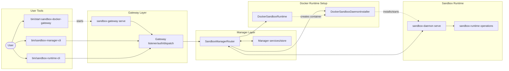
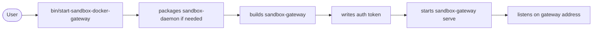
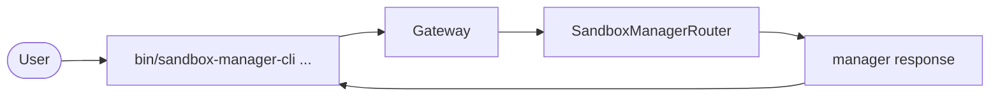
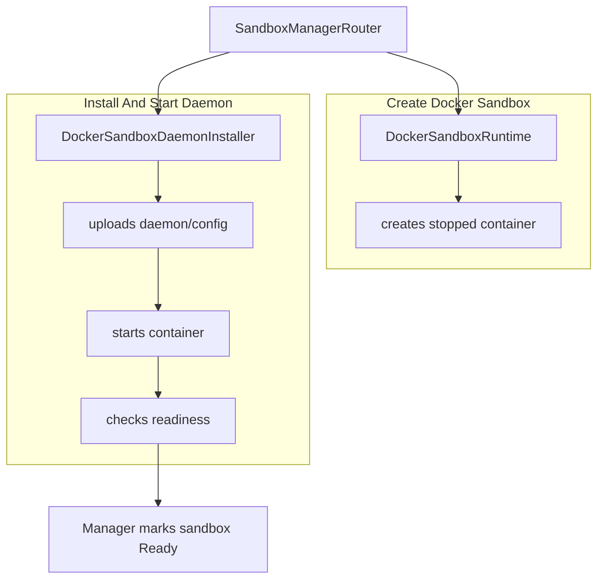
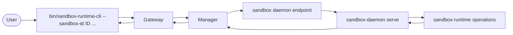

# CLI Gateway Manager Runtime

This note shows the normal operator path: start the gateway, send manager
commands through `bin/sandbox-manager-cli`, create a Docker-backed sandbox,
then forward commands through `bin/sandbox-runtime-cli` to the sandbox daemon.

The gateway is the public entry point. The manager owns sandbox records and lifecycle. The Docker runtime creates containers, the installer places and starts `sandbox-daemon`, and the daemon runs `sandbox-runtime` operations inside the sandbox.

The useful mental model is: operators talk to one gateway, the gateway talks to one manager, and the manager either handles the request itself or forwards it to the daemon for a specific sandbox. A sandbox is only usable for runtime commands after the manager has marked it `Ready`.

## System Map



The system is split into layers so each command has a clear owner. The
operation contract owns the application envelope and semantic vocabulary; the
single catalog owns manager, runtime, and observability declarations and route
metadata. Each CLI owns only its presentation projection and uses the shared
operation client. `sandbox-protocol` owns JSON-line wire encoding, framing,
authentication fields, limits, and the private readiness handshake. The
gateway handles listening and authentication, while the manager owns sandbox
records and decides whether to handle a request or forward it to a sandbox.

Docker runtime setup only matters during sandbox lifecycle operations such as `create_sandbox` and `destroy_sandbox`. Once a sandbox is ready, normal runtime commands go through the manager to that sandbox's daemon endpoint.

Implementation paths:

- `bin/start-sandbox-docker-gateway`
- `bin/sandbox-manager-cli`
- `bin/sandbox-runtime-cli`
- `crates/sandbox-operations/contract/`
- `crates/sandbox-operations/catalog/`
- `crates/sandbox-operations/client/`
- `crates/sandbox-cli/src/{input.rs,output.rs,projection/}`
- `crates/sandbox-gateway/src/gateway/main.rs`
- `crates/sandbox-gateway/src/gateway/server.rs`
- `crates/sandbox-manager/src/router/dispatch.rs`
- `crates/sandbox-provider-docker/src/runtime.rs`
- `crates/sandbox-provider-docker/src/installer.rs`
- `crates/sandbox-daemon/src/serve.rs`
- `crates/sandbox-runtime/operation/src/services.rs`

## Starting The Gateway



`bin/start-sandbox-docker-gateway` packages the Docker daemon binary if needed, builds the gateway binary, stops the old pid-file-owned gateway if one is running, writes the gateway auth token, and starts `sandbox-gateway serve` in the background.

The helper uses Docker backend config from `config/prd.yml` by default. It
writes the token to the file discovered by the shared operation client, so the
three CLI binaries normally need no manual token copy. The default gateway
address is local, so the gateway is the local control point for CLI requests.

If startup fails, check the gateway log printed by the helper first. The common operator checks are: Docker is available, the configured daemon binary exists, the config path is correct, and the old gateway process was stopped cleanly.

Implementation paths:

- `bin/start-sandbox-docker-gateway`
- `crates/sandbox-gateway/src/gateway/main.rs`
- `crates/sandbox-gateway/src/gateway/server.rs`
- `crates/sandbox-operations/client/src/config.rs`

## CLI Request Path



Use `manager` commands for sandbox lifecycle work such as listing, creating, inspecting, and destroying sandboxes. These requests are system-scoped and return directly from the manager.

`bin/sandbox-manager-cli ...` is the operator interface for manager-owned
operations. The CLI joins its presentation projection with the manager domain
of the semantic catalog, prepares an operation-contract request, and uses the
shared client to send authenticated gateway RPC. The gateway decodes the wire
request and dispatches it to `SandboxManagerRouter`.

The manager handles these requests without entering a sandbox daemon. Manager
commands therefore have no mandatory global runtime-style sandbox selector:
`list_sandboxes` and `create_sandbox` need none, while `inspect_sandbox` and
`destroy_sandbox` accept their operation-specific `--sandbox-id` flag.

Implementation paths:

- `bin/sandbox-manager-cli`
- `crates/sandbox-cli/src/manager.rs`
- `crates/sandbox-cli/src/{input.rs,output.rs}`
- `crates/sandbox-cli/src/projection/manager.rs`
- `crates/sandbox-operations/catalog/src/manager.rs`
- `crates/sandbox-operations/client/src/client.rs`
- `crates/sandbox-gateway/src/gateway/server.rs`
- `crates/sandbox-manager/src/router/dispatch.rs`
- `crates/sandbox-manager/src/operations/management/service/impls/list_sandboxes.rs`
- `crates/sandbox-manager/src/operations/management/service/impls/create_sandbox.rs`
- `crates/sandbox-manager/src/operations/management/service/impls/inspect_sandbox.rs`
- `crates/sandbox-manager/src/operations/management/service/impls/destroy_sandbox.rs`

## Sandbox Creation And Runtime Setup



For `create_sandbox`, the manager first asks `DockerSandboxRuntime` for a stopped container. It then uses `DockerSandboxDaemonInstaller` to upload `sandbox-daemon` and config, start the container, check readiness, and store the daemon endpoint before marking the sandbox `Ready`.

This is the longest lifecycle path because the manager is turning a user request into a running per-sandbox control plane. The stopped container is created first so the daemon binary and config can be installed before the sandbox starts serving runtime requests.

Readiness matters because the manager should not report a sandbox as usable just because Docker accepted the container. The installer waits for the daemon to answer a readiness request, then the manager stores the daemon endpoint and moves the sandbox record to `Ready`.

Implementation paths:

- `crates/sandbox-manager/src/operations/management/service/impls/create_sandbox.rs`
- `crates/sandbox-provider-docker/src/runtime.rs`
- `crates/sandbox-provider-docker/src/installer.rs`
- `crates/sandbox-provider-docker/src/readiness.rs`
- `crates/sandbox-daemon/src/serve.rs`
- `crates/sandbox-daemon/src/rpc/dispatch.rs`

## Runtime Command Forwarding



Use `runtime` commands after a sandbox is `Ready`. The CLI sends the sandbox id, the gateway routes to the manager, and the manager forwards the request to the stored daemon endpoint for that sandbox.

Runtime commands are sandbox-scoped because they must run against one specific sandbox. The manager looks up the sandbox record, verifies it is ready, reads the stored daemon endpoint, and forwards the request to `sandbox-daemon serve`.

The daemon is the boundary where the request becomes an in-sandbox runtime operation. For `exec_command "pwd"`, the runtime operation service handles command execution and returns the response back through the same path: daemon, manager, gateway, CLI.

Implementation paths:

- `bin/sandbox-runtime-cli`
- `crates/sandbox-cli/src/runtime.rs`
- `crates/sandbox-cli/src/projection/runtime.rs`
- `crates/sandbox-operations/catalog/src/runtime.rs`
- `crates/sandbox-operations/client/src/client.rs`
- `crates/sandbox-gateway/src/gateway/server.rs`
- `crates/sandbox-manager/src/router/dispatch.rs`
- `crates/sandbox-manager/src/router/forward.rs`
- `crates/sandbox-gateway/src/daemon_client.rs`
- `crates/sandbox-daemon/src/rpc/dispatch.rs`
- `crates/sandbox-runtime/operation/src/services.rs`
- `crates/sandbox-runtime/operation/src/operations/registry/command_operations.rs`

## Minimal Commands

```sh
bin/start-sandbox-docker-gateway --rebuild-binary
bin/sandbox-manager-cli list_sandboxes
bin/sandbox-manager-cli create_sandbox --image ubuntu:24.04 --workspace-bind-root "$PWD"
bin/sandbox-runtime-cli --sandbox-id ID exec_command "pwd"
```

Replace `ID` with the sandbox id returned by `create_sandbox` or shown by `list_sandboxes`.

The first command starts the local gateway. The second confirms the manager is reachable. The third creates a Docker-backed sandbox for the current workspace. The fourth proves that runtime forwarding works by executing `pwd` inside the selected sandbox.
