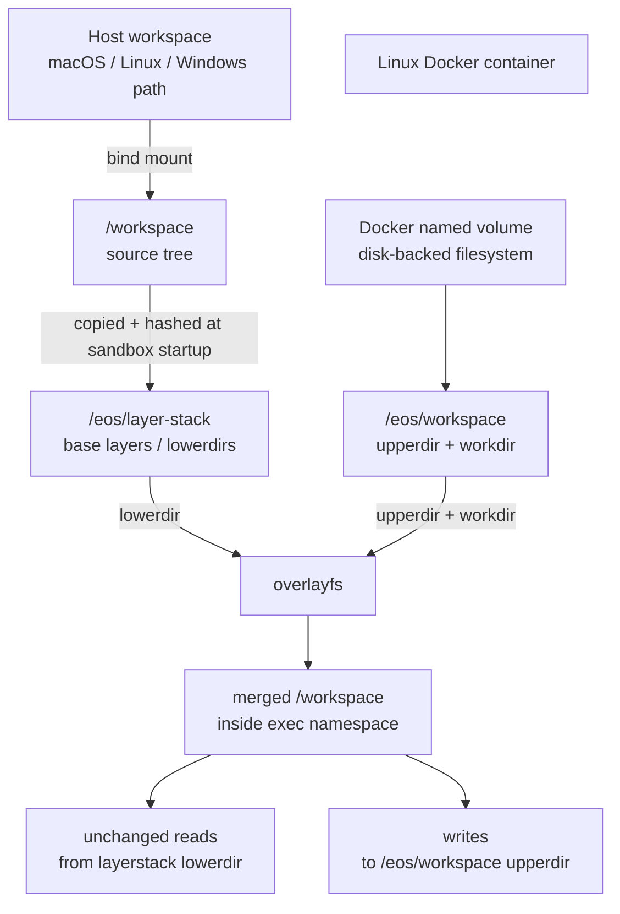

# Overlay Mount Backing Storage

This note explains why `exec_command` can fail with `overlay mount failed` after
`create_sandbox` succeeds, and why the Docker provider should mount
`/eos/workspace` on a disk-backed Docker volume.

## Problem

`create_sandbox` builds the immutable layerstack base from the bind-mounted
workspace. That path can succeed even when later runtime commands fail.

`exec_command` and workspace sessions also need a writable overlay workspace:

- `lowerdir`: layerstack snapshot under `/eos/layer-stack`
- `upperdir`: writable session data under `/eos/workspace`
- `workdir`: overlayfs work directory under `/eos/workspace`
- merged view: the `/workspace` seen by the command namespace

Inside Docker Desktop, the container root filesystem is itself overlay-backed.
If `/eos/workspace` lives on that container root filesystem, Linux rejects it as
an overlay `upperdir`/`workdir` source:

```text
overlay: filesystem on /tmp/ovl/upper not supported as upperdir
workspace setup failed at failed to finalize namespace execution:
namespace runner --mount-overlay failed with exit code 1:
ns-runner setns overlay mount failed: overlay mount failed
```

The fix is not to remove overlayfs. The fix is to put the overlay writable
scratch root on a filesystem that Linux accepts as `upperdir`.

## Mount Layout



`/eos/workspace` is not the final workspace view. It is only backing storage for
overlayfs writable state. Commands still see the merged overlay workspace.

## Docker Provider Rule

For each sandbox container, the Docker provider creates a Docker named volume
and mounts it at the configured workspace scratch root:

```text
runtime.workspace.scratch_root = /eos/workspace
```

The host workspace bind mount stays unchanged:

```text
host workspace_root -> /workspace
```

The layerstack root stays unchanged:

```text
runtime.workspace.layer_stack_root = /eos/layer-stack
```

This keeps the storage roles separate:

| Path | Role | Backing |
|---|---|---|
| `/workspace` | source bind mount from host | host filesystem via Docker |
| `/eos/layer-stack` | immutable base layers and snapshots | container filesystem |
| `/eos/workspace` | overlay `upperdir` and `workdir` | Docker named volume |
| exec namespace `/workspace` | merged command view | overlayfs mount |

## Host Compatibility

This is portable across macOS, Linux, and Windows hosts as long as the runtime is
a Linux Docker engine/container:

- macOS Docker Desktop: named volume is backed by the Docker Linux VM disk.
- Windows Docker Desktop: named volume is backed by the Docker Linux VM disk.
- Linux Docker Engine: named volume is backed by Docker's data root.

The runtime still requires the existing Linux container prerequisites:
privileged container access and kernel overlayfs support.

## Disk vs Memory

The proposed backing is disk, not `tmpfs`.

It may still use normal kernel page cache, but the storage is not memory-only
and does not consume the sandbox's limited tmpfs budget.

## Layerstack Behavior

Layerstack remains the lower side of the overlay. The named volume changes only
where writable overlay scratch data lives.

```text
lowerdir = /eos/layer-stack/...
upperdir = /eos/workspace/<workspace-id>/upper
workdir  = /eos/workspace/<workspace-id>/work
merged   = /workspace in the command namespace
```

Copy-on-write behavior stays the same:

- unchanged reads come from layerstack lower layers
- writes go to the per-session upperdir
- layerstack snapshots can still become future lower layers

## Experiment

A manual daemon experiment mounted a Docker named volume at `/eos/workspace`,
then sent a raw daemon `exec_command` request.

The volume mount inside the container was disk-backed:

```text
/eos/workspace ext4 /dev/vda1[/docker/volumes/<volume>/_data]
```

The real daemon then executed:

```sh
pwd
cat /workspace/hello.txt
cat /workspace/subdir/nested.txt
touch /workspace/from-exec.txt
echo EXEC_OK
```

Expected response:

```text
/workspace
hello-from-lower
nested-from-lower
EXEC_OK
```

This proves the daemon, layerstack lowerdir, overlay mount, and writable
upperdir work together when `/eos/workspace` is backed by the Docker volume.

## Verification Checklist

- `create_sandbox` still builds the layerstack base successfully.
- `sandbox-runtime-cli --sandbox-id ID exec_command` succeeds in a real Docker
  sandbox.
- The trusted internal test helper can create a workspace session directly
  through the authenticated daemon RPC surface.
- A command can read unchanged files from the lower layer.
- A command can write a new file into the overlay upper layer.
- Destroying the sandbox removes the container and its per-sandbox volume.
