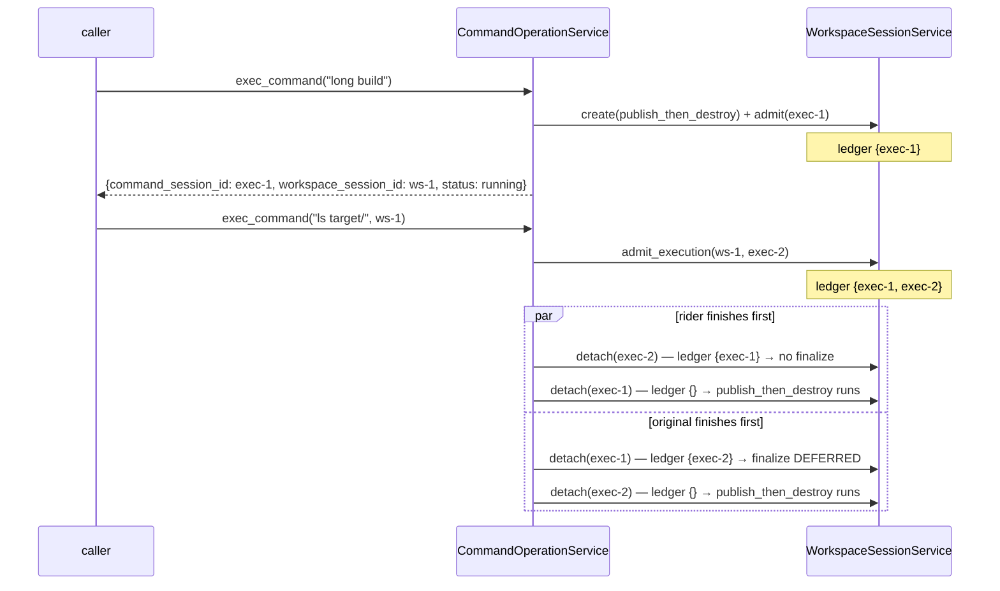
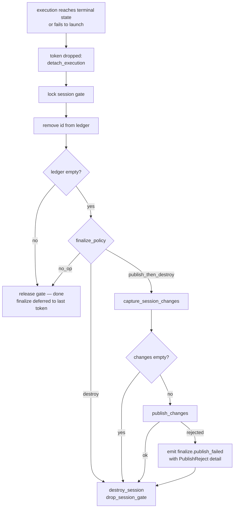
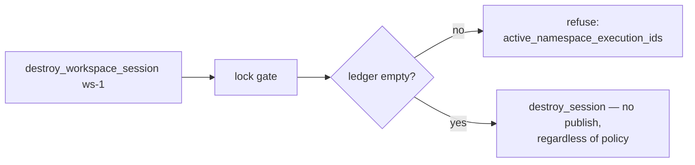
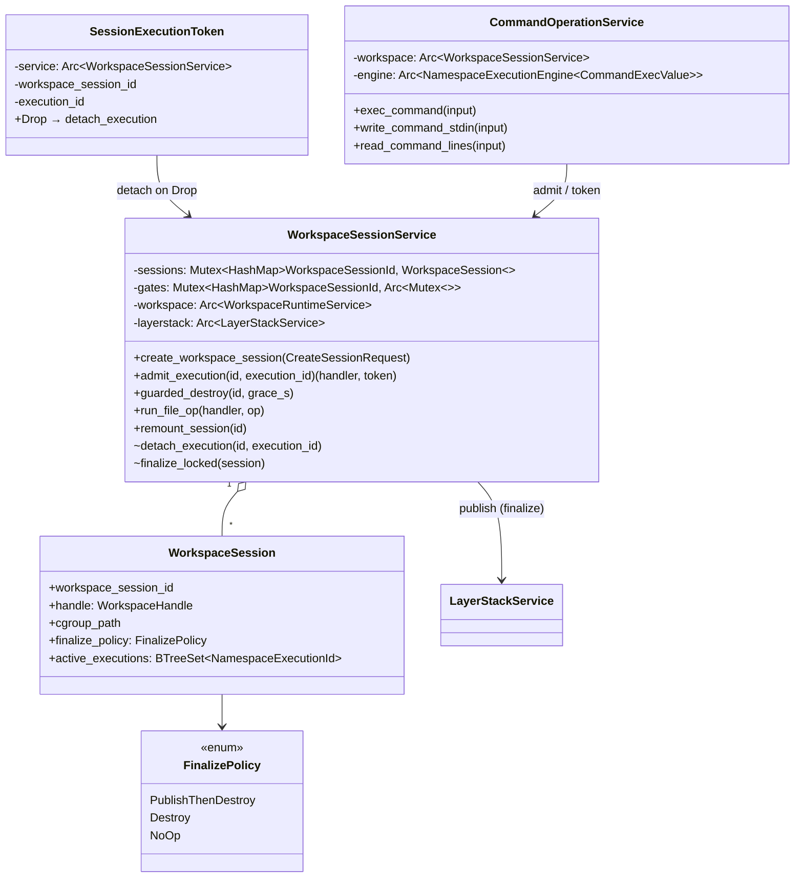

# Workspace Session Finalize Policy — Spec

Status: draft for review
Scope: `crates/sandbox-runtime/operation` (primary), `crates/sandbox-runtime/workspace` (doc-only), `sandbox-daemon` (observability field), CLI specs
Non-goals: protocol changes (`sandbox-protocol` untouched), session persistence across daemon restart, `finalize_workspace_session` op (phase 2)

## 1. Problem

Finalization (capture → publish → destroy) is a property of *how `exec_command` was invoked*, not of the session:

- `exec_command` without `workspace_session_id` creates a "one-shot" session and registers
  `finalize_one_shot` on the command's terminal edge (`command/service/exec_command.rs:224`).
  This closure is the **only** `publish_changes` call site in the operation crate.
- `finalize_one_shot` destroys the session **without checking for other live executions** —
  safe only because the one-shot session id never escapes. Exposing the id (needed to
  progress-check a long-running command) would let the finalizer capture a torn upperdir and
  tear the namespace down under an attached command.
- Session lifecycle logic leaks into the command service: `destroy_workspace_session_with_admission`
  and `WorkspaceDestroyOutcome` live in `command/service/core.rs` only because the liveness
  check scans the command engine.

## 2. Design

### 2.1 Concepts

One container concept. The one-shot / caller-owned (user-owned, ephemeral/persistent) split is
**deleted** from vocabulary, code, and docs.

- **Workspace session** — the only unit commands and file ops run in. Configuration:
  `network_profile` + `finalize_policy`, both fixed at creation.
- **Finalize policy** — what happens when the session's activity ceases:

  | Policy | On trigger |
  |---|---|
  | `publish_then_destroy` | capture upperdir → publish to layerstack (skip publish when capture is empty) → destroy session |
  | `destroy` | destroy session, discarding changes |
  | `no_op` | nothing; session lives until explicit `destroy_workspace_session` |

- **Namespace execution** — anything that runs inside the session's namespaces via
  `NamespaceExecutionEngine`: interactive commands, file ops, remounts, mounts
  (`namespace-execution/src/engine.rs:88,134,163,192`). Commands are one flavor, not the unit.
- **Activity ledger** — per-session set of running namespace-execution ids, owned by
  `WorkspaceSessionService`. Admission inserts; detach removes.
- **Trigger (the generic rule)** — *a session finalizes per its policy when a detach empties
  its activity ledger.* Edge-triggered: a session that never admits an execution never
  auto-finalizes. Ledger entries are running executions only; OS processes leaked by a command
  (`nohup … &`) do not pin the session — teardown's grace path kills them.

### 2.2 Ownership moves

- `WorkspaceSessionService` becomes the sole lifecycle owner: admission, activity ledger,
  finalization, guarded destroy. It gains an `Arc<LayerStackService>` dependency (publish
  moves here).
- `CommandOperationService` owns command interaction only (launch, stdin, transcript, yield)
  and **drops its `layerstack` field**.
- The workspace crate stays policy-free: `FinalizePolicy` lives in the operation crate;
  `CreateWorkspaceRequest { network }` in `workspace/src/model.rs:391` is unchanged. The
  operation layer introduces `CreateSessionRequest { network, finalize_policy }` and maps down.

### 2.3 Admission / detach protocol

All ledger mutations happen under the existing per-session admission gate
(`workspace_session/service/core.rs:46`), preserving the lock order
`gate → sessions map → storage writer`.

- `admit_execution(session_id, execution_id)` → lock gate → resolve session (fails
  `not_found` if destroyed) → insert id into ledger → return `(handler, SessionExecutionToken)`.
  The gate is released when admission returns; the token is what keeps the session alive.
- `SessionExecutionToken` is RAII: `Drop` calls `detach_execution`. `exec_command` moves the
  token into the engine `on_complete` closure; every exit path — normal terminal, timeout,
  cancel, **launch failure** — detaches by dropping.
- `detach_execution` → lock gate → remove id from ledger → if ledger now empty, run the
  session's policy while still holding the gate → (for destroying policies) remove session,
  `drop_session_gate`.

Synchronous executions (file ops `run_file_op.rs:26`, remounts `remount_session.rs:36,110`)
already hold the gate for their full duration and additionally take a token for uniformity:
the ledger — not gate-holding — is the single liveness truth. Mount executions during
`create_workspace_session` take no token: the session is not yet in the map, so no detach
edge can race them.

Race outcomes (unchanged from today's gate semantics, now uniform for every execution kind):

- Rider admitted before the long-running execution ends → ledger non-empty at its detach →
  finalization defers to the last token.
- Finalizer wins → session gone → late `admit_execution` fails with clean `not_found`.

### 2.4 Deleted special cases

- `fail_command_start` + `CommandServiceError::OneShotSessionCleanupFailed`: a command that
  fails to launch drops its token; the empty-ledger edge runs the policy. Launch-failure
  cleanup is no longer a code path, it is the ordinary trigger. (Consequence, accepted: an
  explicitly created `publish_then_destroy` session whose only execution fails at launch
  finalizes immediately; empty capture ⇒ publish skipped ⇒ effectively destroy.)
- `finalize_one_shot`, `finalize_closure`, `ResolvedExecWorkspace`, `create_one_shot_workspace_session`,
  `destroy_one_shot_workspace_session`.
- `destroy_workspace_session_with_admission` / `WorkspaceDestroyOutcome` leave the command
  service; the guarded destroy is re-implemented on the ledger and reports
  `active_namespace_execution_ids` (a superset of today's `active_command_session_ids`:
  file ops and remounts now count).

### 2.5 Failure semantics

- Publish failure under `publish_then_destroy`: destroy proceeds (ephemerality wins; no leaked
  sessions), but the rejection is no longer swallowed — the finalize span records an error
  status and a `workspace_session.finalize.publish_failed` event carries the
  `PublishReject` detail (source_conflict etc.).
- Empty capture: publish is skipped; destroy proceeds; span attr `published: false`.
- Detach runs on the engine watcher thread inside `on_complete` (same thread context as
  today's `finalize_one_shot`), which fires *before* `registry.complete` marks the engine
  entry terminal (`engine.rs:253-268`). The ledger is authoritative for lifecycle; the engine
  registry remains authoritative for transcript draining. The brief window where
  `active_namespace_executions` observability still shows the finishing command during
  finalize is harmless and documented.

### 2.6 Accepted uniformity consequences

- A lone file op on a `publish_then_destroy` session finalizes it on completion — it is a
  namespace execution like any other.
- `exec_command`'s response may return a `workspace_session_id` that is already finalized by
  the time the caller reads it (command finished within the yield window). The field is an
  identifier, not a liveness promise.
- Racing an explicit `destroy_workspace_session` against a bare `exec_command`'s
  create→admit window can destroy the fresh session first; the exec fails `not_found`.

## 3. CLI / protocol surface

`sandbox-protocol` unchanged (args ride the generic `Request` fields).

### create_workspace_session

```
sandbox-cli runtime create_workspace_session
    [--network-profile shared|isolated]                        existing, default shared
    [--finalize-policy publish_then_destroy|destroy|no_op]     NEW, default no_op
```

Response: `{ workspace_session_id, network_profile, finalize_policy }`.

### exec_command — flags unchanged

```
sandbox-cli runtime exec_command [--workspace-session-id ID] [--timeout-ms N] [--yield-time-ms N] COMMAND
```

- Without `--workspace-session-id`: implicitly creates a session with
  `finalize_policy = publish_then_destroy`, shared network. No `--finalize-policy` flag on
  exec_command (double-policy confusion; discard-runs use explicit create + attach).
- Response **adds `workspace_session_id`** next to `command_session_id` — the enabler for
  attaching progress-check executions.

### destroy_workspace_session — unchanged flags

Policy override: destroys without publishing regardless of policy; refuses while the ledger
is non-empty with details `{ active_namespace_execution_ids: [...] }` (renamed from
`active_command_session_ids`).

Rewritten op descriptions (drop "one-shot", "exec-owned", "caller-owned", "user-owned"):

> **exec_command** — Start a shell command in a workspace session. With `workspace_session_id`,
> run inside that existing session. Without it, exec_command creates a session with finalize
> policy `publish_then_destroy`. A session finalizes per its policy when its last running
> namespace execution reaches terminal state: `publish_then_destroy` captures and publishes
> the session's changes to the layerstack, then destroys the session; `destroy` discards the
> changes; `no_op` keeps the session alive until destroy_workspace_session. Commands, file
> operations, and remounts are all namespace executions; finalization waits for the last one.

## 4. Updated types

### 4.1 New

```rust
// operation/src/workspace_session/service/model.rs
pub enum FinalizePolicy { PublishThenDestroy, Destroy, NoOp }
impl FinalizePolicy { pub fn as_str(&self) -> &'static str; pub fn parse(s: &str) -> Option<Self>; }

pub struct CreateSessionRequest {
    pub network: NetworkProfile,
    pub finalize_policy: FinalizePolicy,
}

// operation/src/workspace_session/service/impls/admission.rs
pub struct SessionExecutionToken {   // RAII: Drop => detach_execution
    service: Arc<WorkspaceSessionService>,
    workspace_session_id: WorkspaceSessionId,
    execution_id: NamespaceExecutionId,
}
```

### 4.2 Modified

| Type | File | Change |
|---|---|---|
| `WorkspaceSession` | `workspace_session/service/model.rs:14` | + `finalize_policy: FinalizePolicy`, + `active_executions: BTreeSet<NamespaceExecutionId>`; drops `PartialEq/Eq` derive if needed |
| `WorkspaceSessionHandler` | `model.rs:7` | + `finalize_policy: FinalizePolicy` (span attr + response field source) |
| `WorkspaceSessionService` | `workspace_session/service/core.rs:12` | + field `layerstack: Arc<LayerStackService>`; ctor signature change |
| `CommandOperationService` | `command/service/core.rs:21` | − field `layerstack`; − `destroy_workspace_session_with_admission`, − `WorkspaceDestroyOutcome`, − one-shot create/destroy helpers, − `resolve_workspace_session` (superseded by admission) |
| `CommandOutput` | `command/service/dto.rs:54` | + `workspace_session_id: Option<WorkspaceSessionId>` |
| `CommandServiceError` | `command/error.rs:41` | − `OneShotSessionCleanupFailed` |
| `WorkspaceSessionError` | `workspace_session/error.rs` | + `ActiveExecutions { active_namespace_execution_ids }` |
| `RuntimeWorkspaceSnapshot` | `operation/src/observability.rs` | + `finalize_policy` (daemon snapshot JSON gains the field) |
| span attr `one_shot` | `exec_command.rs:42`, doc `sandbox-observability/src/record.rs:113` | → `finalize_policy` (string) + `session_created: bool` |

### 4.3 Method map

| Method | Before | After |
|---|---|---|
| `WorkspaceSessionService::create_workspace_session` | `(CreateWorkspaceRequest)` | `(CreateSessionRequest)`; stores policy; span attr `finalize_policy` |
| `WorkspaceSessionService::admit_execution` | — | NEW `(id: &WorkspaceSessionId, execution_id: NamespaceExecutionId) -> Result<(WorkspaceSessionHandler, SessionExecutionToken), WorkspaceSessionError>` |
| `WorkspaceSessionService::detach_execution` | — | NEW (crate-private; called by token Drop): remove from ledger; empty ⇒ `finalize_locked` |
| `WorkspaceSessionService::finalize_locked` | `finalize_one_shot` (free fn in `exec_command.rs:224`) | NEW policy runner in `impls/finalize_session.rs`; absorbs `layerstack_revision`, `layer_protected_drops` |
| `WorkspaceSessionService::guarded_destroy` | `CommandOperationService::destroy_workspace_session_with_admission` (`command/service/core.rs:108`) | moved; ledger check instead of engine scan |
| `WorkspaceSessionService::run_file_op` / `remount_session` | gate-held only | + token around the runner call |
| `CommandOperationService::exec_command` | resolve → gate juggling → launch → finalize closure → `fail_command_start` | validate → `admit_execution` → transcript → launch → attach → `on_complete` drops token |
| `CommandOperationService::resolve_exec_workspace`, `fail_command_start`, `create/destroy_one_shot_workspace_session` | exist | deleted |
| CLI `dispatch_destroy_workspace_session` | routes to `operations.command` | routes to `operations.workspace_session` |

## 5. File / folder structure and LOC

`operation/src` (current LOC → target estimate; Δ approximate):

```
crates/sandbox-runtime/operation/src/
├── command/
│   ├── error.rs                                    52 →  ~40   (−12: drop OneShotSessionCleanupFailed)
│   ├── exec_value.rs                               71 →   71   (unchanged; workspace_session_id already carried)
│   └── service/
│       ├── core.rs                                180 → ~100   (−80: destroy-with-admission, outcome enum, one-shot helpers, layerstack field out)
│       ├── dto.rs                                  65 →  ~68   (+3: CommandOutput.workspace_session_id)
│       ├── exec_command.rs                        282 → ~130   (−152: ResolvedExecWorkspace, finalize closure/runner, layerstack conversions, fail_command_start out; +admit/token wiring)
│       └── yield.rs                               127 → ~132   (+5: populate workspace_session_id from CommandExecValue)
├── workspace_session/
│   ├── error.rs                                    39 →  ~50   (+11: ActiveExecutions variant)
│   └── service/
│       ├── core.rs                                127 → ~140   (+13: layerstack dep, ctor, gate doc rewrite)
│       ├── model.rs                                45 → ~100   (+55: FinalizePolicy, CreateSessionRequest, session fields)
│       └── impls/
│           ├── mod.rs                               8 →   10   (+2: two new modules)
│           ├── admission.rs                       NEW → ~90    (admit/detach, SessionExecutionToken)
│           ├── finalize_session.rs                NEW → ~110   (policy runner, empty-capture skip, publish-failure event, layerstack conversions)
│           ├── guarded_destroy.rs                 NEW → ~60    (moved destroy-with-admission + outcome)
│           ├── create_workspace_session.rs         59 →  ~70   (+11: CreateSessionRequest, policy attr)
│           ├── destroy_session.rs                  40 →   40   (unchanged)
│           ├── resolve_session.rs                  18 →   18   (unchanged; capture/remount callers)
│           ├── run_file_op.rs                      40 →  ~48   (+8: token)
│           ├── remount_session.rs                 155 → ~165   (+10: token)
│           └── capture_session_changes.rs          29 →   29   (unchanged)
├── cli_definition/
│   ├── command_operations.rs                      390 → ~400   (+10: description rewrite, response field)
│   └── workspace_session_operations.rs            209 → ~250   (+41: --finalize-policy arg/parse/response, dispatch retarget, rejection rename)
├── observability.rs                                 — →  +1    (RuntimeWorkspaceSnapshot.finalize_policy)
└── services.rs                                      — →  ±5    (wiring: layerstack into WorkspaceSessionService)

crates/sandbox-runtime/workspace/src/model.rs       485 →  485  (doc reword only at :103)
crates/sandbox-observability/src/record.rs            — →  +6   (finalize span/event names; attr doc reword :58,:60,:113)
crates/sandbox-daemon/src/observability/service.rs    — →  +2   (workspace_value: finalize_policy field)
```

Net production src: ≈ **+260 new / −250 deleted ≈ +10 LOC** — the redesign is a move-and-generalize,
not a growth. Untouched on purpose: `namespace-execution` crate, `namespace-process` crate
(`mount_overlay.rs:33` "one-shot process" is the setns helper — unrelated sense), `sandbox-protocol`.

Tests (`tests/`, per repo rule — no test code in `src/`):

```
operation/tests/
├── workspace_session.rs        +~180  (policy matrix; deferred finalize with rider; lone file-op
│                                       finalize; empty-capture skip; guarded-destroy rejection
│                                       includes file-op executions; launch-failure edge)
├── exec_command.rs             ±~60   (one-shot tests renamed to implicit-session; response
│                                       workspace_session_id assertions)
├── layerstack_publish.rs       ±~30   (publish path now via finalize runner; failure event)
├── observability_trace.rs      ±~20   (finalize span nesting, finalize_policy attr)
├── command_transcript_rows.rs  ±~10   (rename)
└── support/mod.rs              ±~20   (session builder takes policy)
sandbox-daemon/tests/unit/observability.rs  ±~10   (snapshot field)
```

## 6. Workflows

### 6.1 Bare exec_command (implicit `publish_then_destroy`)

```mermaid
sequenceDiagram
    participant C as caller
    participant CMD as CommandOperationService
    participant WS as WorkspaceSessionService
    participant ENG as NamespaceExecutionEngine
    participant LS as LayerStackService

    C->>CMD: exec_command(cmd)
    CMD->>WS: create_workspace_session({shared, publish_then_destroy})
    WS-->>CMD: handler(ws-1)
    CMD->>WS: admit_execution(ws-1, exec-1)
    Note over WS: gate; ledger {exec-1}
    WS-->>CMD: (handler, token)
    CMD->>ENG: run_shell_interactive(cmd, on_complete=move token)
    CMD-->>C: CommandOutput{command_session_id, workspace_session_id: ws-1, status}
    ENG->>ENG: watcher: terminal state
    ENG->>WS: on_complete → drop(token) → detach_execution(ws-1, exec-1)
    Note over WS: gate; ledger {} → run policy
    WS->>WS: capture_session_changes
    alt capture non-empty
        WS->>LS: publish_changes(owner: workspace_session:ws-1)
    else empty
        Note over WS: skip publish
    end
    WS->>WS: destroy_session(ws-1); drop_session_gate
```

### 6.2 Long-running command + progress-check rider (deferred finalize)



### 6.3 Detach edge — the one trigger (flowchart)



### 6.4 Guarded explicit destroy



### 6.5 Resulting class relations



## 7. Implementation order

1. `model.rs`: `FinalizePolicy`, `CreateSessionRequest`, session fields; `create_workspace_session` signature; wiring in `services.rs` (layerstack into `WorkspaceSessionService`).
2. `admission.rs` + token; `finalize_session.rs` (move + generalize `finalize_one_shot`, absorb layerstack conversions, empty-capture skip, publish-failure event).
3. `exec_command.rs` rewrite on admit/token; delete `ResolvedExecWorkspace`, `fail_command_start`, one-shot helpers; `CommandOutput.workspace_session_id` (+ `yield.rs`).
4. Move guarded destroy into `guarded_destroy.rs`; retarget CLI dispatch; rename rejection field; tokens in `run_file_op` / `remount_session`.
5. CLI specs + descriptions; observability names/attrs; snapshot field.
6. Tests per §5; `cargo clippy --all-targets` + `cargo fmt` clean.

## 8. Acceptance criteria

- Bare `exec_command` behaves byte-identically to today except the response gains `workspace_session_id`.
- A rider attached to a running implicit session defers finalization; no destroy-under-live-execution is possible by construction.
- `destroy_workspace_session` refuses while any namespace execution (command, file op, remount) runs, reporting `active_namespace_execution_ids`.
- Publish rejection during finalize is observable (span error + event), and destroy still completes.
- `grep -rn "one_shot\|one-shot\|OneShot" crates --include="*.rs"` returns only the setns helper comment (`namespace-process/src/runner/setns/mount_overlay.rs:33`).
- Workspace/README boundary law intact: workspace crate remains policy-free; protocol crate untouched.
