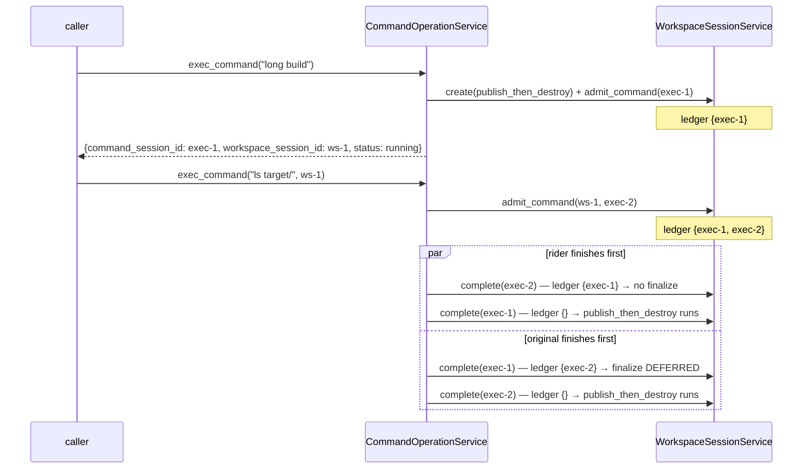
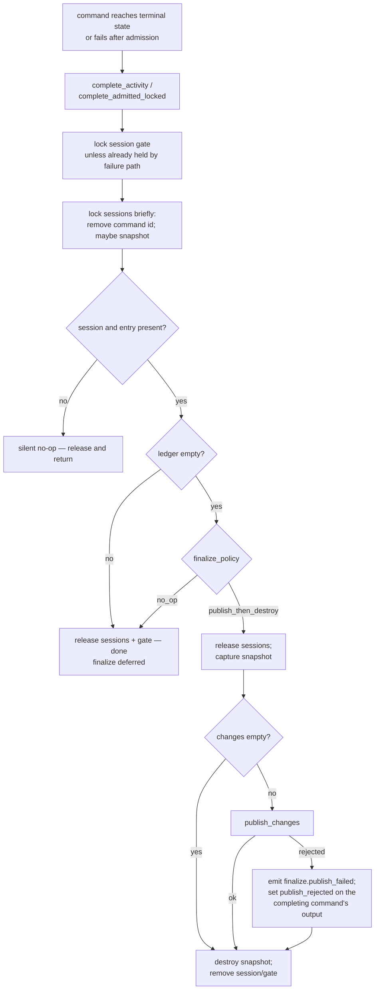
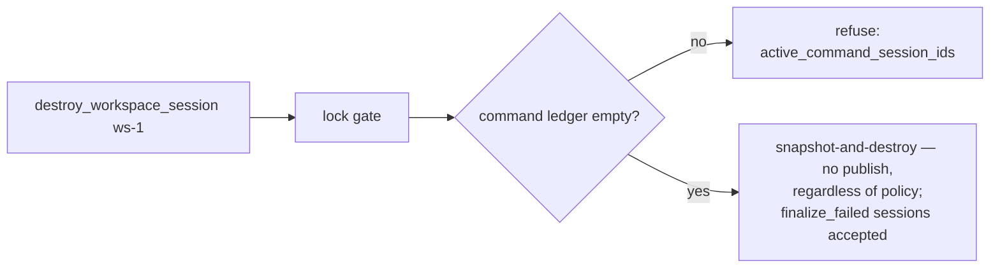
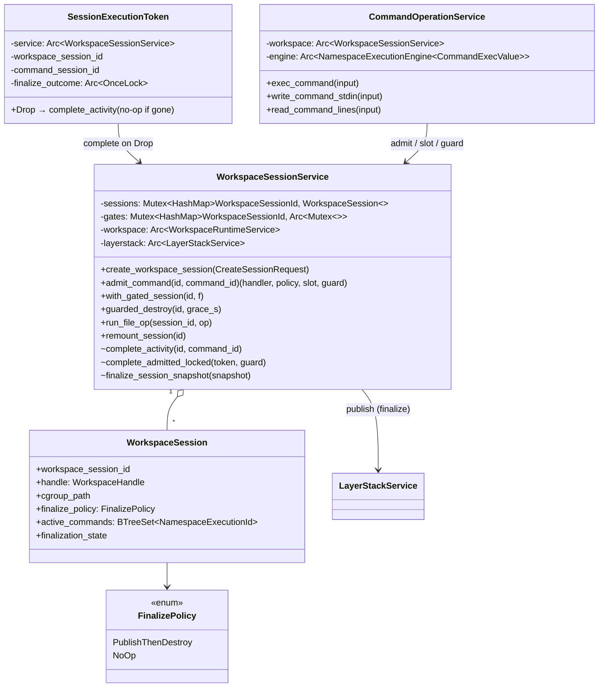

# Workspace Session Finalize Policy — Spec

Status: draft v2 — adversarial design review findings incorporated (see
`review.md` in this folder if archived; finding ids F1–F14 referenced inline)
Scope: `crates/sandbox-runtime/operation` (primary), `crates/sandbox-runtime/namespace-execution`
(completed-entry retention), `crates/sandbox-runtime/workspace` (doc-only), `sandbox-daemon`
(observability field), operation specs
Non-goals: protocol changes (`sandbox-protocol` untouched), session persistence across daemon
restart, `finalize_workspace_session` op (phase 2), a `--finalize-policy` flag on
`create_workspace_session` (deferred until a caller demonstrates a guaranteed-overlap usage —
see §3), and sustained-rate throughput beyond the workspace-crate state lock (see §2.7)

## 1. Problem

Finalization (capture → publish → destroy) is a property of *how `exec_command` was invoked*,
not of the session:

- `exec_command` without `workspace_session_id` creates a "one-shot" session and registers
  `finalize_one_shot` on the command's terminal edge (`command/service/exec_command.rs:224`).
  This closure is the **only** `publish_changes` call site in the operation crate.
- `finalize_one_shot` destroys the session **without checking for other live executions** —
  safe only because the one-shot session id never escapes. Exposing the id (needed to
  progress-check a long-running command) would let the finalizer capture a torn upperdir and
  tear the namespace down under an attached command.
- Session lifecycle logic leaks into the command service: `destroy_workspace_session_with_admission`
  and `WorkspaceDestroyOutcome` live in `command/service/core.rs` only because the liveness
  check scans the command engine.

## 2. Design

### 2.1 Concepts

One container concept. The one-shot / caller-owned (user-owned, ephemeral/persistent) split is
**deleted** from vocabulary, code, and docs.

- **Workspace session** — the only unit commands and file ops run in. Configuration:
  `network_profile` + `finalize_policy`, both fixed at creation. Sessions created through
  `create_workspace_session` are always `no_op`; `publish_then_destroy` is set only by
  `exec_command`'s implicit create through the operation-layer `CreateSessionRequest` and is
  not exposed on the CLI (see §3 for why).
- **Finalize policy** — what happens when the session's command activity ceases:

  | Policy | On trigger |
  |---|---|
  | `publish_then_destroy` | capture upperdir → publish to layerstack (skip publish when capture is empty) → destroy session |
  | `no_op` | nothing; session lives until explicit `destroy_workspace_session` |

- **Namespace execution** — anything that runs inside the session's namespaces via
  `NamespaceExecutionEngine`: interactive commands, file ops, remounts, mounts
  (`namespace-execution/src/engine.rs:88,134,163,192`). Commands are one flavor, not the unit.
- **Command ledger** — per-session set of running command `NamespaceExecutionId`s, owned by
  `WorkspaceSessionService`. Admission inserts; completion removes. The ledger holds
  **commands only** (F1). Synchronous file ops and remounts hold the per-session admission
  gate for their entire duration, so every command completion is already ordered strictly
  before or after them by the gate alone — a ledger entry for them changes no interleaving
  outcome. Worse, arming the policy on sync-op completion would let background maintenance
  (the post-squash remount sweep touches *every* live session via `session_ids()`,
  `layerstack/service/impls/squash.rs:57-62`) empty the ledger of an idle
  `publish_then_destroy` session and destroy it (F2). Sync ops therefore take no ledger entry
  and never trigger the policy.
- **Trigger (the generic rule)** — *a session finalizes per its policy when a command
  completion empties its command ledger.* Edge-triggered: a session that never admits a
  command never auto-finalizes — including under file ops, remounts, and remount sweeps.
  Ledger entries are running commands only; OS processes leaked by a command (`nohup … &`) do
  not pin the session — teardown's grace path kills them.

### 2.2 Ownership moves

- `WorkspaceSessionService` becomes the sole lifecycle owner: admission, command ledger,
  finalization, guarded destroy. It gains an `Arc<LayerStackService>` dependency (publish
  moves here).
- `CommandOperationService` owns command interaction only (launch, stdin, transcript, yield)
  and **drops its `layerstack` field**.
- The workspace crate stays policy-free: `FinalizePolicy` lives in the operation crate;
  `CreateWorkspaceRequest { network }` in `workspace/src/model.rs:391` is unchanged. The
  operation layer introduces `CreateSessionRequest { network, finalize_policy }` and maps down.
- Accepted module-shape consequence (F11): the new `workspace_session → layerstack` edge
  closes a module-level import cycle inside the operation crate
  (`workspace_session → layerstack → file → workspace_session`), because file-service impls
  take `&WorkspaceSessionService` as a call parameter (`file/service/namespace.rs:19-26`).
  The Arc-ownership graph stays acyclic (`FileService` holds no service references) and no
  runtime call cycle exists (`record_layer_publish` never re-enters the session service).
  Construction order in `services.rs` changes to: file → workspace base → layerstack →
  workspace_session → command (today workspace_session is built before layerstack,
  `services.rs:65-93`).

### 2.3 Admission / completion protocol

All ledger mutations happen under the existing per-session admission gate
(`workspace_session/service/core.rs:46`), but the global `sessions` map is held only for
metadata edits. The hard lock rule is:

> hold `gate` across admission/completion/finalization for one session; never hold `sessions`
> across capture, publish, destroy, cgroup cleanup, storage writer work, or a helper that can
> re-enter `WorkspaceSessionService`.

The gate doc in `core.rs:41-45` is corrected as part of this change (F13): it currently
claims the gate serializes "capture", but the public capture method never took the gate — it
was protected only accidentally by holding `sessions` across the walk. After this change,
capture exists only inside the finalize runner, under the gate held by the completion path.

- `admit_command(session_id, command_session_id)` → **acquire the gate and keep it**
  (returned as a held `SessionAdmissionGuard`) → lock `sessions` → resolve session (fails
  `not_found` if destroyed/finalizing) → insert id into ledger → clone the handler and policy
  → release `sessions` → return `(handler, finalize_policy, token slot, SessionAdmissionGuard)`.
  Realization latitude: a struct owning both the gate `Arc` and its `MutexGuard` is
  self-referential in Rust, so the concrete shape may instead be caller-locks — `exec_command`
  clones the gate `Arc`, holds the guard itself (exactly today's structure,
  `exec_command.rs:43-49`), and calls an `admit_command_locked` that requires the held guard.
  Either shape satisfies this protocol; "the guard" below means whichever realization holds
  the gate.
- **The admission guard stays held across transcript prep → launch → attach** and is dropped
  by `exec_command` immediately after `attach` (F3). This is exactly today's serialization —
  the current code holds the admission guard from before `allocate_id` to after `attach`
  (`exec_command.rs:46-119`) — so launches remain serialized against file ops, remounts, the
  post-squash sweep, and guarded destroys, and finalization is ordered strictly after
  `attach` (a fast command's watcher blocks on the gate until the guard drops).
- `SessionExecutionToken` is RAII for the command's completion. Because the guard is held
  through launch, the token cannot be dropped directly on the caller thread while the guard is
  held (non-reentrant gate ⇒ self-deadlock). It is therefore held in a **take-once slot**
  (`Arc<Mutex<Option<SessionExecutionToken>>>`) shared between `exec_command` and the engine
  `on_complete` closure; exactly one side completes it:
  - watcher path: `on_complete` takes the token from the slot and drops it →
    `complete_activity` (locks the gate itself, on the watcher thread) — this covers normal
    terminal, timeout, cancel, and watcher-panic unwind (the closure drop still fires).
  - failure path while the guard is held (transcript-prep failure, `MAX_ACTIVE` rejection,
    launch failure): `exec_command` takes the token from the slot and calls the crate-private
    `complete_admitted_locked(token, &guard)`, which removes the ledger entry and runs the
    policy **using the already-held gate** — it never re-locks the gate.
  - Implementation note: in `exec_command`, the guard binding must be declared *after* the
    token slot so that a panic unwind drops the guard (releasing the gate) before the slot
    drops the token.
- Synchronous file ops and remounts use `with_gated_session(session_id, f)`: lock gate →
  lock `sessions` → resolve → release `sessions` → run `f(handler)` while the gate is held →
  release the gate. **No ledger mutation and no finalization** (F1) — the gate alone provides
  the exclusion, and completion hand-off is unaffected in every interleaving (a command
  completion either precedes the sync op, in which case the sync op resolves `not_found` on a
  finalized session, or follows it, in which case the gate ordered them). This also removes
  the pre-gate stale-handler hazard: today file dispatch resolves the handler before the gate
  (`file/service/namespace.rs:24-26`).
- `complete_activity` → lock gate → lock `sessions` → remove id from ledger. **If the session
  or the ledger entry is missing, this is a silent no-op** (F5) — release and return; this is
  the defined behavior for tokens whose session was removed by the faulty-session sweep or an
  earlier finalize. Otherwise: if the ledger is empty and policy is `publish_then_destroy`,
  mark the session `finalizing` and snapshot the handle/cgroup/policy data needed for
  finalization → release `sessions` → run policy while still holding the gate → remove the
  session/gate after destroy.
- `no_op` completion removes the command id and releases the gate; the session remains
  resolvable.
- Gates-map hygiene (F8): `session_gate` lazily creates entries, so any gate-then-resolve
  path that fails `not_found` must remove the gates-map entry it may have resurrected —
  conditionally, under the gates lock, only when the map entry is the same `Arc`
  (`Arc::ptr_eq`) and the sessions map has no entry for the id. Without this, every late
  rider or late destroy on a finalized id (a designed pattern now that the id escapes via
  `CommandOutput`) grows the gates map forever.
- Mount executions during `create_workspace_session` take no ledger entry: the session is not
  yet in the map, so no completion edge can race them.

Finalization does **not** call public helpers that lock `sessions` again. It uses private
snapshot helpers that operate on the cloned `WorkspaceHandle` and perform map updates in short
critical sections. Explicit destroy uses the same snapshot-and-I/O pattern.

Race outcomes (now genuinely unchanged from today's gate semantics — the guard-through-attach
rule above is what makes this claim true):

- Rider admitted before the long-running execution ends → ledger non-empty at completion →
  finalization defers to the last token.
- Finalizer wins → session gone → late admission fails with clean `not_found` (and cleans the
  gates-map entry per the hygiene rule).
- A caller that cloned a stale handler before finalization cannot run work from it: file ops
  and remounts must resolve inside `with_gated_session`, not before the gate.
- A sync op racing the last command completion loses cleanly: it blocks on the gate during
  finalize and resolves `not_found` afterwards.

### 2.4 Deleted or relocated

Deleted (the responsibility ceases to exist):

- `fail_command_start` + `CommandServiceError::OneShotSessionCleanupFailed`: after successful
  admission, a command that fails to launch completes through the ordinary trigger (via
  `complete_admitted_locked`, §2.3). Launch-failure cleanup is no longer a separate code path.
  Failure **before** admission either has no session or destroys the freshly created implicit
  session directly; if that direct destroy itself fails, the original command error surfaces
  and the destroy failure is recorded as a `workspace_session.cleanup_failed` event — no
  compound error variant replaces `OneShotSessionCleanupFailed` (F10).
- `finalize_closure`, `ResolvedExecWorkspace`, `create_one_shot_workspace_session`,
  `destroy_one_shot_workspace_session`.
- The public `capture_session_changes` method (F13): its sole caller is the finalize path
  (`exec_command.rs:232`); the snapshot capture becomes a private helper inside
  `finalize_session.rs`. Leaving it public would hand a future caller a capture-vs-destroy
  torn-walk race once the `sessions`-lock-over-walk protection is removed.

Relocated (moved and generalized — counted as moves, not deletions):

- `finalize_one_shot` (free fn in `exec_command.rs:224`) → `finalize_session.rs` policy
  runner.
- `destroy_workspace_session_with_admission` / `WorkspaceDestroyOutcome` leave the command
  service; the guarded destroy is re-implemented on the ledger in `guarded_destroy.rs`. The
  rejection detail keeps its current name `active_command_session_ids` — the ledger holds
  only command ids (F1), so no rename is needed or wanted.

### 2.5 Failure semantics

- Publish failure under `publish_then_destroy`: destroy proceeds (ephemerality wins; no leaked
  sessions), and any unpublished upperdir changes are intentionally discarded. The rejection is
  no longer swallowed — three surfaces (F9):
  1. the finalize span records an error status;
  2. a `workspace_session.finalize.publish_failed` event carries the `PublishReject` detail
     (`source_conflict`, invalid base, etc.);
  3. the terminal `CommandOutput` of the command whose completion ran the finalize carries
     `publish_rejected: true` plus the reject class. This is wired through a once-set slot
     shared between the command's token and its registry value (stored at `attach`, which the
     §2.3 guard rule orders before any finalize); because `promise.resolve` fires after
     `on_complete` returns, any caller that observes terminal status observes the populated
     slot.
  Semantics note: `expected_base` in `publish_changes` is a request self-consistency check
  (`layerstack/service/impls/publish_changes.rs:15-21`), not a compare-and-swap against the
  head; concurrent publishes serialize on the layerstack writer lock and stale bases are
  resolved by three-way merge (`layerstack/src/stack/publish/resolve.rs`). Only unresolvable
  source conflicts reject, whole-changeset. This policy governs those remaining rejects.
- Empty capture: publish is skipped; destroy proceeds; span attr `published: false`.
- Command activity completion runs on the engine watcher thread inside `on_complete` (same
  thread context as today's `finalize_one_shot`), which fires *before* `registry.complete`
  marks the engine entry terminal (`engine.rs:253-268`). The ledger is authoritative for
  lifecycle; the engine registry remains authoritative for transcript draining. The brief
  window where `active_namespace_executions` observability still shows the finishing command
  during finalize is harmless and documented. A completed `yield` response includes
  finalization latency; running responses can still return before finalization.
- Token `Drop` is infallible and panic-contained. `complete_activity` on a missing session or
  missing ledger entry is a silent no-op (§2.3). A poisoned lock or panic during completion
  records an error event and leaves the session in `finalize_failed`/stuck-`finalizing` state;
  it must not panic out of `Drop`.
- Recovery from `finalize_failed` (F7): **`guarded_destroy` treats `finalize_failed` and
  stuck-`finalizing` sessions as destroyable** — it applies the ledger check only, then
  snapshot-and-destroy without publish. Explicit `destroy_workspace_session` is the recovery
  path in this phase; the `finalize_workspace_session` op remains phase 2. Without this rule
  a finalize panic would leak the namespace and lease until daemon restart.
- Completed-entry retention (F4), concretely: the execution registry keeps at most
  `MAX_TERMINAL_ENTRIES` (default **512**) terminal entries; marking an entry terminal evicts
  the oldest terminal entry beyond the cap. Eviction drops the stored value — closing the pty
  master fd held by `InteractiveExecution` (`namespace-execution/src/execution.rs:52-55`) —
  and `CommandExecValue` gains a `Drop` that removes its command scratch directory (today
  scratch dirs are cleaned only on launch failure, `exec_command.rs:104,154-157`). A
  transcript drain after eviction returns `CommandNotFound`; that is accepted and documented.
  Today's registry never removes completed entries (`registry.rs:71-84`) and each pins one pty
  fd — at sustained rate this is fd exhaustion, so the retention bound ships in this phase,
  not later. The finalization design does not rely on scanning completed registry entries, so
  eviction cannot affect lifecycle correctness.
- `MAX_ACTIVE` bursts on bare `exec_command` (F14): a rejected reserve after an implicit
  create completes through the ordinary trigger — one full workspace create + destroy per
  rejected request. This matches today's `fail_command_start` cost and is accepted at the
  stated burst profile; an admission pre-check before implicit create is a possible later
  optimization, not part of this phase.
- Token ownership is cycle-free: tokens live only in watcher-owned closures and hold
  `Arc<WorkspaceSessionService>`, so a token's completion can never run against a mid-drop
  service, and the service owns no watchers or tokens back.

### 2.6 Accepted uniformity consequences

- `exec_command`'s response may return a `workspace_session_id` that is already finalized by
  the time the caller reads it (command finished within the yield window). The field is an
  identifier, not a liveness promise.
- A file op or remount racing the last command completion on a `publish_then_destroy` session
  gets a clean `not_found` — sync ops never extend, and never trigger, the session lifecycle.
- The post-squash remount sweep can touch every live session and **cannot finalize or destroy
  a healthy one** (F2): remounts take no ledger entry and trigger no policy.
- The faulty-session sweep (`destroy_faulty_session`, `remount_session.rs:108-126`, invoked
  from `squash.rs:64-76`) is the **one documented destroy-under-live-command path** (F5): it
  destroys a session whose ledger may still hold a frozen command. It kills the namespace
  holder first, so the dead command's watcher fires and its late `complete_activity` no-ops
  against the missing session. §8's "no destroy under live execution" criterion is scoped to
  guarded destroy and finalization; the faulty path is the explicit exception.
- Racing an explicit `destroy_workspace_session` against a bare `exec_command`'s create→admit
  window can destroy the fresh session first only if the id has already been returned to that
  caller through an earlier response (the sweep can no longer do this — see above). If an
  implicit create succeeds and admission then fails, `exec_command` destroys that fresh
  session directly before returning the error.

### 2.7 Known limits (out of scope)

The workspace-crate state lock remains the surviving global serializer at rate (F6): it is
held across the full synchronous runner roundtrip of every file op
(`workspace/src/service/impls/run_file_op.rs:34-44` → `namespace/setns_runner.rs:113-119`)
and across `manager.close` (grace-kill + scratch rmtree + persist,
`workspace/src/lifecycle/destroy.rs:92-121`) during destroy. This redesign removes the
operation-layer `sessions` mutex from all I/O paths (§2.3 hard rule) but does not and cannot
fix the layer below — the workspace crate is doc-only in this change. Sustained hundreds of
create→exec→finalize→destroy cycles per second will saturate that lock; raising that ceiling
is explicitly future work, and this spec's acceptance criteria make no throughput claim
beyond the operation layer.

## 3. CLI / protocol surface

`sandbox-protocol` unchanged (args ride the generic `Request` fields).

### create_workspace_session — internal request arguments unchanged

```json
{
  "op": "create_workspace_session",
  "scope": { "kind": "sandbox", "sandbox_id": "ID" },
  "args": { "network_profile": "shared" }
}
```

Response: `{ workspace_session_id, network_profile, finalize_policy }` — `finalize_policy` is
always `"no_op"` for CLI-created sessions.

No `--finalize-policy` flag ships in this phase (F12): under the edge trigger, the first
completed command on a non-overlapping `publish_then_destroy` session finalizes it, so
`create → exec → exec` is impossible under that policy — no current caller can use it, and
the only sound pattern (guaranteed-overlap riders) is exactly the implicit path. The
operation-layer `CreateSessionRequest` carries the policy so `exec_command` can set it
internally; the flag is added later if a real caller appears.

### exec_command — public flags unchanged

```
sandbox-runtime-cli --sandbox-id ID exec_command [--workspace-session-id ID] [--timeout-ms N] [--yield-time-ms N] COMMAND
```

- Without `--workspace-session-id`: implicitly creates a session with
  `finalize_policy = publish_then_destroy`, shared network. No `--finalize-policy` flag on
  exec_command (double-policy confusion; discard-runs use explicit create + attach + explicit
  destroy).
- Response **adds `workspace_session_id`** next to `command_session_id` — the enabler for
  attaching progress-check executions.
- Terminal responses add `publish_rejected` (+ reject class) when this command's completion
  ran a finalize whose publish was rejected (§2.5).

### destroy_workspace_session — unchanged flags

Policy override: destroys without publishing regardless of policy; refuses while the command
ledger is non-empty with details `{ active_command_session_ids: [...] }` (field name
unchanged — the ledger holds only command ids). Sessions in `finalize_failed` or
stuck-`finalizing` state are destroyable through this op (§2.5).

Rewritten op descriptions (drop "one-shot", "exec-owned", "caller-owned", "user-owned"):

> **exec_command** — Start a shell command in a workspace session. With `workspace_session_id`,
> run inside that existing session. Without it, exec_command creates a session with finalize
> policy `publish_then_destroy`. A session finalizes per its policy when its last running
> command reaches terminal state: `publish_then_destroy` captures and publishes the session's
> changes to the layerstack, then destroys the session; `no_op` keeps the session alive until
> destroy_workspace_session. Explicit `destroy_workspace_session` always discards unpublished
> changes. File operations and remounts run under the session's admission gate and neither
> extend nor trigger the session lifecycle.

## 4. Updated types

### 4.1 New

```rust
// operation/src/workspace_session/service/model.rs
pub enum FinalizePolicy { PublishThenDestroy, NoOp }
impl FinalizePolicy { pub fn as_str(&self) -> &'static str; }

pub struct CreateSessionRequest {
    pub network: NetworkProfile,
    pub finalize_policy: FinalizePolicy,
}

// operation/src/workspace_session/service/impls/admission.rs
pub struct SessionExecutionToken {   // Drop => complete_activity (no-op if session gone)
    service: Arc<WorkspaceSessionService>,
    workspace_session_id: WorkspaceSessionId,
    command_session_id: NamespaceExecutionId,
    finalize_outcome: Arc<OnceLock<FinalizeOutcome>>,   // publish_rejected surfacing (§2.5)
}

// The held-gate admission guard. May be realized as caller-locks (exec_command holds the
// gate Arc + MutexGuard, today's shape) with `admit_command_locked` — see §2.3.
pub struct SessionAdmissionGuard<'a> { /* held gate guard; drop releases the gate */ }

// take-once slot shared between exec_command's failure path and on_complete (§2.3)
pub type TokenSlot = Arc<Mutex<Option<SessionExecutionToken>>>;
```

`SessionActivityId` / `SessionActivityKind` from draft v1 are **not introduced** (F1): the
ledger holds `NamespaceExecutionId`s only.

### 4.2 Modified

| Type | File | Change |
|---|---|---|
| `WorkspaceSession` | `workspace_session/service/model.rs:14` | + `finalize_policy: FinalizePolicy`, + `active_commands: BTreeSet<NamespaceExecutionId>`, + `finalization_state`; drops `PartialEq/Eq` derive if needed |
| `WorkspaceSessionHandler` | `model.rs:7` | unchanged; policy stays in `WorkspaceSession`, not every handler clone |
| `WorkspaceSessionService` | `workspace_session/service/core.rs:12` | + field `layerstack: Arc<LayerStackService>`; ctor signature change; gate doc corrected (F13) |
| `CommandOperationService` | `command/service/core.rs:21` | − field `layerstack`; − `destroy_workspace_session_with_admission`, − `WorkspaceDestroyOutcome`, − one-shot create/destroy helpers, − `resolve_workspace_session` (superseded by admission) |
| `CommandOutput` | `command/service/dto.rs:54` | + `workspace_session_id: Option<WorkspaceSessionId>`, + `publish_rejected` (terminal only) |
| `CommandExecValue` | `command/exec_value.rs` | + `finalize_outcome: Arc<OnceLock<FinalizeOutcome>>` (set at attach), + `Drop` removing the command scratch dir (retention, §2.5) |
| `CommandServiceError` | `command/error.rs:41` | − `OneShotSessionCleanupFailed` (pre-admission cleanup failure → original error + event, §2.4) |
| `WorkspaceSessionError` | `workspace_session/error.rs` | + `ActiveCommands { active_command_session_ids }`, + finalization failure variant |
| `ExecutionRegistry` | `namespace-execution/src/registry.rs` | + `MAX_TERMINAL_ENTRIES` cap with oldest-terminal eviction on `complete` (§2.5) |
| `RuntimeWorkspaceSnapshot` | `operation/src/observability.rs` | + `finalize_policy` (daemon snapshot JSON gains the field) |
| span attr `one_shot` | `exec_command.rs:42`, doc `sandbox-observability/src/record.rs:113` | → `finalize_policy` (string) + `session_created: bool` |

### 4.3 Method map

| Method | Before | After |
|---|---|---|
| `WorkspaceSessionService::create_workspace_session` | `(CreateWorkspaceRequest)` | `(CreateSessionRequest)`; stores policy; span attr `finalize_policy` |
| `WorkspaceSessionService::admit_command` | — | NEW `(id: &WorkspaceSessionId, command_id: NamespaceExecutionId) -> Result<(WorkspaceSessionHandler, FinalizePolicy, TokenSlot, SessionAdmissionGuard), WorkspaceSessionError>`; guard held by caller through attach (§2.3) |
| `WorkspaceSessionService::with_gated_session` | gate-held file/remount callers resolve pre-gate | NEW: resolve inside the gate, run `f(handler)` under it; no ledger mutation, no finalization (F1) |
| `WorkspaceSessionService::complete_activity` | — | NEW (crate-private; token Drop): remove from ledger; missing session/entry ⇒ no-op; empty ⇒ snapshot + finalize |
| `WorkspaceSessionService::complete_admitted_locked` | — | NEW (crate-private): completion for failure paths that already hold the admission guard; never re-locks the gate (§2.3) |
| `WorkspaceSessionService::finalize_session_snapshot` | `finalize_one_shot` (free fn in `exec_command.rs:224`) | NEW policy runner in `impls/finalize_session.rs`; absorbs the private snapshot capture (F13); no `sessions` lock held during capture/publish/destroy; sets the finalize-outcome slot |
| `WorkspaceSessionService::guarded_destroy` | `CommandOperationService::destroy_workspace_session_with_admission` (`command/service/core.rs:108`) | moved; ledger check instead of engine scan; accepts `finalize_failed`/stuck-`finalizing` sessions (F7) |
| `WorkspaceSessionService::run_file_op` / `remount_session` | caller may resolve before gate | resolve through `with_gated_session`; no pre-gate stale handler |
| `WorkspaceSessionService::destroy_faulty_session` | gate + resolve + destroy, no liveness check | unchanged shape; documented exception (§2.6); relies on no-op completion for the frozen command's late token |
| `CommandOperationService::exec_command` | resolve → gate juggling → launch → finalize closure → `fail_command_start` | create if needed → `admit_command` (guard held) → transcript → launch → attach → drop guard; failure under guard completes via `complete_admitted_locked` |
| `CommandOperationService::resolve_exec_workspace`, `fail_command_start`, `create/destroy_one_shot_workspace_session` | exist | deleted |
| public `capture_session_changes` | exists (`impls/capture_session_changes.rs`) | deleted; private snapshot capture in `finalize_session.rs` (F13) |
| CLI `dispatch_destroy_workspace_session` | routes to `operations.command` | routes to `operations.workspace_session` |

## 5. File / folder structure and LOC

`operation/src` (current LOC → target estimate; Δ approximate):

```
crates/sandbox-runtime/operation/src/
├── command/
│   ├── error.rs                                    52 →  ~40   (−12: drop OneShotSessionCleanupFailed)
│   ├── exec_value.rs                               71 →  ~85   (+14: finalize-outcome slot; Drop removes scratch dir)
│   └── service/
│       ├── core.rs                                180 → ~100   (−80: destroy-with-admission, outcome enum, one-shot helpers, layerstack field out)
│       ├── dto.rs                                  65 →  ~72   (+7: CommandOutput.workspace_session_id, publish_rejected)
│       ├── exec_command.rs                        282 → ~135   (−147: ResolvedExecWorkspace, finalize closure/runner, layerstack conversions, fail_command_start out; +admit/guard/slot wiring)
│       └── yield.rs                               127 → ~140   (+13: populate workspace_session_id + publish_rejected from CommandExecValue)
├── workspace_session/
│   ├── error.rs                                    39 →  ~50   (+11: ActiveCommands variant, finalization failure)
│   └── service/
│       ├── core.rs                                127 → ~148   (+21: layerstack dep, ctor, gate doc rewrite incl. F13 correction, gates-map hygiene helper)
│       ├── model.rs                                45 →  ~90   (+45: FinalizePolicy, CreateSessionRequest, session fields — no SessionActivityId/Kind)
│       └── impls/
│           ├── mod.rs                               8 →   10   (+2: two new modules)
│           ├── admission.rs                       NEW → ~115   (admit_command + guard, with_gated_session, complete_activity, complete_admitted_locked, token + slot)
│           ├── finalize_session.rs                NEW → ~135   (snapshot policy runner + private capture, empty-capture skip, publish-failure event + outcome slot, layerstack conversions)
│           ├── guarded_destroy.rs                 NEW → ~70    (moved destroy-with-admission + ledger rejection + finalize_failed acceptance)
│           ├── create_workspace_session.rs         59 →  ~70   (+11: CreateSessionRequest, policy attr)
│           ├── destroy_session.rs                  40 →  ~50   (snapshot-and-I/O; no sessions lock over destroy)
│           ├── resolve_session.rs                  18 →   18   (unchanged for read-only metadata callers)
│           ├── run_file_op.rs                      40 →  ~45   (resolve through with_gated_session)
│           ├── remount_session.rs                 155 → ~160   (resolve through with_gated_session)
│           └── capture_session_changes.rs          29 →    0   (deleted; folded into finalize_session.rs as private capture — sole caller was the finalize path)
├── cli_definition/
│   ├── command_operations.rs                      390 → ~405   (+15: description rewrite, response fields incl. publish_rejected)
│   └── workspace_session_operations.rs            209 → ~225   (+16: finalize_policy response field, dispatch retarget; NO --finalize-policy flag, NO rejection rename)
├── observability.rs                                 — →  +1    (RuntimeWorkspaceSnapshot.finalize_policy)
└── services.rs                                      — →  ±10   (wiring: layerstack into WorkspaceSessionService; construction reorder file → base → layerstack → workspace_session → command)

crates/sandbox-runtime/namespace-execution/src/registry.rs   — → +~35  (MAX_TERMINAL_ENTRIES cap, oldest-terminal eviction dropping values)
crates/sandbox-runtime/workspace/src/model.rs       485 →  485  (doc reword only at :103)
crates/sandbox-observability/primitives/src/record.rs — →  +6   (finalize span/event names; attr doc reword :58,:60,:113)
crates/sandbox-daemon/src/observability/service.rs    — →  +2   (workspace_value: finalize_policy field)
```

Net production src: ≈ **+330 new / −280 deleted ≈ +50 LOC** — mostly moved code plus the
bounded-retention cleanup needed for sustained daemon workloads. Untouched on purpose:
`namespace-process` crate (`mount_overlay.rs:33` "one-shot process" is the setns helper —
unrelated sense), `sandbox-protocol`, and the workspace-crate state lock (§2.7).

Tests (`tests/`, per repo rule — no test code in `src/`):

```
operation/tests/
├── workspace_session.rs        +~260  (policy matrix via operation API; deferred finalize with
│                                       rider; sweep-remount does NOT finalize an idle
│                                       publish_then_destroy session; sync op racing last
│                                       completion gets not_found; empty-capture skip;
│                                       guarded-destroy ledger rejection; guarded destroy of a
│                                       finalize_failed session; launch-failure edge completes
│                                       under the held guard without deadlock; completion of a
│                                       missing session no-ops; gates map does not grow on
│                                       dead-id admission/destroy; no sessions-lock-over-I/O
│                                       regression test)
├── exec_command.rs             ±~70   (one-shot tests renamed to implicit-session; response
│                                       workspace_session_id assertions; publish_rejected
│                                       surfaced on terminal response)
├── layerstack_publish.rs       ±~30   (publish path now via finalize runner; failure event)
├── observability_trace.rs      ±~20   (finalize span nesting, finalize_policy attr)
├── command_transcript_rows.rs  ±~10   (rename)
├── namespace_execution_registry.rs +~60 (terminal-entry cap: eviction closes pty fd, removes
│                                        scratch dir, post-eviction drain → CommandNotFound)
└── support/mod.rs              ±~20   (session builder takes policy)
sandbox-daemon/tests/unit/observability.rs  ±~10   (snapshot field)
```

## 6. Workflows

### 6.1 Bare exec_command (implicit `publish_then_destroy`)

```mermaid
sequenceDiagram
    participant C as caller
    participant CMD as CommandOperationService
    participant WS as WorkspaceSessionService
    participant ENG as NamespaceExecutionEngine
    participant LS as LayerStackService

    C->>CMD: exec_command(cmd)
    CMD->>WS: create_workspace_session({shared, publish_then_destroy})
    WS-->>CMD: handler(ws-1)
    CMD->>WS: admit_command(ws-1, exec-1)
    Note over WS: gate ACQUIRED and HELD; ledger {exec-1}
    WS-->>CMD: (handler, policy, token slot, guard)
    CMD->>ENG: run_shell_interactive(cmd, on_complete=slot clone)   — still under gate
    CMD->>ENG: attach(exec-1, value + finalize-outcome slot)        — still under gate
    Note over CMD: drop guard — gate released only after attach
    CMD-->>C: CommandOutput{command_session_id, workspace_session_id: ws-1, status}
    ENG->>ENG: watcher: terminal state
    ENG->>WS: on_complete → take token from slot → drop → complete_activity(ws-1, exec-1)
    Note over WS: gate; ledger {} → snapshot; sessions mutex released
    WS->>WS: capture snapshot (private, no sessions lock)
    alt capture non-empty
        WS->>LS: publish_changes(owner: workspace_session:ws-1)
    else empty
        Note over WS: skip publish
    end
    WS->>WS: destroy snapshot; remove session/gate
```

### 6.2 Long-running command + progress-check rider (deferred finalize)



### 6.3 Completion edge — the one trigger (flowchart)



### 6.4 Guarded explicit destroy



### 6.5 Resulting class relations



## 7. Implementation order

1. `model.rs`: `FinalizePolicy`, `CreateSessionRequest`, session fields (`active_commands`,
   `finalization_state`); `create_workspace_session` signature; wiring + construction reorder
   in `services.rs` (file → base → layerstack → workspace_session → command).
2. `admission.rs`: `admit_command` returning the held guard, token + take-once slot,
   `with_gated_session`, `complete_activity` (no-op on missing), `complete_admitted_locked`;
   gates-map hygiene in `core.rs`. `finalize_session.rs` (move + generalize
   `finalize_one_shot`, absorb the private snapshot capture and layerstack conversions,
   empty-capture skip, publish-failure event + outcome slot, panic-safe completion).
3. `exec_command.rs` rewrite on admit/guard/slot; delete `ResolvedExecWorkspace`,
   `fail_command_start`, one-shot helpers, public `capture_session_changes`;
   `CommandOutput.workspace_session_id` + `publish_rejected` (+ `yield.rs`, `exec_value.rs`
   slot + scratch-dir `Drop`).
4. Move guarded destroy into `guarded_destroy.rs` (ledger check, `finalize_failed`
   acceptance); retarget CLI dispatch; route `run_file_op` / `remount_session` through
   `with_gated_session`.
5. Registry `MAX_TERMINAL_ENTRIES` retention (eviction drops values; value `Drop` closes pty
   and removes scratch dir).
6. CLI specs + descriptions (no new flags); observability names/attrs; snapshot field; gate
   doc correction.
7. Tests per §5; `cargo clippy --all-targets` + `cargo fmt` clean.

## 8. Acceptance criteria

- Bare `exec_command` behaves byte-identically to today except the response gains
  `workspace_session_id` (and `publish_rejected` on the rejection path). The admission gate is
  held from `admit_command` through `attach`, preserving today's launch serialization against
  file ops, remounts, sweeps, and destroys.
- A rider attached to a running implicit session defers finalization; no
  destroy-under-live-execution is possible through guarded destroy or finalization. The
  faulty-session sweep is the single documented exception (§2.6) and relies on no-op late
  completion.
- The post-squash remount sweep never finalizes or destroys a non-faulty session — verified
  by a test that remounts an idle `publish_then_destroy` session and asserts it survives.
- `destroy_workspace_session` refuses while any command runs, reporting
  `active_command_session_ids` (name unchanged), and succeeds on `finalize_failed` /
  stuck-`finalizing` sessions.
- Publish rejection during finalize is observable three ways — span error, event with
  `PublishReject` detail, and `publish_rejected` on the completing command's terminal
  response — and destroy still completes.
- Publish rejection is documented data loss for unpublished upperdir changes; non-conflicting
  concurrent publishes still merge in layerstack.
- No completion path holds the global `sessions` mutex while walking upperdirs, publishing,
  destroying, cleaning cgroups, or releasing leases.
- File ops and remounts resolve their workspace handler inside `with_gated_session`; a
  pre-finalization stale handler cannot run after destroy; sync ops neither extend nor
  trigger the session lifecycle.
- Command launch failure after admission (under the held guard), `MAX_ACTIVE` rejection,
  watcher completion, panic, and poison all remove or recover the ledger entry exactly once;
  the failure path completes without re-locking the gate (deadlock regression test).
- `complete_activity` against a missing session or missing ledger entry is a silent no-op.
- Completed execution registry entries are bounded by `MAX_TERMINAL_ENTRIES`; eviction closes
  the pty fd and removes the command scratch directory; post-eviction drains return
  `CommandNotFound`.
- The gates map does not grow when finalized session ids are re-touched by late admissions,
  destroys, or sweeps.
- `grep -rn "one_shot\|one-shot\|OneShot" crates --include="*.rs"` returns only the setns
  helper comment (`namespace-process/src/runner/setns/mount_overlay.rs:33`).
- Workspace/README boundary law intact: workspace crate remains policy-free; protocol crate
  untouched; the workspace-crate state-lock ceiling is documented as out of scope (§2.7).
