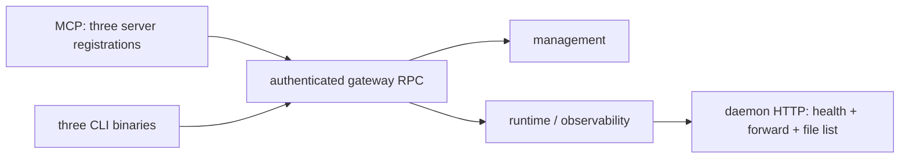

# MCP and CLI operation contract

This is the concise resulting public operation surface. It replaces the mixed
CLI/daemon-HTTP operation boundary with three independently grantable sets:
`management`, `runtime`, and `observability`. The sole operation-route
exception is the existing read-only daemon `POST /files/list` endpoint.

Detailed implementation-facing contracts are split into [[mcp]], [[cli]], and
[[http]], with phase gates in [[phase-plan]]. Those documents are the authoritative detail for public
arguments, results, endpoint behaviour, and target file ownership; this note
remains the cross-boundary summary.

The same operation catalog is projected into both MCP and CLI. There is no
second business-operation API. Directory listing stays intentionally outside
that catalog projection as the one public daemon HTTP operation endpoint.

## Boundary



The daemon HTTP allowlist is exact:

| HTTP surface | Allowed requests | Purpose |
| --- | --- | --- |
| `/health` | `GET /health` | daemon liveness/readiness probe |
| `/forward/shared/{port}[/{path}]` | methods accepted by the existing forward parser | proxied shared-network application traffic |
| `/forward/isolated={workspace_id}/{port}[/{path}]` | methods accepted by the existing forward parser | proxied isolated-network application traffic |
| `/files/list` | `POST /files/list` with an optional JSON object `{path?, workspace_session_id?}` | read-only directory listing; returns `{path, entries: [{name, kind, size}], truncated}` |

`/files/read`, `/files/write`, `/files/edit`, `/files/blame`,
`/observability/*`, and `/export/*` are removed. Apart from the exact routes
above, every daemon HTTP route returns `404`. `export_changes` uses its
already implemented, authenticated `read_export_chunk` RPC fallback rather
than a replacement HTTP stream.

## Common projection rules

### Sets, clients, and grants

| Set | CLI binary | MCP server registration | Scope | Operations |
| --- | --- | --- | --- |
| Management | `sandbox-manager-cli` | `ephemeral-os-management` | system; selected sandbox IDs stay operation arguments | sandbox lifecycle and export |
| Runtime | `sandbox-runtime-cli --sandbox-id ID` | `ephemeral-os-runtime` | one required sandbox | commands and files |
| Observability | `sandbox-observability-cli` | `ephemeral-os-observability` | optional sandbox for aggregate `snapshot`; otherwise one required sandbox | read-only state, traces, events, resource and layer views |

The three MCP registrations are configurations of one `sandbox-mcp` binary,
started with `--set management`, `--set runtime`, or `--set observability`.
They are separate grants in a host/client configuration, not three codebases.
MCP tool names equal the operation names in this document; their MCP server
identity keeps the three registries distinct.

The existing `sandbox-manager-cli observability ...` command is removed after
the migration. `sandbox-observability-cli` owns that set. This is intentional:
an operator can expose or install observability without lifecycle authority.

### One CLI package, three binaries

`sandbox-cli` is one workspace package and library. It owns the shared CLI
transport/configuration/request-building code plus three set adapters:
`manager`, `runtime`, and `observability`. Its three feature-gated binary
targets remain the public executables named in the table above; this is one
code module, not one combined command or grant.

Each binary enables only its matching set feature and therefore links only the
matching operation catalog and adapter. `sandbox-mcp` and the browser console
may depend on `sandbox-cli::core` with no set feature, but they must not use a
CLI adapter to access an operation catalog.

### Hidden transport fields

MCP and CLI users provide only the inputs in the operation tables. The adapter
creates the protocol `request_id`, authenticates to the gateway, and selects
the protocol scope. Those transport fields must not appear in MCP input
schemas or operation CLI help.

For runtime operations, `sandbox_id` is required by the MCP tool and is a
global CLI flag. For observability, it is required except for `snapshot`,
where its absence means aggregate all ready manager-known sandboxes. Management
operations use system scope; their `sandbox_id` fields remain normal operation
arguments where applicable.

### Output and errors

All successful CLI calls print one JSON object on stdout and exit `0`; the MCP
adapter returns the same object as structured tool content. All operation
failures use one JSON envelope and exit `1` in CLI:

```json
{
  "error": {
    "kind": "invalid_request | not_found | operation_failed | ...",
    "message": "human-readable failure",
    "details": {}
  }
}
```

CLI parsing/configuration failures use this envelope on stderr and exit `2`.
MCP maps those failures to a tool error while retaining the envelope in
structured content. Neither projection returns daemon HTTP status semantics.

Every output field shown below is the public result value. Fields marked
`optional` may be absent. Additional fields are not a compatibility promise.

## Management

MCP registration: `ephemeral-os-management`. CLI form:
`sandbox-manager-cli OPERATION [flags]`.

| Operation / MCP tool | CLI | Input | Output |
| --- | --- | --- | --- |
| `create_sandbox` | `create_sandbox --image IMAGE --workspace-bind-root PATH [--count N]` | `image: string`; `workspace_root: absolute path`; optional `count: uint` (default `1`) | One sandbox record if `count=1`; otherwise `{sandboxes: SandboxRecord[]}` |
| `destroy_sandbox` | `destroy_sandbox --sandbox-id ID` | `sandbox_id: string` | `SandboxRecord` after teardown/removal |
| `list_sandboxes` | `list_sandboxes` | `{}` | `{sandboxes: SandboxRecord[]}` |
| `inspect_sandbox` | `inspect_sandbox --sandbox-id ID` | `sandbox_id: string` | `SandboxRecord` |
| `squash_layerstacks` | `squash_layerstacks --sandbox-id ID` | `sandbox_id: string` | `{manifest_version, squashed_blocks: [{squashed_layer_id, replaced_layer_ids, replaced_layers, blocked_reasons?}], faulty_sessions?: [{session_id, class_detail, lease_errors}]}` |
| `export_changes` | `export_changes --sandbox-id ID --dest PATH [--format dir\|tar\|tar-zst]` | `sandbox_id: string`; `dest: absolute path`; optional `format: "dir" \| "tar" \| "tar-zst"` (default `dir`) | export result below |

`SandboxRecord` is:

```json
{
  "id": "sbox-1",
  "workspace_root": "/absolute/host/workspace",
  "state": "creating | ready | destroying | ...",
  "daemon": {"host": "127.0.0.1", "port": 1234},
  "daemon_http": {"host": "127.0.0.1", "port": 5678},
  "shared_base": {
    "source": "/host/path",
    "target": "/sandbox/path",
    "root_hash": "...",
    "readonly": true
  }
}
```

`daemon` and `daemon_http` are optional. `daemon_http` remains endpoint
metadata solely for daemon `/health`, `/forward`, and `POST /files/list`; it
does not authorize any other operation route.

`export_changes` returns the daemon `manifest_version` and `layers_exported`
in every format. Directory export additionally returns
`files_written`, `symlinks_written`, `deletes_applied`, `opaque_clears`,
`skipped_unchanged`, and `bytes_written`. Archive export returns
`files_written`, `symlinks_written`, `whiteouts_emitted`, and `bytes_written`.
Either shape may include `live_workspace_sessions`.

`export_changes` is deliberately not named `export_workspace`: it exports the
merged, whiteout-aware delta of published layers above the base. Directory
mode applies that delta to an existing `--dest`; it does not materialize or
archive the full base workspace, and it does not include unfinalized live
workspace-session changes.

## Runtime

MCP registration: `ephemeral-os-runtime`. Every MCP input includes the shown
`sandbox_id`. Every CLI invocation begins
`sandbox-runtime-cli --sandbox-id ID`.

### Command operations

| Operation / MCP tool | CLI tail | Input after `sandbox_id` | Output |
| --- | --- | --- | --- |
| `exec_command` | `exec_command [--workspace-session-id ID] [--timeout-ms N] [--yield-time-ms N] COMMAND` | `cmd: string`; optional `workspace_session_id: string`, `timeout_ms: uint`, `yield_time_ms: uint` | Command result below; a running command includes `command_session_id` |
| `write_command_stdin` | `write_command_stdin --command-session-id ID [--yield-time-ms N] TEXT` | `command_session_id: string`; `stdin: string`; optional `yield_time_ms: uint` | Command result below |
| `read_command_lines` | `read_command_lines --command-session-id ID [--start-offset N] [--limit N]` | `command_session_id: string`; optional `start_offset: uint` (default `0`), `limit: uint` (default `200`, max `1000`) | Command result below |

Command result:

```json
{
  "status": "running | completed | failed | ...",
  "exit_code": 0,
  "wall_time_seconds": 0.01,
  "command_total_time_seconds": 0.01,
  "start_offset": 0,
  "end_offset": 3,
  "total_lines": 3,
  "original_token_count": 42,
  "output": "...",
  "command_session_id": "optional",
  "workspace_session_id": "optional",
  "publish_rejected": true,
  "publish_reject_class": "optional"
}
```

### File operations

| Operation / MCP tool | CLI tail | Input after `sandbox_id` | Output |
| --- | --- | --- | --- |
| `file_read` | `file_read --path FILE [--offset N] [--limit N] [--workspace-session-id ID]` | `path: string`; optional `offset: uint` (default `1`), `limit: 1..=2000`, `workspace_session_id: string` | `{path, content, start_line, num_lines, total_lines, bytes_read, total_bytes, next_offset, truncated}` |
| `file_write` | `file_write --path FILE --content TEXT [--workspace-session-id ID]` | `path: string`; `content: string`; optional `workspace_session_id: string` | `{type: "write", path, bytes_written}` |
| `file_edit` | `file_edit --path FILE --edits JSON [--workspace-session-id ID]` | `path: string`; `edits: [{old_string: string, new_string: string, replace_all?: boolean}]`; optional `workspace_session_id: string` | `{type: "edit", path, edits_applied, replacements, bytes_written}` |
| `file_blame` | `file_blame --path FILE` | `path: string` | `{path, ranges: [{start_line, line_count, owner}]}` |

With `workspace_session_id`, file operations read or modify the live session.
Without it, reads use the published snapshot and writes/edits publish a new
layer.

### HTTP-only file listing

`POST /files/list` remains a direct daemon HTTP endpoint and is not an MCP
tool or CLI command. Its optional JSON input is `path: string` and
`workspace_session_id: string`; it returns
`{path, entries: [{name, kind, size}], truncated}`. A supplied session ID lists
the live workspace; without one it lists the published snapshot. The endpoint
retains its existing request and response semantics.

## Observability

MCP registration: `ephemeral-os-observability`. CLI form:
`sandbox-observability-cli OPERATION [flags]`. All operations are read-only.

| Operation / MCP tool | CLI | Input | Output |
| --- | --- | --- | --- |
| `snapshot` | `snapshot [--sandbox-id ID]` | optional `sandbox_id: string` | One live snapshot for `sandbox_id`, or `{sandboxes: Snapshot[]}` when omitted |
| `trace` | `trace --sandbox-id ID [--trace-id TRACE\|last]` | `sandbox_id: string`; optional `trace_id: string` (default `last`) | `{view: "trace", trace, spans: Span[]}` |
| `events` | `events --sandbox-id ID [--name NAME] [--since-ms MS] [--last-n N]` | `sandbox_id: string`; optional `name: string`, `since_ms: uint`, `last_n: uint` | `{view: "events", events: Event[]}` |
| `cgroup` | `cgroup --sandbox-id ID [--scope SCOPE] [--window-ms MS]` | `sandbox_id: string`; optional `scope: "sandbox" \| workspace_id` (default `sandbox`), `window_ms: uint` (default `60000`, max `600000`) | `{view: "cgroup", scope, series: Sample[]}` |
| `layerstack` | `layerstack --sandbox-id ID [--workspace-id WS] [--window-ms MS]` | `sandbox_id: string`; optional `workspace_id: string`, `window_ms: uint` (default `60000`, max `600000`) | layer inventory/lease/bookings plus stack trend and, when requested, workspace detail |

Single-sandbox `snapshot` has the live daemon shape:

```json
{
  "sandbox_id": "sbox-1",
  "lifecycle_state": "ready",
  "availability": "available | partial",
  "sampled_at_unix_ms": 0,
  "errors": [],
  "daemon": {"daemon_pid": 1, "runtime_dir": "/..."},
  "resources": {"latest": {}, "history": []},
  "workspaces": [],
  "stack": {}
}
```

Each cgroup sample is `{ts, sample_delta_ms, metrics, deltas}`. The concrete
event, span, and layer fields remain the serialized daemon observability
records; the named top-level keys above are stable.

## Non-public implementation operations

The following protocol operations remain internal composition details and are
not MCP tools or CLI commands: `sandbox_daemon_ready`, `get_observability`,
`create_workspace_session`, `destroy_workspace_session`, `squash_layerstack`,
`export_layerstack`, and `read_export_chunk`.

`file_list` is the one exception: its protocol operation stays dispatchable
only behind the retained daemon HTTP endpoint, not in the runtime MCP or CLI
catalog.

`squash_layerstacks`, `export_changes`, and the observability set own the
public semantic operations. This prevents an MCP client or CLI user from
having to know daemon routing, stream tokens, or spool lifecycle.

## Compatibility statement

The cutover preserves only direct `POST /files/list` among daemon operation
routes. Direct callers of `/files/read`, `/files/write`, `/files/edit`,
`/files/blame`, `/observability/*`, and `/export/*` receive `404`; use the
corresponding runtime/observability MCP tool or CLI operation. `/health` and
`/forward` keep their current HTTP contracts.
