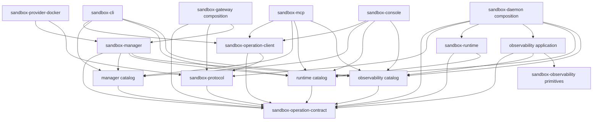

# Sandbox operations migration

This specification moves all operation-owned code and every operation-facing
product adapter under `crates/sandbox-operations/`. On approval, it supersedes
the physical layout decisions in
[[cli_migration/spec|the legacy CLI migration plan]] and
extends the already implemented
[[mcp_cli_surface/implementation-spec|MCP and three-set CLI specification]].
The existing [[mcp_cli_surface/operation-contract|operation contract]] remains
the behavioral baseline unless this specification explicitly identifies a
breaking internal change.

Until approval, this document is a proposal and has no superseding force. At
adoption, change its status and mark the legacy plan as superseded.

> [!important] Architectural decision
> `crates/sandbox-operations/` is an organizational bounded-context directory.
> It is not a Rust module, Cargo package, facade crate, dependency, or re-export
> layer. It must not have a root `Cargo.toml` or `src/lib.rs`.

## Outcome

After the migration, one filesystem boundary owns:

- the operation contract and catalog model;
- the operation wire protocol;
- manager, runtime, and observability catalogs and application handlers;
- the shared gateway client;
- the CLI, MCP, and console adapters;
- the console web application; and
- the live operation E2E suite.

This does not mean that every file which mentions an operation moves. Transport
composition, providers, low-level runtime primitives, deployment entrypoints,
configuration, and documentation remain in their natural repository-level
locations. They may consume operation contracts but may not define public
operation metadata or business handlers.

The migration is intentionally source-breaking. Old package aliases, re-export
shims, compatibility crates, symlinks, and duplicate directory trees are not
part of the target. Public executable names and user-visible operation behavior
are preserved unless called out below.

## Why the current layout is not extensible enough

The three catalog packages have already moved under
`crates/sandbox-operations/`, but the rest of the operation boundary is still
distributed:

| Current location | Responsibility currently owned there | Architectural problem |
| --- | --- | --- |
| `crates/sandbox-protocol` | Catalog types, CLI metadata, help rendering, scope, request/response values, wire parsing | Core operation vocabulary, CLI presentation, and transport are coupled in one crate. |
| `crates/sandbox-operations/{manager,runtime,observability}` | Public catalogs | Catalog paths are centralized, but names do not distinguish catalogs from applications. |
| `crates/sandbox-manager` | Manager handlers, store, router, ports, and daemon transport | The application is outside the operation boundary and its concrete daemon client pulls wire concerns inward. |
| `crates/sandbox-runtime/operation` | Runtime handlers and registries | The operation application is nested among low-level runtime primitives. |
| `crates/sandbox-daemon/src/observability` | Sampling, query service, view routing, and rendering | Operation query logic is fused to daemon lifecycle and runtime implementation details. |
| `crates/sandbox-cli/src/core` | Gateway transport, value request construction, argv parsing, output, and help | MCP and console depend on a CLI package to reuse non-CLI behavior. |
| `crates/sandbox-mcp`, `crates/sandbox-console`, `web/console` | Operation-facing adapters | Peer adapters are physically separated from the operation contract they project. |
| `cli-operation-e2e-live-test` | Cross-adapter operation proof | The test boundary is detached from the code it validates and contains tracked generated reports. |

The current shape creates five concrete extensibility problems:

1. `CliOperation*` names make adapter-neutral concepts appear CLI-owned.
2. Applications consume protocol `Request`/`Response` types directly, so
   application code cannot be separated from wire concerns.
3. MCP and console reuse `sandbox_cli::core`, creating an adapter-to-adapter
   dependency.
4. observability rewrites concrete public operations to the private
   `get_observability` multiplexer, duplicating routing in the CLI, manager,
   daemon, console, and tests.
5. Public catalogs and executable handler registries can drift because their
   equivalence is not enforced as a `(scope kind, operation)` invariant.

A path-only move would preserve these problems and introduce new dependency
cycles. The migration therefore changes both ownership and dependency
direction.

## Scope boundary

### Moves under `crates/sandbox-operations/`

- The shared operation schema, including semantic definitions, owned catalog
  documents, CLI projection metadata, route policy, scope, domain, argument
  types, request/response envelopes, and application error vocabulary.
- Wire encoding/decoding, framing, authentication fields, and protocol limits.
- Public manager, runtime, and observability catalogs.
- Canonical declarations for internal operation routes owned by those domains.
- Manager and runtime application handlers and their direct tests.
- Observability operation selection, queries, and response rendering.
- Gateway-client transport/configuration and value-based request construction.
- CLI parsing/help/output, MCP projection, console server, and console web UI.
- Live operation E2E source, harness, specifications, and maintained fixtures.

### Remains outside

| Location/component | Why it stays outside |
| --- | --- |
| `crates/sandbox-gateway` | Authentication, listener lifecycle, wire composition, and process assembly are a composition root. It also owns the concrete manager-to-daemon TCP port adapter and local daemon process installer after this migration. |
| `crates/sandbox-daemon` | RPC/HTTP transport, server lifecycle, cgroup setup, runner processes, sampling cadence, log rotation, and composition stay daemon-owned. |
| `crates/sandbox-provider-docker` | Docker infrastructure implements manager ports; it is not operation business logic. |
| `crates/sandbox-runtime/{workspace,layerstack,namespace-process,namespace-execution,overlay}` | These are low-level runtime primitives used by the runtime application. |
| `crates/sandbox-observability` | This remains the leaf tracing, event, sampling, and reading primitive. |
| `crates/sandbox-config` except `configs/cli.rs` | Deployment and process configuration is cross-cutting. Only gateway-client discovery moves. |
| root `bin/`, `xtask/`, configuration, CI, and `docs/` | These are repository entrypoints, build orchestration, and documentation. Paths and package references must be updated in place. |
| generated `target/`, `dist/`, `node_modules/`, caches, `*.tsbuildinfo`, and test reports | These are outputs, not source. They are ignored or removed rather than migrated. |

The whole CLI, MCP, console server, console web application, and live E2E suite
move as operation-facing products. This is broader than moving only files that
contain handler logic, but it creates one discoverable product boundary and
avoids splitting each adapter across unrelated roots. Thin root launchers remain
in `bin/` so repository command ergonomics do not change.

## Target filesystem and package structure

```text
crates/sandbox-operations/                          # organizational umbrella only
├── README.md                                      # boundary law and dependency map
├── contract/                                      # package: sandbox-operation-contract
│   ├── Cargo.toml
│   ├── src/
│   │   ├── argument.rs
│   │   ├── domain.rs
│   │   ├── catalog.rs
│   │   ├── cli_metadata.rs
│   │   ├── error.rs
│   │   ├── family.rs
│   │   ├── lib.rs
│   │   ├── operation.rs
│   │   ├── request.rs
│   │   ├── response.rs
│   │   ├── route.rs
│   │   └── scope.rs
│   └── tests/
├── protocol/                                      # package: sandbox-protocol
│   ├── Cargo.toml
│   ├── src/
│   │   ├── auth.rs
│   │   ├── codec.rs
│   │   ├── error.rs
│   │   ├── framing.rs
│   │   ├── handshake.rs
│   │   ├── lib.rs
│   │   └── limits.rs
│   └── tests/
├── manager/
│   ├── catalog/                                   # sandbox-manager-operation-catalog
│   │   ├── Cargo.toml
│   │   ├── src/
│   │   └── tests/
│   └── application/                               # sandbox-manager
│       ├── Cargo.toml
│       ├── src/
│       │   ├── operations/                        # public/internal handler registries
│       │   ├── ports/                             # runtime, installer, daemon client
│       │   ├── router/
│       │   ├── services/
│       │   ├── model.rs
│       │   ├── store.rs
│       │   └── lib.rs
│       └── tests/
├── runtime/
│   ├── catalog/                                   # sandbox-runtime-operation-catalog
│   │   ├── Cargo.toml
│   │   ├── src/
│   │   └── tests/
│   └── application/                               # sandbox-runtime
│       ├── Cargo.toml
│       ├── src/
│       │   ├── command/
│       │   ├── file/
│       │   ├── layerstack/
│       │   ├── operations/                        # public/internal handler registries
│       │   ├── workspace_session/
│       │   └── lib.rs
│       └── tests/
├── observability/
│   ├── catalog/                                   # sandbox-observability-operation-catalog
│   │   ├── Cargo.toml
│   │   ├── src/
│   │   └── tests/
│   └── application/                               # sandbox-observability-application
│       ├── Cargo.toml
│       ├── src/
│       │   ├── query.rs
│       │   ├── registry.rs
│       │   ├── view/
│       │   └── lib.rs
│       └── tests/
├── adapters/
│   ├── gateway-client/                            # sandbox-operation-client
│   │   ├── Cargo.toml
│   │   ├── src/
│   │   │   ├── client.rs
│   │   │   ├── config.rs
│   │   │   ├── request.rs                         # value-based construction only
│   │   │   └── lib.rs
│   │   └── tests/
│   ├── cli/                                       # sandbox-cli; three existing bins
│   │   ├── Cargo.toml
│   │   ├── src/
│   │   │   ├── bin/
│   │   │   ├── help.rs
│   │   │   ├── input.rs                           # argv/flag parsing
│   │   │   ├── output.rs
│   │   │   ├── manager.rs
│   │   │   ├── observability.rs
│   │   │   ├── runtime.rs
│   │   │   └── lib.rs
│   │   └── tests/
│   ├── mcp/                                       # sandbox-mcp
│   │   ├── Cargo.toml
│   │   ├── src/
│   │   └── tests/
│   └── console/
│       ├── server/                                # sandbox-console
│       │   ├── Cargo.toml
│       │   ├── src/
│       │   └── tests/
│       └── web/                                   # tracked frontend source/manifests
│           ├── index.html
│           ├── package.json
│           ├── package-lock.json
│           ├── src/
│           ├── tsconfig.json
│           ├── tsconfig.app.json
│           ├── tsconfig.node.json
│           └── vite.config.ts
└── tests/
    └── e2e/                                       # live Python operation E2E suite
        ├── .gitignore
        ├── config/
        ├── core/
        ├── manager/
        ├── observability/
        ├── repo/
        ├── runtime/
        ├── README.md
        ├── RUNNING.md
        ├── conftest.py
        ├── pytest.ini
        ├── requirements.txt
        └── test_smoke.py
```

The root workspace continues to list each nested Cargo package explicitly. No
code imports `sandbox_operations`; such a crate does not exist.

## Resulting crates and target LOC

The umbrella contains **12 Cargo crates**. It is not a thirteenth crate: there
is no root `sandbox-operations` package. These are physical source lines
captured on 2026-07-10. Exact straight-move counts use committed `HEAD` so the
baseline is reproducible; uncommitted working-tree changes are not included.
Counts include comments and blank lines and exclude manifests, lockfiles,
documentation, JSON/text fixtures, generated assets, caches, and historical
test reports. Ranges are design-time estimates for files that must be split by
responsibility and must be replaced with measured counts in Phase 0.

| Resulting Cargo package | Target path under `crates/sandbox-operations/` | Production LOC | Direct test LOC | Combined LOC | Basis |
| --- | --- | ---: | ---: | ---: | --- |
| `sandbox-operation-contract` | `contract/` | about 0.75–0.85k | about 0.34–0.37k | about 1.09–1.22k | Catalog/spec/scope plus the application request/response envelope; protocol tests split by ownership. |
| `sandbox-protocol` | `protocol/` | about 0.15–0.25k | about 0.06–0.08k | about 0.21–0.33k | Auth, framing, limits, handshake, and wire codec only. |
| `sandbox-manager-operation-catalog` | `manager/catalog/` | 244 | 55 | 299 | Exact straight move. |
| `sandbox-manager` | `manager/application/` | about 2.8k | about 2.9–3.0k | about 5.7–5.8k | From 3,266 production LOC; TCP transport and roughly 294 LOC of local-process adapter move to gateway composition with focused tests. |
| `sandbox-runtime-operation-catalog` | `runtime/catalog/` | 441 | 75 | 516 | Exact straight move. |
| `sandbox-runtime` | `runtime/application/` | 5,903 | 6,735 | 12,638 | Exact committed-baseline move plus registry/type renames. |
| `sandbox-observability-operation-catalog` | `observability/catalog/` | 278 | 78 | 356 | Exact straight move. |
| `sandbox-observability-application` | `observability/application/` | about 0.55–0.80k | up to 0.694k | about 0.55–1.49k | Query/view logic and pure tests move; sampling, lifecycle, and wiring tests stay in daemon. |
| `sandbox-operation-client` | `adapters/gateway-client/` | about 0.55–0.65k | about 0.20–0.34k | about 0.75–0.99k | Client 177 + CLI config 92 + value-based portion of the current 474-line request builder. |
| `sandbox-cli` | `adapters/cli/` | about 1.05–1.15k | about 1.02–1.12k | about 2.07–2.27k | CLI shell/output, argv parsing, and 273-line help renderer; neutral client code and tests leave. |
| `sandbox-mcp` | `adapters/mcp/` | 414 | 721 | 1,135 | Exact straight move. |
| `sandbox-console` | `adapters/console/server/` | 1,160 | 1,135 | 2,295 | Exact straight move. |

Two maintained source areas are inside the umbrella but are not Cargo crates:

| Non-Cargo area | Production/source LOC | Test/harness LOC | Basis |
| --- | ---: | ---: | --- |
| `adapters/console/web/` | about 6,424 | 0 | Tracked TypeScript/TSX/CSS and project configuration; generated output excluded. |
| `tests/e2e/` | 0 | 18,455 Python LOC | Maintained E2E test and harness source only. |

The current 497-line protocol test file accounts for approximately 353 contract
test lines, 70 protocol test lines, and 74 CLI help/rendering test lines before
fixtures are reshaped.

The 12 Cargo crates total approximately 14.3–14.9k production LOC and
13.3–14.4k direct-test LOC. Including console web and live E2E source, the
whole umbrella is approximately 20.7–21.4k production/source LOC and
31.8–32.9k test/harness LOC. The goal is near-zero net feature LOC: most change is
movement, responsibility splitting, type renaming, and deletion of duplicated
routing.

Outside the umbrella, `sandbox-gateway` gains about 458 production LOC for the
manager TCP client and local daemon installer plus their focused tests. Daemon
loses the observability application slice, while provider-docker keeps its
Docker polling logic and switches to the protocol readiness helper.

The current E2E tree also contains 7,977 tracked `test-reports` files and
1,864,095 lines of generated/historical output. Those files are explicitly
outside the target LOC inventory and must not move into the target. Remove them
from Git, archive any required summary outside the source tree, and add durable
ignore rules before moving the maintained 87 non-report tracked files.

## Target dependency law

Arrows mean "may depend on":



The manager application is allowed to depend on the observability catalog for
system-scoped aggregate `snapshot`, and on canonical internal declarations in
the runtime catalog for daemon forwarding such as export and squash. It must
not depend on the runtime application implementation.

| Component | May depend on | Must never depend on |
| --- | --- | --- |
| operation contract | External serialization/value crates only | Any workspace crate, transport, application, or adapter |
| protocol | operation contract | Catalogs, applications, CLI/MCP/console |
| catalogs | operation contract | Other catalogs in production, protocol, applications, adapters |
| manager application | contract; manager/observability/runtime catalog declarations; manager ports and required infrastructure primitives | CLI/MCP/console, runtime application, daemon/gateway composition |
| runtime application | contract; runtime catalog; low-level runtime and observability primitives | protocol, manager application, adapters, daemon composition |
| observability application | contract; observability catalog; `sandbox-observability` leaf primitives; app-owned input/reader ports | concrete runtime application, protocol, adapters, daemon composition |
| gateway client | contract; protocol | application crates, CLI behavior, concrete catalog packages |
| CLI, MCP, console | gateway client; contract; catalogs | protocol; manager/runtime/observability application crates; each other |
| gateway/daemon | contract; protocol; applications; required route manifests; infrastructure | Adapter presentation logic |
| provider-docker | manager application ports/models; protocol readiness helper; Docker/config/runtime primitives | presentation adapters; application handler internals |

Production dependency direction is enforced from `cargo metadata`, not merely
documented. Dev-dependencies may assemble multiple catalogs for cross-catalog
tests, but must not leak into library APIs.

The shared gateway client is the only operation-facing product adapter allowed
to depend on `sandbox-protocol`. CLI, MCP, and console use contract values and
catalog projections; provider-docker's separate protocol edge is limited to
the protocol-owned daemon readiness helper and does not make it a product
adapter.

## Contract and vocabulary decisions

### The inner contract owns the application envelope

The current protocol `Request` and `Response` types are used by handlers, so
they are not purely wire details. Split them as follows:

- `sandbox-operation-contract` owns `OperationRequest`, `OperationResponse`,
  `OperationError`, `OperationScope`, operation arguments, and validation
  helpers used by applications.
- `sandbox-protocol` owns JSON/wire decoding and encoding, newline framing,
  authentication fields, malformed-wire errors, and size limits.
- gateway and daemon composition decode wire input into an
  `OperationRequest`, call an application, then encode the
  `OperationResponse`.
- application crates do not import `sandbox-protocol`.

This separation makes it possible to add another transport without changing
operation handlers.

### Semantic names lose the historical `Cli` prefix

| Current name | Target name |
| --- | --- |
| `CliOperationSpec` | `OperationSpec` |
| `CliOperationFamilySpec` | `OperationFamilySpec` |
| `CliOperationCatalog` | `OperationCatalog` |
| `CliOperationCatalogDocument` | `OperationCatalogDocument` |
| `CliOperationExecutionSpace` | `OperationDomain` |
| `CliOperationScope` | `OperationScope` |
| protocol `Request` | contract `OperationRequest` |
| protocol `Response` | contract `OperationResponse` |

`CliSpec`, `ArgCliSpec`, CLI paths, flags, positionals, usage, and examples keep
their names because they are genuinely CLI presentation metadata. The contract
is therefore a shared operation schema with an adapter-neutral application
envelope and an explicit CLI projection, not a wholly adapter-neutral crate.
The metadata remains data attached to the canonical operation definition; CLI
help rendering and argv parsing move to the CLI adapter. This avoids adding a
new projection crate solely to relocate existing static data.

### Package naming

| Current package | Target package | Decision |
| --- | --- | --- |
| none | `sandbox-operation-contract` | New inner contract. |
| `sandbox-protocol` | `sandbox-protocol` | Preserve package name; move its path and narrow its responsibility. |
| `sandbox-manager-operations` | `sandbox-manager-operation-catalog` | Breaking rename makes catalog responsibility explicit. |
| `sandbox-runtime-operations` | `sandbox-runtime-operation-catalog` | Breaking rename makes catalog responsibility explicit. |
| `sandbox-observability-operations` | `sandbox-observability-operation-catalog` | Breaking rename makes catalog responsibility explicit. |
| `sandbox-manager` | `sandbox-manager` | Preserve package/API name while moving its path. |
| `sandbox-runtime` | `sandbox-runtime` | Preserve package/API name while moving its path. |
| none | `sandbox-observability-application` | New query/dispatch application extracted from daemon. |
| none | `sandbox-operation-client` | New adapter-neutral client extracted from CLI. |
| `sandbox-cli` | `sandbox-cli` | Preserve package, feature, and binary names. |
| `sandbox-mcp` | `sandbox-mcp` | Preserve package and binary name. |
| `sandbox-console` | `sandbox-console` | Preserve package and binary name. |

The three CLI binaries remain `sandbox-manager-cli`, `sandbox-runtime-cli`, and
`sandbox-observability-cli`. The root wrapper scripts keep their existing
names.

## Operation registration and routing

Routing uses three distinct concepts defined by the contract:

- `OperationScope` is the actual validated request value: `System` or
  `Sandbox { sandbox_id }`.
- `OperationScopePolicy` is static declaration metadata: `System`,
  `SandboxRequired`, or `SystemOrSandbox`.
- `OperationScopeKind` is the normalized routing discriminator, `System` or
  `Sandbox`, derived from the actual request without discarding its
  `sandbox_id`.

`OperationDomain` identifies the catalog/product surface (`Manager`,
`Runtime`, or `Observability`); it does not choose the executing application.
Its existing serialized catalog field remains unchanged for baseline
compatibility. `OperationExecutionOwner` in the route manifest makes execution
ownership explicit and may differ from the domain.

The value-based builder used by CLI and MCP separates
`scope_selector: Option<String>` from operation `args`; `sandbox_id` is
interpreted according to policy rather than by its field name alone:

- `System` constructs `OperationScope::System`. A `sandbox_id` declared by a
  manager operation remains a business argument in `args`; an out-of-band
  scope selector is rejected.
- `SandboxRequired` requires a non-empty selector, removes any compatibility
  copy from `args`, and constructs `OperationScope::Sandbox`.
- `SystemOrSandbox` constructs system scope when the selector is absent and
  sandbox scope when it is present, removing the selector from `args` in the
  latter case.

Runtime's existing catalog JSON does not declare `sandbox_id`, so Rust adapter
projections synthesize its selector input from the route policy. Observability
JSON already declares the field; keep that serialized baseline, but its Rust
projection consumes the value as a selector. Manager operations with a
business `sandbox_id` remain unchanged. Routers derive `OperationScopeKind`
for lookup and pass the actual scope, including its identifier, unchanged to
the selected handler.

Every application route is keyed by `(OperationScopeKind, operation name)`,
not by operation name alone. Every route belongs to exactly one of four
classes:

| Class | Source of truth | Exposure rule |
| --- | --- | --- |
| Public catalog operation | Exactly one domain catalog | Projected to its permitted CLI/MCP/console surfaces and executable for every declared scope. |
| Canonical internal application operation | `internal` declarations in the owning domain catalog, outside `OperationCatalog` | Callable only by trusted composition/application flows; never projected publicly. |
| Transport handshake | protocol declaration, for example `sandbox_daemon_ready` | Used only by transport/provider readiness code. |
| Deliberate HTTP-only exception | runtime-owned internal declaration, currently `file_list` | Served only by the documented read-only HTTP path and excluded from public CLI/MCP catalogs. |

The catalog package may contain an `internal` module for canonical identifiers,
but its public `OperationCatalog` projection must exclude those declarations.
This lets the manager and daemon share `export_layerstack`,
`read_export_chunk`, and `squash_layerstack` without duplicating string
literals or introducing a manager-to-runtime-application dependency.

Each catalog exports a Rust-only static route manifest of
`OperationRouteSpec { operation, scope_policy, scope_kind, execution_owner,
visibility }`.
`execution_owner` is one of `Manager`, `Runtime`, or `Observability`. An
operation with `SystemOrSandbox` policy expands to two route entries and may
assign different owners; this is how system `snapshot` belongs to the manager
application while sandbox `snapshot` belongs to the observability application.
Route and scope-policy metadata are not added to the serialized
`OperationCatalogDocument`, so public catalog JSON keeps the Phase 0 shape and
bytes. The Rust CLI and MCP adapters resolve routes through the catalog
manifests and pass the resulting policy/spec into the shared client's
value-based builder. The TypeScript web console preserves its existing
`/api/rpc` request shape, `{ op, scope, args }`; the Rust console server
validates that fully scoped `OperationRequest` against public/internal route
manifests and passes it to the shared client's lower-level send API. The
browser neither consumes a Rust-only manifest nor needs a new route-policy API.
The gateway client does not depend on concrete catalog packages or switch on
operation-name/domain literals.

Each application has two explicit registries:

- a public registry whose `(scope kind, name)` keys must be a bijection with
  all public route entries whose `execution_owner` names that application,
  including entries declared by another domain catalog; and
- an internal registry whose entries must match canonical internal
  declarations and must not appear in any public catalog projection.

Cross-catalog tests assert that public `(scope kind, name)` route keys are
globally unique with no exception. A multi-scope semantic operation produces
distinct keys in one manifest; it does not permit duplicate keys across
catalogs.

### Transitional observability route

Phases 2–5 retain one canonical, migration-only internal declaration for
`(Sandbox, get_observability)` in the observability catalog. The temporary
catalog projection and manager aggregate path import that declaration instead
of copying the literal. The projection returns a contract-owned neutral
dispatch target/argument set that catalog-aware CLI and MCP adapters pass into
the generic gateway client; the client does not import the observability
catalog or switch on operation names. During the transition, console's
existing fully scoped `get_observability` request is validated against the same
internal declaration and sent directly. The declaration is excluded from
public catalog JSON and from the final route set. Phase 4 may make manager
routing scope-kind-first, but concrete public sandbox observability routes are
not activated until the atomic Phase 6 client/manager/daemon cutover. Phase 6
deletes this declaration, projection, all temporary translations, and the
synthetic `view` argument together.

### Remove the observability multiplexer

Delete the private `get_observability` operation and preserve concrete public
names end-to-end:

| Route | Owner |
| --- | --- |
| `(system, snapshot)` | manager application aggregate snapshot |
| `(sandbox, snapshot)` | observability application in the daemon |
| `(sandbox, trace)` | observability application in the daemon |
| `(sandbox, events)` | observability application in the daemon |
| `(sandbox, cgroup)` | observability application in the daemon |
| `(sandbox, layerstack)` | observability application in the daemon |

For aggregate system `snapshot`, the manager constructs a canonical
sandbox-scoped `snapshot` request for each selected sandbox and aggregates the
responses. It does not call a private alias or bypass the sandbox route
manifest.

The manager router becomes scope-kind-first. A sandbox-scoped operation must be
forwarded or dispatched according to its declared route even when its name is
also known to a system catalog. The request builder no longer inserts a `view`
argument or rewrites the operation name.

This is an intentional internal wire break. CLI syntax, MCP tool names, console
behavior, and response shapes remain unchanged after all in-repository clients
and servers are migrated together.

## Exact current-to-target move map

| Current | Target | Required transformation |
| --- | --- | --- |
| `crates/sandbox-protocol/src/lib.rs` | rebuilt across `crates/sandbox-operations/{contract,protocol}/src/lib.rs` | Export semantic/application types from contract and wire-only APIs from protocol; add no compatibility re-exports. |
| `crates/sandbox-protocol/src/cli_operation_spec.rs` | `crates/sandbox-operations/contract/src/{operation,family,argument,cli_metadata}.rs` | Split semantic types from CLI metadata and apply semantic type renames. |
| `crates/sandbox-protocol/src/catalog.rs` | `crates/sandbox-operations/contract/src/{catalog,domain}.rs` | Keep static/owned catalog conversion and validation in the contract; preserve serialized field names. |
| `crates/sandbox-protocol/src/scope.rs` | `crates/sandbox-operations/contract/src/{scope,route}.rs` | Rename actual scope and add static scope-policy, scope-kind, executor, and route-spec types. |
| Application portions of protocol `request.rs`, `response.rs`, and `error_kind.rs` | `crates/sandbox-operations/contract/src/{request,response,error}.rs` | Move envelope, argument helpers, application results, and `invalid_request`, `operation_failed`, and shared `internal_error` vocabulary. |
| Wire portions of protocol `request.rs`, `response.rs`, and `error_kind.rs`, plus `auth.rs`, `framing.rs`, and `limits.rs` | `crates/sandbox-operations/protocol/src/{codec,error,auth,framing,limits}.rs` | Keep wire codec and wire rejection kinds `bad_json`, `request_too_large`, and `unauthorized`; preserve package name and external response strings. |
| Raw readiness declaration/encoding duplicated by `crates/sandbox-provider-docker/src/readiness.rs` and daemon dispatch | `crates/sandbox-operations/protocol/src/handshake.rs` | Provide one canonical readiness request/encoder. Provider retains Docker polling and response validation but calls this helper instead of constructing protocol JSON or copying `sandbox_daemon_ready`. |
| `crates/sandbox-protocol/src/help.rs` | `crates/sandbox-operations/adapters/cli/src/help.rs` | Help/search/rendering is CLI presentation. |
| `crates/sandbox-protocol/tests/unit.rs` | contract, protocol, and CLI test targets | Split each test by the owner of the behavior it proves. |
| `crates/sandbox-operations/manager` | `crates/sandbox-operations/manager/catalog` | Move one level and rename package. |
| `crates/sandbox-manager` | `crates/sandbox-operations/manager/application` | Move the application; rename `operation/cli_definition` to `operations/registry`; retain port traits. |
| Concrete `TcpSandboxDaemonClient` implementation and the protocol-limit timeout policy currently imported by manager `router/forward.rs` | `crates/sandbox-gateway/src/daemon_client.rs` | Gateway composition implements the manager daemon-client port and owns protocol authentication, framing, limits, and transport deadline enforcement. The manager port and forwarding service no longer mention `ProtocolLimits`; a future business deadline, if needed, must be an application-owned policy. |
| Concrete `LocalSandboxDaemonInstaller`, launch/process/socket helpers, and focused tests in manager `daemon_install.rs` and manager tests | `crates/sandbox-gateway/src/local_daemon_installer.rs` and gateway tests | Keep only the `SandboxDaemonInstaller` port and neutral `StartedDaemon` DTO in manager application. Gateway composition owns the local-process adapter and its lifecycle-focused proofs. |
| `crates/sandbox-operations/runtime` | `crates/sandbox-operations/runtime/catalog` | Move one level and rename package. |
| `crates/sandbox-runtime/operation` | `crates/sandbox-operations/runtime/application` | Move package; rename `operation_adapter` to `operations/registry`; replace protocol envelope dependency with contract. |
| `crates/sandbox-operations/observability/{Cargo.toml,src/lib.rs,tests/**}` | `crates/sandbox-operations/observability/catalog/` | Move one level and rename the package. |
| `crates/sandbox-operations/observability/src/cli_definition/**` | `crates/sandbox-operations/observability/catalog/src/operations/**` | Remove the stale CLI-owned directory name while moving the catalog. |
| `crates/sandbox-daemon/src/observability/{mod.rs,service.rs,layerstack.rs,view/**}` query/view responsibilities | `crates/sandbox-operations/observability/application/src/` | Extract query selection/rendering; retain lifecycle and concrete acquisition in daemon. |
| Pure cases from `crates/sandbox-daemon/tests/unit/{observability.rs,observability_layerstack.rs}` | `crates/sandbox-operations/observability/application/tests/` | Move query/view proofs; retain daemon wiring/lifecycle cases in place. |
| Daemon observability sampling, rotation, process/runtime collection, and wiring | stays in `crates/sandbox-daemon` | Feed neutral snapshots/readers to the observability application; do not make the app depend on concrete runtime. |
| `crates/sandbox-cli/src/core/client.rs` | `crates/sandbox-operations/adapters/gateway-client/src/client.rs` | Generic gateway transport. |
| `crates/sandbox-config/src/configs/cli.rs` | `crates/sandbox-operations/adapters/gateway-client/src/config.rs` | This configuration is consumed/re-exported only by the client today. |
| `crates/sandbox-config/tests/unit/configs/cli.rs` | `crates/sandbox-operations/adapters/gateway-client/tests/config.rs` | Move its 50 LOC of client-discovery tests; remove/repoint the old declarations in `tests/unit.rs` and `src/configs/mod.rs`. |
| Value-based portion of `sandbox-cli/src/core/request_builder.rs` | `crates/sandbox-operations/adapters/gateway-client/src/request.rs` | Catalog lookup, typed values, scope, request ID, and generic validation. |
| Argv/flag portion of `request_builder.rs`, `output.rs`, and remaining CLI | `crates/sandbox-operations/adapters/cli` | CLI owns string parsing, help, output, progress, exit behavior, and binaries. |
| `crates/sandbox-mcp` | `crates/sandbox-operations/adapters/mcp` | Direct move; replace `sandbox-cli` dependency with operation client. |
| `crates/sandbox-console` | `crates/sandbox-operations/adapters/console/server` | Direct move; replace `sandbox-cli` dependency with operation client. |
| tracked `web/console` source/manifests | `crates/sandbox-operations/adapters/console/web` | Move source only; remove generated output and update asset paths. |
| The `get_observability` literals in CLI request builder, daemon RPC dispatch, and manager observability snapshot | nowhere | Delete atomically in Phase 6 after concrete route manifests and handlers exist. |
| 87 maintained non-report files in `cli-operation-e2e-live-test` | `crates/sandbox-operations/tests/e2e` | Repoint root discovery, commands, documentation metrics, and source assertions. |
| 7,977 tracked E2E report files | nowhere in source | Untrack/delete; archive only outside the source tree if required. |

## Migration phases

This is a design specification, not the execution tracker. When implementation
starts, create [[phase-plan|the phase plan]] beside this file; it owns phase
checkboxes, owners, command output, deviations, and approval evidence. The
final cutover checkboxes in this specification are a summary: update them only
from evidence linked in the phase plan, not as a second execution log.

Every phase must leave the whole workspace green. At minimum, run
`cargo check --workspace --all-targets --all-features` plus focused tests after
each phase. Run the relevant workspace clippy/test commands whenever a
dependency boundary or public behavior changes, then run the complete matrix
in Phase 8. A filesystem move and its Cargo/path updates are one atomic phase
change; no temporary compatibility package is kept after the phase gate.

### Phase 0 — Characterize behavior and freeze the inventory

- Record `cargo metadata` package names, paths, features, binaries, and the
  current dependency graph.
- Generate an audit table for every dispatchable route with domain, scope
  policy, expanded scope kind, visibility, catalog owner, execution owner,
  handler owner, and wire destination.
- Snapshot catalog JSON, CLI help fixtures, CLI error envelopes and exit
  codes, MCP tool schemas, console RPC behavior, and internal daemon RPC
  behavior.
- Run the current unit/integration suites and record the live E2E baseline.
- Identify historical scripts/reports which are frozen rather than
  executable migration inputs.

Exit gate: every current operation is classified and behavior that must remain
stable has an executable characterization test.

### Phase 1 — Create the contract and narrow protocol

- Create `sandbox-operation-contract` under the target path.
- Move catalog/spec/scope/route types and split the application envelope from
  the wire codec.
- Apply all semantic type renames in one change.
- Move help rendering/search into CLI.
- Move `sandbox-protocol` to its target path without renaming the package.
- Centralize the daemon readiness handshake in protocol and update provider
  polling plus daemon dispatch to use that declaration/encoder.
- Move the concrete `TcpSandboxDaemonClient` implementation and its
  `ProtocolLimits`-derived timeout/deadline enforcement from manager to gateway
  composition before dropping the manager protocol dependency. Manager
  forwarding retains only its neutral daemon-client port and business logic.
- Split the current 497-line protocol test suite by ownership.
- Update all application consumers to contract envelopes directly; do not add
  deprecated aliases or re-exports.

Exit gate: applications can construct and handle `OperationRequest` and
`OperationResponse` without importing `sandbox-protocol`; protocol tests prove
wire compatibility for all behavior not explicitly broken later.

### Phase 2 — Reparent and rename catalogs

- Move the three existing catalog crates to their domain `catalog/` paths.
- Rename packages to `*-operation-catalog` and update workspace
  dependencies, package callers, features, fixtures, and `Cargo.lock`.
- Separate public catalogs from canonical internal declarations.
- Add each catalog's Rust-only route manifest, with scope policy, concrete
  scope kind, execution owner, and visibility; keep it out of catalog JSON.
- Add the single migration-only internal observability route used through
  Phase 5; keep it out of public catalog projection.
- Move the current cross-catalog disjointness assertion out of an
  observability-owned production boundary into a multi-catalog adapter or
  architecture test.
- Assert catalogs have no production workspace dependency except the
  operation contract.

Exit gate: the three public catalog documents serialize identically to the
Phase 0 baseline, route expansion is deterministic, public route keys are
globally unique, and every declaration has one execution owner. Handler
bijection is deferred to the application phases.

### Phase 3 — Extract the adapter-neutral gateway client

- Create `sandbox-operation-client` from gateway transport, client config,
  and value-based request construction.
- Keep argv parsing, help, output formatting, progress presentation, and
  exit-code behavior in `sandbox-cli`.
- Preserve the existing observability mapping table in one explicitly
  temporary, catalog-aware observability projection. It imports the
  migration-only declaration and returns a neutral contract dispatch target
  for CLI and MCP to pass to the generic client; the client itself remains
  catalog-independent. Delete the projection when Phase 6 changes client and
  server atomically.
- Preserve console `/api/rpc` as a fully scoped request API. The console server
  validates its `OperationRequest` against the route manifests and calls the
  shared client's send API; it does not force the browser request back through
  the CLI/MCP value builder.
- Change MCP and console to depend on `sandbox-operation-client`, never
  `sandbox-cli`.
- Remove direct `sandbox-protocol` dependencies and imports from CLI, MCP, and
  console. Among operation-facing product adapters, only the shared client owns
  the wire protocol.
- Split request-builder tests according to their new owners.

Exit gate: CLI and MCP share the value-based builder, console shares the same
client transport through its validated-request send API, none depends on or
imports `sandbox-protocol`, and no code outside the CLI adapter imports CLI
parsing/help/output modules.

### Phase 4 — Move and clean the manager application

- Move the whole manager package to `manager/application` so its handlers,
  services, model, store, router, and ports remain cohesive.
- Rename misleading `operation/cli_definition` code to
  `operations/registry`; it binds handlers and does not define CLI behavior.
- Keep the `SandboxDaemonClient` trait as an application port and verify the
  concrete TCP/protocol implementation remains in gateway composition.
- Keep the `SandboxDaemonInstaller` trait and neutral `StartedDaemon` DTO as an
  application port boundary. Move `LocalSandboxDaemonInstaller`, local
  launch/process/socket helpers, and their focused tests into gateway
  composition.
- Make the router select by scope kind before operation name.
- Retain only the declared migration route for sandbox observability; do not
  claim final concrete-route completeness before Phase 6.
- Depend explicitly on manager public specs, observability system snapshot,
  and runtime internal forwarding declarations; do not duplicate names.
- Add public route-subset/handler bijection and internal registry tests.

Exit gate: manager application has no protocol or adapter dependency, contains
no concrete TCP or local-process adapter, and every system-scoped public route
has exactly one handler.

### Phase 5 — Move and clean the runtime application

- Move `crates/sandbox-runtime/operation` to `runtime/application` while
  leaving low-level runtime primitives in their existing crates.
- Rename `operation_adapter` to `operations/registry`.
- Replace protocol request/response imports with contract types.
- Split the public registry from internal operations such as
  `squash_layerstack`, `export_layerstack`, and `read_export_chunk`.
- Import canonical runtime internal identifiers in both manager forwarding
  and runtime dispatch.
- Add `(scope kind, name)` route-subset/handler bijection and
  internal-exclusion tests.

Exit gate: runtime application has no protocol or presentation dependency;
every runtime public entry and every canonical internal entry has exactly one
handler.

### Phase 6 — Extract observability application and remove multiplexing

- Split daemon observability collection/lifecycle from operation query and
  view rendering.
- Permit direct use of `sandbox-observability` leaf `Reader`/`RawFilter`
  primitives, but define an app-owned port for daemon/runtime data acquisition.
- Add a daemon-owned adapter newtype that implements the app-owned port and
  wraps concrete daemon/runtime state; do not attempt an orphan-rule-invalid
  implementation for a runtime-owned concrete type.
- Move pure query/view tests and retain daemon wiring/lifecycle tests in the
  daemon.
- Route the six declared `(scope kind, operation)` combinations directly from
  the route manifest and execution owner.
- Delete `get_observability` and the synthetic `view` argument from CLI,
  manager, daemon, the migration manifest, console, MCP tests, and E2E
  expectations.
- Keep the console `/api/rpc` envelope stable while changing its observability
  `op` values from the temporary multiplexer to concrete public names.
- Prove that the system `snapshot` and sandbox `snapshot` routes cannot
  shadow each other.

Exit gate: observability application has no concrete runtime or daemon
dependency, concrete names survive end-to-end, and public response behavior
matches Phase 0.

### Phase 7 — Reparent all operation-facing adapters and E2E source

- Move `sandbox-cli`, `sandbox-mcp`, and `sandbox-console` to the target
  adapter paths while preserving their package and binary names.
- Move the console web source/manifests and repoint development, build,
  staging, and runtime asset discovery.
- Remove tracked `dist`, `node_modules`, `*.tsbuildinfo`, caches, and E2E
  reports; update `.gitignore` for target paths.
- Move the maintained live E2E source to `tests/e2e` and repair repository
  root discovery, docs-metrics paths, command examples, and source-path
  assertions.
- Update root wrapper scripts in place; do not duplicate them under the
  umbrella.

Exit gate: all operation-facing products build and test from the target tree,
and no maintained source remains in the old adapter/web/E2E paths.

### Phase 8 — Enforce boundaries, update documentation, and cut over

- Add `cargo run -p xtask -- operation-architecture-check`, backed by
  `cargo metadata`, for the forbidden dependency and stale-path edges in this
  specification.
- Add route completeness checks for public and internal registries.
- Update normative architecture docs, root `README.md`, `CLAUDE.md`, console
  and E2E READMEs, package docs, CI, and all executable scripts.
- Mark historical plans/reports as superseded or exempt instead of
  mechanically rewriting historical evidence.
- Delete old directories, old package names, stale re-exports, and temporary
  migration code.
- Run the full verification matrix and required live Docker gateway proof.

Exit gate: every acceptance criterion below is checked with command evidence
recorded in [[phase-plan|the phase plan]].

## Hard-coded caller audit

The following references must be updated as part of the same phase as their
targets:

| Caller | Current coupling to repair |
| --- | --- |
| root `Cargo.toml` and `Cargo.lock` | Workspace members and path dependencies for protocol, catalogs, applications, and adapters. |
| `bin/start-sandbox-docker-gateway` | Freshness watch currently names `crates/sandbox-protocol/Cargo.toml` and `src`; it must watch the new contract/protocol and all sources that feed the bundled binary. Existing `cargo -p sandbox-cli` invocations remain valid. |
| `bin/start-sandbox-console-stack` | Watches `web/console/src`, `package.json`, Vite config, and `index.html`. |
| `bin/start-sandbox-console` | Searches `web/console/dist`. |
| `crates/sandbox-console/src/config.rs:14` | Default assets include `web/console/dist`. |
| `xtask/src/main.rs` | SPA build/staging and help text name `web/console`. |
| `.gitignore` | E2E report/cache and web generated-output rules name old paths and must include `*.tsbuildinfo`. |
| live E2E `core/config.py`, root `conftest.py`, README/RUNNING/spec files, and `manager/management/squash/measure.py:18` | Repository root, documentation metrics, command paths, and `parents[3]` assumptions change after nesting; use one tested root-marker resolver. |
| `cli-operation-e2e-live-test/manager/management/squash/helpers.py:1110-1112` | Source assertions name the manager catalog, manager application registry, and runtime squash implementation; repoint all three. |
| `crates/sandbox-provider-docker/src/readiness.rs` and `crates/sandbox-daemon/src/rpc/dispatch.rs:10-11` | `sandbox_daemon_ready` is duplicated today; both must use the protocol-owned handshake declaration. |
| `crates/sandbox-daemon/src/http/api.rs:89` | `file_list` must import the runtime catalog's canonical internal identifier. |
| `crates/sandbox-cli/src/core/request_builder.rs:225`, `crates/sandbox-daemon/src/rpc/dispatch.rs:10`, and `crates/sandbox-manager/src/operation/management/service/impls/observability_snapshot.rs:16` | These are the three production `get_observability` definitions to delete atomically in Phase 6. |
| `crates/sandbox-config/src/configs/mod.rs:3` and `crates/sandbox-config/tests/unit.rs:41-47` | Remove/repoint module declarations when CLI client discovery and its tests move. |
| CI and local scripts using `cargo -p sandbox-*-operations` | Catalog package names deliberately change. |
| root `README.md`, `CLAUDE.md`, `docs/README/sandbox-runtime.md`, `docs/daemon-http/README.md`, console README, and `docs/obsidian/ephemeral-os/docs/{cli-gateway-manager-runtime.md,ephemeral-os.md}` | Current boundary law says protocol owns operation vocabulary and adapters use `sandbox-cli::core`; both statements become false. |

The historical experiment scripts
`docs/obsidian/ephemeral-os/implementation_plan/squash/experiments/performance-parallelization/perf-20260703-052525/scripts/{run_combo.sh,ab_driver.py}`
hard-code old E2E report paths. Update them only if they remain executable;
otherwise mark them frozen and keep them outside normative stale-path checks.

## Required removals and stale-reference gates

At cutover, the architecture command must enforce all of these exact gates:

- No `crates/sandbox-protocol`, `crates/sandbox-manager`,
  `crates/sandbox-runtime/operation`, `crates/sandbox-cli`,
  `crates/sandbox-mcp`, `crates/sandbox-console`, `web/console`, or
  `cli-operation-e2e-live-test` source tree remains.
- No package named `sandbox-manager-operations`,
  `sandbox-runtime-operations`, or `sandbox-observability-operations` remains.
- No import of `sandbox_cli::core` remains.
- No application or catalog package contains a `cli_definition` module or
  directory, and no `CliOperation*` Rust identifier remains.
- MCP and console manifests do not depend on `sandbox-cli`.
- CLI, MCP, and console manifests and source do not depend on or import
  `sandbox-protocol`; the shared gateway client is their sole wire-protocol
  owner.
- Application manifests do not depend on `sandbox-protocol` or adapter
  packages.
- Manager application source contains no `ProtocolLimits`, concrete
  `TcpSandboxDaemonClient`, concrete `LocalSandboxDaemonInstaller`, or local
  process/socket implementation.
- Production source contains no duplicate literals for canonical internal
  operations or transport handshakes.
- Production source contains no `get_observability` literal or synthetic
  observability `view` routing.
- No catalog/public definition is owned outside the contract and three
  catalog packages.
- No manager/runtime/observability business handler is owned outside its
  application package.
- No generated E2E report, frontend build output, dependency directory,
  cache, or TypeScript build-info file is tracked.
- `crates/sandbox-operations/` has no root Cargo package or Rust facade.

References in explicitly marked historical documents are not production
violations. Normative docs, executable scripts, manifests, CI, and maintained
tests have no exemption.

## Verification matrix

### Structural and dependency proof

```bash
cargo metadata --format-version 1
cargo run -p xtask -- operation-architecture-check
cargo fmt --all -- --check
cargo clippy --workspace --all-targets --all-features -- -D warnings
cargo test --workspace --all-features
```

The architecture check must fail on forbidden dependency edges, a missing
public route, an extra public handler, a public/internal overlap, or use of an
old package/path in maintained configuration.

### Adapter proof

```bash
cargo test -p sandbox-cli --all-features
cargo test -p sandbox-mcp
cargo test -p sandbox-console
npm --prefix crates/sandbox-operations/adapters/console/web ci
npm --prefix crates/sandbox-operations/adapters/console/web run build
```

Compare generated catalog documents, CLI help/error fixtures, MCP tool schemas,
and console API behavior to the Phase 0 characterization baseline.

### Live proof

Run the migrated E2E suite according to its `RUNNING.md`. Do not rerun only a
convenient subset as final evidence. Rebuild the Docker gateway binary with the
repository-required command:

```bash
bin/start-sandbox-docker-gateway --rebuild-binary
```

Use the `sandbox-manager-cli`, `sandbox-runtime-cli`, and
`sandbox-observability-cli` binaries/root wrappers for manual sandbox
operations. The final smoke must cover at least one manager operation, runtime
operation, system-scoped observability snapshot, sandbox-scoped observability
query, MCP tool call, and console RPC call.

## Risks and mitigations

| Risk | Mitigation |
| --- | --- |
| Large path churn hides behavior changes | Characterize first, keep each phase green, and separate semantic changes from mechanical moves except where client/server cutover must be atomic. |
| Contract/protocol split creates circular dependencies | Contract has no workspace dependencies; applications consume contract only; composition consumes both protocol and applications. Enforce with metadata. |
| Manager routing shadows sandbox observability operations | Route by scope kind before name and test every declared `(scope kind, name)` pair. |
| Observability extraction drags runtime into the new app | Daemon retains collection/runtime access and passes neutral data through an app-owned port/input. |
| Generic client becomes another CLI core | Keep argv, flags, help, output, progress, and exit codes in CLI; client accepts typed values. |
| Package renames break scripts and CI silently | Audit every `cargo -p`, workspace dependency, feature, and freshness watcher; regenerate lockfile. |
| Console assets build but are not found at runtime | Update start scripts, xtask staging, server defaults, and tests together. |
| Nested E2E root discovery points at the wrong repository root | Replace parent-count assumptions with a tested root marker search. |
| Millions of report lines dominate the move | Untrack/delete reports before moving source and enforce ignores at the target. |
| Historical documents keep old paths | Exempt only explicitly historical notes; update all normative and executable references. |

## Acceptance criteria

### Ownership and structure

- [ ] The target tree matches this specification and the umbrella remains
  organizational only.
- [ ] Every operation-owned production file and every operation-facing product
  adapter is under `crates/sandbox-operations/`.
- [ ] Every intentionally external component is listed in the "Remains outside"
  table and owns no public operation metadata or business handler.
- [ ] All required-removal and stale-reference gates pass.

### Dependency integrity

- [ ] Contract has no workspace dependencies.
- [ ] Protocol and catalogs point inward to contract.
- [ ] Applications do not depend on protocol, presentation adapters,
  composition roots, or each other’s implementations.
- [ ] CLI, MCP, and console depend on the shared client rather than one another
  or directly on protocol.
- [ ] One automated metadata check enforces all forbidden edges.

### Operation integrity

- [ ] Every public `(scope kind, operation)` key is globally unique and has
  exactly one route, execution owner, and public catalog declaration.
- [ ] Every dispatch entry has either a public specification or a documented
  canonical internal declaration.
- [ ] Public and internal registries are disjoint.
- [ ] Concrete observability names survive end-to-end; `get_observability` no
  longer exists.
- [ ] Internal routing and readiness identifiers have exactly one production
  definition each.

### Compatibility and proof

- [ ] Existing binary names, CLI features, public operation names/arguments,
  catalog JSON, help text, errors/exit codes, MCP schemas, console APIs, and
  response shapes match the baseline except for explicitly approved changes.
- [ ] Workspace format, clippy, unit, integration, adapter, frontend, and live
  E2E checks pass.
- [ ] `bin/start-sandbox-docker-gateway --rebuild-binary` succeeds and the
  rebuilt gateway passes representative manual manager, runtime, and
  observability CLI operations.

## Deliberate non-goals

- A dynamic plugin system, runtime crate discovery, procedural macros, or code
  generation framework.
- A root `sandbox-operations` facade/super-crate.
- Compatibility aliases for old package names or source paths.
- Moving gateway/daemon transport, Docker providers, runtime primitives,
  observability primitives, all configuration, root scripts, or documentation
  into the umbrella.
- Redesigning operation arguments, responses, CLI UX, MCP tools, or console UI
  beyond changes required to remove architectural coupling.
- Rewriting historical reports and completed implementation plans to pretend
  they used the new paths.
- Preserving generated test reports or frontend build products in Git.

## Decision log

| Decision | Rationale |
| --- | --- |
| Use an organizational umbrella, not a super-crate | Filesystem discoverability does not require a new dependency or facade API. |
| Move whole operation-facing products | A single bounded context is easier to navigate than partial adapters split across roots. |
| Keep composition and primitives outside | Consumers and infrastructure are not operation owners; moving them would create a mega-module. |
| Put the application envelope in contract | Handlers need it independently of JSON framing/authentication and future transports. |
| Put concrete daemon TCP/process adapters in gateway | Manager defines ports and business policy; the composition root owns protocol limits, transport deadlines, sockets, and child-process lifecycle. |
| Preserve `sandbox-protocol`, manager/runtime, and adapter package names | Their names remain accurate; path movement alone is enough. |
| Rename catalog packages | The old `*-operations` names are ambiguous beside application packages. |
| Extract an adapter-neutral gateway client | MCP and console should not depend on CLI presentation code. |
| Remove `get_observability` | Scope-aware concrete routing removes duplicated translation and supports future operation sets cleanly. |
| Delete generated reports instead of moving them | Generated evidence is not maintained source and currently overwhelms the code footprint. |
| Avoid compatibility shims | The user explicitly accepts destructive change, and duplicate APIs would preserve the dependency ambiguity this migration is intended to remove. |
