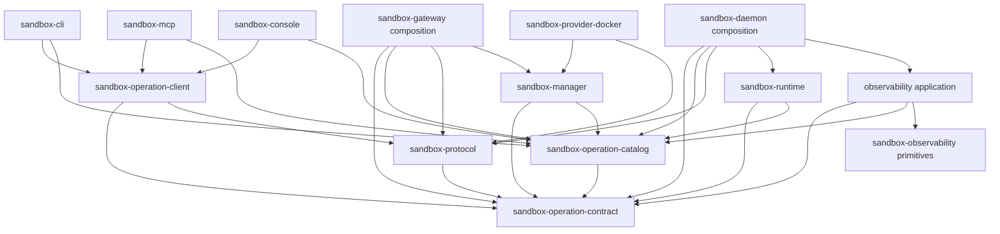

# Sandbox operation core and adapter migration

This specification separates operation-owned semantic and application code
from operation-facing transport and presentation code under two sibling
filesystem boundaries: `crates/sandbox-operation-core/` and
`crates/sandbox-operation-adapters/`. On approval, it supersedes the physical
layout decisions in
[[cli_migration/spec|the legacy CLI migration plan]] and
extends the already implemented
[[mcp_cli_surface/implementation-spec|MCP and three-set CLI specification]].
The existing [[mcp_cli_surface/operation-contract|operation contract]] remains
the behavioral baseline unless this specification explicitly identifies a
breaking internal change.

Until approval, this document is a proposal and has no superseding force. At
adoption, change its status and mark the legacy plan as superseded.

> [!important] Architectural decision
> `crates/sandbox-operation-core/` and
> `crates/sandbox-operation-adapters/` are organizational bounded-context
> directories. Neither is a Rust module, Cargo package, facade crate,
> dependency, or re-export layer. Neither may have a root `Cargo.toml` or
> `src/lib.rs`.

## Outcome

After the migration, two explicit filesystem boundaries own the operation
system:

- `sandbox-operation-core` owns the adapter-neutral operation contract, one
  semantic catalog package with manager/runtime/observability domain modules,
  route declarations, and the three application implementations;
- `sandbox-operation-adapters` owns the wire protocol, shared gateway client,
  CLI, MCP, console server and web application, and the live operation E2E
  suite.

This does not mean that every file which mentions an operation moves. Transport
composition, providers, low-level runtime primitives, deployment entrypoints,
configuration, and documentation remain in their natural repository-level
locations. They may consume operation contracts but may not define public
operation metadata or business handlers.

The migration is intentionally source-breaking. Old package aliases, re-export
shims, compatibility crates, symlinks, and duplicate directory trees are not
part of the target. Public executable names and user-visible operation behavior
are preserved unless called out below.

## Why the current layout is not extensible enough

The three catalog packages have already moved under the provisional
`crates/sandbox-operations/` directory, but core semantics, applications, and
adapters are still distributed or mixed:

| Current location | Responsibility currently owned there | Architectural problem |
| --- | --- | --- |
| `crates/sandbox-protocol` | Catalog types, CLI metadata, help rendering, scope, request/response values, wire parsing | Core operation vocabulary, CLI presentation, and transport are coupled in one crate. |
| `crates/sandbox-operations/{manager,runtime,observability}` | Three public catalog packages | Catalog paths are centralized, but three packages duplicate catalog entry points and cross-domain integrity logic. |
| `crates/sandbox-manager` | Manager handlers, store, router, ports, and daemon transport | The application is outside the operation boundary and its concrete daemon client pulls wire concerns inward. |
| `crates/sandbox-runtime/operation` | Runtime handlers and registries | The operation application is nested among low-level runtime primitives. |
| `crates/sandbox-daemon/src/observability` | Sampling, query service, view routing, and rendering | Operation query logic is fused to daemon lifecycle and runtime implementation details. |
| `crates/sandbox-cli/src/core` | Gateway transport, value request construction, argv parsing, output, and help | MCP and console depend on a CLI package to reuse non-CLI behavior. |
| `crates/sandbox-mcp`, `crates/sandbox-console`, `web/console` | Operation-facing adapters | Peer adapters are physically separated from the operation contract they project. |
| `cli-operation-e2e-live-test` | Cross-adapter operation proof | The test boundary is detached from the code it validates and contains tracked generated reports. |

The current shape creates six concrete extensibility problems:

1. `CliOperation*` names make adapter-neutral concepts appear CLI-owned.
2. Applications consume protocol `Request`/`Response` types directly, so
   application code cannot be separated from wire concerns.
3. MCP and console reuse `sandbox_cli::core`, creating an adapter-to-adapter
   dependency.
4. observability rewrites concrete public operations to the private
   `get_observability` multiplexer, duplicating routing in the CLI, manager,
   daemon, console, and tests.
5. Public catalogs and executable handler registries can drift because their
   equivalence is not enforced as a `(scope kind, operation)` invariant.
6. A single operations umbrella would physically mix inward-facing core code
   with outward-facing protocol and product adapters, weakening the dependency
   boundary it is meant to clarify.

A path-only move would preserve these problems and introduce new dependency
cycles. The migration therefore changes both ownership and dependency
direction.

## Scope boundary

### Moves under `crates/sandbox-operation-core/`

- The adapter-neutral operation schema: semantic definitions, catalog
  documents, route policy, scope, domain, argument types, request/response
  envelopes, and application error vocabulary.
- One merged operation catalog package with manager, runtime, and
  observability domain modules plus canonical internal route declarations.
- Manager and runtime application handlers and their direct tests.
- Observability operation selection and structured response construction.
- Application-owned ports used by external composition and infrastructure.

### Moves under `crates/sandbox-operation-adapters/`

- Wire encoding/decoding, framing, authentication field vocabulary,
  handshakes, and protocol limits.
- Gateway-client transport/configuration and value-based request construction.
- CLI-only projection metadata, argv parsing, help, text/table/ANSI rendering,
  output, progress, and exit behavior.
- MCP projection, console server, and console web UI.
- Live operation E2E source, harness, specifications, and maintained fixtures.

### Remains outside

| Location/component | Why it stays outside |
| --- | --- |
| `crates/sandbox-gateway` | Authentication, listener lifecycle, wire composition, and process assembly are a composition root. It also owns the concrete manager-to-daemon TCP port adapter and local daemon process installer after this migration. |
| `crates/sandbox-daemon` | RPC/HTTP transport, server lifecycle, cgroup setup, runner processes, sampling cadence, log rotation, and composition stay daemon-owned. |
| `crates/sandbox-provider-docker` | Docker infrastructure implements manager ports; it is not operation business logic. |
| `crates/sandbox-runtime/{workspace,layerstack,namespace-process,namespace-execution,overlay}` | These are low-level runtime primitives used by the runtime application. |
| `crates/sandbox-observability` | This remains the leaf tracing, event, sampling, and reading primitive. |
| `crates/sandbox-config` except `configs/cli.rs` | Deployment and process configuration is cross-cutting. Only gateway-client discovery moves. |
| root `bin/`, `xtask/`, configuration, CI, and `docs/` | These are repository entrypoints, build orchestration, and documentation. Paths and package references must be updated in place. |
| generated `target/`, `dist/`, `node_modules/`, caches, `*.tsbuildinfo`, and test reports | These are outputs, not source. They are ignored or removed rather than migrated. |

The whole CLI, MCP, console server, and console web application move as
operation-facing products. The live E2E suite is system verification rather
than a production adapter; it follows them under the adapter boundary because
it exercises those public surfaces and shares their ownership. Thin root
launchers remain in `bin/` so repository command ergonomics do not change.

## Target filesystem and package structure

```text
crates/
├── sandbox-operation-core/                       # organizational namespace only
│   ├── README.md                                 # inward dependency law
│   ├── contract/                                 # sandbox-operation-contract
│   │   ├── Cargo.toml
│   │   ├── src/
│   │   │   ├── argument.rs
│   │   │   ├── catalog.rs
│   │   │   ├── domain.rs
│   │   │   ├── error.rs
│   │   │   ├── family.rs
│   │   │   ├── operation.rs
│   │   │   ├── request.rs
│   │   │   ├── response.rs
│   │   │   ├── route.rs
│   │   │   ├── scope.rs
│   │   │   └── lib.rs
│   │   └── tests/
│   ├── catalog/                                  # sandbox-operation-catalog
│   │   ├── Cargo.toml
│   │   ├── src/
│   │   │   ├── manager.rs
│   │   │   ├── runtime.rs
│   │   │   ├── observability.rs
│   │   │   ├── internal.rs
│   │   │   ├── routes.rs
│   │   │   └── lib.rs
│   │   └── tests/
│   ├── manager/
│   │   └── application/                          # sandbox-manager
│   │       ├── Cargo.toml
│   │       ├── src/
│   │       │   ├── operations/
│   │       │   ├── ports/
│   │       │   ├── router/
│   │       │   ├── services/
│   │       │   ├── model.rs
│   │       │   ├── store.rs
│   │       │   └── lib.rs
│   │       └── tests/
│   ├── runtime/
│   │   └── application/                          # sandbox-runtime
│   │       ├── Cargo.toml
│   │       ├── src/
│   │       │   ├── command/
│   │       │   ├── file/
│   │       │   ├── layerstack/
│   │       │   ├── operations/
│   │       │   ├── workspace_session/
│   │       │   └── lib.rs
│   │       └── tests/
│   └── observability/
│       └── application/                          # sandbox-observability-application
│           ├── Cargo.toml
│           ├── src/
│           │   ├── query.rs
│           │   ├── registry.rs
│           │   ├── response.rs                   # structured values only
│           │   └── lib.rs
│           └── tests/
│
├── sandbox-operation-adapters/                   # organizational namespace only
│   ├── README.md                                 # outward adapter boundary law
│   ├── protocol/                                 # sandbox-protocol
│   │   ├── Cargo.toml
│   │   ├── src/
│   │   │   ├── auth.rs
│   │   │   ├── codec.rs
│   │   │   ├── error.rs
│   │   │   ├── framing.rs
│   │   │   ├── handshake.rs
│   │   │   ├── limits.rs
│   │   │   └── lib.rs
│   │   └── tests/
│   ├── gateway-client/                           # sandbox-operation-client
│   │   ├── Cargo.toml
│   │   ├── src/
│   │   │   ├── client.rs
│   │   │   ├── config.rs
│   │   │   ├── request.rs
│   │   │   └── lib.rs
│   │   └── tests/
│   ├── cli/                                      # sandbox-cli; three existing bins
│   │   ├── Cargo.toml
│   │   ├── src/
│   │   │   ├── bin/
│   │   │   ├── projection/                       # CLI-only paths/flags/usage
│   │   │   ├── help.rs
│   │   │   ├── input.rs
│   │   │   ├── output.rs
│   │   │   ├── manager.rs
│   │   │   ├── observability.rs
│   │   │   ├── runtime.rs
│   │   │   └── lib.rs
│   │   └── tests/
│   ├── mcp/                                      # sandbox-mcp
│   │   ├── Cargo.toml
│   │   ├── src/
│   │   └── tests/
│   ├── console/
│   │   ├── server/                               # sandbox-console
│   │   │   ├── Cargo.toml
│   │   │   ├── src/
│   │   │   └── tests/
│   │   └── web/                                  # tracked frontend source/manifests
│   │       ├── index.html
│   │       ├── package.json
│   │       ├── package-lock.json
│   │       ├── src/
│   │       ├── tsconfig.json
│   │       ├── tsconfig.app.json
│   │       ├── tsconfig.node.json
│   │       └── vite.config.ts
│   └── tests/
│       └── e2e/                                  # live Python operation E2E suite
│           ├── .gitignore
│           ├── config/
│           ├── core/
│           ├── manager/
│           ├── observability/
│           ├── repo/
│           ├── runtime/
│           ├── README.md
│           ├── RUNNING.md
│           ├── conftest.py
│           ├── pytest.ini
│           ├── requirements.txt
│           └── test_smoke.py
│
├── sandbox-config/                               # sandbox-config
├── sandbox-daemon/                               # sandbox-daemon
├── sandbox-gateway/                              # sandbox-gateway
├── sandbox-observability/                        # sandbox-observability
├── sandbox-provider-docker/                      # sandbox-provider-docker
└── sandbox-runtime/                              # organizational namespace only
    ├── layerstack/                               # sandbox-runtime-layerstack
    ├── namespace-execution/                      # sandbox-runtime-namespace-execution
    ├── namespace-process/                        # sandbox-runtime-namespace-process
    ├── overlay/                                  # sandbox-runtime-overlay
    └── workspace/                                # sandbox-runtime-workspace
```

The root workspace continues to list each nested Cargo package explicitly. No
code imports `sandbox_operation_core` or `sandbox_operation_adapters`; those
facade crates do not exist.

## Resulting crates and target LOC

The resulting `crates/` tree contains **20 Cargo crates**: five under the core
namespace, five under the operation-adapter namespace, and ten external
infrastructure or runtime-primitive crates. Neither namespace is an additional
package. Root `xtask` remains the twenty-first Cargo workspace member and is
reported separately below because it is repository tooling outside `crates/`.

Production LOC means physical lines in tracked `src/**/*.rs` plus a crate-root
`build.rs`, including comments and blank lines. It excludes tests, examples,
manifests, lockfiles, documentation, fixtures, generated assets, caches, and
historical reports. Exact straight-move values use committed `HEAD`
`cc5f9974e`; working-tree changes are excluded. Ranges are responsibility-split
estimates and must be replaced with measured post-migration counts in Phase 8.
They are planning bounds, not code-growth targets.

### Core crates

| Resulting Cargo package | Target path | Expected production LOC | Basis |
| --- | --- | ---: | --- |
| `sandbox-operation-contract` | `crates/sandbox-operation-core/contract/` | 600–750 | Adapter-neutral catalog model, semantic argument types, scope/routes, and application envelopes; CLI-only fields are excluded. |
| `sandbox-operation-catalog` | `crates/sandbox-operation-core/catalog/` | 800–1,000 | Current three-package baseline is 963 LOC; CLI declarations leave while unified domain routing and integrity checks are added. |
| `sandbox-manager` | `crates/sandbox-operation-core/manager/application/` | about 2,800 | Current 3,266 LOC minus concrete TCP and local-process adapters moved to gateway composition. |
| `sandbox-runtime` | `crates/sandbox-operation-core/runtime/application/` | 6,024 | Exact straight move from `crates/sandbox-runtime/operation`, followed by dependency and registry renames. |
| `sandbox-observability-application` | `crates/sandbox-operation-core/observability/application/` | 550–800 | Structured query/response behavior extracted from daemon; sampling, lifecycle, and presentation rendering stay outside. |

Expected core production total: **10,774–11,374 LOC**.

### Operation-adapter crates

| Resulting Cargo package | Target path | Expected production LOC | Basis |
| --- | --- | ---: | --- |
| `sandbox-protocol` | `crates/sandbox-operation-adapters/protocol/` | 150–250 | Auth field vocabulary, wire codec, framing, limits, errors, and readiness handshake only. |
| `sandbox-operation-client` | `crates/sandbox-operation-adapters/gateway-client/` | 550–650 | Shared client transport/configuration and typed request construction extracted from CLI. |
| `sandbox-cli` | `crates/sandbox-operation-adapters/cli/` | 1,400–1,550 | Current CLI shell plus help/output and approximately 350–400 LOC of CLI paths, flags, usage, and examples removed from core/catalog declarations. |
| `sandbox-mcp` | `crates/sandbox-operation-adapters/mcp/` | 414 | Exact straight move; peer-adapter dependency on CLI is removed. |
| `sandbox-console` | `crates/sandbox-operation-adapters/console/server/` | 1,160 | Exact straight move; shared transport comes from `sandbox-operation-client`. |

Expected operation-adapter Cargo production total: **3,674–4,024 LOC**.

### External infrastructure and runtime crates

| Resulting Cargo package | Target path | Expected production LOC | Basis |
| --- | --- | ---: | --- |
| `sandbox-config` | `crates/sandbox-config/` | about 1,407 | Current 1,501 LOC minus client-discovery configuration moved with the gateway client. |
| `sandbox-daemon` | `crates/sandbox-daemon/` | 2,424–2,674 | Current 3,224 LOC minus observability application query/response behavior; lifecycle and composition remain. |
| `sandbox-gateway` | `crates/sandbox-gateway/` | about 1,030 | Current 572 LOC plus manager TCP client and local daemon installer composition. |
| `sandbox-observability` | `crates/sandbox-observability/` | 1,582 | Exact unchanged leaf-primitives baseline. |
| `sandbox-provider-docker` | `crates/sandbox-provider-docker/` | 1,970–1,988 | Docker provider remains external; duplicated protocol readiness construction may be removed. |
| `sandbox-runtime-layerstack` | `crates/sandbox-runtime/layerstack/` | 6,146 | Exact unchanged runtime-primitive baseline. |
| `sandbox-runtime-namespace-execution` | `crates/sandbox-runtime/namespace-execution/` | 2,416 | Exact unchanged runtime-primitive baseline. |
| `sandbox-runtime-namespace-process` | `crates/sandbox-runtime/namespace-process/` | 3,460 | Exact unchanged runtime-primitive baseline. |
| `sandbox-runtime-overlay` | `crates/sandbox-runtime/overlay/` | 489 | Exact unchanged runtime-primitive baseline. |
| `sandbox-runtime-workspace` | `crates/sandbox-runtime/workspace/` | 3,678 | Exact unchanged runtime-primitive baseline. |

Expected external Cargo production total: **24,602–24,870 LOC**.
Expected production across all 20 Cargo crates under `crates/`:
**39,050–40,268 LOC**.

### Workspace tooling outside `crates/`

| Resulting Cargo package | Target path | Expected source LOC | Basis |
| --- | --- | ---: | --- |
| `xtask` | `xtask/` | 1,600–1,750 | Current committed `src` baseline is 1,439 LOC; the operation architecture checker adds metadata/path/route policy enforcement. |

The Cargo workspace therefore has **21 members**. Expected `src` production
and tooling source across all members is **40,650–42,018 LOC**. The `xtask`
range is excluded from the 20-crate production total because it is repository
tooling, not deployed product/runtime code.

### Maintained non-Cargo source

| Area | Expected source LOC | Basis |
| --- | ---: | --- |
| `crates/sandbox-operation-adapters/console/web/` | 6,424 | Tracked TypeScript, TSX, CSS, and `index.html`; generated output and `*.tsbuildinfo` excluded. |
| `crates/sandbox-operation-adapters/tests/e2e/` | 18,571 | Maintained Python test and harness source, reported separately from production. |
| `crates/sandbox-provider-docker/examples/` | 82 | Rust example source, excluded from crate production totals. |

Adding frontend and provider example source to the 20-crate production total,
but excluding E2E and root tooling, gives **45,556–46,774 LOC**. Including
`xtask` as well gives **47,156–48,524 LOC** of maintained non-test
workspace/frontend/example source. The goal is near-zero net feature LOC: most
change is movement, responsibility splitting, type renaming, and deletion of
duplicated routing.

`sandbox-gateway` gains the manager TCP client and local daemon installer.
Daemon loses the observability application slice, while provider-docker keeps
its Docker polling logic and switches to the protocol readiness helper.

The current E2E tree also contains 7,977 tracked `test-reports` files and
1,864,095 lines of generated/historical output. Those files are explicitly
outside the target LOC inventory and must not move into the target. Remove them
from Git, archive any required summary outside the source tree, and add durable
ignore rules before moving the maintained 87 non-report tracked files.

## Target dependency law

Arrows mean "may depend on":



The single catalog package has `manager`, `runtime`, `observability`, and
`internal` modules. The manager application may consume declarations from
more than one module for aggregate `snapshot` and daemon forwarding, without
creating inter-catalog dependencies or depending on another application.

| Component | May depend on | Must never depend on |
| --- | --- | --- |
| operation contract | External serialization/value crates only | Any workspace crate, transport, application, or adapter |
| merged operation catalog | operation contract | Protocol, applications, adapters, composition roots |
| manager application | contract; merged catalog; manager ports and required infrastructure primitives | Any adapter, runtime/observability application, daemon/gateway composition |
| runtime application | contract; merged catalog; low-level runtime and observability primitives | Any adapter, manager application, daemon composition |
| observability application | contract; merged catalog; `sandbox-observability` leaf primitives; app-owned input/reader ports | Any adapter, concrete runtime application, daemon composition |
| protocol | operation contract | Catalog, applications, CLI/MCP/console |
| gateway client | contract; protocol | Catalog, applications, CLI behavior |
| CLI, MCP, console | gateway client; contract; merged catalog | Protocol; manager/runtime/observability applications; each other |
| gateway/daemon | contract; merged catalog; protocol; applications; infrastructure | Adapter presentation logic |
| provider-docker | manager application ports/models; protocol readiness helper; Docker/config/runtime primitives | presentation adapters; application handler internals |

Production dependency direction is enforced from `cargo metadata`, not merely
documented. The check uses an explicit allowlist of adjacent layers and also
inspects dev-dependencies so tests cannot conceal a forbidden core-to-adapter
edge. Most importantly, no package manifest or source file under
`crates/sandbox-operation-core/` may depend on or import a package under
`crates/sandbox-operation-adapters/`.

Root `xtask` is enforcement tooling outside the runtime dependency graph. It
may inspect every package through metadata and the filesystem, but no product,
core, or adapter package may depend on `xtask`.

The shared gateway client is the only operation-facing product adapter allowed
to depend on `sandbox-protocol`. CLI, MCP, and console use contract values and
catalog projections. The adapter namespace contains only operation-facing
product/transport adapters; it is not a home for every hexagonal adapter in
the repository. Provider-docker's separate protocol edge is limited to
the protocol-owned daemon readiness helper and does not make it a product
adapter.

## Contract and vocabulary decisions

### The inner contract owns the application envelope

The current protocol `Request` and `Response` types are used by handlers, so
they are not purely wire details. Split them as follows:

- `sandbox-operation-contract` owns `OperationRequest`, `OperationResponse`,
  `OperationError`, `OperationScope`, operation arguments, and validation
  helpers used by applications.
- `sandbox-protocol` owns JSON/wire decoding and encoding, newline framing,
  authentication fields, malformed-wire errors, and size limits.
- gateway and daemon composition decode wire input into an
  `OperationRequest`, call an application, then encode the
  `OperationResponse`.
- application crates do not import `sandbox-protocol`.

This separation makes it possible to add another transport without changing
operation handlers.

### Semantic names lose the historical `Cli` prefix

| Current name | Target name |
| --- | --- |
| `CliOperationSpec` | `OperationSpec` |
| `CliOperationFamilySpec` | `OperationFamilySpec` |
| `CliOperationCatalog` | `OperationCatalog` |
| `CliOperationCatalogDocument` | `OperationCatalogDocument` |
| `CliOperationExecutionSpace` | `OperationDomain` |
| `CliOperationScope` | `OperationScope` |
| protocol `Request` | contract `OperationRequest` |
| protocol `Response` | contract `OperationResponse` |

The core contract owns only semantic fields: name, domain, description,
required/default values, argument relationships, scope policy, and routes.
`CliSpec`, `ArgCliSpec`, CLI paths, flags, positionals, usage, and CLI examples
move to `sandbox-cli::projection`. The CLI adapter joins that projection with
the semantic catalog for argv parsing, help, and its compatibility catalog
document. MCP and console consume the adapter-neutral catalog directly. This
keeps CLI metadata out of core without adding another Cargo package.

This is an approved serialized-document break at the core boundary: the merged
catalog's document is semantic-only. The existing CLI-bearing catalog JSON
remains a supported adapter output; `sandbox-cli` owns its projection and byte
compatibility. That compatibility is not achieved by putting adapter fields
back into the contract.

### Package naming

| Current package | Target package | Decision |
| --- | --- | --- |
| none | `sandbox-operation-contract` | New inner contract. |
| `sandbox-manager-operations`, `sandbox-runtime-operations`, and `sandbox-observability-operations` | `sandbox-operation-catalog` | Merge three packages into one catalog with domain modules and one integrity boundary. |
| `sandbox-protocol` | `sandbox-protocol` | Preserve package name; move its path and narrow its responsibility. |
| `sandbox-manager` | `sandbox-manager` | Preserve package/API name while moving its path. |
| `sandbox-runtime` | `sandbox-runtime` | Preserve package/API name while moving its path. |
| none | `sandbox-observability-application` | New query/dispatch application extracted from daemon. |
| none | `sandbox-operation-client` | New shared wire client extracted from CLI and owned by the adapter boundary. |
| `sandbox-cli` | `sandbox-cli` | Preserve package, feature, and binary names. |
| `sandbox-mcp` | `sandbox-mcp` | Preserve package and binary name. |
| `sandbox-console` | `sandbox-console` | Preserve package and binary name. |

The two new namespaces therefore contain ten Cargo packages: five core and
five adapter packages. Together with the ten retained external crates listed
below, `crates/` has 20 resulting Cargo crates. Root `xtask` makes 21 workspace
members. The namespace directories are not packages.

The three CLI binaries remain `sandbox-manager-cli`, `sandbox-runtime-cli`, and
`sandbox-observability-cli`. The root wrapper scripts keep their existing
names.

## Operation registration and routing

Routing uses three distinct concepts defined by the contract:

- `OperationScope` is the actual validated request value: `System` or
  `Sandbox { sandbox_id }`.
- `OperationScopePolicy` is static declaration metadata: `System`,
  `SandboxRequired`, or `SystemOrSandbox`.
- `OperationScopeKind` is the normalized routing discriminator, `System` or
  `Sandbox`, derived from the actual request without discarding its
  `sandbox_id`.

`OperationDomain` identifies the catalog/product surface (`Manager`,
`Runtime`, or `Observability`); it does not choose the executing application.
Its existing serialized catalog field remains unchanged for baseline
compatibility. `OperationExecutionOwner` in the route manifest makes execution
ownership explicit and may differ from the domain.

The value-based builder used by CLI and MCP separates
`scope_selector: Option<String>` from operation `args`; `sandbox_id` is
interpreted according to policy rather than by its field name alone:

- `System` constructs `OperationScope::System`. A `sandbox_id` declared by a
  manager operation remains a business argument in `args`; an out-of-band
  scope selector is rejected.
- `SandboxRequired` requires a non-empty selector, removes any compatibility
  copy from `args`, and constructs `OperationScope::Sandbox`.
- `SystemOrSandbox` constructs system scope when the selector is absent and
  sandbox scope when it is present, removing the selector from `args` in the
  latter case.

Runtime's CLI projection synthesizes its selector input from semantic route
policy. The observability CLI projection consumes its existing `sandbox_id`
input as a selector. Manager operations with a business `sandbox_id` remain
unchanged. Routers derive `OperationScopeKind` for lookup and pass the actual
scope, including its identifier, unchanged to the selected handler.

Every application route is keyed by `(OperationScopeKind, operation name)`,
not by operation name alone. Every route belongs to exactly one of four
classes:

| Class | Source of truth | Exposure rule |
| --- | --- | --- |
| Public catalog operation | Exactly one domain module in `sandbox-operation-catalog` | Projected to its permitted CLI/MCP/console surfaces and executable for every declared scope. |
| Canonical internal application operation | The merged catalog's `internal` module, outside `OperationCatalog` | Callable only by trusted composition/application flows; never projected publicly. |
| Transport handshake | protocol declaration, for example `sandbox_daemon_ready` | Used only by transport/provider readiness code. |
| Deliberate HTTP-only exception | runtime-owned internal declaration, currently `file_list` | Served only by the documented read-only HTTP path and excluded from public CLI/MCP catalogs. |

The catalog package may contain an `internal` module for canonical identifiers,
but its public `OperationCatalog` projection must exclude those declarations.
This lets the manager and daemon share `export_layerstack`,
`read_export_chunk`, and `squash_layerstack` without duplicating string
literals or introducing a manager-to-runtime-application dependency.

Each domain module contributes to one Rust-only static route manifest of
`OperationRouteSpec { operation, scope_policy, scope_kind, execution_owner,
visibility }`.
`execution_owner` is one of `Manager`, `Runtime`, or `Observability`. An
operation with `SystemOrSandbox` policy expands to two route entries and may
assign different owners; this is how system `snapshot` belongs to the manager
application while sandbox `snapshot` belongs to the observability application.
The merged semantic `OperationCatalogDocument` contains route and scope-policy
metadata but no CLI paths, flags, positionals, usage, or examples. CLI joins
the semantic document with its own projection when producing legacy
CLI-bearing JSON and help. CLI and MCP resolve routes through the merged
manifest and pass the resulting policy/spec into the shared client's
value-based builder. The TypeScript web console preserves its existing
`/api/rpc` request shape, `{ op, scope, args }`; the Rust console server
validates that fully scoped `OperationRequest` against public/internal route
manifests and passes it to the shared client's lower-level send API. The
browser neither consumes a Rust-only manifest nor needs a new route-policy API.
The gateway client does not depend on the catalog package or switch on
operation-name/domain literals.

CLI projection integrity tests assert that every projected operation and
argument exists in the semantic catalog, flags and positional slots are unique,
and no internal declaration is projected. CLI presentation metadata has no
second owner.

Each application has two explicit registries:

- a public registry whose `(scope kind, name)` keys must be a bijection with
  all public route entries whose `execution_owner` names that application,
  including entries declared by another domain module; and
- an internal registry whose entries must match canonical internal
  declarations and must not appear in the semantic public catalog.

Merged-catalog integrity tests assert that public `(scope kind, name)` route
keys are globally unique across domain modules with no exception. A
multi-scope semantic operation produces distinct keys in one manifest; it does
not permit duplicate keys across modules.

### Transitional observability route

Phases 2–5 retain one canonical, migration-only internal declaration for
`(Sandbox, get_observability)` in
`sandbox_operation_catalog::internal::migration::observability`. That module
also owns the temporary semantic resolver from public observability operations
to a contract-owned neutral dispatch target/argument set; it contains no CLI
metadata. CLI and MCP depend on the merged catalog and invoke the resolver
independently before calling the shared gateway client. They do not depend on
one another, and the client does not import the merged catalog or switch on
operation names. The manager aggregate path imports the same canonical
declaration instead of copying the literal. During the transition, console's
existing fully scoped `get_observability` request is validated against the same
internal declaration and sent directly. The declaration is excluded from the
semantic public document and final route set. Phase 4 may make manager
routing scope-kind-first, but concrete public sandbox observability routes are
not activated until the atomic Phase 6 client/manager/daemon cutover. Phase 6
deletes this declaration, resolver, all temporary translations, and the
synthetic `view` argument together.

### Remove the observability multiplexer

Delete the private `get_observability` operation and preserve concrete public
names end-to-end:

| Route | Owner |
| --- | --- |
| `(system, snapshot)` | manager application aggregate snapshot |
| `(sandbox, snapshot)` | observability application in the daemon |
| `(sandbox, trace)` | observability application in the daemon |
| `(sandbox, events)` | observability application in the daemon |
| `(sandbox, cgroup)` | observability application in the daemon |
| `(sandbox, layerstack)` | observability application in the daemon |

For aggregate system `snapshot`, the manager constructs a canonical
sandbox-scoped `snapshot` request for each selected sandbox and aggregates the
responses. It does not call a private alias or bypass the sandbox route
manifest.

The manager router becomes scope-kind-first. A sandbox-scoped operation must be
forwarded or dispatched according to its declared route even when its name is
also declared for system scope. The request builder no longer inserts a
`view` argument or rewrites the operation name.

This is an intentional internal wire break. CLI syntax, MCP tool names, console
behavior, and response shapes remain unchanged after all in-repository clients
and servers are migrated together.

## Exact current-to-target move map

| Current | Target | Required transformation |
| --- | --- | --- |
| `crates/sandbox-protocol/src/lib.rs` | `crates/sandbox-operation-core/contract/src/lib.rs` and `crates/sandbox-operation-adapters/protocol/src/lib.rs` | Export semantic/application types from core contract; export only wire APIs from adapter protocol; add no compatibility re-exports. |
| `crates/sandbox-protocol/src/cli_operation_spec.rs` | `crates/sandbox-operation-core/contract/src/{operation,family,argument}.rs`, `crates/sandbox-operation-core/catalog/src/{manager,runtime,observability}.rs`, and `crates/sandbox-operation-adapters/cli/src/projection/` | Split semantic types, semantic declarations, and CLI-only metadata; apply semantic type renames. |
| `crates/sandbox-protocol/src/catalog.rs` | `crates/sandbox-operation-core/contract/src/{catalog,domain}.rs` plus `crates/sandbox-operation-adapters/cli/src/projection/document.rs` | Keep semantic catalog conversion/validation in core; put any compatibility CLI-bearing document serializer in CLI. |
| `crates/sandbox-protocol/src/scope.rs` | `crates/sandbox-operation-core/contract/src/{scope,route}.rs` | Rename actual scope and add scope-policy, scope-kind, executor, and route-spec types. |
| Application portions of protocol `request.rs`, `response.rs`, and `error_kind.rs` | `crates/sandbox-operation-core/contract/src/{request,response,error}.rs` | Move envelope, argument helpers, application results, and shared application error vocabulary. |
| Wire portions of protocol `request.rs`, `response.rs`, and `error_kind.rs`, plus `auth.rs`, `framing.rs`, and `limits.rs` | `crates/sandbox-operation-adapters/protocol/src/{codec,error,auth,framing,limits}.rs` | Keep wire codec and wire rejection vocabulary; preserve package name and external response strings. |
| Raw readiness declaration/encoding duplicated by provider and daemon dispatch | `crates/sandbox-operation-adapters/protocol/src/handshake.rs` | Provide one canonical readiness request/encoder. Provider retains Docker polling and response validation. |
| `crates/sandbox-protocol/src/help.rs` | `crates/sandbox-operation-adapters/cli/src/help.rs` | Help/search/rendering is CLI presentation. |
| `crates/sandbox-protocol/tests/unit.rs` | core contract, adapter protocol, merged catalog, and CLI test targets | Split every proof by the owner of the behavior. |
| `crates/sandbox-operations/{manager,runtime,observability}` | `crates/sandbox-operation-core/catalog/` | Merge all three Cargo packages into `sandbox-operation-catalog` with `manager`, `runtime`, `observability`, `internal`, and unified `routes` modules. |
| CLI metadata embedded in the three current catalog declaration sets | `crates/sandbox-operation-adapters/cli/src/projection/{manager,runtime,observability}.rs` | Keep flags, CLI paths, positionals, usage, and CLI examples at the CLI boundary; join by semantic operation/argument identity. |
| `crates/sandbox-manager` | `crates/sandbox-operation-core/manager/application/` | Move the application; rename `operation/cli_definition` to `operations/registry`; retain port traits. |
| Concrete `TcpSandboxDaemonClient` implementation and the protocol-limit timeout policy currently imported by manager `router/forward.rs` | `crates/sandbox-gateway/src/daemon_client.rs` | Gateway composition implements the manager daemon-client port and owns protocol authentication, framing, limits, and transport deadline enforcement. The manager port and forwarding service no longer mention `ProtocolLimits`; a future business deadline, if needed, must be an application-owned policy. |
| Concrete `LocalSandboxDaemonInstaller`, launch/process/socket helpers, and focused tests in manager `daemon_install.rs` and manager tests | `crates/sandbox-gateway/src/local_daemon_installer.rs` and gateway tests | Keep only the `SandboxDaemonInstaller` port and neutral `StartedDaemon` DTO in manager application. Gateway composition owns the local-process adapter and its lifecycle-focused proofs. |
| `crates/sandbox-runtime/operation` | `crates/sandbox-operation-core/runtime/application/` | Move package; rename `operation_adapter` to `operations/registry`; replace protocol envelope dependency with contract. |
| `crates/sandbox-daemon/src/observability/{mod.rs,service.rs,layerstack.rs,view/**}` query/response responsibilities | `crates/sandbox-operation-core/observability/application/src/` | Extract structured query and response behavior; retain lifecycle/acquisition in daemon and text/table/ANSI rendering in outward adapters. |
| Pure cases from `crates/sandbox-daemon/tests/unit/{observability.rs,observability_layerstack.rs}` | `crates/sandbox-operation-core/observability/application/tests/` | Move transport-independent query/response proofs; retain daemon wiring/lifecycle cases in place. |
| Daemon observability sampling, rotation, process/runtime collection, and wiring | stays in `crates/sandbox-daemon` | Feed neutral snapshots/readers to the observability application; do not make the app depend on concrete runtime. |
| Text/table/ANSI rendering currently coupled to observability query code | CLI, console-server, or web presentation modules under `crates/sandbox-operation-adapters/` | Core returns structured responses only; each outward surface renders them. |
| `crates/sandbox-cli/src/core/client.rs` | `crates/sandbox-operation-adapters/gateway-client/src/client.rs` | Generic gateway transport. |
| `crates/sandbox-config/src/configs/cli.rs` | `crates/sandbox-operation-adapters/gateway-client/src/config.rs` | This configuration is consumed/re-exported only by the client today. |
| `crates/sandbox-config/tests/unit/configs/cli.rs` | `crates/sandbox-operation-adapters/gateway-client/tests/config.rs` | Move its client-discovery tests and repoint old module declarations. |
| Value-based portion of `sandbox-cli/src/core/request_builder.rs` | `crates/sandbox-operation-adapters/gateway-client/src/request.rs` | Typed values, scope, request ID, and generic validation; callers supply resolved semantic specs. |
| Argv/flag portion of `request_builder.rs`, `output.rs`, and remaining CLI | `crates/sandbox-operation-adapters/cli/` | CLI owns projection lookup, string parsing, help, output, progress, exit behavior, and binaries. |
| `crates/sandbox-mcp` | `crates/sandbox-operation-adapters/mcp/` | Direct move; replace `sandbox-cli` dependency with operation client. |
| `crates/sandbox-console` | `crates/sandbox-operation-adapters/console/server/` | Direct move; replace `sandbox-cli` dependency with operation client. |
| tracked `web/console` source/manifests | `crates/sandbox-operation-adapters/console/web/` | Move source only; remove generated output and update asset paths. |
| The `get_observability` literals in CLI request builder, daemon RPC dispatch, and manager observability snapshot | nowhere | Delete atomically in Phase 6 after concrete route manifests and handlers exist. |
| 87 maintained non-report files in `cli-operation-e2e-live-test` | `crates/sandbox-operation-adapters/tests/e2e/` | Repoint root discovery, commands, documentation metrics, and source assertions. |
| 7,977 tracked E2E report files | nowhere in source | Untrack/delete; archive only outside the source tree if required. |

## Migration phases

This is a design specification, not the execution tracker. When implementation
starts, create [[phase-plan|the phase plan]] beside this file; it owns phase
checkboxes, owners, command output, deviations, and approval evidence. The
final cutover checkboxes in this specification are a summary: update them only
from evidence linked in the phase plan, not as a second execution log.

Every phase must leave the whole workspace green. At minimum, run
`cargo check --workspace --all-targets --all-features` plus focused tests after
each phase. Run the relevant workspace clippy/test commands whenever a
dependency boundary or public behavior changes, then run the complete matrix
in Phase 8. A filesystem move and its Cargo/path updates are one atomic phase
change; no temporary compatibility package is kept after the phase gate.

### Phase 0 — Characterize behavior and freeze the inventory

- Record `cargo metadata` package names, paths, features, binaries, and the
  current dependency graph.
- Record current production LOC by source owner using this specification's
  counting rule; use those measurements as the allocation baseline for the
  target estimates.
- Generate an audit table for every dispatchable route with domain, scope
  policy, expanded scope kind, visibility, catalog owner, execution owner,
  handler owner, and wire destination.
- Snapshot catalog JSON, CLI help fixtures, CLI error envelopes and exit
  codes, MCP tool schemas, console RPC behavior, and internal daemon RPC
  behavior.
- Run the current unit/integration suites and record the live E2E baseline.
- Identify historical scripts/reports which are frozen rather than
  executable migration inputs.

Exit gate: every current operation is classified and behavior that must remain
stable has an executable characterization test.

### Phase 1 — Create the contract and narrow protocol

- Create the non-package `sandbox-operation-core/` and
  `sandbox-operation-adapters/` namespace roots and their boundary READMEs.
- Create `sandbox-operation-contract` under the core target path.
- Move catalog/spec/scope/route types and split the application envelope from
  the wire codec.
- Apply all semantic type renames in one change.
- Move CLI paths, flags, positionals, usage, examples, help, and search into
  `sandbox-cli::projection`; the core contract retains no CLI fields.
- Move `sandbox-protocol` under the adapter namespace without renaming the
  package.
- Centralize the daemon readiness handshake in protocol and update provider
  polling plus daemon dispatch to use that declaration/encoder.
- Move the concrete `TcpSandboxDaemonClient` implementation and its
  `ProtocolLimits`-derived timeout/deadline enforcement from manager to gateway
  composition before dropping the manager protocol dependency. Manager
  forwarding retains only its neutral daemon-client port and business logic.
- Split the current 497-line protocol test suite by ownership.
- Update all application consumers to contract envelopes directly; do not add
  deprecated aliases or re-exports.

Exit gate: applications can construct and handle `OperationRequest` and
`OperationResponse` without importing `sandbox-protocol`; protocol tests prove
wire compatibility for all behavior not explicitly broken later.

### Phase 2 — Merge and reparent catalogs

- Move the three existing catalog crates into one
  `crates/sandbox-operation-core/catalog/` package named
  `sandbox-operation-catalog`; delete the three old packages in the same
  atomic change and remove the now-empty `crates/sandbox-operations/` root.
- Organize declarations into `manager`, `runtime`, `observability`, and
  `internal` modules; update workspace dependencies, callers, fixtures, and
  `Cargo.lock` to the one package.
- Separate semantic public declarations from canonical internal declarations
  and from the CLI-owned projection.
- Build one route manifest with scope policy, concrete scope kind, execution
  owner, and visibility.
- Add the single migration-only route and semantic resolver under
  `internal::migration::observability`; keep both out of the semantic public
  document and free of CLI metadata.
- In the catalog package, replace cross-catalog disjointness tests with
  cross-domain route-uniqueness tests. In `sandbox-cli`, add separate
  projection-integrity and compatibility-JSON fixtures; the catalog's tests
  never depend on CLI.
- Assert the catalog's only workspace dependency is the operation contract.

Exit gate: the merged semantic document contains every public operation once,
CLI fixtures characterize the intentionally separate legacy projection, route
expansion is deterministic, public route keys are globally unique, and every
declaration has one execution owner. Handler bijection is deferred to the
application phases.

### Phase 3 — Extract the shared gateway client

- Create `sandbox-operation-client` at
  `crates/sandbox-operation-adapters/gateway-client/` from gateway transport,
  client config, and value-based request construction.
- Keep argv parsing, help, output formatting, progress presentation, and
  exit-code behavior in `sandbox-cli`; CLI owns catalog-to-flag lookup.
- Replace the existing observability mapping table with independent CLI and MCP
  calls to the merged catalog's temporary semantic resolver. No adapter owns a
  shared projection API or depends on a peer adapter. The client remains
  independent of both the merged catalog and application crates. Delete the
  resolver when Phase 6 changes client and server atomically.
- Preserve console `/api/rpc` as a fully scoped request API. The console server
  validates its `OperationRequest` against the route manifests and calls the
  shared client's send API; it does not force the browser request back through
  the CLI/MCP value builder.
- Change MCP and console to depend on `sandbox-operation-client`, never
  `sandbox-cli`.
- Remove direct `sandbox-protocol` dependencies and imports from CLI, MCP, and
  console. Among operation-facing product adapters, only the shared client owns
  the wire protocol.
- Split request-builder tests according to their new owners.

Exit gate: CLI and MCP share the value-based builder, console shares the same
client transport through its validated-request send API, none depends on or
imports `sandbox-protocol`, and no code outside the CLI adapter imports CLI
parsing/help/output modules.

### Phase 4 — Move and clean the manager application

- Move the whole manager package to
  `crates/sandbox-operation-core/manager/application/` so its handlers,
  services, model, store, router, and ports remain cohesive.
- Rename misleading `operation/cli_definition` code to
  `operations/registry`; it binds handlers and does not define CLI behavior.
- Keep the `SandboxDaemonClient` trait as an application port and verify the
  concrete TCP/protocol implementation remains in gateway composition.
- Keep the `SandboxDaemonInstaller` trait and neutral `StartedDaemon` DTO as an
  application port boundary. Move `LocalSandboxDaemonInstaller`, local
  launch/process/socket helpers, and their focused tests into gateway
  composition.
- Make the router select by scope kind before operation name.
- Retain only the declared migration route for sandbox observability; do not
  claim final concrete-route completeness before Phase 6.
- Depend on the single catalog package and explicitly import manager public
  specs, observability system snapshot, and runtime internal forwarding
  declarations; do not duplicate names.
- Add public route-subset/handler bijection and internal registry tests.

Exit gate: manager application has no protocol or adapter dependency, contains
no concrete TCP or local-process adapter, and every system-scoped public route
has exactly one handler.

### Phase 5 — Move and clean the runtime application

- Move `crates/sandbox-runtime/operation` to
  `crates/sandbox-operation-core/runtime/application/` while leaving low-level
  runtime primitives in their existing crates.
- Rename `operation_adapter` to `operations/registry`.
- Replace protocol request/response imports with contract types.
- Split the public registry from internal operations such as
  `squash_layerstack`, `export_layerstack`, and `read_export_chunk`.
- Import canonical runtime internal identifiers in both manager forwarding
  and runtime dispatch.
- Add `(scope kind, name)` route-subset/handler bijection and
  internal-exclusion tests.

Exit gate: runtime application has no protocol or presentation dependency;
every runtime public entry and every canonical internal entry has exactly one
handler.

### Phase 6 — Extract observability application and remove multiplexing

- Move structured observability query/response behavior to
  `crates/sandbox-operation-core/observability/application/`. Keep collection
  and lifecycle in daemon, and text/table/ANSI rendering in outward adapters.
- Permit direct use of `sandbox-observability` leaf `Reader`/`RawFilter`
  primitives, but define an app-owned port for daemon/runtime data acquisition.
- Add a daemon-owned adapter newtype that implements the app-owned port and
  wraps concrete daemon/runtime state; do not attempt an orphan-rule-invalid
  implementation for a runtime-owned concrete type.
- Move pure query/structured-response tests and retain daemon
  wiring/lifecycle and adapter rendering tests with their owners.
- Route the six declared `(scope kind, operation)` combinations directly from
  the route manifest and execution owner.
- Delete `get_observability` and the synthetic `view` argument from CLI,
  manager, daemon, the migration manifest, console, MCP tests, and E2E
  expectations.
- Keep the console `/api/rpc` envelope stable while changing its observability
  `op` values from the temporary multiplexer to concrete public names.
- Prove that the system `snapshot` and sandbox `snapshot` routes cannot
  shadow each other.

Exit gate: observability application has no concrete runtime, daemon, protocol,
or presentation dependency; it returns structured responses, concrete names
survive end-to-end, and outward behavior matches Phase 0.

### Phase 7 — Reparent all operation-facing adapters and E2E source

- Move `sandbox-cli`, `sandbox-mcp`, and `sandbox-console` under
  `crates/sandbox-operation-adapters/` at the exact target paths while
  preserving their package and binary names.
- Move the console web source/manifests and repoint development, build,
  staging, and runtime asset discovery.
- Remove tracked `dist`, `node_modules`, `*.tsbuildinfo`, caches, and E2E
  reports; update `.gitignore` for target paths.
- Move maintained live E2E source to
  `crates/sandbox-operation-adapters/tests/e2e/` and repair repository-root
  discovery, docs-metrics paths, command examples, and source-path assertions.
- Update root wrapper scripts in place; do not duplicate them under the
  namespaces.

Exit gate: all operation-facing products build and test from the target tree,
and no maintained source remains in the old adapter/web/E2E paths.

### Phase 8 — Enforce boundaries, update documentation, and cut over

- Add `cargo run -p xtask -- operation-architecture-check`, backed by
  `cargo metadata`, for the exact dependency allowlist, path-based
  core-to-adapter prohibition, single-catalog invariant, CLI-metadata
  confinement, and stale-path gates in this specification.
- Add route completeness checks for public and internal registries.
- Measure all 20 resulting `crates/` packages plus root `xtask` using the LOC
  rule above, replace planning ranges with cutover values, and verify the
  allocation accounts for moved/deleted production source.
- Update normative architecture docs, root `README.md`, `CLAUDE.md`, console
  and E2E READMEs, package docs, CI, and all executable scripts.
- Mark historical plans/reports as superseded or exempt instead of
  mechanically rewriting historical evidence.
- Verify the Phase 2 catalog/root deletion remains complete; delete other old
  source directories, stale re-exports, package-name references, and temporary
  migration code.
- Run the full verification matrix and required live Docker gateway proof.

Exit gate: every acceptance criterion below is checked with command evidence
recorded in [[phase-plan|the phase plan]].

## Hard-coded caller audit

The following references must be updated as part of the same phase as their
targets:

| Caller | Current coupling to repair |
| --- | --- |
| root `Cargo.toml` and `Cargo.lock` | Workspace members and path dependencies for the new contract, single catalog, applications, protocol, and product adapters. |
| `bin/start-sandbox-docker-gateway` | Freshness watch currently names `crates/sandbox-protocol/Cargo.toml` and `src`; it must watch core contract/catalog/application and adapter protocol/client sources that feed the bundled binary. Existing `cargo -p sandbox-cli` invocations remain valid. |
| `bin/start-sandbox-console-stack` | Watches `web/console/src`, `package.json`, Vite config, and `index.html`. |
| `bin/start-sandbox-console` | Searches `web/console/dist`. |
| `crates/sandbox-console/src/config.rs:14` | Default assets include `web/console/dist`. |
| `xtask/src/main.rs` | SPA build/staging and help text name `web/console`. |
| `.gitignore` | E2E report/cache and web generated-output rules name old paths and must include `*.tsbuildinfo`. |
| live E2E `core/config.py`, root `conftest.py`, README/RUNNING/spec files, and `manager/management/squash/measure.py:18` | Repository root, documentation metrics, command paths, and `parents[3]` assumptions change after nesting; use one tested root-marker resolver. |
| `cli-operation-e2e-live-test/manager/management/squash/helpers.py:1110-1112` | Source assertions name the manager catalog, manager application registry, and runtime squash implementation; repoint all three. |
| `crates/sandbox-provider-docker/src/readiness.rs` and `crates/sandbox-daemon/src/rpc/dispatch.rs:10-11` | `sandbox_daemon_ready` is duplicated today; both must use the protocol-owned handshake declaration. |
| `crates/sandbox-daemon/src/http/api.rs:89` | `file_list` must import the merged catalog's canonical runtime-internal identifier. |
| `crates/sandbox-cli/src/core/request_builder.rs:225`, `crates/sandbox-daemon/src/rpc/dispatch.rs:10`, and `crates/sandbox-manager/src/operation/management/service/impls/observability_snapshot.rs:16` | These are the three production `get_observability` definitions to delete atomically in Phase 6. |
| `crates/sandbox-config/src/configs/mod.rs:3` and `crates/sandbox-config/tests/unit.rs:41-47` | Remove/repoint module declarations when CLI client discovery and its tests move. |
| CI and local scripts using `cargo -p sandbox-*-operations` | Replace all three package selectors with `cargo -p sandbox-operation-catalog`. |
| root `README.md`, `CLAUDE.md`, `docs/README/sandbox-runtime.md`, `docs/daemon-http/README.md`, console README, and `docs/obsidian/ephemeral-os/docs/{cli-gateway-manager-runtime.md,ephemeral-os.md}` | Current boundary law says protocol owns operation vocabulary and adapters use `sandbox-cli::core`; both statements become false. |

The historical experiment scripts
`docs/obsidian/ephemeral-os/implementation_plan/squash/experiments/performance-parallelization/perf-20260703-052525/scripts/{run_combo.sh,ab_driver.py}`
hard-code old E2E report paths. Update them only if they remain executable;
otherwise mark them frozen and keep them outside normative stale-path checks.

## Required removals and stale-reference gates

At cutover, the architecture command must enforce all of these exact gates:

- No `crates/sandbox-protocol`, `crates/sandbox-manager`,
  `crates/sandbox-runtime/operation`, `crates/sandbox-cli`,
  `crates/sandbox-mcp`, `crates/sandbox-console`, `web/console`, or
  `cli-operation-e2e-live-test` source tree remains.
- No package named `sandbox-manager-operations`,
  `sandbox-runtime-operations`, or `sandbox-observability-operations` remains.
- No package named `sandbox-manager-operation-catalog`,
  `sandbox-runtime-operation-catalog`, or
  `sandbox-observability-operation-catalog` is introduced; exactly one package
  named `sandbox-operation-catalog` exists.
- No import of `sandbox_cli::core` remains.
- No core package exports or imports `CliSpec`, `ArgCliSpec`, any
  `CliOperation*` identifier, or a `cli_definition`/`cli_metadata` module. Core
  `OperationSpec` and `ArgSpec` have no `cli` field; CLI projection structs
  exclusively own `flag`, `positional`, `path`, `usage`, and `examples` fields.
- MCP and console manifests do not depend on `sandbox-cli`.
- CLI, MCP, and console manifests and source do not depend on or import
  `sandbox-protocol`; the shared gateway client is their sole wire-protocol
  owner.
- No package manifest or source file below `crates/sandbox-operation-core/`
  depends on or imports a package below
  `crates/sandbox-operation-adapters/`.
- Manager application source contains no `ProtocolLimits`, concrete
  `TcpSandboxDaemonClient`, concrete `LocalSandboxDaemonInstaller`, or local
  process/socket implementation.
- Production source contains no duplicate literals for canonical internal
  operations or transport handshakes.
- Production source contains no `get_observability` literal or synthetic
  observability `view` routing.
- No semantic public operation definition is owned outside the contract and
  the one merged catalog; CLI presentation metadata has exactly one owner in
  `sandbox-cli::projection`.
- No manager/runtime/observability business handler is owned outside its
  application package.
- No generated E2E report, frontend build output, dependency directory,
  cache, or TypeScript build-info file is tracked.
- The old `crates/sandbox-operations/` tree is absent.
- `crates/sandbox-operation-core/` and
  `crates/sandbox-operation-adapters/` have no root `Cargo.toml`, Rust facade,
  or package identity.
- `cargo metadata` reports exactly the 20 package manifest paths listed in the
  LOC tables under `crates/`, plus root `xtask/Cargo.toml`; no hidden facade or
  compatibility package remains.
- No package other than `xtask` depends on `xtask`.

References in explicitly marked historical documents are not production
violations. Normative docs, executable scripts, manifests, CI, and maintained
tests have no exemption.

## Verification matrix

### Structural and dependency proof

```bash
cargo metadata --format-version 1
cargo run -p xtask -- operation-architecture-check
cargo fmt --all -- --check
cargo clippy --workspace --all-targets --all-features -- -D warnings
cargo test --workspace --all-features
```

The architecture check must fail on forbidden dependency edges, a missing
public route, an extra public handler, a public/internal overlap, or use of an
old package/path in maintained configuration.

### Adapter proof

```bash
cargo test -p sandbox-cli --all-features
cargo test -p sandbox-mcp
cargo test -p sandbox-console
npm --prefix crates/sandbox-operation-adapters/console/web ci
npm --prefix crates/sandbox-operation-adapters/console/web run build
```

Compare the merged semantic catalog, CLI-owned compatibility projection,
CLI help/error fixtures, MCP tool schemas, and console API behavior to the
Phase 0 characterization baseline. Only the documented semantic/CLI catalog
split is an approved representation change.

### Live proof

Run the migrated E2E suite according to its `RUNNING.md`. Do not rerun only a
convenient subset as final evidence. Rebuild the Docker gateway binary with the
repository-required command:

```bash
bin/start-sandbox-docker-gateway --rebuild-binary
```

Use the `sandbox-manager-cli`, `sandbox-runtime-cli`, and
`sandbox-observability-cli` binaries/root wrappers for manual sandbox
operations. The final smoke must cover at least one manager operation, runtime
operation, system-scoped observability snapshot, sandbox-scoped observability
query, MCP tool call, and console RPC call.

## Risks and mitigations

| Risk | Mitigation |
| --- | --- |
| Large path churn hides behavior changes | Characterize first, keep each phase green, and separate semantic changes from mechanical moves except where client/server cutover must be atomic. |
| Contract/protocol split creates circular dependencies | Contract has no workspace dependencies; applications consume contract only; composition consumes both protocol and applications. Enforce with metadata. |
| Manager routing shadows sandbox observability operations | Route by scope kind before name and test every declared `(scope kind, name)` pair. |
| Observability extraction drags runtime into the new app | Daemon retains collection/runtime access and passes neutral data through an app-owned port/input. |
| Generic client becomes another CLI core | Keep argv, flags, help, output, progress, and exit codes in CLI; client accepts typed values. |
| CLI metadata drifts from semantic operation declarations | Join by stable semantic identities and test operation/argument existence, flag/position uniqueness, and internal-operation exclusion. |
| Package renames break scripts and CI silently | Audit every `cargo -p`, workspace dependency, feature, and freshness watcher; regenerate lockfile. |
| Console assets build but are not found at runtime | Update start scripts, xtask staging, server defaults, and tests together. |
| Nested E2E root discovery points at the wrong repository root | Replace parent-count assumptions with a tested root marker search. |
| Millions of report lines dominate the move | Untrack/delete reports before moving source and enforce ignores at the target. |
| Historical documents keep old paths | Exempt only explicitly historical notes; update all normative and executable references. |

## Acceptance criteria

### Ownership and structure

- [ ] The target tree matches this specification; both namespace roots remain
  organizational only and neither is a super-crate.
- [ ] Every operation-owned production file and every operation-facing product
  adapter is under the appropriate `crates/sandbox-operation-core/` or
  `crates/sandbox-operation-adapters/` root.
- [ ] Every intentionally external component is listed in the "Remains outside"
  table and owns no public operation metadata or business handler.
- [ ] All required-removal and stale-reference gates pass.

### Dependency integrity

- [ ] Contract has no workspace dependencies.
- [ ] The merged catalog and protocol each point inward to contract; the
  catalog has no other workspace dependency.
- [ ] Applications do not depend on protocol, presentation adapters,
  composition roots, or each other’s implementations.
- [ ] CLI, MCP, and console depend on the shared client rather than one another
  or directly on protocol.
- [ ] One automated metadata check enforces all forbidden edges.
- [ ] No core package has a manifest or source dependency on any adapter
  package.

### Operation integrity

- [ ] Every public `(scope kind, operation)` key is globally unique and has
  exactly one route, execution owner, and public catalog declaration.
- [ ] Every dispatch entry has either a public specification or a documented
  canonical internal declaration.
- [ ] Public and internal registries are disjoint.
- [ ] Exactly one catalog package owns all semantic domains, and CLI projection
  integrity tests prove every projected operation/argument exists and every
  flag/position is unambiguous.
- [ ] Concrete observability names survive end-to-end; `get_observability` no
  longer exists.
- [ ] Internal routing and readiness identifiers have exactly one production
  definition each.

### Compatibility and proof

- [ ] Existing binary names, CLI features, public operation names/arguments,
  CLI-owned compatibility JSON, help text, errors/exit codes, MCP schemas,
  console APIs, and response shapes match the baseline; the core semantic
  catalog intentionally excludes CLI-only fields.
- [ ] The production-LOC table has measured post-migration values for all 20
  crates under `crates/`, plus the separate root `xtask` tooling row, using the
  documented counting rule.
- [ ] Workspace format, clippy, unit, integration, adapter, frontend, and live
  E2E checks pass.
- [ ] `bin/start-sandbox-docker-gateway --rebuild-binary` succeeds and the
  rebuilt gateway passes representative manual manager, runtime, and
  observability CLI operations.

## Deliberate non-goals

- A dynamic plugin system, runtime crate discovery, procedural macros, or code
  generation framework.
- A `sandbox-operation-core` or `sandbox-operation-adapters`
  facade/super-crate.
- Compatibility aliases for old package names or source paths.
- Moving gateway/daemon transport, Docker providers, runtime primitives,
  observability primitives, all configuration, root scripts, or documentation
  into either namespace merely because it implements a generic port.
- Redesigning operation arguments, responses, CLI UX, MCP tools, or console UI
  beyond changes required to remove architectural coupling.
- Rewriting historical reports and completed implementation plans to pretend
  they used the new paths.
- Preserving generated test reports or frontend build products in Git.

## Decision log

| Decision | Rationale |
| --- | --- |
| Use two organizational namespaces, not super-crates | Core/adapters discoverability and a visible dependency boundary do not require facade APIs. |
| Split core from operation-facing adapters | A path-level inward boundary makes forbidden dependency direction mechanically enforceable. |
| Merge all operation catalogs | One package with domain modules removes package fan-out, duplicated entry points, and cross-catalog integrity plumbing. |
| Keep CLI metadata in CLI | Flags, paths, positionals, usage, and examples are an outward projection, not domain semantics. |
| Keep composition and primitives outside | Consumers and infrastructure are not operation owners; moving them would create a mega-module. |
| Put the application envelope in contract | Handlers need it independently of JSON framing/authentication and future transports. |
| Put concrete daemon TCP/process adapters in gateway | Manager defines ports and business policy; the composition root owns protocol limits, transport deadlines, sockets, and child-process lifecycle. |
| Preserve `sandbox-protocol`, manager/runtime, and adapter package names | Their names remain accurate; path movement alone is enough. |
| Extract a shared gateway client adapter | MCP and console should not depend on CLI presentation code. |
| Remove `get_observability` | Scope-aware concrete routing removes duplicated translation and supports future operation sets cleanly. |
| Delete generated reports instead of moving them | Generated evidence is not maintained source and currently overwhelms the code footprint. |
| Avoid compatibility shims | The user explicitly accepts destructive change, and duplicate APIs would preserve the dependency ambiguity this migration is intended to remove. |
