# ephemeral-os — Core Design Spec

Practical companion to [[Begin of the dream]]. This is the blueprint: components, models, state machines, and workflows. No implementation detail (no code, no file paths, no APIs) — just the design we have to build, and why each piece is there.

> One principle the whole system obeys: **ephemeral execution · durable truth · explicit persistence.** Minds and sandboxes are disposable; the World of facts is the only thing that persists; nothing becomes durable except by an explicit act (assert a fact, or merge a commit).

## Contents

1. [System overview](#1-system-overview)
2. [Vocabulary](#2-vocabulary)
3. [The Node and its roles](#3-the-node-and-its-roles)
4. [Coordination substrate — the Spine and the World](#4-coordination-substrate--the-spine-and-the-world)
5. [Task model — user-task vs agent-task](#5-task-model--user-task-vs-agent-task)
6. [Executors — dynamic workflow vs prompt-based](#6-executors--dynamic-workflow-vs-prompt-based)
7. [The two planes — coordination vs execution](#7-the-two-planes--coordination-vs-execution)
8. [The Kernel and the invariants](#8-the-kernel-and-the-invariants)
9. [Seats and occupants — lifecycle](#9-seats-and-occupants--lifecycle)
10. [Handling multiple requests — concurrency](#10-handling-multiple-requests--concurrency)
11. [Delivery and coordination](#11-delivery-and-coordination)
12. [Component catalog (the 18)](#12-component-catalog-the-18)
13. [Workflows / demonstrations](#13-workflows--demonstrations)
14. [Lessons adopted from zouk](#14-lessons-adopted-from-zouk)
15. [Distilling existing systems (Arbor)](#15-distilling-existing-systems-arbor)
16. [Scorecard, phasing, open decisions](#16-scorecard-phasing-open-decisions)

---

## 1. System overview

Two planes. The **coordination plane** is always on and holds all durable truth as facts. The **execution plane** is opt-in, per-task, and discardable — only tasks that touch real code use it.

```
        user  <->  Orchestrator (front door: classify + route)            Console (watch / steer / resolve)
                       |                                                          ^  (every view = a projection of the Log)
   EDGE --------------+---- heartbeat (cron) . sensors . your voice ------+      |
                       v                                                  |      |
 +=================== COORDINATION PLANE  (always-on . durable truth) ============================+
 |  AGENT RUNTIME    Role Registry      Occupant Runtime (rehydrate->reason->assert)   Capabilities |
 |        | propose (spawn/assign/assert/author/query)                         ^ remember          |
 |  KERNEL (disposes)  Materializer . Scheduler+Budget . Seat Mgr . Invariant Guard . Recorder+Arbiter . [Compactor] |
 |        | commit / match                                                     ^ ready seats        |
 |  FACT STORE      Log (append-only truth)  +  World (current view)  +  Provenance                |
 |        holds:    Tasks . Roster . Budget . Decisions . Findings . ProposedDiffs . Chatrooms        |
 |  CONSTRUCTS      Task Graph  ·  Domain Models  ·  Chatrooms (one per user task)                    |
 +==========================================+======================================================+
            deliverable = a FACT             |  opt-in: only tasks that touch code
 +=========================================v== EXECUTION PLANE  (opt-in . scratch . discard) =======+
 |  Executor (mode a | b)  ->  Sandbox (none | view | isolated)  ->  emit ProposedDiff fact  -> DISCARD |
 |                                              +- if landed -> Merge Actuator -> real workspace (OCC)  |
 +==================================================================================================+
```

Locked decisions that shape everything below:

| # | Decision | Consequence |
|---|---|---|
| D1 | **Push-only** (no pull/bidding) | Coordinators assign work down; no idle worker pool to pull from |
| D2 | **One orchestrator** (no shared pool) | Single root authority → single-writer over shared facts → no pollution |
| D3 | **Task ≠ Agent** | Tasks are durable; workers ephemeral; a task survives worker death and re-binds |
| D4 | **State lives in the World, not the agent** | No fork/clone; follow-ups rehydrate; concurrency is many readers over one truth |
| D5 | **Roles propose, Kernel disposes** | Org structure is agent-programmable at runtime, but bounded by kernel-enforced invariants |
| D6 | **Two planes** | Coordination truth (facts) is separate from code execution (sandboxes) |
| D7 | **Discard-default** | A task's deliverable is a fact; sandbox changes are thrown away unless explicitly merged |

---

## 2. Vocabulary

| Term | What it is | Lifetime |
|---|---|---|
| **Fact** | An immutable, typed, identified statement that became true. The only data kind. | durable |
| **Topic** | The type/schema of a fact (+ identity rule + merge rule). | durable |
| **Log** | Append-only history of every fact asserted/retracted. The source of truth. | durable |
| **World** | Current set of true facts, indexed — derived by folding the Log. What agents read. | derived |
| **Provenance** | Per-fact lineage: which seat asserted it, from which upstream facts. | durable |
| **Node** | The one agent primitive: a reasoner over the World. Wears a role. | n/a (a type) |
| **Role** | A data bundle `{capabilities, scope, trigger, lifetime, cardinality}`. Orchestrator/coordinator/worker/background are default roles. | durable (data) |
| **Seat** | A durable identity + its slice of World state + position in the delegation tree. | durable |
| **Occupant** | The ephemeral LLM process that embodies a seat for one event, then is released. | ephemeral |
| **Task** | A unit of intent + accountability in a DAG. User-task (intent altitude) or agent-task (execution altitude). | durable |
| **Executor** | What a leaf agent-task binds to: a prompt+agent (mode a) or an authored workflow (mode b). | durable binding |
| **Sandbox** | Per-task scratch execution environment. Holds no truth; discarded after use. | ephemeral |
| **ProposedDiff** | A code change expressed as a fact (the system's "pull request"). | durable fact |
| **Chatroom** | A scoped World bound 1:1 to a (top-level) user task; members = orchestrator + assigned coordinators. The durable locus for delegation, updates, negotiation, and routed follow-ups. | durable |
| **Front door** | The orchestrator's intake of all user messages; classifies each as a follow-up (→ route into a task's chatroom) or a new ask (→ new user task + chatroom). | n/a |
| **Edge** | The only boundary for non-determinism: Clock, Sensors, Operator (in); Actuators (out). | n/a |
| **Kernel** | The runtime (not an agent) that matches, schedules, commits, and enforces invariants. | n/a |
| **Domain Model** | A coordinator-owned, *customizable* structure over facts (8 seams: schema/shape/ops/comparator/projection/rollup/cycle/execution). An Idea Tree, a champion set, a knowledge graph are **configs**, not hardcoded types. | durable (data) |
| **Context Projector** | Assembles a bounded, relevant context from the World for each occupant turn. State (durable, in World) and context (per-turn projection) are different things. | n/a |
| **Quiescence** | The state where no reaction is ready and no work is in flight — the fixpoint that means "idle or done". | n/a |

---

## 3. The Node and its roles

There is **one** agent primitive. "Orchestrator / coordinator / worker / background" are not subclasses — they are **roles**, which are data, settable and definable at runtime.

```
            NODE  (one primitive: a reasoner over the World)
              | wears a
              v
   ROLE = { capabilities . scope . trigger . lifetime . cardinality }
              | bound to a
              v
   SEAT = durable identity + state slice + position in tree
              | embodied per-event by an
              v
   OCCUPANT = ephemeral LLM process (single-writer per seat)
```

The four default roles are four settings of the same dials:

| Role | Scope | Trigger | Lifetime / cardinality | Key capabilities |
|---|---|---|---|---|
| **Orchestrator** | whole mission | user message | persistent · **singleton** | triage, spawn coordinators, own roster+budget |
| **Coordinator** | one slice/domain | parent assignment | persistent · one-per-domain | decompose, spawn workers, author workflows, guard quality |
| **Worker** | one agent-task | binding | **ephemeral** · one-per-task | run executor, assert result facts |
| **Background** | a domain | cron / sensor | persistent · few | sense, assert Findings, propose tasks |

Why roles-as-data (not types): it delivers the north-star requirement — *generic, customizable, programmable by the agent at runtime*. The agent can `defineRole(auditor)` or spawn a flat swarm; the 3-tier hierarchy is just the **default template**, not a hardcoded class tree. Cardinality and lifetime live in the role, which is why orchestrator/coordinator are persistent seats and workers are ephemeral — a declared property, not a special case.

---

## 4. Coordination substrate — the Spine and the World

### 4.1 Log → World → Provenance

```
   writers append                          readers read              "why?" walks
        |                                       ^                          |
        v                                       |                          v
   +---------+      fold (Materializer)     +---------+            +-------------+
   |  LOG    | --------------------------> |  WORLD   |            | PROVENANCE  |
   | (truth) |   apply / supersede / index | (view)   |            | (lineage)   |
   +---------+                             +---------+            +-------------+
   append-only       Tasks . Roster . Budget . Decisions . Findings . ProposedDiffs . Chatrooms
```

- **Log** is authoritative and append-only. **World** is a derived, indexed view (a pure function of the Log). Recovery = replay the Log onto the latest snapshot.
- **Re-asserting a fact is a no-op** (facts are set members keyed by identity) → idempotency is free, at-least-once delivery is automatically safe.
- **Provenance** is mandatory, not optional: it powers the `why?` trace, follow-up routing, and audit. (zouk's gap: no provenance → debugging is log-spelunking. We treat provenance as a day-one feature.)

### 4.2 Fact kinds (consistency by CALM)

Most facts are add-only ("monotone") and need **no coordination** (CALM theorem). Non-monotone state must declare its merge:

| Kind | Semantics | Concurrency | Examples |
|---|---|---|---|
| **monotone** | add-only; never retracted | conflict-free, unordered, parallel | `ReviewDone`, `Finding`, `ProposedDiff` |
| **register** | latest-wins by logical time | last-writer-wins merge | `CurrentGoal`, `BudgetRemaining` |
| **lattice** | merge by declared join | CRDT merge (counter/set-union) | `BudgetSpent`, `SeenIds` |
| **absence** (negation) | "X exists and no Y for it" | only safe when stratum is stable (quiescence-gated) | `Needs ∧ ¬Done` |

> **Residual we scope, not solve:** absence-under-concurrency ("no review *yet*") is a law of nature. v0 = monotone + register + quiescence-gated absence; general stratified absence is deferred.

### 4.3 The spine vs the World

The **spine** is the durable backbone of *accountable work* — the Task DAG plus its lineage back to the originating request. The **World** is the broader fact-space that the spine lives in (also holding roster, budget, decisions, findings). The spine is "the part of the World you are answerable for."

### 4.4 Domain Model — a customizable structure over facts

The Task DAG (§5) is the substrate's *built-in* structure for accountable work. But a coordinator often maintains a **second, domain-specific structure** in the World — a search tree of hypotheses, a champion/challenger set, a knowledge graph, a backlog. We do **not** hardcode any of these. A coordinator declares a **Domain Model**: a plugin expressed as data at runtime (like a Topic or a Role) that customizes the generic substrate at eight seams.

The substrate ships generic **shapes** with built-in traversals — `set · dag · tree · graph`, each giving `children / ancestors / roots / frontier (= pending childless)` for free — so structure logic is never hand-coded. You supply only what is domain-specific:

| # | Seam | What you declare | Generic default |
|---|---|---|---|
| 1 | **Schema** | the Topic(s) for the model's nodes (Zod) | any Topic |
| 2 | **Shape** | how nodes link | `set · dag · tree · graph` |
| 3 | **Operations** | the coordinator's tools over the model | generic graph ops (add/update/prune/frontier/ancestors) |
| 4 | **Comparator** | `isBetter(a,b)` + `shouldPromote(cand, canon)` | scalar, or pluggable |
| 5 | **Projection** | the bounded-context policy → Context Projector (#18) | frontier + ancestor-path + summary |
| 6 | **Rollup** | how results abstract upward (learning) | identity · LLM-synthesis · fn |
| 7 | **Cycle** | the coordinator's method as *prompt + auto-hooks* | ReAct loop + rollup-on-result |
| 8 | **Execution** | the sandbox/artifact binding for workers | Sandbox (§7) + ProposedDiff |

Consequences:

- **The model's state is facts in the World** (durable); its **context is what the Projection assembles** (bounded, per-turn). State ≠ context (§9, #18).
- **Nothing about the structure is coded into the substrate.** A search tree is `shape: tree`; a champion set is `shape: set` + a `shouldPromote` comparator; a knowledge graph is `shape: graph`. The coordinator authors a Domain Model the same way it authors a workflow — at runtime, as data.
- **The Task DAG is itself the privileged Domain Model** `{ shape: dag, schema: Task, cycle: decompose }`. Same machinery, no special case.

Worked example — Arbor's Idea Tree is a *value*, not a class:

```
IdeaTree = DomainModel{
  schema:     IdeaNode{ hypothesis, status, score, insight, code_ref }
  shape:      tree                         // frontier + ancestors come free
  comparator: { isBetter: argmax(score) by direction,
                shouldPromote: held-out test beats trunk by threshold }   // merge gate
  projection: constraints                  // tree-shape + root-insight + pruned + validated
  rollup:     llm_synthesis                // child insights -> parent insight  (backprop)
  cycle:      "observe -> ideate -> select -> dispatch -> decide"  (prompt text)
  execution:  sandbox(isolated) -> artifact = branch
}
```

No `IdeaTree` type exists in the substrate — it is a coordinator-authored plugin. (Verified against the real Arbor: its node is a hardcoded dataclass, its comparator a single scalar, its sandbox git worktrees, its cycle a prompt — exactly these four seams, which we lift into data. §15.)

---

## 5. Task model — user-task vs agent-task

One `Task` primitive, two **altitudes**. Both are durable facts in the spine; workers that execute them are not.

```
   DURABLE SPINE (survives crash + worker death)                 EPHEMERAL
   ------------------------------------------------              ----------
   USER-TASK DAG   (intent . acceptance criteria . ONE owner)
   [U1] --> [U2] --> [U3]        owned by orchestrator / coordinators
            |
            | decomposes into
            v
   AGENT-TASK DAG  (execution units . one executor each)
   [a1] --> [a2]
     |        |  bind (a fact, not identity)
     v        v
   (worker) (worker)            EPHEMERAL: worker dies -> task stays OPEN -> re-bind to fresh worker
```

| | **User-task** | **Agent-task** |
|---|---|---|
| Altitude | intent / accountability | execution |
| Owner | a coordinator (the quality guard) | bound to one worker |
| Carries | acceptance criteria, lineage to the user request | inputs + the executor (mode a/b) |
| Decomposes into | sub-user-tasks or agent-tasks | terminal (a leaf) |
| Deliverable | acceptance met (facts roll up) | a result fact (verdict / ProposedDiff / finding) |
| Drift control | the owner guards intent against the criteria | inherits criteria via provenance |

### 5.1 Task lifecycle (state machine)

Minimal by design: a task is **blocked** until its dependencies are done, **ready** once they are, **running** once the coordinator assigns it to an ephemeral worker, and **done** once that worker reports completion — which unblocks dependents. That is the whole cycle.

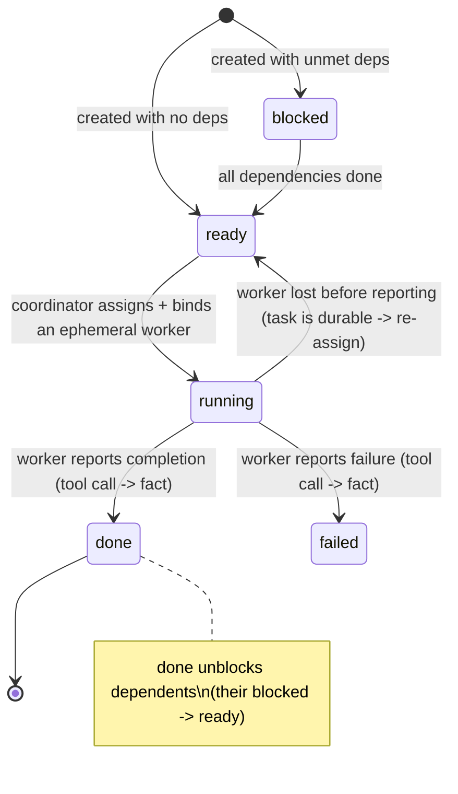

Only two edges leave the happy path: `failed` (the coordinator decides what to do next — re-create or escalate; no built-in retry machinery) and `worker lost -> ready` (the durability property — the task outlives the worker and is simply re-assigned).

### 5.2 Assignment is push, not claim

We are push-only (D1): there is **no task board and no claiming**. A coordinator creates agent-tasks during decomposition and **assigns** each ready one by writing a single-owner binding fact and spawning a fresh ephemeral worker for it.

- **No competition, no claim race.** The coordinator is the single decider, so one-owner-per-task holds *by construction* — not by an optimistic claim that can fail. (This is where we deliberately diverge from zouk's claim-based model, which is a pull pattern.)
- **The worker has exactly one state tool.** On finishing, the worker calls it to report `done` (or `failed`), which asserts a completion fact. A Materializer reaction re-evaluates dependents; any whose dependencies are now all done move `blocked -> ready` and become assignable. That is the entire coordination mechanism.
- **Workers never look for work.** They are handed a task, do it, report once, and are released. Discovery, dependency-gating, and re-assignment are the coordinator's and the kernel's job — never the worker's.

### 5.3 The coordinator is a standing loop, not a one-shot decomposer

§5.2 reads as if a coordinator decomposes once and stops. Many systems — search, optimization, research, self-improvement — are **iterative**: the coordinator generates new work *from results*, round after round, until a goal or convergence. This needs **no new state machine.** A coordinator is a **standing ReAct loop**: an occupant that reactivates when a result fact lands, reads a bounded projection of its Domain Model (§4.4, #18), decides, and dispatches more work. The "cycle" is its **prompt + its operations (tools)** — data, not code. (Exactly how Arbor runs: one persistent agent; the six steps live only in the prompt — §15.)

Two capabilities make the loop concrete:

- **Dispatch-and-await (all | any).** A coordinator pushes N agent-tasks to ephemeral workers and waits for all (a barrier) or the first (a race) before deciding. Mechanically: assign N, then a Materializer **count pattern** (`count(Evidence) >= K`) re-fires the coordinator. (Arbor's `asyncio.gather` await-all is the barrier case.)
- **Rollup-on-result.** When a result fact lands, the Domain Model's **rollup** seam abstracts it upward (Arbor auto-runs insight backprop). This is the one auto-invoked hook; everything else is the coordinator's choice.

Termination is unchanged: the Arbiter detects quiescence/Goal, and **convergence** (diminishing returns) is just a coordinator-asserted `Stop` fact driven by the comparator over recent results.

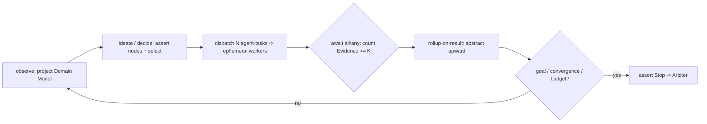

---

## 6. Executors — dynamic workflow vs prompt-based

A leaf agent-task binds to exactly one executor. Two modes:

| | **Mode (a): Prompt + Agent** | **Mode (b): Dynamic Workflow** |
|---|---|---|
| What | one occupant runs a prompt | the coordinator **authors a runnable workflow** and binds it |
| Shape | single reasoning turn | a DAG/branch/loop of agent steps (Claude-Code-style), run durably |
| Authored by | static (the role's prompt) | the coordinator, **at runtime** |
| When to use | simple, one-shot, judgment | multi-step, repeatable, verifiable (lint∥test∥types→branch) |
| Determinism | n/a | replayable; recorded outcomes reused on resume |
| Risk | low | high power — **must run in a sandbox** (§7) |
| Reuses | Occupant Runtime | the workflow SDK (`flow/dag/agent`) |

Mode (b) is the deepest form of autonomy: the system writing its own execution. It is safe to allow **by default** *because* it runs in a discard-default sandbox (the blast radius is throwaway) — not because of an approval gate. The authoring surface should be the **constrained workflow DSL** (analyzable, replayable), not arbitrary code.

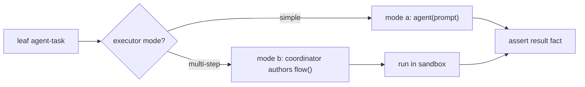

---

## 7. The two planes — coordination vs execution

The coordination plane is the always-on truth. The execution plane (sandbox) is opt-in per task and **holds no truth**.

| | **Coordination plane** | **Execution plane** |
|---|---|---|
| On | always | only when a task touches code |
| Holds | durable truth (facts) | scratch (discarded) |
| Unit | fact / task | sandbox |
| Backed by | Fact Store | ephemeral-os |
| Default | persist (assert a fact) | **discard** |
| Sharing | one World | one sandbox per task |

### 7.1 The isolation dial (sandbox is a choice)

| Mode | Sees | Use | Keeps |
|---|---|---|---|
| **none** | nothing | pure reasoning: triage, research, plan, review-by-reading | — (no sandbox at all) |
| **view** | snapshot of real code (read-mostly) | produce a verdict / finding | nothing |
| **isolated** | private fork of the code | edit freely | a **ProposedDiff fact** (and discard the scratch) |

### 7.2 The deliverable is a fact; landing is a governed Actuator

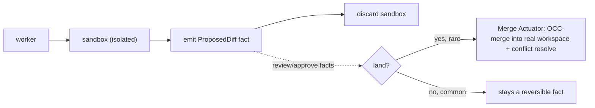

- A code change is a **fact** (`ProposedDiff`), reviewable like a PR. Most never land.
- **Merge Actuator** is the single governed door to real reality: gated, OCC-merged, conflict-resolved. It is the one place irreversible mutation happens — so it is the one place that is gated.
- **Invariant: sandboxes hold no truth.** Durability is always an explicit act — `assert` (coordination plane) or `merge` (execution plane).

---

## 8. The Kernel and the invariants

The Kernel is **not an agent**. Roles propose changes; the Kernel validates and commits. It has six duties:

| Duty | Responsibility |
|---|---|
| **Materializer** | fold Log→World; fire a reaction the moment a content pattern becomes true (content-addressed dispatch — no routing switch) |
| **Scheduler + Budget** | pick ready reactions; fairness, concurrency cap, admission control; enforce budget-as-fact (divides down the tree) |
| **Seat Manager** | activate/deactivate seats; **single-writer-per-seat**; rehydrate occupant from World |
| **Invariant Guard** | serialized commit path for shared facts; pre-commit validation of the laws below |
| **Recorder + Arbiter** | journal outcomes with provenance (replay/recovery); detect quiescence, evaluate Goal, terminate |
| **Compactor** | snapshot + GC + per-Topic TTL (mandatory at 24/7; deferrable v0) |

### 8.1 The invariants (the fixed frame around runtime-programmable roles)

| Invariant | Prevents | Validated by zouk? |
|---|---|---|
| **single-writer per seat** | clones / split-brain / stale-writer overwrites | **Yes — their #1 production bug** (stale writer); fixed by current-owner tracking |
| **capabilities ⊆ parent** | privilege escalation down the tree | — |
| **budget splits down the tree** | runaway delegation / cost explosion | — |
| **one accountable owner per task** | accountability diffusion; double-work | Yes (zouk via claim; we via push-assignment) |
| **single root (one orchestrator)** | shared-state pollution | — |

These few are fixed; **everything else is data** the agent can rewrite at runtime. That split is what makes the system simultaneously customizable and sound.

---

## 9. Seats and occupants — lifecycle

A seat is a **persistent identity**; its occupant (the LLM process) is **rented per event**. Reactivation is *reincarnation* (one seat re-embodied in time), never *cloning* (two live copies). The dividing line is single-writer-per-seat.

zouk independently arrived at this and proved the key refinement: **"idle" is not a lifecycle status — it is a routing/cost concern.** Two idle flavors, both still "active":

| Idle flavor | Process | Wake cost | Maps to our |
|---|---|---|---|
| **live-idle** | alive, waiting on input | cheap (poke existing process) | warm seat |
| **cached-idle** | stopped, state parked | expensive (full restart + rehydrate) | cold seat |

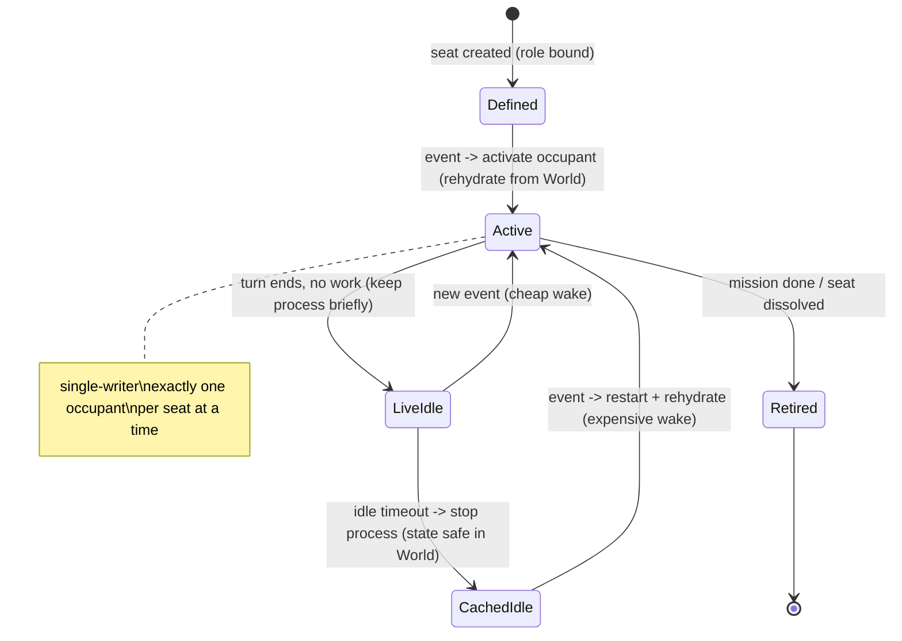

Rules adopted from zouk's hard-won experience:
- **Never add a lifecycle status for "idle"** — activation cost is a routing concern, not state. (Avoids status sprawl.)
- **Reset = stop → start**, never an in-place rollback; the old occupant must be silenced before the new one is authoritative.
- **Never treat "process exited" as the idle signal** (heterogeneous runtimes differ — some persist after a turn). Require an explicit idle mark.
- **Drop writes from a non-owning occupant** (stale-writer guard) and reconcile from the current owner's health.

> **State vs context.** A seat's *state* is durable (facts in the World); its *context* is what the **Context Projector** (#18) assembles for each activation — a bounded, relevant projection, never the raw World. You cannot pour a large World into a prompt; the projector selects, windows, and summarizes. Arbor proves the split: its on-disk tree is *state*; the `constraints` view it re-reads each round is *context*.

---

## 10. Handling multiple requests — concurrency

The problem: the orchestrator is a singleton (D2) and an LLM reasons single-threaded. If it's busy on request A and B arrives, naive options are **fork** (→ unmergeable split-brain) or **serialize** (→ throughput bottleneck). We do neither.

**Resolution: thin single-writer spine + parallel ephemeral reasoners + optimistic concurrency.** Because state lives in the World (D4), heavy reasoning is parallelized and only a tiny allocation commit is serialized.

```
   THE SPINE (singleton, single-writer)        owns ONLY: Roster . Budget . Conflict-table
   does ONLY fast transactions (no heavy LLM)
        |  spawn A     |  spawn B     |  spawn C    (ephemeral, parallel)
        v              v              v
   [reasoner A]   [reasoner B]   [reasoner C]   heavy decomposition, ALL concurrent
        |              |              |
        v              v              v
   Mission-DAG-A   Mission-DAG-B   Mission-DAG-C   ADDITIVE facts (no merge)
        \______________|______________/
          contention (reuse coord? debit budget?) -> serialized commit via spine
          (OCC: loser retries the small commit, not the decomposition)
```

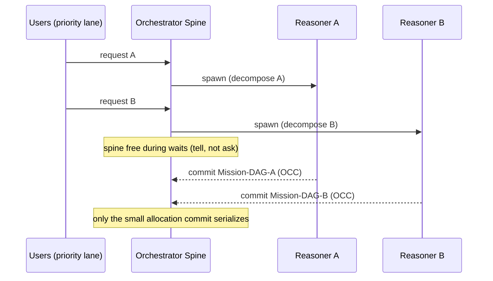

Mechanisms:

| Mechanism | Effect |
|---|---|
| **Tell, not ask** (across delegation) | spine yields during waits; "busy" = a 50ms transaction, not a 30s reason |
| **Parallel reasoners** | heavy decomposition runs concurrently, off the spine |
| **Optimistic commit** | only roster/budget writes serialize; conflicts retry the commit, not the work |
| **Additive facts (CALM)** | different requests' DAGs are monotone → no merge |
| **Scale wider, not cloned** | coordinator saturated → spawn another coordinator (one per domain), never fork one |
| **Priority lane** | new user requests jump internal-event backlog (low intake latency) |
| **Warm/cold spine** | logically stateless (rebuildable from Log); kept warm for latency, rebuilt on crash |

Throughput is bounded by the spine's small-transaction rate (high), **not** by reasoning time (parallel) or wall-clock-including-waits (yielded). The singleton constraint (D2) is what makes this *sound* — one writer of shared state.

> This optimistic commit is **resource allocation** — two intake reasoners contending for the same coordinator or budget — **not** task contention. Tasks are never claimed; they are push-assigned by their coordinator (§5.2).

---

## 11. Delivery and coordination

Two coordination edges, used where each is honest:

| Edge | Mechanism | Used for |
|---|---|---|
| **Addressed delegation** | parent → child assignment (the org tree) | spawn, assign, budget, accountability, teardown |
| **Stigmergic** | assert a fact → whoever cares reacts (no addressing) | sensing, findings, negotiation, cross-team signals |

### 11.1 WHO wakes vs WHETHER to reply (from zouk)

zouk's standout pattern, directly portable to our Scheduler: **the server decides who is woken (relevance routing); the agent decides whether to act.** Don't broadcast — broadcasting "wakes agents, burns tokens, creates low-value replies."

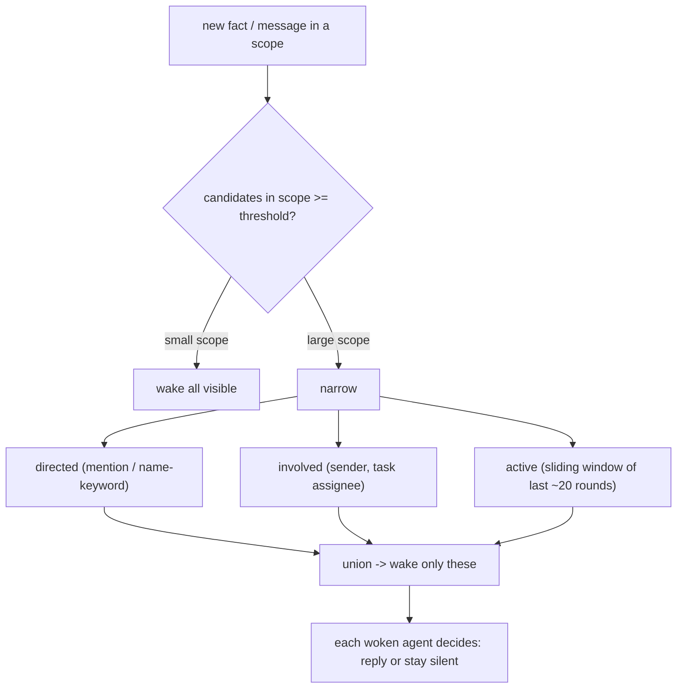

| Filter | Definition |
|---|---|
| **directed** | explicit mention or case-insensitive name-keyword in the content |
| **involved** | sender + task assignee |
| **active** | seats seen in the scope's last ~20 rounds (recency-as-relevance) |

Design notes adopted: **bias to over-inclusion** (recall > precision; agent-side restraint is the backstop); **scope isolation** (thread-scope ≠ channel-scope; a busy thread must not wake parent-scope agents); the window is an **in-memory optimization, the Log is source of truth** (evicted scopes rehydrate from "root + last N"). This *is* our Scheduler admission + scoped-World delivery, made concrete.

### 11.2 Chatrooms — one per user task

A chatroom is a **scoped World bound 1:1 to a (top-level) user task.** Its members are the **orchestrator and the coordinator(s) assigned within that user task's tree.** It is the single durable place where everything about that user task is communicated:

- the orchestrator hands the user task to its coordinator(s) — **delegation**;
- coordinators post progress, questions, and results — **updates**;
- when several coordinators share a dependency, they **negotiate in-room** (the orchestrator is present to arbitrate);
- the orchestrator posts **follow-ups** from the user; an incoming user message classified to this task is **routed in here**.

Membership follows the delegation edges — the one place addressing is honest — but inside the room communication is still facts in a scoped World, and the relevance router (§11.1) decides which members wake. The user reaches the room only through the orchestrator (the front door); the orchestrator is the user's representative in every room. Coordination *across* user tasks stays stigmergic (via the World) or is bridged by the orchestrator, which is a member of every room it opened.

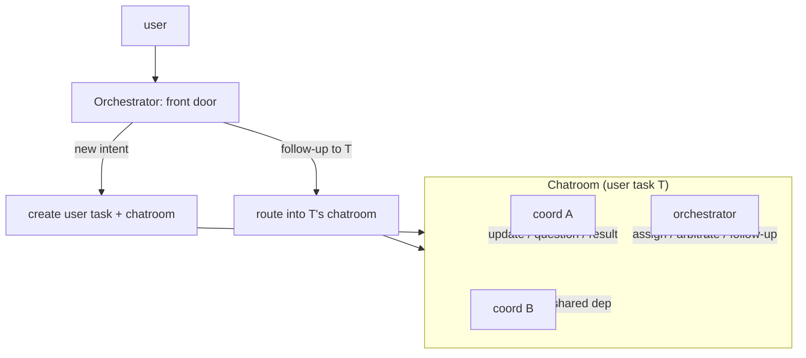

**Lifecycle:** created with the user task; **quiesces** (does not close) when the task is done; **reactivates on a follow-up** by rehydrating from the Log; archived to cold storage after retention so a late follow-up still lands where it belongs. A multi-coordinator negotiation that goes quiescent *without* a `Decision` fact is stalled → the orchestrator escalates.

### 11.3 Follow-up routing (front door)

Every user message hits the orchestrator first. It classifies — using the session history and the task spine (provenance) — and routes:

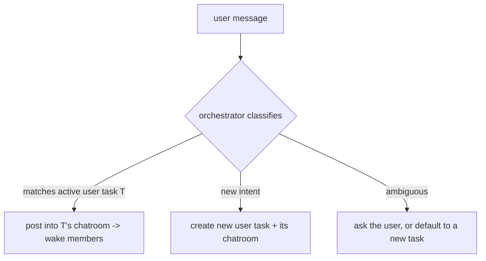

This is the operational form of "follow-ups just work": the durable per-task room already holds the context, so a routed follow-up reactivates exactly the right orchestrator + coordinator set with their state rehydrated — there is no separate thread to reconcile.

---

## 12. Component catalog (the 18)

| # | Component | Plane / layer | Responsibility | Build |
|---|---|---|---|---|
| 1 | **Fact Store** | substrate | Log + World + Provenance; the single source of truth | NEW (light) |
| 2 | **Materializer** | kernel | incremental pattern match; fire reactions on content | NEW |
| 3 | **Scheduler + Budget** | kernel | admission, fairness, concurrency cap, budget enforcement | NEW |
| 4 | **Seat Manager** | kernel | virtual-actor lifecycle; single-writer-per-seat; rehydrate | NEW |
| 5 | **Invariant Guard** | kernel | serialized commit; enforce the 5 invariants | NEW |
| 6 | **Recorder + Arbiter** | kernel | journal w/ provenance; quiescence / goal / termination | REUSE + NEW |
| 7 | **Compactor** | kernel | snapshot + GC + TTL (deferrable v0) | NEW (deferrable) |
| 8 | **Occupant Runtime** | agent | the LLM loop: rehydrate → reason → assert | REUSE (workflow SDK) |
| 9 | **Role Registry** | agent | roles as data; `defineRole` at runtime | NEW (small) |
| 10 | **Capability / Tools** | agent | scoped tools (spawn, assign, assert, author, query) | NEW + reuse MCP |
| 11 | **Task Graph** | construct | durable DAG; decompose, link, ready-detect, bind/re-bind | NEW |
| 12 | **Chatrooms** | construct | one scoped World per user task (orchestrator + assigned coordinators); hosts delegation/updates/negotiation; routes follow-ups | NEW (thin) |
| 13 | **Edge** | construct | Clock, Sensors, Operator (in); Actuators (out) | NEW |
| 14 | **Executor (a\|b)** | execution | bind task to prompt+agent or authored workflow | REUSE + NEW |
| 15 | **Sandbox Manager** | execution | per-task isolation (none/view/isolated); discard-default | ephemeral-os |
| 16 | **Merge Actuator** | execution | the one governed land into real workspace (OCC + resolve) | ephemeral-os |
| 17 | **Console** | observability | one-log-many-views; steer; provenance "why"; resolver UX | NEW + reuse |
| 18 | **Context Projector** | agent | assemble a bounded, relevant context from the World per occupant turn (select · window · ancestor-path · summarize · fit budget); policy = Domain Model seam 5 | NEW |

Every component does exactly one of four verbs: **hold** the truth (1, 11, 12), **guard** it (2–7), **reason over** it (8–10, 18), **act on** it (13–16); the Console (17) watches all four.

---

## 13. Workflows / demonstrations

### 13.1 End-to-end: a single request

```mermaid
sequenceDiagram
  participant U as User
  participant O as Orchestrator
  participant C as Coordinator-B
  participant W as Worker (ephemeral)
  participant World as World
  U->>O: "ship billing v2"
  O->>World: assert Mission DAG (U1->U2->U3)
  O->>C: assign U2 (with acceptance criteria)
  C->>World: decompose -> agent-tasks a1->a2->a3
  C->>W: bind a3 (mode b: authored workflow)
  W->>World: assert ReviewDone / ProposedDiff
  Note over World: facts roll up; criteria met
  World-->>O: Goal reached (Arbiter)
  O-->>U: "shipped" (+ provenance available)
```

### 13.2 Worker death + re-bind (durability)

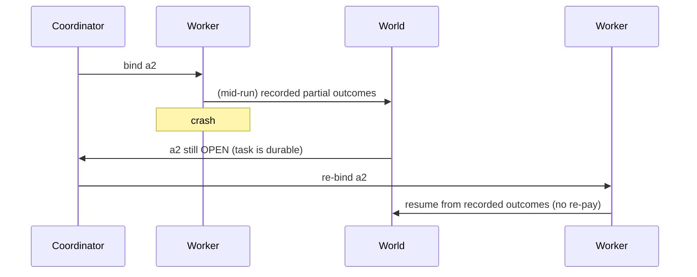

### 13.3 Follow-up question (continuity)

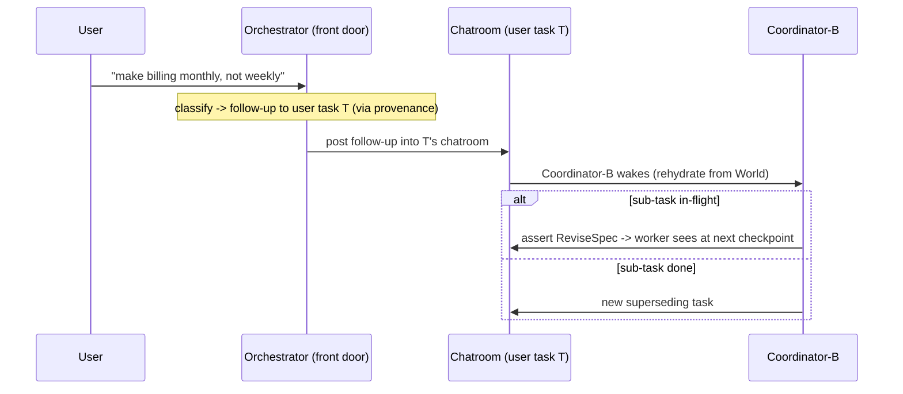

### 13.4 Code task: sandbox → ProposedDiff → merge

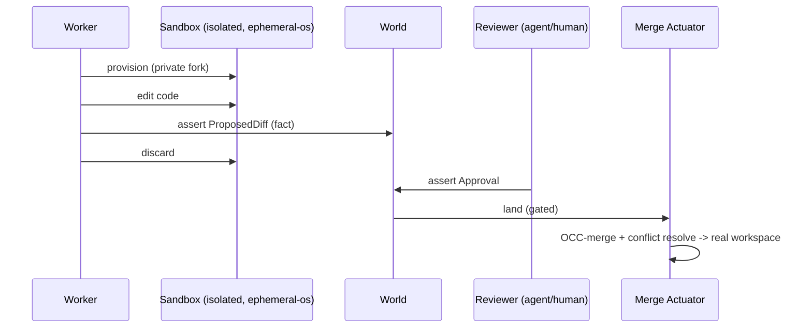

### 13.5 Background finding → task

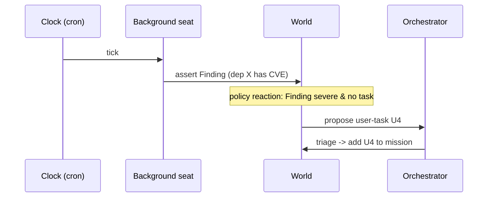

---

## 14. Lessons adopted from zouk

zouk (`ZaynJarvis/zouk`) is a production Slack-for-human+AI-teams. It independently validates several of our choices and hands us ready-made patterns. It is **addressed/message-based** (the model our fact-space critiques), which makes its strengths and gaps both instructive.

| Area | zouk does | We adopt / improve |
|---|---|---|
| **Seat/occupant** | persistent\|ephemeral lifecycle; live-idle vs cached-idle; "idle is not a status" | Adopt verbatim as warm/cold reactivation. Validates §9. |
| **Single-writer** | their #1 bug (stale writer overwrites correct state); fix = current-owner tracking, stop→start reset, reconcile from owner | Adopt as the load-bearing seat invariant (§8.1). |
| **Delivery** | server routes WHO wakes (relevance), agent decides WHETHER to reply; over-inclusion bias | Adopt as Scheduler admission + agent restraint (§11.1). |
| **Relevance router** | directed ∪ involved ∪ active (sliding 20-round window); scale threshold (<4 → all) | Adopt as scoped delivery; recency-as-relevance, no history scan. |
| **Scope isolation** | channel-scope ≠ thread-scope windows; in-memory cache, persisted = source of truth; LRU/TTL; restart rebuild | Adopt as scoped-World eviction/hydration contract; mirrors World-from-Log. |
| **Task model** | message↔task duality; claim-based ownership; claim-fail → move on | **Diverge:** claim is a pull pattern (D1). We push-assign; one-owner by construction; worker reports state via one tool (§5.2). |
| **Gates** | canRead ≠ subscribed ≠ owning-runtime | Adopt as capability/visibility/delivery separation. |
| **Restraint** | prompt tells agents: stay silent if nothing to do, claim before work | **Partial:** adopt "stay silent if nothing to act on"; "claim before work" is N/A — our workers are push-assigned, never self-select. |
| **Heterogeneous runtime** | don't treat "process exited" as idle | Adopt as occupant-runtime rule. |
| **Memory** | sessionId in-memory only → daemon restart = amnesia; continuity via external store | **Improve:** durable World + rehydrate-from-facts is strictly stronger. |
| **Coordination** | addressed (channels, mentions, owning-daemon delivery); no joins/absence/provenance | **Improve:** stigmergic fact-space gives joins, absence, and a `why()` trace. |

Net: zouk proves seat/occupant, single-writer-ownership, and scope-isolation work in production, and gives us a concrete relevance router. Its two gaps — no externalized durable World, addressed-not-content-addressed — are exactly the axes our design bets on.

---

## 15. Distilling existing systems (Arbor)

The test of "generic": can the substrate express a real autonomous system without new code? **Yes — map its facets onto the Domain Model seams (§4.4) plus the substrate.** Verified end-to-end against **Arbor** (RUC-NLPIR, an autonomous ML-research agent):

| Facet of the target system | Substrate / seam | Arbor's value |
|---|---|---|
| roles / agents | Roles (§3) | Coordinator + Executor |
| domain structure | Domain Model schema + shape (seams 1–2) | Idea Tree (tree of IdeaNodes) |
| loop or pipeline | standing coordinator loop (§5.3) / Task DAG | the "arbor cycle" (prompt) |
| execution / isolation | Execution plane (§7) + seam 8 | isolated git worktree |
| evaluation / selection | comparator (seam 4) + prompt | scalar dev-signal score |
| promotion / acceptance | `shouldPromote` + Merge Actuator (seam 4, §7.2) | held-out test gate → merge to trunk |
| memory / learning | rollup (seam 6) | insight backprop up the ancestors |
| what it reads each step | Context Projector (#18, seam 5) | `constraints` projection of the tree |
| termination | Arbiter / Goal (§8) | max-cycles / convergence plateau |

**What Arbor confirmed about our machinery** (we keep it — we didn't invent it):
- the loop is a **persistent ReAct agent**, not a coded state machine (so §5.3 needs no round/barrier primitive);
- the **durable-store-vs-disposable-context split is the linchpin** — its on-disk tree = our World; its compacted message history = our Context Projector + Compactor;
- **ephemeral workers via an await-all barrier over isolated sandboxes** (`asyncio.gather` + git worktrees);
- a **fire-and-forget event bus for observability only**, decoupled from control flow = our Console.

**What Arbor hard-codes that we keep pluggable** — exactly the four Domain Model seams: node **schema**, **comparator** (one scalar), **sandbox/artifact** (git), **cycle** (research prompt). Lifting those four into data is the whole difference between a generic substrate and Arbor's research-pipeline-with-adapter.

**The distillation recipe** (any system → our model). Identify its: (1) roles, (2) domain structure, (3) loop/pipeline, (4) execution, (5) evaluation, (6) promotion, (7) memory, (8) per-step context, + termination. If all map to a Role + a Domain Model + the substrate, it is expressible with **zero new primitives** — only a Domain Model declared as data.

---

## 16. Scorecard, phasing, open decisions

### Scorecard (with ephemeral-os as the execution substrate)

| Axis | Score | Note |
|---|---|---|
| Simplicity | **9** | minimal components; sandbox cost is opt-in; merge is the exception not the rule |
| Extensibility | **10** | content-addressed facts; new consumer = new reaction (zero producer change); migration-as-merge; pluggable kernel policies |
| Customizability | **10** | roles + workflows + governance are runtime data; mode-b safe to ungate because sandboxes discard by default |
| Novelty | **8** | primitives are proven (Orleans / blackboard / CALM / Temporal); the synthesis + stigmergy-over-agent-FS is fresh. The win is coherence, not invention. |

### Phasing

| Phase | Goal | Components |
|---|---|---|
| **v0** | prove the loop | 1, 4, 6, 8, 9, 10, 11, 13; brute-force matching; monotone-only; mode-a + sandbox `none` |
| **v1** | make it real | 2 (incremental), 5, 12, 14 mode-b, 15, 16, 17, 18; register/lattice topics + Domain Model seams |
| **v2** | 24/7 + scale | 7 (compaction); TMS retraction; schema versioning; multi-host |

Critical-path risk concentrates in **2 (Materializer)** and **14/16 (mode-b + Merge Actuator)**; everything else is reuse + thin facts-and-kernel.

### Open decisions

| # | Decision | Lean |
|---|---|---|
| O1 | Spine admit: rule-based vs short-LLM triage | rule-based + spawn reasoner for real judgment (avoid head-of-line) |
| O2 | Coordinator lifetime under bursts | spawn-per-domain, die-on-quiescence (crisp one-owner) |
| O3 | Follow-up classification | how the orchestrator decides follow-up-to-T vs new intent; ambiguous → ask vs default-new (lean: default-new unless it clearly references/contradicts an active task) |
| O4 | Background finding → task | propose-and-triage (not auto) for anything that spends real budget |
| O5 | Absence semantics in v0 | quiescence-gated only; defer general stratified absence |
| O6 | Mode-b authoring surface | constrained workflow DSL, not arbitrary code |
```
