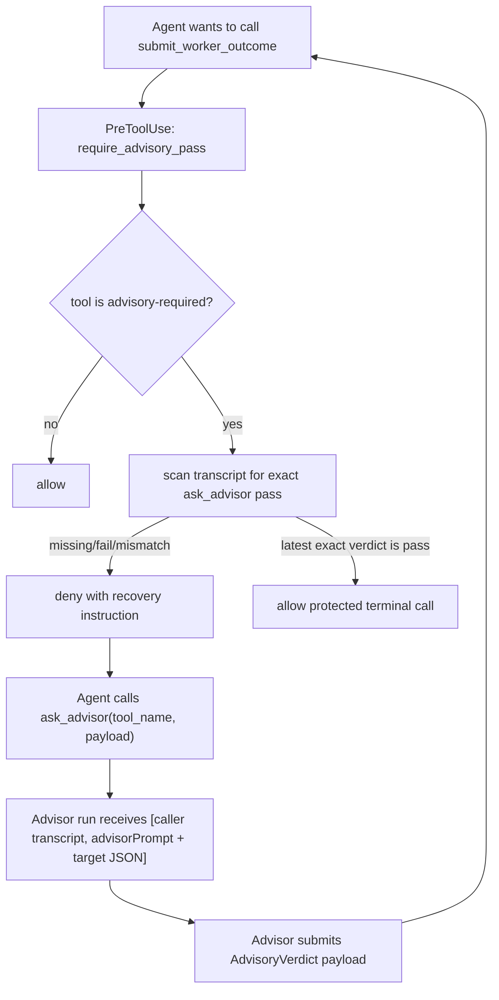

# EOS Agent Core Rust to TypeScript Migration - Phase 04.8 Advisory Pass Gate

Status: Proposed
Date: 2026-06-11
Owner: eos-agent-core
Depends on: Phase 04.5 (agent runtime), Phase 04 (tool framework)

## 1. Intent

Finish the `ask_advisor` mechanism so advisory approval is an enforced
tool-contract property, not only profile prose.

This phase adds:

- `ToolDefinition.isAdvisoryRequired`,
- `ToolDefinition.advisorPrompt` (in-process camelCase; serialized hook
  payloads use `advisor_prompt`),
- an exact advisor verdict contract,
- a universal `PreToolUse` hook named `require_advisory_pass`,
- an `ask_advisor` prompt shape that passes the caller transcript and the
  exact target tool name plus payload as two ordered user messages,
- and the file rename
  `tools/submission/submit_main_agent_outcome.ts` ->
  `tools/submission/submit_main_outcome.ts`.

Only these terminal tools require advisory approval in this phase:

| Tool | Requires advisory | Reason |
| --- | --- | --- |
| `submit_main_outcome` | yes | Main-run closure should be reviewed before final completion. |
| `submit_planner_outcome` | yes | Planner handoff affects downstream work shape. |
| `submit_worker_outcome` | yes | Worker completion affects retry, continuation, and parent closure. |
| `submit_advisor_outcome` | no | The advisor's own terminal output is the advisory verdict source. |
| `submit_subagent_outcome` | no | Generic subagents remain lightweight unless a later phase marks a specific terminal as reviewed. |

## 2. Current Evidence

Live source currently has the start of the mechanism but no enforced pass:

| Surface | Current behavior |
| --- | --- |
| `packages/tool/src/tools/agent/ask-advisor.ts` | `ask_advisor` input is `{ tool_name: string, payload?: JsonObject }`; it starts the profile named `advisor`, passes `[callerTranscript, "Read the transcript and verify if the caller submitted the payload correctly."]`, waits for the advisor run, and returns the advisor submission. |
| `packages/tool/src/contract.ts` | `ToolDefinition` has `isTerminal`, `isBatchExecutionForbidden`, and `availableInIsolatedWorkspace`; no advisory metadata exists. |
| `packages/tool/src/define.ts` | `defineTool` centralizes defaults, so advisory validation belongs here. |
| `packages/tool/src/tools/submission/` | The five terminal definitions are split, but main currently lives in `submit_main_agent_outcome.ts` while its wire name is already `submit_main_outcome`. |
| Hook payloads | Hooks receive serialized call/run facts and runtime snapshots, but not a tool's advisory requirement yet. |

## 3. Design Decisions

1. **Advisory requirement belongs to the tool definition.** Profiles choose
   tools; tools state policy. Profile prose may remind the model to call
   `ask_advisor`, but the guard reads the actual selected `ToolDefinition`
   metadata.

2. **Use repo naming boundaries.** `ToolDefinition` and `ToolDefinitionInit`
   are in-process TypeScript contracts, so the property is
   `advisorPrompt?: string`, not `advisor_prompt`. The command-hook payload is
   serialized JSON and uses `advisor_prompt`.

3. **Required means prompt-required.** `defineTool` must reject
   `isAdvisoryRequired: true` unless `advisorPrompt?.trim()` is non-empty.
   It should also reject an `advisorPrompt` on tools where
   `isAdvisoryRequired` is false, to avoid dead policy text.

4. **`ask_advisor` remains a tool.** Hooks never launch advisors and never
   ask questions. The model must explicitly call `ask_advisor`; the prehook
   only verifies that an exact pass already exists before the protected tool
   executes.

5. **The pass is exact.** A protected call is allowed only when the same run's
   transcript contains an earlier `ask_advisor` result whose advisor verdict is
   `pass`, with the same target `tool_name` and a canonical deep-equal target
   payload.

6. **Latest matching verdict wins.** If the transcript contains multiple
   advisor answers for the same exact target tool and payload, the latest
   matching advisor result before the protected call is authoritative. A later
   `fail` invalidates an earlier `pass`.

7. **The universal hook is data-driven.** The hook is registered once with no
   matcher. It allows calls whose hook payload says advisory is not required,
   and gates calls whose payload says advisory is required.

8. **The hook receives snapshots, not live objects.** The script cannot import
   `ToolDefinition` instances or call runtime services. The runtime/toolset
   scans selected definitions and serializes the current call's advisory facts
   into the hook payload.

## 4. Tool Definition Schema

`ToolDefinitionInit` grows two optional fields:

```ts
export interface ToolDefinitionInit<I> {
  name: string;
  description: string;
  input: z.ZodType<I>;
  isTerminal?: boolean;
  isBatchExecutionForbidden?: boolean;
  availableInIsolatedWorkspace?: boolean;
  isAdvisoryRequired?: boolean;
  advisorPrompt?: string;
  execute: (input: I, ctx: ToolCallContext) => Promise<ToolOutcome>;
}
```

`ToolDefinition` stores the normalized policy:

```ts
export interface ToolDefinition<I = unknown> {
  readonly name: ToolName;
  readonly description: string;
  readonly input: z.ZodType<I>;
  readonly isTerminal: boolean;
  readonly isBatchExecutionForbidden: boolean;
  readonly availableInIsolatedWorkspace: boolean;
  readonly isAdvisoryRequired: boolean;
  readonly advisorPrompt?: string;
  readonly spec: ToolSpec;
  execute(input: I, ctx: ToolCallContext): Promise<ToolOutcome>;
}
```

`defineTool` is the only validation site:

```ts
const isAdvisoryRequired = init.isAdvisoryRequired ?? false;
const advisorPrompt = init.advisorPrompt?.trim();

if (isAdvisoryRequired && !advisorPrompt) {
  throw new Error(`tool ${name} requires a non-empty advisorPrompt`);
}
if (!isAdvisoryRequired && advisorPrompt !== undefined) {
  throw new Error(`tool ${name} has advisorPrompt without isAdvisoryRequired`);
}
```

`ToolSpec` does not gain these fields. The model sees the normal tool schema;
the guard sees advisory policy through the hook payload.

## 5. Submission Tool Changes

Rename the main submission module and function:

| Before | After |
| --- | --- |
| `submit_main_agent_outcome.ts` | `submit_main_outcome.ts` |
| `submitMainAgentOutcomeTool()` | `submitMainOutcomeTool()` |

The wire tool name remains `submit_main_outcome`.

Set advisory metadata only on the three protected terminals:

```ts
export function submitMainOutcomeTool(): ToolDefinition {
  return defineSubmissionTool({
    name: "submit_main_outcome",
    description: "...",
    isAdvisoryRequired: true,
    advisorPrompt:
      "Review whether the main agent's terminal submission faithfully completes the user's goal.",
  });
}

export function submitPlannerOutcomeTool(): ToolDefinition {
  return defineSubmissionTool({
    name: "submit_planner_outcome",
    description: "...",
    isAdvisoryRequired: true,
    advisorPrompt:
      "Review whether the planner's terminal submission is coherent, complete, and safe to hand off.",
  });
}

export function submitWorkerOutcomeTool(): ToolDefinition {
  return defineSubmissionTool({
    name: "submit_worker_outcome",
    description: "...",
    isAdvisoryRequired: true,
    advisorPrompt:
      "Review whether the worker's terminal submission accurately reports the completed work and remaining risk.",
  });
}
```

`defineSubmissionTool` should accept these two advisory fields and forward
them to `defineTool`. `submit_advisor_outcome` and `submit_subagent_outcome`
leave both fields absent.

## 6. Advisory Registry And Hook Facts

### Requirement

The universal `require_advisory_pass` command hook must know whether the
current tool requires advisory approval. It must not import TypeScript source
or reconstruct the runtime's selected tools from disk.

### Design

The scan happens in TypeScript, where definitions are live values:

1. `buildToolExecutor` receives the profile-selected `definitions`.
2. It scans them once:

   ```ts
   const advisoryByTool = new Map(
     definitions
       .filter((definition) => definition.isAdvisoryRequired)
       .map((definition) => [
         definition.name,
         {
           advisor_prompt: definition.advisorPrompt,
         },
       ]),
   );
   ```

3. `bindTool` already closes over the current `definition`; when building the
   `HookPayload`, it adds the current call's fact:

   ```ts
   advisory_requirement:
     advisoryByTool.get(definition.name) === undefined
       ? { required: false }
       : {
           required: true,
           advisor_prompt: advisoryByTool.get(definition.name)?.advisor_prompt,
         }
   ```

4. The command hook uses `payload.advisory_requirement.required` as the only
   gate selector. No matcher is needed.

The serialized hook payload addition:

```ts
export interface HookAdvisoryRequirement {
  required: boolean;
  advisor_prompt?: string;
}

export interface HookPayload {
  event: HookEvent;
  tool_name: string;
  tool_input: JsonObject;
  tool_use_id: ToolUseId;
  run: AgentRunSnapshot;
  advisory_requirement?: HookAdvisoryRequirement;
  background_sessions?: readonly HookBackgroundSession[];
  tool_response?: string;
  error?: string;
}
```

`require_advisory_pass` treats a missing `advisory_requirement` as
`{ required: false }` for backward compatibility.

### Profile validation

If a profile selects any advisory-required tool, it must also select
`ask_advisor` as an ordinary allowed tool unless the profile kind is
`advisor`. Otherwise the run can be started in an impossible state: the
prehook will deny the terminal tool, but the model cannot call the only tool
that can produce a pass.

Validation belongs after profile selection, where selected `ToolDefinition`
objects are known:

```ts
const needsAdvisor = definitions.some((definition) => definition.isAdvisoryRequired);
const hasAskAdvisor = definitions.some((definition) => definition.name === "ask_advisor");
if (needsAdvisor && !hasAskAdvisor && profile.agent_kind !== "advisor") {
  throw new Error(
    `profile ${profile.name} selects advisory-required tools but does not allow ask_advisor`,
  );
}
```

## 7. Advisor Prompt And Initial Messages

`ask_advisor` must no longer use a generic instruction. It must look up the
target tool's `advisorPrompt` and pass exactly two user messages to the
advisor run.

Target message contract:

```ts
const target = {
  tool_name: input.tool_name,
  payload: input.payload ?? {},
};

const reviewPrompt =
  `${advisorPrompt} Please verify against the below tool name + payload\n` +
  canonicalJson(target);

const advisor = calls.startRun({
  agentName: ADVISOR_AGENT_NAME,
  initialMessages: [
    userText(callerTranscript),
    userText(reviewPrompt),
  ],
  signal: ctx.signal,
});
```

The required assertion is exact:

```ts
expect(advisorRequest.messages).toEqual([
  userMessage(callerTranscript),
  userMessage(
    `${advisorPrompt} Please verify against the below tool name + payload\n` +
      canonicalJson({
        tool_name: "submit_worker_outcome",
        payload: { summary: "done" },
      }),
  ),
]);
```

This replaces the current message:

```ts
"Read the transcript and verify if the caller submitted the payload correctly."
```

`ask_advisor` needs a lookup dependency:

```ts
interface AdvisoryRequirementLookup {
  advisorPromptFor(toolName: string): string | undefined;
}
```

`agentTools(...)` receives that lookup from the runtime. The runtime builds it
from available definitions before binding `ask_advisor`, using the same
advisory metadata that powers the prehook facts.

## 8. Advisory Verdict Contract

The advisor still submits through `submit_advisor_outcome`, so the tool result
returned to the caller is the advisor terminal submission:

```ts
{
  summary: string;
  payload?: JsonObject;
}
```

For enforced advisory passes, `payload` must match:

```ts
export const AdvisoryVerdictSchema = z.object({
  verdict: z.enum(["pass", "fail"]),
  tool_name: z.string().min(1),
  payload: JsonObjectSchema,
  reason: z.string().min(1),
});
```

An exact advisory pass is:

```ts
verdict.payload.verdict === "pass"
verdict.payload.tool_name === payload.tool_name
canonicalJson(verdict.payload.payload) === canonicalJson(payload.tool_input)
```

The hook must reject all of these:

| Transcript state | Decision |
| --- | --- |
| No prior `ask_advisor` call for this tool + payload | deny |
| `ask_advisor` result is an error | deny |
| Advisor result has no structured `payload` | deny |
| Advisor payload fails `AdvisoryVerdictSchema` | deny |
| Advisor verdict is `fail` | deny |
| Advisor verdict is `pass` for a different `tool_name` | deny |
| Advisor verdict is `pass` for same tool but different payload | deny |
| Latest exact matching verdict is `pass` | allow |

`canonicalJson` must be stable over object key order:

```ts
function canonicalJson(value: JsonValue): string {
  if (Array.isArray(value)) return `[${value.map(canonicalJson).join(",")}]`;
  if (value && typeof value === "object") {
    return `{${Object.keys(value)
      .sort()
      .map((key) => `${JSON.stringify(key)}:${canonicalJson(value[key])}`)
      .join(",")}}`;
  }
  return JSON.stringify(value);
}
```

## 9. `require_advisory_pass` Hook

Add:

```text
.eos-agents/hooks/require-advisory-pass.cjs
```

Register it once as a universal prehook:

```json
{
  "event": "PreToolUse",
  "hooks": [
    {
      "type": "command",
      "command": "node .eos-agents/hooks/require-advisory-pass.cjs"
    }
  ]
}
```

The script algorithm:

1. Read `HookPayload` from stdin.
2. If `payload.event !== "PreToolUse"`, allow.
3. If `payload.advisory_requirement?.required !== true`, allow.
4. Read `payload.run.transcript_path`.
5. Parse JSONL transcript lines in order.
6. Find assistant messages with `tool_use` blocks named `ask_advisor`.
7. Keep only `ask_advisor` calls whose input exactly matches:

   ```ts
   {
     tool_name: payload.tool_name,
     payload: payload.tool_input,
   }
   ```

8. Find later `tool_result` lines with matching `tool_use_id`.
9. Parse the advisor result as a terminal submission and validate
   `content.payload` with `AdvisoryVerdictSchema`.
10. Keep the latest exact matching verdict.
11. Allow only if the latest exact matching verdict is `pass`; otherwise deny
    with a model-facing reason naming the target tool and whether the problem
    was missing, failed, malformed, or `fail`.

Example denial:

```json
{
  "decision": "deny",
  "reason": "submit_worker_outcome requires an advisor pass for this exact payload. Call ask_advisor with tool_name=\"submit_worker_outcome\" and the exact payload you intend to submit."
}
```

## 10. Workflow



## 11. Implementation Plan

1. Rename `submit_main_agent_outcome.ts` to `submit_main_outcome.ts`; rename
   exports/imports to `submitMainOutcomeTool`.
2. Add `isAdvisoryRequired` and `advisorPrompt` to `ToolDefinitionInit`,
   `ToolDefinition`, and `defineTool` validation.
3. Thread advisory metadata through `defineSubmissionTool`.
4. Mark only `submit_main_outcome`, `submit_planner_outcome`, and
   `submit_worker_outcome` as advisory-required.
5. Build an advisory requirement registry from selected definitions and expose
   the current tool's advisory facts on `HookPayload`.
6. Add runtime/profile validation that advisory-required selected tools require
   `ask_advisor` to be selected for non-advisor profiles.
7. Update `askAdvisorTool` to use an `advisorPromptFor(toolName)` lookup and
   exact two-message prompt shape.
8. Add `.eos-agents/hooks/require-advisory-pass.cjs` and register it as a
   universal prehook in `.eos-agents/hooks.json`, alongside the existing
   `no-open-background-sessions` hook.
9. Add unit tests for `defineTool`, advisory hook facts, `ask_advisor` initial
   messages, verdict parsing, and profile validation.
10. Add an e2e test where a protected terminal call is denied without a pass,
    a wrong-payload pass is denied, an exact pass allows the terminal call, and
    a later fail overrides an earlier pass.

## 12. Acceptance Criteria

| ID | Criterion | Verification |
| --- | --- | --- |
| A1 | `ToolDefinition` exposes `isAdvisoryRequired` and optional `advisorPrompt`; `defineTool` rejects missing/empty prompts when required. | `packages/tool/tests/define.test.ts` |
| A2 | Only `submit_main_outcome`, `submit_planner_outcome`, and `submit_worker_outcome` set advisory metadata. | `packages/tool/tests/families.test.ts` |
| A3 | `submit_main_agent_outcome.ts` is gone; `submit_main_outcome.ts` owns the main terminal factory. | strict filename scan and TypeScript imports |
| A4 | Hook payloads carry current-tool advisory facts derived from selected definitions. | `packages/tool/tests/pipeline.test.ts` |
| A5 | `ask_advisor` starts the advisor with exactly `[caller transcript, advisorPrompt + target tool JSON]`. | `packages/agent-runtime/tests/runtime.test.ts` advisor ask case |
| A6 | `require_advisory_pass` allows non-required tools and denies required tools without an exact pass. | hook script unit/e2e |
| A7 | Wrong tool, wrong payload, malformed advisor output, and fail verdict all deny. | hook script case table |
| A8 | Latest exact matching pass allows the protected terminal call. | deterministic `agent-runtime/e2e` |
| A9 | A profile that selects an advisory-required tool without `ask_advisor` fails startup, except advisor profiles. | `agent-profile` or runtime validation test |
| A10 | Full local gate remains green. | `pnpm run typecheck`, `pnpm run lint`, `pnpm run test`, focused e2e |

## 13. Open Questions

1. Should `ask_advisor` keep accepting missing `payload` for compatibility?
   This spec keeps the field optional at the schema level, but the prehook only
   recognizes an exact pass when the `ask_advisor` payload matches the protected
   tool input. Missing payload therefore cannot satisfy an advisory-required
   terminal call.
2. Should the advisor prompt text live beside each tool definition, or should a
   later profile layer be allowed to override it? This phase keeps it on the
   tool definition only, because the requirement is tool-owned.
3. Should advisory verdicts be persisted somewhere outside the transcript?
   This phase says no. The transcript already contains both `ask_advisor` input
   and its tool result, and the hook is a deterministic transcript scanner.
