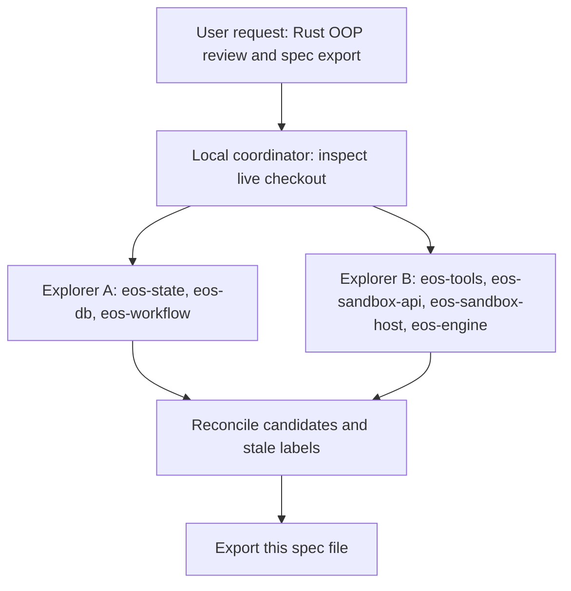
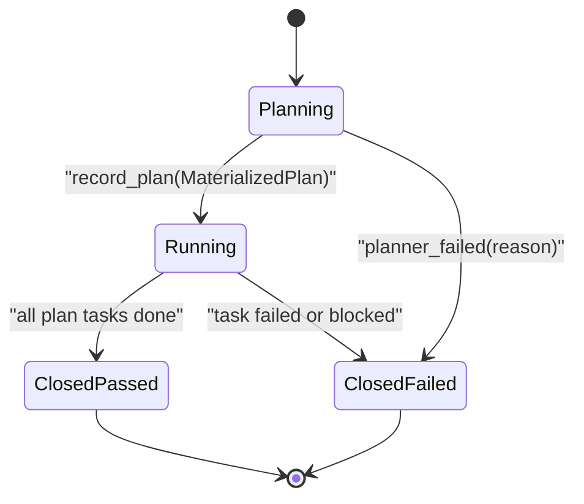
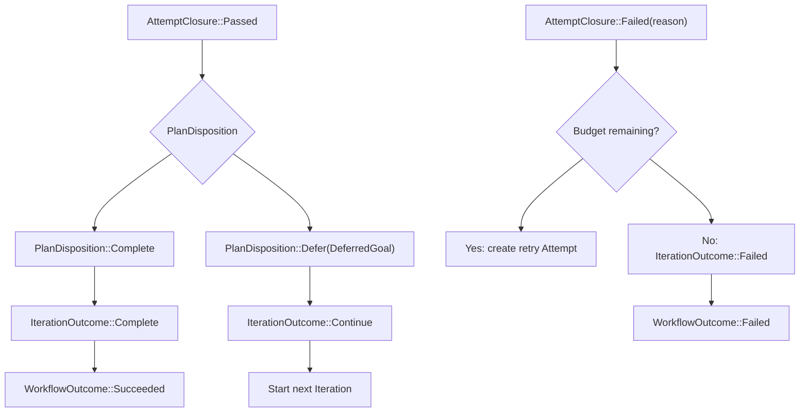

# SPEC: agent-core Type-Driven Rust OOP Review

Status: DRAFT
Date: 2026-06-05
Owner workspace: `agent-core/`
Scope: `agent-core/crates/eos-state`, `eos-db`, `eos-workflow`,
`eos-tools`, `eos-engine`, `eos-sandbox-api`, `eos-sandbox-host`,
and `eos-llm-client`.

This spec exports the full review discussion about what should move toward
idiomatic Rust object-oriented design. In this repo, "OOP" does not mean class
hierarchies. It means:

- narrow traits only at real runtime extension boundaries;
- enums for closed state machines and known variants;
- structs and newtypes for domain entities, values, ids, budgets, and limits;
- private members plus constructors/transition methods where invariants matter;
- raw wire/database DTOs kept honest at the boundary, with typed projections for
  domain code.

The plan below is intentionally more domain/type-driven than
`docs/plans/agent-core-idiomatic-cleanup_SPEC.md`, which records smaller
net-negative cleanup items. Do not merge the two documents without reconciling
their different goals.

Implementation notes are tracked in the progress table below; the original spec
export was source-free, and the later implementation pass updated the Rust
source contracts in `agent-core/`.

---

## 1. Review Workflow

The review used a local coordinator plus two read-only fan-out checks. The
subagents verified the workflow/state and tools/sandbox slices independently;
their stale-candidate checks are folded into the tables below.



Current working-tree caveat: this repo is edited by parallel agents. The line
anchors below were read from the live checkout on 2026-06-05 and may drift.
Anchor on the symbol if a line number moves.

Implementation caveat: sections labeled "Current evidence" below are the
original review baseline unless a progress/status table says the phase is now
complete. Use the Rust source as the live contract after implementation.

Refresh note: a later live-check found that some review items had already
landed in the checkout. In particular, `ContextScope` is already role-keyed,
`NO_OUTCOME` is already centralized, the dead `PluginKind::as_wire` encoder is
gone, the duplicated `counted_loss` free function is gone, the sqlx store
re-exports are already `pub(crate)`, and the dead streaming/notification-state
cleanups are no longer present in source. Those are recorded here as completed
or stale, not as remaining implementation work.

---

## 2. Executive Result

The codebase already has several good Rust OOP patterns. Do not add replacement
abstractions where these seams already exist.

| Area | Existing pattern to keep | Evidence |
|---|---|---|
| Tool dispatch | Object-safe `ToolExecutor` behind `Arc<dyn ToolExecutor>` for heterogeneous tool storage | `agent-core/crates/eos-tools/src/runtime/executor.rs:26`, `:52` |
| Tool names | Closed built-in `ToolName` plus dynamic `ToolKey` for plugin tools | `agent-core/crates/eos-tools/src/core/name.rs:24`, `:145` |
| LLM providers | Provider-neutral `LlmClient` trait and boxed stream | `agent-core/crates/eos-llm-client/src/client.rs:31` |
| Sandbox transport | `SandboxTransport` trait in API crate, implemented by host `DaemonClient` | `agent-core/crates/eos-sandbox-api/src/transport.rs:23`, `agent-core/crates/eos-sandbox-host/src/daemon_client.rs:481` |
| Daemon ops | Typed `DaemonOp` enum pinned to exact wire strings | `agent-core/crates/eos-sandbox-api/src/ops.rs:17`, `:74` |
| Provider boundary | Sealed `ProviderAdapter` trait for real provider polymorphism | `agent-core/crates/eos-sandbox-host/src/provider.rs:294` |
| Closed provider helper | `ContextPreparer` is an enum, not a premature trait | `agent-core/crates/eos-sandbox-host/src/provider.rs:229` |
| Persisted task status | `TaskStatus` and `TaskRole` are already enums | `agent-core/crates/eos-state/src/task.rs:17`, `:44` |

The strongest conversion candidates are not new base classes. They are places
where independent flags, optional bags, or raw numbers should become domain
types.

---

## 3. Diff Table

| Priority | Current shape | Target Rust shape | Main effect | Primary files |
|---|---|---|---|---|
| P0 | `Attempt` has independent `stage`, `status`, `fail_reason`, `closed_at`, task-id vectors | `AttemptState` and `AttemptClosure` encode valid lifecycle combinations | Failed attempts require a reason by type; passed attempts cannot carry one | `eos-state/src/attempt.rs`, `eos-state/src/store.rs`, `eos-db/src/repositories/attempt.rs`, `eos-workflow/src/attempt/*` |
| P0 | `IterationClosed { succeeded: bool, deferred_goal: Option<String> }`; `close_workflow(..., succeeded: bool)` | `IterationOutcome` and `WorkflowOutcome` enums | Removes bool-plus-option ambiguity | `eos-workflow/src/iteration/mod.rs`, `eos-workflow/src/lifecycle.rs`, `eos-state/src/iteration.rs`, `eos-state/src/workflow.rs` |
| P0 | `attempt_budget: i64` and `default_attempt_budget: i64` | `AttemptBudget` value object backed by non-zero unsigned count | No negative/zero retry budgets at runtime | `eos-state/src/iteration.rs`, `eos-workflow/src/ids.rs`, `eos-db/src/repositories/iteration.rs` |
| P0 | `PlannerKind` plus `deferred_goal_for_next_iteration: Option<String>` | `PlanDisposition::{Complete, Defer(DeferredGoal)}` | Removes kind/option mismatch checks | `eos-tools/src/ports/mod.rs`, `eos-state/src/submissions.rs`, `eos-tools/src/tools/submission/planner/*`, `eos-workflow/src/attempt/orchestrator.rs` |
| P1 | Planner-local ids are plain `String`; persisted ids are `TaskId` | `PlanNodeId` for planner-local DAG ids, converted once to `TaskId` | Prevents accidental mixing of local plan ids and persisted task ids | `eos-tools/src/ports/mod.rs`, `eos-workflow/src/ids.rs`, `eos-workflow/src/attempt/plan_dag.rs` |
| Done | `ContextScope` formerly had `role` plus optional ids | Current checkout already has `ContextScope::{Planner, Generator, Reducer}` | Keep this enum shape; no remaining source work except regression protection | `eos-workflow/src/context/scope.rs`, `eos-workflow/src/context/engine.rs` |
| P1 | `AgentLaunch` is a role plus optional `attempt_id`, `workflow_id`, `agent_def`, `task_guidance`, `skill` | Role-specific launch enum/structs with required members per variant | Runtime no longer handles impossible missing launch data | `eos-workflow/src/attempt/launch.rs`, `eos-runtime/src/agent_runner.rs` |
| P2 | `DagStatus` is three booleans: `all_quiescent`, `all_done`, `any_failed_or_blocked` | `DagResolution::{Running, Passed, FailedOrBlocked}` or equivalent closed enum | Removes scheduler boolean-combination reasoning | `eos-workflow/src/attempt/plan_dag.rs`, `eos-workflow/src/attempt/run_stage.rs` |
| P2 | `ExecCommandResult.status: String`; repeated string checks for `running`, `error`, `timed_out` | Keep raw wire string, add internal `CommandStatusView`/helpers | Centralizes branching without breaking daemon wire vocabulary | `eos-sandbox-api/src/models/command.rs`, `eos-sandbox-api/src/tool_api/parse.rs`, `eos-tools/src/tools/sandbox/*` |
| P2 | `QueryContext` exposes many mutable public members | Private loop state plus narrow mutation methods | Keeps loop invariants inside engine | `eos-engine/src/query/context.rs`, `eos-engine/src/query/loop_.rs`, `eos-engine/src/tool_call/dispatch.rs` |
| P2 | `DaemonClient` owns endpoint resolution, recovery, TCP cache, envelope send, plugin package path | Keep public `DaemonClient`; split private modules/responsibilities | Smaller host modules without adding a new public transport seam | `eos-sandbox-host/src/daemon_client.rs`, `eos-sandbox-host/src/daemon_client/*`, `eos-sandbox-host/src/plugin_package.rs` |

---

## 4. Naming Conventions

Use Rust/domain names, not Java/class/process vocabulary.

| Current or tempting name | Preferred name | Reason |
|---|---|---|
| `class` | `type`, `struct`, `enum`, `trait` | Rust has no classes; say the exact construct. |
| `field bag` | `record`, `payload`, `envelope`, `snapshot` | Distinguishes DTO shape from domain behavior. |
| `step` | `state`, `phase`, `transition`, `outcome` | Lifecycle code should expose state machines, not loose steps. |
| `process` | `lifecycle`, `run`, `scheduler`, `worker` | Reserve process for OS process/PTY semantics. |
| `PlannerKind` | `PlanDisposition` | The type answers "what should happen after this plan?" |
| `deferred_goal_for_next_iteration: Option<String>` in domain code | `PlanDisposition::Defer(DeferredGoal)` | Couples deferral with the required goal. |
| `succeeded: bool` | `IterationOutcome` / `WorkflowOutcome` | Bool hides why and what terminal state is intended. |
| `attempt_budget: i64` | `AttemptBudget` | Domain count, not arbitrary integer. |
| `max_concurrent_task_runs: usize` | `RunConcurrency` or `TaskRunLimit` | Domain limit, not arbitrary integer. Current field name is `max_concurrent_task_runs`, not `max_concurrent_agent_runs`. |
| `DaemonSandboxTransport` | Do not use | Stale terminology; the concrete host type is `DaemonClient`. |

Method naming should follow Rust conventions:

- use `iter`, `iter_mut`, `into_iter` for iteration;
- use `as_`, `to_`, `into_` for conversions;
- avoid `get_` prefixes for simple accessors;
- use `try_` when construction or transition can fail;
- keep wire names exactly where serde/database contracts require them.

---

## 5. Resulting Folder Structure

This is the minimal target organization if the full type-driven plan is
implemented. It keeps crate ownership intact and avoids new cross-workspace
back-edges. It is not a mandatory file-splitting plan: keep existing modules
when the implementation remains cohesive, and split only where the type changes
create a real ownership boundary.

```text
agent-core/crates/eos-state/src/
  attempt.rs                    # Attempt entity, AttemptState, AttemptClosure
  iteration.rs                  # Iteration entity, IterationState, IterationOutcome, AttemptBudget
  workflow.rs                   # Workflow entity, WorkflowState, WorkflowOutcome
  plan.rs                       # optional owner for PlanDisposition, PlanNodeId, DeferredGoal
  submissions.rs                # submission DTOs built from typed plan/outcome values
  outcomes.rs                   # ExecutionTaskOutcome and shared outcome projection values
  store.rs                      # narrow Store traits using transition-oriented methods

agent-core/crates/eos-db/src/
  repositories/
    attempt.rs                  # DB row <-> AttemptState mapping; no lifecycle policy
    iteration.rs                # DB row <-> IterationOutcome/Budget mapping
    workflow.rs                 # DB row <-> WorkflowOutcome mapping
    request_task.rs
  rows.rs                       # raw SQL rows remain parse-don't-validate boundary

agent-core/crates/eos-workflow/src/
  attempt/
    mod.rs                      # thin exports
    orchestrator.rs             # attempt transitions and close/retry policy
    plan_dag.rs                 # DAG validation/readiness/blockage
    run_stage.rs                # ready frontier and task scheduling
    launch.rs                   # role launch envelopes
    orchestrator_registry.rs    # open attempt registry
  iteration/
    mod.rs                      # iteration coordinator and outcome handling
  context/
    mod.rs
    scope.rs                    # role-scoped enum, no optional identity bag
    engine.rs
    composer.rs
    section.rs
    xml.rs
  lifecycle.rs                  # workflow lifecycle using WorkflowOutcome
  ids.rs                        # stable id derivation and validated lifecycle config

agent-core/crates/eos-tools/src/
  ports/
    mod.rs                      # current owner of ports; split only if cohesion worsens
    plan.rs                     # optional: PlannerPlan, PlanTask, PlanReducer
    submission.rs               # optional: terminal submission ports and acks
    command.rs                  # optional: command status projection helpers if tool-owned
  tools/
    submission/
      planner/
      generator/
      reducer/
      root/
    sandbox/

agent-core/crates/eos-engine/src/
  query/
    context.rs                  # private loop state and accessors
    loop_.rs
    provider_source.rs
  background/
    command_session.rs          # already typed with BackgroundTaskStatus
    supervisor.rs

agent-core/crates/eos-sandbox-api/src/
  models/
    command.rs                  # raw wire DTO keeps status: String
    common.rs
  tool_api/
    parse.rs
    command_status.rs           # internal parsed view over raw command status
    command.rs

agent-core/crates/eos-sandbox-host/src/
  daemon_client/
    mod.rs                      # public DaemonClient impl surface
    envelope.rs                 # optional: protocol-version stamping and RPC envelope
    endpoint.rs                 # optional: provider/TCP endpoint resolution
    recovery.rs                 # optional: retry/recovery state machine
    tcp.rs
    codec.rs
    shell.rs
  plugin_package.rs             # private cold package install path
  provider.rs
```

The structure is intentionally conservative:

- `eos-state` owns domain DTOs and value objects.
- `eos-db` owns row mapping, not workflow policy.
- `eos-workflow` owns lifecycle policy and scheduling.
- `eos-tools` owns model-facing terminal tool contracts.
- `eos-sandbox-api` owns raw daemon/API contracts.
- `eos-sandbox-host` owns host-side transport implementation details.
- File splits are a cleanup consequence, not a goal. Do not split
  `orchestrator.rs`, `run_stage.rs`, `plan_dag.rs`, `ports/mod.rs`, or
  `daemon_client.rs` only because they are large.

---

## 6. Type Inventory

This section is the Rust type/member inventory. Members should be private when
they guard invariants. Public DTO members may remain public only when they are
pure wire/persisted records and do not imply behavior.

### 6.1 Attempt

```rust
pub struct Attempt {
    id: AttemptId,
    iteration_id: IterationId,
    workflow_id: WorkflowId,
    sequence_no: u32,
    state: AttemptState,
    created_at: UtcDateTime,
    updated_at: UtcDateTime,
}

pub enum AttemptState {
    Planning { planner_task_id: Option<TaskId> },
    Running { plan: MaterializedPlan },
    Closed {
        closure: AttemptClosure,
        plan: Option<MaterializedPlan>,
    },
}

pub enum AttemptClosure {
    Passed {
        outcomes: Vec<ExecutionTaskOutcome>,
        closed_at: UtcDateTime,
    },
    Failed {
        reason: AttemptFailReason,
        outcomes: Vec<ExecutionTaskOutcome>,
        closed_at: UtcDateTime,
    },
}

```

Current evidence:

- `Attempt` currently exposes independent public members at
  `agent-core/crates/eos-state/src/attempt.rs:51`.
- `AttemptStore` currently exposes member-oriented mutations at
  `agent-core/crates/eos-state/src/store.rs:166`.
- `SqlAttemptStore::close` persists `status` and `fail_reason` independently at
  `agent-core/crates/eos-db/src/repositories/attempt.rs:161`.
- `AttemptOrchestrator::close_attempt` rechecks invalid combinations at
  `agent-core/crates/eos-workflow/src/attempt/orchestrator.rs:511`.

Compatibility rule: the database may keep `stage`, `status`, `fail_reason`, and
`closed_at` columns. The repository should map those columns into
`AttemptState`/`AttemptClosure`, so the schema does not have to change in the
same phase.

Do not keep a separate `Attempt.plan` member alongside a plan-bearing
`AttemptState::Running`; that duplicates lifecycle data. Closed attempts may
carry `plan: Option<MaterializedPlan>` because startup/planner failures can
close before a materialized plan exists.

### 6.2 Iteration

```rust
pub struct Iteration {
    id: IterationId,
    workflow_id: WorkflowId,
    sequence_no: u32,
    creation_reason: IterationCreationReason,
    goal: String,
    budget: AttemptBudget,
    attempt_ids: Vec<AttemptId>,
    state: IterationState,
    created_at: UtcDateTime,
    updated_at: UtcDateTime,
}

pub struct AttemptBudget(NonZeroU32);

pub enum IterationState {
    Open,
    Closed(IterationOutcome),
}

pub enum IterationOutcome {
    Complete {
        outcomes: String,
        closed_at: UtcDateTime,
    },
    Continue {
        deferred_goal: DeferredGoal,
        outcomes: String,
        closed_at: UtcDateTime,
    },
    Failed {
        outcomes: String,
        closed_at: UtcDateTime,
    },
    Cancelled {
        reason: String,
        closed_at: UtcDateTime,
    },
}
```

Current evidence:

- `Iteration` currently carries `attempt_budget: i64`, `status`, optional
  deferred goal, optional `closed_at`, and optional `outcomes` at
  `agent-core/crates/eos-state/src/iteration.rs:36`.
- `Iteration::has_budget_remaining` compares `usize as i64` against the raw
  budget at `agent-core/crates/eos-state/src/iteration.rs:78`.
- `WorkflowLifecycleConfig.default_attempt_budget` is raw `i64` at
  `agent-core/crates/eos-workflow/src/ids.rs:7`.
- `IterationClosed` is currently `succeeded: bool` plus `deferred_goal:
  Option<String>` at `agent-core/crates/eos-workflow/src/iteration/mod.rs:16`.

### 6.3 Workflow

```rust
pub struct Workflow {
    id: WorkflowId,
    request_id: RequestId,
    parent_task_id: TaskId,
    goal: String,
    iteration_ids: Vec<IterationId>,
    state: WorkflowState,
    created_at: UtcDateTime,
    updated_at: UtcDateTime,
}

pub enum WorkflowState {
    Open,
    Closed(WorkflowOutcome),
}

pub enum WorkflowOutcome {
    Succeeded {
        outcomes: String,
        closed_at: UtcDateTime,
    },
    Failed {
        outcomes: String,
        closed_at: UtcDateTime,
    },
    Cancelled {
        reason: String,
        closed_at: UtcDateTime,
    },
}
```

Current evidence:

- `Workflow` currently carries independent `status`, `outcomes`, and
  `closed_at` members at `agent-core/crates/eos-state/src/workflow.rs:27`.
- `close_workflow` currently takes `succeeded: bool` and maps it to
  `WorkflowStatus` at `agent-core/crates/eos-workflow/src/lifecycle.rs:215`.

### 6.4 Plan Values

```rust
pub struct PlanNodeId(String);

pub struct DeferredGoal(String);

pub enum PlanDisposition {
    Complete,
    Defer(DeferredGoal),
}

pub struct PlannerPlan {
    attempt_id: AttemptId,
    planner_task_id: TaskId,
    disposition: PlanDisposition,
    tasks: Vec<PlanTask>,
    task_specs: BTreeMap<PlanNodeId, String>,
    reducers: Vec<PlanReducer>,
}

pub struct PlanTask {
    id: PlanNodeId,
    agent_name: AgentName,
    needs: Vec<PlanNodeId>,
}

pub struct PlanReducer {
    id: PlanNodeId,
    needs: Vec<PlanNodeId>,
    prompt: String,
}

pub struct MaterializedPlan {
    planner_task_id: TaskId,
    disposition: PlanDisposition,
    generator_task_ids: Vec<TaskId>,
    reducer_task_ids: Vec<TaskId>,
}
```

Current evidence:

- `PlannerPlan` currently carries `kind: PlannerKind` and
  `deferred_goal_for_next_iteration: Option<String>` at
  `agent-core/crates/eos-tools/src/ports/mod.rs:141`.
- `PlannerKind` is defined in state submissions at
  `agent-core/crates/eos-state/src/submissions.rs:17`.
- `submit_planner_outcome` derives kind from whether deferred goal is present at
  `agent-core/crates/eos-tools/src/tools/submission/planner/submit_planner_outcome.rs:70`.
- `record_plan_submission` revalidates the kind/option pair at
  `agent-core/crates/eos-workflow/src/attempt/orchestrator.rs:320`.
- Planner-local ids are converted into persisted `TaskId` values by helpers at
  `agent-core/crates/eos-workflow/src/ids.rs:20`.

### 6.5 Context Scope

```rust
pub enum ContextScope {
    Planner {
        workflow_id: WorkflowId,
        iteration_id: IterationId,
        attempt_id: AttemptId,
    },
    Generator {
        workflow_id: WorkflowId,
        iteration_id: IterationId,
        attempt_id: AttemptId,
        task_id: TaskId,
    },
    Reducer {
        workflow_id: WorkflowId,
        iteration_id: IterationId,
        attempt_id: AttemptId,
        task_id: TaskId,
    },
}
```

Current evidence:

- The current checkout already has this enum shape at
  `agent-core/crates/eos-workflow/src/context/scope.rs:9`.
- `ContextEngine::build` already destructures the variants and calls
  role-specific helpers at `agent-core/crates/eos-workflow/src/context/engine.rs:57`.
- No `MissingContextField` source symbol remains. Keep this shape as the
  accepted pattern and do not reintroduce a role-plus-optional-id record.

### 6.6 Role Launch

```rust
pub enum RoleLaunch {
    Planner(PlannerLaunch),
    Generator(ExecutionLaunch),
    Reducer(ExecutionLaunch),
}

pub struct PlannerLaunch {
    task_id: TaskId,
    request_id: RequestId,
    workflow_id: WorkflowId,
    iteration_id: IterationId,
    attempt_id: AttemptId,
    agent_name: AgentName,
    agent_def: AgentDefinition,
    context: String,
    skill: Option<String>,
}

pub struct ExecutionLaunch {
    role: ExecutionRole,
    task_id: TaskId,
    request_id: RequestId,
    workflow_id: WorkflowId,
    iteration_id: IterationId,
    attempt_id: AttemptId,
    agent_name: AgentName,
    agent_def: AgentDefinition,
    context: String,
    task_guidance: Option<String>,
    needs: Vec<TaskId>,
    skill: Option<String>,
}
```

Current evidence:

- `AgentLaunch` currently carries optional `attempt_id`, `agent_def`,
  `workflow_id`, `task_guidance`, and `skill` at
  `agent-core/crates/eos-workflow/src/attempt/launch.rs:58`.
- `RuntimeAgentRunner::run` handles missing `agent_def` at runtime at
  `agent-core/crates/eos-runtime/src/agent_runner.rs:76`.
- `AttemptStageAdvancer::build_launch` branches reducer vs generator at
  `agent-core/crates/eos-workflow/src/attempt/run_stage.rs:138`.

If implemented, the type can keep the current external name `AgentLaunch` to
reduce churn. The important part is the role-specific enum shape, not the exact
name. `RoleLaunch` is the naming recommendation if a rename is worth the churn.

### 6.7 DAG Resolution

```rust
pub enum DagResolution {
    Running,
    Passed,
    FailedOrBlocked,
}
```

Current evidence:

- `DagStatus` currently exposes three public booleans at
  `agent-core/crates/eos-workflow/src/attempt/plan_dag.rs:11`.
- `AttemptStageAdvancer::advance_run_stage` interprets the boolean combination
  through nested checks at `agent-core/crates/eos-workflow/src/attempt/run_stage.rs:107`.

This is a smaller version of the same boolean-record smell as
`IterationClosed.succeeded`. If `plan_dag.rs` or `run_stage.rs` is touched for
the attempt-state work, prefer returning a closed enum that directly states what
the scheduler should do next.

### 6.8 Command Status View

```rust
pub struct CommandStatusView<'a> {
    raw: &'a str,
}

pub enum KnownCommandStatus {
    Running,
    Ok,
    Error,
    TimedOut,
}
```

Rules:

- `ExecCommandResult.status` remains `String` because it is a daemon/model-facing
  wire member.
- Branching code should use helpers such as `is_running()`,
  `is_error_status()`, and `is_session_not_found()` instead of repeating raw
  string comparisons.
- Do not introduce a hard public serde enum until the daemon vocabulary is
  stabilized and golden snapshots are updated intentionally.

Current evidence:

- `ExecCommandResult.status` is raw `String` at
  `agent-core/crates/eos-sandbox-api/src/models/command.rs:40`.
- Parser success derives from `"error"` and `"timed_out"` at
  `agent-core/crates/eos-sandbox-api/src/tool_api/parse.rs:379`.
- Tool code checks `"running"` at
  `agent-core/crates/eos-tools/src/tools/sandbox/exec_command.rs:83`.
- Tool helpers check `"error"` / `"timed_out"` at
  `agent-core/crates/eos-tools/src/tools/sandbox/lib.rs:162` and `:234`.

### 6.9 Query Loop State

```rust
pub struct QueryContext {
    // configuration members stay immutable after construction
    config: QueryConfig,
    execution: QueryExecutionState,
    services: QueryServices,
}

pub struct QueryExecutionState {
    tool_calls_used: u32,
    text_only_no_terminal_turns: u32,
    exit_reason: Option<QueryExitReason>,
    terminal_result: Option<ToolResult>,
    notification_fired: BTreeSet<String>,
}
```

Current evidence:

- `QueryContext` exposes public mutable members from
  `agent-core/crates/eos-engine/src/query/context.rs:47`.
- The query loop mutates counters and exit state directly at
  `agent-core/crates/eos-engine/src/query/loop_.rs:159`, `:196`, and `:227`.

This is lower priority than workflow state because the loop is crate-owned, but
it is still a valid type-driven cleanup.

---

## 7. Lifecycle Diagram

Target domain state flow:



Workflow/iteration outcome flow:



---

## 8. Phase Plan

Each phase should be implemented as a focused code change with the narrowest
Cargo checks from the owning workspace. Because this is a source-contract
refactor, do not start a later phase until the earlier phase's acceptance checks
are green.

### Phase 0: Spec Export

Status: Complete.

Scope:

- Export this planning artifact.
- Do not edit Rust source.

Acceptance criteria:

- This file exists under `docs/plans/`.
- Existing untracked `docs/plans/agent-core-idiomatic-cleanup_SPEC.md` is not
  overwritten.

### Phase 1: Shared Naming and Value Objects

Scope:

- Add `DeferredGoal`, `PlanNodeId`, `AttemptBudget`, and possibly
  `TaskRunLimit`/`RunConcurrency`.
- Keep serde/database compatibility stable.
- Add constructors and conversion methods.

Acceptance criteria:

- Negative or zero attempt budgets cannot be constructed through public domain
  APIs.
- Planner-local ids cannot be passed where persisted `TaskId` is expected
  without explicit conversion.
- `cargo check -p eos-state -p eos-tools -p eos-workflow --all-targets` passes
  from `agent-core/`.
- Schema/snapshot changes are either absent or intentionally reviewed.

### Phase 2: Planner Disposition

Scope:

- Replace `PlannerKind` plus optional deferred goal in domain/tool submission
  paths with `PlanDisposition`.
- Keep persisted/wire names compatible where required.
- Convert at the tool boundary once, not repeatedly in workflow.

Acceptance criteria:

- No production code can represent "defers without goal" or "complete with
  deferred goal."
- The invariant checks in `record_plan_submission` for the kind/option pair are
  deleted or become unreachable by construction.
- Planner submission tests cover `Complete` and `Defer(DeferredGoal)`.
- `cargo test -p eos-tools -p eos-workflow` passes from `agent-core/`.

### Phase 3: Attempt State

Scope:

- Introduce `AttemptState`, `AttemptClosure`, and transition-oriented store
  methods.
- Keep DB columns compatible by mapping rows to typed state in `eos-db`.
- Move lifecycle validity from `close_attempt(status, fail_reason)` into typed
  transition commands.

Acceptance criteria:

- Failed attempt closure requires `AttemptFailReason` by type.
- Passed attempt closure cannot carry `AttemptFailReason`.
- Running attempt cannot be persisted as closed without a closure value.
- Repeated manual checks for failed-without-reason are removed from workflow
  code.
- `cargo check -p eos-state -p eos-db -p eos-workflow --all-targets` passes.
- `cargo test -p eos-state -p eos-db -p eos-workflow` passes.

### Phase 4: Iteration and Workflow Outcomes

Scope:

- Replace `IterationClosed { succeeded, deferred_goal }` with
  `IterationOutcome`.
- Replace `close_workflow(..., succeeded: bool)` with `WorkflowOutcome`.
- Keep serialized outcome projections compatible.

Acceptance criteria:

- No workflow lifecycle method accepts a raw `succeeded: bool`.
- Deferred continuation is represented only as `IterationOutcome::Continue`.
- Workflow close callers pass `WorkflowOutcome`, not status booleans.
- `cargo test -p eos-workflow` covers success, continuation, failure, and
  cancellation paths.

### Phase 5: Role Launch Cleanup

Scope:

- Preserve the current role-scoped `ContextScope` enum; do not reintroduce a
  role-plus-optional-id record.
- Convert `AgentLaunch` into a role-specific enum shape or role-specific
  structs.
- Remove runtime handling for missing `agent_def` and impossible missing ids.

Acceptance criteria:

- `ContextScope` remains `Planner` / `Generator` / `Reducer` with required ids
  per variant.
- `RuntimeAgentRunner::run` no longer treats missing `agent_def` as a normal
  launch outcome.
- Planner, generator, and reducer launch tests prove each role receives the
  required ids and context.
- `cargo check -p eos-workflow -p eos-runtime --all-targets` passes.
- `cargo test -p eos-workflow -p eos-runtime` passes.

### Phase 6: Lower-Priority Engine and Sandbox Cleanup

Scope:

- Replace `DagStatus` boolean-combination handling with a closed DAG resolution
  enum if scheduler files are already in scope.
- Add command status helper/view over raw daemon status strings.
- Encapsulate `QueryContext` mutable loop state where it reduces risk.
- Split private `DaemonClient` responsibilities only where the module becomes
  smaller and clearer.

Acceptance criteria:

- `ExecCommandResult.status` remains raw wire text unless a separate daemon API
  contract change is approved.
- Scheduler code no longer reasons over `all_quiescent` / `all_done` /
  `any_failed_or_blocked` boolean combinations after the DAG enum cleanup.
- Tool code no longer repeats raw `"running"`, `"error"`, `"timed_out"`
  comparisons in multiple modules.
- Query loop state mutations go through narrow methods where practical.
- `DaemonClient` remains the public `SandboxTransport` implementor.
- `cargo check -p eos-sandbox-api -p eos-tools -p eos-engine -p eos-sandbox-host --all-targets`
  passes for touched crates.

### Phase 7: Contract and Regression Sweep

Scope:

- Run focused tests from every touched crate.
- Run clippy where state-machine public APIs changed.
- Confirm wire/database snapshots intentionally match or intentionally changed.

Acceptance criteria:

- `cargo check -p <touched-crate> --all-targets` is green for every touched
  crate.
- Targeted `cargo test -p <touched-crate>` is green.
- `cargo clippy -p <touched-crate> --all-targets -- -D warnings` is green for
  crates whose public domain/state APIs changed, or failures are documented as
  pre-existing.
- No new broad dependency edge is added across `agent-core` crates.
- No source phase changes model-facing tool names or daemon wire operation names
  unless explicitly scoped.

---

## 9. Progress Tracker

| Phase | Status | Notes |
|---|---|---|
| Phase 0: Spec Export | Complete | This document. |
| Phase 1: Shared Naming and Value Objects | Complete | Added `DeferredGoal`, `PlanNodeId`, and `AttemptBudget` with compatibility conversions. |
| Phase 2: Planner Disposition | Complete | Replaced `PlannerKind` domain flow with `PlanDisposition` and typed deferred goals. |
| Phase 3: Attempt State | Complete | Added `AttemptState` / `AttemptClosure`, typed plan recording, and DB row mapping into state variants. |
| Phase 4: Iteration and Workflow Outcomes | Complete | `IterationOutcome` and `WorkflowOutcome` now replace bool-plus-option close decisions. |
| Phase 5: Role Launch Cleanup | Complete | Preserved role-scoped `ContextScope`; converted `AgentLaunch` to role-specific variants. |
| Phase 6: Engine and Sandbox Cleanup | Complete | Replaced DAG booleans, added command status views, and routed practical `QueryContext` mutations through narrow methods; `DaemonClient` was left intact because no clearer private split was needed in this pass. |
| Phase 7: Contract and Regression Sweep | Complete | Focused `cargo check`, `cargo test`, and `cargo clippy -D warnings` pass for touched crates. |

Update rules:

- Mark a phase complete only after its acceptance criteria pass.
- If parallel work changes anchors, re-read live files before editing.
- Keep source commits phase-scoped; avoid mixing domain-state refactors with
  daemon/sandbox cleanup.

---

## 10. Stale or Rejected Candidate Labels

Do not implement these as written:

| Candidate | Decision |
|---|---|
| "Introduce `ToolExecutor`" | Stale. It already exists and is the correct object-safe trait seam. |
| "Introduce `LlmClient`" | Stale. It already exists and is the correct provider seam. |
| "Introduce top-level `SandboxTransport`" | Stale. It already exists. |
| "`DaemonSandboxTransport`" | Stale name. Use `DaemonClient` for the concrete host transport. |
| "`max_concurrent_agent_runs`" | Stale name. Current field is `max_concurrent_task_runs`; target can become `RunConcurrency` or `TaskRunLimit`. |
| "Convert `ContextScope` to an enum" | Stale. The live checkout already has `ContextScope::{Planner, Generator, Reducer}`. Preserve it and move on to `AgentLaunch`. |
| "Public enum replacement for `ExecCommandResult.status` immediately" | Too broad. Keep raw wire `String`; add parsed helper/view first. |
| "Class hierarchy for workflow roles" | Wrong Rust model. Use enums, structs, traits only at real extension seams. |
| "Mandatory split of `orchestrator.rs`, `run_stage.rs`, `plan_dag.rs`, `ports/mod.rs`, or `daemon_client.rs`" | Too broad. Split only when a type/domain change creates a real ownership boundary. |
| "`Attempt { state, plan }` where `state` also carries a plan" | Wrong target shape. Plan data should live in the lifecycle variant that owns it. |

---

## 11. Final Success Criteria

The full refactor is successful when:

- lifecycle invalid states are unrepresentable in normal Rust APIs;
- persisted and wire compatibility is preserved or explicitly snapshot-reviewed;
- traits remain narrow and object-safe only where heterogeneous runtime storage
  requires them;
- bool/option pairs no longer encode workflow terminal decisions;
- boolean summaries like `DagStatus` are replaced by closed enums when touched;
- raw strings are confined to wire/database boundaries or parsed once into
  typed views;
- public API names use Rust/domain vocabulary: state, outcome, disposition,
  budget, limit, scope, launch, record, payload, and envelope.
