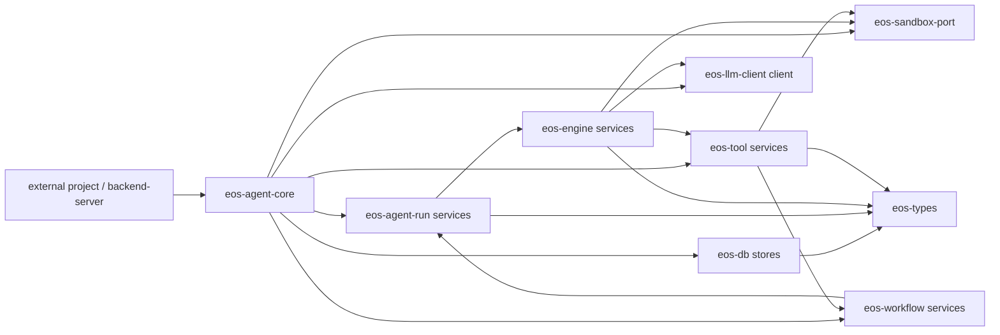

# Agent-Core Workspace Architecture Rules - Index

Status: Draft
Date: 2026-06-09
Owner: agent-core workspace

## Purpose

This plan defines the destructive cleanup target for `agent-core`. The goal is a
smaller Rust workspace whose crate and file names show ownership without
historical explanation.

The cleanup is intentionally aggressive:

- remove misleading `port` vocabulary except for `eos-sandbox-port`,
- reserve `api` for external contract language, not crate/module names,
- reserve `service` for owner-crate surfaces consumed by sibling crates,
- remove `composition` and `deps` as folder/type vocabulary,
- fold request runtime wiring into `eos-agent-core`,
- collapse shallow one-file-per-command module trees,
- keep `eos-engine` execution-only,
- keep concrete model-callable tools in `eos-tool`,
- reduce the class inventory from 291 modules to 180-200 modules.

## Current Inventory

Source: `agent-core/docs/class-inventory/html/assets/inventory.json`

| Metric | Current | Target |
| --- | ---: | ---: |
| Crates | 18 | 11 |
| Modules | 291 | 180-200 |
| Items | 1701 | lower after crate collapse |
| Methods | 987 | lower after module and service collapse |

Current high-module crates:

| Crate | Current modules | Target direction |
| --- | ---: | --- |
| `eos-tools` | 51 | collapse tiny tool files; rename to `eos-tool` |
| `eos-engine` | 33 | execution only; remove tool ownership |
| `eos-types` | 28 | passive contracts only |
| `eos-sandbox-port` | 23 | allowed port boundary; keep focused |
| `eos-workflow` | 23 | workflow domain with sibling-facing services |
| `eos-runtime` | 21 | fold into `eos-agent-core/runtime/` |

## Vocabulary Rules

| Word | Meaning | Allowed use |
| --- | --- | --- |
| `api` | external-project-facing contract language | docs and public contract descriptions only |
| `service` | public owner-crate callable surface used by at least one sibling crate | behavior-owning crates with sibling consumers |
| `runtime` | hidden request-running wiring inside `eos-agent-core` | `eos-agent-core/src/runtime.rs` and `runtime/` |
| `handles` | grouped concrete resources with lifecycle | private runtime internals |
| `catalog` | registry-like static or loaded definitions | agents, tools, skills, plugins |
| `context` | per-call facts, not resource wiring | immutable call/run facts |
| `model` | DTOs, enums, typed IDs, request/response values | any crate |
| `stores` | persistence contracts or DB-backed state access | `eos-types`, `eos-db`, owning domain crates |
| `client` | outbound external provider client | `eos-llm-client` |
| `port` | true external infrastructure boundary | only `eos-sandbox-port` |

Forbidden vocabulary:

```text
composition
deps
runtime_services
```

Strict service rule:

```text
A file, module, trait, or type may be named service only if:
1. it is part of the owning crate's public or intentionally exported surface, and
2. at least one different workspace crate imports or calls it.

If both are not true, use runtime, handles, context, state, records, registry,
catalog, executor, printer, sink, client, or a domain-specific name.
```

## Target Crate Map

```text
agent-core/crates/
├── eos-agent-core/       # external facade + hidden request runtime
├── eos-agent-run/        # agent-run lifecycle: spawn/wait/poll/cancel/finalize
├── eos-engine/           # execution loop, turns, events, records, background accounting
├── eos-tool/             # tool model, registry, executor, hooks, concrete tools, skills
├── eos-workflow/         # workflow lifecycle and attempt/iteration domain
├── eos-types/            # passive shared contracts
├── eos-config/           # shared passive configuration contracts
├── eos-db/               # persistence implementations
├── eos-llm-client/       # outbound provider clients and provider DTOs
├── eos-sandbox-port/     # only allowed port crate
└── eos-testkit/          # dev-only test support
```

Retired or folded crates:

| Current crate | Target |
| --- | --- |
| `eos-runtime` | fold into private `eos-agent-core/src/runtime/` |
| `eos-agent-ports` | split into `eos-agent-core`, `eos-agent-run`, `eos-engine`, and `eos-types` |
| `eos-tool-ports` | fold into `eos-tool` |
| `eos-agent-message-records` | fold into `eos-engine` records internals |
| `eos-tools` | rename/consolidate as singular `eos-tool` |
| `eos-agent-runner` | rename/consolidate as `eos-agent-run` |
| `eos-skills` | fold skill registry/package loading into `eos-tool` |
| `eos-plugin-catalog` | fold into `eos-tool` or private `eos-agent-core/runtime/plugins.rs` |

## Target Architecture



Rules behind the graph:

- `eos-agent-core` is the external-project facade and owns hidden request
  runtime wiring.
- `eos-agent-run` owns lifecycle rows and final outcome handoff.
- `eos-engine` owns the loop, turns, event emission, record writing, and
  midflight printing.
- `eos-tool` owns the tool framework, concrete model-callable tools, and skills.
- `eos-workflow` owns workflow lifecycle and workflow state transitions.
- `eos-llm-client` owns outbound provider clients; it does not need a
  `services.rs` module.
- `eos-types` owns passive contracts only.
- `eos-sandbox-port` is the only crate allowed to be called a port.

## Resulting Folder Structure

```text
agent-core/
├── Cargo.toml
├── crates/
│   ├── eos-agent-core/
│   │   └── src/
│   │       ├── lib.rs
│   │       ├── error.rs
│   │       ├── model.rs
│   │       ├── agent_core.rs
│   │       ├── request.rs
│   │       ├── state.rs
│   │       ├── cancellation.rs
│   │       ├── runtime.rs
│   │       └── runtime/
│   │           ├── builder.rs
│   │           ├── database.rs
│   │           ├── engine.rs
│   │           ├── sandbox.rs
│   │           ├── agents.rs
│   │           ├── audit.rs
│   │           └── plugins.rs
│   ├── eos-agent-run/
│   │   └── src/
│   │       ├── lib.rs
│   │       ├── error.rs
│   │       ├── model.rs
│   │       ├── services.rs
│   │       ├── active_runs.rs
│   │       ├── request.rs
│   │       ├── persistence.rs
│   │       ├── completion.rs
│   │       └── cancellation.rs
│   ├── eos-engine/
│   │   └── src/
│   │       ├── lib.rs
│   │       ├── error.rs
│   │       ├── model.rs
│   │       ├── events.rs
│   │       ├── services.rs
│   │       ├── services/
│   │       │   ├── loop_execution.rs
│   │       │   └── event_sink.rs
│   │       ├── loop.rs
│   │       ├── loop/
│   │       │   ├── executor.rs
│   │       │   ├── state.rs
│   │       │   └── turn.rs
│   │       ├── records.rs
│   │       ├── printer.rs
│   │       ├── background.rs
│   │       └── background/
│   │           ├── command_sessions.rs
│   │           ├── subagent_sessions.rs
│   │           └── workflow_sessions.rs
│   ├── eos-tool/
│   │   └── src/
│   │       ├── lib.rs
│   │       ├── error.rs
│   │       ├── model.rs
│   │       ├── catalog.rs
│   │       ├── registry.rs
│   │       ├── executor.rs
│   │       ├── hooks.rs
│   │       ├── hooks/
│   │       │   ├── background_sessions.rs
│   │       │   ├── workflow_depth.rs
│   │       │   └── sandbox_policy.rs
│   │       ├── tools.rs
│   │       ├── tools/
│   │       │   ├── sandbox.rs
│   │       │   ├── command.rs
│   │       │   ├── workflow.rs
│   │       │   ├── subagent.rs
│   │       │   ├── submission.rs
│   │       │   ├── skills.rs
│   │       │   ├── advisor.rs
│   │       │   └── terminal.rs
│   │       ├── services.rs
│   │       └── services/
│   │           ├── registry.rs
│   │           ├── sandbox.rs
│   │           ├── command_sessions.rs
│   │           ├── workflow.rs
│   │           ├── subagent.rs
│   │           ├── submission.rs
│   │           └── skills.rs
│   ├── eos-workflow/
│   │   └── src/
│   │       ├── lib.rs
│   │       ├── error.rs
│   │       ├── model.rs
│   │       ├── services.rs
│   │       ├── services/
│   │       │   ├── lifecycle.rs
│   │       │   ├── attempts.rs
│   │       │   └── queries.rs
│   │       ├── attempts.rs
│   │       ├── iterations.rs
│   │       ├── planning.rs
│   │       └── context.rs
│   ├── eos-types/
│   ├── eos-config/
│   ├── eos-db/
│   ├── eos-llm-client/
│   │   └── src/
│   │       ├── lib.rs
│   │       ├── error.rs
│   │       ├── model.rs
│   │       ├── client.rs
│   │       ├── providers.rs
│   │       ├── providers/
│   │       │   ├── anthropic.rs
│   │       │   └── openai.rs
│   │       └── stream.rs
│   ├── eos-sandbox-port/
│   └── eos-testkit/
├── workspace-guard/
│   └── tests/
│       ├── dependency_dag.rs
│       ├── profiles.rs
│       ├── crate_inventory.rs
│       ├── crate_layout.rs
│       ├── naming_rules.rs
│       ├── service_boundaries.rs
│       ├── public_surface.rs
│       └── module_budget.rs
└── docs/
    └── plans/
        └── agent-core-workspace-architecture-rules/
            ├── index.md
            ├── phase-00-architecture-lock_SPEC.md
            ├── phase-01-workspace-guardrails_SPEC.md
            ├── phase-02-crate-map-and-dag_SPEC.md
            ├── phase-03-eos-tool_SPEC.md
            ├── phase-04-eos-engine-agent-run_SPEC.md
            ├── phase-05-agent-core-workflow-types_SPEC.md
            └── phase-06-verification-module-budget_SPEC.md
```

## Phase Index

| Phase | Spec | Scope | Parallel lane |
| --- | --- | --- | --- |
| 0 | `phase-00-architecture-lock_SPEC.md` | final decisions, vocabulary, crate map, budgets | Sequential |
| 1 | `phase-01-workspace-guardrails_SPEC.md` | executable architecture rules | Guardrails |
| 2 | `phase-02-crate-map-and-dag_SPEC.md` | crate collapse, renames, dependency DAG | Integration |
| 3 | `phase-03-eos-tool_SPEC.md` | `eos-tool` consolidation and service surface | Tool |
| 4 | `phase-04-eos-engine-agent-run_SPEC.md` | engine execution and run lifecycle split | Engine/run |
| 5 | `phase-05-agent-core-workflow-types_SPEC.md` | external facade runtime, workflow, types cleanup | Agent-core/workflow |
| 6 | `phase-06-verification-module-budget_SPEC.md` | inventory reduction, tests, clippy, final cleanup | Verification |

## Progress Tracker

| Phase | Status | Exit artifact |
| --- | --- | --- |
| 0. Architecture lock | Not started | final 11-crate map and vocabulary are approved |
| 1. Workspace guardrails | Not started | `cargo test -p workspace-guard` enforces naming and budget rules |
| 2. Crate map and DAG | Not started | target crate list builds with expected internal edges |
| 3. `eos-tool` | Not started | no `eos-tool-ports`; tool modules collapsed |
| 4. `eos-engine` and `eos-agent-run` | Not started | engine is execution-only; run lifecycle is isolated |
| 5. Agent core/workflow/types | Not started | `eos-agent-core` owns hidden runtime wiring |
| 6. Verification and budget | Not started | module count is 180-200 and full checks pass |

## Global Acceptance Criteria

- `agent-core` has exactly 11 target crates unless Phase 0 explicitly amends the
  target.
- No crate named `eos-runtime`, `eos-agent-ports`, `eos-tool-ports`, or
  `eos-agent-message-records` remains.
- No crate except `eos-sandbox-port` uses `port` in crate, module, or type names
  unless explicitly allowlisted for protocol text.
- `api` is not used as a crate or module name unless Phase 0 explicitly allows
  an external transport adapter.
- Every `*Service`, `service.rs`, or `services.rs` has at least one sibling-crate
  consumer, or it is renamed.
- `composition`, `deps`, and `runtime_services` are not used as module or type
  names.
- `eos-engine` contains no concrete model-facing tool family modules.
- `eos-tool` owns tool model, registry, executor, hooks, concrete tool behavior,
  and skills.
- `eos-agent-core` owns external facade plus hidden request runtime wiring.
- `eos-llm-client` uses `client` and `providers`, not `services`.
- `eos-types` has no runtime, I/O, provider, DB, or service logic.
- `cargo test -p workspace-guard` passes.
- `cargo check --workspace --all-targets` passes.
- The class inventory reports 180-200 modules.
