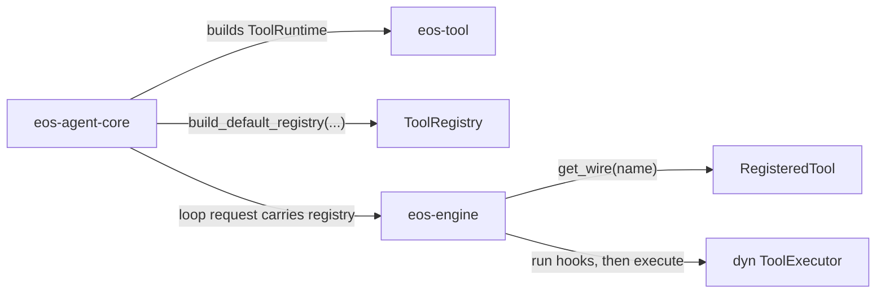

# Phase 03 - eos-tool Spec

Status: Draft
Date: 2026-06-09
Owner: eos-tool

## Scope

This phase rebuilds `eos-tool` as the owner of the tool framework contracts,
default tool registry construction, and concrete model-callable tool behavior.

It removes the current `eos-tool-ports` dependency by moving tool-owned
contracts into `eos-tool` and routing non-tool contracts to their real owner in
the crate-map/integration phases. It also collapses the current
one-file-per-tool command layout into family-level handlers.

Phase 03 does not own root workspace member edits, retired-crate removal, or the
final dependency DAG. Those are Phase 02 / integration responsibilities. Phase
03 owns the resulting `eos-tool` crate shape.

## Local Architecture

`eos-tool` owns:

- tool names and keys,
- tool intent and output shape,
- execution metadata facts,
- tool result DTOs,
- registered tool entries,
- tool registry,
- tool executor trait,
- hook declarations and config tokens,
- default registry construction,
- concrete model-callable tool behavior,
- skill registry and skill package loading,
- `ToolRuntime`, the small executable dependency bundle passed into registry
  construction by `eos-agent-core`.

`eos-tool` does not own:

- agent-loop turn control,
- foreground tool-batch dispatch,
- pre-hook execution policy,
- `HookOutcome` or other hook-pipeline internals,
- model provider streaming,
- agent-run lifecycle rows,
- workflow state transitions,
- sandbox daemon protocol internals,
- workspace crate-map edits.

`eos-engine` receives a `ToolRegistry`, runs its own pre-hook execution pipeline,
looks up `RegisteredTool` entries, and calls the stored `ToolExecutor`. The
dependency direction is `eos-engine -> eos-tool`; `eos-tool` must not depend on
`eos-engine`.



## Resulting File Structure

```text
agent-core/crates/eos-tool/
├── Cargo.toml
├── src/
│   ├── lib.rs
│   ├── error.rs
│   ├── model.rs
│   ├── registry.rs
│   ├── hooks.rs
│   ├── tools.rs
│   ├── tools/
│   │   ├── sandbox.rs
│   │   ├── command.rs
│   │   ├── isolated_workspace.rs
│   │   ├── workflow.rs
│   │   ├── subagent.rs
│   │   ├── advisor.rs
│   │   ├── submission.rs
│   │   ├── skills.rs
│   │   └── terminal.rs
└── tests/
    ├── registry/
    ├── sandbox/
    ├── command/
    ├── isolated_workspace/
    ├── workflow/
    ├── subagent/
    ├── advisor/
    ├── submission/
    └── skills/
```

No `builtins.rs` or `builtins/` folder is required in the first target. The
built-in tool set is closed and should be represented through default registry
registration plus family handlers in `tools/`.

No first-target `catalog.rs`, `executor.rs`, `runtime.rs`, `resources.rs`,
`handles.rs`, `services.rs`, `services/`, or `hooks/` folder is allowed. Those
splits are only acceptable later if implementation proves that one file has
become materially harder to understand.

Family files under `tools/` are the first target. A family may gain a
same-named private subfolder only when the flat file starts mixing multiple
distinct DTO families, executor bodies, shared rendering paths, and registration
logic in a way that is less clear than the split.

## Module Collapse Plan

| Current pattern | Target |
| --- | --- |
| `tools/sandbox/exec_command.rs` | `registry.rs` default entry plus `tools/command.rs` handler |
| `tools/sandbox/write_stdin.rs` | `registry.rs` default entry plus `tools/command.rs` handler |
| `tools/sandbox/read_command_progress.rs` | `registry.rs` default entry plus `tools/command.rs` handler |
| `tools/sandbox/read_file.rs` | `registry.rs` default entry plus `tools/sandbox.rs` handler |
| `tools/sandbox/write_file.rs` | `registry.rs` default entry plus `tools/sandbox.rs` handler |
| `tools/sandbox/edit_file.rs` | `registry.rs` default entry plus `tools/sandbox.rs` handler |
| `tools/sandbox/multi_edit.rs` | `registry.rs` default entry plus `tools/sandbox.rs` handler |
| `tools/isolated_workspace/*.rs` | `registry.rs` default entry plus `tools/isolated_workspace.rs` handler |
| `tools/workflow/*.rs` | `registry.rs` default entry plus `tools/workflow.rs` handler |
| `tools/subagent/*.rs` | `registry.rs` default entry plus `tools/subagent.rs` handler |
| `tools/submission/**/*.rs` | `registry.rs` default entry plus `tools/submission.rs` handler |
| `tools/skills/*.rs` | `registry.rs` default entry plus `tools/skills.rs` handler |
| `tools/ask_helper/*.rs` | `registry.rs` default entry plus `tools/advisor.rs` handler |
| `tools/terminal.rs` | `tools/terminal.rs` |

## `eos-tool-ports` Ownership Split

Do not dump every old `eos-tool-ports` item into `eos-tool`. Move each contract
to the crate that owns its behavior or to an owner-neutral contract module.

| Current item family | Target owner |
| --- | --- |
| `ToolError` | `eos-tool/error.rs` |
| `ToolName`, `ToolKey`, `ToolIntent`, `ExecutionMetadata`, `OutputShape`, `ToolResult` | `eos-tool/model.rs` |
| `ToolRegistry`, `RegisteredTool`, `ToolExecutor`, `ToolRuntime` | `eos-tool/registry.rs` |
| `Hook` | `eos-tool/hooks.rs` |
| `HookOutcome` | engine-private hook execution internals; not exported by `eos-tool` |
| `PlannerPlan`, `PlanTask`, `PlanReducer`, `SubmissionAck` | owner-neutral workflow submission contracts, not concrete tool behavior |
| `AttemptSubmissionPort` | workflow submission contract implemented by `eos-workflow`; consumed by `eos-tool` |
| `CancelPort` | cancellation contract owned by the lifecycle/cancellation phase, not by concrete tools |
| `SystemNotification`, `NotificationSink`, background-session count/status DTOs | engine/background contracts unless a passive DTO must move to `eos-types` |

## Runtime Rules

`eos-tool` should not export `*Service` types. It exports a small runtime
struct passed into registry construction and captured by concrete tools.

The first target uses `ToolRuntime` in `registry.rs`; it does not create
`runtime.rs`, `resources.rs`, `handles.rs`, or `services.rs`.

Allowed `ToolRuntime` fields:

| Resource | Built by | Used by |
| --- | --- |
| sandbox resource | `eos-agent-core` | `tools/sandbox.rs`, `tools/isolated_workspace.rs` |
| command-session resource | `eos-engine` | `tools/command.rs` |
| workflow resource | `eos-agent-core` | `tools/workflow.rs` |
| subagent resource | `eos-agent-core` | `tools/subagent.rs` |
| submission resource | `eos-agent-core`, `eos-agent-run` if needed | `tools/submission.rs` |
| skill resource | `eos-agent-core` | `tools/skills.rs` |

Each field is an injected handle whose **trait is defined in `eos-tool`** and
whose **concrete impl is built at the `eos-agent-core` composition root**, then
passed into the engine via `AgentLoopExecutionRequest`. This keeps the graph
acyclic:

- `eos-engine` may build the `command-session resource` because it already
  depends on `eos-tool` (`eos-engine -> eos-tool`).
- The `workflow` and `subagent` resources must **not** be built by `eos-engine`.
  `eos-engine` has no edge to `eos-workflow` or `eos-agent-run`, so an
  engine-built impl would close a cycle
  (`eos-engine -> eos-workflow -> eos-agent-run -> eos-engine`). Only
  `eos-agent-core`, which depends on every domain crate, may build them.
- Concrete tools and engine hooks invoke these handles only through the
  `eos-tool`-defined trait in `ToolRuntime`; they never gain a crate dependency
  on `eos-workflow` or `eos-agent-run`.

Hook policy facts are not runtime resources. Hook declarations live in
`hooks.rs`; hook execution uses `ExecutionMetadata`, `RegisteredTool.hooks`, and
engine-owned hook runtime state.

Rejected `Service` names:

| Pattern | Replacement |
| --- | --- |
| private tool executor resource group | `ToolRuntime` |
| static registry config holder | `ToolRegistry` default entries |
| hook-only private state | engine-private hook policy state |
| test-only helper | test fixture name |

## Public Surface

Target `lib.rs` exports only:

```rust
pub use error::ToolError;
pub use hooks::Hook;
pub use model::{ExecutionMetadata, OutputShape, ToolIntent, ToolKey, ToolName, ToolResult};
pub use registry::{
    build_default_registry, CallerScope, RegisteredTool, ToolExecutor, ToolRegistry, ToolRuntime,
};
```

The exact names may change during implementation, but the surface must stay
small and owner-accurate. `HookOutcome` is not public `eos-tool` API.

## Progress Tracker

| Item | Status |
| --- | --- |
| Confirm Phase 02 handoff has created or renamed the `eos-tool` crate | Not started |
| Move tool-owned `eos-tool-ports` contracts into `error.rs`, `model.rs`, `registry.rs`, and `hooks.rs` | Not started |
| Route non-tool `eos-tool-ports` contracts to owner crates or owner-neutral contract modules | Not started |
| Fold registry, executor trait, and default tool registration into `registry.rs` | Not started |
| Move hook declarations into `eos-tool/hooks.rs` and keep hook execution in `eos-engine` | Not started |
| Move concrete tool behavior into `tools/` family modules | Not started |
| Define `ToolRuntime` in `registry.rs` | Not started |
| Collapse sandbox file/edit tools into `tools/sandbox.rs` | Not started |
| Collapse shell/session tools into `tools/command.rs` | Not started |
| Collapse isolated-workspace tools into `tools/isolated_workspace.rs` | Not started |
| Collapse workflow/subagent/submission files | Not started |
| Move advisor helper behavior into `tools/advisor.rs` | Not started |
| Collapse skill tool files | Not started |
| Remove obsolete one-file-per-tool deep tree | Not started |
| Update engine and agent-core imports through the Phase 02 integration lane | Not started |

## Acceptance Criteria

- `eos-tool` has `tools.rs` and family-level `tools/` modules.
- `eos-tool` has `hooks.rs`.
- `eos-tool` has no first-target `catalog.rs`, `executor.rs`, `runtime.rs`,
  `resources.rs`, `handles.rs`, `services.rs`, `services/`, or `hooks/` folder.
- `eos-tool` has no one-file-per-tool-command module tree.
- `eos-tool` exports no `*Service` types.
- Private resource groups are fields on `ToolRuntime`, not `Service`.
- `HookOutcome` is not exported from `eos-tool`.
- Hook execution remains in `eos-engine` unless Phase 04 is amended to move the
  full single-tool execution pipeline.
- `tools/command.rs` owns `exec_command`, `write_stdin`, and
  `read_command_progress`.
- `tools/isolated_workspace.rs` owns `enter_isolated_workspace` and
  `exit_isolated_workspace`.
- `tools/advisor.rs` owns `ask_advisor` and advisor prompt/result behavior.
- `eos-engine` imports tool framework contracts from `eos-tool`.
- `eos-tool` has no dependency on `eos-engine`.
- `eos-agent-core` builds `ToolRuntime` through `eos-tool`.
- Non-tool contracts from the old `eos-tool-ports` crate are not hidden in
  `eos-tool` solely to avoid dependency-DAG decisions.
- `cargo test -p eos-tool` passes.
- `cargo check -p eos-engine --all-targets` and
  `cargo check -p eos-agent-core --all-targets` pass after import updates.
- `eos-tool` final module count is at or below 16 unless a documented family
  split prevents a materially worse large file.
