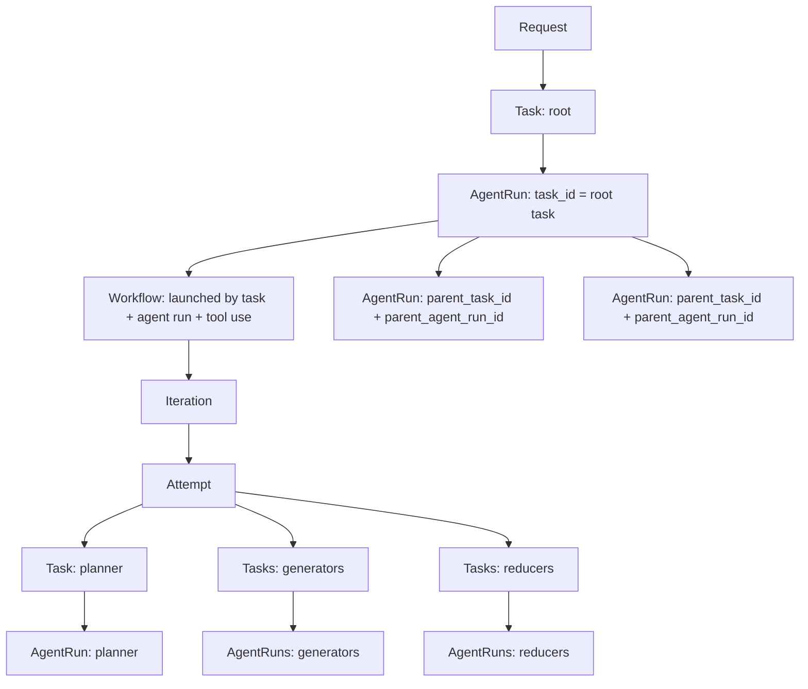
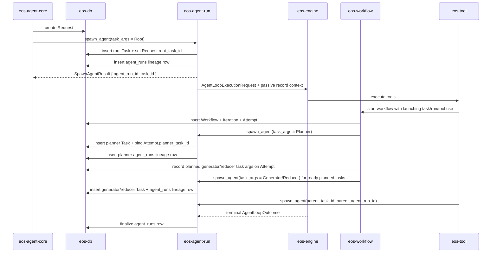

# Phase 03B - Execution Lineage and Materialization Spec

Status: Draft
Date: 2026-06-09
Owner: eos-db / eos-agent-run / eos-workflow / eos-engine / eos-agent-core

## Placement

This phase runs after Phase 03 and before Phase 04.

Phase 04 cannot cleanly split `eos-engine` from `eos-agent-run` until the
durable execution-lineage model is explicit. This phase defines that model:
which rows are created, which crate owns each transition, which metadata reaches
the agent loop, and how message-record folders are derived from durable state.

## Scope

This phase establishes:

- the durable relationship between request, task, workflow, iteration, attempt,
  and agent run,
- task-owned and parent-owned agent-run references,
- workflow launch lineage,
- the passive record context passed into the engine loop,
- message-record path generation for `messages.jsonl` and `events.jsonl`,
- read-side materialization for request/task/workflow execution trees.

It does not move the agent loop, rename crates, or split files. Those stay in
Phase 04 after this contract exists.

## Non-Goals

- Do not create wrapper persistence objects such as `WorkflowNode`,
  `IterationNode`, or `AttemptNode`.
- Do not add nested agent-run arrays to `Task` for workflows, subagents, or
  advisors.
- Do not turn every subagent or advisor into a `Task`; they remain parented
  `AgentRun` rows unless they become schedulable workflow work.
- Do not put engine execution, tool behavior, provider clients, or runtime
  wiring into `eos-db`.
- Do not create a second durable tree just for message records. Message-record
  folders are a projection of execution lineage.

## Target Model



Rules:

| Concept | Meaning | Persistence rule |
| --- | --- | --- |
| `Request` | user intake boundary | owns `root_task_id` |
| `Task` | schedulable unit of work | root tasks and workflow role tasks are tasks |
| `Workflow` | workflow lifecycle | owns iterations and attempts; records the launching task/run/tool use |
| `Iteration` | workflow progress unit | belongs to one workflow |
| `Attempt` | one workflow attempt | names planner/generator/reducer task ids |
| `AgentRun` | one agent-loop execution | task-owned runs have `task_id`; parented runs have `parent_task_id` and `parent_agent_run_id` |

## Durable Store Contract

The exact SQL and Rust store names follow `eos-db` conventions, but the logical
fields below are required.

### agent_runs

Add or preserve these lineage columns:

| Field | Required | Meaning |
| --- | --- | --- |
| `id` | yes | `AgentRunId` |
| `request_id` | yes | request anchor for direct query and audit |
| `task_id` | nullable | set for root and workflow role runs |
| `parent_task_id` | nullable | set when the run is launched under another task's main agent run |
| `parent_agent_run_id` | nullable | set when the run is launched under another agent run |
| `workflow_id` | nullable | set for workflow role runs |
| `iteration_id` | nullable | set for workflow role runs |
| `attempt_id` | nullable | set for workflow role runs |
| `launched_by_tool_use_id` | nullable | model tool-use id that launched this run, when applicable |
| `agent_name` | nullable | human/debug agent name when the caller has one |
| terminal status fields | existing | lifecycle result owned by `eos-agent-run` |

Indexes and constraints:

| Constraint | Rule |
| --- | --- |
| task-owned run uniqueness | one current main `agent_run` per `task_id`; if retries need multiple runs, introduce an explicit task-execution id before allowing duplicates |
| parent index | index `parent_task_id` and `parent_agent_run_id` |
| request index | index `request_id` |
| workflow coordinate index | index `workflow_id`, `iteration_id`, and `attempt_id` together for workflow role runs |
| structural run invariant | either `task_id` is set, or both `parent_task_id` and `parent_agent_run_id` are set |
| parented-run invariant | parented runs require `task_id IS NULL` and both parent ids |
| task-owned invariant | task-owned runs require `task_id` and derive role from `Task.role` |
| workflow task invariant | planner/generator/reducer task runs require `workflow_id`, `iteration_id`, and `attempt_id` |
| root invariant | root runs require `task_id` and must match `Request.root_task_id` |

There is no generic `AgentRunKind`, `run_kind`, or child-family column. Task
role is derived from the joined `Task.role`; non-task agent runs are located by
their parent task/run ids.

### workflows

Add or preserve these launch-lineage columns:

| Field | Required | Meaning |
| --- | --- | --- |
| `id` | yes | `WorkflowId` |
| `request_id` | yes | request anchor |
| `parent_task_id` | yes | task whose agent launched the workflow |
| `launched_by_agent_run_id` | yes | agent run that executed the workflow tool call |
| `launched_by_tool_use_id` | nullable | exact model tool-use id that launched the workflow |
| lifecycle fields | existing | workflow status, iteration ids, attempt ids |

`WorkflowService::find_outstanding_workflows` must either query by
`launched_by_agent_run_id` or be renamed/documented as task-scoped. It must not
accept an agent-run id and then ignore it.

### tasks

`Task` remains the schedulable unit. This phase does not add nested task
children.

Required relationships:

| Task kind | How it is found |
| --- | --- |
| root task | `Request.root_task_id` |
| planner task | `Attempt.planner_task_id` or equivalent attempt accessor |
| generator task | `Attempt.generator_task_id` or equivalent attempt accessor |
| reducer task | `Attempt.reducer_task_id` or equivalent attempt accessor |

Workflow role classification comes from `Task.role` and the attempt accessors.
Do not add a second role or kind field to `agent_runs`.

## Agent Run Lineage Contract

`eos-types` owns passive DTOs and enums for lineage. Behavior stays in the owning
crates.

```rust
pub struct AgentRunLineage {
    pub request_id: RequestId,
    pub task_id: Option<TaskId>,
    pub parent_task_id: Option<TaskId>,
    pub parent_agent_run_id: Option<AgentRunId>,
    pub workflow_id: Option<WorkflowId>,
    pub iteration_id: Option<IterationId>,
    pub attempt_id: Option<AttemptId>,
    pub launched_by_tool_use_id: Option<ToolUseId>,
}
```

The names may be adjusted to match existing type names, but the invariants may
not be weakened.

Terminology:

| Term | Meaning |
| --- | --- |
| `task_id` | set when this is the main agent run for a persisted `Task` |
| `parent_task_id` | task whose main agent run launched this non-task agent run |
| `parent_agent_run_id` | exact parent agent run that launched this non-task agent run |

## Creation Flow



Creation rules:

| Event | Owner | Required write |
| --- | --- | --- |
| user request accepted | `eos-agent-core` runtime through `eos-db` | `Request` row only |
| root agent spawned | `eos-agent-run` | root `Task`, `Request.root_task_id`, and main `AgentRun` with `task_id` |
| task agent enters main loop | `eos-agent-run` | task-row admission plus main `AgentRun` with `request_id` and `task_id` |
| workflow tool accepted | `eos-workflow` | `Workflow` with `parent_task_id`, `launched_by_agent_run_id`, and optional `launched_by_tool_use_id` |
| workflow attempt starts planner work | `eos-agent-run` called by `eos-workflow` | planner `Task`, `Attempt.planner_task_id`, and planner `AgentRun` |
| workflow plan materializes role work | `eos-workflow` | planned generator/reducer task arguments and reserved task ids on `Attempt`; no `Task` rows yet |
| workflow role task enters main loop | `eos-agent-run` | generator/reducer `Task` plus main `AgentRun` with workflow coordinate fields |
| subagent tool accepted | `eos-agent-run` through `eos-tool` caller | `AgentRun` with `parent_task_id`, `parent_agent_run_id`, and no `task_id` |
| advisor tool accepted | `eos-agent-run` through `eos-tool` caller | `AgentRun` with `parent_task_id`, `parent_agent_run_id`, and no `task_id` |
| loop finishes | `eos-agent-run` | terminal run status and final outcome fields |

## Agent Run Spawn Contract

`eos-agent-run` owns executable task creation inside `spawn_agent`.
There is no standalone `create_task`, `create_agent_task`, or
`create_agent_tasks` method in the target contract.

This keeps request entry and workflow orchestration away from direct task-row
writes while avoiding a generic TaskCenter owner.

```rust
pub enum SpawnAgentTaskArgs {
    Root {
        request_id: RequestId,
        instruction: String,
    },
    Planner {
        request_id: RequestId,
        workflow_id: WorkflowId,
        iteration_id: IterationId,
        attempt_id: AttemptId,
        instruction: String,
    },
    Generator {
        request_id: RequestId,
        workflow_id: WorkflowId,
        iteration_id: IterationId,
        attempt_id: AttemptId,
        local_id: PlanNodeId,
        instruction: String,
        needs: Vec<TaskId>,
    },
    Reducer {
        request_id: RequestId,
        workflow_id: WorkflowId,
        iteration_id: IterationId,
        attempt_id: AttemptId,
        local_id: PlanNodeId,
        instruction: String,
        needs: Vec<TaskId>,
    },
}

pub struct SpawnAgentRequest {
    pub agent_run_id: Option<AgentRunId>,
    pub agent_name: AgentName,
    pub initial_messages: Vec<Message>,
    pub task_args: Option<SpawnAgentTaskArgs>,
    pub parent_task_id: Option<TaskId>,
    pub parent_agent_run_id: Option<AgentRunId>,
    pub launched_by_tool_use_id: Option<ToolUseId>,
    // sandbox/workspace/model/cancellation inputs
}

pub struct SpawnAgentResult {
    pub agent_run_id: AgentRunId,
    pub task_id: Option<TaskId>,
}
```

Rules:

| Rule | Reason |
| --- | --- |
| `spawn_agent(task_args = Root)` inserts the root task, sets `Request.root_task_id`, and inserts the root agent run in one admission path | root bootstrap should not be a partial-write sequence in request entry |
| `spawn_agent(task_args = Planner)` inserts the planner task, binds `Attempt.planner_task_id`, and inserts the planner agent run in one admission path | an attempt with a planner task row but no planner binding is invalid |
| `spawn_agent(task_args = Generator/Reducer)` inserts the task row and agent run when the scheduler admits the planned node | unlaunched plan nodes should not need pending `Task` rows |
| generated ids use the existing root/planner/generator/reducer id rules | stable ids remain predictable for audit and tests |
| planner submission records planned generator/reducer task arguments on the attempt | workflow can materialize the DAG without creating executable task rows early |
| callers pass workflow decisions; `eos-agent-run` persists executable task rows at spawn | workflow topology stays in `eos-workflow`; task-row creation is unified |
| `spawn_agent` may load parent request/workflow/attempt rows only to validate invariants | validation is allowed; workflow lifecycle decisions are not |
| `spawn_agent(task_args = None, parent_task_id = Some, parent_agent_run_id = Some)` creates only an `AgentRun` | subagent/advisor runs are not tasks unless the design later makes them schedulable workflow work |
| `SpawnAgentResult.task_id` is `Some` when `task_args` is `Some` and `None` for parented agent runs | callers do not need to re-derive task ids after spawn |
| `SpawnAgentTaskArgs` has no `Existing { task_id }` or pre-existing-task variant | every task spawn owns the task-row creation/admission path |
| parented agent runs derive `request_id` from the parent task/run lineage | callers do not pass duplicate request facts |
| `task_args` and parent ids are mutually exclusive | the row is either task-owned or parent-owned, never both |

Forbidden ownership:

| Do not put in `eos-agent-run` | Owner |
| --- | --- |
| workflow start policy | `eos-workflow` |
| iteration continuation policy | `eos-workflow` |
| attempt retry/budget policy | `eos-workflow` |
| planner DAG validation | `eos-workflow` |
| provider stream execution | `eos-engine` |
| concrete tool behavior | `eos-tool` |

Task-backed run admission:

```text
spawn_agent(task_args = Root)
  -> create root Task and bind Request.root_task_id
  -> create AgentRun with task_id = root_task_id
  -> return SpawnAgentResult { agent_run_id, task_id: Some(root_task_id) }

spawn_agent(task_args = Planner)
  -> create planner Task and bind Attempt.planner_task_id
  -> create AgentRun with task_id = planner_task_id
  -> return SpawnAgentResult { agent_run_id, task_id: Some(planner_task_id) }

spawn_agent(task_args = Generator | Reducer)
  -> create executable Task
  -> create AgentRun with task_id = task_id
  -> return SpawnAgentResult { agent_run_id, task_id: Some(...) }

spawn_agent(task_args = None, parent_task_id = Some, parent_agent_run_id = Some)
  -> create AgentRun with parent_task_id + parent_agent_run_id
  -> return SpawnAgentResult { agent_run_id, task_id: None }
```

Because generator/reducer tasks are not inserted until spawn, `MaterializedPlan`
must persist enough planned task arguments to later build `SpawnAgentTaskArgs`.
It cannot rely on pending task rows as the source of instruction text, agent
name, needs, or task ids.

## Task Class Contract

`Task` remains the persisted executable unit. It is not the workflow tree and it
is not a planned-but-unspawned node.

Target fields:

| Field | Meaning |
| --- | --- |
| `id` | stable task id |
| `request_id` | owning request |
| `role` | root, planner, generator, or reducer |
| `instruction` | agent instruction/context used for this task |
| `status` | pending, running, done, failed, blocked, or cancelled |
| `workflow_id` | workflow owner for planner/generator/reducer tasks |
| `iteration_id` | iteration owner for planner/generator/reducer tasks |
| `attempt_id` | attempt owner for planner/generator/reducer tasks |
| `agent_name` | selected agent profile |
| `needs` | dependency task ids for generator/reducer tasks |
| `outcomes` | normalized execution outcomes |
| `terminal_tool_result` | flattened terminal tool result payload |

Under the target flow, root and planner task rows are created as running task
rows at spawn. Generator/reducer task rows are created only when their planned
node is admitted to run. A materialized workflow plan may therefore contain
planned generator/reducer nodes that do not yet have `Task` rows.

## Agent Loop Input Contract

`eos-agent-run` creates the durable run row before the engine loop starts. The
engine receives passive lineage and record facts, not lifecycle ownership.

Allowed engine input:

```rust
pub struct AgentLoopExecutionRequest {
    pub agent_run_id: AgentRunId,
    pub lineage: AgentRunLineage,
    pub record_context: AgentRunRecordContext,
    // prompt, model, tools, cancellation, event sink, and runtime inputs
}

pub struct AgentRunRecordContext {
    pub request_id: RequestId,
    pub root_task_id: TaskId,
    pub agent_run_id: AgentRunId,
    pub task_id: Option<TaskId>,
    pub task_role: Option<TaskRole>,
    pub parent_agent_run_id: Option<AgentRunId>,
    pub child_family: Option<ChildRunFamily>,
    pub workflow_id: Option<WorkflowId>,
    pub iteration_id: Option<IterationId>,
    pub attempt_id: Option<AttemptId>,
}
```

Forbidden engine input:

| Do not pass | Reason |
| --- | --- |
| active-run registry handles | owned by `eos-agent-run` |
| lifecycle finalization callbacks | finalization is one terminal handoff from engine to run |
| DB mutation handles for agent-run status | run lifecycle writes stay in `eos-agent-run` |
| tool-family-specific lineage strings | lineage is typed and request-rooted |
| a generic metadata bag with resource wiring | metadata is facts only, not dependency injection |

## Message Record Layout Contract

The normal production layout is request-rooted and generated from persisted
lineage.

```text
requests/<request_id>/
  root-task-<task_id>/
    agent-run-<agent_run_id>/
      messages.jsonl
      events.jsonl
      workflows/
        workflow-<workflow_id>/
          iteration-<iteration_id>/
            attempt-<attempt_id>/
              planner-task-<task_id>/agent-run-<agent_run_id>/
                messages.jsonl
                events.jsonl
              generator-task-<task_id>/agent-run-<agent_run_id>/
                messages.jsonl
                events.jsonl
              reducer-task-<task_id>/agent-run-<agent_run_id>/
                messages.jsonl
                events.jsonl
      subagents/subagent-run-<agent_run_id>/
        messages.jsonl
        events.jsonl
      advisors/advisor-run-<agent_run_id>/
        messages.jsonl
        events.jsonl
```

Rules:

| Rule | Owner |
| --- | --- |
| `messages.jsonl` is plural | `eos-engine` records |
| `events.jsonl` is plural | `eos-engine` records |
| root path uses `Request.root_task_id` | `eos-db` lineage query |
| workflow paths use workflow coordinate fields on `agent_runs` | `eos-db` lineage query |
| subagent/advisor paths use `parent_agent_run_id` and parent record directory | `eos-db` lineage query |
| callers choose `AgentRunKind` once at spawn | `eos-agent-run` validates and persists |
| records do not reconstruct hierarchy from ad hoc callsite strings | `eos-engine` records consume `AgentRunRecordContext` |
| `parents-missing/` is not part of the normal production path | tests must prove parent lineage exists before child records are written |

If a repair/debug fallback for missing parents is retained, it must be isolated
from the normal writer path and must emit a hard diagnostic event. It must not
be used to satisfy acceptance tests.

### messages.jsonl Rows

Each row represents one model-visible message or message delta committed to the
record.

Required base fields:

| Field | Meaning |
| --- | --- |
| `sequence` | monotonic sequence within one agent run |
| `timestamp` | write time |
| `request_id` | request anchor |
| `agent_run_id` | run anchor |
| `task_id` | task anchor when task-backed |
| `role` | system, user, assistant, or tool |
| `message` | serialized provider-neutral message payload |
| `tool_use_id` | set when the row belongs to a tool call/result |

### events.jsonl Rows

Each row represents one audit or lifecycle event visible to message-record
readers.

Required base fields:

| Field | Meaning |
| --- | --- |
| `sequence` | monotonic event sequence within one agent run |
| `timestamp` | write time |
| `request_id` | request anchor |
| `agent_run_id` | run anchor |
| `task_id` | task anchor when task-backed |
| `event_type` | node_started, messages_initialized, child_created, turn_started, tool_started, tool_finished, workflow_started, node_finished, or record_error |
| `payload` | event-specific structured payload |

`child_created` and `workflow_started` events must include the child run or
workflow ids they announce. The durable DB row is still the source of truth; the
event row is the audit trail.

## Materialized Read Model

The database stores normalized lineage. `eos-agent-core` exposes a read-side
materialization for callers that need the tree.

Target DTOs:

```rust
pub struct RequestExecutionTree {
    pub request: Request,
    pub root_task: TaskExecutionTree,
}

pub struct TaskExecutionTree {
    pub task: Task,
    pub main_agent_run: Option<AgentRun>,
    pub workflows: Vec<WorkflowExecutionTree>,
    pub subagents: Vec<AgentRun>,
    pub advisors: Vec<AgentRun>,
}

pub struct WorkflowExecutionTree {
    pub workflow: Workflow,
    pub iterations: Vec<IterationExecutionTree>,
}

pub struct IterationExecutionTree {
    pub iteration: Iteration,
    pub attempts: Vec<AttemptExecutionTree>,
}

pub struct AttemptExecutionTree {
    pub attempt: Attempt,
    pub planner: Option<Box<TaskExecutionTree>>,
    pub generators: Vec<TaskExecutionTree>,
    pub reducers: Vec<TaskExecutionTree>,
}
```

Rules:

| Rule | Reason |
| --- | --- |
| materialization is read-side only | avoids duplicating workflow/task ownership |
| TaskCenter does not store workflow/iteration/attempt wrapper nodes | `Workflow`, `Iteration`, and `Attempt` already own those identities |
| helper runs appear under the parent task's main run | subagents/advisors are child runs, not scheduled tasks |
| missing run rows are represented as `None` plus diagnostics | materialization must not fabricate rows |
| ordering is deterministic | stable audit and UI rendering |

## Crate Ownership

| Crate | Owns | Must not own |
| --- | --- | --- |
| `eos-types` | passive ids, DTOs, run-kind enums, lineage DTOs | DB queries or lifecycle behavior |
| `eos-db` | migrations, constraints, repository queries, materialization queries | engine loop or tool behavior |
| `eos-agent-run` | `spawn_agent` task args, executable task-row creation at spawn, run admission, lineage validation, task-backed agent-run row creation/finalization | workflow lifecycle, planner DAG policy, or message path guessing |
| `eos-workflow` | workflow/iteration/attempt lifecycle, planner DAG validation, planned task arguments, workflow launch lineage | direct executable task-row writes or agent-loop execution |
| `eos-engine` | writes loop-visible `messages.jsonl` and `events.jsonl` from passive context | run-row lifecycle ownership |
| `eos-agent-core` | request creation, call into `spawn_agent(task_args = Root)`, and public read-side materialization facade | direct executable task-row writes or normalized workflow persistence internals |
| `eos-tool` | passes typed launch facts for workflow/subagent/advisor tools | durable lineage derivation |

## Redundancy Rules

- Do not maintain a separate message-record hierarchy independent of DB
  lineage.
- Do not pass both `record_kind` strings and typed `AgentRunLineage`; typed
  lineage is the contract.
- Do not duplicate workflow role task ids in `Task` if `Attempt` already owns
  them and a query helper can materialize them.
- Do not create pending `Task` rows only to represent planned generator/reducer
  nodes; planned nodes live in `MaterializedPlan` until `spawn_agent` admits
  them.
- Do not add both `parent_task_id` and `parent_agent_run_id` to helper runs;
  helper runs use `parent_agent_run_id`, and the parent task is reached through
  the parent run.
- Denormalized `request_id` on `agent_runs` and `workflows` is allowed because
  it is the audit/query anchor; it is not optional.

## Migration Steps

1. Add passive lineage DTOs and run-kind enums in `eos-types`.
2. Add `eos-db` migrations, constraints, and focused repository tests for
   `agent_runs` and `workflows` lineage fields.
3. Extend `MaterializedPlan` or its successor to persist planned
   generator/reducer task arguments and reserved task ids without inserting
   `Task` rows.
4. Update `spawn_agent` to accept optional `task_args` and return
   `SpawnAgentResult { agent_run_id, task_id }`.
5. Update request intake to call `spawn_agent(task_args = Root)` so
   `Request.root_task_id` is persisted before root run spawn.
6. Update `eos-agent-run` spawn APIs to require typed lineage and to create the
   executable task row and durable run row before engine startup.
7. Update workflow start APIs to persist `launched_by_agent_run_id` and
   `launched_by_tool_use_id`.
8. Update workflow planner startup to call `spawn_agent(task_args = Planner)`.
9. Update workflow role scheduling to call `spawn_agent(task_args =
   Generator/Reducer)` for ready planned generator/reducer nodes.
10. Update subagent/advisor spawning to persist helper runs with parent run
   lineage.
11. Update message-record path resolution to use `AgentRunRecordContext`.
12. Add request/task/workflow execution-tree materialization queries and facade
   DTOs.
13. Only then start Phase 04 engine/run file and crate-boundary movement.

## Progress Tracker

| Item | Status |
| --- | --- |
| Add passive lineage DTOs in `eos-types` | Not started |
| Add `agent_runs` lineage columns and constraints | Not started |
| Add `workflows` launch-lineage columns | Not started |
| Store planned generator/reducer task arguments on the materialized plan | Not started |
| Update `spawn_agent` to accept optional `task_args` and return `SpawnAgentResult` | Not started |
| Update root request flow to call `spawn_agent(task_args = Root)` | Not started |
| Update workflow launch and role task creation flow to use `spawn_agent` task args | Not started |
| Update subagent/advisor helper run creation flow | Not started |
| Add passive `AgentRunRecordContext` for engine loop input | Not started |
| Generate message-record paths from persisted lineage | Not started |
| Add execution-tree materialization queries | Not started |
| Add focused store and materialization tests | Not started |

## Acceptance Criteria

- `eos-agent-core` request entry does not insert root task rows directly; it
  creates the request row and calls
  `eos-agent-run::spawn_agent(task_args = Root)`.
- `eos-workflow` does not insert planner/generator/reducer task rows directly;
  it validates workflow decisions, stores planned generator/reducer task
  arguments on the materialized plan, and calls `spawn_agent(task_args =
  Planner|Generator|Reducer)` when each node is admitted.
- There is no standalone `create_task`, `create_agent_task`, or
  `create_agent_tasks` method in the target public contract.
- `SpawnAgentTaskArgs` has no `Existing { task_id }` variant.
- `spawn_agent` returns `SpawnAgentResult`, not a bare `AgentRunId`.
- `SpawnAgentResult.task_id` is `Some` for root/planner/generator/reducer runs
  and `None` for subagent/advisor helper runs.
- `Request`, root `Task`, and root task-backed `AgentRun` are persisted before
  the root engine loop starts.
- `spawn_agent(task_args = Root)` persists the root task,
  `Request.root_task_id`, and root agent-run row atomically or through an
  equivalent rollback-safe DB operation.
- `spawn_agent(task_args = Planner)` persists the planner task,
  `Attempt.planner_task_id`, and planner agent-run row atomically or through an
  equivalent rollback-safe DB operation.
- Planned generator/reducer nodes can be materialized in workflow read models
  before their `Task` rows exist.
- Every task that enters the agent loop has a main task-backed `AgentRun`.
- Workflow start persists `parent_task_id`, `launched_by_agent_run_id`, and
  `launched_by_tool_use_id` when available.
- Planner, generator, and reducer tasks each produce task-backed agent runs with
  workflow, iteration, attempt, and role coordinates.
- Subagent and advisor launches produce helper `AgentRun` rows with
  `parent_agent_run_id` and no `task_id`.
- `AgentLoopExecutionRequest` carries passive lineage and record context only;
  it does not carry active-run registries or lifecycle finalization handles.
- `messages.jsonl` and `events.jsonl` are created from the request-rooted
  lineage layout above.
- Normal production tests do not create or rely on `parents-missing/`.
- The materialized read model can return
  request -> root task -> main run -> workflows -> iterations -> attempts ->
  planner/generator/reducer task runs, plus subagents and advisors.
- TaskCenter does not grow wrapper nodes or child arrays for workflow,
  iteration, attempt, subagent, or advisor ownership.
- `cargo test -p eos-db` passes for lineage and materialization tests.
- `cargo test -p eos-agent-run` passes for spawn/finalization lineage tests.
- `cargo test -p eos-workflow` passes for workflow launch-lineage tests.
- Phase 04 work does not start unless this phase is implemented or explicitly
  waived in the index.
